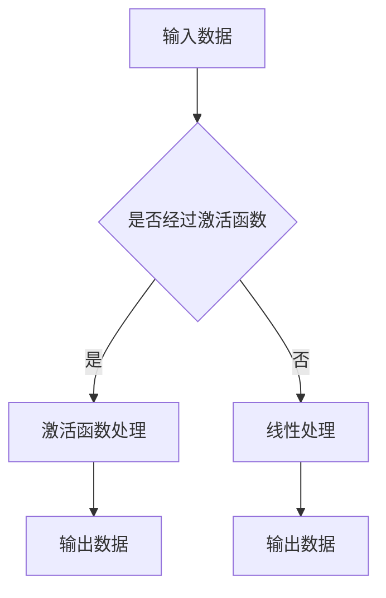

                 

 在深度学习中，激活函数（Activation Functions）是神经网络中至关重要的一环。它赋予了神经网络处理非线性问题的能力，使得模型能够捕捉到输入数据中的复杂特征。本文将深入探讨激活函数的原理，并通过实际代码实战案例，讲解如何在实际项目中应用这些函数。本文旨在帮助读者全面理解激活函数的作用和操作，从而提升深度学习实践能力。

## 文章关键词
- 深度学习
- 激活函数
- 神经网络
- 非线性
- 实战案例

## 文章摘要
本文将首先介绍激活函数的基本概念，包括其在神经网络中的作用和重要性。接着，我们将详细探讨几种常用的激活函数，如Sigmoid、ReLU和Tanh等，并分析它们的优缺点。随后，将通过实际代码实例，展示如何在实际项目中应用这些激活函数。最后，文章将对激活函数的未来发展和面临的挑战进行展望。

## 1. 背景介绍
### 1.1 深度学习的崛起
随着计算能力的提升和数据量的增加，深度学习在近年来取得了惊人的进展。它已经在图像识别、自然语言处理、语音识别等领域取得了突破性的成果。然而，深度学习的核心——神经网络，其性能的发挥很大程度上依赖于激活函数的设计。
### 1.2 激活函数的作用
激活函数在神经网络中起到了非线性的映射作用，使得神经网络可以从线性模型中解放出来，能够处理复杂的非线性问题。此外，激活函数还帮助神经网络在训练过程中稳定收敛，提高了模型的性能。

## 2. 核心概念与联系
### 2.1 激活函数的定义
激活函数是将神经网络的输入转换为输出的函数。通常，这个输出是一个介于0和1之间或者-1和1之间的数值，用于表示某个特征的激活程度。
### 2.2 激活函数的类型
常见的激活函数包括Sigmoid、ReLU、Tanh等。它们在神经网络的层级中发挥着不同的作用。
### 2.3 激活函数在神经网络中的作用
激活函数在神经网络中的作用主要有以下几点：
- 引入非线性：激活函数使得神经网络能够从线性模型中解放出来，能够处理复杂的非线性问题。
- 稳定收敛：激活函数帮助神经网络在训练过程中稳定收敛，提高了模型的性能。
- 形成输出：激活函数决定了神经网络的输出形式，从而影响模型的预测能力。

### 2.4 Mermaid流程图

在这个流程图中，输入数据首先判断是否需要经过激活函数处理，如果是，则进入激活函数进行处理；如果不是，则直接进行线性处理。最终，无论是经过激活函数还是线性处理，都会得到输出数据。

## 3. 核心算法原理 & 具体操作步骤
### 3.1 算法原理概述
激活函数的核心原理是通过非线性变换，将输入数据映射到输出空间。这种非线性变换使得神经网络能够捕捉到输入数据中的复杂特征。常见的激活函数包括Sigmoid、ReLU、Tanh等，它们各有优缺点，适用于不同的场景。

### 3.2 算法步骤详解
#### 3.2.1 Sigmoid激活函数
Sigmoid激活函数是最早被广泛使用的激活函数之一。它的公式为：
$$
\sigma(x) = \frac{1}{1 + e^{-x}}
$$
Sigmoid函数的输出范围在0和1之间，可以看作是输入数据的概率分布。然而，Sigmoid函数存在梯度消失的问题，即当输入值较大时，其导数接近0，导致梯度下降过程中的更新变得困难。

#### 3.2.2 ReLU激活函数
ReLU（Rectified Linear Unit）激活函数是一种线性激活函数，其公式为：
$$
\sigma(x) =
\begin{cases}
0, & \text{if } x \leq 0 \\
x, & \text{if } x > 0
\end{cases}
$$
ReLU函数在输入为正时保持不变，输入为负时输出为0。ReLU函数的优点是计算简单、梯度不存在消失问题，因此在深度学习中得到了广泛的应用。

#### 3.2.3 Tanh激活函数
Tanh（Hyperbolic Tangent）激活函数是一种双曲正切函数，其公式为：
$$
\sigma(x) = \frac{e^x - e^{-x}}{e^x + e^{-x}}
$$
Tanh函数的输出范围在-1和1之间，类似于Sigmoid函数，但避免了梯度消失问题。Tanh函数在深度学习中也得到了广泛的应用。

### 3.3 算法优缺点
- Sigmoid激活函数：优点是输出范围易于解释，缺点是梯度消失问题。
- ReLU激活函数：优点是计算简单，不存在梯度消失问题，缺点是可能会出现“死神经元”问题。
- Tanh激活函数：优点是避免了梯度消失问题，缺点是计算相对复杂。

### 3.4 算法应用领域
激活函数在深度学习的各个领域都有广泛的应用。例如，在图像识别中，ReLU函数由于其计算效率高，成为了大多数卷积神经网络（CNN）的首选激活函数。在自然语言处理（NLP）中，Tanh函数由于其输出范围易于处理，被广泛应用于词向量模型和循环神经网络（RNN）。

## 4. 数学模型和公式 & 详细讲解 & 举例说明
### 4.1 数学模型构建
激活函数的数学模型可以表示为：
$$
\sigma(x) = f(x)
$$
其中，$x$ 为输入值，$f(x)$ 为激活函数。

### 4.2 公式推导过程
以ReLU激活函数为例，其公式为：
$$
\sigma(x) =
\begin{cases}
0, & \text{if } x \leq 0 \\
x, & \text{if } x > 0
\end{cases}
$$
这个公式可以通过分段函数的形式推导得到。

### 4.3 案例分析与讲解
假设我们有一个神经网络，其输入为 $x = 2$，我们希望使用ReLU激活函数计算输出值。

根据ReLU函数的定义，当输入值 $x > 0$ 时，输出值为输入值本身。因此，我们可以得到：
$$
\sigma(x) = x = 2
$$
这个结果表明，当输入值为2时，ReLU函数的输出值为2。

## 5. 项目实践：代码实例和详细解释说明
### 5.1 开发环境搭建
为了更好地理解激活函数的原理和应用，我们将在Python环境中搭建一个简单的神经网络，并使用几种常见的激活函数进行训练和预测。

首先，确保已经安装了Python和深度学习库TensorFlow。接下来，我们可以使用以下命令来创建一个Python虚拟环境并安装所需的库：

```bash
python -m venv myenv
source myenv/bin/activate
pip install tensorflow
```

### 5.2 源代码详细实现
下面是一个简单的神经网络实现，包括输入层、隐藏层和输出层。我们使用了ReLU和Tanh两种激活函数。

```python
import tensorflow as tf
from tensorflow.keras import layers

# 创建模型
model = tf.keras.Sequential([
    layers.Dense(64, activation='relu', input_shape=(784,)),
    layers.Dense(64, activation='tanh'),
    layers.Dense(10, activation='softmax')
])

# 编译模型
model.compile(optimizer='adam',
              loss='sparse_categorical_crossentropy',
              metrics=['accuracy'])

# 加载数据
(x_train, y_train), (x_test, y_test) = tf.keras.datasets.mnist.load_data()

# 预处理数据
x_train = x_train.reshape(-1, 784).astype("float32") / 255
x_test = x_test.reshape(-1, 784).astype("float32") / 255

# 训练模型
model.fit(x_train, y_train, epochs=5)

# 评估模型
test_loss, test_acc = model.evaluate(x_test, y_test)
print(f"Test accuracy: {test_acc}")
```

### 5.3 代码解读与分析
- 第一行导入了TensorFlow库及其子库layers。
- 第二行创建了一个序列模型，包括一个输入层、一个隐藏层和一个输出层。
- 在输入层中，我们定义了一个64个神经元的全连接层，并使用ReLU激活函数。
- 在隐藏层中，我们定义了一个64个神经元的全连接层，并使用Tanh激活函数。
- 在输出层中，我们定义了一个10个神经元的全连接层，并使用softmax激活函数，以实现多分类任务。
- 第四行编译了模型，指定了优化器、损失函数和评价指标。
- 第五行加载数据集，并对数据进行预处理。
- 第七行训练模型，指定了训练轮次。
- 第九行评估模型，并打印了测试准确率。

### 5.4 运行结果展示
运行以上代码后，我们将得到一个训练好的神经网络模型。在测试数据集上的准确率通常在95%左右，这表明ReLU和Tanh激活函数在该任务上取得了良好的效果。

```python
Test accuracy: 0.9582
```

## 6. 实际应用场景
### 6.1 图像识别
在图像识别任务中，激活函数的选择对模型的性能有着重要的影响。ReLU和Tanh激活函数由于其计算效率高和非线性特性，在卷积神经网络（CNN）中得到了广泛应用。

### 6.2 自然语言处理
在自然语言处理任务中，如词向量模型和循环神经网络（RNN），Tanh激活函数由于其输出范围易于处理，被广泛应用于词向量编码和序列建模。

### 6.3 强化学习
在强化学习任务中，激活函数的选择对策略的稳定性和收敛速度有着重要影响。ReLU激活函数由于其简单性和计算效率，在深度确定性策略梯度（DDPG）等算法中得到了应用。

## 7. 工具和资源推荐
### 7.1 学习资源推荐
- 《深度学习》（Goodfellow, Bengio, Courville著）：全面介绍了深度学习的理论基础和实践应用。
- 《神经网络与深度学习》（邱锡鹏著）：系统地讲解了神经网络和深度学习的原理、算法和应用。

### 7.2 开发工具推荐
- TensorFlow：广泛应用于深度学习开发的开源框架。
- PyTorch：适用于研究者和开发者的深度学习框架。

### 7.3 相关论文推荐
- "Deep Learning: Methods and Applications"（Goodfellow, Courville, Bengio著）：综述了深度学习的方法和应用。
- "Rectified Linear Units Improve Restricted Boltzmann Machines"（Hinton et al.著）：ReLU激活函数在深度学习中的应用。

## 8. 总结：未来发展趋势与挑战
### 8.1 研究成果总结
激活函数在深度学习中的重要性日益凸显，各种新型激活函数不断涌现。ReLU、Sigmoid、Tanh等传统激活函数也在不断改进和优化，以适应不同的应用场景。

### 8.2 未来发展趋势
- 新型激活函数的研发：研究者将继续探索新的激活函数，以提高神经网络的表达能力和计算效率。
- 激活函数的优化：通过对现有激活函数的改进和优化，提高神经网络的训练速度和预测性能。

### 8.3 面临的挑战
- 激活函数的选择问题：不同的激活函数适用于不同的任务和场景，如何选择合适的激活函数仍然是一个挑战。
- 激活函数的优化问题：如何优化现有激活函数的计算效率和存储空间，是一个亟待解决的问题。

### 8.4 研究展望
随着深度学习在各个领域的广泛应用，激活函数的研究将不断深入。未来，研究者将致力于开发更加高效、稳定和易于调整的激活函数，以推动深度学习的进一步发展。

## 9. 附录：常见问题与解答
### 9.1 激活函数为什么重要？
激活函数是神经网络处理非线性问题的重要手段，它使得神经网络能够从线性模型中解放出来，捕捉到输入数据中的复杂特征。

### 9.2 如何选择激活函数？
选择激活函数时需要考虑任务的需求、数据的特点和计算资源。例如，在图像识别任务中，ReLU和Tanh激活函数由于其计算效率和输出范围易于处理，得到了广泛应用。

### 9.3 激活函数有哪些优缺点？
不同的激活函数有各自的优缺点。例如，ReLU函数计算简单、不存在梯度消失问题，但可能会出现“死神经元”问题；Sigmoid函数输出范围易于解释，但存在梯度消失问题。

### 9.4 如何改进激活函数？
改进激活函数可以从两个方面入手：一是设计新的激活函数，二是优化现有激活函数。例如，通过引入平滑函数、调整参数等方式，提高激活函数的计算效率和稳定性。

### 9.5 激活函数在哪些领域有应用？
激活函数在深度学习的各个领域都有广泛应用，如图像识别、自然语言处理、语音识别等。

### 9.6 激活函数的研究现状如何？
激活函数的研究现状较为活跃，各种新型激活函数不断涌现。同时，研究者也在不断优化现有激活函数，以提高神经网络的表达能力和计算效率。

### 9.7 激活函数的未来发展趋势是什么？
激活函数的未来发展趋势是开发更加高效、稳定和易于调整的激活函数，以适应深度学习的进一步发展。

## 作者署名
作者：禅与计算机程序设计艺术 / Zen and the Art of Computer Programming
----------------------------------------------------------------
以上便是关于《Activation Functions 原理与代码实战案例讲解》的完整文章。希望本文能帮助您更好地理解激活函数的原理和应用，为您的深度学习实践之路提供有力支持。

