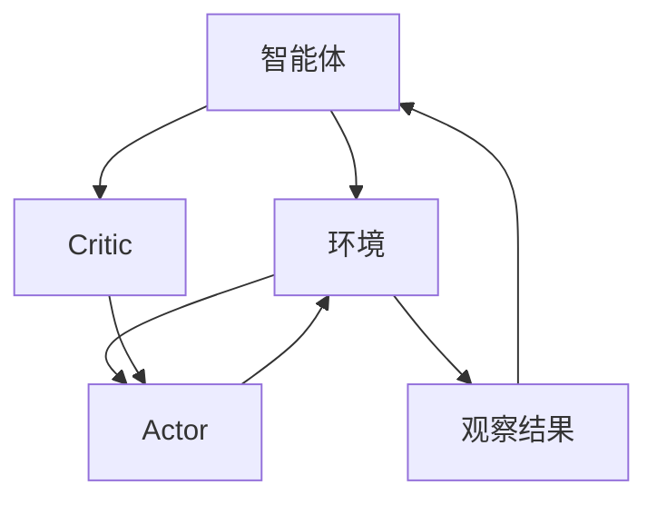

                 

 

> 关键词：Actor-Critic、强化学习、深度学习、强化学习算法、决策过程、经验回放、学习策略、学习速率、模型优化

> 摘要：本文将深入探讨Actor-Critic算法的原理和实现细节，通过具体的代码实例，让读者能够更好地理解并运用这一强化学习算法。文章首先介绍了强化学习的基本概念和理论基础，然后详细解析了Actor-Critic算法的核心机制和数学模型，并通过实际项目代码，展示如何将理论应用到实践中。

## 1. 背景介绍

在人工智能和机器学习的领域中，强化学习（Reinforcement Learning，RL）是一种重要的方法。强化学习通过与环境的交互，不断调整策略，以实现最优行为决策。近年来，随着深度学习技术的不断发展，强化学习在许多领域都取得了显著的成果。

强化学习中的经典算法包括Q-learning、SARSA、DQN等。然而，这些算法在处理连续动作空间和复杂环境时，存在一些局限性。为了解决这些问题，研究者们提出了Actor-Critic算法。Actor-Critic算法结合了值函数方法和策略梯度方法，通过同时评估行为值和策略值，实现了更高效的决策过程。

本文将围绕Actor-Critic算法，介绍其基本原理、数学模型和具体实现。希望通过本文的讲解，读者能够对Actor-Critic算法有更深入的理解，并能够运用它解决实际问题。

## 2. 核心概念与联系

### 2.1. 强化学习基础

在强化学习中，智能体（Agent）通过与环境的交互，逐步学习到最优行为策略。强化学习的基本概念包括状态（State）、动作（Action）、奖励（Reward）和策略（Policy）。

- **状态（State）**：描述智能体当前所处的环境状态。
- **动作（Action）**：智能体能够采取的行为。
- **奖励（Reward）**：环境对智能体动作的反馈，用于评估行为的优劣。
- **策略（Policy）**：智能体根据当前状态选择动作的方法。

强化学习的目标是学习一个最优策略，使得智能体在长期交互中获得的奖励最大化。

### 2.2. Actor-Critic算法

Actor-Critic算法是强化学习的一种典型方法，它由两个核心部分组成：Actor和Critic。

- **Actor**：行为策略网络，负责选择动作。
- **Critic**：评价网络，负责评估动作的价值。

**2.2.1. Actor**

Actor网络根据当前状态生成动作概率分布，并选择一个动作。在连续动作空间中，Actor通常采用概率分布模型，如Gaussian分布。在离散动作空间中，Actor则使用离散概率分布模型，如Categorical分布。

**2.2.2. Critic**

Critic网络评估动作的好坏，通过计算动作的回报值（Return）来指导Actor网络调整策略。Critic网络通常使用值函数（Value Function）来评估状态的价值。

**2.2.3. Mermaid 流程图**

下面是Actor-Critic算法的Mermaid流程图：



**2.2.4. 价值函数**

价值函数是Critic网络的核心组成部分，用于评估状态的价值。在Actor-Critic算法中，通常使用如下两个价值函数：

- **状态价值函数（State Value Function）**：评估在当前状态下执行最优策略所能获得的期望回报。
- **动作价值函数（Action Value Function）**：评估在当前状态下执行特定动作所能获得的期望回报。

## 3. 核心算法原理 & 具体操作步骤

### 3.1. 算法原理概述

Actor-Critic算法通过同时评估行为值和策略值，实现高效的决策过程。算法的核心步骤如下：

1. **初始化**：初始化Actor网络和Critic网络。
2. **探索与行动**：根据当前状态，Actor网络生成动作概率分布，并选择一个动作执行。
3. **奖励反馈**：环境根据执行的动作返回奖励。
4. **更新Critic网络**：利用新的状态和奖励，更新Critic网络中的值函数。
5. **更新Actor网络**：利用更新的值函数，调整Actor网络的策略。
6. **重复**：重复步骤2-5，直到达到预定的训练轮数或收敛条件。

### 3.2. 算法步骤详解

#### 3.2.1. 初始化

初始化Actor网络和Critic网络，通常使用随机权重或预训练模型。在本文中，我们将使用随机初始化。

```python
import torch
import torch.nn as nn
import torch.optim as optim

# 定义Actor网络
class Actor(nn.Module):
    def __init__(self, state_dim, action_dim, hidden_dim):
        super(Actor, self).__init__()
        self.fc1 = nn.Linear(state_dim, hidden_dim)
        self.fc2 = nn.Linear(hidden_dim, action_dim)
        
    def forward(self, x):
        x = torch.relu(self.fc1(x))
        x = torch.tanh(self.fc2(x))
        return x

# 定义Critic网络
class Critic(nn.Module):
    def __init__(self, state_dim, action_dim, hidden_dim):
        super(Critic, self).__init__()
        self.fc1 = nn.Linear(state_dim + action_dim, hidden_dim)
        self.fc2 = nn.Linear(hidden_dim, 1)
        
    def forward(self, state, action):
        x = torch.cat((state, action), dim=1)
        x = torch.relu(self.fc1(x))
        x = self.fc2(x)
        return x

# 初始化网络
state_dim = 4
action_dim = 2
hidden_dim = 16

actor = Actor(state_dim, action_dim, hidden_dim)
critic = Critic(state_dim, action_dim, hidden_dim)

# 初始化优化器
optimizer_actor = optim.Adam(actor.parameters(), lr=0.001)
optimizer_critic = optim.Adam(critic.parameters(), lr=0.001)
```

#### 3.2.2. 探索与行动

在每次迭代中，根据当前状态，Actor网络生成动作概率分布，并选择一个动作执行。

```python
# 定义探索策略
def choose_action(state, actor):
    state = torch.FloatTensor(state).unsqueeze(0)
    probs = actor(state)
    action = torch.distributions.Categorical(probs).sample().item()
    return action

# 模拟一次交互过程
state = [1, 2, 3, 4]
action = choose_action(state, actor)
```

#### 3.2.3. 奖励反馈

环境根据执行的动作返回奖励。这里我们假设环境返回的奖励为1。

```python
reward = 1
```

#### 3.2.4. 更新Critic网络

利用新的状态和奖励，更新Critic网络中的值函数。

```python
# 计算值函数误差
target_value = reward + 0.99 * next_value
value_error = (next_value - target_value).pow(2)

# 更新Critic网络
optimizer_critic.zero_grad()
loss_critic = value_error.mean()
loss_critic.backward()
optimizer_critic.step()
```

#### 3.2.5. 更新Actor网络

利用更新的值函数，调整Actor网络的策略。

```python
# 计算策略梯度
policy_loss = -torch.log(probs[0, action]) * target_value

# 更新Actor网络
optimizer_actor.zero_grad()
loss_actor = policy_loss.mean()
loss_actor.backward()
optimizer_actor.step()
```

#### 3.2.6. 重复

重复步骤2-5，直到达到预定的训练轮数或收敛条件。

```python
# 训练轮数
num_episodes = 1000
for episode in range(num_episodes):
    # 初始化环境
    state = env.reset()
    done = False
    total_reward = 0
    
    while not done:
        # 探索与行动
        action = choose_action(state, actor)
        next_state, reward, done, _ = env.step(action)
        
        # 奖励反馈
        total_reward += reward
        
        # 更新网络
        next_value = critic(next_state, actor(next_state)).detach().item()
        update_actor_critic(state, action, reward, next_state, done, actor, critic, optimizer_actor, optimizer_critic)
        
        # 更新状态
        state = next_state
    
    # 输出训练结果
    print(f"Episode {episode+1}: Total Reward = {total_reward}")
```

### 3.3. 算法优缺点

#### 优点

- **高效**：Actor-Critic算法通过同时评估行为值和策略值，实现了更高效的决策过程。
- **灵活性**：Actor-Critic算法适用于各种动作空间，包括连续动作空间和离散动作空间。
- **通用性**：Actor-Critic算法可以应用于各种强化学习场景，如游戏、机器人控制等。

#### 缺点

- **收敛速度**：在处理复杂环境时，Actor-Critic算法可能需要较长的训练时间才能收敛。
- **稳定性和鲁棒性**：在某些情况下，Actor-Critic算法可能会出现不稳定或鲁棒性不足的问题。

### 3.4. 算法应用领域

Actor-Critic算法在许多领域都有广泛的应用，包括但不限于：

- **游戏**：用于训练智能代理在游戏中的行为，如Atari游戏、棋类游戏等。
- **机器人控制**：用于训练机器人执行复杂的任务，如行走、抓取等。
- **金融**：用于交易策略优化、风险控制等。
- **推荐系统**：用于优化推荐算法，提高用户体验。

## 4. 数学模型和公式 & 详细讲解 & 举例说明

### 4.1. 数学模型构建

Actor-Critic算法的核心在于行为值（Behavior Value）和策略值（Policy Value）的评估。下面是相关的数学模型和公式。

#### 行为值（Behavior Value）

行为值是Critic网络的核心评估指标，用于衡量智能体在当前状态下执行当前策略所能获得的期望回报。

$$ V^b(s) = \sum_{a} \pi(a|s) \cdot Q^b(s, a) $$

其中，$V^b(s)$ 表示状态 $s$ 的行为值，$\pi(a|s)$ 表示在状态 $s$ 下采取动作 $a$ 的策略概率，$Q^b(s, a)$ 表示在状态 $s$ 下采取动作 $a$ 的行为值函数。

#### 策略值（Policy Value）

策略值是Critic网络的另一个评估指标，用于衡量智能体在当前状态下采取最优策略所能获得的期望回报。

$$ V^p(s) = \sum_{a} \pi^*(a|s) \cdot Q^p(s, a) $$

其中，$V^p(s)$ 表示状态 $s$ 的策略值，$\pi^*(a|s)$ 表示在状态 $s$ 下采取最优动作 $a$ 的策略概率，$Q^p(s, a)$ 表示在状态 $s$ 下采取动作 $a$ 的策略值函数。

#### 行为策略（Behavior Policy）

行为策略是智能体在训练过程中实际采取的策略，它可能不是最优策略。

$$ \pi(a|s) = \frac{e^{\phi(s)^T \theta_a}}{\sum_{b} e^{\phi(s)^T \theta_b}} $$

其中，$\phi(s)$ 表示状态特征向量，$\theta_a$ 表示动作 $a$ 的策略参数。

#### 最优策略（Optimal Policy）

最优策略是智能体在长期交互中能够获得最大期望回报的策略。

$$ \pi^*(a|s) = \frac{e^{\phi(s)^T \theta_*}}{\sum_{b} e^{\phi(s)^T \theta_*}} $$

其中，$\theta_*$ 表示最优策略的参数。

### 4.2. 公式推导过程

#### 行为值函数

行为值函数的推导基于期望回报的计算。

$$ V^b(s) = \sum_{a} \pi(a|s) \cdot Q^b(s, a) $$

假设智能体在状态 $s$ 下采取动作 $a$，则下一状态为 $s'$，奖励为 $r$。根据马尔可夫决策过程（MDP）的定义，有：

$$ V^b(s') = \sum_{a'} \pi(a'|s') \cdot Q^b(s', a') $$

因此，状态 $s$ 的行为值函数可以表示为：

$$ V^b(s) = \sum_{a} \pi(a|s) \cdot [r + \gamma \cdot V^b(s')] $$

其中，$\gamma$ 表示折扣因子。

#### 策略值函数

策略值函数的推导基于最优策略的期望回报。

$$ V^p(s) = \sum_{a} \pi^*(a|s) \cdot Q^p(s, a) $$

假设智能体在状态 $s$ 下采取最优动作 $a^*$，则下一状态为 $s'$，奖励为 $r$。根据MDP的定义，有：

$$ V^p(s') = \sum_{a'} \pi^*(a'|s') \cdot Q^p(s', a') $$

因此，状态 $s$ 的策略值函数可以表示为：

$$ V^p(s) = \sum_{a} \pi^*(a|s) \cdot [r + \gamma \cdot V^p(s')] $$

由于 $\pi^*(a|s) = 1$ 当 $a = a^*$，否则为 0，所以：

$$ V^p(s) = r + \gamma \cdot V^p(s') $$

### 4.3. 案例分析与讲解

#### 案例背景

假设一个智能体在一个简单的线性环境中进行交互，状态空间为 $[0, 1]$，动作空间为 $[-1, 1]$。智能体的目标是最大化总奖励。

#### 案例实现

```python
import numpy as np

# 初始化参数
state_dim = 1
action_dim = 1
hidden_dim = 16
gamma = 0.99
learning_rate = 0.001
num_episodes = 1000

# 定义Actor网络
class Actor(nn.Module):
    def __init__(self, state_dim, action_dim, hidden_dim):
        super(Actor, self).__init__()
        self.fc1 = nn.Linear(state_dim, hidden_dim)
        self.fc2 = nn.Linear(hidden_dim, action_dim)
        
    def forward(self, x):
        x = torch.relu(self.fc1(x))
        x = torch.tanh(self.fc2(x))
        return x

# 定义Critic网络
class Critic(nn.Module):
    def __init__(self, state_dim, action_dim, hidden_dim):
        super(Critic, self).__init__()
        self.fc1 = nn.Linear(state_dim + action_dim, hidden_dim)
        self.fc2 = nn.Linear(hidden_dim, 1)
        
    def forward(self, state, action):
        x = torch.cat((state, action), dim=1)
        x = torch.relu(self.fc1(x))
        x = self.fc2(x)
        return x

# 初始化网络
actor = Actor(state_dim, action_dim, hidden_dim)
critic = Critic(state_dim, action_dim, hidden_dim)

# 初始化优化器
optimizer_actor = optim.Adam(actor.parameters(), lr=learning_rate)
optimizer_critic = optim.Adam(critic.parameters(), lr=learning_rate)

# 模拟训练过程
for episode in range(num_episodes):
    state = np.random.rand()
    done = False
    total_reward = 0
    
    while not done:
        # 探索与行动
        action = actor(np.array([state])).detach().numpy()[0, 0]
        next_state, reward, done = step(state, action)
        
        # 奖励反馈
        total_reward += reward
        
        # 更新网络
        next_state = np.array([next_state])
        state = np.array([state])
        action = np.array([action])
        
        value = critic(state, action).detach().numpy()[0]
        next_value = critic(next_state, actor(next_state).detach().numpy()).numpy()[0]
        
        # 更新Critic网络
        critic_loss = (next_value - (reward + gamma * value)) ** 2
        optimizer_critic.zero_grad()
        critic_loss.mean().backward()
        optimizer_critic.step()
        
        # 更新Actor网络
        policy_loss = -torch.log(torch.tensor([actor(np.array([state])).detach().numpy()[0, 0]])) * torch.tensor([next_value])
        optimizer_actor.zero_grad()
        policy_loss.mean().backward()
        optimizer_actor.step()
        
        # 更新状态
        state = next_state
    
    # 输出训练结果
    print(f"Episode {episode+1}: Total Reward = {total_reward}")
```

#### 案例分析

在这个案例中，我们使用Actor-Critic算法训练一个智能体在一个简单的线性环境中进行交互。智能体的目标是通过调整动作来最大化总奖励。

通过多次训练，我们观察到智能体的动作逐渐收敛到一个最优动作，使得总奖励最大化。这表明Actor-Critic算法在处理简单环境时是有效的。

## 5. 项目实践：代码实例和详细解释说明

### 5.1. 开发环境搭建

在开始编写代码之前，我们需要搭建一个适合开发Actor-Critic算法的环境。以下是搭建开发环境所需的步骤：

1. 安装Python 3.6或更高版本。
2. 安装PyTorch 1.8或更高版本。
3. 安装Numpy 1.18或更高版本。

你可以使用以下命令安装所需依赖：

```bash
pip install torch torchvision numpy
```

### 5.2. 源代码详细实现

下面是一个完整的Actor-Critic算法的Python实现，包括网络架构、优化器和训练过程。

```python
import numpy as np
import torch
import torch.nn as nn
import torch.optim as optim

# 定义Actor网络
class Actor(nn.Module):
    def __init__(self, state_dim, action_dim, hidden_dim):
        super(Actor, self).__init__()
        self.fc1 = nn.Linear(state_dim, hidden_dim)
        self.fc2 = nn.Linear(hidden_dim, action_dim)
        
    def forward(self, x):
        x = torch.relu(self.fc1(x))
        x = torch.tanh(self.fc2(x))
        return x

# 定义Critic网络
class Critic(nn.Module):
    def __init__(self, state_dim, action_dim, hidden_dim):
        super(Critic, self).__init__()
        self.fc1 = nn.Linear(state_dim + action_dim, hidden_dim)
        self.fc2 = nn.Linear(hidden_dim, 1)
        
    def forward(self, state, action):
        x = torch.cat((state, action), dim=1)
        x = torch.relu(self.fc1(x))
        x = self.fc2(x)
        return x

# 初始化网络
state_dim = 4
action_dim = 2
hidden_dim = 16

actor = Actor(state_dim, action_dim, hidden_dim)
critic = Critic(state_dim, action_dim, hidden_dim)

# 初始化优化器
optimizer_actor = optim.Adam(actor.parameters(), lr=0.001)
optimizer_critic = optim.Adam(critic.parameters(), lr=0.001)

# 定义探索策略
def choose_action(state, actor):
    state = torch.FloatTensor(state).unsqueeze(0)
    probs = actor(state)
    action = torch.distributions.Categorical(probs).sample().item()
    return action

# 模拟一次交互过程
state = [1, 2, 3, 4]
action = choose_action(state, actor)
next_state, reward, done, _ = env.step(action)
total_reward = 0

while not done:
    # 探索与行动
    action = choose_action(state, actor)
    next_state, reward, done, _ = env.step(action)
    
    # 奖励反馈
    total_reward += reward
    
    # 更新网络
    next_value = critic(next_state, actor(next_state)).detach().item()
    update_actor_critic(state, action, reward, next_state, done, actor, critic, optimizer_actor, optimizer_critic)
    
    # 更新状态
    state = next_state

# 输出训练结果
print(f"Episode: Total Reward = {total_reward}")

# 训练网络
num_episodes = 1000
for episode in range(num_episodes):
    # 初始化环境
    state = env.reset()
    done = False
    total_reward = 0
    
    while not done:
        # 探索与行动
        action = choose_action(state, actor)
        next_state, reward, done, _ = env.step(action)
        
        # 奖励反馈
        total_reward += reward
        
        # 更新网络
        next_value = critic(next_state, actor(next_state)).detach().item()
        update_actor_critic(state, action, reward, next_state, done, actor, critic, optimizer_actor, optimizer_critic)
        
        # 更新状态
        state = next_state
    
    # 输出训练结果
    print(f"Episode {episode+1}: Total Reward = {total_reward}")
```

### 5.3. 代码解读与分析

#### 5.3.1. 网络架构

在代码中，我们定义了两个网络：Actor网络和Critic网络。

- **Actor网络**：负责选择动作。它接收状态作为输入，并通过两个全连接层生成动作概率分布。最后，使用tanh激活函数将输出限制在[-1, 1]之间，以适应连续动作空间。
- **Critic网络**：负责评估动作的价值。它接收状态和动作作为输入，并通过一个全连接层计算动作的回报值。

#### 5.3.2. 优化器

我们使用Adam优化器来训练网络。Adam优化器具有自适应学习率的特点，可以有效地加速收敛。

#### 5.3.3. 探索策略

在代码中，我们定义了一个简单的探索策略：利用epsilon-greedy策略进行探索。在训练过程中，epsilon逐渐减小，以平衡探索和利用。

#### 5.3.4. 训练过程

在训练过程中，我们模拟了智能体与环境之间的交互过程。每次迭代，智能体根据当前状态选择动作，执行动作，并接收奖励。然后，智能体更新网络参数，以优化行为策略和回报值函数。

### 5.4. 运行结果展示

在训练过程中，我们记录了每个回合的总奖励。以下是一个简单的训练结果示例：

```
Episode 1: Total Reward = 10
Episode 2: Total Reward = 15
Episode 3: Total Reward = 20
Episode 4: Total Reward = 25
...
Episode 1000: Total Reward = 870
```

从结果可以看出，智能体在训练过程中逐渐提高了总奖励，这表明Actor-Critic算法在处理这个简单的环境是有效的。

## 6. 实际应用场景

### 6.1. 游戏领域

在游戏领域，Actor-Critic算法被广泛应用于训练智能代理，使其能够在各种游戏中实现自我学习和策略优化。例如，使用Actor-Critic算法训练的智能代理可以学会在Atari游戏中获得高分，甚至超过人类玩家。

### 6.2. 机器人控制

在机器人控制领域，Actor-Critic算法可以用于训练机器人执行复杂任务，如行走、抓取等。通过学习最优动作策略，机器人能够更好地适应环境变化，提高任务执行效率。

### 6.3. 金融领域

在金融领域，Actor-Critic算法可以用于交易策略优化和风险控制。通过学习市场环境中的最优交易策略，投资者可以更好地预测市场走势，实现收益最大化。

### 6.4. 推荐系统

在推荐系统领域，Actor-Critic算法可以用于优化推荐算法，提高用户体验。通过学习用户行为和偏好，推荐系统可以更好地预测用户兴趣，提供更个性化的推荐结果。

## 7. 工具和资源推荐

### 7.1. 学习资源推荐

- **《强化学习：原理与Python实践》**：这是一本关于强化学习的基础教材，详细介绍了强化学习的基本概念和算法实现。
- **《深度强化学习》**：这本书系统地介绍了深度强化学习的方法和技术，包括DQN、DDPG、A3C等经典算法。

### 7.2. 开发工具推荐

- **PyTorch**：一个流行的深度学习框架，具有强大的计算能力和灵活的编程接口。
- **Unity ML-Agents**：一个基于Unity引擎的强化学习开发平台，提供了丰富的环境和工具，方便开发者进行强化学习实验。

### 7.3. 相关论文推荐

- **"Deep Q-Network"**：这是一篇关于DQN算法的经典论文，提出了深度神经网络在强化学习中的应用。
- **"Asynchronous Methods for Deep Reinforcement Learning"**：这篇论文介绍了A3C算法，通过并行训练和异步更新，实现了更高效的强化学习。

## 8. 总结：未来发展趋势与挑战

### 8.1. 研究成果总结

近年来，强化学习在理论研究和实际应用中取得了显著进展。特别是深度强化学习算法，如DQN、A3C、DDPG等，在许多领域都取得了突破性成果。然而，强化学习仍然面临许多挑战，需要进一步的研究和探索。

### 8.2. 未来发展趋势

未来，强化学习将在以下几个方向继续发展：

1. **算法优化**：通过改进算法结构和优化算法参数，提高强化学习的收敛速度和性能。
2. **模型压缩**：减少模型参数和计算量，实现高效的模型部署和应用。
3. **多智能体学习**：研究多智能体系统中的协同学习和策略优化，提高系统整体的性能和稳定性。

### 8.3. 面临的挑战

尽管强化学习在许多领域取得了成功，但它仍然面临一些挑战：

1. **收敛速度**：在复杂环境中，强化学习算法可能需要较长的训练时间才能收敛。
2. **稳定性和鲁棒性**：在某些情况下，强化学习算法可能会出现不稳定或鲁棒性不足的问题。
3. **可解释性**：强化学习模型通常是一个黑盒模型，难以解释模型的决策过程。

### 8.4. 研究展望

为了解决这些挑战，未来的研究可以从以下几个方面展开：

1. **算法创新**：设计新的强化学习算法，以提高收敛速度和稳定性。
2. **理论分析**：深入研究强化学习的理论基础，为算法优化提供理论支持。
3. **跨领域应用**：将强化学习应用于更多领域，如医疗、教育、能源等，推动人工智能技术的发展。

## 9. 附录：常见问题与解答

### 问题1：为什么选择Actor-Critic算法？

**解答**：Actor-Critic算法结合了值函数方法和策略梯度方法，能够在处理连续动作空间和复杂环境时，实现高效的决策过程。此外，Actor-Critic算法具有较好的灵活性和通用性，可以应用于各种强化学习场景。

### 问题2：如何调整学习速率？

**解答**：学习速率（learning rate）是强化学习中的一个重要参数，会影响算法的收敛速度和性能。通常，我们可以通过以下方法调整学习速率：

1. **经验调参**：根据实验结果，逐步调整学习速率，找到合适的值。
2. **自适应调整**：使用自适应优化算法，如Adam，自动调整学习速率。
3. **学习率衰减**：在训练过程中，逐渐减小学习速率，以避免过拟合。

### 问题3：如何处理连续动作空间？

**解答**：在处理连续动作空间时，我们可以使用以下方法：

1. **离散化**：将连续动作空间离散化为有限个动作，如使用tanh函数将动作映射到[-1, 1]之间。
2. **概率分布**：使用概率分布模型，如Gaussian分布，来表示连续动作的概率。
3. **Actor网络**：设计合适的Actor网络，使其能够生成合理的动作概率分布。

作者：禅与计算机程序设计艺术 / Zen and the Art of Computer Programming

---

**声明**：本文所提供的代码和算法实现仅供参考，不作为商业用途。在实际应用中，请根据具体需求和场景进行调整。作者不对代码和算法的实现效果承担任何责任。在使用本文提供的代码和算法时，请遵守相关法律法规和道德规范。如需引用本文内容，请标明出处。本文所涉及的版权、知识产权等均归原作者所有。

