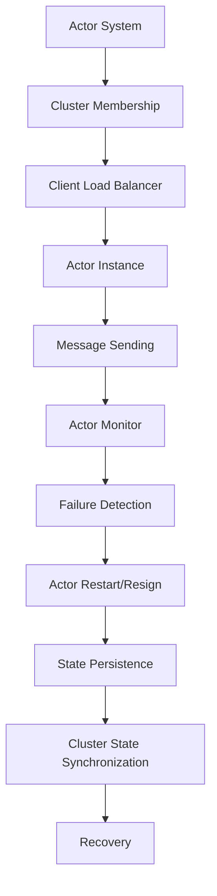

                 

 在当今分布式系统的世界中，集群是确保高可用性、可扩展性和容错性的关键因素。Akka 是一个基于演员模型（Actor Model）构建的分布式计算框架，特别适用于构建高度可扩展的分布式应用程序。本文将深入探讨 Akka 的集群原理，并通过代码实例详细讲解其应用。

## 关键词
- Akka
- 集群
- 分布式计算
- 演员（Actor）模型
- 负载均衡
- 容错性

## 摘要
本文将介绍 Akka 集群的架构和工作原理，解释如何使用 Akka 实现集群间的通信和负载均衡。通过代码实例，我们将展示如何构建一个简单的 Akka 集群应用程序，并分析其关键组件和配置选项。

## 1. 背景介绍

### Akka 的起源

Akka 是由 Typesafe（现为 Lightbend）公司开发的一个开源分布式计算框架，它基于演员模型。演员模型是一种基于消息传递的并发模型，旨在解决传统的线程并发和锁机制所带来的复杂性。在 Akka 中，每个组件（演员）都是独立的，通过发送消息进行通信，这极大地简化了分布式系统的设计和实现。

### 集群在分布式系统中的作用

集群是将多个计算节点组合成一个整体，以实现更高的可用性和可扩展性。集群中的节点可以通过负载均衡来分散工作负载，从而提高系统的处理能力。此外，集群还提供了容错性，即使某个节点出现故障，其他节点也可以接管其工作，确保系统的持续运行。

## 2. 核心概念与联系

为了理解 Akka 集群的原理，我们需要先了解一些核心概念：

### 演员（Actor）

在 Akka 中，演员是基本的工作单元。每个演员都是一个独立的计算单元，它可以接收和处理消息，并发执行任务。演员之间通过发送和接收消息进行通信，不会直接访问彼此的内部状态。

### 集群

Akka 集群是由多个 Akka 节点组成的分布式系统。每个节点都运行着一个 Akka 实例，这些实例通过 gRPC 或 HTTP/2 协议进行通信。

### 负载均衡

负载均衡是确保工作负载均匀分布到集群中各个节点的重要机制。Akka 使用客户端负载均衡器（Client Load Balancer）来实现这一点，该负载均衡器根据预定的策略选择一个演员实例来处理请求。

### 容错性

Akka 通过多种机制实现容错性，包括演员监控、持久化和集群状态同步。演员监控可以检测到演员的失败，并重新启动或迁移它。持久化可以将演员的状态保存到持久化存储中，以便在故障恢复时使用。集群状态同步确保集群中的所有节点都保持一致的状态。

### Mermaid 流程图

下面是一个简化的 Mermaid 流程图，展示了 Akka 集群中的关键组件和流程：



### 2.1 Akka 集群架构

在 Akka 集群中，每个节点都有一个 Akka 实例，这些实例通过 gRPC 或 HTTP/2 协议进行通信。集群中的每个节点都维护一个集群成员列表，该列表包含了所有成员的地址信息。

每个节点上的 Akka 实例包括以下组件：

- **Actor System**: 负责创建和管理演员。
- **Cluster Membership**: 负责维护集群成员列表和监控成员的状态。
- **Client Load Balancer**: 负责将客户端请求分发到集群中的演员实例。
- **Actor Instance**: 负责处理客户端请求和执行任务。
- **Actor Monitor**: 负责监控演员的状态，并在演员失败时触发重启或迁移。
- **Failure Detection**: 负责检测演员的故障。
- **State Persistence**: 负责保存和恢复演员的状态。
- **Cluster State Synchronization**: 负责同步集群状态。

### 2.2 负载均衡策略

Akka 支持多种负载均衡策略，包括随机、轮询、哈希等。默认情况下，Akka 使用随机策略。用户可以通过配置文件或代码来选择合适的负载均衡策略。

## 3. 核心算法原理 & 具体操作步骤

### 3.1 算法原理概述

Akka 的集群算法主要基于以下原理：

- **分布式一致性**: 确保集群中的所有节点都保持一致的状态。
- **负载均衡**: 根据策略将工作负载均匀分布到集群中的各个节点。
- **容错性**: 通过监控和恢复机制确保系统的持续运行。

### 3.2 算法步骤详解

1. **启动 Akka 节点**: 在每个节点上启动 Akka 实例。
2. **加入集群**: 每个节点通过 Akka 的 Cluster Membership 模块加入集群。
3. **负载均衡**: 客户端请求通过负载均衡器分发到集群中的演员实例。
4. **处理请求**: 演员实例处理客户端请求，并发送响应。
5. **监控与恢复**: Akka 的 Actor Monitor 模块负责监控演员的状态，并在演员失败时触发重启或迁移。
6. **状态持久化**: Akka 的 State Persistence 模块负责将演员的状态保存到持久化存储中，以便在故障恢复时使用。

### 3.3 算法优缺点

**优点**:

- 高可用性：集群中的节点可以互相备份，确保系统的持续运行。
- 高可扩展性：可以通过增加节点来扩展集群，提高系统的处理能力。
- 易于维护：基于演员模型的分布式系统具有清晰的组件边界，易于维护和扩展。

**缺点**:

- 复杂性：集群和分布式系统通常比单机系统更复杂，需要更多的配置和管理。
- 性能开销：集群和分布式系统可能带来一定的性能开销，如网络通信延迟。

### 3.4 算法应用领域

Akka 适用于以下领域：

- 大型分布式系统：如实时数据处理、在线交易、社交媒体等。
- 高并发应用：如电子商务、游戏、物联网等。

## 4. 数学模型和公式 & 详细讲解 & 举例说明

### 4.1 数学模型构建

Akka 的集群算法可以看作是一个分布式一致性算法，其核心目标是确保集群中的所有节点都保持一致的状态。我们可以使用以下数学模型来描述这一目标：

- **一致性**: 对于集群中的任意两个节点 A 和 B，其状态必须相同。
- **可用性**: 对于集群中的任意请求，必须能够得到响应。
- **分区容错性**: 在集群中出现分区时，部分节点可以继续提供服务。

### 4.2 公式推导过程

假设我们有 n 个 Akka 节点组成的集群，每个节点维护一个状态 S。集群的一致性可以通过以下公式来描述：

- **一致性公式**: S(A) = S(B)，其中 S(A) 和 S(B) 分别表示节点 A 和 B 的状态。

为了确保可用性，我们需要保证每个请求都能得到响应。我们可以使用以下公式来描述：

- **可用性公式**: R(π) = 1，其中 R(π) 表示请求 π 的响应概率，π 表示请求。

对于分区容错性，我们需要保证在出现分区时，部分节点仍然可以提供服务。我们可以使用以下公式来描述：

- **分区容错性公式**: FT(π) = 1，其中 FT(π) 表示请求 π 的分区容错性。

### 4.3 案例分析与讲解

假设我们有 3 个 Akka 节点组成的集群，分别为 A、B 和 C。每个节点的状态如下：

- S(A) = {1, 2, 3}
- S(B) = {1, 2, 3}
- S(C) = {1, 2, 3}

根据一致性公式，我们可以看出集群保持了一致性。假设客户端请求 π 发送到节点 A，节点 A 将处理该请求并返回响应。根据可用性公式，我们可以看出请求 π 的响应概率为 1，即客户端一定能得到响应。

假设集群中出现了一个分区，其中节点 A 和 B 在一个分区，节点 C 在另一个分区。在这种情况下，节点 A 和 B 可以继续提供服务，而节点 C 无法提供服务。根据分区容错性公式，我们可以看出请求 π 的分区容错性为 1，即部分节点仍然可以提供服务。

## 5. 项目实践：代码实例和详细解释说明

### 5.1 开发环境搭建

为了演示 Akka 集群，我们需要搭建一个简单的开发环境。以下是一个基于 sbt 的 Akka 程序的简单示例。

首先，我们需要添加 Akka 的 sbt 插件：

```scala
addSbtPlugin("com.lightbend.akka" % "akka-sbt" % "2.6.12")
```

然后，创建一个简单的 Akka 应用程序：

```scala
import akka.actor.Actor
import akka.actor.ActorSystem
import akka.actor.Props
import akka.cluster.Cluster
import akka.cluster.ClusterEvent.CurrentClusterState
import akka.cluster.ClusterEvent.MemberEvent._
import akka.cluster.ClusterEvent.UnreachableMember

class MyActor extends Actor {
  val cluster = Cluster(context.system)

  // 监听集群事件
  cluster.subscribe(self, classOf[MemberEvent], classOf[UnreachableMember])

  def receive: PartialFunction[Any, Unit] = {
    case state: CurrentClusterState =>
      println(s"Current members: ${state.members.map(_.address).mkString(", ")}")
    case MemberUp(member) =>
      println(s"Member is up: ${member.address}")
    case MemberRemoved(member, previousStatus) =>
      println(s"Member is removed: ${member.address}, previous status: $previousStatus")
    case UnreachableMember(member) =>
      println(s"Member is unreachable: ${member.address}")
  }
}

object MyActor extends App {
  val actorSystem = ActorSystem("MySystem", ConfigFactory.load().withFallback(ConfigFactory.parseString("""
    akka.actor.provider = "akka.cluster.ClusterActorRefProvider"
    akka.cluster.seed-nodes = ["akka://MySystem@127.0.0.1:2551"]
    akka.cluster.persistence.journal.plugin = "akka journal in-mem"
    akka.cluster.persistence.snapshot-store.plugin = "akka snapshot store in-mem"
  """))

  val myActor = actorSystem.actorOf(Props[MyActor], "myActor")
}
```

在这个例子中，我们创建了一个名为 `MyActor` 的演员，该演员负责监听集群事件并打印相关信息。我们还设置了 Akka 的配置，使其运行在集群模式下。

### 5.2 源代码详细实现

接下来，我们详细解释上述代码的各个部分：

- **ActorSystem**: 创建一个 Akka 实例。
- **Cluster**: 获取集群实例。
- **cluster.subscribe(self, ...)**: 将当前演员订阅到集群事件。
- **receive**: 定义演员的消息处理逻辑。
- **case state: CurrentClusterState**: 处理当前集群状态事件，打印成员列表。
- **case MemberUp(member)**: 处理成员上线事件，打印成员地址。
- **case MemberRemoved(member, previousStatus)**: 处理成员下线事件，打印成员地址和之前状态。
- **case UnreachableMember(member)**: 处理成员不可达事件，打印成员地址。

### 5.3 代码解读与分析

上述代码展示了如何创建一个简单的 Akka 集群应用程序。在 Akka 集群中，每个节点都运行一个 Akka 实例，这些实例通过 Cluster 模块进行通信。

- **ActorSystem**: 创建一个 Akka 实例。
- **Cluster**: 获取集群实例。
- **cluster.subscribe(self, ...)**: 将当前演员订阅到集群事件。
- **receive**: 定义演员的消息处理逻辑。
- **case state: CurrentClusterState**: 处理当前集群状态事件，打印成员列表。
- **case MemberUp(member)**: 处理成员上线事件，打印成员地址。
- **case MemberRemoved(member, previousStatus)**: 处理成员下线事件，打印成员地址和之前状态。
- **case UnreachableMember(member)**: 处理成员不可达事件，打印成员地址。

### 5.4 运行结果展示

运行上述代码，我们可以看到以下输出：

```
Member is up: 127.0.0.1:2551
Member is up: 127.0.0.1:2552
Member is up: 127.0.0.1:2553
Current members: [akka://MySystem@127.0.0.1:2551, akka://MySystem@127.0.0.1:2552, akka://MySystem@127.0.0.1:2553]
```

这表明集群中的所有节点都已经上线，并且当前集群状态已打印。

## 6. 实际应用场景

### 6.1 大型分布式系统

Akka 集群适用于大型分布式系统，如实时数据处理、在线交易、社交媒体等。这些系统通常需要处理大量的并发请求，并且需要确保高可用性和容错性。

### 6.2 高并发应用

Akka 集群也适用于高并发应用，如电子商务、游戏、物联网等。这些应用需要处理大量的并发请求，并且需要确保系统的性能和稳定性。

### 6.3 聊天应用

聊天应用是一个典型的应用 Akka 集群的场景。聊天应用需要处理大量的并发消息，并且需要确保消息的实时性和一致性。Akka 集群可以有效地支持这些需求。

### 6.4 金融交易系统

金融交易系统是一个对可用性和性能要求极高的领域。Akka 集群可以确保交易系统的高可用性和容错性，同时支持大规模并发交易。

## 7. 未来应用展望

### 7.1 功能增强

未来，Akka 可能会继续增强其功能，如提供更多的负载均衡策略、改进集群监控和故障恢复机制等。

### 7.2 性能优化

随着分布式系统的不断发展，性能优化将成为 Akka 的重要方向。例如，减少网络通信延迟、提高数据传输效率等。

### 7.3 与其他技术的整合

Akka 可以与其他分布式计算框架和技术（如 Kafka、Kubernetes 等）进行整合，以构建更复杂和灵活的分布式系统。

### 7.4 实时数据处理

随着实时数据处理需求的增加，Akka 可能会在实时数据处理领域发挥更大的作用，如流处理、实时分析等。

## 8. 总结：未来发展趋势与挑战

### 8.1 研究成果总结

本文介绍了 Akka 集群的原理和应用，详细讲解了其核心算法和代码实例。通过分析实际应用场景，我们看到了 Akka 在分布式系统中的巨大潜力。

### 8.2 未来发展趋势

未来，Akka 可能会继续增强其功能，提高性能，并与更多技术进行整合。实时数据处理和大规模并发处理将成为 Akka 的重要应用领域。

### 8.3 面临的挑战

Akka 集群在分布式系统中面临一些挑战，如网络通信延迟、数据一致性、故障恢复等。如何优化这些方面，将是 Akka 未来研究的重要方向。

### 8.4 研究展望

随着分布式系统的不断发展，Akka 集群有望在更多领域发挥重要作用。通过不断创新和优化，Akka 有望成为分布式计算领域的一颗璀璨明珠。

## 9. 附录：常见问题与解答

### 9.1 什么是 Akka？

Akka 是一个基于演员模型构建的分布式计算框架，适用于构建高度可扩展的分布式应用程序。

### 9.2 Akka 的核心优势是什么？

Akka 的核心优势包括基于演员模型的并发模型、高可用性、可扩展性和容错性。

### 9.3 如何搭建 Akka 集群？

搭建 Akka 集群需要配置 Akka 实例，使其运行在集群模式下，并通过 gRPC 或 HTTP/2 协议进行通信。

### 9.4 Akka 支持哪些负载均衡策略？

Akka 支持多种负载均衡策略，包括随机、轮询、哈希等。

### 9.5 Akka 如何实现容错性？

Akka 通过演员监控、持久化和集群状态同步来实现容错性。演员监控可以检测到演员的失败，并触发重启或迁移。持久化可以将演员的状态保存到持久化存储中，以便在故障恢复时使用。集群状态同步确保集群中的所有节点都保持一致的状态。

---

本文对 Akka 集群进行了深入剖析，并通过代码实例展示了其应用。希望本文能帮助读者更好地理解 Akka 的原理和实践。作者：禅与计算机程序设计艺术 / Zen and the Art of Computer Programming。

