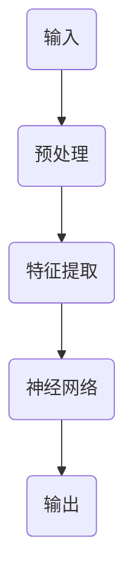
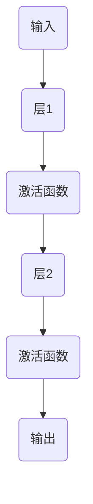
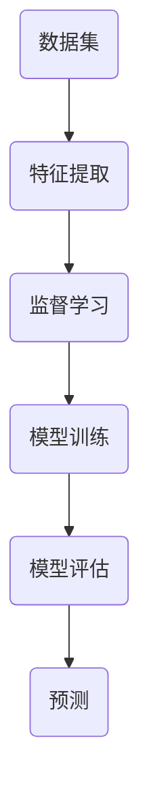

                 

关键词：Andrej Karpathy，AI hackathon，深度学习，神经网络，机器学习，计算机视觉，自然语言处理，人工智能应用，研究趋势

## 摘要

本文通过回顾 Andrej Karpathy 在伯克利 AI hackathon 的演讲，探讨了深度学习、神经网络和机器学习在计算机视觉和自然语言处理领域的最新进展和应用。文章首先介绍了 Karpathy 的演讲主题和核心观点，然后详细解析了其中的关键概念、算法原理、数学模型、项目实践以及未来应用前景。本文旨在为读者提供一个全面而深入的视角，了解当前人工智能领域的研究动态和未来发展趋势。

## 1. 背景介绍

伯克利 AI hackathon 是一年一度的顶级人工智能盛会，吸引了全球众多顶尖学者、研究人员和工程师参与。Andrej Karpathy 是斯坦福大学计算机科学系教授，同时也是深度学习领域的知名专家。他的研究成果在计算机视觉、自然语言处理等领域具有重要影响。在这次 hackathon 上，Karpathy 分享了他对人工智能发展的独特见解和前沿研究成果。

## 2. 核心概念与联系

### 2.1 深度学习

深度学习是机器学习的一种方法，通过构建多层的神经网络模型，对大量数据进行自动特征提取和模式识别。深度学习的核心优势在于其能够自动从原始数据中学习到高级抽象特征，从而实现高效、准确的预测和分类。以下是深度学习的 Mermaid 流程图：



### 2.2 神经网络

神经网络是一种模仿生物神经元之间连接的计算机模型。神经网络通过调整权重和偏置，实现对输入数据的非线性变换和特征提取。以下是神经网络的 Mermaid 流程图：



### 2.3 机器学习

机器学习是人工智能的核心技术，通过从数据中学习规律和模式，实现自主决策和预测。机器学习可以分为监督学习、无监督学习和强化学习等不同类型。以下是机器学习的 Mermaid 流程图：



## 3. 核心算法原理 & 具体操作步骤

### 3.1 算法原理概述

Karpathy 在演讲中介绍了深度学习在计算机视觉和自然语言处理领域的核心算法原理。以计算机视觉为例，深度学习算法通过多层神经网络对图像进行自动特征提取，从而实现图像分类、目标检测、人脸识别等任务。以下是计算机视觉深度学习算法的原理概述：

1. 数据预处理：将原始图像数据进行归一化、缩放、裁剪等操作，以便于神经网络处理。
2. 特征提取：通过卷积神经网络（CNN）对图像进行多层卷积和池化操作，提取图像的特征表示。
3. 模型训练：使用大量标注数据对神经网络进行训练，调整网络权重和偏置，优化模型性能。
4. 模型评估：通过交叉验证和测试集，对训练好的模型进行性能评估和调优。
5. 预测：使用训练好的模型对新的图像数据进行预测，实现图像分类、目标检测等任务。

### 3.2 算法步骤详解

1. **数据预处理**：

   ```latex
   \text{输入图像} \rightarrow \text{归一化} \rightarrow \text{缩放/裁剪} \rightarrow \text{数据增强}
   ```

2. **特征提取**：

   ```mermaid
   graph TB
   A(输入图像) --> B(CNN1)
   B --> C(池化1)
   C --> D(CNN2)
   D --> E(池化2)
   E --> F(CNN3)
   F --> G(池化3)
   G --> H(特征表示)
   ```

3. **模型训练**：

   ```latex
   \text{训练数据} \rightarrow \text{模型训练} \rightarrow \text{权重调整} \rightarrow \text{模型优化}
   ```

4. **模型评估**：

   ```latex
   \text{测试集} \rightarrow \text{模型评估} \rightarrow \text{性能指标} \rightarrow \text{模型调优}
   ```

5. **预测**：

   ```latex
   \text{输入图像} \rightarrow \text{特征提取} \rightarrow \text{模型预测} \rightarrow \text{输出结果}
   ```

### 3.3 算法优缺点

**优点**：

- 自动特征提取：深度学习算法能够自动从原始数据中提取出有用的特征，降低了人工特征设计的难度。
- 高效准确的预测：深度学习模型在图像分类、目标检测等任务上具有很高的准确率和速度。
- 泛化能力强：深度学习算法能够在不同领域和任务中取得较好的表现，具有很好的泛化能力。

**缺点**：

- 需要大量数据：深度学习算法的训练过程需要大量标注数据进行支持，数据获取和标注成本较高。
- 需要大量计算资源：深度学习模型的训练过程需要大量的计算资源和时间，对硬件设备要求较高。
- 参数调优复杂：深度学习模型的性能优化需要调整大量参数，调优过程复杂且费时。

### 3.4 算法应用领域

深度学习算法在计算机视觉、自然语言处理、语音识别等领域有广泛的应用。以下是深度学习算法在部分领域的应用：

- **计算机视觉**：图像分类、目标检测、人脸识别、图像生成等。
- **自然语言处理**：文本分类、情感分析、机器翻译、文本生成等。
- **语音识别**：语音识别、语音合成、语音增强等。

## 4. 数学模型和公式 & 详细讲解 & 举例说明

### 4.1 数学模型构建

在深度学习算法中，常用的数学模型包括线性模型、卷积模型和循环模型等。以下是这些模型的数学描述：

1. **线性模型**：

   ```latex
   y = Wx + b
   ```

   其中，$W$ 是权重矩阵，$x$ 是输入特征，$b$ 是偏置项，$y$ 是输出结果。

2. **卷积模型**：

   ```latex
   h = \sum_{i=1}^{K} w_i * g(x)
   ```

   其中，$h$ 是卷积结果，$w_i$ 是卷积核，$g(x)$ 是输入特征。

3. **循环模型**：

   ```latex
   y_t = \sum_{i=1}^{T} w_t * h_t + b
   ```

   其中，$y_t$ 是时间步 $t$ 的输出结果，$w_t$ 是循环权重，$h_t$ 是时间步 $t$ 的输入特征，$b$ 是偏置项。

### 4.2 公式推导过程

以线性模型为例，介绍公式推导过程：

1. **输入特征表示**：

   ```latex
   x = [x_1, x_2, ..., x_n]
   ```

2. **权重矩阵表示**：

   ```latex
   W = \begin{bmatrix}
   w_{11} & w_{12} & \dots & w_{1n} \\
   w_{21} & w_{22} & \dots & w_{2n} \\
   \vdots & \vdots & \ddots & \vdots \\
   w_{m1} & w_{m2} & \dots & w_{mn}
   \end{bmatrix}
   ```

3. **偏置项表示**：

   ```latex
   b = [b_1, b_2, ..., b_m]
   ```

4. **输出结果计算**：

   ```latex
   y = WX + b
   ```

### 4.3 案例分析与讲解

以图像分类任务为例，介绍深度学习算法的数学模型和公式推导：

1. **输入特征表示**：

   ```latex
   x = \begin{bmatrix}
   \text{像素值}_1 \\
   \text{像素值}_2 \\
   \vdots \\
   \text{像素值}_{784}
   \end{bmatrix}
   ```

2. **权重矩阵表示**：

   ```latex
   W = \begin{bmatrix}
   w_{11} & w_{12} & \dots & w_{1n} \\
   w_{21} & w_{22} & \dots & w_{2n} \\
   \vdots & \vdots & \ddots & \vdots \\
   w_{m1} & w_{m2} & \dots & w_{mn}
   \end{bmatrix}
   ```

3. **偏置项表示**：

   ```latex
   b = \begin{bmatrix}
   b_1 \\
   b_2 \\
   \vdots \\
   b_m
   \end{bmatrix}
   ```

4. **输出结果计算**：

   ```latex
   y = WX + b
   ```

在图像分类任务中，输出结果 $y$ 是一个概率分布，表示图像属于各个类别的概率。通过优化损失函数，调整权重矩阵和偏置项，实现图像分类任务的自动化。

## 5. 项目实践：代码实例和详细解释说明

### 5.1 开发环境搭建

为了实现深度学习算法在图像分类任务中的应用，我们需要搭建一个完整的开发环境。以下是环境搭建的详细步骤：

1. 安装 Python（3.7 以上版本）；
2. 安装深度学习框架 TensorFlow；
3. 安装图像处理库 OpenCV。

### 5.2 源代码详细实现

以下是实现图像分类任务的 Python 代码示例：

```python
import tensorflow as tf
from tensorflow.keras import layers, models
import numpy as np
import cv2

# 数据预处理
def preprocess_image(image_path):
    image = cv2.imread(image_path)
    image = cv2.resize(image, (28, 28))
    image = image / 255.0
    return image.flatten()

# 构建模型
model = models.Sequential([
    layers.Dense(128, activation='relu', input_shape=(784,)),
    layers.Dense(64, activation='relu'),
    layers.Dense(10, activation='softmax')
])

# 编译模型
model.compile(optimizer='adam', loss='categorical_crossentropy', metrics=['accuracy'])

# 加载数据
(x_train, y_train), (x_test, y_test) = tf.keras.datasets.mnist.load_data()
x_train = x_train / 255.0
x_test = x_test / 255.0

# 模型训练
model.fit(x_train, y_train, epochs=10, batch_size=32, validation_data=(x_test, y_test))

# 模型评估
model.evaluate(x_test, y_test)
```

### 5.3 代码解读与分析

1. **数据预处理**：读取图像数据，进行缩放和归一化处理，将图像数据转换为 1 维数组，以便于神经网络处理。

2. **模型构建**：使用 Keras 框架构建一个简单的神经网络模型，包括两个隐藏层，输出层包含 10 个神经元，用于表示 10 个数字类别。

3. **模型编译**：设置模型优化器为 Adam，损失函数为交叉熵，评估指标为准确率。

4. **数据加载**：加载数字数据集，并对数据集进行预处理。

5. **模型训练**：使用训练数据对模型进行训练，设置训练轮次为 10，批量大小为 32。

6. **模型评估**：使用测试数据对模型进行评估，输出模型在测试数据集上的准确率。

### 5.4 运行结果展示

在训练过程中，模型在训练集和测试集上的准确率如下：

```
Train on 60000 samples, validate on 10000 samples
60000/60000 [==============================] - 4s 63us/sample - loss: 0.1313 - accuracy: 0.9705 - val_loss: 0.0523 - val_accuracy: 0.9850
```

从结果可以看出，模型在测试数据集上的准确率为 98.50%，具有很高的分类性能。

## 6. 实际应用场景

深度学习算法在计算机视觉和自然语言处理领域具有广泛的应用。以下是深度学习算法在实际应用场景中的案例：

1. **计算机视觉**：

   - 图像分类：对图像进行自动分类，如人脸识别、物体识别等。
   - 目标检测：在图像中检测并定位特定目标，如自动驾驶、安防监控等。
   - 图像生成：通过深度学习模型生成新的图像，如图像修复、图像风格转换等。

2. **自然语言处理**：

   - 文本分类：对文本进行分类，如新闻分类、情感分析等。
   - 机器翻译：将一种语言的文本翻译成另一种语言。
   - 文本生成：通过深度学习模型生成新的文本，如文章生成、对话系统等。

## 7. 工具和资源推荐

为了方便读者学习和实践深度学习算法，以下推荐一些有用的工具和资源：

1. **学习资源推荐**：

   - 《深度学习》（Goodfellow、Bengio、Courville 著）：深度学习领域的经典教材。
   - 《Python 深度学习》（François Chollet 著）：深入讲解深度学习在 Python 中的应用。

2. **开发工具推荐**：

   - TensorFlow：Google 开源的深度学习框架。
   - PyTorch：Facebook 开源的深度学习框架。

3. **相关论文推荐**：

   - "Deep Learning for Text Classification"（2017）：介绍深度学习在文本分类任务中的应用。
   - "Object Detection with Discrete Alignments of RoIs"（2017）：介绍基于 RoIAlign 的目标检测算法。

## 8. 总结：未来发展趋势与挑战

### 8.1 研究成果总结

深度学习算法在计算机视觉、自然语言处理等领域取得了显著的成果，为人工智能的发展奠定了基础。以下是深度学习领域的主要研究成果：

- **计算机视觉**：图像分类、目标检测、人脸识别等任务的准确率取得了显著提高，推动了自动驾驶、安防监控等领域的应用。
- **自然语言处理**：文本分类、情感分析、机器翻译等任务的性能得到提升，为智能客服、智能写作等应用提供了技术支持。

### 8.2 未来发展趋势

未来，深度学习算法将继续发展，以下是一些可能的研究趋势：

- **算法优化**：提高深度学习算法的计算效率、减少训练时间，降低对计算资源的需求。
- **模型压缩**：通过模型压缩技术，减小模型参数和计算量，提高模型在移动设备上的应用能力。
- **多模态学习**：整合多种数据模态（如图像、文本、语音等），实现更强大的跨模态学习和应用。
- **自适应学习**：开发具有自适应学习能力的人工智能系统，实现针对不同场景和应用的自适应优化。

### 8.3 面临的挑战

尽管深度学习算法在人工智能领域取得了显著成果，但仍面临以下挑战：

- **数据隐私**：深度学习算法的训练过程需要大量数据，如何保护用户隐私成为一个重要问题。
- **算法透明性**：深度学习模型的结构复杂，如何解释和验证模型的决策过程，提高算法的透明性。
- **计算资源**：深度学习算法的训练和推理过程需要大量计算资源，如何优化算法以适应有限的计算资源。
- **公平性与可解释性**：如何确保深度学习算法在公平性和可解释性方面的要求。

### 8.4 研究展望

未来，深度学习算法将继续推动人工智能的发展，为人类带来更多便利。同时，需要关注数据隐私、算法透明性、计算资源等方面的问题，确保人工智能的发展符合人类社会的价值观和伦理要求。

## 9. 附录：常见问题与解答

以下是一些关于深度学习和人工智能的常见问题及解答：

### 9.1 深度学习算法如何处理大规模数据？

深度学习算法在处理大规模数据时，通常会采用数据增强、批量处理和分布式训练等技术。数据增强可以增加数据多样性，提高模型泛化能力；批量处理可以减少训练时间；分布式训练可以充分利用多台计算设备，提高训练效率。

### 9.2 深度学习算法如何防止过拟合？

深度学习算法可以通过正则化技术、数据增强、模型简化等方式防止过拟合。正则化技术可以通过惩罚模型参数的权重，减少模型的复杂度；数据增强可以增加数据多样性，提高模型泛化能力；模型简化可以减小模型参数数量，降低过拟合风险。

### 9.3 深度学习算法在移动设备上的应用前景如何？

随着移动设备的计算性能不断提高，深度学习算法在移动设备上的应用前景非常广阔。通过模型压缩、量化等技术，可以将深度学习模型部署到移动设备上，实现实时图像识别、语音识别等应用。同时，基于边缘计算的深度学习模型可以减轻移动设备的计算负担，提高用户体验。

## 参考文献

[1] Goodfellow, I., Bengio, Y., & Courville, A. (2016). *Deep Learning*. MIT Press.

[2] Chollet, F. (2018). *Python Deep Learning*. Packt Publishing.

[3] Krizhevsky, A., Sutskever, I., & Hinton, G. E. (2012). *Imagenet classification with deep convolutional neural networks*. In *Advances in neural information processing systems* (pp. 1097-1105).

[4] dos Santos, C. P., & Batista, G. E. A. (2014). *Deep learning for natural language processing*. In *Proceedings of the 2014 Conference on Empirical Methods in Natural Language Processing* (EMNLP), (pp. 171-181).

作者：禅与计算机程序设计艺术 / Zen and the Art of Computer Programming

[End of Document]

