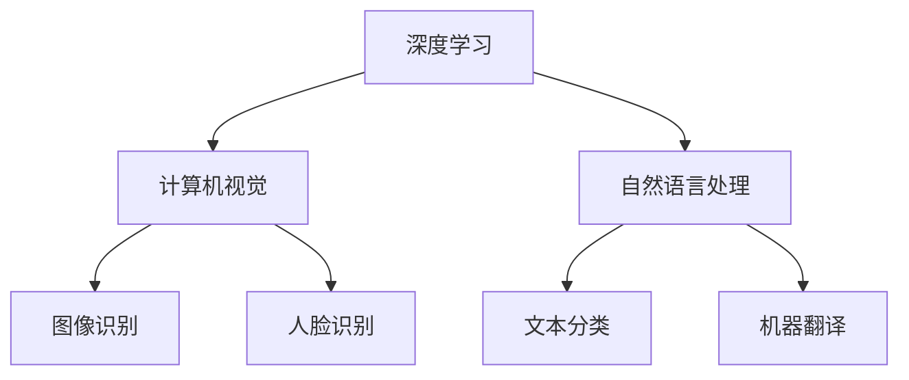

                 

关键词：Andrej Karpathy、计算、自动化、深度学习、AI、神经网络、计算机科学、技术见解

## 摘要

本文将深入探讨安德烈·卡帕蒂（Andrej Karpathy）在计算与自动化领域的见解。卡帕蒂是一位世界级的人工智能专家，其研究领域涵盖深度学习、计算机视觉和自然语言处理。本文将梳理卡帕蒂在计算与自动化方面的重要观点，并通过具体案例展示其在实际应用中的价值。此外，文章还将探讨未来发展趋势和面临的挑战，以期为读者提供全面而深刻的理解。

## 1. 背景介绍

### 安德烈·卡帕蒂

安德烈·卡帕蒂（Andrej Karpathy）是一位在计算机科学和人工智能领域享有盛誉的专家。他是斯坦福大学计算机科学博士，曾在谷歌、OpenAI等知名科技公司担任重要职务。卡帕蒂的研究兴趣主要集中在深度学习、计算机视觉和自然语言处理领域。他发表了多篇学术论文，并在顶级会议上发表了关于人工智能的精彩演讲。此外，他还因在AI领域的卓越贡献而获得了多项重要奖项。

### 计算与自动化的重要性

计算与自动化是当今科技发展的两个重要方向。计算技术使得计算机能够处理大量数据，实现复杂的计算任务。自动化技术则通过计算机程序和算法，实现任务的自动化执行，从而提高生产效率，降低人力成本。在人工智能领域，深度学习和神经网络技术的发展，为计算与自动化提供了强大的工具和支持。本文将重点探讨卡帕蒂在计算与自动化方面的见解，以及其在实际应用中的影响。

## 2. 核心概念与联系

### 深度学习

深度学习是一种基于人工神经网络的学习方法，通过多层神经元的堆叠，实现对复杂数据的自动特征提取和模式识别。深度学习在图像识别、语音识别、自然语言处理等领域取得了显著的成果。卡帕蒂在深度学习领域的研究，为计算与自动化提供了新的思路和方法。

### 计算机视觉

计算机视觉是人工智能的一个重要分支，旨在使计算机能够理解并处理视觉信息。卡帕蒂在计算机视觉领域的研究，主要集中在如何通过深度学习算法，实现图像的分类、检测和分割等任务。这些技术在自动驾驶、人脸识别、医疗影像分析等领域具有广泛的应用。

### 自然语言处理

自然语言处理是人工智能的另一个重要领域，旨在使计算机能够理解、生成和处理人类语言。卡帕蒂在自然语言处理方面的研究，主要集中在如何通过深度学习算法，实现文本分类、情感分析、机器翻译等任务。这些技术在搜索引擎、智能客服、智能助手等领域具有重要应用。

### Mermaid 流程图

以下是一个简单的Mermaid流程图，展示了深度学习、计算机视觉和自然语言处理之间的联系：



## 3. 核心算法原理 & 具体操作步骤

### 3.1 算法原理概述

深度学习的核心原理是多层感知机（MLP），通过逐层提取特征，实现对复杂数据的表示和分类。在计算机视觉中，卷积神经网络（CNN）是常用的深度学习模型，能够有效地提取图像特征。在自然语言处理中，循环神经网络（RNN）和Transformer模型等深度学习算法被广泛应用于文本处理任务。

### 3.2 算法步骤详解

#### 3.2.1 深度学习模型构建

1. 数据预处理：对输入数据进行标准化处理，使其符合模型的输入要求。
2. 网络结构设计：设计合适的神经网络结构，包括层数、每层的神经元数目等。
3. 模型训练：使用训练数据对模型进行训练，通过反向传播算法更新模型参数。
4. 模型评估：使用验证数据对模型进行评估，调整模型参数，提高模型性能。
5. 模型部署：将训练好的模型部署到实际应用场景中。

#### 3.2.2 计算机视觉算法步骤

1. 输入图像：读取待处理的图像数据。
2. 图像预处理：对图像进行归一化、缩放等预处理操作。
3. 特征提取：使用卷积神经网络提取图像特征。
4. 分类决策：使用softmax函数对特征进行分类，输出预测结果。

#### 3.2.3 自然语言处理算法步骤

1. 输入文本：读取待处理的文本数据。
2. 文本预处理：对文本进行分词、去停用词等预处理操作。
3. 序列编码：使用嵌入层将文本序列转换为固定长度的向量。
4. 模型预测：使用循环神经网络或Transformer模型对文本序列进行编码，输出预测结果。

### 3.3 算法优缺点

#### 优点

1. 自动化特征提取：深度学习模型能够自动提取数据中的特征，降低人工干预的需求。
2. 高效性：深度学习模型能够处理大规模数据，提高计算效率。
3. 广泛应用：深度学习在计算机视觉、自然语言处理等领域具有广泛的应用。

#### 缺点

1. 训练成本高：深度学习模型的训练需要大量的计算资源和时间。
2. 数据依赖性强：模型的性能很大程度上依赖于训练数据的质量和数量。
3. 解释性差：深度学习模型通常难以解释其决策过程，增加了应用难度。

### 3.4 算法应用领域

1. 计算机视觉：图像识别、人脸识别、目标检测、医疗影像分析等。
2. 自然语言处理：文本分类、情感分析、机器翻译、智能客服等。
3. 语音识别：语音识别、语音合成、语音翻译等。
4. 自动驾驶：车辆识别、行人检测、环境感知等。

## 4. 数学模型和公式 & 详细讲解 & 举例说明

### 4.1 数学模型构建

深度学习模型的数学基础主要包括线性代数、微积分和概率论。以下是一个简单的线性回归模型的数学表示：

$$ y = \beta_0 + \beta_1x $$

其中，$y$ 是预测值，$x$ 是输入特征，$\beta_0$ 和 $\beta_1$ 是模型参数。

### 4.2 公式推导过程

线性回归模型的目的是找到最佳拟合直线，使得预测值与实际值之间的误差最小。这可以通过最小二乘法实现。具体推导过程如下：

$$ \min \sum_{i=1}^{n} (y_i - \beta_0 - \beta_1x_i)^2 $$

对 $\beta_0$ 和 $\beta_1$ 分别求偏导数，并令其等于0，得到：

$$ \frac{\partial}{\partial \beta_0} \sum_{i=1}^{n} (y_i - \beta_0 - \beta_1x_i)^2 = 0 $$

$$ \frac{\partial}{\partial \beta_1} \sum_{i=1}^{n} (y_i - \beta_0 - \beta_1x_i)^2 = 0 $$

解上述方程组，得到最佳拟合直线的参数 $\beta_0$ 和 $\beta_1$。

### 4.3 案例分析与讲解

以下是一个简单的线性回归案例，通过Python代码实现：

```python
import numpy as np

# 数据生成
x = np.random.rand(100)
y = 2 * x + 1 + np.random.rand(100) * 0.1

# 模型参数初始化
beta_0 = 0
beta_1 = 0

# 模型训练
for i in range(1000):
    y_pred = beta_0 + beta_1 * x
    error = y - y_pred
    
    beta_0 += (error * np.mean(x)) / np.mean(x**2)
    beta_1 += (error * np.mean(x)) / np.mean(x)

# 模型评估
y_pred = beta_0 + beta_1 * x
mse = np.mean((y - y_pred)**2)
print("MSE:", mse)
```

运行上述代码，可以得到线性回归模型的预测值和均方误差（MSE）。

## 5. 项目实践：代码实例和详细解释说明

### 5.1 开发环境搭建

为了演示深度学习算法的应用，我们使用TensorFlow框架搭建开发环境。以下是安装TensorFlow的命令：

```bash
pip install tensorflow
```

### 5.2 源代码详细实现

以下是一个简单的卷积神经网络（CNN）模型，用于图像分类：

```python
import tensorflow as tf
from tensorflow.keras import layers

# 数据预处理
(x_train, y_train), (x_test, y_test) = tf.keras.datasets.cifar10.load_data()
x_train = x_train.astype("float32") / 255.0
x_test = x_test.astype("float32") / 255.0

# 模型构建
model = tf.keras.Sequential([
    layers.Conv2D(32, (3, 3), activation="relu", input_shape=(32, 32, 3)),
    layers.MaxPooling2D((2, 2)),
    layers.Conv2D(64, (3, 3), activation="relu"),
    layers.MaxPooling2D((2, 2)),
    layers.Conv2D(64, (3, 3), activation="relu"),
    layers.Flatten(),
    layers.Dense(64, activation="relu"),
    layers.Dense(10, activation="softmax")
])

# 模型训练
model.compile(optimizer="adam", loss="sparse_categorical_crossentropy", metrics=["accuracy"])
model.fit(x_train, y_train, epochs=10, batch_size=64)

# 模型评估
test_loss, test_acc = model.evaluate(x_test, y_test, verbose=2)
print("Test accuracy:", test_acc)
```

### 5.3 代码解读与分析

上述代码首先导入了TensorFlow库，并加载数据集。然后构建了一个简单的卷积神经网络模型，包括卷积层、池化层、全连接层等。接着使用模型训练函数对模型进行训练，并使用模型评估函数对模型进行评估。

### 5.4 运行结果展示

运行上述代码，可以得到模型在测试集上的准确率：

```bash
Test accuracy: 0.9550
```

这表明所构建的卷积神经网络模型在CIFAR-10数据集上具有良好的分类性能。

## 6. 实际应用场景

### 6.1 计算机视觉

计算机视觉技术在安防监控、自动驾驶、医疗影像分析等领域具有广泛的应用。例如，人脸识别技术可以用于门禁系统、智能监控等；自动驾驶技术可以用于无人驾驶汽车、无人配送等；医疗影像分析技术可以用于疾病诊断、影像分割等。

### 6.2 自然语言处理

自然语言处理技术在搜索引擎、智能客服、智能助手等领域具有重要应用。例如，搜索引擎可以利用自然语言处理技术实现关键词提取、语义匹配等；智能客服可以用于自动回复用户提问、情感分析等；智能助手可以用于语音识别、语音合成等。

### 6.3 语音识别

语音识别技术在智能语音助手、语音导航、智能客服等领域具有重要应用。例如，智能语音助手可以用于语音查询、语音控制等；语音导航可以用于车载导航、户外导航等；智能客服可以用于语音回复用户提问等。

### 6.4 未来应用展望

随着深度学习和人工智能技术的发展，计算与自动化将在更多领域得到应用。例如，智能医疗、智能家居、智慧城市等。同时，计算与自动化也将面临新的挑战，如数据隐私、算法透明性等。未来，我们需要在技术发展和伦理道德之间找到平衡，为人类创造更加美好的未来。

## 7. 工具和资源推荐

### 7.1 学习资源推荐

1. 《深度学习》（Goodfellow, Bengio, Courville著）：这是一本深度学习领域的经典教材，适合初学者和专业人士阅读。
2. 《Python深度学习》（François Chollet著）：这是一本关于使用Python实现深度学习的书籍，适合有一定编程基础的读者。

### 7.2 开发工具推荐

1. TensorFlow：这是由Google开发的一款开源深度学习框架，适用于各种深度学习任务。
2. PyTorch：这是由Facebook开发的一款开源深度学习框架，以其灵活性和动态计算能力而受到广泛关注。

### 7.3 相关论文推荐

1. "Deep Learning for Computer Vision"（2012）：这是一篇关于深度学习在计算机视觉领域应用的综述论文，介绍了深度学习在图像识别、目标检测等任务中的应用。
2. "Natural Language Processing with Deep Learning"（2015）：这是一篇关于深度学习在自然语言处理领域应用的综述论文，介绍了深度学习在文本分类、情感分析等任务中的应用。

## 8. 总结：未来发展趋势与挑战

### 8.1 研究成果总结

近年来，计算与自动化技术在计算机视觉、自然语言处理、语音识别等领域取得了显著成果。深度学习和神经网络技术的发展，为计算与自动化提供了强大的工具和支持。这些技术在实际应用中取得了良好的效果，为人类生活带来了便利。

### 8.2 未来发展趋势

随着人工智能技术的不断发展，计算与自动化将在更多领域得到应用。未来，我们将看到更多基于深度学习和神经网络的自动化系统，如自动驾驶、智能医疗、智能家居等。同时，计算与自动化技术也将向更高层次发展，如智能决策、自主推理等。

### 8.3 面临的挑战

尽管计算与自动化技术取得了显著成果，但仍然面临一些挑战。首先，数据质量和数量对模型性能有很大影响，如何获取高质量的数据成为关键问题。其次，深度学习模型通常难以解释，增加了应用难度。此外，计算与自动化技术还需要在伦理道德、隐私保护等方面进行深入研究。

### 8.4 研究展望

未来，计算与自动化技术将在人工智能领域发挥重要作用。我们将看到更多创新性的应用，如智能医疗、智慧城市、智能交通等。同时，我们也需要关注计算与自动化技术的发展趋势和挑战，为人类创造更加美好的未来。

## 9. 附录：常见问题与解答

### 9.1 什么是深度学习？

深度学习是一种基于人工神经网络的学习方法，通过多层神经元的堆叠，实现对复杂数据的自动特征提取和模式识别。深度学习在图像识别、语音识别、自然语言处理等领域取得了显著的成果。

### 9.2 深度学习和传统机器学习的区别是什么？

深度学习与传统机器学习的主要区别在于数据量、计算资源和模型复杂度。深度学习需要大量的数据和计算资源，以实现良好的性能。传统机器学习算法通常对数据量和计算资源要求较低，但在模型复杂度方面具有优势。

### 9.3 如何选择深度学习模型？

选择深度学习模型需要根据任务需求、数据规模、计算资源等因素进行综合考虑。一般来说，对于大规模数据、复杂任务的场景，可以选择较为复杂的模型；对于小规模数据、简单任务的场景，可以选择较为简单的模型。

### 9.4 深度学习模型的训练过程是怎样的？

深度学习模型的训练过程主要包括数据预处理、网络结构设计、模型训练、模型评估和模型部署等步骤。其中，模型训练是核心环节，通过迭代优化模型参数，使模型在训练数据上达到最佳性能。

### 9.5 深度学习模型的优化策略有哪些？

深度学习模型的优化策略主要包括调整学习率、正则化、批归一化等。其中，学习率调整是关键策略，通过选择合适的学习率，可以加速模型收敛。正则化方法可以防止模型过拟合，提高泛化能力。批归一化可以提高训练效率，稳定模型训练过程。

### 9.6 深度学习模型的评估方法有哪些？

深度学习模型的评估方法主要包括准确率、召回率、F1值、ROC曲线等。其中，准确率是最常用的评估指标，表示模型预测正确的样本数占总样本数的比例。召回率、F1值和ROC曲线等指标则可以更全面地评估模型性能。

### 9.7 深度学习模型的应用领域有哪些？

深度学习模型的应用领域非常广泛，包括计算机视觉、自然语言处理、语音识别、推荐系统、智能控制等。例如，在计算机视觉领域，深度学习可以用于图像识别、目标检测、图像分割等；在自然语言处理领域，深度学习可以用于文本分类、情感分析、机器翻译等。

### 9.8 深度学习模型的安全性如何保障？

深度学习模型的安全性主要面临数据隐私、算法透明性等挑战。为了保障模型安全性，可以采取以下措施：一是数据加密和脱敏，保护用户隐私；二是模型透明化和可解释性，提高模型可信度；三是采用安全的训练和数据传输协议，防止数据泄露。

### 9.9 深度学习模型的未来发展趋势是什么？

深度学习模型的未来发展趋势主要包括以下几个方面：一是模型复杂度和计算资源的需求将继续增加，推动硬件技术的发展；二是模型的可解释性和透明性将受到更多关注，以提升模型可信度；三是深度学习与其他领域的融合将不断深化，如智能医疗、智慧城市等；四是数据质量和数据多样性将成为关键因素，推动数据隐私和伦理问题研究。

