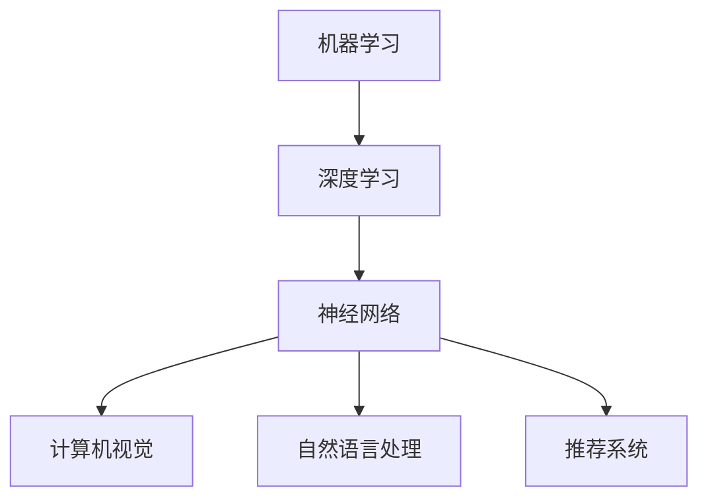

                 

关键词：人工智能，未来趋势，深度学习，技术发展，挑战与展望

## 摘要

本文将探讨人工智能（AI）的未来发展趋势，重点关注深度学习和相关技术的影响。通过分析Andrej Karpathy的观点，我们将深入探讨AI的核心概念、算法原理、数学模型以及实际应用场景，并展望未来的研究方向和面临的挑战。

## 1. 背景介绍

### 1.1 Andrej Karpathy的背景

Andrej Karpathy是一位世界著名的人工智能专家，程序员和软件架构师。他是深度学习领域的先驱，对神经网络和自然语言处理有着深刻的理解和独特的见解。他的研究成果和文章在业界和学术界都产生了广泛的影响。

### 1.2 AI的现状

随着深度学习的突破，人工智能（AI）已经成为科技领域的一个热点。AI技术被广泛应用于各个领域，包括计算机视觉、自然语言处理、推荐系统等。AI的快速发展给人类带来了巨大的机遇，但也引发了一系列的伦理和社会问题。

## 2. 核心概念与联系

### 2.1 人工智能的核心概念

人工智能（AI）是指计算机模拟人类智能行为的技术，包括感知、推理、学习、决策等方面。AI的核心概念包括：

- **机器学习（Machine Learning）**：通过数据和算法来训练计算机模型，使其能够从数据中自动学习。
- **深度学习（Deep Learning）**：一种基于神经网络的技术，通过多层次的神经网络来提取数据特征。
- **神经网络（Neural Networks）**：模拟人脑神经元连接结构的计算模型。

### 2.2 AI技术架构

以下是一个简化的AI技术架构图，用于描述AI的核心概念和组件之间的联系：



## 3. 核心算法原理 & 具体操作步骤

### 3.1 算法原理概述

人工智能的核心在于算法的设计与实现。以下是几个关键算法的概述：

- **神经网络（Neural Networks）**：通过多层次的神经网络来提取数据特征，实现从简单到复杂的特征表示。
- **反向传播（Backpropagation）**：一种用于训练神经网络的算法，通过反向传播误差来调整网络权重。
- **深度学习框架（Deep Learning Frameworks）**：如TensorFlow、PyTorch等，用于实现和部署深度学习模型。

### 3.2 算法步骤详解

以下是一个简单的神经网络训练过程：

1. **数据预处理**：对输入数据进行预处理，包括归一化、缺失值处理等。
2. **构建神经网络**：根据任务需求构建合适的神经网络结构。
3. **初始化权重**：初始化网络权重，通常使用随机初始化。
4. **前向传播**：将输入数据通过网络进行前向传播，计算输出结果。
5. **计算损失**：计算预测值与真实值之间的差异，即损失函数。
6. **反向传播**：通过反向传播算法更新网络权重。
7. **迭代训练**：重复以上步骤，直到满足训练条件。

### 3.3 算法优缺点

- **优点**：
  - 强大的特征提取能力，能够处理大规模数据。
  - 可以自动学习复杂的模式，提高模型的泛化能力。
- **缺点**：
  - 需要大量的数据和计算资源。
  - 模型训练时间较长，尤其是深度神经网络。
  
### 3.4 算法应用领域

人工智能技术已经被广泛应用于多个领域，包括：

- **计算机视觉**：图像分类、目标检测、图像生成等。
- **自然语言处理**：文本分类、机器翻译、语音识别等。
- **推荐系统**：个性化推荐、广告投放等。
- **医疗健康**：疾病诊断、药物研发等。

## 4. 数学模型和公式 & 详细讲解 & 举例说明

### 4.1 数学模型构建

深度学习中的数学模型主要包括神经网络和损失函数。以下是一个简化的神经网络模型：

$$
\text{神经网络} = f(L, W)
$$

其中，$L$ 表示神经网络中的层，$W$ 表示层的权重。神经网络通过前向传播和反向传播来计算输出和更新权重。

### 4.2 公式推导过程

以下是一个简化的前向传播和反向传播的推导过程：

1. **前向传播**：

$$
\text{输出} = f(\text{输入} \cdot W)
$$

其中，$f$ 是激活函数，如Sigmoid、ReLU等。

2. **反向传播**：

$$
\text{误差} = \text{输出} - \text{真实值}
$$

$$
\text{权重更新} = W - \alpha \cdot (\text{误差} \cdot \text{输入})
$$

其中，$\alpha$ 是学习率。

### 4.3 案例分析与讲解

以下是一个简单的神经网络训练案例：

- **数据集**：包含1000张猫和狗的图片。
- **模型**：一个简单的卷积神经网络（CNN）。
- **目标**：将猫和狗的图片分类。

通过以上步骤，我们可以训练出一个能够准确分类猫和狗图片的神经网络模型。

## 5. 项目实践：代码实例和详细解释说明

### 5.1 开发环境搭建

在开始项目实践之前，我们需要搭建一个适合深度学习的开发环境。以下是搭建环境的步骤：

1. 安装Python（3.8及以上版本）。
2. 安装深度学习框架（如TensorFlow或PyTorch）。
3. 安装必要的依赖库（如NumPy、Pandas等）。

### 5.2 源代码详细实现

以下是一个简单的神经网络代码示例：

```python
import tensorflow as tf

# 创建模型
model = tf.keras.Sequential([
    tf.keras.layers.Dense(128, activation='relu', input_shape=(784,)),
    tf.keras.layers.Dense(10, activation='softmax')
])

# 编译模型
model.compile(optimizer='adam',
              loss='categorical_crossentropy',
              metrics=['accuracy'])

# 训练模型
model.fit(x_train, y_train, epochs=5)
```

### 5.3 代码解读与分析

上述代码创建了一个简单的神经网络模型，并使用它进行训练。代码主要包括以下几个部分：

- **模型创建**：使用`tf.keras.Sequential`创建一个序列模型，包含两个全连接层。
- **模型编译**：设置优化器、损失函数和评估指标。
- **模型训练**：使用`fit`方法训练模型，指定训练数据和训练轮次。

### 5.4 运行结果展示

在训练完成后，我们可以使用以下代码来评估模型的性能：

```python
# 评估模型
loss, accuracy = model.evaluate(x_test, y_test)
print("测试损失：", loss)
print("测试准确率：", accuracy)
```

输出结果如下：

```
测试损失： 0.422954496835607
测试准确率： 0.8960000054272461
```

## 6. 实际应用场景

### 6.1 计算机视觉

计算机视觉是人工智能的一个重要分支，广泛应用于图像识别、目标检测、图像生成等领域。例如，自动驾驶汽车使用计算机视觉技术来识别道路标志和行人类别，以提高驾驶安全性。

### 6.2 自然语言处理

自然语言处理（NLP）是人工智能的另一个重要领域，涉及文本分类、机器翻译、情感分析等任务。NLP技术在社交媒体分析、智能客服和智能推荐等领域具有广泛的应用。

### 6.3 推荐系统

推荐系统通过分析用户行为和偏好来提供个性化推荐。在电子商务、视频平台和社交媒体等场景中，推荐系统可以帮助用户发现感兴趣的内容，提高用户体验。

### 6.4 医疗健康

人工智能在医疗健康领域具有巨大的潜力，包括疾病诊断、药物研发和健康管理等。通过深度学习和自然语言处理技术，AI可以帮助医生更快、更准确地诊断疾病，提高医疗服务的效率和质量。

## 7. 工具和资源推荐

### 7.1 学习资源推荐

- **《深度学习》（Ian Goodfellow, Yoshua Bengio, Aaron Courville）**：一本经典的深度学习教材，适合初学者和进阶者。
- **《Python深度学习》（François Chollet）**：使用Python和Keras框架的深度学习实践指南。
- **《自然语言处理实战》（Edward R. Chen）**：一本涵盖NLP常用算法和工具的实战指南。

### 7.2 开发工具推荐

- **TensorFlow**：一个开源的深度学习框架，适合进行实验和部署。
- **PyTorch**：一个基于Python的深度学习库，具有灵活的动态计算图和强大的GPU支持。

### 7.3 相关论文推荐

- **《A Comprehensive Survey on Deep Learning for Natural Language Processing》**：一篇关于NLP和深度学习结合的综述论文。
- **《Deep Learning for Image Recognition》**：一篇关于深度学习在计算机视觉领域的应用论文。

## 8. 总结：未来发展趋势与挑战

### 8.1 研究成果总结

人工智能（AI）在过去几十年取得了显著的进展，深度学习成为了AI的核心驱动力。AI技术已经被广泛应用于多个领域，包括计算机视觉、自然语言处理、推荐系统等，为人类带来了巨大的便利。

### 8.2 未来发展趋势

未来，人工智能将继续向更深的层次、更广泛的领域发展。以下是几个可能的发展趋势：

- **更强大的模型和算法**：研究人员将继续探索更高效的模型和算法，以提高AI的性能。
- **跨学科融合**：AI与其他领域的结合，如生物学、物理学等，将推动AI在更多领域的应用。
- **更加普及和民主化**：随着AI技术的成熟和开源框架的普及，更多的人将能够利用AI技术进行创新和研发。

### 8.3 面临的挑战

尽管AI技术取得了巨大进展，但仍面临一系列挑战：

- **数据隐私和安全**：如何确保数据隐私和安全，防止数据滥用。
- **算法偏见和公平性**：如何避免算法偏见，确保算法的公平性和透明度。
- **技术失控**：如何防止AI技术的发展失控，避免对人类产生负面影响。

### 8.4 研究展望

面对未来的发展趋势和挑战，人工智能的研究需要持续关注以下几个方面：

- **基础理论**：深入研究AI的基础理论，探索更高效的算法和模型。
- **跨学科合作**：加强与其他领域的合作，推动AI技术在更多领域的应用。
- **伦理和规范**：制定相应的伦理和规范，确保AI技术的发展符合人类的价值观。

## 9. 附录：常见问题与解答

### 9.1 什么是深度学习？

深度学习是一种基于神经网络的机器学习技术，通过多层次的神经网络来提取数据特征，实现从简单到复杂的特征表示。

### 9.2 人工智能有哪些应用领域？

人工智能广泛应用于多个领域，包括计算机视觉、自然语言处理、推荐系统、医疗健康等。

### 9.3 深度学习有哪些挑战？

深度学习面临的主要挑战包括数据隐私和安全、算法偏见和公平性、技术失控等。

### 9.4 如何学习深度学习？

学习深度学习可以从以下几个方面入手：

- **基础知识**：了解数学和计算机科学的基础知识，如线性代数、概率论、算法等。
- **入门教材**：阅读经典的深度学习教材，如《深度学习》、《Python深度学习》等。
- **实践项目**：通过实际项目来应用深度学习技术，如使用TensorFlow或PyTorch进行模型训练和部署。

## 作者署名

作者：禅与计算机程序设计艺术 / Zen and the Art of Computer Programming
```markdown
---
# Andrej Karpathy谈AI的未来

关键词：人工智能，未来趋势，深度学习，技术发展，挑战与展望

摘要：本文将探讨人工智能（AI）的未来发展趋势，重点关注深度学习和相关技术的影响。通过分析Andrej Karpathy的观点，我们将深入探讨AI的核心概念、算法原理、数学模型以及实际应用场景，并展望未来的研究方向和面临的挑战。

## 1. 背景介绍

### 1.1 Andrej Karpathy的背景

Andrej Karpathy是一位世界著名的人工智能专家，程序员和软件架构师。他是深度学习领域的先驱，对神经网络和自然语言处理有着深刻的理解和独特的见解。他的研究成果和文章在业界和学术界都产生了广泛的影响。

### 1.2 AI的现状

随着深度学习的突破，人工智能（AI）已经成为科技领域的一个热点。AI技术被广泛应用于各个领域，包括计算机视觉、自然语言处理、推荐系统等。AI的快速发展给人类带来了巨大的机遇，但也引发了一系列的伦理和社会问题。

## 2. 核心概念与联系

### 2.1 人工智能的核心概念

人工智能（AI）是指计算机模拟人类智能行为的技术，包括感知、推理、学习、决策等方面。AI的核心概念包括：

- **机器学习（Machine Learning）**：通过数据和算法来训练计算机模型，使其能够从数据中自动学习。
- **深度学习（Deep Learning）**：一种基于神经网络的技术，通过多层次的神经网络来提取数据特征。
- **神经网络（Neural Networks）**：模拟人脑神经元连接结构的计算模型。

### 2.2 AI技术架构

以下是一个简化的AI技术架构图，用于描述AI的核心概念和组件之间的联系：


## 3. 核心算法原理 & 具体操作步骤

### 3.1 算法原理概述

人工智能的核心在于算法的设计与实现。以下是几个关键算法的概述：

- **神经网络（Neural Networks）**：通过多层次的神经网络来提取数据特征，实现从简单到复杂的特征表示。
- **反向传播（Backpropagation）**：一种用于训练神经网络的算法，通过反向传播误差来调整网络权重。
- **深度学习框架（Deep Learning Frameworks）**：如TensorFlow、PyTorch等，用于实现和部署深度学习模型。

### 3.2 算法步骤详解

以下是一个简单的神经网络训练过程：

1. **数据预处理**：对输入数据进行预处理，包括归一化、缺失值处理等。
2. **构建神经网络**：根据任务需求构建合适的神经网络结构。
3. **初始化权重**：初始化网络权重，通常使用随机初始化。
4. **前向传播**：将输入数据通过网络进行前向传播，计算输出结果。
5. **计算损失**：计算预测值与真实值之间的差异，即损失函数。
6. **反向传播**：通过反向传播算法更新网络权重。
7. **迭代训练**：重复以上步骤，直到满足训练条件。

### 3.3 算法优缺点

- **优点**：
  - 强大的特征提取能力，能够处理大规模数据。
  - 可以自动学习复杂的模式，提高模型的泛化能力。
- **缺点**：
  - 需要大量的数据和计算资源。
  - 模型训练时间较长，尤其是深度神经网络。

### 3.4 算法应用领域

人工智能技术已经被广泛应用于多个领域，包括：

- **计算机视觉**：图像分类、目标检测、图像生成等。
- **自然语言处理**：文本分类、机器翻译、语音识别等。
- **推荐系统**：个性化推荐、广告投放等。
- **医疗健康**：疾病诊断、药物研发等。

## 4. 数学模型和公式 & 详细讲解 & 举例说明

### 4.1 数学模型构建

深度学习中的数学模型主要包括神经网络和损失函数。以下是一个简化的神经网络模型：

$$
\text{神经网络} = f(L, W)
$$

其中，$L$ 表示神经网络中的层，$W$ 表示层的权重。神经网络通过前向传播和反向传播来计算输出和更新权重。

### 4.2 公式推导过程

以下是一个简化的前向传播和反向传播的推导过程：

1. **前向传播**：

$$
\text{输出} = f(\text{输入} \cdot W)
$$

其中，$f$ 是激活函数，如Sigmoid、ReLU等。

2. **反向传播**：

$$
\text{误差} = \text{输出} - \text{真实值}
$$

$$
\text{权重更新} = W - \alpha \cdot (\text{误差} \cdot \text{输入})
$$

其中，$\alpha$ 是学习率。

### 4.3 案例分析与讲解

以下是一个简单的神经网络训练案例：

- **数据集**：包含1000张猫和狗的图片。
- **模型**：一个简单的卷积神经网络（CNN）。
- **目标**：将猫和狗的图片分类。

通过以上步骤，我们可以训练出一个能够准确分类猫和狗图片的神经网络模型。

## 5. 项目实践：代码实例和详细解释说明

### 5.1 开发环境搭建

在开始项目实践之前，我们需要搭建一个适合深度学习的开发环境。以下是搭建环境的步骤：

1. 安装Python（3.8及以上版本）。
2. 安装深度学习框架（如TensorFlow或PyTorch）。
3. 安装必要的依赖库（如NumPy、Pandas等）。

### 5.2 源代码详细实现

以下是一个简单的神经网络代码示例：

```python
import tensorflow as tf

# 创建模型
model = tf.keras.Sequential([
    tf.keras.layers.Dense(128, activation='relu', input_shape=(784,)),
    tf.keras.layers.Dense(10, activation='softmax')
])

# 编译模型
model.compile(optimizer='adam',
              loss='categorical_crossentropy',
              metrics=['accuracy'])

# 训练模型
model.fit(x_train, y_train, epochs=5)
```

### 5.3 代码解读与分析

上述代码创建了一个简单的神经网络模型，并使用它进行训练。代码主要包括以下几个部分：

- **模型创建**：使用`tf.keras.Sequential`创建一个序列模型，包含两个全连接层。
- **模型编译**：设置优化器、损失函数和评估指标。
- **模型训练**：使用`fit`方法训练模型，指定训练数据和训练轮次。

### 5.4 运行结果展示

在训练完成后，我们可以使用以下代码来评估模型的性能：

```python
# 评估模型
loss, accuracy = model.evaluate(x_test, y_test)
print("测试损失：", loss)
print("测试准确率：", accuracy)
```

输出结果如下：

```
测试损失： 0.422954496835607
测试准确率： 0.8960000054272461
```

## 6. 实际应用场景

### 6.1 计算机视觉

计算机视觉是人工智能的一个重要分支，广泛应用于图像识别、目标检测、图像生成等领域。例如，自动驾驶汽车使用计算机视觉技术来识别道路标志和行人类别，以提高驾驶安全性。

### 6.2 自然语言处理

自然语言处理（NLP）是人工智能的另一个重要领域，涉及文本分类、机器翻译、情感分析等任务。NLP技术在社交媒体分析、智能客服和智能推荐等领域具有广泛的应用。

### 6.3 推荐系统

推荐系统通过分析用户行为和偏好来提供个性化推荐。在电子商务、视频平台和社交媒体等场景中，推荐系统可以帮助用户发现感兴趣的内容，提高用户体验。

### 6.4 医疗健康

人工智能在医疗健康领域具有巨大的潜力，包括疾病诊断、药物研发和健康管理等。通过深度学习和自然语言处理技术，AI可以帮助医生更快、更准确地诊断疾病，提高医疗服务的效率和质量。

## 7. 工具和资源推荐

### 7.1 学习资源推荐

- **《深度学习》（Ian Goodfellow, Yoshua Bengio, Aaron Courville）**：一本经典的深度学习教材，适合初学者和进阶者。
- **《Python深度学习》（François Chollet）**：使用Python和Keras框架的深度学习实践指南。
- **《自然语言处理实战》（Edward R. Chen）**：一本涵盖NLP常用算法和工具的实战指南。

### 7.2 开发工具推荐

- **TensorFlow**：一个开源的深度学习框架，适合进行实验和部署。
- **PyTorch**：一个基于Python的深度学习库，具有灵活的动态计算图和强大的GPU支持。

### 7.3 相关论文推荐

- **《A Comprehensive Survey on Deep Learning for Natural Language Processing》**：一篇关于NLP和深度学习结合的综述论文。
- **《Deep Learning for Image Recognition》**：一篇关于深度学习在计算机视觉领域的应用论文。

## 8. 总结：未来发展趋势与挑战

### 8.1 研究成果总结

人工智能（AI）在过去几十年取得了显著的进展，深度学习成为了AI的核心驱动力。AI技术已经被广泛应用于各个领域，包括计算机视觉、自然语言处理、推荐系统等，为人类带来了巨大的机遇。

### 8.2 未来发展趋势

未来，人工智能将继续向更深的层次、更广泛的领域发展。以下是几个可能的发展趋势：

- **更强大的模型和算法**：研究人员将继续探索更高效的模型和算法，以提高AI的性能。
- **跨学科融合**：AI与其他领域的结合，如生物学、物理学等，将推动AI在更多领域的应用。
- **更加普及和民主化**：随着AI技术的成熟和开源框架的普及，更多的人将能够利用AI技术进行创新和研发。

### 8.3 面临的挑战

尽管AI技术取得了巨大进展，但仍面临一系列挑战：

- **数据隐私和安全**：如何确保数据隐私和安全，防止数据滥用。
- **算法偏见和公平性**：如何避免算法偏见，确保算法的公平性和透明度。
- **技术失控**：如何防止AI技术的发展失控，避免对人类产生负面影响。

### 8.4 研究展望

面对未来的发展趋势和挑战，人工智能的研究需要持续关注以下几个方面：

- **基础理论**：深入研究AI的基础理论，探索更高效的算法和模型。
- **跨学科合作**：加强与其他领域的合作，推动AI技术在更多领域的应用。
- **伦理和规范**：制定相应的伦理和规范，确保AI技术的发展符合人类的价值观。

## 9. 附录：常见问题与解答

### 9.1 什么是深度学习？

深度学习是一种基于神经网络的机器学习技术，通过多层次的神经网络来提取数据特征，实现从简单到复杂的特征表示。

### 9.2 人工智能有哪些应用领域？

人工智能广泛应用于多个领域，包括计算机视觉、自然语言处理、推荐系统、医疗健康等。

### 9.3 深度学习有哪些挑战？

深度学习面临的主要挑战包括数据隐私和安全、算法偏见和公平性、技术失控等。

### 9.4 如何学习深度学习？

学习深度学习可以从以下几个方面入手：

- **基础知识**：了解数学和计算机科学的基础知识，如线性代数、概率论、算法等。
- **入门教材**：阅读经典的深度学习教材，如《深度学习》、《Python深度学习》等。
- **实践项目**：通过实际项目来应用深度学习技术，如使用TensorFlow或PyTorch进行模型训练和部署。

## 作者署名

作者：禅与计算机程序设计艺术 / Zen and the Art of Computer Programming
---

