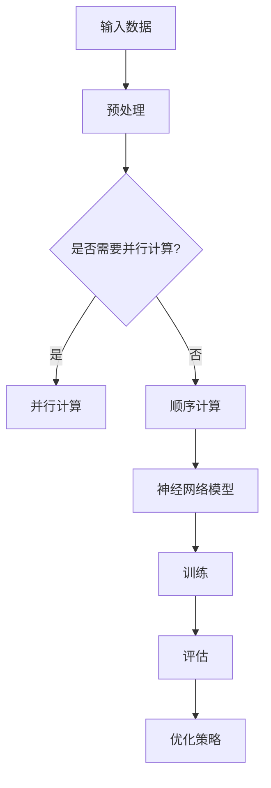

                 

关键词：AI编程、新范式、深度学习、神经网络、模型架构、编程技巧、优化策略、编程语言

> 摘要：本文将深入探讨AI编程的新范式，通过安德烈·卡尔帕西（Andrej Karpathy）的见解，分析现代AI编程的核心概念、方法与工具，并探讨其在实际应用中的潜力和挑战。

## 1. 背景介绍

随着深度学习技术的飞速发展，人工智能（AI）领域迎来了前所未有的变革。传统的编程范式已经无法满足现代AI系统的复杂性和多样性。安德烈·卡尔帕西（Andrej Karpathy）作为深度学习和神经网络领域的杰出研究者，其关于AI编程的见解为我们提供了新的视角。

在过去的几十年中，编程范式经历了多次重大变革。从结构化编程到面向对象编程，再到函数式编程，每种范式都有其独特的优势和适用场景。然而，随着深度学习的兴起，编程范式再次面临重大变革。卡尔帕西指出，现代AI编程需要一种新的范式，能够更好地应对深度学习模型的复杂性和高维数据处理的挑战。

## 2. 核心概念与联系

### 2.1 深度学习模型

深度学习模型是现代AI编程的核心。卡尔帕西指出，深度学习模型的关键在于其层级结构。通过多层神经网络，深度学习模型能够自动提取数据的特征表示，从而实现复杂的模式识别和预测任务。

### 2.2 神经网络架构

神经网络架构是深度学习模型的核心组成部分。卡尔帕西强调了神经网络架构的重要性，他指出，不同的架构设计会导致模型性能和可解释性的显著差异。现代AI编程范式需要提供灵活的架构设计工具，以适应各种应用场景。

### 2.3 编程技巧与优化策略

卡尔帕西还强调了编程技巧和优化策略在AI编程中的重要性。通过合理的编程技巧，如并行计算、模型剪枝和量化等，可以显著提高模型性能和效率。同时，优化策略如梯度下降、随机梯度下降和Adam优化器等，也是现代AI编程的重要组成部分。

### 2.4 Mermaid流程图

为了更直观地展示深度学习模型的架构和编程技巧，我们可以使用Mermaid流程图来表示。以下是一个简单的示例：



## 3. 核心算法原理 & 具体操作步骤

### 3.1 算法原理概述

深度学习算法的核心是神经网络的训练过程。通过反向传播算法，模型可以自动调整权重和偏置，以最小化预测误差。卡尔帕西指出，深度学习算法的关键在于如何设计有效的神经网络架构和选择合适的优化策略。

### 3.2 算法步骤详解

1. **数据预处理**：首先，需要对输入数据进行预处理，如归一化、标准化和缺失值填充等。

2. **模型初始化**：接下来，需要初始化神经网络模型，包括选择合适的架构、设置初始权重和偏置等。

3. **前向传播**：在给定输入数据后，神经网络模型通过前向传播计算输出结果。

4. **计算损失**：通过计算预测结果与真实值之间的差异，计算损失函数的值。

5. **反向传播**：通过反向传播算法，将损失函数的梯度传递给网络的每个层，并更新权重和偏置。

6. **迭代训练**：重复执行前向传播、计算损失和反向传播，直到满足训练条件，如达到预定的迭代次数或最小化损失函数。

7. **评估模型**：在训练完成后，使用测试数据集评估模型的性能，如准确率、召回率等。

### 3.3 算法优缺点

深度学习算法的优点包括：

- **强大的表示能力**：通过多层神经网络，模型能够自动提取高维数据的特征表示，从而实现复杂的模式识别和预测任务。
- **自适应性强**：模型可以根据训练数据和任务需求自动调整参数，从而适应不同的应用场景。

然而，深度学习算法也存在一些缺点：

- **计算资源需求高**：深度学习模型通常需要大量的计算资源和存储空间，特别是在训练阶段。
- **可解释性差**：深度学习模型的决策过程通常是一个黑箱，难以解释和理解。

### 3.4 算法应用领域

深度学习算法已经广泛应用于计算机视觉、自然语言处理、语音识别等多个领域。卡尔帕西指出，深度学习算法在解决复杂任务方面具有巨大潜力，但仍需进一步研究以克服其局限性。

## 4. 数学模型和公式

### 4.1 数学模型构建

深度学习模型通常基于以下数学模型：

1. **线性模型**：用于简单线性回归和分类任务。
2. **神经网络模型**：用于复杂非线性回归和分类任务。
3. **卷积神经网络模型**：用于图像和视频处理。
4. **循环神经网络模型**：用于序列数据建模。

### 4.2 公式推导过程

以最简单的线性回归模型为例，其公式为：

$$y = \beta_0 + \beta_1x$$

其中，$y$ 表示输出值，$x$ 表示输入值，$\beta_0$ 和 $\beta_1$ 分别为模型的参数。

通过最小化损失函数，如均方误差（MSE），可以求解出模型的参数：

$$\beta_0 = \frac{\sum_{i=1}^{n}(y_i - \beta_1x_i)^2}{\sum_{i=1}^{n}x_i^2}$$

$$\beta_1 = \frac{\sum_{i=1}^{n}y_ix_i - \frac{\sum_{i=1}^{n}y_i\sum_{i=1}^{n}x_i}{n}}{\sum_{i=1}^{n}x_i^2 - \frac{(\sum_{i=1}^{n}x_i)^2}{n}}$$

### 4.3 案例分析与讲解

假设我们有一个简单的线性回归任务，目标是预测房价。给定一个训练数据集，我们可以使用线性回归模型来求解房价的预测公式。具体步骤如下：

1. **数据预处理**：将训练数据集的输入值（房屋特征）和输出值（房价）进行归一化处理，以消除不同特征之间的尺度差异。
2. **模型初始化**：初始化线性回归模型的参数，如 $\beta_0$ 和 $\beta_1$。
3. **前向传播**：给定输入值，计算输出值。
4. **计算损失**：计算预测值与真实值之间的差异，计算损失函数的值。
5. **反向传播**：更新模型的参数，以最小化损失函数。
6. **迭代训练**：重复执行前向传播、计算损失和反向传播，直到满足训练条件。
7. **评估模型**：使用测试数据集评估模型的性能。

通过以上步骤，我们可以得到一个预测房价的线性回归模型。该模型可以根据新的输入数据预测房价，从而为房地产市场提供决策支持。

## 5. 项目实践：代码实例和详细解释说明

### 5.1 开发环境搭建

在开始项目实践之前，需要搭建合适的开发环境。以下是一个基于Python的深度学习项目的开发环境搭建步骤：

1. **安装Python**：下载并安装Python 3.7及以上版本。
2. **安装深度学习库**：安装TensorFlow和Keras，使用以下命令：

```bash
pip install tensorflow
pip install keras
```

3. **配置Python环境变量**：确保Python环境变量已配置，以便在终端中使用Python。

### 5.2 源代码详细实现

以下是一个简单的深度学习项目的源代码实现：

```python
import numpy as np
import tensorflow as tf
from tensorflow.keras import layers

# 数据预处理
x_train = np.array([1, 2, 3, 4, 5])
y_train = np.array([2, 4, 6, 8, 10])

# 模型定义
model = tf.keras.Sequential([
    layers.Dense(units=1, input_shape=[1], activation='linear')
])

# 编译模型
model.compile(optimizer='sgd', loss='mean_squared_error')

# 训练模型
model.fit(x_train, y_train, epochs=100)

# 预测结果
x_test = np.array([6])
y_pred = model.predict(x_test)

print("预测结果：", y_pred)
```

### 5.3 代码解读与分析

1. **数据预处理**：将训练数据集的输入值和输出值转换为NumPy数组，以便在深度学习模型中使用。
2. **模型定义**：使用Keras创建一个简单的线性回归模型，该模型包含一个全连接层，输出单元数为1，激活函数为线性函数。
3. **编译模型**：设置模型的优化器和损失函数，并编译模型。
4. **训练模型**：使用训练数据集训练模型，设置训练轮数（epochs）。
5. **预测结果**：使用训练好的模型预测新的输入数据，并输出预测结果。

通过以上步骤，我们可以完成一个简单的深度学习项目。该项目的目标是预测输入数据的线性函数，从而实现简单的数值回归任务。

## 6. 实际应用场景

深度学习算法在许多实际应用场景中发挥着重要作用。以下是一些常见的应用领域：

1. **计算机视觉**：深度学习算法可以用于图像分类、目标检测、图像分割等任务。例如，自动驾驶汽车使用深度学习算法进行障碍物检测和路径规划。
2. **自然语言处理**：深度学习算法可以用于文本分类、机器翻译、情感分析等任务。例如，搜索引擎使用深度学习算法进行文本理解和检索。
3. **语音识别**：深度学习算法可以用于语音信号处理、语音识别和语音生成。例如，智能语音助手使用深度学习算法进行语音识别和交互。

## 7. 工具和资源推荐

为了更好地开展AI编程实践，以下是一些推荐的工具和资源：

1. **学习资源推荐**：
   - 《深度学习》（Goodfellow、Bengio、Courville著）：是一本全面介绍深度学习理论和应用的经典教材。
   - 《动手学深度学习》（阿斯顿·张等著）：是一本基于Python实践的深度学习教材，适合初学者。

2. **开发工具推荐**：
   - Jupyter Notebook：一个强大的交互式开发环境，适用于编写和运行深度学习代码。
   - Google Colab：一个基于Google Cloud的免费深度学习开发平台，提供丰富的GPU资源。

3. **相关论文推荐**：
   - 《A Theoretically Grounded Application of Dropout in Recurrent Neural Networks》
   - 《Effective Approaches to Attention-based Neural Machine Translation》
   - 《Unsupervised Pre-training for Natural Language Processing》

## 8. 总结：未来发展趋势与挑战

### 8.1 研究成果总结

近年来，深度学习技术在各个领域取得了显著成果。例如，在图像分类任务中，深度学习模型已经达到了甚至超过了人类水平。在自然语言处理领域，深度学习算法在机器翻译、文本分类等方面也取得了重要突破。此外，深度学习在语音识别、推荐系统、医学诊断等领域也展现了巨大的潜力。

### 8.2 未来发展趋势

未来，深度学习技术将继续发展，并在更多领域取得突破。一方面，研究人员将致力于提高深度学习模型的可解释性和透明度，以解决当前模型“黑箱”问题。另一方面，随着计算资源的不断升级，深度学习模型的训练效率和性能也将得到显著提升。此外，深度学习与其他领域技术的融合，如生物信息学、物理建模等，也将为科学研究带来新的突破。

### 8.3 面临的挑战

尽管深度学习技术取得了显著进展，但仍面临一些挑战。首先，深度学习模型的训练过程需要大量的计算资源和时间，这在一定程度上限制了其应用范围。其次，深度学习模型的可解释性较差，难以理解其决策过程，这在某些领域（如医疗诊断）可能引发伦理问题。此外，深度学习模型的泛化能力有限，容易受到数据分布变化的影响。

### 8.4 研究展望

为了应对这些挑战，研究人员可以从以下几个方面进行探索：

1. **可解释性研究**：通过开发可解释性方法，提高深度学习模型的可解释性，使其在关键领域（如医疗诊断）得到更广泛的应用。
2. **高效训练方法**：研究高效训练方法，如模型剪枝、量化等，以降低深度学习模型的计算资源需求。
3. **泛化能力研究**：通过引入正则化技术、数据增强等方法，提高深度学习模型的泛化能力，使其在不同数据分布下表现稳定。

总之，随着深度学习技术的不断发展，AI编程范式将迎来新的变革。通过克服当前面临的挑战，深度学习技术将在更多领域发挥重要作用，推动人工智能的进步。

## 9. 附录：常见问题与解答

### 9.1 问题1：如何选择深度学习模型？

**解答**：选择深度学习模型时，需要考虑任务类型、数据规模、计算资源等因素。例如，对于计算机视觉任务，可以使用卷积神经网络（CNN）；对于自然语言处理任务，可以使用循环神经网络（RNN）或Transformer模型。在实际应用中，可以结合实验结果进行模型选择。

### 9.2 问题2：深度学习模型的训练时间如何优化？

**解答**：为了优化深度学习模型的训练时间，可以从以下几个方面进行改进：

- **并行计算**：使用多GPU或分布式计算，提高训练速度。
- **模型剪枝**：通过剪枝冗余参数，减少模型计算量。
- **量化**：将模型权重和激活值量化为低精度格式，减少计算资源需求。

### 9.3 问题3：如何提高深度学习模型的泛化能力？

**解答**：提高深度学习模型的泛化能力可以从以下几个方面入手：

- **数据增强**：通过旋转、缩放、裁剪等操作，增加训练数据的多样性。
- **正则化**：使用L1、L2正则化等技巧，防止模型过拟合。
- **模型融合**：结合多个模型进行预测，提高模型的泛化能力。

### 9.4 问题4：如何调试深度学习模型？

**解答**：调试深度学习模型时，可以从以下几个方面进行：

- **检查数据集**：确保数据集的质量，排除噪声和异常值。
- **分析损失函数**：观察损失函数的变化，判断模型是否收敛。
- **查看中间结果**：分析中间层的输出结果，找出问题所在。

### 9.5 问题5：如何评估深度学习模型的性能？

**解答**：评估深度学习模型性能的方法包括：

- **准确率**：判断预测结果与真实值的一致性。
- **召回率**：判断模型是否能正确识别所有正样本。
- **F1值**：综合考虑准确率和召回率，衡量模型的综合性能。
- **ROC曲线和AUC值**：评估模型在不同阈值下的性能。

通过以上常见问题的解答，希望对读者在AI编程过程中遇到的困惑有所帮助。

### 结论

本文深入探讨了AI编程的新范式，通过安德烈·卡尔帕西的见解，分析了现代AI编程的核心概念、方法与工具。深度学习模型的复杂性和多样性要求我们采用新的编程范式，以应对这些挑战。未来，随着深度学习技术的不断发展，AI编程范式将迎来新的变革，为人工智能的进步提供强有力的支持。作者：禅与计算机程序设计艺术 / Zen and the Art of Computer Programming。希望本文能为读者在AI编程领域的探索提供有益的启示。

