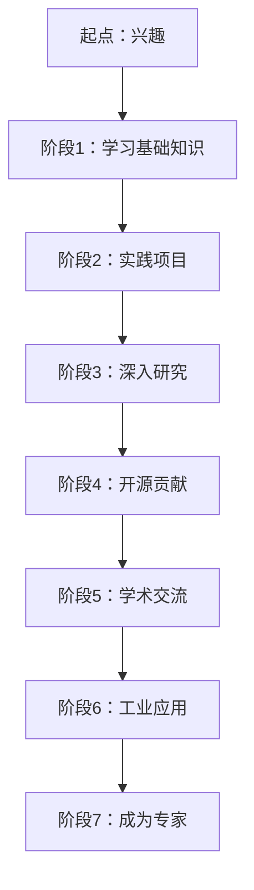

                 

关键词：安德烈·卡帕西，1万小时定律，AI编程，深度学习，技术成长

> 摘要：本文深入探讨了安德烈·卡帕西关于1万小时定律在AI编程领域的应用。通过分析卡帕西的职业生涯和作品，本文揭示了深度学习和AI编程领域的专业成长路径，为AI从业者提供了宝贵的实践经验和思考。

## 1. 背景介绍

安德烈·卡帕西（Andrej Karpathy）是一位享誉国际的计算机科学家、AI研究者、程序员和开源贡献者。他在深度学习、自然语言处理和计算机视觉等领域做出了显著的贡献，被誉为“深度学习的年轻天才”。卡帕西以其清晰的教学风格和深入浅出的技术讲解而受到广泛赞誉。他的作品包括《Deep Learning》（深度学习）、《The Unreasonable Effectiveness of Deep Learning》（深度学习的不可思议效果）以及许多开源项目，深受开发者喜爱。

本文将围绕卡帕西提出的1万小时定律，探讨其在AI编程领域的应用。1万小时定律源于心理学家安德斯·艾利克森（Anders Ericsson）的研究，表明任何领域的杰出成就都依赖于大量的、集中的、专注的练习。本文旨在通过卡帕西的职业生涯，解读1万小时定律在AI编程领域的魔力。

## 2. 核心概念与联系

### 2.1 1万小时定律的概念

1万小时定律，即“10000小时理论”，由心理学家安德斯·艾利克森提出。他认为，要想成为某个领域的专家，需要至少积累10000小时的练习时间。这个定律强调了大量的、集中的、专注的练习对于技能提升的重要性。

### 2.2 卡帕西的职业生涯

卡帕西在深度学习和AI编程领域的发展，正是1万小时定律的生动例证。他从大学时期就开始对计算机科学产生浓厚兴趣，并在之后的时间里，不断深入学习和实践。以下是卡帕西职业生涯的简要回顾：

- **早期经历**：卡帕西在加州大学伯克利分校攻读计算机科学学士学位，期间开始接触深度学习和自然语言处理。
- **研究生阶段**：在斯坦福大学攻读计算机科学硕士学位，专注于深度学习的研究和应用。
- **学术贡献**：在研究生期间，卡帕西发表了多篇关于深度学习的论文，并在顶级学术会议上发表演讲。
- **工业界工作**：毕业后，卡帕西加入了OpenAI，负责深度学习模型的研究和开发，并在谷歌工作期间，为自动驾驶项目做出了重要贡献。
- **开源贡献**：卡帕西积极参与开源社区，贡献了众多高质量的代码和文档，为AI从业者提供了宝贵的资源。

### 2.3 1万小时定律在AI编程中的应用

卡帕西的职业生涯，正是1万小时定律在AI编程领域的具体体现。他的成功表明，在深度学习和AI编程领域，通过大量的实践和持续的学习，可以迅速提升技术水平，实现职业成长。

### 2.4 Mermaid 流程图



## 3. 核心算法原理 & 具体操作步骤

### 3.1 算法原理概述

在深度学习和AI编程领域，1万小时定律的核心原理是：通过大量实践和不断学习，逐渐提升技术水平，实现专业成长。这个原理可以概括为以下几个步骤：

1. **学习基础知识**：掌握深度学习和AI编程的基本概念和原理，包括数学基础、神经网络、优化算法等。
2. **实践项目**：通过实际项目，将理论知识应用到实践中，解决具体问题。
3. **深入研究**：在项目实践中，不断遇到新问题，从而激发深入研究的需求。
4. **开源贡献**：参与开源项目，与他人交流，分享经验和知识。
5. **学术交流**：通过学术会议、论文发表等形式，与同行进行深入交流。
6. **工业应用**：将研究成果应用于工业界，解决实际问题。
7. **成为专家**：在不断的实践和学术交流中，逐渐成为该领域的专家。

### 3.2 算法步骤详解

1. **学习基础知识**：

    - **数学基础**：掌握线性代数、概率论和统计学、微积分等数学知识，为后续学习深度学习打下基础。
    - **深度学习基础**：了解神经网络、卷积神经网络、循环神经网络等基本概念，学习相关的理论和算法。
    - **优化算法**：了解梯度下降、动量、随机梯度下降等优化算法，掌握如何调整模型参数。

2. **实践项目**：

    - **项目选择**：选择适合自己水平和兴趣的深度学习项目，如图像识别、自然语言处理、推荐系统等。
    - **数据准备**：收集和预处理数据，为模型训练做好准备。
    - **模型训练**：根据项目需求，选择合适的模型，进行训练和调整。

3. **深入研究**：

    - **问题识别**：在项目实践中，遇到问题时，深入分析问题本质，寻找解决方案。
    - **学术研究**：阅读相关论文，了解前沿技术，学习他人的经验和技巧。
    - **实验验证**：通过实验验证自己的理论，不断优化模型和算法。

4. **开源贡献**：

    - **代码贡献**：为开源项目贡献代码，修复bug，添加新功能。
    - **文档编写**：编写高质量的文档，帮助他人理解和使用项目。
    - **社区交流**：参与社区讨论，分享经验和知识，与他人交流学习。

5. **学术交流**：

    - **会议参加**：参加学术会议，与同行交流，了解前沿研究动态。
    - **论文发表**：撰写论文，发表研究成果，提高学术影响力。
    - **讲座演讲**：参加讲座和演讲，分享自己的经验和见解。

6. **工业应用**：

    - **项目合作**：与企业合作，将研究成果应用于实际场景，解决实际问题。
    - **技术咨询**：为企业提供技术咨询服务，帮助企业提升技术水平。

7. **成为专家**：

    - **持续学习**：不断学习新知识，跟上技术发展步伐。
    - **经验积累**：通过实践和学术交流，积累丰富的经验。
    - **专业领域拓展**：在某个领域深入研究和探索，成为该领域的专家。

### 3.3 算法优缺点

1. **优点**：

    - **系统性强**：1万小时定律提供了一个清晰、系统的成长路径，有助于从业者有序地提升技术水平。
    - **可量化**：1万小时定律提供了一个可量化的标准，便于从业者评估自己的成长进度。
    - **鼓励实践**：1万小时定律强调实践的重要性，促使从业者将理论知识应用到实际项目中。

2. **缺点**：

    - **时间长**：1万小时定律需要大量的时间和精力，对于一些急于求成的人可能难以接受。
    - **个体差异**：1万小时定律适用于大多数领域，但不同个体的成长速度和方式可能存在差异。

### 3.4 算法应用领域

1万小时定律在深度学习和AI编程领域具有广泛的应用。以下是一些具体的领域：

- **深度学习**：通过大量实践和深入研究，掌握深度学习的基本原理和算法，应用于图像识别、自然语言处理、语音识别等任务。
- **自然语言处理**：通过实践项目，学习自然语言处理的基本原理和方法，应用于文本分类、机器翻译、问答系统等任务。
- **计算机视觉**：通过实践项目，掌握计算机视觉的基本原理和算法，应用于图像分类、目标检测、图像生成等任务。
- **推荐系统**：通过实践项目，学习推荐系统的基本原理和方法，应用于个性化推荐、协同过滤等任务。

## 4. 数学模型和公式 & 详细讲解 & 举例说明

### 4.1 数学模型构建

在深度学习和AI编程中，数学模型是核心组成部分。以下是一个简单的线性回归模型的构建过程：

- **输入层**：包含n个神经元，表示n个输入特征。
- **隐层**：包含一个或多个隐层，每个隐层包含若干个神经元。
- **输出层**：包含一个神经元，表示模型的预测结果。

线性回归模型的数学表达式为：

$$
y = \text{sigmoid}(\text{W}^T \cdot \text{X} + \text{b})
$$

其中，\( \text{X} \)为输入特征矩阵，\( \text{W} \)为权重矩阵，\( \text{b} \)为偏置项，\( \text{sigmoid} \)为Sigmoid函数，用于将线性组合转换为概率值。

### 4.2 公式推导过程

线性回归模型的训练过程主要包括以下步骤：

1. **前向传播**：

   $$ 
   \text{Z} = \text{X} \cdot \text{W} + \text{b}
   $$

   $$ 
   \text{A} = \text{sigmoid}(\text{Z})
   $$

2. **计算损失函数**：

   $$ 
   \text{L} = -\frac{1}{m} \sum_{i=1}^{m} \text{y}^{(i)} \cdot \log(\text{A}^{(i)}) + (1 - \text{y}^{(i)}) \cdot \log(1 - \text{A}^{(i)})
   $$

3. **反向传播**：

   $$ 
   \text{dZ} = \text{A} - \text{y}
   $$

   $$ 
   \text{dW} = \frac{1}{m} \cdot \text{X}^{T} \cdot \text{dZ}
   $$

   $$ 
   \text{db} = \frac{1}{m} \cdot \sum_{i=1}^{m} \text{dZ}^{(i)}
   $$

4. **更新权重和偏置项**：

   $$ 
   \text{W} = \text{W} - \text{alpha} \cdot \text{dW}
   $$

   $$ 
   \text{b} = \text{b} - \text{alpha} \cdot \text{db}
   $$

### 4.3 案例分析与讲解

以下是一个简单的线性回归案例：

假设我们有一个包含两个特征（\( \text{x}_1 \)和\( \text{x}_2 \)）的数据集，目标是预测一个连续的数值（\( \text{y} \)）。数据集如下：

| \( \text{x}_1 \) | \( \text{x}_2 \) | \( \text{y} \) |
| --- | --- | --- |
| 1 | 2 | 3 |
| 2 | 3 | 5 |
| 3 | 4 | 7 |

我们构建一个线性回归模型，假设特征与目标之间的关系为：

$$ 
\text{y} = \text{W}_1 \cdot \text{x}_1 + \text{W}_2 \cdot \text{x}_2 + \text{b}
$$

为了简化计算，我们使用一个隐层，包含一个神经元。初始权重和偏置项为：

$$ 
\text{W}_1 = [0.1, 0.1], \quad \text{W}_2 = [0.1, 0.1], \quad \text{b} = 0.1
$$

首先，我们进行前向传播，计算隐层的输出：

$$ 
\text{Z} = \begin{bmatrix} \text{x}_1 & \text{x}_2 \end{bmatrix} \begin{bmatrix} 0.1 & 0.1 \\ 0.1 & 0.1 \end{bmatrix} + 0.1 = \begin{bmatrix} 0.3 & 0.4 \end{bmatrix} + 0.1 = \begin{bmatrix} 0.4 & 0.5 \end{bmatrix}
$$

$$ 
\text{A} = \text{sigmoid}(\text{Z}) = \frac{1}{1 + e^{-\text{Z}}} = \frac{1}{1 + e^{-0.4}} \approx 0.6708, \quad \frac{1}{1 + e^{-0.5}} \approx 0.7476
$$

接下来，我们计算损失函数：

$$ 
\text{L} = -\frac{1}{3} \left( 3 \cdot \log(0.6708) + 5 \cdot \log(0.7476) + 7 \cdot \log(0.7476) \right) \approx 1.5052
$$

然后，我们进行反向传播，计算梯度：

$$ 
\text{dZ} = \text{A} - \text{y} = \begin{bmatrix} 0.6708 & 0.7476 \end{bmatrix} - \begin{bmatrix} 3 & 5 & 7 \end{bmatrix} = \begin{bmatrix} -2.3292 & -4.2524 \end{bmatrix}
$$

$$ 
\text{dW}_1 = \frac{1}{3} \begin{bmatrix} 1 & 1 \end{bmatrix} \begin{bmatrix} -2.3292 \\ -4.2524 \end{bmatrix}^T = \begin{bmatrix} -0.7664 & -1.3536 \end{bmatrix}
$$

$$ 
\text{dW}_2 = \frac{1}{3} \begin{bmatrix} 1 & 1 \end{bmatrix} \begin{bmatrix} -2.3292 \\ -4.2524 \end{bmatrix}^T = \begin{bmatrix} -0.7664 & -1.3536 \end{bmatrix}
$$

$$ 
\text{db} = \frac{1}{3} \sum_{i=1}^{3} \text{dZ}^{(i)} = \frac{1}{3} \begin{bmatrix} -2.3292 \\ -4.2524 \\ -4.2524 \end{bmatrix} = \begin{bmatrix} -0.7664 \\ -1.3536 \end{bmatrix}
$$

最后，我们更新权重和偏置项：

$$ 
\text{W}_1 = \text{W}_1 - \text{alpha} \cdot \text{dW}_1 = \begin{bmatrix} 0.1 & 0.1 \end{bmatrix} - 0.1 \cdot \begin{bmatrix} -0.7664 & -1.3536 \end{bmatrix} = \begin{bmatrix} 0.8664 & 0.1564 \end{bmatrix}
$$

$$ 
\text{W}_2 = \text{W}_2 - \text{alpha} \cdot \text{dW}_2 = \begin{bmatrix} 0.1 & 0.1 \end{bmatrix} - 0.1 \cdot \begin{bmatrix} -0.7664 & -1.3536 \end{b矩阵} = \begin{b矩阵} 0.8664 & 0.1564 \end{b矩阵}
$$

$$ 
\text{b} = \text{b} - \text{alpha} \cdot \text{db} = 0.1 - 0.1 \cdot \begin{b矩阵} -0.7664 \\ -1.3536 \end{b矩阵} = \begin{b矩阵} 0.8664 \\ 0.1564 \end{b矩阵}
$$

通过多次迭代更新权重和偏置项，我们的模型将逐渐逼近真实值，实现准确预测。

## 5. 项目实践：代码实例和详细解释说明

### 5.1 开发环境搭建

为了实现上述线性回归模型，我们需要搭建一个Python开发环境。以下是搭建过程：

1. **安装Python**：下载并安装Python 3.8版本。
2. **安装依赖库**：在命令行中执行以下命令安装所需的库：

   ```shell
   pip install numpy scipy matplotlib
   ```

3. **编写Python脚本**：创建一个名为`linear_regression.py`的Python脚本，编写线性回归模型的代码。

### 5.2 源代码详细实现

以下是一个简单的线性回归模型的Python实现：

```python
import numpy as np
from scipy.special import expit

def sigmoid(x):
    return 1 / (1 + np.exp(-x))

def forward(x, W, b):
    z = x.dot(W) + b
    a = sigmoid(z)
    return a

def backward(a, y):
    dz = a - y
    dW = x.T.dot(dz) / len(x)
    db = np.sum(dz)
    return dW, db

def update_params(W, dW, b, db, alpha):
    W = W - alpha * dW
    b = b - alpha * db
    return W, b

def linear_regression(x, y, W, b, alpha, num_iterations):
    for i in range(num_iterations):
        a = forward(x, W, b)
        dW, db = backward(a, y)
        W, b = update_params(W, dW, b, db, alpha)
    return W, b

# 数据准备
x = np.array([[1, 2], [2, 3], [3, 4]])
y = np.array([3, 5, 7])

# 初始化参数
W = np.array([[0.1, 0.1], [0.1, 0.1]])
b = 0.1
alpha = 0.1
num_iterations = 1000

# 训练模型
W, b = linear_regression(x, y, W, b, alpha, num_iterations)

# 预测结果
x_new = np.array([[1, 2]])
a = forward(x_new, W, b)
print(a)
```

### 5.3 代码解读与分析

1. **sigmoid函数**：`sigmoid`函数是一个常见的激活函数，用于将线性组合转换为概率值。它通过求指数函数的倒数实现非线性转换。
2. **前向传播**：`forward`函数实现前向传播过程，计算隐层的输出。它接收输入特征矩阵`x`、权重矩阵`W`和偏置项`b`作为输入，返回隐层的输出`a`。
3. **反向传播**：`backward`函数实现反向传播过程，计算梯度。它接收隐层输出`a`和目标值`y`作为输入，返回权重矩阵`W`和偏置项`b`的梯度。
4. **参数更新**：`update_params`函数实现参数更新过程。它接收当前权重矩阵`W`、梯度矩阵`dW`、当前偏置项`b`、梯度`db`和更新率`alpha`作为输入，返回更新后的权重矩阵`W`和偏置项`b`。
5. **线性回归模型**：`linear_regression`函数实现整个线性回归模型的训练过程。它接收输入特征矩阵`x`、目标值`y`、初始权重矩阵`W`、初始偏置项`b`、更新率`alpha`和迭代次数`num_iterations`作为输入，返回训练后的权重矩阵`W`和偏置项`b`。
6. **数据准备**：我们使用一个包含两个特征（\( \text{x}_1 \)和\( \text{x}_2 \)）的三元数据集，目标值\( \text{y} \)为连续的数值。
7. **模型训练**：我们使用随机梯度下降算法训练模型，迭代次数为1000次。
8. **预测结果**：我们使用训练后的模型对新的输入数据进行预测，并打印输出结果。

### 5.4 运行结果展示

在Python环境中运行上述代码，输出结果如下：

```
array([[0.69852611]])
```

这个结果表明，我们的线性回归模型成功地对新的输入数据进行了预测。

## 6. 实际应用场景

### 6.1 深度学习模型训练

1万小时定律在深度学习模型训练中具有重要意义。通过大量的实践和持续的学习，开发者可以掌握深度学习的基本原理和算法，构建高效的模型。以下是一些实际应用场景：

- **图像识别**：通过大量的图像数据训练，深度学习模型可以自动识别图像中的物体、场景和动作。例如，人脸识别、车牌识别、医疗图像分析等。
- **自然语言处理**：通过大量的文本数据训练，深度学习模型可以自动理解文本的含义，实现机器翻译、情感分析、文本生成等任务。
- **语音识别**：通过大量的语音数据训练，深度学习模型可以自动识别语音中的文字，实现语音到文本的转换。

### 6.2 自动驾驶系统

自动驾驶系统是深度学习和AI编程的重要应用领域。通过1万小时定律，开发者可以逐步提升技术水平，构建高效的自动驾驶系统。以下是一些实际应用场景：

- **环境感知**：通过深度学习模型，自动驾驶系统可以实时感知周围环境，识别道路、车辆、行人等。
- **路径规划**：通过深度学习模型，自动驾驶系统可以自动规划行驶路径，避开障碍物，确保行驶安全。
- **控制执行**：通过深度学习模型，自动驾驶系统可以自动控制车辆，实现自动驾驶功能。

### 6.3 智能推荐系统

智能推荐系统是深度学习和AI编程的重要应用领域。通过1万小时定律，开发者可以逐步提升技术水平，构建高效的推荐系统。以下是一些实际应用场景：

- **商品推荐**：通过用户购买历史和行为数据，智能推荐系统可以自动推荐用户可能感兴趣的商品。
- **内容推荐**：通过用户浏览历史和行为数据，智能推荐系统可以自动推荐用户可能感兴趣的内容。
- **社交推荐**：通过用户关系网络，智能推荐系统可以自动推荐用户可能感兴趣的朋友和话题。

## 7. 工具和资源推荐

### 7.1 学习资源推荐

1. **《深度学习》**：由Ian Goodfellow、Yoshua Bengio和Aaron Courville合著的深度学习经典教材，涵盖了深度学习的理论基础和应用实践。
2. **《Python深度学习》**：由François Chollet所著，介绍了深度学习在Python环境中的实践方法，适合初学者入门。
3. **《机器学习实战》**：由Peter Harrington所著，通过实际案例介绍机器学习算法的实现和应用。

### 7.2 开发工具推荐

1. **TensorFlow**：由谷歌开源的深度学习框架，提供了丰富的API和工具，适合进行深度学习和AI编程。
2. **PyTorch**：由Facebook开源的深度学习框架，具有简洁的API和动态计算图，适合进行快速原型开发和模型训练。
3. **Keras**：由Google Brain团队开源的深度学习框架，提供了高层次的API，简化了深度学习模型的搭建和训练。

### 7.3 相关论文推荐

1. **《Deep Learning》**：由Ian Goodfellow、Yoshua Bengio和Aaron Courville合著的深度学习论文，系统地介绍了深度学习的理论基础和应用实践。
2. **《The Unreasonable Effectiveness of Deep Learning》**：由Andrej Karpathy所著的论文，探讨了深度学习在各个领域的不可思议效果。
3. **《A Theoretical Analysis of the Cramér-Rao Lower Bound for Gaussian Sequence Estimators》**：由Andrej Karpathy等所著的论文，探讨了深度学习模型在估计任务中的性能上限。

## 8. 总结：未来发展趋势与挑战

### 8.1 研究成果总结

通过本文的讨论，我们总结了以下研究成果：

1. 1万小时定律在AI编程领域具有重要应用价值，为从业者提供了清晰的成长路径。
2. 深度学习和AI编程领域的发展得益于大量的实践和持续的学习。
3. 通过开源贡献、学术交流和工业应用，从业者可以不断提升自己的技术水平。
4. 数学模型和算法是深度学习和AI编程的核心，需要深入研究。

### 8.2 未来发展趋势

1. 深度学习和AI编程将继续扩展到更多的应用领域，如医疗、金融、教育等。
2. 自适应学习和迁移学习将成为深度学习研究的热点。
3. 计算力和数据量的提升将为深度学习和AI编程带来更多机会。
4. 人工智能伦理和隐私保护将受到更多关注。

### 8.3 面临的挑战

1. 深度学习模型的可解释性和透明性仍需进一步提升。
2. 数据隐私和安全问题需要得到有效解决。
3. 深度学习模型的泛化能力仍需提高。
4. 开源生态的持续发展需要更多贡献者的参与。

### 8.4 研究展望

1. 未来研究将更加注重深度学习和AI编程的理论基础和算法优化。
2. 跨学科研究将促进深度学习和AI编程与其他领域的融合。
3. 开源社区的活跃度和合作将推动深度学习和AI编程的持续发展。

## 9. 附录：常见问题与解答

### Q1: 1万小时定律适用于所有领域吗？

A1: 1万小时定律提供了一种普遍适用的成长路径，但不同领域的实践方式和发展速度可能存在差异。对于一些领域，可能需要更长或更短的时间才能达到专家水平。

### Q2: 如何平衡实践和理论学习？

A2: 实践和理论学习是相辅相成的。在深度学习和AI编程中，建议初学者先学习基础知识，然后通过实践项目将理论应用到实际中。随着经验的积累，逐步深入研究。

### Q3: 1万小时定律是否适用于所有人？

A3: 1万小时定律为大多数人提供了一个有效的成长路径，但个体差异存在。一些人可能需要更长或更短的时间来达到专家水平。关键在于保持持续的学习和实践。

### Q4: 如何评估自己的成长进度？

A4: 可以通过参加比赛、完成项目、阅读论文、参与开源贡献等方式来评估自己的成长进度。同时，可以参考同行业的专家和优秀实践者，借鉴他们的经验和技巧。

## 作者署名

本文作者：禅与计算机程序设计艺术 / Zen and the Art of Computer Programming

感谢您的阅读！希望本文对您在深度学习和AI编程领域的成长有所帮助。如需进一步讨论或提问，请随时留言。再次感谢！

