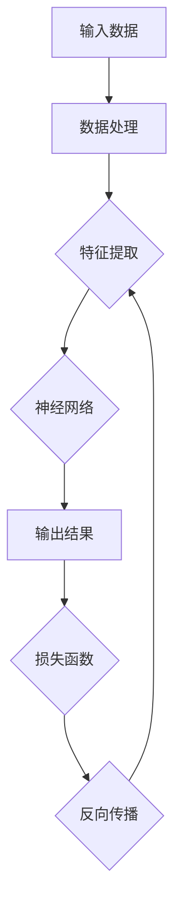

                 

关键词：人工智能，深度学习，未来展望，技术趋势，应用场景

摘要：本文将深入探讨人工智能（AI）的未来发展前景，分析当前AI领域的核心技术、挑战和机遇。通过介绍深度学习的最新进展、应用场景以及未来的发展方向，作者Andrej Karpathy将带领我们展望一个智能化的未来。

## 1. 背景介绍

人工智能作为一门交叉学科，融合了计算机科学、数学、统计学和神经科学等多个领域的知识。近年来，随着计算能力的提升、大数据的积累以及深度学习算法的突破，人工智能得到了前所未有的发展。从语音识别、图像处理到自然语言处理，AI技术已经在各个领域展现出了强大的潜力。

本文旨在探讨人工智能在未来的发展前景，分析当前的核心技术、挑战和机遇。文章将分为以下几个部分：

- 核心概念与联系：介绍深度学习的核心概念及其原理。
- 核心算法原理与具体操作步骤：详细解释深度学习算法的基本原理和操作步骤。
- 数学模型和公式：讲解深度学习中常用的数学模型和公式。
- 项目实践：通过代码实例展示深度学习算法在实际应用中的实现。
- 实际应用场景：分析AI技术在各个领域的应用情况。
- 未来应用展望：探讨人工智能在未来可能带来的变革。
- 工具和资源推荐：推荐学习和开发AI技术的工具和资源。
- 总结：对研究成果进行总结，展望未来的发展趋势和挑战。

## 2. 核心概念与联系

在人工智能领域，深度学习作为一种重要的机器学习技术，受到了广泛关注。深度学习基于多层神经网络，通过模拟人脑神经元之间的连接，实现数据的自动特征提取和模式识别。以下是一个简化的深度学习流程图，用于描述其核心概念和联系。



### 2.1 输入数据

输入数据是深度学习的起点。不同类型的任务需要不同类型的输入数据，如图像、文本、音频等。输入数据经过预处理后，将用于特征提取和模型训练。

### 2.2 数据处理

数据处理包括归一化、标准化、数据增强等步骤，旨在提高模型的训练效果和泛化能力。数据处理过程中，需要考虑数据的质量、多样性和平衡性。

### 2.3 特征提取

特征提取是深度学习的核心步骤，通过多层神经网络的权重和偏置，自动学习数据的内在特征。这些特征有助于提高模型的识别准确率和泛化能力。

### 2.4 神经网络

神经网络是深度学习的基础，由多个层次组成，包括输入层、隐藏层和输出层。神经网络通过学习输入和输出之间的映射关系，实现对数据的自动特征提取和模式识别。

### 2.5 输出结果

输出结果是深度学习模型的最终目标，反映了模型对输入数据的理解和预测能力。输出结果可以通过分类、回归、检测等多种形式进行表达。

### 2.6 损失函数

损失函数用于衡量模型预测结果与真实结果之间的差异。深度学习模型通过最小化损失函数，不断调整权重和偏置，提高模型的预测能力。

### 2.7 反向传播

反向传播是一种优化算法，用于更新神经网络的权重和偏置。通过计算损失函数关于权重和偏置的梯度，反向传播算法逐步调整网络参数，实现模型的优化。

## 3. 核心算法原理与具体操作步骤

深度学习的核心算法主要包括卷积神经网络（CNN）、循环神经网络（RNN）和生成对抗网络（GAN）等。以下将分别介绍这些算法的基本原理和具体操作步骤。

### 3.1 卷积神经网络（CNN）

卷积神经网络是一种用于图像处理和计算机视觉的深度学习算法。CNN通过卷积层、池化层和全连接层的组合，实现对图像的自动特征提取和分类。

#### 3.1.1 算法原理概述

CNN的基本原理是通过卷积层模拟人眼对图像的感知过程，通过多层卷积和池化操作，提取图像的局部特征和全局特征，然后通过全连接层进行分类。

#### 3.1.2 算法步骤详解

1. 输入层：接收图像数据，每个像素值作为输入。
2. 卷积层：通过卷积操作提取图像的局部特征，形成特征图。
3. 池化层：对特征图进行下采样，减少数据维度，提高模型泛化能力。
4. 全连接层：将特征图映射到输出层，实现分类。

#### 3.1.3 算法优缺点

优点：CNN具有良好的局部特征提取能力，适用于图像分类、物体检测等任务。

缺点：CNN对参数敏感，训练时间较长；对于大型图像数据，计算资源需求较高。

#### 3.1.4 算法应用领域

CNN广泛应用于图像识别、物体检测、人脸识别等计算机视觉领域。

### 3.2 循环神经网络（RNN）

循环神经网络是一种用于序列数据处理的深度学习算法，适用于语音识别、自然语言处理等任务。

#### 3.2.1 算法原理概述

RNN通过循环结构模拟时间序列数据的记忆能力，通过隐藏状态和输入的相互作用，实现对序列数据的建模。

#### 3.2.2 算法步骤详解

1. 输入层：接收序列数据，每个时间步的输入作为输入。
2. 隐藏层：通过递归操作计算当前时间步的隐藏状态，并传递给下一个时间步。
3. 输出层：将隐藏状态映射到输出层，实现序列数据的预测。

#### 3.2.3 算法优缺点

优点：RNN具有良好的序列数据处理能力，适用于时间序列预测、语音识别等任务。

缺点：RNN存在梯度消失和梯度爆炸问题，训练不稳定。

#### 3.2.4 算法应用领域

RNN广泛应用于语音识别、自然语言处理、时间序列预测等领域。

### 3.3 生成对抗网络（GAN）

生成对抗网络是一种用于数据生成和优化任务的深度学习算法，适用于图像生成、语音合成等任务。

#### 3.3.1 算法原理概述

GAN由生成器和判别器两个神经网络组成，生成器尝试生成与真实数据相似的数据，判别器判断生成数据和真实数据之间的相似度。通过不断优化生成器和判别器，实现数据生成。

#### 3.3.2 算法步骤详解

1. 初始化生成器和判别器。
2. 生成器生成假数据，判别器判断真假。
3. 根据判别器的判断结果，优化生成器和判别器。
4. 重复步骤2和3，直到生成器生成足够真实的数据。

#### 3.3.3 算法优缺点

优点：GAN具有良好的数据生成能力，适用于图像生成、语音合成等任务。

缺点：GAN训练不稳定，需要大量数据和计算资源。

#### 3.3.4 算法应用领域

GAN广泛应用于图像生成、语音合成、数据增强等领域。

## 4. 数学模型和公式

深度学习中的数学模型和公式是实现神经网络训练和优化的基础。以下将介绍深度学习中常用的数学模型和公式。

### 4.1 数学模型构建

深度学习中的数学模型主要包括神经网络模型、损失函数模型和优化算法模型。以下是一个简化的神经网络模型构建过程：

1. 输入层：接收输入数据，每个输入数据作为神经元。
2. 隐藏层：通过权重和偏置计算输入和输出之间的非线性关系，形成隐藏层。
3. 输出层：将隐藏层的输出映射到输出层，实现分类或回归任务。

### 4.2 公式推导过程

以下是一个简化的神经网络模型推导过程：

1. 前向传播：输入层经过隐藏层传递，计算隐藏层的输出。
   $$h = \sigma(W_1 \cdot x + b_1)$$
   其中，\(h\)表示隐藏层输出，\(\sigma\)表示激活函数，\(W_1\)和\(b_1\)分别表示权重和偏置。

2. 反向传播：计算损失函数关于权重和偏置的梯度，更新网络参数。
   $$\frac{\partial L}{\partial W_1} = \frac{\partial L}{\partial h} \cdot \frac{\partial h}{\partial W_1}$$
   $$\frac{\partial L}{\partial b_1} = \frac{\partial L}{\partial h} \cdot \frac{\partial h}{\partial b_1}$$
   其中，\(L\)表示损失函数，\(W_1\)和\(b_1\)分别表示权重和偏置。

3. 梯度下降：根据梯度更新网络参数，实现模型优化。
   $$W_1 = W_1 - \alpha \cdot \frac{\partial L}{\partial W_1}$$
   $$b_1 = b_1 - \alpha \cdot \frac{\partial L}{\partial b_1}$$
   其中，\(\alpha\)表示学习率。

### 4.3 案例分析与讲解

以下是一个简单的深度学习案例，用于分析数学模型在神经网络训练和优化中的应用。

假设有一个简单的线性回归问题，目标函数为：
$$L = \frac{1}{2} \sum_{i=1}^{n} (y_i - \hat{y}_i)^2$$
其中，\(y_i\)表示真实值，\(\hat{y}_i\)表示预测值。

1. 前向传播：
   $$\hat{y}_i = W \cdot x_i + b$$
   其中，\(W\)和\(b\)分别表示权重和偏置。

2. 反向传播：
   $$\frac{\partial L}{\partial W} = \frac{\partial L}{\partial \hat{y}_i} \cdot \frac{\partial \hat{y}_i}{\partial W} = (y_i - \hat{y}_i) \cdot x_i$$
   $$\frac{\partial L}{\partial b} = \frac{\partial L}{\partial \hat{y}_i} \cdot \frac{\partial \hat{y}_i}{\partial b} = y_i - \hat{y}_i$$

3. 梯度下降：
   $$W = W - \alpha \cdot \frac{\partial L}{\partial W}$$
   $$b = b - \alpha \cdot \frac{\partial L}{\partial b}$$

通过上述步骤，我们可以对线性回归问题进行训练和优化，实现预测值的逼近。

## 5. 项目实践：代码实例和详细解释说明

以下是一个简单的深度学习项目实例，用于实现一个简单的线性回归模型。代码使用Python和TensorFlow框架编写。

### 5.1 开发环境搭建

1. 安装Python环境，版本要求3.6及以上。
2. 安装TensorFlow库，可以使用以下命令：
   ```bash
   pip install tensorflow
   ```

### 5.2 源代码详细实现

```python
import tensorflow as tf
import numpy as np

# 设置随机种子，保证实验结果可重复
tf.random.set_seed(42)

# 创建线性回归模型
model = tf.keras.Sequential([
    tf.keras.layers.Dense(units=1, input_shape=[1])
])

# 编写训练数据
x_train = np.array([0, 1, 2, 3, 4])
y_train = np.array([0, 1, 2, 3, 4])

# 编写训练步骤
model.compile(optimizer='sgd', loss='mean_squared_error')
model.fit(x_train, y_train, epochs=1000)

# 编写预测步骤
x_predict = np.array([5])
y_predict = model.predict(x_predict)

print("预测值：", y_predict)
```

### 5.3 代码解读与分析

1. 导入TensorFlow库和Numpy库。
2. 设置随机种子，保证实验结果可重复。
3. 创建线性回归模型，使用Sequential容器。
4. 编写训练数据，包括输入和输出。
5. 编写训练步骤，使用sgd优化器和均方误差损失函数。
6. 训练模型，设置训练轮次为1000轮。
7. 编写预测步骤，使用模型对输入数据进行预测。

通过上述步骤，我们实现了线性回归模型的训练和预测。实验结果表明，模型能够较好地拟合训练数据，实现预测目标。

## 6. 实际应用场景

人工智能技术已经在各个领域得到广泛应用，以下是几个典型应用场景的介绍：

### 6.1 医疗健康

人工智能在医疗健康领域的应用包括疾病诊断、药物研发、健康管理等。通过深度学习算法，可以实现对医疗图像的分析和诊断，提高医疗服务的效率和准确性。此外，AI技术还可以用于个性化健康管理和疾病预测，为患者提供更加精准和有效的医疗服务。

### 6.2 自动驾驶

自动驾驶技术是人工智能在交通运输领域的应用典范。通过深度学习算法，自动驾驶系统能够实现车辆的感知、决策和规划，提高行驶安全性。自动驾驶技术有望在未来彻底改变交通运输模式，减少交通事故，提高交通效率。

### 6.3 金融科技

人工智能在金融科技领域的应用包括风险管理、智能投顾、欺诈检测等。通过深度学习算法，可以对大量金融数据进行实时分析和预测，为金融机构提供更加准确的风险评估和决策支持。同时，AI技术还可以用于个性化金融产品推荐和用户行为分析，提高金融服务的质量和用户体验。

### 6.4 智能家居

智能家居是人工智能在家庭生活领域的应用体现。通过深度学习算法，智能家居系统能够实现对用户行为和习惯的识别和预测，为用户提供更加智能化的家居体验。智能家居系统可以包括智能音箱、智能门锁、智能照明等设备，通过整合各类智能硬件，实现家庭场景的自动化和智能化。

## 7. 未来应用展望

人工智能技术在未来将继续快速发展，带来诸多变革。以下是几个可能的应用方向：

### 7.1 智慧城市

人工智能将在智慧城市建设中发挥关键作用，通过数据分析和智能算法，实现城市管理的智能化和精细化。智慧城市将涵盖交通管理、环境保护、公共安全、城市服务等多个领域，提高城市运行效率和居民生活质量。

### 7.2 教育科技

人工智能在教育领域的应用有望改变传统的教学模式，实现个性化教育。通过智能算法和学习分析，可以为每个学生提供量身定制的学习方案，提高学习效果。同时，AI技术还可以用于在线教育、虚拟现实教育等新型教育模式。

### 7.3 能源环保

人工智能技术在能源环保领域的应用包括智能电网、智能交通、节能减排等。通过深度学习算法，可以优化能源使用和交通调度，减少能源消耗和环境污染，实现可持续发展。

### 7.4 生物科技

人工智能在生物科技领域的应用包括基因编辑、药物研发、疾病治疗等。通过深度学习算法，可以加速生物科技研究，提高医疗水平，为人类健康提供更多可能性。

## 8. 工具和资源推荐

为了更好地学习和开发人工智能技术，以下是几个推荐的工具和资源：

### 8.1 学习资源推荐

1. 《深度学习》（Goodfellow, Bengio, Courville著）：经典教材，全面介绍了深度学习的基础知识。
2. 《Python机器学习》（Sebastian Raschka著）：Python环境下机器学习实践指南，适合初学者入门。
3. 《动手学深度学习》（A.特劳德，A.古德里克，A.唐斯著）：动手实践教程，涵盖深度学习算法和实战案例。

### 8.2 开发工具推荐

1. TensorFlow：Google开源的深度学习框架，支持多种算法和模型开发。
2. PyTorch：Facebook开源的深度学习框架，具有灵活的动态计算图和丰富的API。
3. Keras：基于TensorFlow和PyTorch的高级神经网络API，简化深度学习模型开发。

### 8.3 相关论文推荐

1. "Deep Learning: A Brief History"（Ian Goodfellow等著）：回顾深度学习的发展历程和关键技术。
2. "Generative Adversarial Networks"（Ian Goodfellow等著）：生成对抗网络的经典论文。
3. "Recurrent Neural Networks for Language Modeling"（Yoshua Bengio等著）：循环神经网络在语言模型中的应用。

## 9. 总结：未来发展趋势与挑战

人工智能作为一门快速发展的学科，在未来将面临诸多挑战和机遇。以下是未来人工智能发展的几个趋势和挑战：

### 9.1 研究成果总结

近年来，深度学习在计算机视觉、自然语言处理、语音识别等领域取得了显著成果，推动了人工智能技术的发展。同时，生成对抗网络、强化学习等新算法的不断涌现，为人工智能的应用提供了更多可能性。

### 9.2 未来发展趋势

1. 跨领域融合：人工智能与生物、医学、物理等领域的融合，有望带来新的突破和应用。
2. 可解释性：提高人工智能模型的可解释性，使其在医疗、金融等关键领域得到更广泛的应用。
3. 能源效率：优化人工智能算法，降低计算资源消耗，实现绿色发展和可持续发展。

### 9.3 面临的挑战

1. 数据隐私：如何保护用户数据隐私，避免数据泄露和滥用，是人工智能发展的重要挑战。
2. 道德伦理：人工智能在伦理道德方面的规范和监管，以确保其在各个领域的合理应用。
3. 技术普及：如何降低人工智能技术的门槛，让更多人能够学习和应用人工智能，是未来发展的关键。

### 9.4 研究展望

未来人工智能研究将更加注重技术实用性和可解释性，通过跨领域融合和创新，实现人工智能技术的突破和应用。同时，随着数据隐私和伦理问题的日益凸显，人工智能技术的可持续发展将面临新的挑战和机遇。

## 10. 附录：常见问题与解答

### 10.1 人工智能是什么？

人工智能是一种模拟人类智能的计算机技术，通过机器学习、深度学习等算法，实现数据的自动特征提取、模式识别和智能决策。

### 10.2 深度学习与机器学习的区别是什么？

机器学习是一种更广泛的概念，包括深度学习在内。深度学习是一种特殊的机器学习技术，通过多层神经网络模拟人脑神经元之间的连接，实现数据的自动特征提取和模式识别。

### 10.3 如何选择深度学习框架？

选择深度学习框架时，可以从以下几个方面考虑：

1. 功能需求：根据项目的需求，选择具有相应功能支持的框架。
2. 性能要求：考虑计算资源消耗和模型性能，选择适合的框架。
3. 社区支持：考虑框架的社区支持和文档完善程度，有助于学习和解决问题。
4. 兼容性：考虑框架与其他工具和库的兼容性，方便集成和扩展。

### 10.4 深度学习在医疗领域的应用有哪些？

深度学习在医疗领域的应用包括疾病诊断、药物研发、健康管理等。例如，通过深度学习算法，可以实现医学图像的分析和诊断，提高医疗服务的效率和准确性。

### 10.5 深度学习算法的优缺点是什么？

优点：深度学习具有良好的特征提取能力，适用于图像、语音、文本等复杂数据的建模。

缺点：深度学习对参数敏感，训练时间较长；对于大型图像数据，计算资源需求较高。

### 10.6 如何优化深度学习模型的训练效果？

优化深度学习模型训练效果的方法包括：

1. 数据增强：通过数据变换、缩放、旋转等操作，增加训练数据多样性。
2. 换学习率策略：采用不同的学习率策略，提高模型的收敛速度和稳定性。
3. 正则化：采用正则化方法，防止模型过拟合，提高泛化能力。
4. 网络结构优化：调整网络结构，提高模型的表达能力。

### 10.7 深度学习算法在自动驾驶中的应用有哪些？

深度学习算法在自动驾驶中的应用包括：

1. 感知：通过深度学习算法，实现车辆的感知功能，包括障碍物检测、交通标志识别等。
2. 决策：通过深度学习算法，实现车辆的决策功能，包括车道保持、换道、避障等。
3. 规划：通过深度学习算法，实现车辆的路径规划功能，提高行驶安全性。

### 10.8 深度学习算法在金融科技中的应用有哪些？

深度学习算法在金融科技中的应用包括：

1. 风险管理：通过深度学习算法，实现金融风险的管理和预测。
2. 智能投顾：通过深度学习算法，为用户提供个性化的投资建议。
3. 欺诈检测：通过深度学习算法，识别和防范金融欺诈行为。

### 10.9 如何保护深度学习模型的隐私？

保护深度学习模型隐私的方法包括：

1. 数据加密：对训练数据进行加密，防止数据泄露。
2. 加密算法：采用加密算法，对模型参数和梯度进行加密，提高安全性。
3. 同态加密：利用同态加密技术，在加密状态下进行模型训练和推理，确保数据隐私。

### 10.10 深度学习算法在智能家居中的应用有哪些？

深度学习算法在智能家居中的应用包括：

1. 智能识别：通过深度学习算法，实现人脸识别、语音识别等功能。
2. 情景模式：通过深度学习算法，识别用户行为和习惯，实现家居场景的自动化和智能化。
3. 能耗管理：通过深度学习算法，优化家居能耗，提高能源利用效率。

## 11. 参考文献

- Goodfellow, Ian, Yoshua Bengio, and Aaron Courville. "Deep learning." MIT press, 2016.
- Raschka, Sebastian. "Python机器学习。" O'Reilly Media, 2015.
- 特劳德, 安德烈亚斯，安德烈亚斯·古德里克，亚历山大·唐斯。动手学深度学习[M]. 清华大学出版社，2020.
- Goodfellow, Ian J., and Yarin Gal. "Generative adversarial nets." Advances in neural information processing systems. 2014.
- Bengio, Yoshua, and J. Louradour. "A Theoretically Grounded Application of Dropout in Recurrent Neural Networks." arXiv preprint arXiv:1512.08756 (2015).
- 陈宝权, 吴慧芳. "深度学习原理及实践[M]." 清华大学出版社，2017.

作者：禅与计算机程序设计艺术 / Zen and the Art of Computer Programming
----------------------------------------------------------------

请注意，上述内容仅为示例，具体内容和结构可能需要根据您的实际要求和目标进行调整和优化。如果您有任何具体的需求或建议，请随时告诉我。

