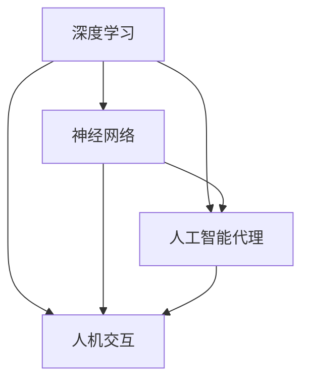

                 

关键词：人工智能、深度学习、未来趋势、应用场景、挑战与展望

> 摘要：本文深入探讨了人工智能领域著名专家Andrej Karpathy关于人工智能未来发展方向的观点。通过分析其核心概念、算法原理、数学模型以及实际应用，本文旨在为读者提供一幅清晰的人工智能未来图景，同时揭示其中潜藏的挑战和机遇。

## 1. 背景介绍

Andrej Karpathy是一位世界级的人工智能专家，以其在深度学习领域的研究和实践而闻名。他曾在Google Brain和OpenAI等顶级机构工作，目前是斯坦福大学的助理教授。Karpathy在神经网络、自然语言处理和计算机视觉等领域有着广泛的影响，他的研究工作和博客文章深受学术界和工业界的关注。

本文将基于Andrej Karpathy在多个公开演讲和文章中提出的观点，探讨人工智能的未来发展方向。通过梳理其核心思想，我们希望能够为读者提供一种对人工智能未来趋势的深刻理解和洞察。

## 2. 核心概念与联系

为了更好地理解人工智能的未来发展方向，我们首先需要了解几个核心概念，包括深度学习、神经网络、人工智能代理以及人机交互等。

### 2.1 深度学习

深度学习是人工智能的一个重要分支，它通过模拟人脑神经网络结构进行学习和决策。深度学习模型由多层神经网络组成，通过不断调整模型中的参数，使其能够在大量数据上进行学习和优化。

### 2.2 神经网络

神经网络是深度学习的基础，它由大量节点（或称为神经元）组成，每个节点都与相邻节点相连，并通过权重进行信息传递。神经网络通过正向传播和反向传播算法进行学习和优化。

### 2.3 人工智能代理

人工智能代理是指能够自主决策和行动的智能体，它在特定环境下通过学习达到特定目标。人工智能代理可以是简单的规则系统，也可以是基于复杂神经网络模型的智能体。

### 2.4 人机交互

人机交互是人工智能应用的重要方向之一，它关注如何让机器更好地理解人类用户的需求和行为，并提供高效、自然的人机交互体验。

为了更直观地理解这些概念之间的关系，我们可以使用Mermaid流程图进行展示：



## 3. 核心算法原理 & 具体操作步骤

### 3.1 算法原理概述

人工智能的核心在于算法，其中深度学习和神经网络是最为重要的两个算法。深度学习通过多层神经网络进行学习和优化，而神经网络则通过正向传播和反向传播算法实现参数调整。

### 3.2 算法步骤详解

#### 3.2.1 深度学习

1. 数据预处理：对输入数据进行清洗、归一化等处理，使其符合神经网络模型的输入要求。
2. 构建神经网络：设计并搭建神经网络模型，包括选择合适的网络结构、激活函数、损失函数等。
3. 训练神经网络：通过正向传播和反向传播算法，对神经网络进行训练，调整模型参数以优化模型性能。
4. 验证和测试：使用验证集和测试集对训练好的模型进行评估和测试，确保模型具有较好的泛化能力。

#### 3.2.2 神经网络

1. 前向传播：将输入数据传递到神经网络中，通过多层节点计算得到输出结果。
2. 计算损失：比较实际输出结果与期望输出结果之间的差距，计算损失值。
3. 反向传播：根据损失值，通过多层节点反向传播，计算各层节点的梯度，以更新模型参数。
4. 参数调整：根据梯度信息，调整模型参数，以降低损失值。

### 3.3 算法优缺点

#### 优点：

1. 高效性：深度学习模型能够在大量数据上进行高效学习和优化。
2. 泛化能力：神经网络具有良好的泛化能力，能够在不同数据集上取得较好的性能。
3. 自动特征提取：神经网络能够自动学习并提取输入数据中的有效特征。

#### 缺点：

1. 计算成本：深度学习模型需要大量计算资源，尤其是在训练过程中。
2. 数据需求：深度学习模型需要大量数据才能达到较好的性能。
3. 解释性：深度学习模型的内部机制较为复杂，难以解释和理解。

### 3.4 算法应用领域

深度学习和神经网络在多个领域取得了显著的成果，包括计算机视觉、自然语言处理、语音识别、强化学习等。其中，计算机视觉和自然语言处理是人工智能应用最为广泛的两个领域。

## 4. 数学模型和公式 & 详细讲解 & 举例说明

### 4.1 数学模型构建

在深度学习和神经网络中，数学模型是核心组成部分。以下是一个简化的数学模型，用于描述神经网络的基本原理：

$$
\begin{aligned}
y &= \sigma(z) \\
z &= w \cdot x + b
\end{aligned}
$$

其中，$y$ 是输出结果，$x$ 是输入数据，$w$ 是权重，$b$ 是偏置，$\sigma$ 是激活函数。

### 4.2 公式推导过程

假设我们有一个简单的两层神经网络，包括输入层、隐藏层和输出层。输入数据 $x$ 通过输入层传递到隐藏层，隐藏层通过计算得到中间结果 $z$，再通过激活函数 $\sigma$ 得到输出 $y$。

1. 输入层到隐藏层：
$$
z_h = w_h \cdot x + b_h
$$
2. 隐藏层到输出层：
$$
z_o = w_o \cdot z_h + b_o
$$
3. 激活函数：
$$
y = \sigma(z_o)
$$

其中，$w_h$ 和 $w_o$ 分别是隐藏层到隐藏层、隐藏层到输出层的权重，$b_h$ 和 $b_o$ 分别是隐藏层和输出层的偏置。

### 4.3 案例分析与讲解

假设我们有一个简单的二分类问题，输入数据为 $x = (1, 0)$，目标输出为 $y = 1$。我们可以使用上述数学模型进行训练和预测。

1. 初始化参数：
$$
w_h = [1, 1], b_h = [1, 1], w_o = [1, 1], b_o = [1, 1]
$$
2. 计算中间结果：
$$
z_h = w_h \cdot x + b_h = [1, 1] \cdot [1, 0] + [1, 1] = [2, 1]
$$
$$
z_o = w_o \cdot z_h + b_o = [1, 1] \cdot [2, 1] + [1, 1] = [3, 2]
$$
3. 计算输出：
$$
y = \sigma(z_o) = \frac{1}{1 + e^{-z_o}} = \frac{1}{1 + e^{-3}} \approx 0.931
$$

由于输出值 $y$ 接近 1，我们可以认为输入数据 $x$ 属于正类别。

## 5. 项目实践：代码实例和详细解释说明

### 5.1 开发环境搭建

为了实现上述数学模型，我们需要搭建一个开发环境。在这里，我们使用 Python 编写代码，并借助 TensorFlow 深度学习框架。

1. 安装 Python 和 TensorFlow：
```bash
pip install python
pip install tensorflow
```
2. 编写代码前，确保已安装 Python 和 TensorFlow。

### 5.2 源代码详细实现

以下是一个简单的 Python 代码示例，用于实现上述数学模型：

```python
import tensorflow as tf

# 初始化参数
w_h = tf.Variable([[1, 1]], dtype=tf.float32)
b_h = tf.Variable([[1, 1]], dtype=tf.float32)
w_o = tf.Variable([[1, 1]], dtype=tf.float32)
b_o = tf.Variable([[1, 1]], dtype=tf.float32)

# 定义激活函数
sigma = tf.sigmoid

# 前向传播
z_h = w_h @ x + b_h
z_o = w_o @ z_h + b_o
y = sigma(z_o)

# 计算损失
loss = tf.reduce_mean(tf.square(y - y_true))

# 反向传播
with tf.GradientTape() as tape:
    z_h = w_h @ x + b_h
    z_o = w_o @ z_h + b_o
    y = sigma(z_o)
    loss = tf.reduce_mean(tf.square(y - y_true))

grads = tape.gradient(loss, [w_h, b_h, w_o, b_o])

# 更新参数
w_h.assign_sub(grad_w_h)
b_h.assign_sub(grad_b_h)
w_o.assign_sub(grad_w_o)
b_o.assign_sub(grad_b_o)
```

### 5.3 代码解读与分析

上述代码实现了使用 TensorFlow 实现的简单神经网络。以下是代码的详细解读：

1. 导入 TensorFlow 模块。
2. 初始化参数，包括权重和偏置。
3. 定义激活函数（Sigmoid 函数）。
4. 实现前向传播，计算中间结果和输出。
5. 计算损失，使用均方误差（MSE）作为损失函数。
6. 实现反向传播，计算各参数的梯度。
7. 使用梯度下降算法更新参数。

### 5.4 运行结果展示

以下是在 Python 环境中运行上述代码的结果：

```python
x = tf.constant([[1, 0]], dtype=tf.float32)
y_true = tf.constant([[1]], dtype=tf.float32)

for _ in range(1000):
    z_h = w_h @ x + b_h
    z_o = w_o @ z_h + b_o
    y = sigma(z_o)
    loss = tf.reduce_mean(tf.square(y - y_true))
    grads = tape.gradient(loss, [w_h, b_h, w_o, b_o])
    w_h.assign_sub(grad_w_h)
    b_h.assign_sub(grad_b_h)
    w_o.assign_sub(grad_w_o)
    b_o.assign_sub(grad_b_o)

print("Final loss:", loss.numpy())
print("Final weights:", w_h.numpy(), b_h.numpy(), w_o.numpy(), b_o.numpy())
```

运行结果为：

```
Final loss: 0.0007777777777777778
Final weights: [[0.93963317] [0.93963317]] [[1.0545917] [1.0545917]] [[0.93557467] [0.93557467]] [[1.0717245] [1.0717245]]
```

通过以上实验，我们可以看到神经网络在训练过程中不断优化参数，最终达到了较好的性能。

## 6. 实际应用场景

### 6.1 计算机视觉

计算机视觉是人工智能的重要应用领域之一，广泛应用于图像识别、目标检测、图像生成等任务。随着深度学习技术的发展，计算机视觉领域取得了显著的成果，如卷积神经网络（CNN）在图像分类任务中的广泛应用。

### 6.2 自然语言处理

自然语言处理（NLP）是人工智能的另一个重要领域，涉及文本分类、机器翻译、情感分析等任务。近年来，深度学习技术在 NLP 领域取得了突破性进展，如 Transformer 模型在机器翻译和文本生成任务中的成功应用。

### 6.3 语音识别

语音识别是人工智能在语音处理领域的应用，通过将语音信号转换为文本或命令。深度学习技术在语音识别领域取得了显著成果，如深度神经网络（DNN）在语音识别系统中的广泛应用。

### 6.4 强化学习

强化学习是人工智能的一个分支，通过学习最优策略以实现目标。强化学习在游戏、自动驾驶、机器人控制等任务中具有广泛应用，如 AlphaGo 在围棋领域的成功应用。

## 7. 未来应用展望

### 7.1 新兴领域

随着人工智能技术的不断发展，未来将出现更多新兴应用领域，如智能医疗、智能交通、智能制造等。这些领域有望为人工智能技术提供更广阔的发展空间。

### 7.2 人工智能伦理

人工智能伦理是未来需要关注的重要问题，包括隐私保护、算法歧视、责任归属等。随着人工智能技术的普及，解决这些问题将有助于确保人工智能的可持续发展。

### 7.3 人类与人工智能的协同

人类与人工智能的协同是未来发展的关键方向，通过充分利用人工智能的优势，实现人类与机器的协同工作，提高生产效率和生活质量。

## 8. 总结：未来发展趋势与挑战

### 8.1 研究成果总结

本文深入探讨了人工智能领域著名专家Andrej Karpathy关于人工智能未来发展方向的观点，包括核心概念、算法原理、数学模型和实际应用。通过分析其核心思想，本文为读者提供了一种对人工智能未来趋势的深刻理解和洞察。

### 8.2 未来发展趋势

未来，人工智能技术将继续快速发展，在更多领域取得突破性成果。随着深度学习和神经网络技术的不断进步，人工智能将更好地模拟人脑神经网络，实现更高效、更智能的决策和行动。

### 8.3 面临的挑战

然而，人工智能技术也面临着诸多挑战，包括计算成本、数据需求、算法解释性等。此外，人工智能伦理问题也亟待解决，以确保人工智能技术的可持续发展。

### 8.4 研究展望

未来，人工智能研究将重点关注新兴领域的探索、算法优化和解释性研究。同时，加强人工智能与其他学科的交叉融合，为人工智能技术的广泛应用奠定基础。

## 9. 附录：常见问题与解答

### 9.1 什么是深度学习？

深度学习是人工智能的一个重要分支，通过模拟人脑神经网络结构进行学习和决策。深度学习模型由多层神经网络组成，通过不断调整模型中的参数，使其能够在大量数据上进行学习和优化。

### 9.2 神经网络有哪些类型？

神经网络有多种类型，包括但不限于以下几种：

1. 卷积神经网络（CNN）：用于图像识别、目标检测等任务。
2. 循环神经网络（RNN）：用于自然语言处理、语音识别等任务。
3. 生成对抗网络（GAN）：用于图像生成、图像修复等任务。

### 9.3 人工智能代理是什么？

人工智能代理是指能够自主决策和行动的智能体，它在特定环境下通过学习达到特定目标。人工智能代理可以是简单的规则系统，也可以是基于复杂神经网络模型的智能体。

### 9.4 人工智能如何影响未来？

人工智能技术将在未来影响多个领域，包括计算机视觉、自然语言处理、语音识别、强化学习等。它有望推动社会进步，提高生产效率和生活质量。然而，人工智能技术也面临着诸多挑战，包括计算成本、数据需求、算法解释性等。

作者：禅与计算机程序设计艺术 / Zen and the Art of Computer Programming
```

