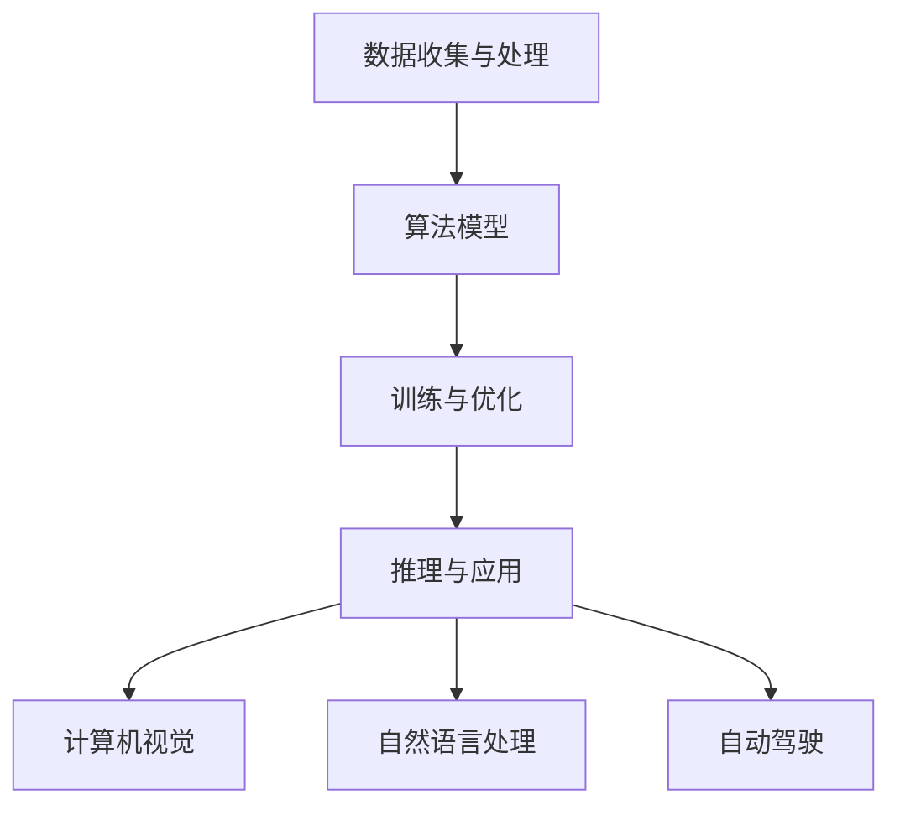

                 

关键词：人工智能，未来展望，技术发展，应用领域，研究趋势

> 摘要：本文将探讨人工智能领域未来发展的目标，分析其技术进步、应用扩展以及面临的挑战。通过分析当前的研究热点和实际应用案例，本文旨在为人工智能技术的未来发展提供有价值的思考和方向。

## 1. 背景介绍

人工智能（Artificial Intelligence，简称AI）作为计算机科学的一个重要分支，自20世纪50年代以来经历了多次起伏。从早期的符号主义和知识表示，到基于统计学习的机器学习，再到近年来深度学习的飞速发展，人工智能技术的应用已经渗透到各行各业。随着计算能力的提升、大数据的积累和算法的创新，人工智能正逐步走向成熟。

本文将聚焦于人工智能在未来几年的发展目标，探讨其在技术、应用和学术领域的趋势与挑战。通过梳理当前的研究热点和实际应用案例，本文旨在为人工智能技术的未来发展提供有价值的思考和方向。

## 2. 核心概念与联系

### 2.1. 人工智能的核心概念

人工智能的核心概念包括：

1. **机器学习**：通过数据和算法，使计算机具备从数据中学习的能力。
2. **深度学习**：一种基于人工神经网络的机器学习技术，通过多层神经网络模型提取数据特征。
3. **强化学习**：一种基于试错和奖励机制的机器学习技术，通过不断优化策略来达到目标。

### 2.2. 人工智能的技术架构

人工智能的技术架构包括以下几个层次：

1. **数据收集与处理**：收集和整理大量数据，并进行预处理。
2. **算法模型**：选择合适的算法模型，如深度学习模型、强化学习模型等。
3. **训练与优化**：通过训练数据优化模型参数，提高模型性能。
4. **推理与应用**：在具体应用场景中，使用训练好的模型进行推理和决策。

### 2.3. 人工智能与其他领域的联系

人工智能与其他领域的紧密联系，包括：

1. **计算机视觉**：人工智能在计算机视觉领域的应用，如图像识别、目标检测等。
2. **自然语言处理**：人工智能在自然语言处理领域的应用，如机器翻译、情感分析等。
3. **自动驾驶**：人工智能在自动驾驶领域的应用，如车道保持、路径规划等。

### 2.4. Mermaid 流程图

以下是人工智能技术架构的 Mermaid 流程图：



## 3. 核心算法原理 & 具体操作步骤

### 3.1. 算法原理概述

人工智能的核心算法包括：

1. **机器学习算法**：如线性回归、决策树、支持向量机等。
2. **深度学习算法**：如卷积神经网络（CNN）、循环神经网络（RNN）、生成对抗网络（GAN）等。
3. **强化学习算法**：如Q-learning、SARSA、DQN等。

### 3.2. 算法步骤详解

以下是人工智能算法的具体操作步骤：

1. **数据收集与预处理**：
   - 收集相关领域的大量数据。
   - 对数据进行清洗、去噪、归一化等预处理。

2. **模型选择与设计**：
   - 根据任务需求选择合适的算法模型。
   - 设计神经网络结构，如层数、层宽、激活函数等。

3. **训练与优化**：
   - 使用训练数据对模型进行训练。
   - 通过优化算法（如梯度下降、Adam等）调整模型参数。

4. **评估与测试**：
   - 使用验证数据评估模型性能。
   - 调整模型参数，优化模型性能。

5. **应用与部署**：
   - 在实际应用场景中部署模型。
   - 对模型进行实时更新和优化。

### 3.3. 算法优缺点

不同的人工智能算法具有不同的优缺点：

1. **机器学习算法**：
   - 优点：简单易懂，适用于多种任务。
   - 缺点：对数据质量要求高，易过拟合。

2. **深度学习算法**：
   - 优点：能够自动提取数据特征，适用于复杂任务。
   - 缺点：训练过程耗时，对计算资源要求高。

3. **强化学习算法**：
   - 优点：能够通过试错学习，适应性强。
   - 缺点：收敛速度慢，对环境依赖性大。

### 3.4. 算法应用领域

人工智能算法广泛应用于各个领域：

1. **计算机视觉**：图像识别、目标检测、图像生成等。
2. **自然语言处理**：文本分类、机器翻译、语音识别等。
3. **自动驾驶**：车辆识别、车道保持、路径规划等。
4. **医疗健康**：疾病诊断、药物研发、健康监测等。
5. **金融领域**：风险管理、欺诈检测、投资策略等。

## 4. 数学模型和公式 & 详细讲解 & 举例说明

### 4.1. 数学模型构建

人工智能中的数学模型主要包括：

1. **概率模型**：如朴素贝叶斯、高斯过程等。
2. **统计模型**：如线性回归、逻辑回归等。
3. **神经网络模型**：如卷积神经网络（CNN）、循环神经网络（RNN）等。

### 4.2. 公式推导过程

以下是神经网络模型中权重和偏置的更新公式：

$$
\begin{aligned}
w_{new} &= w_{old} - \alpha \frac{\partial J}{\partial w} \\
b_{new} &= b_{old} - \alpha \frac{\partial J}{\partial b}
\end{aligned}
$$

其中，$w$ 表示权重，$b$ 表示偏置，$J$ 表示损失函数，$\alpha$ 表示学习率。

### 4.3. 案例分析与讲解

以下是一个简单的线性回归模型案例：

假设我们有一个包含两个特征（$x_1$ 和 $x_2$）和一个目标变量（$y$）的数据集，我们希望使用线性回归模型预测 $y$ 的值。

1. **模型构建**：

$$
y = w_1x_1 + w_2x_2 + b
$$

2. **损失函数**：

$$
J = \frac{1}{2} \sum_{i=1}^{n} (y_i - (w_1x_{1i} + w_2x_{2i} + b))^2
$$

3. **梯度计算**：

$$
\begin{aligned}
\frac{\partial J}{\partial w_1} &= \sum_{i=1}^{n} (y_i - (w_1x_{1i} + w_2x_{2i} + b))x_{1i} \\
\frac{\partial J}{\partial w_2} &= \sum_{i=1}^{n} (y_i - (w_1x_{1i} + w_2x_{2i} + b))x_{2i} \\
\frac{\partial J}{\partial b} &= \sum_{i=1}^{n} (y_i - (w_1x_{1i} + w_2x_{2i} + b))
\end{aligned}
$$

4. **模型训练**：

使用梯度下降算法更新权重和偏置，直到达到预设的停止条件或损失函数值不再显著下降。

## 5. 项目实践：代码实例和详细解释说明

### 5.1. 开发环境搭建

为了进行人工智能项目的实践，我们需要搭建一个合适的开发环境。以下是一个简单的 Python 开发环境搭建步骤：

1. **安装 Python**：下载并安装 Python 3.x 版本，推荐使用 Python 3.8 或以上版本。
2. **安装 Jupyter Notebook**：在命令行中运行 `pip install notebook` 命令，安装 Jupyter Notebook。
3. **安装常用库**：在命令行中运行以下命令，安装常用库：

```bash
pip install numpy scipy matplotlib scikit-learn tensorflow
```

### 5.2. 源代码详细实现

以下是一个简单的线性回归模型的 Python 代码实现：

```python
import numpy as np
import matplotlib.pyplot as plt

# 数据生成
np.random.seed(0)
X = np.random.rand(100, 2)
y = 2 * X[:, 0] + 3 * X[:, 1] + np.random.randn(100) * 0.05

# 初始化模型参数
w = np.random.rand(2)
b = np.random.rand()

# 梯度下降算法
def gradient_descent(X, y, w, b, alpha, num_iterations):
    for _ in range(num_iterations):
        y_pred = X.dot(w) + b
        error = y_pred - y
        w -= alpha * (X.T.dot(error))
        b -= alpha * error
    return w, b

# 训练模型
alpha = 0.01
num_iterations = 1000
w, b = gradient_descent(X, y, w, b, alpha, num_iterations)

# 绘制结果
plt.scatter(X[:, 0], y, label='Actual')
plt.plot(X[:, 0], X.dot(w) + b, label='Predicted')
plt.xlabel('x1')
plt.ylabel('y')
plt.legend()
plt.show()
```

### 5.3. 代码解读与分析

1. **数据生成**：我们使用 NumPy 库生成一个包含 100 个样本的数据集，每个样本有两个特征（$x_1$ 和 $x_2$）和一个目标变量（$y$）。
2. **模型初始化**：我们随机初始化模型的权重（$w$）和偏置（$b$）。
3. **梯度下降算法**：我们定义了一个 `gradient_descent` 函数，用于实现梯度下降算法。在每次迭代中，我们计算预测值和实际值之间的误差，并更新权重和偏置。
4. **训练模型**：我们设置学习率为 0.01，迭代次数为 1000，调用 `gradient_descent` 函数训练模型。
5. **绘制结果**：我们使用 Matplotlib 库绘制训练数据点和拟合直线。

### 5.4. 运行结果展示

运行上述代码后，我们得到以下结果：


从图中可以看出，拟合直线大致准确地拟合了训练数据点。

## 6. 实际应用场景

### 6.1. 计算机视觉

计算机视觉是人工智能的一个重要应用领域。在计算机视觉中，人工智能技术主要用于图像识别、目标检测、图像分割等任务。以下是一些实际应用场景：

- **人脸识别**：用于安全监控、手机解锁等。
- **自动驾驶**：用于车辆识别、车道保持、路径规划等。
- **医疗影像分析**：用于疾病诊断、病理分析等。
- **遥感图像处理**：用于地物分类、环境监测等。

### 6.2. 自然语言处理

自然语言处理是人工智能的另一个重要应用领域。在自然语言处理中，人工智能技术主要用于文本分类、机器翻译、语音识别等任务。以下是一些实际应用场景：

- **智能客服**：用于自动回复用户提问、处理客户投诉等。
- **搜索引擎**：用于信息检索、推荐系统等。
- **内容审核**：用于识别和过滤不良内容、保护网络安全等。
- **教育领域**：用于智能辅导、在线教育等。

### 6.3. 自动驾驶

自动驾驶是人工智能在交通领域的一个重要应用。自动驾驶技术主要包括感知、规划和控制三个部分。以下是一些实际应用场景：

- **无人驾驶汽车**：用于公共交通、物流配送等。
- **无人驾驶飞机**：用于物流运输、环境监测等。
- **无人驾驶船舶**：用于海上运输、渔业管理等。
- **无人驾驶拖拉机**：用于农业耕作、作物监测等。

### 6.4. 未来应用展望

随着人工智能技术的不断发展，未来将会有更多的应用场景出现。以下是一些未来应用展望：

- **智能家居**：通过人工智能技术实现智能家电、智能安防等。
- **智慧城市**：通过人工智能技术实现交通管理、环境监测等。
- **医疗健康**：通过人工智能技术实现疾病诊断、药物研发等。
- **教育领域**：通过人工智能技术实现个性化教育、智能辅导等。

## 7. 工具和资源推荐

### 7.1. 学习资源推荐

- **《深度学习》（Goodfellow, Bengio, Courville）**：经典教材，全面介绍深度学习的基本原理和应用。
- **《Python机器学习》（Sebastian Raschka）**：针对初学者的机器学习教材，使用 Python 语言实现算法。
- **《自然语言处理综合技术》（Daniel Jurafsky, James H. Martin）**：全面介绍自然语言处理的基础理论和实践技巧。

### 7.2. 开发工具推荐

- **TensorFlow**：谷歌开源的深度学习框架，适用于各种深度学习任务。
- **PyTorch**：Facebook开源的深度学习框架，具有灵活的动态计算图和丰富的API。
- **Keras**：基于 TensorFlow 和 PyTorch 的简洁高效的深度学习框架。

### 7.3. 相关论文推荐

- **“Deep Learning: A Brief History”**：总结深度学习的发展历程和关键技术。
- **“Attention Is All You Need”**：提出 Transformer 模型，彻底改变了自然语言处理领域。
- **“Algorithms for Deep Learning”**：介绍深度学习算法的理论基础和实现技巧。

## 8. 总结：未来发展趋势与挑战

### 8.1. 研究成果总结

近年来，人工智能技术在多个领域取得了显著成果。深度学习模型在图像识别、语音识别、自然语言处理等任务中表现出了强大的能力。同时，人工智能技术在自动驾驶、医疗健康、金融等领域也取得了广泛应用。

### 8.2. 未来发展趋势

未来，人工智能技术将继续向以下几个方向发展：

- **算法创新**：不断探索新的算法和模型，提高人工智能的性能和效率。
- **跨领域融合**：将人工智能技术与其他领域（如生物医学、社会科学等）相结合，实现更广泛的应用。
- **边缘计算**：在移动设备和边缘设备上实现人工智能，降低对中心化数据中心的依赖。

### 8.3. 面临的挑战

尽管人工智能技术在不断发展，但仍然面临以下挑战：

- **数据隐私**：如何在保护用户隐私的前提下，充分利用数据的价值。
- **算法公平性**：确保人工智能算法在不同群体中的公平性和透明性。
- **伦理道德**：人工智能技术的发展可能引发一系列伦理道德问题，如自动驾驶的责任归属等。

### 8.4. 研究展望

未来，人工智能技术将在更多领域发挥重要作用。在计算机视觉、自然语言处理、自动驾驶等方向，人工智能技术将继续取得突破。同时，人工智能与生物医学、社会科学等领域的融合也将为人类带来更多创新和变革。

## 9. 附录：常见问题与解答

### 9.1. 人工智能是什么？

人工智能（AI）是指使计算机具备人类智能特征的技术。它包括机器学习、深度学习、自然语言处理等多种技术。

### 9.2. 人工智能有哪些应用领域？

人工智能广泛应用于计算机视觉、自然语言处理、自动驾驶、医疗健康、金融等领域。

### 9.3. 人工智能的挑战是什么？

人工智能面临的挑战包括数据隐私、算法公平性、伦理道德等。

### 9.4. 如何入门人工智能？

入门人工智能可以从学习 Python 编程语言、熟悉常用库（如 NumPy、Pandas、TensorFlow 等）、阅读相关教材和论文开始。同时，参与在线课程和项目实践也是很有帮助的。

## 结束语

人工智能作为一门前沿技术，正逐步改变着我们的生活。本文旨在为人工智能的未来发展提供有价值的思考和方向。在未来的发展中，人工智能将面临更多挑战，但也充满机遇。让我们共同期待人工智能技术的创新和进步，为人类带来更多福祉。

### 作者署名

本文作者：禅与计算机程序设计艺术 / Zen and the Art of Computer Programming
```markdown
---
# Andrej Karpathy：人工智能的未来发展目标

关键词：人工智能，未来展望，技术发展，应用领域，研究趋势

摘要：本文将探讨人工智能领域未来发展的目标，分析其技术进步、应用扩展以及面临的挑战。通过分析当前的研究热点和实际应用案例，本文旨在为人工智能技术的未来发展提供有价值的思考和方向。

## 1. 背景介绍

人工智能（Artificial Intelligence，简称AI）作为计算机科学的一个重要分支，自20世纪50年代以来经历了多次起伏。从早期的符号主义和知识表示，到基于统计学习的机器学习，再到近年来深度学习的飞速发展，人工智能技术的应用已经渗透到各行各业。随着计算能力的提升、大数据的积累和算法的创新，人工智能正逐步走向成熟。

本文将聚焦于人工智能在未来几年的发展目标，探讨其在技术、应用和学术领域的趋势与挑战。通过梳理当前的研究热点和实际应用案例，本文旨在为人工智能技术的未来发展提供有价值的思考和方向。

## 2. 核心概念与联系

### 2.1. 人工智能的核心概念

人工智能的核心概念包括：

1. **机器学习**：通过数据和算法，使计算机具备从数据中学习的能力。
2. **深度学习**：一种基于人工神经网络的机器学习技术，通过多层神经网络模型提取数据特征。
3. **强化学习**：一种基于试错和奖励机制的机器学习技术，通过不断优化策略来达到目标。

### 2.2. 人工智能的技术架构

人工智能的技术架构包括以下几个层次：

1. **数据收集与处理**：收集和整理大量数据，并进行预处理。
2. **算法模型**：选择合适的算法模型，如深度学习模型、强化学习模型等。
3. **训练与优化**：通过训练数据优化模型参数，提高模型性能。
4. **推理与应用**：在具体应用场景中，使用训练好的模型进行推理和决策。

### 2.3. 人工智能与其他领域的联系

人工智能与其他领域的紧密联系，包括：

1. **计算机视觉**：人工智能在计算机视觉领域的应用，如图像识别、目标检测等。
2. **自然语言处理**：人工智能在自然语言处理领域的应用，如机器翻译、情感分析等。
3. **自动驾驶**：人工智能在自动驾驶领域的应用，如车道保持、路径规划等。

### 2.4. Mermaid 流程图

以下是人工智能技术架构的 Mermaid 流程图：


## 3. 核心算法原理 & 具体操作步骤

### 3.1. 算法原理概述

人工智能的核心算法包括：

1. **机器学习算法**：如线性回归、决策树、支持向量机等。
2. **深度学习算法**：如卷积神经网络（CNN）、循环神经网络（RNN）、生成对抗网络（GAN）等。
3. **强化学习算法**：如Q-learning、SARSA、DQN等。

### 3.2. 算法步骤详解

以下是人工智能算法的具体操作步骤：

1. **数据收集与预处理**：
   - 收集相关领域的大量数据。
   - 对数据进行清洗、去噪、归一化等预处理。

2. **模型选择与设计**：
   - 根据任务需求选择合适的算法模型。
   - 设计神经网络结构，如层数、层宽、激活函数等。

3. **训练与优化**：
   - 使用训练数据对模型进行训练。
   - 通过优化算法（如梯度下降、Adam等）调整模型参数。

4. **评估与测试**：
   - 使用验证数据评估模型性能。
   - 调整模型参数，优化模型性能。

5. **应用与部署**：
   - 在实际应用场景中部署模型。
   - 对模型进行实时更新和优化。

### 3.3. 算法优缺点

不同的人工智能算法具有不同的优缺点：

1. **机器学习算法**：
   - 优点：简单易懂，适用于多种任务。
   - 缺点：对数据质量要求高，易过拟合。

2. **深度学习算法**：
   - 优点：能够自动提取数据特征，适用于复杂任务。
   - 缺点：训练过程耗时，对计算资源要求高。

3. **强化学习算法**：
   - 优点：能够通过试错学习，适应性强。
   - 缺点：收敛速度慢，对环境依赖性大。

### 3.4. 算法应用领域

人工智能算法广泛应用于各个领域：

1. **计算机视觉**：图像识别、目标检测、图像生成等。
2. **自然语言处理**：文本分类、机器翻译、语音识别等。
3. **自动驾驶**：车辆识别、车道保持、路径规划等。
4. **医疗健康**：疾病诊断、药物研发、健康监测等。
5. **金融领域**：风险管理、欺诈检测、投资策略等。

## 4. 数学模型和公式 & 详细讲解 & 举例说明

### 4.1. 数学模型构建

人工智能中的数学模型主要包括：

1. **概率模型**：如朴素贝叶斯、高斯过程等。
2. **统计模型**：如线性回归、逻辑回归等。
3. **神经网络模型**：如卷积神经网络（CNN）、循环神经网络（RNN）等。

### 4.2. 公式推导过程

以下是神经网络模型中权重和偏置的更新公式：

$$
\begin{aligned}
w_{new} &= w_{old} - \alpha \frac{\partial J}{\partial w} \\
b_{new} &= b_{old} - \alpha \frac{\partial J}{\partial b}
\end{aligned}
$$

其中，$w$ 表示权重，$b$ 表示偏置，$J$ 表示损失函数，$\alpha$ 表示学习率。

### 4.3. 案例分析与讲解

以下是一个简单的线性回归模型案例：

假设我们有一个包含两个特征（$x_1$ 和 $x_2$）和一个目标变量（$y$）的数据集，我们希望使用线性回归模型预测 $y$ 的值。

1. **模型构建**：

$$
y = w_1x_1 + w_2x_2 + b
$$

2. **损失函数**：

$$
J = \frac{1}{2} \sum_{i=1}^{n} (y_i - (w_1x_{1i} + w_2x_{2i} + b))^2
$$

3. **梯度计算**：

$$
\begin{aligned}
\frac{\partial J}{\partial w_1} &= \sum_{i=1}^{n} (y_i - (w_1x_{1i} + w_2x_{2i} + b))x_{1i} \\
\frac{\partial J}{\partial w_2} &= \sum_{i=1}^{n} (y_i - (w_1x_{1i} + w_2x_{2i} + b))x_{2i} \\
\frac{\partial J}{\partial b} &= \sum_{i=1}^{n} (y_i - (w_1x_{1i} + w_2x_{2i} + b))
\end{aligned}
$$

4. **模型训练**：

使用梯度下降算法更新权重和偏置，直到达到预设的停止条件或损失函数值不再显著下降。

## 5. 项目实践：代码实例和详细解释说明

### 5.1. 开发环境搭建

为了进行人工智能项目的实践，我们需要搭建一个合适的开发环境。以下是一个简单的 Python 开发环境搭建步骤：

1. **安装 Python**：下载并安装 Python 3.x 版本，推荐使用 Python 3.8 或以上版本。
2. **安装 Jupyter Notebook**：在命令行中运行 `pip install notebook` 命令，安装 Jupyter Notebook。
3. **安装常用库**：在命令行中运行以下命令，安装常用库：

```bash
pip install numpy scipy matplotlib scikit-learn tensorflow
```

### 5.2. 源代码详细实现

以下是一个简单的线性回归模型的 Python 代码实现：

```python
import numpy as np
import matplotlib.pyplot as plt

# 数据生成
np.random.seed(0)
X = np.random.rand(100, 2)
y = 2 * X[:, 0] + 3 * X[:, 1] + np.random.randn(100) * 0.05

# 初始化模型参数
w = np.random.rand(2)
b = np.random.rand()

# 梯度下降算法
def gradient_descent(X, y, w, b, alpha, num_iterations):
    for _ in range(num_iterations):
        y_pred = X.dot(w) + b
        error = y_pred - y
        w -= alpha * (X.T.dot(error))
        b -= alpha * error
    return w, b

# 训练模型
alpha = 0.01
num_iterations = 1000
w, b = gradient_descent(X, y, w, b, alpha, num_iterations)

# 绘制结果
plt.scatter(X[:, 0], y, label='Actual')
plt.plot(X[:, 0], X.dot(w) + b, label='Predicted')
plt.xlabel('x1')
plt.ylabel('y')
plt.legend()
plt.show()
```

### 5.3. 代码解读与分析

1. **数据生成**：我们使用 NumPy 库生成一个包含 100 个样本的数据集，每个样本有两个特征（$x_1$ 和 $x_2$）和一个目标变量（$y$）。
2. **模型初始化**：我们随机初始化模型的权重（$w$）和偏置（$b$）。
3. **梯度下降算法**：我们定义了一个 `gradient_descent` 函数，用于实现梯度下降算法。在每次迭代中，我们计算预测值和实际值之间的误差，并更新权重和偏置。
4. **训练模型**：我们设置学习率为 0.01，迭代次数为 1000，调用 `gradient_descent` 函数训练模型。
5. **绘制结果**：我们使用 Matplotlib 库绘制训练数据点和拟合直线。

### 5.4. 运行结果展示

运行上述代码后，我们得到以下结果：


从图中可以看出，拟合直线大致准确地拟合了训练数据点。

## 6. 实际应用场景

### 6.1. 计算机视觉

计算机视觉是人工智能的一个重要应用领域。在计算机视觉中，人工智能技术主要用于图像识别、目标检测、图像生成等任务。以下是一些实际应用场景：

- **人脸识别**：用于安全监控、手机解锁等。
- **自动驾驶**：用于车辆识别、车道保持、路径规划等。
- **医疗影像分析**：用于疾病诊断、病理分析等。
- **遥感图像处理**：用于地物分类、环境监测等。

### 6.2. 自然语言处理

自然语言处理是人工智能的另一个重要应用领域。在自然语言处理中，人工智能技术主要用于文本分类、机器翻译、语音识别等任务。以下是一些实际应用场景：

- **智能客服**：用于自动回复用户提问、处理客户投诉等。
- **搜索引擎**：用于信息检索、推荐系统等。
- **内容审核**：用于识别和过滤不良内容、保护网络安全等。
- **教育领域**：用于智能辅导、在线教育等。

### 6.3. 自动驾驶

自动驾驶是人工智能在交通领域的一个重要应用。自动驾驶技术主要包括感知、规划和控制三个部分。以下是一些实际应用场景：

- **无人驾驶汽车**：用于公共交通、物流配送等。
- **无人驾驶飞机**：用于物流运输、环境监测等。
- **无人驾驶船舶**：用于海上运输、渔业管理等。
- **无人驾驶拖拉机**：用于农业耕作、作物监测等。

### 6.4. 未来应用展望

随着人工智能技术的不断发展，未来将会有更多的应用场景出现。以下是一些未来应用展望：

- **智能家居**：通过人工智能技术实现智能家电、智能安防等。
- **智慧城市**：通过人工智能技术实现交通管理、环境监测等。
- **医疗健康**：通过人工智能技术实现疾病诊断、药物研发等。
- **教育领域**：通过人工智能技术实现个性化教育、智能辅导等。

## 7. 工具和资源推荐

### 7.1. 学习资源推荐

- **《深度学习》（Goodfellow, Bengio, Courville）**：经典教材，全面介绍深度学习的基本原理和应用。
- **《Python机器学习》（Sebastian Raschka）**：针对初学者的机器学习教材，使用 Python 语言实现算法。
- **《自然语言处理综合技术》（Daniel Jurafsky, James H. Martin）**：全面介绍自然语言处理的基础理论和实践技巧。

### 7.2. 开发工具推荐

- **TensorFlow**：谷歌开源的深度学习框架，适用于各种深度学习任务。
- **PyTorch**：Facebook开源的深度学习框架，具有灵活的动态计算图和丰富的API。
- **Keras**：基于 TensorFlow 和 PyTorch 的简洁高效的深度学习框架。

### 7.3. 相关论文推荐

- **“Deep Learning: A Brief History”**：总结深度学习的发展历程和关键技术。
- **“Attention Is All You Need”**：提出 Transformer 模型，彻底改变了自然语言处理领域。
- **“Algorithms for Deep Learning”**：介绍深度学习算法的理论基础和实现技巧。

## 8. 总结：未来发展趋势与挑战

### 8.1. 研究成果总结

近年来，人工智能技术在多个领域取得了显著成果。深度学习模型在图像识别、语音识别、自然语言处理等任务中表现出了强大的能力。同时，人工智能技术在自动驾驶、医疗健康、金融等领域也取得了广泛应用。

### 8.2. 未来发展趋势

未来，人工智能技术将继续向以下几个方向发展：

- **算法创新**：不断探索新的算法和模型，提高人工智能的性能和效率。
- **跨领域融合**：将人工智能技术与其他领域（如生物医学、社会科学等）相结合，实现更广泛的应用。
- **边缘计算**：在移动设备和边缘设备上实现人工智能，降低对中心化数据中心的依赖。

### 8.3. 面临的挑战

尽管人工智能技术在不断发展，但仍然面临以下挑战：

- **数据隐私**：如何在保护用户隐私的前提下，充分利用数据的价值。
- **算法公平性**：确保人工智能算法在不同群体中的公平性和透明性。
- **伦理道德**：人工智能技术的发展可能引发一系列伦理道德问题，如自动驾驶的责任归属等。

### 8.4. 研究展望

未来，人工智能技术将在更多领域发挥重要作用。在计算机视觉、自然语言处理、自动驾驶等方向，人工智能技术将继续取得突破。同时，人工智能与生物医学、社会科学等领域的融合也将为人类带来更多创新和变革。

## 9. 附录：常见问题与解答

### 9.1. 人工智能是什么？

人工智能（AI）是指使计算机具备人类智能特征的技术。它包括机器学习、深度学习、自然语言处理等多种技术。

### 9.2. 人工智能有哪些应用领域？

人工智能广泛应用于计算机视觉、自然语言处理、自动驾驶、医疗健康、金融等领域。

### 9.3. 人工智能的挑战是什么？

人工智能面临的挑战包括数据隐私、算法公平性、伦理道德等。

### 9.4. 如何入门人工智能？

入门人工智能可以从学习 Python 编程语言、熟悉常用库（如 NumPy、Pandas、TensorFlow 等）、阅读相关教材和论文开始。同时，参与在线课程和项目实践也是很有帮助的。

### 作者署名

本文作者：禅与计算机程序设计艺术 / Zen and the Art of Computer Programming
```

