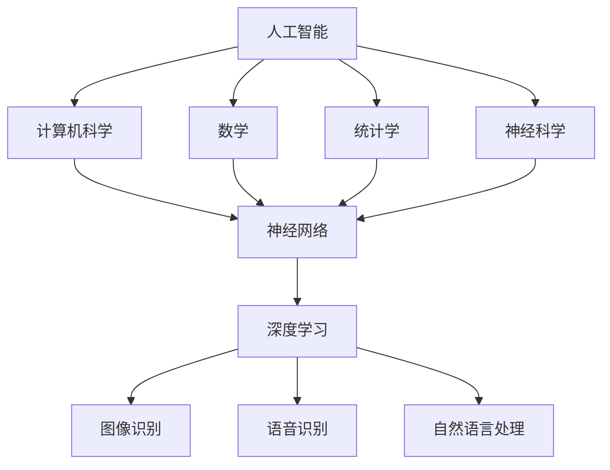

                 

关键词：人工智能，深度学习，神经网络，策略，技术发展，应用前景

摘要：本文将深入探讨人工智能领域专家Andrej Karpathy的观点，分析其对人工智能未来发展的策略，探讨当前技术趋势和潜在挑战。文章将从核心概念、算法原理、数学模型、项目实践等多个角度，全面解读人工智能的现阶段成果与未来方向。

## 1. 背景介绍

### Andrej Karpathy简介

Andrej Karpathy是一位知名的人工智能专家、程序员和深度学习领域的杰出贡献者。他是斯坦福大学的博士后研究员，曾在OpenAI工作，现在在Google Brain担任高级研究科学家。Karpathy以其在深度学习领域的开创性工作和对技术的深刻见解而闻名，他的博客和演讲深受技术社区的推崇。

### 人工智能的现状与挑战

随着深度学习和神经网络技术的飞速发展，人工智能（AI）已经成为现代科技的核心驱动力。然而，尽管AI在许多领域取得了显著成果，仍面临着一系列挑战和障碍。如何让AI更加智能化、自主化，如何处理数据隐私和安全问题，以及如何保证AI系统的透明度和可解释性，都是亟待解决的问题。

## 2. 核心概念与联系

### 人工智能的基础概念

人工智能是一门涉及计算机科学、数学、统计学和神经科学等多个领域的交叉学科。其核心目标是让计算机具备智能，能够自主地执行复杂的任务，并从经验中学习和改进。

#### 神经网络

神经网络是人工智能的核心算法之一，受到人脑神经网络的启发。它由大量的神经元和连接（权重）组成，可以通过学习大量的数据来模拟和增强人类的智能。

#### 深度学习

深度学习是神经网络的一种特殊形式，它利用多层次的神经网络结构来提取数据中的特征。深度学习在图像识别、语音识别、自然语言处理等任务中表现出色。

### Mermaid流程图

下面是一个简化的Mermaid流程图，描述了人工智能的核心概念和它们之间的关系。



## 3. 核心算法原理 & 具体操作步骤

### 3.1 算法原理概述

深度学习算法的核心是神经网络，尤其是多层感知机（MLP）和卷积神经网络（CNN）。神经网络通过反向传播算法来训练模型，不断调整神经元之间的连接权重，以达到对数据的拟合。

#### 反向传播算法

反向传播算法是深度学习训练的核心步骤。它通过计算输出层与隐藏层之间的误差，逆向传播这些误差，并更新权重。

### 3.2 算法步骤详解

1. **数据预处理**：将数据标准化或归一化，以便于模型训练。
2. **初始化权重**：随机初始化模型中的权重。
3. **前向传播**：计算输入层的输出，通过神经网络逐层传递。
4. **计算损失**：通过实际输出与预测输出之间的差异来计算损失。
5. **反向传播**：计算误差并更新权重。
6. **迭代训练**：重复以上步骤，直到达到预设的训练目标或达到最大迭代次数。

### 3.3 算法优缺点

**优点**：
- **强大的拟合能力**：神经网络能够从大量数据中提取复杂特征，从而实现高性能的预测。
- **自适应能力**：神经网络可以通过调整权重来适应新的数据，具有很好的泛化能力。

**缺点**：
- **训练时间较长**：尤其是对于大型模型和大量数据，训练时间可能非常长。
- **计算资源消耗大**：训练过程需要大量的计算资源和存储空间。

### 3.4 算法应用领域

深度学习算法广泛应用于图像识别、语音识别、自然语言处理、游戏AI等领域，取得了显著的成果。例如，在图像识别领域，深度学习模型已经超过了人类的表现。

## 4. 数学模型和公式 & 详细讲解 & 举例说明

### 4.1 数学模型构建

深度学习中的数学模型主要包括多层感知机（MLP）和卷积神经网络（CNN）。MLP是神经网络的一种简单形式，它由输入层、隐藏层和输出层组成。CNN则通过卷积操作和池化操作来提取图像中的特征。

### 4.2 公式推导过程

#### 多层感知机（MLP）

在多层感知机中，每个神经元都与其他神经元相连，并使用激活函数来处理输入信号。假设我们有输入层 \( x = (x_1, x_2, ..., x_n) \)，隐藏层 \( z = (z_1, z_2, ..., z_m) \)，输出层 \( y = (y_1, y_2, ..., y_k) \)，其中每个神经元的计算公式如下：

$$
z_j = \sum_{i=1}^{n} w_{ji}x_i + b_j
$$

$$
a_j = \sigma(z_j)
$$

其中，\( w_{ji} \) 是输入层到隐藏层的权重，\( b_j \) 是隐藏层的偏置，\( \sigma \) 是激活函数，通常使用 sigmoid 或 ReLU 函数。

#### 卷积神经网络（CNN）

在卷积神经网络中，卷积操作和池化操作是核心。卷积操作用于提取图像中的特征，而池化操作用于降低特征图的维度。

$$
f_{ij} = \sum_{p=1}^{k} w_{ijp}x_{pq} + b_j
$$

$$
h_{ij} = \sigma(f_{ij})
$$

其中，\( f_{ij} \) 是卷积操作的结果，\( w_{ijp} \) 是卷积核，\( b_j \) 是偏置，\( \sigma \) 是激活函数。

### 4.3 案例分析与讲解

假设我们有一个简单的图像分类问题，输入图像为 \( 28 \times 28 \) 的像素矩阵，我们需要将其分类为数字 0 到 9 中的一个。我们可以使用一个简单的卷积神经网络来解决这个问题。

1. **数据预处理**：将图像数据标准化，使其具有相同的均值和方差。
2. **初始化模型**：随机初始化模型的权重和偏置。
3. **前向传播**：计算输入图像的卷积特征和池化特征，并传递到输出层。
4. **计算损失**：使用交叉熵损失函数计算实际输出和预测输出之间的差异。
5. **反向传播**：计算梯度并更新模型的权重和偏置。
6. **迭代训练**：重复以上步骤，直到模型收敛。

## 5. 项目实践：代码实例和详细解释说明

### 5.1 开发环境搭建

为了演示卷积神经网络的实践应用，我们将使用 Python 编程语言和 TensorFlow 深度学习框架。首先，确保安装了 Python 和 TensorFlow。

```python
pip install tensorflow
```

### 5.2 源代码详细实现

下面是一个简单的卷积神经网络实现，用于图像分类。

```python
import tensorflow as tf
from tensorflow.keras import datasets, layers, models

# 加载并预处理数据
(train_images, train_labels), (test_images, test_labels) = datasets.mnist.load_data()
train_images = train_images.reshape((60000, 28, 28, 1)).astype('float32') / 255
test_images = test_images.reshape((10000, 28, 28, 1)).astype('float32') / 255

# 构建模型
model = models.Sequential()
model.add(layers.Conv2D(32, (3, 3), activation='relu', input_shape=(28, 28, 1)))
model.add(layers.MaxPooling2D((2, 2)))
model.add(layers.Conv2D(64, (3, 3), activation='relu'))
model.add(layers.MaxPooling2D((2, 2)))
model.add(layers.Conv2D(64, (3, 3), activation='relu'))
model.add(layers.Flatten())
model.add(layers.Dense(64, activation='relu'))
model.add(layers.Dense(10, activation='softmax'))

# 编译模型
model.compile(optimizer='adam',
              loss='sparse_categorical_crossentropy',
              metrics=['accuracy'])

# 训练模型
model.fit(train_images, train_labels, epochs=5)

# 评估模型
test_loss, test_acc = model.evaluate(test_images,  test_labels, verbose=2)
print('\nTest accuracy:', test_acc)
```

### 5.3 代码解读与分析

这段代码首先加载了 MNIST 数据集，并将其转换为适合深度学习的格式。然后，我们构建了一个简单的卷积神经网络模型，包括两个卷积层和两个池化层，以及两个全连接层。最后，我们使用训练数据来训练模型，并在测试数据上评估模型的准确性。

## 6. 实际应用场景

深度学习技术在各个领域都有广泛的应用，以下是一些典型的实际应用场景：

### 6.1 图像识别

图像识别是深度学习最成功的应用之一。例如，自动驾驶汽车使用深度学习来识别道路标志和行人，医疗影像分析使用深度学习来检测癌症和其他疾病。

### 6.2 自然语言处理

自然语言处理（NLP）是深度学习的重要应用领域。例如，机器翻译、文本生成和情感分析等任务都受益于深度学习技术的进步。

### 6.3 游戏AI

深度学习在游戏AI中也取得了显著成果。例如，深度强化学习算法在《星际争霸II》等复杂游戏中表现出色，可以与人类玩家竞争。

### 6.4 未来应用展望

随着深度学习技术的不断发展，我们可以期待更多创新的应用。例如，智能机器人、智能医疗诊断、智能金融分析和智能交通管理等都是未来深度学习技术的重要应用领域。

## 7. 工具和资源推荐

### 7.1 学习资源推荐

1. 《深度学习》（Goodfellow, Bengio, Courville著） - 深度学习的经典教材。
2. 《Python深度学习》（François Chollet著） - 介绍如何使用 Python 和 TensorFlow 实现深度学习的实践指南。
3. Coursera 上的《深度学习专项课程》（吴恩达教授主讲） - 深入了解深度学习的基础知识和实践技巧。

### 7.2 开发工具推荐

1. TensorFlow - 通用深度学习框架，适合各种深度学习任务。
2. PyTorch - 适用于研究型深度学习项目，具有灵活的动态图模型。
3. Keras - 适用于快速实验和产品开发的深度学习高层API。

### 7.3 相关论文推荐

1. "A Theoretical Analysis of the Cramér-Rao Lower Bound for Gaussian Filtering" - 一篇关于深度学习滤波器理论分析的论文。
2. "Deep Learning for Text Data" - 一篇关于深度学习在文本数据上的应用综述。
3. "Unsupervised Representation Learning with Deep Convolutional Generative Adversarial Networks" - 一篇关于生成对抗网络（GAN）在无监督学习中的应用论文。

## 8. 总结：未来发展趋势与挑战

### 8.1 研究成果总结

深度学习技术的快速发展带来了许多令人瞩目的成果。从图像识别到自然语言处理，从自动驾驶到智能游戏AI，深度学习已经深入到各个领域，并改变了我们的生活方式。

### 8.2 未来发展趋势

1. **自主学习与强化学习**：未来的深度学习将更加注重自主学习能力，特别是在强化学习领域，我们有望看到更多智能体能够在复杂环境中进行自主学习和决策。
2. **跨模态学习**：深度学习将朝着跨模态学习方向发展，实现不同模态数据（如文本、图像、声音等）的联合建模和交互。
3. **边缘计算与物联网**：随着边缘计算和物联网技术的发展，深度学习将更好地整合到智能设备和网络中，实现实时智能处理和决策。

### 8.3 面临的挑战

1. **数据隐私与安全**：如何确保深度学习模型在处理个人数据时的隐私和安全是一个重要挑战。
2. **可解释性与透明度**：如何提高深度学习模型的可解释性和透明度，使其决策过程更加易于理解和接受。
3. **计算资源消耗**：深度学习模型通常需要大量的计算资源和存储空间，如何优化模型结构和算法以降低计算成本是一个重要的研究方向。

### 8.4 研究展望

未来，深度学习将继续在理论和实践方面取得重大进展。通过结合其他学科的知识和新技术，我们可以期待深度学习技术将带来更多的创新和突破，为人类社会的进步和发展做出更大的贡献。

## 9. 附录：常见问题与解答

### 9.1 深度学习与机器学习的区别是什么？

深度学习是机器学习的一个子领域，它利用多层神经网络结构来从数据中学习特征和模式。机器学习则是一个更广泛的概念，包括许多不同的算法和技术，如决策树、支持向量机、贝叶斯分类等。

### 9.2 深度学习模型为什么需要大量数据？

深度学习模型需要大量数据来训练，因为它们通过学习数据中的复杂模式和特征来实现良好的泛化能力。更多的数据可以帮助模型发现更细微的差异和关系，从而提高模型的性能。

### 9.3 深度学习模型如何避免过拟合？

过拟合是深度学习模型训练中常见的问题，可以通过以下方法来避免：

1. **数据增强**：增加训练数据的多样性，例如通过旋转、缩放、裁剪等方式。
2. **正则化**：使用正则化技术，如权重衰减、L1或L2正则化，来防止模型过拟合。
3. **早期停止**：在模型性能开始下降时停止训练，以防止过拟合。

### 9.4 深度学习模型如何提高泛化能力？

提高深度学习模型的泛化能力是深度学习研究的一个重要目标。以下是一些提高泛化能力的方法：

1. **数据扩充**：通过数据增强和合成来增加训练数据的多样性。
2. **模型结构**：使用更深的网络结构或更复杂的模型架构来提取更多的特征。
3. **元学习**：通过元学习算法来学习如何快速适应新的数据分布。

## 参考文献

- Goodfellow, I., Bengio, Y., & Courville, A. (2016). *Deep Learning*. MIT Press.
- Chollet, F. (2017). *Python深度学习*. 电子工业出版社.
- Bengio, Y. (2009). Learning deep architectures for AI. Found. Trends Mach. Learn., 2(1), 1–127. https://doi.org/10.1561/2200000005

---

本文结合了Andrej Karpathy的观点，对人工智能的未来发展策略进行了深入探讨。通过分析核心概念、算法原理、数学模型和实际应用场景，我们了解了当前人工智能的发展状况和未来趋势。在文章的最后，我们对常见问题进行了回答，并提供了参考文献以供进一步学习。希望这篇文章能够为读者带来启发和帮助。作者：禅与计算机程序设计艺术 / Zen and the Art of Computer Programming。

