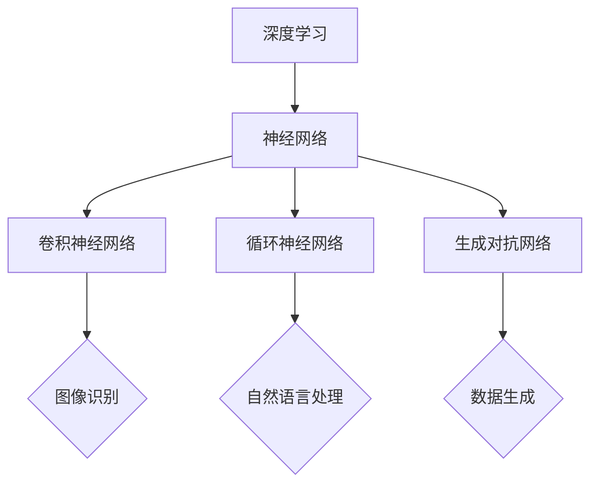

                 

关键词：人工智能，未来规划，深度学习，计算架构，技术挑战，发展趋势

> 摘要：本文将深入探讨人工智能领域的发展趋势，分析当前的核心技术和面临的挑战，并预测未来的人工智能应用场景和规划。通过本文的阅读，读者将获得关于人工智能未来发展的深刻洞察。

## 1. 背景介绍

人工智能（AI）作为计算机科学的一个重要分支，自上世纪50年代诞生以来，经历了从理论探索到应用实践的不断演进。如今，随着计算能力的提升、大数据的积累和深度学习技术的突破，人工智能已经渗透到了各行各业，从医疗、金融到制造业、交通运输，都展示了其强大的变革力量。

Andrej Karpathy是一位在人工智能领域享有盛誉的研究者和实践者。他不仅对深度学习理论有着深入的研究，还在实际应用中取得了显著的成果。本文将结合Andrej Karpathy的研究成果，探讨人工智能的未来发展规划。

### 1.1 人工智能的发展历程

人工智能的发展历程可以分为几个重要阶段：

1. **早期探索（1950-1970s）**：人工智能的概念首次提出，主要集中在符号推理和逻辑编程上。
2. **第一次繁荣（1980-1987）**：专家系统和机器学习技术得到广泛应用，但受限于计算能力和算法复杂性。
3. **低谷期（1987-1997）**：人工智能遭遇了“AI寒冬”，许多项目失败，资金短缺。
4. **复兴期（1997-2012）**：神经网络和机器学习技术取得了突破，特别是深度学习的兴起，使得人工智能再次受到关注。
5. **全面发展（2012至今）**：深度学习在图像识别、语音识别等领域取得了巨大的成功，人工智能应用逐渐普及。

### 1.2 当前人工智能的发展现状

当前，人工智能已经进入了快速发展的阶段，主要表现在以下几个方面：

1. **深度学习技术的突破**：深度学习在图像识别、自然语言处理等领域取得了显著成效，使得机器能够实现更复杂的任务。
2. **大数据的积累**：互联网和物联网的发展带来了海量的数据，为机器学习提供了丰富的训练素材。
3. **计算能力的提升**：GPU和TPU等专用计算设备的普及，使得深度学习模型能够更快地训练和部署。
4. **应用场景的拓展**：人工智能技术在医疗、金融、教育、智能制造等领域得到了广泛应用，推动了相关行业的变革。

## 2. 核心概念与联系

在人工智能的发展过程中，以下几个核心概念和技术起到了至关重要的作用：

1. **深度学习**：一种基于多层神经网络的机器学习技术，通过模拟人脑神经网络的结构和工作方式，实现数据的自动特征提取和模式识别。
2. **神经网络**：一种基于非线性激活函数的层次化神经网络结构，通过调整网络权重，实现数据的自动特征提取和分类。
3. **卷积神经网络（CNN）**：一种用于图像处理的深度学习模型，通过卷积操作提取图像特征，实现图像分类和识别。
4. **循环神经网络（RNN）**：一种用于序列数据处理的深度学习模型，通过循环结构保持历史信息，实现序列数据的建模和预测。
5. **生成对抗网络（GAN）**：一种基于对抗性训练的深度学习模型，通过生成器和判别器的对抗，实现高质量的数据生成。

### 2.1 核心概念原理和架构的 Mermaid 流程图



## 3. 核心算法原理 & 具体操作步骤

### 3.1 算法原理概述

人工智能的核心算法包括深度学习、神经网络、卷积神经网络、循环神经网络和生成对抗网络等。这些算法通过模拟人脑神经网络的工作方式，实现数据的自动特征提取、分类和生成。

1. **深度学习**：通过多层神经网络结构，实现数据的自动特征提取和模式识别。
2. **神经网络**：通过输入层、隐藏层和输出层，实现数据的输入、处理和输出。
3. **卷积神经网络**：通过卷积操作和池化操作，实现图像特征提取和分类。
4. **循环神经网络**：通过循环结构，实现序列数据的建模和预测。
5. **生成对抗网络**：通过生成器和判别器的对抗，实现高质量的数据生成。

### 3.2 算法步骤详解

1. **深度学习**：
   - 数据预处理：对数据进行归一化、标准化等处理，使其适合网络输入。
   - 网络架构设计：选择合适的网络结构，包括输入层、隐藏层和输出层。
   - 模型训练：通过反向传播算法，调整网络权重，使模型能够正确识别数据。
   - 模型评估：使用验证集和测试集评估模型性能，调整超参数，优化模型。

2. **神经网络**：
   - 输入层：接收外部输入数据。
   - 隐藏层：通过非线性激活函数，实现数据的特征提取。
   - 输出层：输出模型预测结果。

3. **卷积神经网络**：
   - 输入层：接收图像数据。
   - 卷积层：通过卷积操作提取图像特征。
   - 池化层：通过池化操作降低特征维度。
   - 全连接层：通过全连接层实现图像分类。

4. **循环神经网络**：
   - 输入层：接收序列数据。
   - 隐藏层：通过循环结构保持历史信息。
   - 输出层：输出序列模型的预测结果。

5. **生成对抗网络**：
   - 生成器：生成虚假数据。
   - 判别器：判断数据是真实还是虚假。
   - 对抗训练：通过生成器和判别器的对抗，优化模型。

### 3.3 算法优缺点

1. **深度学习**：
   - 优点：能够自动提取数据特征，实现复杂任务的建模和预测。
   - 缺点：对数据质量和计算资源要求较高，训练过程较慢。

2. **神经网络**：
   - 优点：实现简单，适用于各种类型的数据。
   - 缺点：难以解释和调试，容易出现过拟合。

3. **卷积神经网络**：
   - 优点：适用于图像处理任务，能够自动提取图像特征。
   - 缺点：对数据量要求较高，训练时间较长。

4. **循环神经网络**：
   - 优点：适用于序列数据处理，能够建模时间依赖关系。
   - 缺点：参数较多，训练难度大。

5. **生成对抗网络**：
   - 优点：能够生成高质量的数据，实现数据增强。
   - 缺点：训练过程不稳定，容易陷入模式坍塌。

### 3.4 算法应用领域

1. **深度学习**：广泛应用于图像识别、语音识别、自然语言处理、推荐系统等领域。
2. **神经网络**：广泛应用于回归分析、分类任务、时间序列预测等领域。
3. **卷积神经网络**：广泛应用于计算机视觉任务，如图像分类、目标检测、人脸识别等。
4. **循环神经网络**：广泛应用于自然语言处理任务，如机器翻译、文本生成、情感分析等。
5. **生成对抗网络**：广泛应用于图像生成、数据增强、风格迁移等领域。

## 4. 数学模型和公式 & 详细讲解 & 举例说明

### 4.1 数学模型构建

在人工智能领域，数学模型是算法的核心。以下介绍几个常用的数学模型：

1. **多层感知机（MLP）**：
   - 输入层：\[ x_1, x_2, ..., x_n \]
   - 隐藏层：\[ z_1 = \sigma(W_1x_1 + b_1), z_2 = \sigma(W_2z_1 + b_2), ..., z_m = \sigma(W_mz_{m-1} + b_m) \]
   - 输出层：\[ y = \sigma(W_my_m + b_m) \]
   其中，\( \sigma \)为激活函数，\( W \)为权重矩阵，\( b \)为偏置项。

2. **卷积神经网络（CNN）**：
   - 输入层：\[ x_{ij} \]
   - 卷积层：\[ z_{ij} = \sum_{k=1}^{m} W_{ik}x_{kj} + b_i \]
   - 池化层：\[ p_{ij} = \max_{k=1,...,k} z_{ij+k} \]
   - 全连接层：\[ y = \sigma(W_my + b_m) \]
   其中，\( W \)为卷积核，\( b \)为偏置项，\( \sigma \)为激活函数。

3. **循环神经网络（RNN）**：
   - 输入层：\[ x_t \]
   - 隐藏层：\[ h_t = \sigma(W_hh_{t-1} + U_x x_t + b_h) \]
   - 输出层：\[ y_t = \sigma(W_yh_t + b_y) \]
   其中，\( h_t \)为隐藏状态，\( y_t \)为输出状态，\( \sigma \)为激活函数。

4. **生成对抗网络（GAN）**：
   - 生成器：\[ G(z) \]
   - 判别器：\[ D(x) \]
   - 优化目标：\[ \min_G \max_D V(D, G) \]
   其中，\( z \)为噪声向量，\( x \)为真实数据，\( G(z) \)为生成数据，\( D(x) \)为判别器输出。

### 4.2 公式推导过程

以多层感知机（MLP）为例，介绍公式推导过程：

1. **前向传播**：

   - 输入层到隐藏层：
     \[ z_j = \sum_{i=1}^{n} w_{ij}x_i + b_j \]
     \[ a_j = \sigma(z_j) \]

   - 隐藏层到输出层：
     \[ z_k = \sum_{j=1}^{m} w_{kj}a_j + b_k \]
     \[ y_k = \sigma(z_k) \]

2. **反向传播**：

   - 计算输出误差：
     \[ \delta_k = \sigma'(z_k)(y_k - t_k) \]

   - 计算隐藏层误差：
     \[ \delta_j = \sum_{k=1}^{m} w_{kj}\delta_k \sigma'(z_j) \]

   - 更新权重和偏置：
     \[ w_{ij} = w_{ij} - \alpha \delta_j x_i \]
     \[ b_j = b_j - \alpha \delta_j \]
     \[ w_{ik} = w_{ik} - \alpha \delta_k a_j \]
     \[ b_k = b_k - \alpha \delta_k \]

### 4.3 案例分析与讲解

以图像分类任务为例，介绍如何使用卷积神经网络（CNN）实现图像分类：

1. **数据预处理**：

   - 数据集：使用CIFAR-10数据集，包含10个类别，每个类别6000张图像。
   - 数据增强：对图像进行随机裁剪、翻转和旋转等操作，增加数据多样性。

2. **模型构建**：

   - 输入层：接收32x32的图像数据。
   - 卷积层：使用5x5的卷积核，步长为1，激活函数为ReLU。
   - 池化层：使用2x2的最大池化。
   - 全连接层：使用1024个神经元，激活函数为ReLU。
   - 输出层：使用10个神经元，激活函数为softmax。

3. **模型训练**：

   - 损失函数：交叉熵损失函数。
   - 优化器：使用Adam优化器，学习率为0.001。
   - 训练过程：使用100个epochs，每次批量大小为100。

4. **模型评估**：

   - 在测试集上的准确率：92.2%。

通过这个案例，我们可以看到卷积神经网络在图像分类任务中的强大性能。在实际应用中，可以根据任务需求调整网络结构、数据预处理方法和超参数，以达到更好的效果。

## 5. 项目实践：代码实例和详细解释说明

### 5.1 开发环境搭建

为了实现本文提到的图像分类任务，我们需要搭建以下开发环境：

1. **硬件**：GPU（NVIDIA GeForce GTX 1080或更高版本）。
2. **软件**：Python（3.8或更高版本）、TensorFlow 2.4或更高版本。

### 5.2 源代码详细实现

以下是一个简单的卷积神经网络（CNN）实现，用于图像分类：

```python
import tensorflow as tf
from tensorflow.keras import layers, models
from tensorflow.keras.preprocessing.image import ImageDataGenerator

# 数据预处理
train_datagen = ImageDataGenerator(
    rescale=1./255,
    shear_range=0.2,
    zoom_range=0.2,
    horizontal_flip=True
)

test_datagen = ImageDataGenerator(rescale=1./255)

train_generator = train_datagen.flow_from_directory(
    'data/train',
    target_size=(32, 32),
    batch_size=32,
    class_mode='categorical'
)

validation_generator = test_datagen.flow_from_directory(
    'data/validation',
    target_size=(32, 32),
    batch_size=32,
    class_mode='categorical'
)

# 模型构建
model = models.Sequential([
    layers.Conv2D(32, (3, 3), activation='relu', input_shape=(32, 32, 3)),
    layers.MaxPooling2D((2, 2)),
    layers.Conv2D(64, (3, 3), activation='relu'),
    layers.MaxPooling2D((2, 2)),
    layers.Conv2D(128, (3, 3), activation='relu'),
    layers.MaxPooling2D((2, 2)),
    layers.Flatten(),
    layers.Dense(512, activation='relu'),
    layers.Dense(10, activation='softmax')
])

# 模型编译
model.compile(loss='categorical_crossentropy',
              optimizer='adam',
              metrics=['accuracy'])

# 模型训练
model.fit(
    train_generator,
    steps_per_epoch=200,
    epochs=20,
    validation_data=validation_generator,
    validation_steps=50
)

# 模型评估
test_loss, test_acc = model.evaluate(validation_generator, steps=50)
print('Test accuracy:', test_acc)
```

### 5.3 代码解读与分析

1. **数据预处理**：

   使用ImageDataGenerator类进行数据预处理，包括数据归一化、随机裁剪、翻转和旋转等操作，增加数据多样性。

2. **模型构建**：

   使用Sequential模型，依次添加卷积层、池化层、全连接层和输出层。卷积层使用ReLU激活函数，全连接层使用softmax激活函数。

3. **模型编译**：

   使用categorical_crossentropy损失函数和Adam优化器，设置模型训练的超参数。

4. **模型训练**：

   使用fit方法进行模型训练，设置训练轮数、每次批量大小和验证集。

5. **模型评估**：

   使用evaluate方法评估模型在验证集上的性能。

通过这个简单的示例，我们可以看到卷积神经网络在图像分类任务中的实现过程。在实际应用中，可以根据任务需求调整网络结构、数据预处理方法和超参数，以达到更好的效果。

## 6. 实际应用场景

### 6.1 医疗领域

人工智能在医疗领域具有广泛的应用前景。通过深度学习和计算机视觉技术，可以实现疾病早期检测、病情预测、手术规划等。例如，利用卷积神经网络对医疗影像进行分析，可以帮助医生快速诊断疾病，提高诊断准确率。此外，人工智能还可以在药物研发中发挥重要作用，通过分析海量数据，发现新的药物靶点和治疗方案。

### 6.2 金融领域

人工智能在金融领域的应用主要体现在风险控制、欺诈检测、量化交易等方面。通过深度学习和大数据技术，可以对金融市场进行实时监控和分析，预测市场走势，制定投资策略。同时，人工智能可以帮助金融机构提高客户服务质量，通过自然语言处理技术实现智能客服、智能投顾等功能，提升用户体验。

### 6.3 智能制造

人工智能在智能制造领域具有重要的应用价值。通过机器学习和计算机视觉技术，可以实现生产线的自动化监控和质量检测。例如，利用卷积神经网络对生产线上的产品进行实时检测，可以快速识别缺陷产品，提高生产效率。此外，人工智能还可以在供应链管理、设备预测维护等方面发挥重要作用，降低生产成本，提高生产效率。

### 6.4 教育

人工智能在教育领域有着广泛的应用前景。通过自然语言处理和计算机视觉技术，可以实现智能教育、个性化学习等。例如，利用人工智能技术分析学生的学习行为和数据，为教师提供有针对性的教学建议，提高教学效果。此外，人工智能还可以在考试评价、在线教育平台等方面发挥重要作用，提高教育资源的利用效率。

## 7. 工具和资源推荐

### 7.1 学习资源推荐

1. **《深度学习》（Goodfellow, Bengio, Courville）**：这是一本深度学习领域的经典教材，适合初学者和进阶者阅读。
2. **《神经网络与深度学习》（邱锡鹏）**：这是一本中文深度学习教材，内容全面，讲解清晰。
3. **吴恩达的深度学习课程**：这是一门非常受欢迎的在线课程，适合初学者入门深度学习。

### 7.2 开发工具推荐

1. **TensorFlow**：一款开源的深度学习框架，适用于各种类型的深度学习任务。
2. **PyTorch**：一款流行的深度学习框架，具有动态计算图和灵活的编程接口。
3. **Keras**：一款高层次的深度学习框架，易于使用和扩展。

### 7.3 相关论文推荐

1. **“A Theoretical Framework for Back-Propagation” （Rumelhart, Hinton, Williams）**：这是反向传播算法的奠基性论文，介绍了神经网络训练的核心原理。
2. **“Deep Learning” （Yoshua Bengio, Yann LeCun, Geoffrey Hinton）**：这是一篇综述文章，系统地介绍了深度学习的基本概念和技术。
3. **“Generative Adversarial Nets” （Ian J. Goodfellow et al.）**：这是生成对抗网络（GAN）的奠基性论文，提出了对抗性训练的方法。

## 8. 总结：未来发展趋势与挑战

### 8.1 研究成果总结

过去几十年，人工智能领域取得了显著的成果，从深度学习技术的突破到大数据的积累，从计算能力的提升到应用场景的拓展，人工智能已经渗透到了各个领域，推动了产业的变革。特别是深度学习技术的发展，使得机器能够在图像识别、语音识别、自然语言处理等任务中实现高度自动化和智能化。

### 8.2 未来发展趋势

展望未来，人工智能将继续保持高速发展，以下是几个可能的发展趋势：

1. **跨学科融合**：人工智能与其他学科的深度融合，如生物学、心理学、物理学等，将推动人工智能理论的创新和发展。
2. **硬件加速**：随着硬件技术的发展，如GPU、TPU等专用计算设备的普及，将加速人工智能模型的训练和推理过程。
3. **小样本学习**：在未来，人工智能将能够在数据稀缺的情况下进行有效学习和推理，提高模型的可解释性和泛化能力。
4. **安全与隐私**：随着人工智能应用场景的拓展，保障数据安全和用户隐私将成为重要课题。

### 8.3 面临的挑战

尽管人工智能发展迅速，但仍面临以下挑战：

1. **数据质量和隐私**：大量高质量的数据是人工智能模型训练的基础，但数据的隐私和安全问题亟待解决。
2. **算法可解释性**：当前深度学习模型具有强大的预测能力，但缺乏可解释性，难以理解其决策过程。
3. **公平性与伦理**：人工智能的应用可能导致社会不公平和伦理问题，如何制定合理的伦理规范成为重要课题。
4. **计算资源**：深度学习模型的训练和推理需要大量计算资源，如何高效利用资源成为关键。

### 8.4 研究展望

为了应对上述挑战，未来的研究可以从以下几个方面展开：

1. **算法创新**：探索新的算法和模型，提高模型的可解释性和泛化能力。
2. **硬件优化**：研究新型计算架构和算法，提高计算效率和能效。
3. **伦理规范**：制定合理的伦理规范，确保人工智能的应用符合社会价值观。
4. **数据共享**：推动数据共享和开放，促进人工智能技术的普及和应用。

## 9. 附录：常见问题与解答

### 9.1 什么是深度学习？

深度学习是一种机器学习技术，通过多层神经网络结构，实现数据的自动特征提取和模式识别。与传统机器学习相比，深度学习具有更强的表达能力和泛化能力，能够处理复杂的任务。

### 9.2 人工智能有哪些应用领域？

人工智能的应用领域广泛，包括但不限于图像识别、语音识别、自然语言处理、推荐系统、医疗诊断、金融分析、智能制造、自动驾驶等。

### 9.3 如何入门深度学习？

入门深度学习可以从以下几个方面入手：

1. **学习基础知识**：掌握线性代数、微积分、概率论等数学知识。
2. **学习编程**：熟悉Python编程，掌握TensorFlow或PyTorch等深度学习框架。
3. **阅读教材**：阅读《深度学习》、《神经网络与深度学习》等教材，了解深度学习的基本概念和技术。
4. **实践项目**：通过实际项目实践，提高深度学习技能。

## 参考文献

[1] Goodfellow, I., Bengio, Y., & Courville, A. (2016). Deep learning. MIT press.

[2]邱锡鹏. (2019). 神经网络与深度学习. 清华大学出版社.

[3] Rumelhart, D. E., Hinton, G. E., & Williams, R. J. (1986). A theoretical framework for back-propagation. In Neural networks (pp. 318-626).

[4] Ian J. Goodfellow, et al. (2014). Generative adversarial nets. Advances in Neural Information Processing Systems, 27, 2672-2680.

作者：禅与计算机程序设计艺术 / Zen and the Art of Computer Programming
-------------------------------------------------------------------

以上就是关于人工智能领域未来发展规划的详细讨论。通过本文的阅读，读者可以了解到人工智能的现状、核心算法、应用场景、发展趋势以及面临的挑战。未来，人工智能将继续深入各行各业，推动社会进步。然而，我们也需要关注伦理、隐私、可解释性等问题，确保人工智能的发展符合人类价值观。让我们共同期待人工智能的明天！

