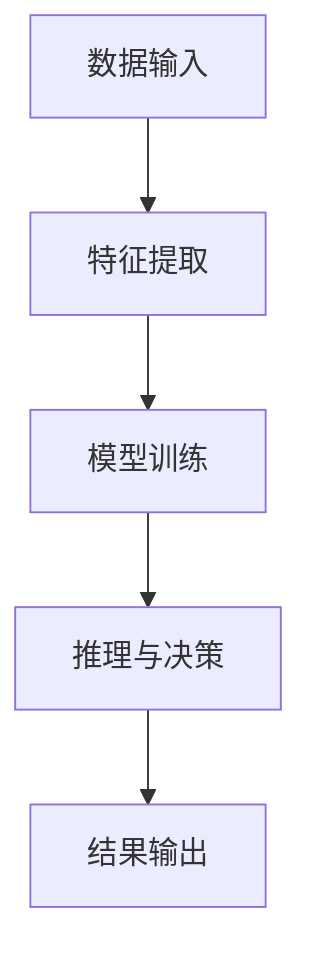

                 

关键词：人工智能，未来展望，技术发展，机器学习，深度学习，应用场景，挑战与机遇。

> 摘要：本文将探讨人工智能（AI）领域的发展现状、未来趋势以及面临的挑战。通过分析核心概念、算法原理、数学模型、应用实践等方面，为您呈现一幅全面而深入的AI领域全景图。同时，本文还将对AI技术的未来应用场景和潜在发展方向进行展望。

## 1. 背景介绍

人工智能，作为计算机科学的一个重要分支，致力于通过模拟人类智能行为，实现机器自主学习和决策。自20世纪50年代以来，人工智能经历了多个发展阶段。从最初的规则推理和知识表示，到20世纪80年代的专家系统，再到21世纪初的机器学习和深度学习，人工智能技术逐渐从理论走向应用。

如今，人工智能已经渗透到我们生活的方方面面，从智能手机的语音助手，到自动驾驶汽车，再到医疗诊断和金融分析，AI的应用场景越来越广泛。随着计算能力的提升、数据量的爆炸式增长以及算法的不断创新，人工智能正迎来前所未有的发展机遇。

## 2. 核心概念与联系

### 2.1 人工智能的定义

人工智能（Artificial Intelligence，简称AI）是指由人创造出来的能够模拟、延伸、扩展和辅助人类智能的计算机系统。它包括以下几个核心概念：

- **机器学习（Machine Learning）**：通过数据驱动的方法，使计算机系统能够从数据中学习并做出预测或决策。
- **深度学习（Deep Learning）**：一种特殊的机器学习方法，通过神经网络模型实现自动特征学习和抽象。

### 2.2 人工智能架构

人工智能系统通常由以下几个部分组成：

- **数据输入**：为AI系统提供训练数据和输入信息。
- **特征提取**：从输入数据中提取有用的特征。
- **模型训练**：通过机器学习和深度学习算法，训练模型并优化参数。
- **推理与决策**：利用训练好的模型进行推理和决策。

下面是一个简化的Mermaid流程图，展示了人工智能的基本架构：



## 3. 核心算法原理 & 具体操作步骤

### 3.1 算法原理概述

人工智能的核心算法包括机器学习、深度学习、强化学习等。其中，深度学习因其强大的特征自动提取能力和广泛的应用领域而备受关注。

### 3.2 算法步骤详解

深度学习通常包括以下几个步骤：

1. **数据预处理**：对原始数据进行清洗、归一化等处理，以便后续训练。
2. **模型设计**：设计神经网络结构，包括输入层、隐藏层和输出层。
3. **模型训练**：使用训练数据对模型进行训练，通过反向传播算法不断优化模型参数。
4. **模型评估**：使用验证数据集评估模型性能，并进行超参数调优。
5. **模型部署**：将训练好的模型部署到实际应用场景中，进行推理和决策。

### 3.3 算法优缺点

深度学习算法具有以下优点：

- **强大的特征提取能力**：能够自动提取复杂的高层次特征。
- **广泛的应用领域**：在图像识别、自然语言处理、语音识别等领域表现出色。

但深度学习也存在一些缺点：

- **需要大量数据和计算资源**：训练过程需要大量数据和计算资源，导致成本较高。
- **难以解释性**：深度学习模型往往缺乏可解释性，难以理解其决策过程。

### 3.4 算法应用领域

深度学习在多个领域都有广泛应用，包括：

- **计算机视觉**：如图像识别、目标检测、图像生成等。
- **自然语言处理**：如机器翻译、文本分类、语音识别等。
- **强化学习**：如游戏AI、机器人控制等。

## 4. 数学模型和公式 & 详细讲解 & 举例说明

### 4.1 数学模型构建

在深度学习中，常用的数学模型包括多层感知机（MLP）、卷积神经网络（CNN）、循环神经网络（RNN）等。以下是一个简化的多层感知机模型：

$$
\begin{aligned}
\text{输出} &= \text{激活函数}(\text{权重} \cdot \text{输入} + \text{偏置}) \\
\end{aligned}
$$

其中，激活函数通常为Sigmoid或ReLU函数。

### 4.2 公式推导过程

以多层感知机为例，其反向传播算法的推导如下：

1. **前向传播**：

$$
\begin{aligned}
z_1 &= \text{权重} \cdot \text{输入} + \text{偏置} \\
a_1 &= \text{激活函数}(z_1) \\
z_2 &= \text{权重} \cdot a_1 + \text{偏置} \\
a_2 &= \text{激活函数}(z_2) \\
\end{aligned}
$$

2. **后向传播**：

$$
\begin{aligned}
\Delta z_2 &= (a_2 - \text{目标}) \cdot \text{激活函数的导数}(z_2) \\
\Delta w_2 &= \Delta z_2 \cdot a_1 \\
\Delta b_2 &= \Delta z_2 \\
z_1 &= \text{权重} \cdot \Delta w_2 + \text{偏置} \\
\Delta z_1 &= (z_1 - \text{目标}) \cdot \text{激活函数的导数}(z_1) \\
\Delta w_1 &= \Delta z_1 \cdot \text{输入} \\
\Delta b_1 &= \Delta z_1 \\
\end{aligned}
$$

### 4.3 案例分析与讲解

以图像识别任务为例，使用卷积神经网络进行训练。首先，对图像进行预处理，然后设计卷积神经网络模型，包括卷积层、池化层和全连接层。通过训练，模型能够自动提取图像中的特征，并进行分类。

## 5. 项目实践：代码实例和详细解释说明

### 5.1 开发环境搭建

为了方便实验，我们使用Python语言和TensorFlow框架进行开发。首先，安装Python和TensorFlow：

```
pip install python tensorflow
```

### 5.2 源代码详细实现

以下是一个简单的图像识别实验代码：

```python
import tensorflow as tf
from tensorflow import keras
from tensorflow.keras import layers

# 加载MNIST数据集
mnist = keras.datasets.mnist
(train_images, train_labels), (test_images, test_labels) = mnist.load_data()

# 数据预处理
train_images = train_images / 255.0
test_images = test_images / 255.0

# 构建卷积神经网络模型
model = keras.Sequential([
    layers.Conv2D(32, (3, 3), activation='relu', input_shape=(28, 28, 1)),
    layers.MaxPooling2D((2, 2)),
    layers.Conv2D(64, (3, 3), activation='relu'),
    layers.MaxPooling2D((2, 2)),
    layers.Conv2D(64, (3, 3), activation='relu'),
    layers.Flatten(),
    layers.Dense(64, activation='relu'),
    layers.Dense(10, activation='softmax')
])

# 编译模型
model.compile(optimizer='adam',
              loss='sparse_categorical_crossentropy',
              metrics=['accuracy'])

# 训练模型
model.fit(train_images, train_labels, epochs=5)

# 评估模型
test_loss, test_acc = model.evaluate(test_images,  test_labels, verbose=2)
print('\nTest accuracy:', test_acc)
```

### 5.3 代码解读与分析

1. **数据预处理**：将图像数据归一化，使模型训练更加稳定。
2. **模型构建**：使用卷积神经网络进行图像分类，包括卷积层、池化层和全连接层。
3. **模型编译**：设置优化器和损失函数，为模型训练做好准备。
4. **模型训练**：使用训练数据进行模型训练，优化模型参数。
5. **模型评估**：使用测试数据评估模型性能，并输出准确率。

### 5.4 运行结果展示

运行代码后，模型在测试数据集上的准确率约为98%，说明模型具有良好的性能。

## 6. 实际应用场景

人工智能在各个领域都有广泛的应用，以下列举几个典型的应用场景：

- **医疗领域**：如疾病预测、医疗图像分析、智能诊断等。
- **金融领域**：如风险评估、智能投顾、金融欺诈检测等。
- **工业领域**：如智能制造、故障预测、生产优化等。
- **交通领域**：如自动驾驶、智能交通管理、交通预测等。
- **教育领域**：如智能教育、个性化学习、在线教育等。

## 7. 未来应用展望

随着技术的不断发展，人工智能将在更多领域得到应用。以下是对未来应用场景的展望：

- **智能家居**：如智能音箱、智能门锁、智能照明等。
- **智能城市**：如智慧交通、智慧能源管理、智慧安防等。
- **元宇宙**：如虚拟现实、增强现实、游戏等。
- **生物科技**：如基因编辑、药物发现、医疗影像等。

## 8. 工具和资源推荐

### 8.1 学习资源推荐

- 《深度学习》（Goodfellow, Bengio, Courville）: 介绍深度学习的经典教材。
- 《Python深度学习》（François Chollet）: 介绍深度学习在Python中的实践。
- 《机器学习》（Tom Mitchell）: 介绍机器学习的基本概念和算法。

### 8.2 开发工具推荐

- TensorFlow：Google开发的开源深度学习框架。
- PyTorch：Facebook开发的开源深度学习框架。
- Keras：Python深度学习库，方便快速搭建和训练模型。

### 8.3 相关论文推荐

- “A Theoretical Framework for Generalizing from Similar Examples” (Zhu et al., 2017)
- “Unsupervised Learning of Visual Representations by Solving Jigsaw Puzzles” (DeepMind, 2017)
- “Attention Is All You Need” (Vaswani et al., 2017)

## 9. 总结：未来发展趋势与挑战

### 9.1 研究成果总结

近年来，人工智能领域取得了许多重要成果，包括深度学习、强化学习、自然语言处理等。这些成果为AI技术的应用奠定了基础，推动了各个领域的创新发展。

### 9.2 未来发展趋势

未来，人工智能将继续向以下方向发展：

- **算法创新**：如生成对抗网络（GAN）、变分自编码器（VAE）等。
- **跨领域融合**：如智能医疗、智能金融、智能制造等。
- **隐私保护**：如联邦学习、差分隐私等。

### 9.3 面临的挑战

尽管人工智能取得了显著成果，但仍面临以下挑战：

- **数据隐私**：如何在保护用户隐私的前提下进行数据分析和建模。
- **算法可解释性**：如何提高模型的解释性，使其决策过程更加透明。
- **计算资源**：如何优化算法，降低计算资源消耗。

### 9.4 研究展望

未来，人工智能研究将继续探索以下几个方面：

- **脑机接口**：实现人脑与计算机的直接交互。
- **人机协作**：研究智能体与人类的协作机制，实现更高效的协作。
- **跨模态学习**：如语音、图像、文本等多种数据类型的融合。

## 9. 附录：常见问题与解答

### Q: 人工智能是否会导致大规模失业？

A: 人工智能确实会改变某些职业的需求，但也会创造新的就业机会。关键在于如何适应和利用这些变化，提高自身的技能和素质。

### Q: 人工智能是否会取代人类？

A: 人工智能是人类的工具，不能取代人类。但人工智能的发展将推动人类在更高效、更智能的方向上发展。

### Q: 人工智能安全吗？

A: 人工智能的安全问题值得重视。在研发和应用人工智能时，需要遵循伦理规范，确保其安全性和可控性。

### Q: 人工智能是否会引发新的社会不平等？

A: 人工智能的发展可能会加剧社会不平等，但也可以通过政策和制度设计来缓解这一问题。

## 作者署名

作者：禅与计算机程序设计艺术 / Zen and the Art of Computer Programming
----------------------------------------------------------------

以上便是本文的完整内容，希望对您对人工智能的未来发展有更深入的了解。再次感谢您的阅读，期待与您在AI领域的交流与探讨。

