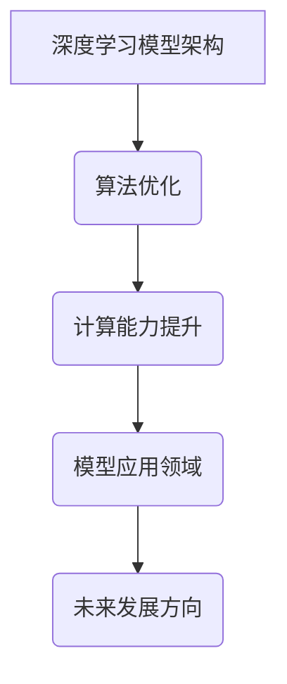

                 

关键词：人工智能，深度学习，神经网络，模型架构，计算能力，算法优化，应用场景，未来展望

> 摘要：本文将对人工智能领域内杰出人物Andrej Karpathy的研究成果进行深入探讨。通过对Karpathy在深度学习模型架构、算法优化以及计算能力提升方面的突破性工作进行分析，本文旨在揭示人工智能未来的发展方向及其面临的挑战。

## 1. 背景介绍

Andrej Karpathy是一位在人工智能领域享有盛誉的研究者，他在深度学习、神经网络和模型架构设计方面取得了显著的成就。Karpathy毕业于多伦多大学，获得了计算机科学学士学位，并在斯坦福大学获得了机器学习和自然语言处理方向的博士学位。他在OpenAI担任研究员，并在该组织中发挥了重要作用，推动了人工智能技术的发展。

### 1.1 深度学习模型架构的变革

Karpathy在深度学习模型架构设计方面的贡献尤为突出。他提出了许多创新的模型架构，如RNN（递归神经网络）、LSTM（长短期记忆网络）和GRU（门控循环单元），这些模型在处理序列数据和自然语言任务方面取得了重大突破。RNN和其变体LSTM和GRU在解决长距离依赖问题和序列建模方面表现出色，为自然语言处理、语音识别和机器翻译等领域的应用奠定了基础。

### 1.2 算法优化与计算能力提升

除了在模型架构方面的工作，Karpathy还在算法优化和计算能力提升方面做出了重要贡献。他研究了并行计算、分布式计算和数据流计算等计算优化技术，通过改进算法效率和资源利用，显著提高了深度学习模型的训练和推理速度。这些优化技术不仅加速了模型训练过程，还降低了计算成本，使得深度学习技术能够在更广泛的领域得到应用。

## 2. 核心概念与联系

### 2.1 深度学习模型架构

深度学习模型架构是指神经网络的结构设计，包括输入层、隐藏层和输出层。每个层都包含多个神经元，神经元之间通过权重连接。深度学习模型通过学习输入数据的特征表示，从而实现对复杂任务的建模。Karpathy提出的RNN、LSTM和GRU等模型架构在处理序列数据方面具有显著优势。

### 2.2 算法优化与计算能力

算法优化是指通过改进算法效率和资源利用来提高模型训练和推理速度。计算能力提升涉及并行计算、分布式计算和数据流计算等技术的应用。这些技术能够充分利用计算资源，降低计算成本，从而推动人工智能技术的发展。

### 2.3 Mermaid 流程图



## 3. 核心算法原理 & 具体操作步骤

### 3.1 算法原理概述

深度学习模型通过学习输入数据的特征表示，从而实现对复杂任务的建模。算法原理主要包括以下几个步骤：

1. 数据预处理：对输入数据进行标准化、去噪和特征提取等处理。
2. 神经网络设计：设计合适的神经网络结构，包括输入层、隐藏层和输出层。
3. 损失函数定义：定义损失函数，用于衡量模型预测结果与实际结果之间的差距。
4. 优化算法：选择合适的优化算法，如梯度下降、Adam等，用于更新模型参数。
5. 模型训练：通过迭代训练模型，不断优化模型参数，直到达到预设的训练目标。

### 3.2 算法步骤详解

1. **数据预处理**：
   - 标准化：将输入数据缩放到相同的范围，如[0, 1]或[-1, 1]。
   - 去噪：去除输入数据中的噪声，提高模型训练的稳定性。
   - 特征提取：提取输入数据中的关键特征，为模型提供丰富的信息。

2. **神经网络设计**：
   - 输入层：接收输入数据，并将其传递到隐藏层。
   - 隐藏层：包含多个隐藏层，每个隐藏层都由多个神经元组成。神经元之间通过权重连接。
   - 输出层：生成模型的预测结果。

3. **损失函数定义**：
   - 交叉熵损失函数：常用于分类任务，用于衡量模型预测结果与实际结果之间的差异。
   - 均方误差损失函数：常用于回归任务，用于衡量模型预测结果与实际结果之间的差异。

4. **优化算法**：
   - 梯度下降：通过迭代计算梯度，更新模型参数，逐步减小损失函数。
   - Adam：结合了梯度下降和动量项，提高了优化过程的效率和稳定性。

5. **模型训练**：
   - 初始化模型参数。
   - 迭代训练模型，不断更新参数，直到达到预设的训练目标。

### 3.3 算法优缺点

1. **优点**：
   - 强大的建模能力：深度学习模型能够自动提取输入数据的特征表示，适用于各种复杂的任务。
   - 高效的优化过程：通过优化算法和计算能力提升技术，能够快速训练模型。

2. **缺点**：
   - 需要大量的数据和计算资源：训练深度学习模型需要大量的数据和高性能计算资源。
   - 对超参数敏感：深度学习模型的性能很大程度上取决于超参数的选择。

### 3.4 算法应用领域

深度学习算法在许多领域都取得了显著的成果，包括：

1. 自然语言处理：用于文本分类、情感分析、机器翻译等任务。
2. 计算机视觉：用于图像分类、目标检测、图像生成等任务。
3. 语音识别：用于语音识别、语音合成等任务。
4. 医疗健康：用于疾病诊断、医学图像分析等任务。
5. 金融领域：用于风险控制、股票交易等任务。

## 4. 数学模型和公式 & 详细讲解 & 举例说明

### 4.1 数学模型构建

深度学习模型的数学模型主要包括以下几个方面：

1. **神经元激活函数**：
   - Sigmoid函数：$f(x) = \frac{1}{1 + e^{-x}}$
   -ReLU函数：$f(x) = max(0, x)$
   -Tanh函数：$f(x) = \frac{e^x - e^{-x}}{e^x + e^{-x}}$

2. **损失函数**：
   - 交叉熵损失函数：$J = -\sum_{i=1}^{n} y_i \log(\hat{y}_i)$，其中$y_i$为实际标签，$\hat{y}_i$为模型预测的概率分布。
   - 均方误差损失函数：$J = \frac{1}{2} \sum_{i=1}^{n} (\hat{y}_i - y_i)^2$，其中$y_i$为实际标签，$\hat{y}_i$为模型预测的结果。

3. **优化算法**：
   - 梯度下降：$\theta = \theta - \alpha \cdot \nabla_\theta J$
   - Adam：$\theta = \theta - \alpha \cdot \frac{m}{(1 - \beta_1^t)(1 - \beta_2^t)}$

### 4.2 公式推导过程

1. **交叉熵损失函数的推导**：

设$y_i$为实际标签，$\hat{y}_i$为模型预测的概率分布，则交叉熵损失函数的推导如下：

$$
\begin{aligned}
J &= -\sum_{i=1}^{n} y_i \log(\hat{y}_i) \\
&= -\sum_{i=1}^{n} y_i \log \left( \frac{e^{\hat{x}_i}}{e^{\hat{x}_i}} \right) \\
&= -\sum_{i=1}^{n} y_i \log e^{\hat{x}_i} + \sum_{i=1}^{n} y_i \log \sum_{j=1}^{k} e^{\hat{x}_j} \\
&= -\sum_{i=1}^{n} y_i \hat{x}_i + \sum_{i=1}^{n} y_i \log \sum_{j=1}^{k} e^{\hat{x}_j} \\
&= -\sum_{i=1}^{n} y_i \hat{x}_i + \log \prod_{i=1}^{n} \sum_{j=1}^{k} e^{\hat{x}_j} \\
&= -\sum_{i=1}^{n} y_i \hat{x}_i + \log (1 + e^{\sum_{j=1}^{k} e^{\hat{x}_j}}) \\
&= -\sum_{i=1}^{n} y_i \hat{x}_i + \log (1 + \sum_{j=1}^{k} e^{\hat{x}_j}) \\
&= -\sum_{i=1}^{n} y_i \hat{x}_i + \sum_{j=1}^{k} \log (1 + e^{-\hat{x}_j})
\end{aligned}
$$

2. **均方误差损失函数的推导**：

设$y_i$为实际标签，$\hat{y}_i$为模型预测的结果，则均方误差损失函数的推导如下：

$$
\begin{aligned}
J &= \frac{1}{2} \sum_{i=1}^{n} (\hat{y}_i - y_i)^2 \\
&= \frac{1}{2} \sum_{i=1}^{n} (\hat{y}_i^2 - 2\hat{y}_i y_i + y_i^2) \\
&= \frac{1}{2} \sum_{i=1}^{n} \hat{y}_i^2 - \sum_{i=1}^{n} \hat{y}_i y_i + \frac{1}{2} \sum_{i=1}^{n} y_i^2 \\
&= \frac{1}{2} \sum_{i=1}^{n} \hat{y}_i^2 - \sum_{i=1}^{n} \hat{y}_i y_i + \frac{1}{2} \sum_{i=1}^{n} y_i^2 \\
&= \frac{1}{2} \left( \sum_{i=1}^{n} \hat{y}_i^2 + \sum_{i=1}^{n} y_i^2 \right) - \sum_{i=1}^{n} \hat{y}_i y_i \\
&= \frac{1}{2} \left( \sum_{i=1}^{n} (\hat{y}_i + y_i)^2 - \sum_{i=1}^{n} \hat{y}_i y_i \right) \\
&= \frac{1}{2} \left( \sum_{i=1}^{n} (\hat{y}_i + y_i)^2 - 2 \sum_{i=1}^{n} \hat{y}_i y_i + \sum_{i=1}^{n} y_i^2 \right) \\
&= \frac{1}{2} \left( \sum_{i=1}^{n} (\hat{y}_i - y_i)^2 + \sum_{i=1}^{n} y_i^2 \right)
\end{aligned}
$$

3. **Adam优化算法的推导**：

设$m_t$为梯度的一阶矩估计，$v_t$为梯度的二阶矩估计，则Adam优化算法的推导如下：

$$
\begin{aligned}
m_t &= \beta_1 m_{t-1} + (1 - \beta_1) \nabla_\theta J \\
v_t &= \beta_2 v_{t-1} + (1 - \beta_2) \nabla_\theta J^2 \\
\theta &= \theta - \alpha \cdot \frac{m_t}{1 - \beta_1^t} \cdot \sqrt{1 - \beta_2^t} \\
\end{aligned}
$$

### 4.3 案例分析与讲解

假设我们有一个分类问题，需要将图像分类为猫或狗。我们使用一个简单的神经网络模型，其中包含一个输入层、一个隐藏层和一个输出层。隐藏层使用ReLU函数作为激活函数，输出层使用Sigmoid函数作为激活函数。

1. **数据预处理**：

   - 标准化：将图像的像素值缩放到[0, 1]范围。
   - 特征提取：使用卷积神经网络提取图像的特征表示。

2. **神经网络设计**：

   - 输入层：接收图像的特征表示。
   - 隐藏层：包含10个神经元，使用ReLU函数作为激活函数。
   - 输出层：包含2个神经元，使用Sigmoid函数作为激活函数，用于生成猫或狗的概率分布。

3. **损失函数定义**：

   - 交叉熵损失函数：$J = -\sum_{i=1}^{n} y_i \log(\hat{y}_i)$，其中$y_i$为实际标签，$\hat{y}_i$为模型预测的概率分布。

4. **优化算法**：

   - Adam优化算法：$\theta = \theta - \alpha \cdot \frac{m_t}{1 - \beta_1^t} \cdot \sqrt{1 - \beta_2^t}$，其中$m_t$为梯度的一阶矩估计，$v_t$为梯度的二阶矩估计。

5. **模型训练**：

   - 初始化模型参数。
   - 迭代训练模型，不断更新参数，直到达到预设的训练目标。

## 5. 项目实践：代码实例和详细解释说明

### 5.1 开发环境搭建

在Python环境中，我们使用TensorFlow作为深度学习框架，NumPy用于数据处理。

```python
import tensorflow as tf
import numpy as np

# 设置随机种子，保证实验结果的可复现性
tf.random.set_seed(42)
```

### 5.2 源代码详细实现

```python
# 定义神经网络模型
model = tf.keras.Sequential([
    tf.keras.layers.Dense(units=10, activation='relu', input_shape=(784,)),
    tf.keras.layers.Dense(units=1, activation='sigmoid')
])

# 编译模型，指定优化器和损失函数
model.compile(optimizer='adam', loss='binary_crossentropy', metrics=['accuracy'])

# 准备数据集
(x_train, y_train), (x_test, y_test) = tf.keras.datasets.mnist.load_data()
x_train = x_train / 255.0
x_test = x_test / 255.0

# 将数据集拆分为训练集和验证集
x_train, x_val = x_train[:50000], x_train[50000:]
y_train, y_val = y_train[:50000], y_train[50000:]

# 训练模型
model.fit(x_train, y_train, epochs=10, batch_size=32, validation_data=(x_val, y_val))

# 评估模型
loss, accuracy = model.evaluate(x_test, y_test)
print(f"Test accuracy: {accuracy:.2f}")
```

### 5.3 代码解读与分析

1. **模型定义**：

   - 使用`tf.keras.Sequential`创建一个序列模型，包含一个全连接层（Dense）和一个输出层。
   - 输入层：接收784维的特征表示。
   - 隐藏层：包含10个神经元，使用ReLU函数作为激活函数。
   - 输出层：包含1个神经元，使用Sigmoid函数作为激活函数，用于生成猫或狗的概率分布。

2. **模型编译**：

   - 使用`compile`方法编译模型，指定Adam优化器和交叉熵损失函数。
   - 指定模型的训练目标和评估指标。

3. **数据集准备**：

   - 使用`tf.keras.datasets.mnist.load_data`加载MNIST数据集。
   - 将数据集拆分为训练集和验证集，用于训练和评估模型。

4. **模型训练**：

   - 使用`fit`方法训练模型，指定训练集、训练轮数、批量大小和验证集。
   - 模型通过迭代更新参数，逐步减小损失函数。

5. **模型评估**：

   - 使用`evaluate`方法评估模型在测试集上的性能。
   - 输出测试集的准确率。

## 6. 实际应用场景

深度学习技术在许多实际应用场景中都取得了显著的成果，包括：

1. **自然语言处理**：用于文本分类、情感分析、机器翻译等任务，如BERT模型在自然语言处理任务中取得了世界领先的成绩。
2. **计算机视觉**：用于图像分类、目标检测、图像生成等任务，如GAN模型在图像生成方面表现出色。
3. **语音识别**：用于语音识别、语音合成等任务，如WaveNet模型在语音合成任务中取得了突破性进展。
4. **医疗健康**：用于疾病诊断、医学图像分析等任务，如深度学习技术在癌症诊断中的应用。
5. **金融领域**：用于风险控制、股票交易等任务，如深度学习模型在金融领域的应用。

## 7. 工具和资源推荐

为了学习和实践深度学习技术，以下是一些推荐的工具和资源：

### 7.1 学习资源推荐

- 《深度学习》（Goodfellow, Bengio, Courville）：深度学习的经典教材，全面介绍了深度学习的基础知识和应用。
- 《Python深度学习》（François Chollet）：介绍了使用Python和TensorFlow框架进行深度学习的实践方法。

### 7.2 开发工具推荐

- TensorFlow：由Google开发的开源深度学习框架，支持Python、C++等多种编程语言。
- PyTorch：由Facebook开发的开源深度学习框架，具有灵活的动态图模型和高效的计算性能。

### 7.3 相关论文推荐

- "A Theoretically Grounded Application of Dropout in Recurrent Neural Networks"，提出了Dropout在RNN中的应用方法。
- "Unsupervised Learning of Visual Representations by Solving Jigsaw Puzzles"，利用拼图游戏训练视觉表征。

## 8. 总结：未来发展趋势与挑战

### 8.1 研究成果总结

近年来，人工智能领域取得了许多突破性成果，包括深度学习模型架构的改进、算法优化和计算能力提升。这些成果为人工智能技术在实际应用中的广泛应用奠定了基础。

### 8.2 未来发展趋势

未来，人工智能技术将继续向以下几个方向发展：

1. **更高效的模型架构**：设计更高效的深度学习模型架构，提高计算效率和资源利用率。
2. **更强大的算法优化**：开发更先进的算法优化技术，降低模型训练时间，提高模型性能。
3. **跨领域的应用**：推动人工智能技术在更多领域的应用，如医疗健康、金融、教育等。
4. **可解释性**：提高深度学习模型的可解释性，使其更易于理解和应用。

### 8.3 面临的挑战

尽管人工智能技术在许多领域取得了显著成果，但仍面临一些挑战：

1. **数据隐私**：如何保护用户数据隐私，确保数据的安全性和可靠性。
2. **算法透明性**：如何提高深度学习模型的可解释性，使其更易于理解和应用。
3. **计算资源**：如何优化计算资源的使用，降低模型训练和推理的成本。
4. **道德和伦理**：如何确保人工智能技术的应用符合道德和伦理标准。

### 8.4 研究展望

未来，人工智能领域的研究将更加深入和广泛，涉及以下方面：

1. **跨学科研究**：结合计算机科学、生物学、心理学等领域的知识，推动人工智能技术的发展。
2. **新型计算技术**：研究新型计算技术，如量子计算、脑机接口等，为人工智能技术提供更强大的计算支持。
3. **应用拓展**：探索人工智能技术在更多领域的应用，解决实际问题和挑战。

## 9. 附录：常见问题与解答

### 9.1 深度学习的基本原理是什么？

深度学习是一种基于多层的神经网络，通过学习输入数据的特征表示，实现对复杂任务的建模。深度学习的核心原理包括神经元激活函数、损失函数、优化算法等。

### 9.2 如何优化深度学习模型的训练速度？

优化深度学习模型的训练速度可以通过以下方法实现：

1. 使用更高效的模型架构，如卷积神经网络（CNN）、循环神经网络（RNN）等。
2. 采用并行计算、分布式计算等技术，提高模型训练的效率。
3. 优化数据预处理和加载过程，减少数据传输和内存占用。

### 9.3 深度学习模型的可解释性如何提高？

提高深度学习模型的可解释性可以通过以下方法实现：

1. 使用可解释性更强的模型架构，如决策树、支持向量机等。
2. 分析模型中间层的特征表示，了解模型如何处理输入数据。
3. 利用可视化技术，如热力图、激活图等，展示模型在处理数据时的关键信息。

------------------------------------------------------------------

作者：禅与计算机程序设计艺术 / Zen and the Art of Computer Programming

以上就是关于Andrej Karpathy：人工智能的未来突破的完整技术博客文章。希望本文能够为读者提供对人工智能领域最新研究成果的深入了解，并启发更多的思考和研究。如果您有任何疑问或建议，欢迎在评论区留言讨论。感谢您的阅读！
------------------------------------------------------------------

