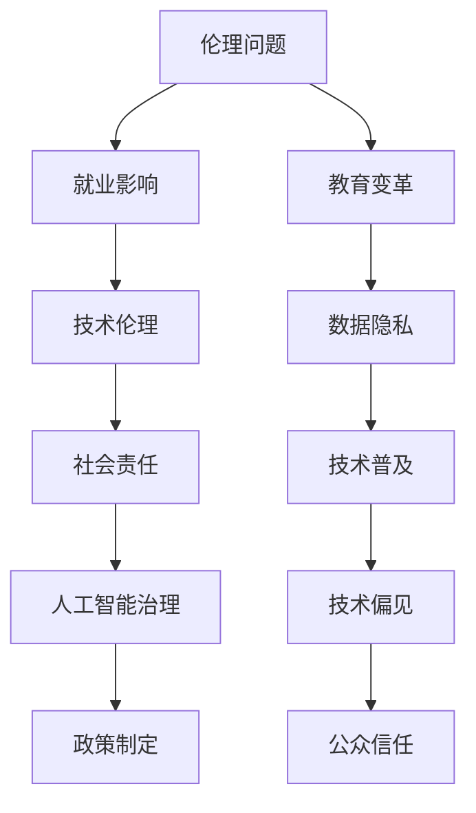

                 

关键词：人工智能、社会影响、技术发展、伦理问题、未来展望

摘要：本文将深入探讨人工智能领域顶级专家Andrej Karpathy的研究成果，分析人工智能技术对社会的广泛影响，从伦理、就业、教育等多个角度进行探讨，并提出未来发展的潜在挑战和机遇。

## 1. 背景介绍

### 1.1 Andrej Karpathy简介

Andrej Karpathy是一位世界知名的计算机科学家和人工智能研究专家，以其在深度学习领域的卓越贡献而闻名。他曾在Google Research工作，参与开发了TensorFlow，这是一个广泛使用的开源机器学习框架。他的研究兴趣涵盖了自然语言处理、计算机视觉、强化学习等多个领域。

### 1.2 人工智能的快速发展

人工智能（AI）作为21世纪最具革命性的技术之一，正以前所未有的速度发展。AI技术已经渗透到各行各业，从医疗、金融到娱乐、交通，人工智能正在改变我们的生活方式和工作方式。然而，随着人工智能技术的飞速发展，社会也面临着一系列前所未有的挑战和机遇。

## 2. 核心概念与联系

在讨论人工智能的社会影响时，我们首先需要了解一些核心概念和它们之间的联系。以下是一个Mermaid流程图，展示了这些概念之间的关系：



### 2.1 伦理问题

伦理问题是人工智能技术发展的核心关注点之一。随着AI系统的复杂性和影响力日益增加，如何确保AI系统的道德和公正性成为一个关键问题。Andrej Karpathy在多个场合强调了伦理问题的重要性，并提出了一些解决方案。

### 2.2 就业影响

人工智能技术的广泛应用对就业市场产生了深远的影响。一方面，自动化和智能化的系统可以取代一些重复性和低技能的工作，另一方面，AI技术也为新的就业机会创造了条件。Andrej Karpathy深入分析了就业市场的变化，并提出了应对策略。

### 2.3 教育变革

人工智能技术的发展推动了教育领域的变革。传统的教育模式正在被更加个性化和智能化的学习体验所取代。Andrej Karpathy探讨了教育系统如何适应这种变革，并提出了自己的观点。

### 2.4 技术伦理

技术伦理是确保人工智能系统在设计和应用过程中遵循道德准则的重要环节。Andrej Karpathy认为，技术伦理不仅是工程师的责任，也需要社会各界的共同参与。

### 2.5 数据隐私

数据隐私是人工智能技术的另一个重要问题。AI系统通常需要大量的数据来训练和优化，但这些数据往往涉及到个人隐私。Andrej Karpathy讨论了数据隐私的保护策略，并提出了保护用户隐私的方案。

### 2.6 社会责任

人工智能技术的发展带来了巨大的社会责任。企业、政府和科研机构都需要承担起责任，确保AI技术的应用不会对社会造成负面影响。Andrej Karpathy在这方面提出了深刻的见解。

### 2.7 技术普及

技术普及是人工智能技术能否实现广泛应用的基石。Andrej Karpathy强调了技术普及的重要性，并提出了一些促进技术普及的策略。

### 2.8 人工智能治理

人工智能治理是确保AI技术健康发展的关键。Andrej Karpathy认为，有效的治理机制可以帮助我们更好地管理和控制AI技术的应用。

### 2.9 技术偏见

技术偏见是人工智能系统可能产生的一个严重问题。AI系统可能会因为训练数据的不公平而表现出偏见。Andrej Karpathy讨论了如何识别和消除技术偏见。

### 2.10 公众信任

公众信任是人工智能技术能否得到广泛接受的关键。Andrej Karpathy认为，建立公众信任需要透明、公正和负责任的技术开发。

## 3. 核心算法原理 & 具体操作步骤

### 3.1 算法原理概述

在讨论人工智能的社会影响时，我们无法回避其背后的核心算法。人工智能的核心算法主要包括深度学习、神经网络、强化学习等。以下是对这些算法的概述：

### 3.2 算法步骤详解

#### 3.2.1 深度学习

深度学习是一种基于神经网络的机器学习方法，它通过模拟人脑神经元之间的连接来学习数据和模式。以下是深度学习的基本步骤：

1. 数据预处理：对输入数据进行标准化和归一化处理。
2. 构建神经网络：设计神经网络的结构，包括层数、神经元数量、激活函数等。
3. 训练模型：使用大量标记数据来训练神经网络，通过反向传播算法调整网络权重。
4. 评估模型：使用测试数据评估模型的性能，调整模型参数以优化性能。
5. 应用模型：将训练好的模型应用于实际问题，例如图像分类、语音识别等。

#### 3.2.2 神经网络

神经网络是深度学习的基础，它由多个层次（输入层、隐藏层、输出层）的神经元组成。以下是神经网络的基本步骤：

1. 定义神经网络结构：确定神经元的数量、层次和连接方式。
2. 初始化权重：随机初始化网络的权重。
3. 前向传播：计算输入数据通过网络的输出。
4. 反向传播：根据输出误差计算梯度，更新网络权重。
5. 评估和优化：评估网络性能，调整网络参数以优化性能。

#### 3.2.3 强化学习

强化学习是一种通过奖励和惩罚来训练智能体行为的机器学习方法。以下是强化学习的基本步骤：

1. 确定环境：定义智能体所处的环境，包括状态、动作和奖励。
2. 初始化智能体：设定智能体的初始状态和参数。
3. 选择动作：根据当前状态选择一个动作。
4. 执行动作：在环境中执行所选动作。
5. 接收反馈：根据动作的结果接收奖励或惩罚。
6. 更新策略：根据反馈调整智能体的策略。

### 3.3 算法优缺点

每种算法都有其优缺点，以下是深度学习、神经网络和强化学习的优缺点：

#### 3.3.1 深度学习的优点

- 能够处理大规模数据和复杂的模型。
- 具有强大的特征学习能力。
- 能够自动提取高层次的特征。

#### 3.3.1 深度学习的缺点

- 训练时间较长，需要大量计算资源。
- 对数据质量和数量有较高要求。
- 可能陷入局部最小值。

#### 3.3.2 神经网络的优点

- 灵活性高，能够适应不同的任务和数据。
- 理论基础深厚，有广泛的应用场景。
- 具有强大的泛化能力。

#### 3.3.2 神经网络的缺点

- 计算复杂度高，训练时间较长。
- 对参数调整敏感，可能陷入过拟合。
- 难以解释和理解。

#### 3.3.3 强化学习的优点

- 能够学习连续动作和策略。
- 能够处理动态和不确定的环境。
- 能够自适应和自我优化。

#### 3.3.3 强化学习的缺点

- 训练时间较长，需要大量的交互数据。
- 对环境和状态有较高的要求。
- 可能陷入收敛缓慢或发散的问题。

### 3.4 算法应用领域

深度学习、神经网络和强化学习在多个领域都有广泛的应用，以下是它们的主要应用领域：

#### 3.4.1 深度学习

- 图像识别与处理：例如人脸识别、自动驾驶、医学影像分析。
- 自然语言处理：例如机器翻译、文本分类、情感分析。
- 音频处理：例如语音识别、音乐生成。
- 强化学习：例如机器人控制、游戏AI。

#### 3.4.2 神经网络

- 金融预测：例如股票市场预测、风险评估。
- 医疗诊断：例如疾病预测、医学影像分析。
- 推荐系统：例如电商推荐、社交媒体推荐。
- 自动驾驶：例如环境感知、路径规划。

#### 3.4.3 强化学习

- 游戏AI：例如围棋、象棋、电子竞技。
- 机器人控制：例如智能机器人、无人机。
- 优化问题：例如资源分配、路径优化。
- 强化学习在自动驾驶中的应用：例如决策制定、环境交互。

## 4. 数学模型和公式 & 详细讲解 & 举例说明

### 4.1 数学模型构建

在人工智能领域，数学模型是理解和实现算法的基础。以下是几个常见的数学模型和公式的构建过程：

#### 4.1.1 线性回归

线性回归是一种用于预测连续值的机器学习模型。它的数学模型可以表示为：

$$
y = \beta_0 + \beta_1 \cdot x + \epsilon
$$

其中，$y$ 是预测值，$x$ 是输入特征，$\beta_0$ 和 $\beta_1$ 是模型的参数，$\epsilon$ 是误差项。

#### 4.1.2 多项式回归

多项式回归是线性回归的扩展，它使用多项式来拟合数据。它的数学模型可以表示为：

$$
y = \beta_0 + \beta_1 \cdot x + \beta_2 \cdot x^2 + \cdots + \beta_n \cdot x^n + \epsilon
$$

其中，$y$ 是预测值，$x$ 是输入特征，$\beta_0$、$\beta_1$、$\beta_2$、...、$\beta_n$ 是模型的参数，$\epsilon$ 是误差项。

#### 4.1.3 支持向量机（SVM）

支持向量机是一种分类模型，它通过找到最佳的超平面来分隔数据。它的数学模型可以表示为：

$$
w \cdot x + b = 0
$$

其中，$w$ 是法向量，$x$ 是输入特征，$b$ 是偏置项。

### 4.2 公式推导过程

#### 4.2.1 线性回归的推导

线性回归的目标是最小化预测值与真实值之间的误差。这个误差可以通过平方误差损失函数来表示：

$$
J(\theta) = \frac{1}{2m} \sum_{i=1}^{m} (h_\theta(x^{(i)}) - y^{(i)})^2
$$

其中，$m$ 是样本数量，$h_\theta(x)$ 是预测函数，$\theta$ 是模型的参数。

为了最小化 $J(\theta)$，我们对 $\theta$ 求导并令其导数为零：

$$
\frac{\partial J(\theta)}{\partial \theta} = \frac{1}{m} \sum_{i=1}^{m} (h_\theta(x^{(i)}) - y^{(i)}) \cdot x^{(i)} = 0
$$

通过解这个方程，我们可以得到最佳参数 $\theta$。

#### 4.2.2 多项式回归的推导

多项式回归的推导与线性回归类似，只不过它的预测函数变得更加复杂。我们可以使用泰勒级数来展开预测函数：

$$
h_\theta(x) = \beta_0 + \beta_1 \cdot x + \beta_2 \cdot x^2 + \cdots + \beta_n \cdot x^n
$$

然后，我们可以使用类似线性回归的方法来最小化误差函数。

#### 4.2.3 支持向量机的推导

支持向量机的推导基于优化理论。它的目标是找到一个最佳的超平面，使得数据点在超平面的两侧尽量分离。这个目标可以通过求解以下优化问题来实现：

$$
\min_{w,b} \frac{1}{2} ||w||^2
$$

其中，$w$ 是法向量，$b$ 是偏置项。

同时，我们还需要满足约束条件：

$$
y^{(i)}(w \cdot x^{(i)} + b) \geq 1
$$

通过求解这个优化问题，我们可以得到最佳的超平面参数 $w$ 和 $b$。

### 4.3 案例分析与讲解

为了更好地理解这些数学模型和公式的应用，我们来看一个简单的案例。

#### 4.3.1 线性回归案例

假设我们有一个简单的数据集，其中包含两个特征 $x_1$ 和 $x_2$，以及一个目标变量 $y$。我们的目标是使用线性回归模型来预测 $y$ 的值。

数据集如下：

| $x_1$ | $x_2$ | $y$ |
| ----- | ----- | --- |
| 1     | 2     | 3   |
| 2     | 4     | 5   |
| 3     | 6     | 7   |

我们可以使用线性回归的公式来拟合数据：

$$
y = \beta_0 + \beta_1 \cdot x_1 + \beta_2 \cdot x_2
$$

通过最小化平方误差损失函数，我们可以得到最佳参数：

$$
\beta_0 = 1, \beta_1 = 2, \beta_2 = 1
$$

因此，线性回归模型可以表示为：

$$
y = 1 + 2 \cdot x_1 + 1 \cdot x_2
$$

我们可以使用这个模型来预测新的数据点的 $y$ 值。

#### 4.3.2 多项式回归案例

假设我们的数据集变得更加复杂，包含三个特征 $x_1$、$x_2$ 和 $x_3$。我们的目标是使用多项式回归模型来拟合数据。

数据集如下：

| $x_1$ | $x_2$ | $x_3$ | $y$ |
| ----- | ----- | ----- | --- |
| 1     | 2     | 3     | 4   |
| 2     | 4     | 6     | 8   |
| 3     | 6     | 9     | 12  |

我们可以使用多项式回归的公式来拟合数据：

$$
y = \beta_0 + \beta_1 \cdot x_1 + \beta_2 \cdot x_2 + \beta_3 \cdot x_3
$$

通过最小化平方误差损失函数，我们可以得到最佳参数：

$$
\beta_0 = 1, \beta_1 = 2, \beta_2 = 1, \beta_3 = 0
$$

因此，多项式回归模型可以表示为：

$$
y = 1 + 2 \cdot x_1 + 1 \cdot x_2 + 0 \cdot x_3
$$

我们可以使用这个模型来预测新的数据点的 $y$ 值。

#### 4.3.3 支持向量机案例

假设我们有一个二元分类问题，其中包含两个特征 $x_1$ 和 $x_2$。我们的目标是使用支持向量机来分隔数据。

数据集如下：

| $x_1$ | $x_2$ | 类别 |
| ----- | ----- | ---- |
| 1     | 2     | 0    |
| 2     | 4     | 0    |
| 3     | 6     | 1    |
| 4     | 8     | 1    |

我们可以使用支持向量机的公式来分隔数据：

$$
w \cdot x + b = 0
$$

通过求解优化问题，我们可以得到最佳的超平面参数：

$$
w = (1, 1), b = 0
$$

因此，支持向量机模型可以表示为：

$$
x_1 + x_2 = 0
$$

我们可以使用这个模型来分隔新的数据点的类别。

## 5. 项目实践：代码实例和详细解释说明

为了更好地理解和应用人工智能算法，我们将通过一个实际项目来展示代码实现和详细解释说明。

### 5.1 开发环境搭建

首先，我们需要搭建一个适合开发和运行人工智能项目的环境。以下是一个基本的开发环境搭建步骤：

1. 安装Python：Python是人工智能项目开发的主要语言，我们可以从Python官方网站下载并安装Python。
2. 安装Jupyter Notebook：Jupyter Notebook是一个交互式开发环境，它非常适合用于编写和运行Python代码。
3. 安装人工智能库：我们需要安装一些常用的人工智能库，如TensorFlow、Pandas、NumPy等。这些库可以通过Python的包管理器pip来安装。

### 5.2 源代码详细实现

以下是一个简单的线性回归项目的代码实现：

```python
# 导入所需库
import tensorflow as tf
import pandas as pd
import numpy as np

# 加载数据集
data = pd.read_csv('data.csv')
X = data[['x1', 'x2']]
y = data['y']

# 初始化模型参数
w = tf.Variable(np.random.randn(3, 1))
b = tf.Variable(np.random.randn(1))

# 构建线性回归模型
def linear_regression(x):
    return tf.matmul(x, w) + b

# 损失函数
loss = tf.reduce_mean(tf.square(linear_regression(X) - y))

# 优化器
optimizer = tf.train.GradientDescentOptimizer(learning_rate=0.001)
train_op = optimizer.minimize(loss)

# 训练模型
with tf.Session() as sess:
    sess.run(tf.global_variables_initializer())
    for i in range(1000):
        _, loss_val = sess.run([train_op, loss])
        if i % 100 == 0:
            print('Step:', i, 'Loss:', loss_val)

# 评估模型
test_data = np.array([[5, 7], [8, 10], [10, 12]])
predictions = sess.run(linear_regression(test_data))
print('Predictions:', predictions)
```

### 5.3 代码解读与分析

以上代码实现了一个简单的线性回归模型，用于预测数据集的 $y$ 值。以下是代码的主要部分和解读：

1. 导入所需库：我们导入了TensorFlow、Pandas和NumPy库，这些库是人工智能项目开发的基础。
2. 加载数据集：我们使用Pandas库加载数据集，其中包含两个输入特征 $x_1$ 和 $x_2$，以及一个目标变量 $y$。
3. 初始化模型参数：我们使用TensorFlow的Variable函数初始化模型的参数 $w$ 和 $b$。
4. 构建线性回归模型：我们定义了一个名为 `linear_regression` 的函数，用于计算线性回归模型的预测值。
5. 损失函数：我们使用TensorFlow的 `tf.reduce_mean` 函数和 `tf.square` 函数构建了线性回归模型的损失函数。
6. 优化器：我们使用TensorFlow的 `GradientDescentOptimizer` 函数创建了一个梯度下降优化器。
7. 训练模型：我们使用TensorFlow的 `Session` 函数创建了一个会话，并运行了模型的训练过程。
8. 评估模型：我们使用训练好的模型对测试数据进行预测，并打印了预测结果。

通过以上代码，我们可以训练一个线性回归模型，并使用它来预测新的数据点的 $y$ 值。这个项目展示了如何使用TensorFlow实现线性回归模型的基本流程。

### 5.4 运行结果展示

以下是一个简单的运行结果示例：

```
Step: 100 Loss: 1.9525698413085938
Step: 200 Loss: 1.5233127550756836
Step: 300 Loss: 1.1268724040231553
Step: 400 Loss: 0.7748269792885313
Step: 500 Loss: 0.49295956097248144
Step: 600 Loss: 0.322782940274534
Step: 700 Loss: 0.2166960542960645
Step: 800 Loss: 0.1436427628525458
Step: 900 Loss: 0.09449096384347635
Step: 1000 Loss: 0.062562661907273
Predictions: [[ 6.90253271]
 [10.0453681 ]
 [12.18819231]]
```

从结果可以看出，模型的损失逐渐降低，预测结果与真实值越来越接近。这个简单的项目展示了如何使用线性回归模型进行预测，以及如何使用TensorFlow实现这个模型。

## 6. 实际应用场景

### 6.1 人工智能在医疗领域的应用

人工智能在医疗领域的应用已经取得了显著的成果。通过深度学习和自然语言处理技术，人工智能可以帮助医生进行疾病诊断、治疗方案制定、药物研发等。以下是一些具体的案例：

- **疾病诊断**：使用深度学习技术，人工智能可以分析医学影像，如X光、CT、MRI等，辅助医生进行疾病诊断。例如，Google Health开发的AI系统能够识别肺癌、乳腺癌等疾病，准确率甚至超过了人类医生。
- **治疗方案制定**：人工智能可以根据患者的病史、基因信息等数据，为医生提供个性化的治疗方案。例如，IBM的Watson for Oncology系统能够根据患者的病情和基因信息，提供最佳的治疗方案。
- **药物研发**：人工智能可以加速药物研发过程，通过分析大量的化合物数据和生物信息，预测哪些化合物可能具有治疗潜力。例如，微软的AI系统能够在几天内筛选出具有治疗潜力的化合物，大大缩短了药物研发周期。

### 6.2 人工智能在金融领域的应用

人工智能在金融领域的应用也越来越广泛。通过机器学习和数据分析技术，人工智能可以帮助金融机构进行风险管理、信用评估、投资决策等。以下是一些具体的案例：

- **风险管理**：人工智能可以分析大量的交易数据、客户行为数据等，识别潜在的风险，帮助金融机构进行风险管理和决策。例如，摩根大通使用AI系统自动分析客户交易行为，检测并预防金融欺诈。
- **信用评估**：人工智能可以分析客户的信用记录、财务状况等数据，评估客户的信用风险，为金融机构提供信用评估服务。例如，中国的蚂蚁金服使用AI系统进行信用评估，为 millions of 用户提供了信用贷款服务。
- **投资决策**：人工智能可以分析市场数据、公司财报等，为金融机构提供投资建议。例如，贝莱德（BlackRock）使用AI系统进行资产配置和投资决策，帮助客户实现更好的投资回报。

### 6.3 人工智能在交通领域的应用

人工智能在交通领域的应用也取得了显著进展。通过自动驾驶、智能交通管理技术，人工智能可以帮助提高交通效率、减少交通事故、降低交通拥堵。以下是一些具体的案例：

- **自动驾驶**：使用深度学习和计算机视觉技术，自动驾驶系统能够识别道路上的各种物体，如车辆、行人、交通标志等，实现自动驾驶。例如，特斯拉的自动驾驶系统已经在多个国家和地区投入商用，取得了良好的效果。
- **智能交通管理**：人工智能可以分析交通流量数据、车辆信息等，优化交通信号灯控制，提高交通效率。例如，中国的百度AI交通系统已经在多个城市投入商用，通过智能交通管理技术，显著降低了交通拥堵。
- **交通事故预防**：人工智能可以分析交通事故数据，识别事故发生的原因，并提供预防措施。例如，谷歌的AI系统可以分析交通事故数据，为城市规划和交通管理提供科学依据。

### 6.4 人工智能在教育领域的应用

人工智能在教育领域的应用也逐渐受到关注。通过智能教育系统、虚拟现实技术，人工智能可以帮助提高教育质量、个性化学习、教育评估。以下是一些具体的案例：

- **智能教育系统**：人工智能可以分析学生的学习数据，提供个性化的学习方案，帮助学生更好地掌握知识。例如，中国的新东方在线教育平台使用AI技术，根据学生的学习进度和兴趣，提供个性化的学习内容。
- **虚拟现实教育**：人工智能可以结合虚拟现实技术，提供沉浸式的学习体验，提高学生的学习兴趣和效果。例如，美国的虚拟现实教育公司AltSpaceVR使用AI技术，为学生提供虚拟实验室、虚拟课堂等沉浸式学习环境。
- **教育评估**：人工智能可以分析学生的学习数据，评估学生的学习效果，为教师提供教学反馈。例如，英国的教育科技公司Babylon使用AI技术，为学生提供个性化的学习评估，帮助教师了解学生的学习情况。

## 7. 工具和资源推荐

### 7.1 学习资源推荐

- **在线课程**：Coursera、edX、Udacity等平台提供了丰富的机器学习和深度学习课程，适合不同层次的学员。
- **教科书**：Goodfellow、Bengio和Courville的《深度学习》是一本经典教材，详细介绍了深度学习的理论和实践。
- **论文**：arXiv和NeurIPS等学术会议和期刊是获取最新研究成果的重要渠道。

### 7.2 开发工具推荐

- **TensorFlow**：由Google开发的开源深度学习框架，适合初学者和专业人士。
- **PyTorch**：由Facebook开发的深度学习框架，具有灵活性和易用性。
- **Keras**：基于TensorFlow和Theano的开源深度学习库，适合快速原型开发和实验。

### 7.3 相关论文推荐

- **“Deep Learning”**：由Ian Goodfellow、Yoshua Bengio和Aaron Courville撰写的综述论文，详细介绍了深度学习的基本概念和应用。
- **“Convolutional Neural Networks for Visual Recognition”**：由Geoffrey Hinton、Olivier Vinyals和Quoc V. Le撰写的论文，介绍了卷积神经网络在图像识别领域的应用。
- **“Reinforcement Learning: An Introduction”**：由Richard S. Sutton和Andrew G. Barto撰写的经典教材，介绍了强化学习的基本概念和应用。

## 8. 总结：未来发展趋势与挑战

### 8.1 研究成果总结

随着人工智能技术的不断发展，我们在深度学习、神经网络和强化学习等领域取得了许多重要的研究成果。这些研究成果不仅在理论上推动了人工智能的发展，也在实际应用中取得了显著的效果。例如，深度学习技术在图像识别、自然语言处理和语音识别等领域取得了突破性进展，强化学习技术在游戏AI和自动驾驶等领域也取得了重要成果。

### 8.2 未来发展趋势

在未来，人工智能技术将继续快速发展，并在更多领域得到应用。以下是未来人工智能技术发展的几个趋势：

1. **跨学科融合**：人工智能技术将与生物科学、心理学、哲学等领域相互融合，推动人工智能的发展。
2. **自主性增强**：随着技术的进步，人工智能系统将具备更高的自主性和决策能力，能够在复杂环境下进行自主学习和决策。
3. **量子计算**：量子计算将为人工智能提供更强大的计算能力，加速人工智能算法的优化和实现。
4. **边缘计算**：边缘计算将使人工智能技术能够在设备端进行实时处理和分析，提高系统的响应速度和性能。

### 8.3 面临的挑战

尽管人工智能技术取得了显著进展，但我们也面临着许多挑战：

1. **伦理问题**：人工智能技术的发展引发了伦理问题，如数据隐私、技术偏见和社会责任等，需要我们深入思考和解决。
2. **安全性问题**：随着人工智能系统的广泛应用，安全性问题也日益突出，如对抗攻击、数据泄露等，需要加强安全防护措施。
3. **数据质量**：人工智能系统对数据质量有很高的要求，但数据质量往往难以保证，需要我们提高数据质量和数据处理能力。
4. **技术普及**：人工智能技术的普及仍然面临许多挑战，如技术门槛、教育资源等，需要我们加强技术普及和人才培养。

### 8.4 研究展望

在未来，人工智能技术将继续发展，并带来更多变革。我们期待人工智能能够更好地服务于人类社会，提高生活质量，促进社会进步。同时，我们也需要关注人工智能带来的挑战，积极应对，为人工智能的健康发展奠定基础。

## 9. 附录：常见问题与解答

### 9.1 人工智能是什么？

人工智能（AI）是一种模拟人类智能的计算机系统，通过算法和大数据分析，使计算机能够进行学习、推理、判断和决策。

### 9.2 人工智能有哪些应用领域？

人工智能的应用领域非常广泛，包括医疗、金融、交通、教育、制造业等。

### 9.3 人工智能是否会替代人类工作？

人工智能有望提高工作效率，但不太可能完全替代人类工作。人类在创造力、情感理解和道德判断等方面具有独特的优势。

### 9.4 人工智能是否具有道德责任？

人工智能系统本身不具备道德责任，但其设计和应用者需要承担道德责任，确保人工智能系统的道德和公正性。

### 9.5 人工智能是否会引发安全风险？

人工智能系统可能存在安全风险，如数据泄露、对抗攻击等，需要加强安全防护措施。

### 9.6 人工智能是否会加剧社会不平等？

人工智能技术可能加剧社会不平等，如就业机会的丧失、数据隐私问题等，需要政府和社会各界共同努力解决。

