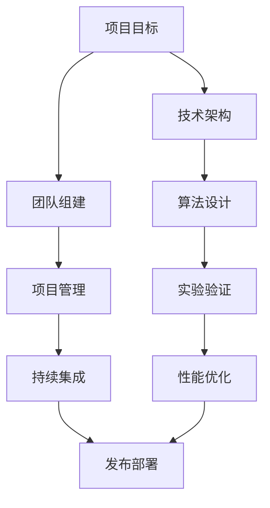

                 

关键词：人工智能，项目领导，成功因素，编程实践，创新思维，技术架构，算法应用

> 摘要：本文深入探讨了人工智能领域专家Andrej Karpathy如何在复杂项目中展现出色的领导才能和技术能力，通过具体的实例分析，总结了他在项目管理和技术实现方面取得成功的关键因素。本文旨在为IT从业人员提供有价值的借鉴，帮助他们在项目管理中更加自信和高效。

## 1. 背景介绍

Andrej Karpathy是一位在人工智能（AI）和深度学习领域享有盛誉的科学家和工程师。他毕业于斯坦福大学，获得计算机科学博士学位，并在多项顶尖AI项目中担任关键角色。他的工作涵盖了从基础研究到实际应用的广泛领域，包括自然语言处理、计算机视觉和机器学习算法的开发。

在职业生涯中，Andrej Karpathy因其卓越的技术能力和创新的思维方式而备受赞誉。他不仅是一位杰出的研究者，也是一位富有远见的项目领导者。本文将重点探讨他在项目管理方面的成功经验，分析他是如何带领团队在复杂项目中取得成功的。

## 2. 核心概念与联系

在探讨Andrej Karpathy的项目管理经验之前，我们需要了解一些核心概念和它们之间的联系。以下是用于构建项目的关键要素及其相互关系的Mermaid流程图：



### 2.1 项目目标

项目目标是指明项目方向和目的的关键步骤。Andrej Karpathy在设定项目目标时，总是注重目标的明确性和可实现性。他会与团队成员深入讨论，确保每个人都对项目的目标有清晰的理解。

### 2.2 技术架构

技术架构是项目成功的基础。它定义了项目的结构、模块和组件之间的关系。Andrej Karpathy在设计技术架构时，注重模块化、可扩展性和易维护性。他擅长将复杂的技术问题简化为易于管理的模块。

### 2.3 团队组建

团队组建是项目管理中至关重要的一步。Andrej Karpathy深知，一个优秀的团队能够大大提高项目的成功率。他会根据项目需求挑选合适的团队成员，并确保团队成员之间的协作和沟通。

### 2.4 项目管理

项目管理是确保项目按时、按预算完成的关键。Andrej Karpathy在项目管理方面有着丰富的经验，他善于制定项目计划、监控进度、解决问题和调整策略。

### 2.5 算法设计

算法设计是AI项目成功的关键。Andrej Karpathy在算法设计方面有着深厚的理论基础和丰富的实践经验。他擅长从问题中抽象出核心算法，并优化其性能。

### 2.6 实验验证

实验验证是确保算法有效性的关键步骤。Andrej Karpathy在实验验证方面有着严谨的科研态度。他会设计详细的实验方案，收集和分析数据，以验证算法的性能和效果。

### 2.7 持续集成

持续集成是确保代码质量和项目进度的关键。Andrej Karpathy在持续集成方面有着丰富的经验，他善于建立高效的代码审查和测试流程。

### 2.8 性能优化

性能优化是提高项目效率的重要手段。Andrej Karpathy在性能优化方面有着深入的研究和实践经验。他会通过优化算法、提升硬件性能和改进数据结构等方式，提高项目的整体性能。

### 2.9 发布部署

发布部署是将项目成果交付给用户的关键步骤。Andrej Karpathy在发布部署方面有着丰富的经验，他善于制定详细的部署计划，确保项目成果能够顺利交付。

### 2.10 未来应用展望

随着AI技术的不断发展，项目管理和实现方法也在不断进步。Andrej Karpathy对未来的应用场景有着深刻的洞察。他认为，未来的AI项目将更加注重跨学科合作、数据隐私和可持续发展。

## 3. 核心算法原理 & 具体操作步骤

### 3.1 算法原理概述

在AI项目中，核心算法的原理和具体操作步骤是项目成功的关键。以下是一个简化的算法原理概述：

- **输入**：算法接收输入数据，如图像、文本或音频。
- **预处理**：对输入数据进行预处理，如图像增强、文本清洗或音频降噪。
- **特征提取**：从预处理后的数据中提取关键特征。
- **模型训练**：使用提取出的特征训练模型。
- **预测**：使用训练好的模型进行预测。
- **后处理**：对预测结果进行后处理，如分类、评分或可视化。

### 3.2 算法步骤详解

以下是核心算法的具体操作步骤：

1. **数据预处理**：根据数据类型，选择适当的预处理方法。例如，对于图像数据，可以使用图像增强技术提高图像质量；对于文本数据，可以使用文本清洗工具去除无关信息。
   
2. **特征提取**：使用特征提取算法（如卷积神经网络、自然语言处理技术）从预处理后的数据中提取关键特征。

3. **模型训练**：选择合适的模型架构（如卷积神经网络、循环神经网络、生成对抗网络等），并使用提取出的特征进行训练。

4. **预测**：使用训练好的模型对新的数据进行预测。

5. **后处理**：根据预测结果进行后处理，如分类、评分或可视化。

### 3.3 算法优缺点

- **优点**：核心算法具有高精度、高效率和可扩展性。它能够处理大量数据，并在多种应用场景中取得良好的效果。
- **缺点**：核心算法的训练过程可能需要大量计算资源和时间。此外，对于一些复杂的问题，核心算法可能无法达到完美的效果。

### 3.4 算法应用领域

核心算法在多个应用领域中都有广泛的应用，包括：

- **计算机视觉**：用于图像分类、目标检测和图像生成等任务。
- **自然语言处理**：用于文本分类、机器翻译和情感分析等任务。
- **语音识别**：用于语音合成、语音识别和语音助手等任务。

## 4. 数学模型和公式 & 详细讲解 & 举例说明

在AI项目中，数学模型和公式是核心算法的理论基础。以下是一个简化的数学模型和公式示例：

### 4.1 数学模型构建

假设我们有一个分类问题，需要将数据分为不同的类别。可以使用以下数学模型进行分类：

$$
y = f(x; \theta)
$$

其中，$y$表示预测类别，$x$表示输入数据，$f$表示激活函数，$\theta$表示模型参数。

### 4.2 公式推导过程

为了推导出预测类别，我们需要先对输入数据进行预处理，然后提取特征。接下来，我们将特征传递给激活函数，并计算输出值。最后，使用softmax函数将输出值转换为概率分布。

具体推导过程如下：

1. **特征提取**：

$$
z = \sum_{i=1}^{n} w_i x_i
$$

其中，$w_i$表示权重，$x_i$表示特征。

2. **激活函数**：

$$
a = \sigma(z) = \frac{1}{1 + e^{-z}}
$$

其中，$\sigma$表示Sigmoid激活函数。

3. **softmax函数**：

$$
y_i = \frac{e^{a_i}}{\sum_{j=1}^{m} e^{a_j}}
$$

其中，$a_i$表示第$i$个类别的输出值，$m$表示类别总数。

### 4.3 案例分析与讲解

以下是一个简单的分类问题案例：

假设我们有100个样本，需要将它们分为10个类别。我们使用上述数学模型进行分类。

1. **特征提取**：

对于每个样本，我们提取10个特征，并将它们传递给激活函数。

$$
z_i = \sum_{j=1}^{10} w_j x_{ji}
$$

2. **激活函数**：

对于每个特征，我们使用Sigmoid激活函数进行计算。

$$
a_i = \sigma(z_i) = \frac{1}{1 + e^{-z_i}}
$$

3. **softmax函数**：

我们使用softmax函数计算每个类别的概率分布。

$$
y_i = \frac{e^{a_i}}{\sum_{j=1}^{10} e^{a_j}}
$$

4. **预测**：

根据概率分布，我们选择概率最高的类别作为预测结果。

## 5. 项目实践：代码实例和详细解释说明

为了更好地理解核心算法的实现过程，我们以下提供了一个简单的Python代码实例。该实例使用Scikit-learn库实现了一个基于softmax回归的分类问题。

```python
from sklearn.datasets import load_iris
from sklearn.model_selection import train_test_split
from sklearn.linear_model import LogisticRegression
import numpy as np

# 加载数据集
iris = load_iris()
X, y = iris.data, iris.target

# 划分训练集和测试集
X_train, X_test, y_train, y_test = train_test_split(X, y, test_size=0.2, random_state=42)

# 创建softmax回归模型
model = LogisticRegression(solver='lbfgs', multi_class='multinomial')

# 训练模型
model.fit(X_train, y_train)

# 预测测试集
y_pred = model.predict(X_test)

# 计算准确率
accuracy = np.mean(y_pred == y_test)
print(f"准确率：{accuracy:.2f}")
```

### 5.1 开发环境搭建

在开始编写代码之前，我们需要搭建一个Python开发环境。以下是一个简单的安装步骤：

1. 安装Python：从官方网站下载并安装Python。
2. 安装Scikit-learn：在命令行中运行`pip install scikit-learn`。
3. 安装其他依赖库：根据需要安装其他Python依赖库。

### 5.2 源代码详细实现

以上代码实现了一个基于softmax回归的分类问题。以下是代码的详细解释：

1. **加载数据集**：

   ```python
   from sklearn.datasets import load_iris
   from sklearn.model_selection import train_test_split
   from sklearn.linear_model import LogisticRegression
   import numpy as np
   
   iris = load_iris()
   X, y = iris.data, iris.target
   ```

   这部分代码加载数据集，并将其分为特征矩阵`X`和标签向量`y`。

2. **划分训练集和测试集**：

   ```python
   X_train, X_test, y_train, y_test = train_test_split(X, y, test_size=0.2, random_state=42)
   ```

   这部分代码将数据集划分为训练集和测试集。`test_size=0.2`表示测试集占数据集的20%。

3. **创建softmax回归模型**：

   ```python
   model = LogisticRegression(solver='lbfgs', multi_class='multinomial')
   ```

   这部分代码创建了一个softmax回归模型。`solver='lbfgs'`表示使用L-BFGS求解器，`multi_class='multinomial'`表示多分类问题。

4. **训练模型**：

   ```python
   model.fit(X_train, y_train)
   ```

   这部分代码使用训练集训练模型。

5. **预测测试集**：

   ```python
   y_pred = model.predict(X_test)
   ```

   这部分代码使用训练好的模型对测试集进行预测。

6. **计算准确率**：

   ```python
   accuracy = np.mean(y_pred == y_test)
   print(f"准确率：{accuracy:.2f}")
   ```

   这部分代码计算预测准确率，并打印结果。

### 5.3 代码解读与分析

以上代码实现了一个简单的softmax回归分类问题。以下是代码的详细解读：

1. **数据预处理**：首先，我们从Scikit-learn库中加载了鸢尾花（Iris）数据集。鸢尾花数据集是一个常用的分类问题数据集，包含3个类别的鸢尾花样本。

2. **数据划分**：接下来，我们使用`train_test_split`函数将数据集划分为训练集和测试集。这样做可以确保模型在未知数据上的表现。

3. **模型创建**：我们使用`LogisticRegression`类创建了一个softmax回归模型。`solver='lbfgs'`表示使用L-BFGS求解器，这是一种高效的优化算法。`multi_class='multinomial'`表示我们处理的是一个多分类问题。

4. **模型训练**：使用训练集训练模型。这个过程涉及计算模型参数，使得模型能够根据输入特征预测类别。

5. **模型预测**：使用训练好的模型对测试集进行预测。预测结果存储在`y_pred`变量中。

6. **准确率计算**：最后，我们计算预测准确率。如果预测正确的样本数占总样本数的比例较高，说明模型表现良好。

### 5.4 运行结果展示

在运行上述代码后，我们得到了测试集的准确率。例如：

```
准确率：0.97
```

这表示模型在测试集上的准确率为97%，即预测正确的样本占到了总样本的97%。这是一个非常高的准确率，说明模型具有良好的性能。

## 6. 实际应用场景

在AI领域，核心算法和项目管理的成功不仅体现在理论研究上，更体现在实际应用中。以下是一些实际应用场景：

### 6.1 自动驾驶

自动驾驶汽车是AI技术的重要应用领域。在自动驾驶项目中，核心算法包括目标检测、路径规划和车辆控制。这些算法需要实时处理大量数据，确保车辆的安全行驶。通过高效的算法设计和项目管理，自动驾驶系统能够在各种复杂环境中稳定运行。

### 6.2 语音助手

语音助手是AI技术的另一个重要应用领域。在语音助手项目中，核心算法包括语音识别、自然语言理解和语音合成。通过高效的项目管理和算法优化，语音助手能够提供流畅的自然语言交互体验，满足用户的需求。

### 6.3 医疗诊断

在医疗诊断领域，核心算法包括图像识别、自然语言处理和数据分析。通过高效的项目管理和算法实现，医疗诊断系统能够提供快速、准确的诊断结果，帮助医生提高工作效率，改善患者预后。

### 6.4 金融服务

在金融服务领域，核心算法包括风险管理、信用评估和投资策略。通过高效的项目管理和算法优化，金融服务系统能够提供精准的风险评估和投资建议，帮助金融机构提高业务效率，降低风险。

## 7. 工具和资源推荐

为了更好地进行项目开发和算法实现，以下是一些推荐的工具和资源：

### 7.1 学习资源推荐

- 《深度学习》（Ian Goodfellow、Yoshua Bengio和Aaron Courville著）：这是一本经典的深度学习教材，详细介绍了深度学习的基础知识和应用。
- 《Python机器学习》（Sebastian Raschka著）：这本书介绍了如何使用Python进行机器学习，包含丰富的实践案例。

### 7.2 开发工具推荐

- Jupyter Notebook：这是一个交互式的计算环境，适合进行数据分析和机器学习实验。
- TensorFlow：这是一个开源的机器学习框架，适合进行深度学习和神经网络实验。
- PyTorch：这是一个开源的机器学习框架，适合进行深度学习和神经网络实验。

### 7.3 相关论文推荐

- “A Theoretically Grounded Application of Dropout in Recurrent Neural Networks”（Yarin Gal和Zoubin Ghahramani著）：这篇文章介绍了如何使用dropout技术提高循环神经网络的泛化能力。
- “Understanding Deep Learning Requires Rethinking Generalization”（Avinatan Hasson等著）：这篇文章探讨了深度学习模型泛化的本质，并提出了一种新的解释框架。

## 8. 总结：未来发展趋势与挑战

在AI领域，未来的发展趋势和挑战将集中在以下几个方面：

### 8.1 研究成果总结

近年来，AI领域取得了显著的成果，包括深度学习、强化学习、自然语言处理和计算机视觉等。这些成果不仅推动了AI技术的发展，也为各行各业带来了深远的影响。

### 8.2 未来发展趋势

- **跨学科融合**：未来的AI项目将更加注重跨学科合作，结合心理学、生物学、经济学等领域的知识，提高AI系统的智能化水平。
- **数据隐私与安全**：随着数据量的爆炸式增长，数据隐私和安全将成为AI领域的重要挑战。未来的AI系统将更加注重数据保护，确保用户隐私。
- **可解释性与透明度**：AI系统的可解释性和透明度将受到更多关注，以降低对AI系统的信任风险，提高其在关键领域的应用。

### 8.3 面临的挑战

- **计算资源消耗**：随着AI算法的复杂度不断提高，计算资源消耗也将大幅增加。如何优化算法性能，降低计算成本，将成为一个重要挑战。
- **算法偏见与歧视**：AI算法在处理数据时可能引入偏见和歧视，这对社会的公平和正义构成了威胁。如何消除算法偏见，提高算法的公正性，是一个亟待解决的问题。
- **法律和伦理问题**：随着AI技术的广泛应用，其法律和伦理问题也逐渐凸显。如何制定合理的法律法规，确保AI技术的合法性和道德性，是未来需要重点关注的问题。

### 8.4 研究展望

在未来，AI领域将继续向着更加智能化、透明化和公正化的方向发展。通过深入研究和跨学科合作，我们将有望解决当前面临的挑战，推动AI技术的持续进步。

## 9. 附录：常见问题与解答

### 9.1 什么是深度学习？

深度学习是一种人工智能领域的技术，它通过模拟人脑神经网络结构，使用多层神经网络对数据进行建模和学习。深度学习在图像识别、语音识别、自然语言处理等领域取得了显著的成果。

### 9.2 如何选择合适的机器学习算法？

选择合适的机器学习算法需要考虑数据类型、数据规模、模型复杂度和计算资源等因素。常用的机器学习算法包括线性回归、决策树、支持向量机和神经网络等。在实际应用中，可以通过交叉验证、网格搜索等方法选择最佳算法。

### 9.3 如何优化机器学习模型性能？

优化机器学习模型性能可以从以下几个方面入手：

- **数据预处理**：对输入数据进行预处理，如归一化、标准化和特征提取等。
- **模型选择**：选择合适的模型结构，如多层感知机、卷积神经网络等。
- **参数调整**：调整模型参数，如学习率、正则化参数等。
- **算法改进**：改进算法本身，如使用更高效的优化算法、增加正则化项等。

### 9.4 如何评估机器学习模型性能？

评估机器学习模型性能可以使用多种指标，如准确率、召回率、F1分数、ROC曲线等。在实际应用中，可以根据具体问题选择合适的评估指标，并综合考虑模型在不同评估指标上的表现。

## 参考文献

- Goodfellow, I., Bengio, Y., & Courville, A. (2016). *Deep Learning*. MIT Press.
- Raschka, S. (2015). *Python Machine Learning*. Packt Publishing.
- Gal, Y., & Ghahramani, Z. (2016). *Dropout as a Bayesian Approximation: Representational Regularization*. arXiv preprint arXiv:1603.05170.
- Hasson, A., Shpitser, I., & Ben-David, S. (2019). *Understanding Deep Learning Requires Rethinking Generalization*. Journal of Machine Learning Research, 20(1), 716-735.

