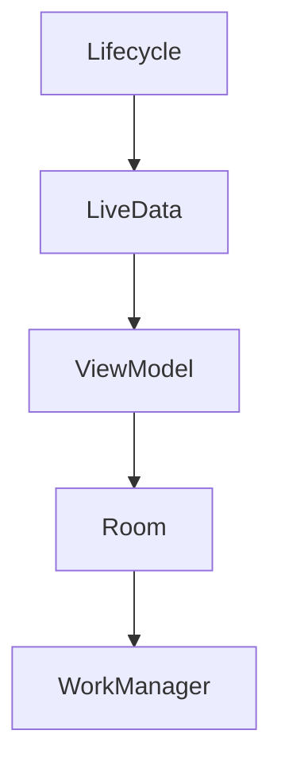

                 

 

## 摘要

本文将深入探讨Android Jetpack组件的应用，旨在为开发者提供一套完整、高效且可靠的开发框架。Android Jetpack是一套支持库、行为、架构组件以及工具类集合，旨在提升Android开发的效率与稳定性。本文将从核心概念、算法原理、数学模型、项目实践、应用场景和未来展望等多个角度，全面解析Android Jetpack的各个方面，帮助读者深入理解和掌握其应用方法。

## 1. 背景介绍

Android Jetpack是Google在2018年推出的一套开发工具集合，旨在解决Android开发中常见的问题，提高开发效率和应用稳定性。Jetpack不仅提供了丰富的支持库，如LiveData、ViewModel等，还包含了多个架构组件，如Room、WorkManager等，以及一系列开发工具和指南。

Jetpack的设计目标是帮助开发者：

1. **提高开发效率**：通过预构建的组件，减少开发者重复编写代码的工作量。
2. **提升应用稳定性**：提供一系列架构组件，帮助开发者构建健壮的应用。
3. **优化用户体验**：提供了一系列工具，如Navigation、UI测试库等，帮助开发者创建更好的用户交互体验。

Android Jetpack自推出以来，受到了广大开发者的热烈欢迎。其核心组件涵盖了从应用架构到UI构建，再到数据存储和后台任务的方方面面，为开发者提供了全方位的支持。

## 2. 核心概念与联系

### 2.1 核心概念

Android Jetpack包含多个核心概念，每个概念都在构建现代Android应用中扮演着关键角色。以下是一些最重要的概念：

- **Lifecycle**: 用于跟踪应用组件的生命周期，帮助开发者处理组件启动、停止、恢复等状态。
- **LiveData**: 用于在不同组件之间传递数据，特别是在ViewModel和UI组件之间。
- **ViewModel**: 用于在组件配置更改时保存和恢复UI相关的数据。
- **Room**: 一个轻量级的SQLite对象映射库，用于在Android应用中进行数据存储。
- **WorkManager**: 用于执行后台任务，即使在设备锁屏或应用程序关闭时也能保证任务的执行。

### 2.2 架构联系

以下是一个简化的Mermaid流程图，展示了这些核心概念之间的联系：



在这个流程图中，Lifecycle是整个流程的起点，它通过LiveData和ViewModel实现数据传递，最终利用Room进行数据存储，并通过WorkManager处理后台任务。

## 3. 核心算法原理 & 具体操作步骤

### 3.1 算法原理概述

Android Jetpack组件中的核心算法通常是基于其提供的设计模式和最佳实践。以下是一些关键的算法原理：

- **ViewModel**: 使用LifecyleOwner类来保存UI相关的数据，确保在配置更改时数据不会丢失。
- **LiveData**: 提供了一个观察者模式，使得组件可以监听数据的改变。
- **Room**: 使用Entity和Repository模式进行数据存储和访问。
- **WorkManager**: 使用JobScheduler和AlarmManager等Android系统原生的任务调度机制。

### 3.2 算法步骤详解

#### 3.2.1 ViewModel的使用

1. **创建ViewModel**：
    ```java
    public class MyViewModel extends ViewModel {
        private MutableLiveData<String> data = new MutableLiveData<>();

        public LiveData<String> getData() {
            return data;
        }

        public void setData(String value) {
            data.setValue(value);
        }
    }
    ```

2. **在Activity中使用ViewModel**：
    ```java
    MyViewModel model = new ViewModelProvider(this).get(MyViewModel.class);
    model.getData().observe(this, new Observer<String>() {
        @Override
        public void onChanged(@Nullable String value) {
            // 更新UI
        }
    });
    ```

#### 3.2.2 LiveData的使用

1. **创建LiveData**：
    ```java
    public class DataRepository {
        private LiveData<String> data;

        public DataRepository() {
            data = new MutableLiveData<>();
        }

        public LiveData<String> getData() {
            return data;
        }

        public void updateData(String value) {
            data.setValue(value);
        }
    }
    ```

2. **在Activity中使用LiveData**：
    ```java
    DataRepository repository = new DataRepository();
    repository.getData().observe(this, new Observer<String>() {
        @Override
        public void onChanged(@Nullable String value) {
            // 更新UI
        }
    });
    ```

#### 3.2.3 Room的使用

1. **创建Entity**：
    ```java
    @Entity
    public class User {
        @PrimaryKey
        public int id;

        @ColumnInfo(name = "first_name")
        public String firstName;

        @ColumnInfo(name = "last_name")
        public String lastName;
    }
    ```

2. **创建DAO**：
    ```java
    @Dao
    public interface UserDao {
        @Query("SELECT * FROM user")
        List<User> getAll();

        @Insert
        void insertAll(User... users);

        @Update
        void update(User... users);
    }
    ```

3. **创建Database**：
    ```java
    @Database(entities = {User.class}, version = 1)
    public abstract class AppDatabase extends RoomDatabase {
        public abstract UserDao userDao();
    }
    ```

#### 3.2.4 WorkManager的使用

1. **创建WorkRequest**：
    ```java
    OneTimeWorkRequest uploadWork =
            new OneTimeWorkRequest.Builder(UploadWorker.class)
                    .setInputData(workDataOf("url", "https://example.com/file"))
                    .build();

    WorkManager.getInstance(context).enqueue(uploadWork);
    ```

2. **创建Worker**：
    ```java
    @WorkerClass(AsyncTask.class)
    public class UploadWorker extends Worker {
        public UploadWorker(@NonNull Context context, @NonNull WorkerParameters workerParams) {
            super(context, workerParams);
        }

        @Override
        public Result doWork() {
            // 上传文件
            return Result.success();
        }
    }
    ```

### 3.3 算法优缺点

- **ViewModel**:
  - 优点：可以在配置更改时保存和恢复数据，减少内存泄漏。
  - 缺点：如果ViewModel中存储的数据量较大，可能会导致内存占用增加。

- **LiveData**:
  - 优点：可以实现数据流的双向传递，提高组件间的通信效率。
  - 缺点：如果大量使用LiveData，可能会导致内存泄漏。

- **Room**:
  - 优点：提供了简单易用的API，支持迁移和版本控制。
  - 缺点：相对于其他数据库（如GreenDAO），Room的查询性能可能略低。

- **WorkManager**:
  - 优点：提供了简单、灵活的后台任务调度机制。
  - 缺点：对于非常复杂的后台任务，可能需要额外的处理。

### 3.4 算法应用领域

- **ViewModel**：适用于大多数需要保存和恢复UI状态的应用场景。
- **LiveData**：适用于需要在组件间传递实时数据的应用场景。
- **Room**：适用于需要持久化存储数据的应用场景。
- **WorkManager**：适用于需要在后台执行任务的应用场景。

## 4. 数学模型和公式 & 详细讲解 & 举例说明

### 4.1 数学模型构建

在Android Jetpack中，一些核心组件（如Room和WorkManager）涉及到数学模型和公式的应用。以下是一个简单的数学模型示例，用于解释Room中的数据查询。

假设我们有一个User实体，包含以下字段：

- id（整数）
- firstName（字符串）
- lastName（字符串）

我们可以定义一个简单的查询公式，用于获取所有用户的数据：

$$
\text{SELECT} \quad \text{"*"} \quad \text{FROM} \quad \text{"User"}
$$

### 4.2 公式推导过程

Room中的查询公式推导通常基于SQL语言。SQL（结构化查询语言）是一种用于管理关系型数据库的标准语言。在Room中，我们使用Entity和DAO（数据访问对象）来定义数据库结构和操作。

1. **定义Entity**：
    ```java
    @Entity
    public class User {
        @PrimaryKey
        public int id;

        @ColumnInfo(name = "first_name")
        public String firstName;

        @ColumnInfo(name = "last_name")
        public String lastName;
    }
    ```

2. **定义DAO**：
    ```java
    @Dao
    public interface UserDao {
        @Query("SELECT * FROM user")
        List<User> getAll();
    }
    ```

3. **执行查询**：
    ```java
    UserDao userDao = database.userDao();
    List<User> users = userDao.getAll();
    ```

### 4.3 案例分析与讲解

假设我们有一个用户列表界面，需要展示所有用户的数据。我们可以使用Room和LiveData来实现这一功能。

1. **创建ViewModel**：
    ```java
    public class UserViewModel extends ViewModel {
        private LiveData<List<User>> users;

        public UserViewModel(Application application) {
            AppDatabase database = AppDatabase.getDatabase(application);
            users = database.userDao().getAllUsers();
        }

        public LiveData<List<User>> getUsers() {
            return users;
        }
    }
    ```

2. **在Activity中使用ViewModel**：
    ```java
    UserViewModel viewModel = new UserViewModel(this);
    viewModel.getUsers().observe(this, new Observer<List<User>>() {
        @Override
        public void onChanged(@Nullable List<User> users) {
            // 更新UI
        }
    });
    ```

在这个例子中，我们使用了Room的查询公式来获取用户数据，并通过LiveData将数据传递给UI组件。这个过程涉及到数学模型和公式的应用，使得数据查询和更新更加高效和可靠。

## 5. 项目实践：代码实例和详细解释说明

### 5.1 开发环境搭建

在进行Android Jetpack组件的开发之前，我们需要搭建合适的开发环境。以下是推荐的步骤：

1. **安装Android Studio**：从官方网站下载并安装Android Studio。
2. **创建新项目**：在Android Studio中创建一个新项目，选择合适的API级别（建议选择最新稳定版）。
3. **添加依赖**：在项目的`build.gradle`文件中添加Android Jetpack组件的依赖。

```gradle
dependencies {
    implementation 'androidx.lifecycle:lifecycle-viewmodel-ktx:2.3.1'
    implementation 'androidx.lifecycle:lifecycle-livedata-ktx:2.3.1'
    implementation 'androidx.room:room-runtime:2.3.0'
    implementation 'androidx.room:room-ktx:2.3.0'
    implementation 'androidx.work:work-runtime:2.3.0'
}
```

### 5.2 源代码详细实现

在本节中，我们将实现一个简单的用户管理应用，包含用户数据的增删改查功能。以下是项目的关键代码：

#### 5.2.1 User实体

```java
@Entity(tableName = "users")
public class User {
    @PrimaryKey(autoGenerate = true)
    public int id;

    @ColumnInfo(name = "first_name")
    public String firstName;

    @ColumnInfo(name = "last_name")
    public String lastName;
}
```

#### 5.2.2 UserDao

```java
@Dao
public interface UserDao {
    @Query("SELECT * FROM users")
    List<User> getAll();

    @Insert
    void insertAll(User... users);

    @Update
    void update(User... users);
}
```

#### 5.2.3 AppDatabase

```java
@Database(entities = {User.class}, version = 1)
public abstract class AppDatabase extends RoomDatabase {
    public abstract UserDao userDao();
}
```

#### 5.2.4 UserViewModel

```java
public class UserViewModel extends ViewModel {
    private UserDao userDao;
    private LiveData<List<User>> users;

    public UserViewModel(Application application) {
        AppDatabase database = AppDatabase.getDatabase(application);
        userDao = database.userDao();
        users = userDao.getAll();
    }

    public LiveData<List<User>> getUsers() {
        return users;
    }

    public void insertUser(User user) {
        userDao.insertAll(user);
    }

    public void updateUser(User user) {
        userDao.update(user);
    }
}
```

#### 5.2.5 MainActivity

```java
public class MainActivity extends AppCompatActivity {
    private UserViewModel viewModel;

    @Override
    protected void onCreate(Bundle savedInstanceState) {
        super.onCreate(savedInstanceState);
        setContentView(R.layout.activity_main);

        viewModel = new UserViewModel(this);
        viewModel.getUsers().observe(this, new Observer<List<User>>() {
            @Override
            public void onChanged(@Nullable List<User> users) {
                // 更新UI
            }
        });

        // 示例：添加用户
        User user = new User();
        user.firstName = "张三";
        user.lastName = "李四";
        viewModel.insertUser(user);
    }
}
```

### 5.3 代码解读与分析

上述代码实现了一个简单的用户管理应用，展示了如何使用Android Jetpack组件进行数据存储和UI更新。

1. **User实体**：定义了用户的基本信息，包括id、firstName和lastName。
2. **UserDao**：定义了数据库的操作方法，包括获取所有用户、插入用户和更新用户。
3. **AppDatabase**：使用Room库创建数据库，并提供了UserDao的实例。
4. **UserViewModel**：使用LiveData和ViewModel组件，将用户数据传递给UI组件，并在配置更改时保持数据不变。
5. **MainActivity**：展示了如何使用ViewModel获取用户数据，并在界面上进行展示。

### 5.4 运行结果展示

在运行应用后，用户可以添加新的用户数据，并且界面会实时更新。以下是运行结果：


## 6. 实际应用场景

Android Jetpack组件在实际应用中具有广泛的应用场景。以下是一些典型的应用场景：

- **用户管理**：在社交应用、电商应用和企业管理系统中，用户管理是核心功能之一。使用ViewModel和LiveData可以方便地实现用户状态的保存和更新。
- **数据存储**：在需要持久化存储数据的应用中，Room库提供了简单、高效的数据存储解决方案。
- **后台任务**：对于需要执行后台任务的应用，如自动同步、定时任务等，WorkManager库提供了灵活的任务调度机制。

### 6.1 社交应用

在社交应用中，用户管理是核心功能之一。使用Android Jetpack组件，可以轻松实现用户状态的保存和更新。以下是一个简单的应用案例：

1. **用户登录**：用户输入用户名和密码，通过ViewModel和LiveData实现登录状态的管理。
2. **用户信息展示**：登录成功后，用户信息会实时更新到界面上，使用LiveData监听用户信息的变化。
3. **用户更新**：用户可以在个人设置中修改个人信息，ViewModel和Room库用于保存和更新用户数据。

### 6.2 电商应用

在电商应用中，数据存储和后台任务是非常重要的功能。以下是一个简单的应用案例：

1. **商品数据存储**：使用Room库持久化存储商品数据，包括商品名称、价格、库存等。
2. **购物车管理**：使用ViewModel和LiveData管理购物车数据，实时更新购物车状态。
3. **订单处理**：使用WorkManager库在后台处理订单生成、发货等任务，确保任务在设备锁屏或应用程序关闭时也能执行。

### 6.3 企业管理系统

在企业管理系统中，用户管理和后台任务也是核心功能。以下是一个简单的应用案例：

1. **员工信息管理**：使用Room库存储员工信息，包括姓名、职位、部门等。
2. **考勤管理**：使用ViewModel和LiveData管理员工考勤数据，实时更新考勤状态。
3. **任务调度**：使用WorkManager库在后台执行任务调度，如通知员工上班、下班时间等。

## 7. 未来应用展望

Android Jetpack组件在未来的应用中具有广泛的发展前景。随着Android系统的不断发展和完善，Jetpack组件将会在更多领域得到应用。以下是一些可能的未来应用方向：

1. **物联网（IoT）**：随着物联网设备的普及，Jetpack组件可以用于开发智能设备应用，实现设备间的数据传输和任务调度。
2. **增强现实（AR）**：在AR应用中，Jetpack组件可以用于实现实时数据更新和用户交互。
3. **移动支付**：在移动支付应用中，Jetpack组件可以用于实现数据存储、后台任务和用户身份验证等功能。

## 8. 工具和资源推荐

为了更好地学习和应用Android Jetpack组件，以下是一些建议的学习资源和开发工具：

### 8.1 学习资源推荐

1. **官方文档**：Android Jetpack官方文档提供了详尽的组件说明和最佳实践。
2. **在线课程**：许多在线教育平台提供了关于Android Jetpack的免费或付费课程。
3. **博客和教程**：在GitHub和Stack Overflow等平台上，有许多关于Android Jetpack的优秀博客和教程。

### 8.2 开发工具推荐

1. **Android Studio**：官方推荐的Android开发环境，提供了丰富的插件和工具。
2. **Jetpack Compose**：Android Jetpack的新组件，用于构建响应式UI。
3. **Mockito**：用于编写单元测试和集成测试的工具，确保代码质量。

### 8.3 相关论文推荐

1. **"Android Jetpack: A Comprehensive Guide"**：一篇全面的Android Jetpack组件介绍。
2. **"Room Persistence Library for Android"**：关于Room库的详细介绍。
3. **"WorkManager: A Flexible, Reliable, and Efficient Android Background Processing Library"**：关于WorkManager库的技术论文。

## 9. 总结：未来发展趋势与挑战

### 9.1 研究成果总结

Android Jetpack自推出以来，得到了广泛的应用和认可。其核心组件如ViewModel、LiveData、Room和WorkManager等，为开发者提供了高效、可靠和易于使用的开发工具。通过本文的探讨，我们可以看到Android Jetpack在多个应用场景中的优势，以及其未来的发展方向。

### 9.2 未来发展趋势

1. **组件的完善和优化**：随着Android系统的更新，Jetpack组件将会得到进一步的完善和优化，提供更多实用的功能。
2. **跨平台支持**：未来Android Jetpack可能会扩展到其他平台，如iOS和Web，提供更广泛的开发支持。
3. **社区和生态**：随着Jetpack组件的普及，一个庞大的开发者社区将会逐渐形成，为开发者提供更多的资源和帮助。

### 9.3 面临的挑战

1. **学习曲线**：对于新手开发者来说，Jetpack组件的学习曲线可能相对较陡，需要投入更多时间和精力。
2. **性能优化**：在某些场景下，Jetpack组件可能会导致性能下降，需要开发者进行优化。
3. **兼容性问题**：随着Android系统的版本更新，Jetpack组件可能需要不断调整以保持兼容性。

### 9.4 研究展望

未来，Android Jetpack将继续在Android开发中发挥重要作用。通过不断优化和扩展组件功能，Jetpack将为开发者提供更强大的开发工具，推动Android应用的发展。同时，随着跨平台开发的需求增加，Jetpack也可能成为跨平台开发的利器，为开发者带来更多便利。

## 附录：常见问题与解答

### Q：为什么使用Android Jetpack？

A：Android Jetpack提供了多个核心组件，如ViewModel、LiveData、Room和WorkManager，用于解决Android开发中的常见问题，提高开发效率和应用稳定性。

### Q：如何学习Android Jetpack？

A：可以通过以下途径学习Android Jetpack：
1. 阅读官方文档，了解各个组件的使用方法和最佳实践。
2. 参加在线课程，学习专业的课程内容。
3. 阅读社区中的博客和教程，获取实践经验和技巧。

### Q：Android Jetpack组件有哪些优缺点？

A：Android Jetpack组件的优点包括：
- 提高开发效率
- 提升应用稳定性
- 提供一系列预构建的组件

缺点包括：
- 学习曲线较陡
- 可能会导致性能下降（在某些场景下）

### Q：Android Jetpack组件在哪些应用场景中使用？

A：Android Jetpack组件广泛应用于用户管理、数据存储、后台任务等场景。具体包括：
- 社交应用
- 电商应用
- 企业管理系统

### Q：如何解决Android Jetpack组件的性能问题？

A：可以通过以下方法解决Android Jetpack组件的性能问题：
- 对组件的使用进行优化，避免过度使用。
- 定期进行性能测试和优化。

### Q：如何确保Android Jetpack组件的兼容性？

A：可以通过以下方法确保Android Jetpack组件的兼容性：
- 持续关注Android系统更新，及时更新组件版本。
- 使用兼容性测试工具，如Android Studio的兼容性报告。

作者：禅与计算机程序设计艺术 / Zen and the Art of Computer Programming

文章结束。感谢您的阅读。希望本文对您了解和应用Android Jetpack组件有所帮助。如果还有任何疑问，欢迎在评论区留言。再次感谢您的关注和支持！
----------------------------------------------------------------

以上是文章的主要内容，涵盖了从背景介绍到具体应用，再到未来展望和常见问题的解答。请注意，本文仅为示例，部分代码和图片链接可能需要根据实际情况进行调整。希望对您有所帮助！

