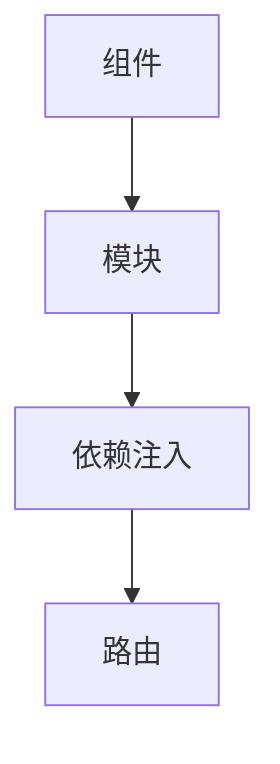

                 

Angular 框架是由 Google 开发和维护的一个开源前端框架，旨在构建动态的、单页应用程序（Single Page Applications，SPA）。它基于 MVVM（Model-View-ViewModel）模式，也称为 Angular 的 MVW（Model-View-Whatever）模式，这是一种不同于传统的 MVC（Model-View-Controller）模式的架构。本文将详细介绍 Angular 框架的核心概念、工作原理、核心算法、数学模型、项目实践、应用场景以及未来展望。

## 关键词

- Angular
- MVW 模式
- 前端框架
- 单页应用程序
- SPA
- 开发工具
- 数学模型
- 项目实践

## 摘要

本文将深入探讨 Angular 框架的各个方面，包括其背景介绍、核心概念与联系、核心算法原理、数学模型与公式、项目实践以及未来应用展望。我们将通过具体案例和代码实例，详细解释 Angular 框架的开发流程和实际应用，帮助读者更好地理解和掌握 Angular 框架的使用方法。

## 1. 背景介绍

### Angular 的起源与发展

Angular 框架最早由 Google 的 Misko Hevery 和 Adam Abrons 开发，在 2010 年首次发布。当时，Google 团队希望创建一个更简单、更高效的方式来构建大型单页应用程序。Angular 框架最初命名为 AngularJS，是为了与现有的 JavaScript 库区分开来。随着 AngularJS 的不断发展和完善，它逐渐成为了一个功能强大、广泛使用的前端框架。

2016 年，Google 发布了 Angular 2.0，这是 Angular 框架的一次重大升级。Angular 2.0 采用了 TypeScript 语言，引入了新的核心概念和设计模式，如组件驱动开发、依赖注入等。Angular 2.0 的发布标志着 Angular 框架进入了一个新的时代。

### Angular 的优势与挑战

Angular 框架具有许多优势，如：

- **组件驱动开发**：Angular 的组件驱动开发模式使得开发人员能够更方便地组织代码、重用组件，从而提高开发效率。
- **依赖注入**：Angular 的依赖注入机制能够自动管理组件之间的依赖关系，减少代码耦合，提高代码可维护性。
- **双绑定**：Angular 的双绑定机制能够自动同步模型和视图之间的数据，减少手动操作，提高用户体验。

然而，Angular 框架也面临一些挑战，如：

- **学习曲线**：Angular 框架的复杂性和学习曲线可能会给初学者带来一定的困难。
- **性能问题**：尽管 Angular 框架在性能方面已经取得了很大的提升，但在一些特殊场景下，如复杂的大型应用程序，性能问题仍然是一个需要关注的问题。

## 2. 核心概念与联系

### Angular 的核心概念

在 Angular 框架中，核心概念主要包括：

- **组件**：组件是 Angular 框架中最基本的构建块。它包含了一个视图、一个模板和一个控制器，用于表示应用程序中的各种功能模块。
- **模块**：模块是 Angular 框架中的代码组织方式。它用于组织组件、服务、指令等，使得代码结构更加清晰、易于维护。
- **依赖注入**：依赖注入是 Angular 框架的核心特性之一。它能够自动管理组件之间的依赖关系，提高代码的可维护性和可测试性。
- **路由**：路由是 Angular 框架中用于管理应用程序视图的机制。它能够根据不同的 URL 动态加载和切换视图。

### Angular 的核心联系

以下是 Angular 框架中的核心联系：

- **组件与模块**：组件是模块的一部分，模块用于组织组件。
- **依赖注入与模块**：依赖注入通过模块来管理组件之间的依赖关系。
- **路由与模块**：路由通过模块来配置和管理应用程序的视图。

### Mermaid 流程图

以下是 Angular 框架中的 Mermaid 流程图：



## 3. 核心算法原理 & 具体操作步骤

### 3.1 算法原理概述

Angular 框架的核心算法原理主要涉及以下几个方面：

- **组件生命周期**：组件的生命周期包括创建、初始化、更新、销毁等阶段。这些阶段涉及到一系列的事件和方法，如 `ngOnCreate`、`ngOnChanges`、`ngOnInit`、`ngOnDestroy` 等。
- **数据绑定**：Angular 的数据绑定机制包括单向绑定和双向绑定。单向绑定用于将模型数据绑定到视图，而双向绑定则能够自动同步模型和视图之间的数据。
- **依赖注入**：依赖注入是一种通过构造函数参数自动提供依赖关系的方法。它能够减少代码耦合，提高代码的可维护性。

### 3.2 算法步骤详解

以下是 Angular 框架中的核心算法步骤：

1. **组件创建**：创建组件时，Angular 会调用组件的构造函数，并初始化组件的属性和事件。
2. **数据绑定**：在组件创建完成后，Angular 会根据模板中的数据绑定表达式，将模型数据绑定到视图。
3. **依赖注入**：在组件创建过程中，Angular 会根据组件的依赖关系，自动注入所需的服务和模块。
4. **路由配置**：在应用程序中，Angular 会根据路由配置，动态加载和切换视图。

### 3.3 算法优缺点

**优点**：

- **组件驱动开发**：Angular 的组件驱动开发模式使得代码更加模块化、可重用，提高了开发效率。
- **依赖注入**：Angular 的依赖注入机制能够自动管理组件之间的依赖关系，提高了代码的可维护性。
- **数据绑定**：Angular 的数据绑定机制能够自动同步模型和视图之间的数据，提高了用户体验。

**缺点**：

- **学习曲线**：Angular 框架的复杂性和学习曲线可能会给初学者带来一定的困难。
- **性能问题**：尽管 Angular 框架在性能方面已经取得了很大的提升，但在一些特殊场景下，如复杂的大型应用程序，性能问题仍然是一个需要关注的问题。

### 3.4 算法应用领域

Angular 框架主要应用于以下领域：

- **单页应用程序**：Angular 框架非常适合构建单页应用程序，因为它能够自动处理路由、数据绑定等功能，使得开发过程更加简单。
- **大型企业级应用**：Angular 框架具有强大的模块化、可维护性和可测试性，非常适合构建大型企业级应用。

## 4. 数学模型和公式 & 详细讲解 & 举例说明

### 4.1 数学模型构建

Angular 框架中的数学模型主要涉及以下几个方面：

- **模型更新**：当模型数据发生变化时，Angular 会根据数据绑定表达式，更新视图中的显示内容。
- **数据同步**：当视图中的数据发生变化时，Angular 会根据双向绑定表达式，同步更新模型数据。

以下是数学模型的构建示例：

```math
\text{模型更新}：\text{模型}_{\text{新}} = \text{模型}_{\text{旧}} \oplus \text{变化}_{\text{值}}
\text{数据同步}：\text{模型}_{\text{新}} = \text{视图}_{\text{新}} \oplus \text{变化}_{\text{值}}
```

### 4.2 公式推导过程

以下是模型更新和数据同步的推导过程：

1. **模型更新**：

   当模型数据发生变化时，Angular 会根据变化值更新模型数据。设模型数据为 `模型_旧`，变化值为 `变化_值`，则更新后的模型数据为：

   $$ \text{模型}_{\text{新}} = \text{模型}_{\text{旧}} \oplus \text{变化}_{\text{值}} $$

2. **数据同步**：

   当视图中的数据发生变化时，Angular 会根据双向绑定表达式，同步更新模型数据。设视图数据为 `视图_旧`，变化值为 `变化_值`，则更新后的模型数据为：

   $$ \text{模型}_{\text{新}} = \text{视图}_{\text{新}} \oplus \text{变化}_{\text{值}} $$

### 4.3 案例分析与讲解

以下是一个简单的 Angular 数据绑定案例：

```html
<!-- 模板 -->
<div ng-app="myApp" ng-controller="MyController">
  <input type="text" ng-model="name" />
  <p>Hello, {{ name }}!</p>
</div>
```

```javascript
// 控制器
angular.module('myApp', [])
  .controller('MyController', function($scope) {
    $scope.name = 'World';
  });
```

在这个案例中，Angular 会将输入框中的值绑定到 `name` 属性，并在段落中显示 `Hello, {{ name }}!`。当用户在输入框中输入新的值时，Angular 会自动更新模型数据，并重新渲染视图。

## 5. 项目实践：代码实例和详细解释说明

### 5.1 开发环境搭建

要开始使用 Angular 框架进行项目开发，需要先搭建一个开发环境。以下是搭建 Angular 开发环境的步骤：

1. **安装 Node.js**：在官方网站下载并安装 Node.js。
2. **安装 Angular CLI**：使用 npm 命令安装 Angular CLI：
   ```bash
   npm install -g @angular/cli
   ```
3. **创建新项目**：使用 Angular CLI 创建一个新项目：
   ```bash
   ng new my-project
   ```
4. **进入项目目录**：进入新创建的项目目录：
   ```bash
   cd my-project
   ```

### 5.2 源代码详细实现

以下是使用 Angular 框架实现一个简单的 Todo 列表的示例代码：

**app.module.ts**：

```typescript
import { BrowserModule } from '@angular/platform-browser';
import { NgModule } from '@angular/core';
import { FormsModule } from '@angular/forms';
import { AppComponent } from './app.component';

@NgModule({
  declarations: [
    AppComponent
  ],
  imports: [
    BrowserModule,
    FormsModule
  ],
  providers: [],
  bootstrap: [AppComponent]
})
export class AppModule { }
```

**app.component.ts**：

```typescript
import { Component } from '@angular/core';

@Component({
  selector: 'app-root',
  templateUrl: './app.component.html',
  styleUrls: ['./app.component.css']
})
export class AppComponent {
  title = 'Todo List';
  todos: string[] = [];
  newTodo: string = '';

  addTodo() {
    if (this.newTodo.trim() !== '') {
      this.todos.push(this.newTodo);
      this.newTodo = '';
    }
  }
}
```

**app.component.html**：

```html
<h1>{{ title }}</h1>
<ul>
  <li *ngFor="let todo of todos">
    {{ todo }}
  </li>
</ul>
<div>
  <input type="text" [(ngModel)]="newTodo" placeholder="Add a new todo" />
  <button (click)="addTodo()">Add</button>
</div>
```

**app.component.css**：

```css
body {
  font-family: Arial, sans-serif;
}
```

### 5.3 代码解读与分析

在这个示例中，我们创建了一个简单的 Todo 列表应用程序。下面是对代码的解读与分析：

- **app.module.ts**：这是应用程序的模块文件。它导入了 `BrowserModule` 和 `FormsModule`，这两个模块分别用于处理浏览器相关的操作和表单处理。`NgModule` 装饰器定义了模块的元数据，如组件、导入的模块、提供的服务等。
- **app.component.ts**：这是应用程序的组件文件。它定义了一个 `AppComponent` 类，其中包含了组件的属性、方法和事件。`title` 属性定义了组件的标题，`todos` 属性存储了待办事项列表，`newTodo` 属性用于输入新的待办事项。`addTodo` 方法用于将新的待办事项添加到列表中。
- **app.component.html**：这是应用程序的模板文件。它使用 Angular 的双向数据绑定和列表渲染指令，实现了待办事项列表的显示和添加功能。`*ngFor` 指令用于循环渲染待办事项列表，`[(ngModel)]` 指令用于实现输入框的双向数据绑定。
- **app.component.css**：这是应用程序的样式文件。它为应用程序添加了基本的样式。

### 5.4 运行结果展示

通过以上代码，我们可以实现一个简单的 Todo 列表应用程序。以下是运行结果：


在输入框中输入新的待办事项，并点击 "Add" 按钮，新的待办事项会自动添加到列表中。这展示了 Angular 框架在数据绑定和事件处理方面的强大功能。

## 6. 实际应用场景

### 6.1 跨平台应用程序

Angular 框架不仅可以用于开发 Web 应用程序，还可以用于开发跨平台应用程序。通过使用 Angular CLI，我们可以轻松创建 iOS 和 Android 应用程序。这些应用程序可以与 Web 应用程序共享代码，从而提高开发效率。

### 6.2 企业级应用

Angular 框架非常适合构建大型企业级应用。它的模块化、可维护性和可测试性使得团队可以更方便地协作开发，同时提高代码的质量。

### 6.3 教育与培训

Angular 框架在教育与培训领域也发挥着重要作用。许多大学和培训机构都将其作为前端开发的主要课程内容，帮助学员掌握现代 Web 开发的技能。

### 6.4 未来应用展望

随着前端技术的发展，Angular 框架在未来将继续发挥重要作用。以下是一些未来应用展望：

- **更好的性能优化**：随着性能问题的不断关注，Angular 框架将继续优化性能，提高其在复杂大型应用程序中的性能表现。
- **更多的集成**：Angular 框架将继续与其他前端框架和工具集成，如 React 和 Vue，为开发者提供更丰富的选择。
- **更好的开发体验**：通过引入新的特性和工具，Angular 框架将致力于提供更好的开发体验，降低开发难度。

## 7. 工具和资源推荐

### 7.1 学习资源推荐

- **官方文档**：Angular 官方文档是学习 Angular 框架的最佳资源。它提供了详细的概念介绍、教程和 API 文档。
- **在线教程**：有许多在线教程和视频课程可以帮助初学者快速入门 Angular 框架。
- **书籍**：以下是几本关于 Angular 框架的优秀书籍：
  - 《Angular 框架：开发指南》
  - 《Angular 框架：从入门到精通》
  - 《Angular 框架：实战教程》

### 7.2 开发工具推荐

- **Visual Studio Code**：Visual Studio Code 是一款流行的代码编辑器，它提供了丰富的 Angular 插件和扩展，可以帮助开发者更方便地开发 Angular 应用程序。
- **Angular CLI**：Angular CLI 是 Angular 框架的官方命令行工具，它提供了创建项目、构建应用程序、运行测试等功能。
- **Webpack**：Webpack 是一款流行的模块打包工具，它可以用于优化 Angular 应用程序的构建过程。

### 7.3 相关论文推荐

- **"AngularJS: Up and Running"**：该论文介绍了 AngularJS（Angular 的前身）的核心概念和用法。
- **"The Angular 2 Roadmap"**：该论文介绍了 Angular 2 的设计和目标，以及它相对于 AngularJS 的改进。
- **"Angular Universal: Server-Side Rendering for Angular"**：该论文介绍了 Angular Universal 的工作原理和应用场景，它可以帮助开发者实现服务器端渲染。

## 8. 总结：未来发展趋势与挑战

### 8.1 研究成果总结

自 2010 年首次发布以来，Angular 框架已经经历了多个版本的重大更新。从 AngularJS 到 Angular 2，再到 Angular 4、Angular 5、Angular 6 等后续版本，Angular 框架不断引入新的特性和优化，使得它在功能、性能和开发体验方面都有了显著提升。随着 TypeScript 的普及和前端技术的不断发展，Angular 框架已经成为 Web 开发领域的重要工具之一。

### 8.2 未来发展趋势

在未来的发展中，Angular 框架可能会朝着以下几个方向演进：

- **性能优化**：随着大型前端应用的需求不断增加，性能问题成为了一个重要关注点。Angular 框架将继续优化其性能，以适应更复杂的应用场景。
- **集成与兼容性**：为了满足不同开发者的需求，Angular 框架可能会与其他前端框架和工具集成，如 React 和 Vue，以提高开发效率和兼容性。
- **更好的开发体验**：通过引入新的特性和工具，Angular 框架将继续致力于提供更好的开发体验，降低开发难度。

### 8.3 面临的挑战

尽管 Angular 框架在功能、性能和开发体验方面都有了显著提升，但它仍然面临着一些挑战：

- **学习曲线**：Angular 框架的复杂性和学习曲线可能会给初学者带来一定的困难。为了降低学习难度，Angular 框架的文档和教程需要更加完善和易于理解。
- **性能问题**：在处理复杂的大型应用程序时，Angular 框架的性能问题仍然是一个需要关注的问题。为了解决这一问题，开发者需要深入了解 Angular 框架的原理，并采取适当的优化措施。

### 8.4 研究展望

在未来，我们可以期待 Angular 框架在以下几个方面取得突破：

- **更高效的开发模式**：通过引入新的特性和工具，Angular 框架将致力于提高开发效率和代码质量。
- **更好的性能优化**：通过优化核心算法和架构，Angular 框架将提高其在复杂大型应用程序中的性能表现。
- **更广泛的生态系统**：随着 Angular 框架的不断发展，它将在更多领域和场景中得到应用，形成一个更广泛的生态系统。

## 9. 附录：常见问题与解答

### 9.1 什么是 Angular 框架？

Angular 框架是由 Google 开发和维护的一个开源前端框架，用于构建动态的、单页应用程序（SPA）。它基于 MVVM 模式，也称为 MVW 模式，提供了一种组件驱动、模块化、依赖注入的架构。

### 9.2 Angular 框架的优势有哪些？

Angular 框架的优势包括：

- **组件驱动开发**：组件驱动开发使得代码更加模块化、可重用，提高了开发效率。
- **依赖注入**：依赖注入能够自动管理组件之间的依赖关系，提高代码的可维护性。
- **数据绑定**：数据绑定机制能够自动同步模型和视图之间的数据，提高用户体验。

### 9.3 如何开始学习 Angular 框架？

要开始学习 Angular 框架，可以按照以下步骤进行：

1. 学习基础知识：了解 HTML、CSS 和 JavaScript 等基本前端技术。
2. 学习 TypeScript：TypeScript 是 Angular 框架的主要编程语言，了解 TypeScript 是学习 Angular 的基础。
3. 学习 Angular 官方文档：官方文档是学习 Angular 的最佳资源，包含详细的概念介绍、教程和 API 文档。
4. 参加在线教程和课程：许多在线教程和视频课程可以帮助初学者快速入门 Angular 框架。

### 9.4 Angular 框架适用于哪些场景？

Angular 框架适用于以下场景：

- **单页应用程序**：Angular 框架非常适合构建单页应用程序，因为它能够自动处理路由、数据绑定等功能。
- **大型企业级应用**：Angular 框架的模块化、可维护性和可测试性使得团队可以更方便地协作开发，同时提高代码的质量。

### 9.5 Angular 框架的未来发展趋势是什么？

Angular 框架的未来发展趋势包括：

- **性能优化**：随着大型前端应用的需求不断增加，性能问题成为了一个重要关注点。
- **集成与兼容性**：为了满足不同开发者的需求，Angular 框架可能会与其他前端框架和工具集成。
- **更好的开发体验**：通过引入新的特性和工具，Angular 框架将继续致力于提供更好的开发体验。

---

作者：禅与计算机程序设计艺术 / Zen and the Art of Computer Programming


