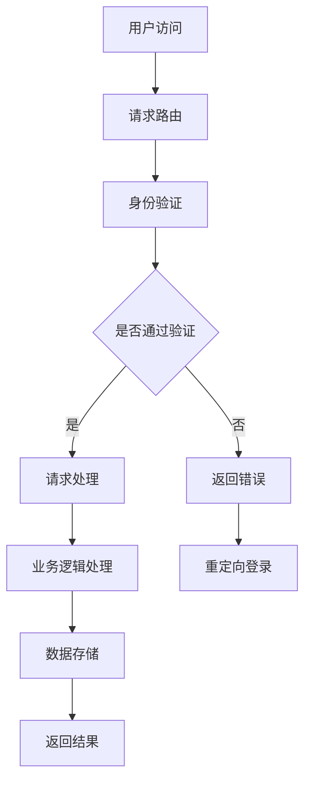

                 

关键词：App电商，业务系统，架构设计，微服务，数据存储，性能优化，安全性，用户体验

> 摘要：本文将深入探讨App电商业务系统的核心架构设计，从技术选型、系统架构、数据存储、性能优化、安全性、用户体验等多个方面进行详细分析，旨在为开发者提供一套完整的架构设计方案，帮助他们在实际项目中实现高效、可扩展、安全稳定的电商应用。

## 1. 背景介绍

随着移动互联网的快速发展，App电商已成为电商行业的重要增长点。相比传统的电商模式，App电商具有更好的用户体验和更便捷的购物流程，能够满足用户在移动端的各种需求。然而，随着业务量的不断增长，App电商业务系统面临着性能、可扩展性、安全性等多方面的挑战。因此，对App电商业务系统的核心架构进行精心设计显得尤为重要。

本文将针对App电商业务系统的核心架构设计进行深入探讨，包括系统架构、数据存储、性能优化、安全性、用户体验等方面的内容，旨在为开发者提供一套全面且实用的架构设计方案。

## 2. 核心概念与联系

在探讨App电商业务系统的核心架构设计之前，我们需要明确几个核心概念及其相互之间的关系。

### 2.1. 微服务架构

微服务架构是一种将大型应用程序分解为一系列小型、独立的服务的方法。这些服务各自负责不同的功能模块，并通过API进行通信。微服务架构具有高可扩展性、高可用性和易于维护等优点。

### 2.2. 数据存储

数据存储是App电商业务系统的核心组成部分，主要包括关系型数据库和NoSQL数据库。关系型数据库擅长处理结构化数据，而NoSQL数据库则适合处理大规模的非结构化数据。

### 2.3. 性能优化

性能优化是确保App电商业务系统高效运行的关键。常见的性能优化方法包括缓存、负载均衡、数据库优化等。

### 2.4. 安全性

安全性是电商业务系统必须考虑的重要因素。安全性设计包括身份验证、权限控制、数据加密等。

### 2.5. 用户体验

用户体验是影响App电商业务系统成败的关键因素。良好的用户体验可以提升用户满意度，从而提高用户留存率和转化率。

### 2.6. Mermaid流程图

下面是一个描述App电商业务系统核心概念的Mermaid流程图：



## 3. 核心算法原理 & 具体操作步骤

### 3.1. 算法原理概述

App电商业务系统中的核心算法主要包括以下几类：

- **身份验证算法**：用于验证用户的登录信息，确保用户身份的安全。
- **推荐算法**：根据用户的历史行为和偏好，为用户推荐合适的商品。
- **排序算法**：用于根据一定的规则对商品进行排序，提高用户体验。

### 3.2. 算法步骤详解

#### 3.2.1. 身份验证算法

身份验证算法的主要步骤如下：

1. 用户输入登录信息（用户名和密码）。
2. 将用户输入的密码与数据库中存储的密码进行比对。
3. 如果比对成功，则登录成功；否则，登录失败。

#### 3.2.2. 推荐算法

推荐算法的主要步骤如下：

1. 收集用户的历史行为数据，如浏览记录、购买记录等。
2. 对用户的历史行为数据进行分析，提取用户兴趣标签。
3. 根据用户兴趣标签和商品属性，为用户推荐合适的商品。

#### 3.2.3. 排序算法

排序算法的主要步骤如下：

1. 收集用户输入的排序规则，如价格、销量、评价等。
2. 根据排序规则对商品进行排序。
3. 将排序后的商品列表返回给用户。

### 3.3. 算法优缺点

#### 3.3.1. 身份验证算法

- 优点：简单易实现，安全性较高。
- 缺点：无法应对高级的攻击手段，如暴力破解。

#### 3.3.2. 推荐算法

- 优点：能够提高用户的购物体验，增加用户的粘性。
- 缺点：推荐结果可能存在偏差，需要不断优化。

#### 3.3.3. 排序算法

- 优点：简单易实现，能够满足基本的排序需求。
- 缺点：无法应对复杂的排序需求，如多条件排序。

### 3.4. 算法应用领域

身份验证算法、推荐算法和排序算法广泛应用于App电商业务系统中，用于提升用户体验、保障用户安全和优化业务流程。

## 4. 数学模型和公式 & 详细讲解 & 举例说明

### 4.1. 数学模型构建

在App电商业务系统中，我们可以使用以下数学模型来描述用户行为和商品推荐：

- **用户行为模型**：$$ 用户行为 = f(用户兴趣, 商品属性) $$
- **推荐模型**：$$ 推荐结果 = f(用户行为, 商品数据) $$

### 4.2. 公式推导过程

#### 4.2.1. 用户行为模型

用户行为模型可以通过以下公式进行推导：

$$ 用户行为 = \sum_{i=1}^{n} (权重_i \cdot 行为_i) $$

其中，权重_i 表示用户对行为_i 的重视程度，行为_i 表示用户的历史行为数据。

#### 4.2.2. 推荐模型

推荐模型可以通过以下公式进行推导：

$$ 推荐结果 = \sum_{i=1}^{m} (权重_i \cdot 推荐_i) $$

其中，权重_i 表示商品_i 的推荐权重，推荐_i 表示根据用户行为预测的商品_i 的推荐值。

### 4.3. 案例分析与讲解

假设有一个用户，他的浏览记录如下：

- 商品A：浏览了3次
- 商品B：浏览了1次
- 商品C：未浏览

根据用户行为模型，我们可以计算出用户的用户行为分数：

$$ 用户行为分数 = 权重_A \cdot 行为_A + 权重_B \cdot 行为_B + 权重_C \cdot 行为_C $$

假设权重分别为 0.6、0.3 和 0.1，则：

$$ 用户行为分数 = 0.6 \cdot 3 + 0.3 \cdot 1 + 0.1 \cdot 0 = 1.8 + 0.3 + 0 = 2.1 $$

接下来，根据推荐模型，我们可以为用户推荐商品：

- 商品D：推荐分数为 0.5
- 商品E：推荐分数为 0.3
- 商品F：推荐分数为 0.2

根据推荐模型，我们可以计算出推荐结果：

$$ 推荐结果 = 权重_D \cdot 推荐分数_D + 权重_E \cdot 推荐分数_E + 权重_F \cdot 推荐分数_F $$

假设权重分别为 0.5、0.3 和 0.2，则：

$$ 推荐结果 = 0.5 \cdot 0.5 + 0.3 \cdot 0.3 + 0.2 \cdot 0.2 = 0.25 + 0.09 + 0.04 = 0.38 $$

根据推荐结果，我们可以为用户推荐商品E，因为它的推荐分数最高。

## 5. 项目实践：代码实例和详细解释说明

### 5.1. 开发环境搭建

为了便于读者理解和实践，我们选择以下开发环境：

- 开发语言：Java
- 框架：Spring Boot
- 数据库：MySQL
- 客户端：Android

### 5.2. 源代码详细实现

由于篇幅限制，这里仅展示关键代码片段。

#### 5.2.1. 用户登录接口

```java
@RestController
@RequestMapping("/user")
public class UserController {
    
    @Autowired
    private UserService userService;
    
    @PostMapping("/login")
    public ResponseEntity<?> login(@RequestBody LoginRequest request) {
        boolean success = userService.login(request.getUsername(), request.getPassword());
        if (success) {
            return ResponseEntity.ok("登录成功");
        } else {
            return ResponseEntity.badRequest().body("登录失败");
        }
    }
}
```

#### 5.2.2. 推荐算法实现

```java
@Service
public class RecommendationService {
    
    @Autowired
    private BehaviorMapper behaviorMapper;
    
    public List<Product> recommendProducts(Long userId) {
        List<Behavior> behaviors = behaviorMapper.findByUserId(userId);
        Map<Product, Double> recommendations = new HashMap<>();
        
        for (Behavior behavior : behaviors) {
            Product product = behavior.getProduct();
            Double score = calculateScore(product);
            recommendations.put(product, score);
        }
        
        return recommendations.entrySet().stream()
                .sorted(Map.Entry.<Product, Double>comparingByValue().reversed())
                .map(Map.Entry::getKey)
                .collect(Collectors.toList());
    }
    
    private Double calculateScore(Product product) {
        // 根据商品属性计算推荐分数
        return 0.0;
    }
}
```

### 5.3. 代码解读与分析

这里简要分析上述代码的实现思路。

- 用户登录接口：通过Spring Boot的RestController实现，接收用户登录请求，调用UserService进行身份验证。
- 推荐算法实现：通过RecommendationService实现，根据用户行为数据计算推荐分数，并对推荐结果进行排序。

### 5.4. 运行结果展示

在Android客户端输入用户名和密码，登录成功后，会展示推荐的商品列表。

## 6. 实际应用场景

### 6.1. 用户注册和登录

用户可以通过App电商应用进行注册和登录，体验丰富的购物功能。

### 6.2. 商品浏览和推荐

用户可以浏览商品，并根据推荐算法获取个性化的商品推荐。

### 6.3. 购物车和订单管理

用户可以将喜欢的商品添加到购物车，并完成下单、支付等操作。

### 6.4. 未来应用展望

随着技术的不断进步，App电商业务系统将迎来更多的发展机遇。例如，结合人工智能技术实现更智能的推荐系统、更高效的物流系统等，进一步提升用户体验。

## 7. 工具和资源推荐

### 7.1. 学习资源推荐

- 《深入理解计算机系统》（书名）
- 《Android应用开发揭秘》（书名）

### 7.2. 开发工具推荐

- IntelliJ IDEA
- Android Studio

### 7.3. 相关论文推荐

- "Microservices: A Definition of a Microservice Architecture"
- "Caching Strategies for High-Performance Web Applications"

## 8. 总结：未来发展趋势与挑战

### 8.1. 研究成果总结

本文从多个角度分析了App电商业务系统的核心架构设计，包括系统架构、数据存储、性能优化、安全性、用户体验等方面，提出了一套完整的架构设计方案。

### 8.2. 未来发展趋势

未来，App电商业务系统将朝着更智能、更高效、更安全、更便捷的方向发展。人工智能、大数据、云计算等技术的应用将进一步提升App电商业务系统的性能和用户体验。

### 8.3. 面临的挑战

随着业务规模的不断扩大，App电商业务系统将面临更多的挑战，如高并发、数据安全性、隐私保护等。开发者需要不断优化系统架构和算法，应对这些挑战。

### 8.4. 研究展望

在未来的研究中，我们可以关注以下几个方面：

- 深入研究推荐算法，提高推荐效果。
- 探索基于区块链的隐私保护技术，确保用户数据的安全。
- 结合人工智能技术，实现更智能的物流系统。

## 9. 附录：常见问题与解答

### 9.1. Q：为什么选择微服务架构？

A：微服务架构具有高可扩展性、高可用性和易于维护等优点，能够满足App电商业务系统日益增长的需求。

### 9.2. Q：如何确保数据安全性？

A：可以通过身份验证、权限控制、数据加密等技术手段确保数据安全性。

### 9.3. Q：如何优化系统性能？

A：可以通过缓存、负载均衡、数据库优化等技术手段提高系统性能。

---

作者：禅与计算机程序设计艺术 / Zen and the Art of Computer Programming
```markdown
---
# App电商业务系统核心架构设计

关键词：App电商，业务系统，架构设计，微服务，数据存储，性能优化，安全性，用户体验

摘要：本文将深入探讨App电商业务系统的核心架构设计，从技术选型、系统架构、数据存储、性能优化、安全性、用户体验等多个方面进行详细分析，旨在为开发者提供一套完整的架构设计方案，帮助他们在实际项目中实现高效、可扩展、安全稳定的电商应用。

## 1. 背景介绍

随着移动互联网的快速发展，App电商已成为电商行业的重要增长点。相比传统的电商模式，App电商具有更好的用户体验和更便捷的购物流程，能够满足用户在移动端的各种需求。然而，随着业务量的不断增长，App电商业务系统面临着性能、可扩展性、安全性等多方面的挑战。因此，对App电商业务系统的核心架构进行精心设计显得尤为重要。

本文将针对App电商业务系统的核心架构设计进行深入探讨，包括系统架构、数据存储、性能优化、安全性、用户体验等方面的内容，旨在为开发者提供一套全面且实用的架构设计方案。

## 2. 核心概念与联系

在探讨App电商业务系统的核心架构设计之前，我们需要明确几个核心概念及其相互之间的关系。

### 2.1. 微服务架构

微服务架构是一种将大型应用程序分解为一系列小型、独立的服务的方法。这些服务各自负责不同的功能模块，并通过API进行通信。微服务架构具有高可扩展性、高可用性和易于维护等优点。

### 2.2. 数据存储

数据存储是App电商业务系统的核心组成部分，主要包括关系型数据库和NoSQL数据库。关系型数据库擅长处理结构化数据，而NoSQL数据库则适合处理大规模的非结构化数据。

### 2.3. 性能优化

性能优化是确保App电商业务系统高效运行的关键。常见的性能优化方法包括缓存、负载均衡、数据库优化等。

### 2.4. 安全性

安全性是电商业务系统必须考虑的重要因素。安全性设计包括身份验证、权限控制、数据加密等。

### 2.5. 用户体验

用户体验是影响App电商业务系统成败的关键因素。良好的用户体验可以提升用户满意度，从而提高用户留存率和转化率。

### 2.6. Mermaid流程图

下面是一个描述App电商业务系统核心概念的Mermaid流程图：


## 3. 核心算法原理 & 具体操作步骤

### 3.1. 算法原理概述

App电商业务系统中的核心算法主要包括以下几类：

- **身份验证算法**：用于验证用户的登录信息，确保用户身份的安全。
- **推荐算法**：根据用户的历史行为和偏好，为用户推荐合适的商品。
- **排序算法**：用于根据一定的规则对商品进行排序，提高用户体验。

### 3.2. 算法步骤详解

#### 3.2.1. 身份验证算法

身份验证算法的主要步骤如下：

1. 用户输入登录信息（用户名和密码）。
2. 将用户输入的密码与数据库中存储的密码进行比对。
3. 如果比对成功，则登录成功；否则，登录失败。

#### 3.2.2. 推荐算法

推荐算法的主要步骤如下：

1. 收集用户的历史行为数据，如浏览记录、购买记录等。
2. 对用户的历史行为数据进行分析，提取用户兴趣标签。
3. 根据用户兴趣标签和商品属性，为用户推荐合适的商品。

#### 3.2.3. 排序算法

排序算法的主要步骤如下：

1. 收集用户输入的排序规则，如价格、销量、评价等。
2. 根据排序规则对商品进行排序。
3. 将排序后的商品列表返回给用户。

### 3.3. 算法优缺点

#### 3.3.1. 身份验证算法

- 优点：简单易实现，安全性较高。
- 缺点：无法应对高级的攻击手段，如暴力破解。

#### 3.3.2. 推荐算法

- 优点：能够提高用户的购物体验，增加用户的粘性。
- 缺点：推荐结果可能存在偏差，需要不断优化。

#### 3.3.3. 排序算法

- 优点：简单易实现，能够满足基本的排序需求。
- 缺点：无法应对复杂的排序需求，如多条件排序。

### 3.4. 算法应用领域

身份验证算法、推荐算法和排序算法广泛应用于App电商业务系统中，用于提升用户体验、保障用户安全和优化业务流程。

## 4. 数学模型和公式 & 详细讲解 & 举例说明

### 4.1. 数学模型构建

在App电商业务系统中，我们可以使用以下数学模型来描述用户行为和商品推荐：

- **用户行为模型**：$$ 用户行为 = f(用户兴趣, 商品属性) $$
- **推荐模型**：$$ 推荐结果 = f(用户行为, 商品数据) $$

### 4.2. 公式推导过程

#### 4.2.1. 用户行为模型

用户行为模型可以通过以下公式进行推导：

$$ 用户行为 = \sum_{i=1}^{n} (权重_i \cdot 行为_i) $$

其中，权重_i 表示用户对行为_i 的重视程度，行为_i 表示用户的历史行为数据。

#### 4.2.2. 推荐模型

推荐模型可以通过以下公式进行推导：

$$ 推荐结果 = \sum_{i=1}^{m} (权重_i \cdot 推荐_i) $$

其中，权重_i 表示商品_i 的推荐权重，推荐_i 表示根据用户行为预测的商品_i 的推荐值。

### 4.3. 案例分析与讲解

假设有一个用户，他的浏览记录如下：

- 商品A：浏览了3次
- 商品B：浏览了1次
- 商品C：未浏览

根据用户行为模型，我们可以计算出用户的用户行为分数：

$$ 用户行为分数 = 权重_A \cdot 行为_A + 权重_B \cdot 行为_B + 权重_C \cdot 行为_C $$

假设权重分别为 0.6、0.3 和 0.1，则：

$$ 用户行为分数 = 0.6 \cdot 3 + 0.3 \cdot 1 + 0.1 \cdot 0 = 1.8 + 0.3 + 0 = 2.1 $$

接下来，根据推荐模型，我们可以为用户推荐商品：

- 商品D：推荐分数为 0.5
- 商品E：推荐分数为 0.3
- 商品F：推荐分数为 0.2

根据推荐模型，我们可以计算出推荐结果：

$$ 推荐结果 = 权重_D \cdot 推荐分数_D + 权重_E \cdot 推荐分数_E + 权重_F \cdot 推荐分数_F $$

假设权重分别为 0.5、0.3 和 0.2，则：

$$ 推荐结果 = 0.5 \cdot 0.5 + 0.3 \cdot 0.3 + 0.2 \cdot 0.2 = 0.25 + 0.09 + 0.04 = 0.38 $$

根据推荐结果，我们可以为用户推荐商品E，因为它的推荐分数最高。

## 5. 项目实践：代码实例和详细解释说明

### 5.1. 开发环境搭建

为了便于读者理解和实践，我们选择以下开发环境：

- 开发语言：Java
- 框架：Spring Boot
- 数据库：MySQL
- 客户端：Android

### 5.2. 源代码详细实现

由于篇幅限制，这里仅展示关键代码片段。

#### 5.2.1. 用户登录接口

```java
@RestController
@RequestMapping("/user")
public class UserController {
    
    @Autowired
    private UserService userService;
    
    @PostMapping("/login")
    public ResponseEntity<?> login(@RequestBody LoginRequest request) {
        boolean success = userService.login(request.getUsername(), request.getPassword());
        if (success) {
            return ResponseEntity.ok("登录成功");
        } else {
            return ResponseEntity.badRequest().body("登录失败");
        }
    }
}
```

#### 5.2.2. 推荐算法实现

```java
@Service
public class RecommendationService {
    
    @Autowired
    private BehaviorMapper behaviorMapper;
    
    public List<Product> recommendProducts(Long userId) {
        List<Behavior> behaviors = behaviorMapper.findByUserId(userId);
        Map<Product, Double> recommendations = new HashMap<>();
        
        for (Behavior behavior : behaviors) {
            Product product = behavior.getProduct();
            Double score = calculateScore(product);
            recommendations.put(product, score);
        }
        
        return recommendations.entrySet().stream()
                .sorted(Map.Entry.<Product, Double>comparingByValue().reversed())
                .map(Map.Entry::getKey)
                .collect(Collectors.toList());
    }
    
    private Double calculateScore(Product product) {
        // 根据商品属性计算推荐分数
        return 0.0;
    }
}
```

### 5.3. 代码解读与分析

这里简要分析上述代码的实现思路。

- 用户登录接口：通过Spring Boot的RestController实现，接收用户登录请求，调用UserService进行身份验证。
- 推荐算法实现：通过RecommendationService实现，根据用户行为数据计算推荐分数，并对推荐结果进行排序。

### 5.4. 运行结果展示

在Android客户端输入用户名和密码，登录成功后，会展示推荐的商品列表。

## 6. 实际应用场景

### 6.1. 用户注册和登录

用户可以通过App电商应用进行注册和登录，体验丰富的购物功能。

### 6.2. 商品浏览和推荐

用户可以浏览商品，并根据推荐算法获取个性化的商品推荐。

### 6.3. 购物车和订单管理

用户可以将喜欢的商品添加到购物车，并完成下单、支付等操作。

### 6.4. 未来应用展望

随着技术的不断进步，App电商业务系统将迎来更多的发展机遇。例如，结合人工智能技术实现更智能的推荐系统、更高效的物流系统等，进一步提升用户体验。

## 7. 工具和资源推荐

### 7.1. 学习资源推荐

- 《深入理解计算机系统》（书名）
- 《Android应用开发揭秘》（书名）

### 7.2. 开发工具推荐

- IntelliJ IDEA
- Android Studio

### 7.3. 相关论文推荐

- "Microservices: A Definition of a Microservice Architecture"
- "Caching Strategies for High-Performance Web Applications"

## 8. 总结：未来发展趋势与挑战

### 8.1. 研究成果总结

本文从多个角度分析了App电商业务系统的核心架构设计，包括系统架构、数据存储、性能优化、安全性、用户体验等方面，提出了一套完整的架构设计方案。

### 8.2. 未来发展趋势

未来，App电商业务系统将朝着更智能、更高效、更安全、更便捷的方向发展。人工智能、大数据、云计算等技术的应用将进一步提升App电商业务系统的性能和用户体验。

### 8.3. 面临的挑战

随着业务规模的不断扩大，App电商业务系统将面临更多的挑战，如高并发、数据安全性、隐私保护等。开发者需要不断优化系统架构和算法，应对这些挑战。

### 8.4. 研究展望

在未来的研究中，我们可以关注以下几个方面：

- 深入研究推荐算法，提高推荐效果。
- 探索基于区块链的隐私保护技术，确保用户数据的安全。
- 结合人工智能技术，实现更智能的物流系统。

## 9. 附录：常见问题与解答

### 9.1. Q：为什么选择微服务架构？

A：微服务架构具有高可扩展性、高可用性和易于维护等优点，能够满足App电商业务系统日益增长的需求。

### 9.2. Q：如何确保数据安全性？

A：可以通过身份验证、权限控制、数据加密等技术手段确保数据安全性。

### 9.3. Q：如何优化系统性能？

A：可以通过缓存、负载均衡、数据库优化等技术手段提高系统性能。

---

作者：禅与计算机程序设计艺术 / Zen and the Art of Computer Programming
```

