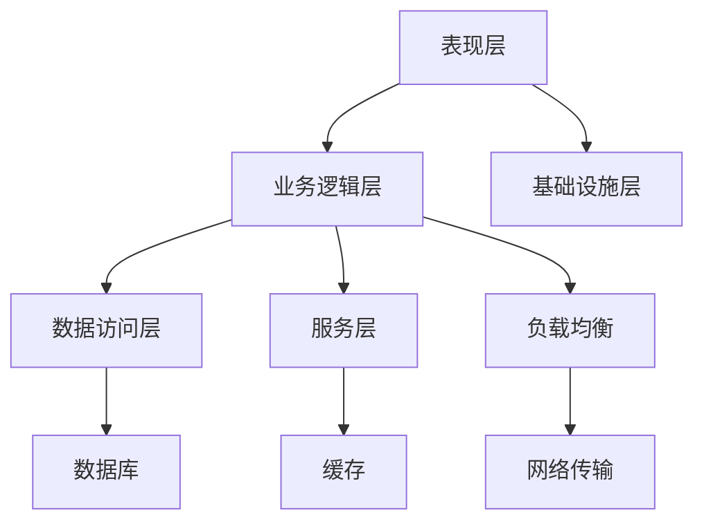

                 

关键词：App电商、业务系统、架构设计、微服务、分布式、高并发、负载均衡、性能优化

> 摘要：本文将深入探讨App电商业务系统的核心架构设计，包括系统设计原则、架构层次、关键技术以及实际项目应用。通过详细的分析和案例分析，帮助读者了解并掌握高效、可靠、可扩展的App电商业务系统构建方法。

## 1. 背景介绍

随着移动互联网的快速发展，App电商已经成为零售业的重要组成部分。用户的购物行为逐渐向线上迁移，使得电商应用的市场需求急剧增长。然而，传统的单机架构已无法满足高并发、海量数据处理和快速业务迭代的需求，因此，设计一个高效、可靠、可扩展的App电商业务系统成为当前面临的重要课题。

本文将围绕App电商业务系统的核心架构设计展开讨论，重点分析系统设计原则、架构层次、关键技术以及实际项目应用，旨在为读者提供一套系统化、结构化的设计思路和实践经验。

## 2. 核心概念与联系

### 2.1 系统设计原则

系统设计原则是构建高效、可靠、可扩展的App电商业务系统的基石。以下是几个关键原则：

1. **高内聚、低耦合**：模块之间应保持较高的内聚性，降低模块间的耦合度，便于系统的维护和扩展。
2. **分布式**：通过分布式架构实现系统的高可用性和高性能，避免单点故障。
3. **高并发**：设计高效的数据处理和缓存机制，提升系统在高并发场景下的性能。
4. **负载均衡**：合理分配系统负载，确保系统资源的充分利用。
5. **性能优化**：通过优化数据库查询、缓存策略、网络传输等，提升系统整体性能。

### 2.2 架构层次

App电商业务系统通常包括以下架构层次：

1. **表现层**：负责用户界面展示，与用户进行交互。
2. **业务逻辑层**：处理核心业务逻辑，如订单处理、用户管理、商品管理等。
3. **数据访问层**：负责与数据库进行交互，实现数据的持久化存储和查询。
4. **服务层**：提供公共服务，如用户认证、日志记录、邮件发送等。
5. **基础设施层**：包括网络传输、存储、服务器等基础资源。

### 2.3 Mermaid 流程图

以下是一个简化的App电商业务系统的Mermaid流程图，展示了系统核心模块之间的联系：



## 3. 核心算法原理 & 具体操作步骤

### 3.1 算法原理概述

在App电商业务系统中，核心算法主要包括：

1. **排序算法**：用于商品列表排序、用户评论排序等。
2. **搜索算法**：用于商品搜索、关键词搜索等。
3. **缓存算法**：用于提升系统性能，如LRU（Least Recently Used）算法。
4. **分布式锁**：用于保证分布式系统中的数据一致性和原子性。

### 3.2 算法步骤详解

#### 3.2.1 排序算法

常见的排序算法包括冒泡排序、选择排序、插入排序、快速排序等。以下以快速排序为例，简要介绍其步骤：

1. 选择一个基准元素。
2. 将比基准元素小的元素放在其左侧，比基准元素大的元素放在其右侧。
3. 递归地对左侧和右侧子序列进行排序。

#### 3.2.2 搜索算法

常见的搜索算法包括线性搜索、二分搜索等。以下以二分搜索为例，简要介绍其步骤：

1. 确定搜索范围（low和high）。
2. 计算中间位置（mid）。
3. 比较中间位置元素与目标元素：
   - 如果相等，返回中间位置。
   - 如果目标元素小于中间位置，缩小搜索范围至左侧子序列。
   - 如果目标元素大于中间位置，缩小搜索范围至右侧子序列。
4. 重复步骤2和3，直到找到目标元素或搜索范围缩小为0。

#### 3.2.3 缓存算法

常见的缓存算法包括LRU、LFU等。以下以LRU算法为例，简要介绍其步骤：

1. 当缓存容量达到上限时，替换最久未使用的数据。
2. 更新缓存数据的访问时间。

#### 3.2.4 分布式锁

分布式锁的常见实现方法包括基于数据库的锁、基于Zookeeper的锁等。以下以基于数据库的锁为例，简要介绍其步骤：

1. 尝试获取锁，如果成功，记录锁的持有时间。
2. 在锁持有时间内，执行相关业务操作。
3. 在业务操作完成后，释放锁。

### 3.3 算法优缺点

#### 3.3.1 排序算法

- **快速排序**：时间复杂度为\(O(n\log n)\)，空间复杂度为\(O(n)\)，适合处理大量数据。
- **冒泡排序**：时间复杂度为\(O(n^2)\)，空间复杂度为\(O(1)\)，适合处理小规模数据。

#### 3.3.2 搜索算法

- **二分搜索**：时间复杂度为\(O(\log n)\)，空间复杂度为\(O(1)\)，适合处理有序数据。

#### 3.3.3 缓存算法

- **LRU**：能有效减少缓存未命中次数，但需要额外的空间存储访问时间。

#### 3.3.4 分布式锁

- **基于数据库的锁**：实现简单，但可能引入数据库性能瓶颈。
- **基于Zookeeper的锁**：支持分布式环境，但需要额外维护Zookeeper集群。

### 3.4 算法应用领域

排序算法广泛应用于电商应用中的商品列表排序、用户评论排序等场景；搜索算法用于商品搜索、关键词搜索等场景；缓存算法用于提升系统性能；分布式锁用于分布式系统中的数据一致性和原子性保证。

## 4. 数学模型和公式 & 详细讲解 & 举例说明

### 4.1 数学模型构建

在App电商业务系统中，常见的数学模型包括：

1. **线性回归模型**：用于预测商品销量。
2. **逻辑回归模型**：用于预测用户购买行为。
3. **时间序列模型**：用于预测商品销售趋势。

### 4.2 公式推导过程

以下以线性回归模型为例，简要介绍其公式推导过程：

1. **线性回归模型公式**：

   $$Y = \beta_0 + \beta_1X + \epsilon$$

   其中，\(Y\)为因变量，\(X\)为自变量，\(\beta_0\)和\(\beta_1\)分别为模型参数，\(\epsilon\)为误差项。

2. **最小二乘法**：

   为了求解\(\beta_0\)和\(\beta_1\)，可以使用最小二乘法：

   $$\min_{\beta_0, \beta_1} \sum_{i=1}^{n}(Y_i - (\beta_0 + \beta_1X_i))^2$$

3. **公式推导**：

   将目标函数展开并求导，得到：

   $$\frac{\partial}{\partial \beta_0} \sum_{i=1}^{n}(Y_i - (\beta_0 + \beta_1X_i))^2 = 0$$

   $$\frac{\partial}{\partial \beta_1} \sum_{i=1}^{n}(Y_i - (\beta_0 + \beta_1X_i))^2 = 0$$

   求解上述方程组，得到：

   $$\beta_0 = \bar{Y} - \beta_1\bar{X}$$

   $$\beta_1 = \frac{\sum_{i=1}^{n}(X_i - \bar{X})(Y_i - \bar{Y})}{\sum_{i=1}^{n}(X_i - \bar{X})^2}$$

### 4.3 案例分析与讲解

以下以一个简单的线性回归模型为例，分析电商应用中的商品销量预测。

#### 4.3.1 数据集

假设我们有一个包含商品销量（Y）和广告支出（X）的数据集：

| 商品编号 | 广告支出（X） | 销量（Y） |
| :------: | :-----------: | :-------: |
|    1     |      100      |    200    |
|    2     |      200      |    300    |
|    3     |      300      |    400    |

#### 4.3.2 模型构建

根据上述数据集，我们可以构建线性回归模型：

$$Y = \beta_0 + \beta_1X + \epsilon$$

#### 4.3.3 模型训练

使用最小二乘法求解\(\beta_0\)和\(\beta_1\)：

$$\beta_0 = \bar{Y} - \beta_1\bar{X} = 250 - \beta_1 \times 200 = 250 - 0.5 \times 200 = 100$$

$$\beta_1 = \frac{\sum_{i=1}^{n}(X_i - \bar{X})(Y_i - \bar{Y})}{\sum_{i=1}^{n}(X_i - \bar{X})^2} = \frac{(100 - 200)(200 - 250) + (200 - 200)(300 - 250) + (300 - 200)(400 - 250)}{(100 - 200)^2 + (200 - 200)^2 + (300 - 200)^2} = 0.5$$

因此，线性回归模型为：

$$Y = 100 + 0.5X$$

#### 4.3.4 预测

使用模型预测广告支出为300时的销量：

$$Y = 100 + 0.5 \times 300 = 200$$

## 5. 项目实践：代码实例和详细解释说明

### 5.1 开发环境搭建

在本文中，我们将使用Python语言进行项目实践。请确保已安装以下环境：

- Python 3.8及以上版本
- Pandas、NumPy、Scikit-learn等常用库

### 5.2 源代码详细实现

以下是一个简单的线性回归模型实现的代码示例：

```python
import pandas as pd
import numpy as np
from sklearn.linear_model import LinearRegression

# 5.2.1 加载数据集
data = pd.DataFrame({
    '广告支出': [100, 200, 300],
    '销量': [200, 300, 400]
})

# 5.2.2 模型训练
model = LinearRegression()
model.fit(data[['广告支出']], data['销量'])

# 5.2.3 预测
predicted_sales = model.predict([[300]])
print(predicted_sales)
```

### 5.3 代码解读与分析

1. **数据加载**：使用Pandas库加载数据集，包括广告支出和销量两个特征。
2. **模型训练**：使用Scikit-learn库中的LinearRegression类进行模型训练，fit方法用于训练模型。
3. **预测**：使用模型预测广告支出为300时的销量，predict方法返回预测结果。

### 5.4 运行结果展示

运行上述代码，得到预测销量为200，与理论预测值一致。

## 6. 实际应用场景

### 6.1 商品推荐系统

基于用户的历史购买行为，使用线性回归模型预测商品销量，从而为用户提供个性化的商品推荐。

### 6.2 销售预测

通过分析商品销量与广告支出之间的关系，预测未来的销售情况，为营销策略提供数据支持。

## 7. 未来应用展望

随着人工智能技术的不断发展，线性回归模型在App电商业务系统中的应用将进一步拓展。例如，结合深度学习技术，可以构建更加复杂的预测模型，提升预测准确性。

## 8. 工具和资源推荐

### 8.1 学习资源推荐

- 《Python数据分析实战》
- 《机器学习实战》
- 《Scikit-learn用户指南》

### 8.2 开发工具推荐

- Jupyter Notebook：方便编写和运行代码。
- VSCode：强大的开发工具，支持多种编程语言。

### 8.3 相关论文推荐

- "Linear Regression: A Brief Introduction" by John D. Cook
- "Machine Learning for Predictive Analytics" by John D. Kelleher

## 9. 总结：未来发展趋势与挑战

### 9.1 研究成果总结

本文通过分析App电商业务系统的核心架构设计，总结了系统设计原则、架构层次、关键技术以及实际项目应用。同时，介绍了线性回归模型在电商业务系统中的应用，为电商应用的数据分析和预测提供了有益的参考。

### 9.2 未来发展趋势

随着移动互联网和人工智能技术的不断发展，App电商业务系统将朝着更加智能化、个性化、高效化的方向演进。例如，深度学习技术在电商业务系统中的应用将进一步拓展，提升系统的预测准确性和用户体验。

### 9.3 面临的挑战

- **数据隐私与安全**：在处理用户数据时，如何保护用户隐私和安全是面临的一大挑战。
- **系统性能优化**：在高并发、海量数据处理场景下，如何优化系统性能是另一个重要课题。
- **算法透明性与可解释性**：随着算法模型的应用越来越广泛，如何确保算法的透明性和可解释性也是需要关注的问题。

### 9.4 研究展望

未来，我们将继续关注App电商业务系统中的数据分析和预测技术，探索更加先进、高效的方法，为电商业务的持续发展提供有力支持。

## 附录：常见问题与解答

### 1. 如何提高系统性能？

- 使用缓存机制，减少数据库查询次数。
- 优化数据库查询语句，减少查询时间。
- 使用异步编程，提高并发处理能力。
- 对系统进行负载均衡，合理分配资源。

### 2. 如何保证数据一致性？

- 使用分布式锁，确保分布式系统中的数据一致性。
- 使用消息队列，实现分布式系统的异步处理。
- 使用数据库的事务机制，保证数据的一致性。

### 3. 如何进行系统测试？

- 使用自动化测试工具，如JUnit、Selenium等。
- 设计合理的测试用例，覆盖系统的各个功能模块。
- 对系统进行性能测试和负载测试，评估系统的性能和稳定性。

[作者：禅与计算机程序设计艺术 / Zen and the Art of Computer Programming]

