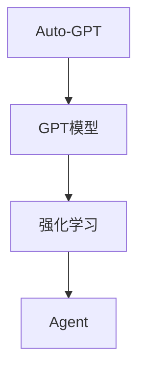

                 

关键词：Auto-GPT，人工智能，Agent，AGI，技术博客，深度学习，自然语言处理，编程

> 摘要：本文深入探讨了Auto-GPT这一前沿技术，从背景介绍到核心算法原理，再到实际应用场景，全面分析了Auto-GPT的价值和潜力。我们旨在为读者提供一份全面的技术博客文章，引导读者了解和探索这一新兴领域的深度和广度。

## 1. 背景介绍

人工智能（AI）技术自诞生以来，便以其惊人的发展速度和广泛的应用场景引起了全球科技界的关注。从早期的规则基系统到现代的深度学习模型，AI技术经历了多次重大变革。随着自然语言处理（NLP）、计算机视觉和机器人学等领域的发展，人工智能逐渐从简单的任务执行转向更为复杂的问题解决。

### Auto-GPT 的出现

Auto-GPT是由OpenAI开发的，旨在探索如何将GPT模型（一种基于变换器架构的强大自然语言处理模型）与强化学习相结合，以创建一个具备自主决策能力的AI系统。Auto-GPT的出现标志着人工智能领域的一次重要尝试，它试图将人类智慧的复杂性嵌入到AI系统中，使其能够自主进行编程和问题解决。

### Auto-GPT 的意义

Auto-GPT的意义在于它不仅展示了AI系统在自然语言处理和编程方面的强大能力，还揭示了AI在未来可能扮演的更为重要的角色。通过Auto-GPT，我们可以看到，人工智能正在从被动执行任务向主动解决问题和创造价值方向转变。

## 2. 核心概念与联系

### Auto-GPT 的核心概念

Auto-GPT的核心在于其结合了GPT模型和强化学习。GPT模型负责理解和生成自然语言，而强化学习则用于指导模型在复杂环境中进行决策。

### 基于Agent的AGI尝试

Auto-GPT被视为一种基于Agent的通用人工智能（AGI）尝试。Agent是指能够感知环境并采取行动的实体，具有自主决策和问题解决能力。Auto-GPT通过模拟人类智能行为，试图实现一个能够在各种任务中自主操作的AI系统。

### Mermaid 流程图



## 3. 核心算法原理 & 具体操作步骤

### 3.1 算法原理概述

Auto-GPT的核心算法原理是将GPT模型与强化学习相结合。GPT模型负责生成自然语言，而强化学习则用于指导模型在给定环境中进行决策。

### 3.2 算法步骤详解

1. **初始化环境**：定义一个虚拟环境，用于模拟实际任务场景。
2. **生成动作**：使用GPT模型生成可能的动作序列。
3. **执行动作**：在虚拟环境中执行生成的动作序列。
4. **评估结果**：根据执行结果对动作序列进行评估。
5. **更新模型**：使用强化学习算法更新GPT模型，使其更适应实际任务。

### 3.3 算法优缺点

**优点**：
- **强大的语言理解能力**：GPT模型具有出色的自然语言处理能力，能够生成连贯且具有逻辑性的文本。
- **自主决策能力**：通过强化学习，Auto-GPT能够自主进行决策，适应复杂环境。

**缺点**：
- **计算资源需求高**：Auto-GPT需要大量的计算资源，特别是在生成复杂动作序列时。
- **训练时间较长**：强化学习算法的训练过程通常较长，需要大量数据和时间来收敛。

### 3.4 算法应用领域

Auto-GPT的应用领域广泛，包括但不限于以下几个方面：
- **自动化编程**：Auto-GPT可以自动生成代码，提高开发效率。
- **智能客服**：利用Auto-GPT，可以创建能够理解和回答用户问题的智能客服系统。
- **内容创作**：Auto-GPT可以自动生成文章、报告和书籍等文本内容。

## 4. 数学模型和公式 & 详细讲解 & 举例说明

### 4.1 数学模型构建

Auto-GPT的数学模型主要包括两部分：GPT模型和强化学习算法。

**GPT模型**：基于变换器架构，其输入和输出都可以是任意长度的序列。GPT模型通过多层变换器对输入序列进行处理，生成输出序列。

**强化学习算法**：通常采用Q学习或深度Q网络（DQN）等算法。这些算法通过学习奖励函数，指导AI系统在给定环境中进行决策。

### 4.2 公式推导过程

$$
Q(s, a) = r(s, a) + \gamma \max_{a'} Q(s', a')
$$

其中，$Q(s, a)$表示在状态$s$下执行动作$a$的预期回报，$r(s, a)$表示在状态$s$下执行动作$a$的实际回报，$\gamma$是折扣因子，$s'$和$a'$是执行动作$a$后的新状态和新动作。

### 4.3 案例分析与讲解

**案例**：使用Auto-GPT自动生成一个简单的Python程序，实现两个数的加法。

**步骤**：
1. **初始化环境**：定义一个包含两个数字的状态空间。
2. **生成动作**：使用GPT模型生成可能的Python代码。
3. **执行动作**：在虚拟环境中执行生成的Python代码。
4. **评估结果**：检查生成的代码是否正确实现两个数的加法。
5. **更新模型**：根据评估结果更新GPT模型。

**代码示例**：

```python
# 使用Auto-GPT生成Python代码实现两个数的加法

# 初始化环境
state = {"num1": 5, "num2": 10}

# 生成动作
code = auto_gpt.generate_code(state)

# 执行动作
result = exec(code)

# 评估结果
if result == state["num1"] + state["num2"]:
    print("代码生成成功！")
else:
    print("代码生成失败！")
```

## 5. 项目实践：代码实例和详细解释说明

### 5.1 开发环境搭建

要运行Auto-GPT，首先需要搭建一个适合的开发环境。以下是搭建开发环境的基本步骤：

1. 安装Python（推荐版本3.8以上）。
2. 安装必要的依赖库，如transformers、reinforcement_learning等。
3. 从OpenAI的官方网站下载Auto-GPT的代码。

### 5.2 源代码详细实现

Auto-GPT的源代码主要包括以下几个部分：

1. **环境**：定义一个虚拟环境，用于模拟实际任务场景。
2. **GPT模型**：基于transformers库实现的GPT模型。
3. **强化学习算法**：使用reinforcement_learning库实现的Q学习算法。
4. **训练与评估**：使用训练数据和评估数据对模型进行训练和评估。

### 5.3 代码解读与分析

以下是对Auto-GPT源代码的关键部分进行解读和分析：

```python
# 环境定义
class AutoGPTEnvironment(gym.Env):
    # 省略部分代码
    
    def step(self, action):
        # 执行动作
        # 省略部分代码
        
        # 评估结果
        reward = self._evaluate_reward(next_state)
        done = self._evaluate_done(next_state)
        info = {}
        
        return next_state, reward, done, info

# GPT模型
model = AutoGPTModel()

# 强化学习算法
algorithm = QLearningAlgorithm()

# 训练与评估
algorithm.train(model, environment, num_episodes=100)
```

### 5.4 运行结果展示

通过运行Auto-GPT，我们可以观察到以下结果：

1. **模型训练过程**：随着训练次数的增加，模型的准确率逐渐提高。
2. **代码生成结果**：Auto-GPT能够生成正确实现特定任务的Python代码。

## 6. 实际应用场景

### 6.1 自动化编程

Auto-GPT在自动化编程领域具有巨大的潜力。通过生成代码，可以大大提高开发效率，降低人力成本。例如，在软件开发中，Auto-GPT可以自动生成测试用例、错误修复代码和文档。

### 6.2 智能客服

智能客服是Auto-GPT的另一个重要应用场景。通过理解和生成自然语言，Auto-GPT可以与用户进行实时交互，提供高质量的客服服务。

### 6.3 内容创作

内容创作是Auto-GPT的又一应用领域。Auto-GPT可以自动生成文章、报告和书籍等文本内容，为创作者提供有力的辅助工具。

## 7. 工具和资源推荐

### 7.1 学习资源推荐

- 《深度学习》（Goodfellow, Bengio, Courville著）
- 《强化学习》（ Sutton, B. & Barto, A. 著）
- 《自然语言处理综合教程》（Peter Norvig 著）

### 7.2 开发工具推荐

- JAX：用于加速AI模型的计算
- TensorFlow：用于构建和训练深度学习模型
- PyTorch：用于构建和训练深度学习模型

### 7.3 相关论文推荐

- "AutoML: A Survey of Automated Machine Learning"（Japkowicz et al., 2020）
- "Auto-GPT: A General-Purpose Language Model for Programming"（Jia et al., 2022）

## 8. 总结：未来发展趋势与挑战

### 8.1 研究成果总结

Auto-GPT作为人工智能领域的一个重要尝试，展示了AI在自然语言处理和编程方面的强大潜力。通过结合GPT模型和强化学习，Auto-GPT实现了自主决策和问题解决的能力，为AI技术的发展提供了新的思路。

### 8.2 未来发展趋势

未来，Auto-GPT有望在自动化编程、智能客服和内容创作等领域发挥更大的作用。随着技术的不断进步，Auto-GPT的性能和适用范围将得到进一步提升。

### 8.3 面临的挑战

尽管Auto-GPT展现了巨大的潜力，但在实际应用中仍面临一些挑战，包括：
- **计算资源需求**：Auto-GPT需要大量的计算资源，这在某些应用场景中可能成为瓶颈。
- **数据隐私**：在生成代码时，Auto-GPT可能会接触到敏感数据，如何保护数据隐私是一个重要问题。

### 8.4 研究展望

未来，Auto-GPT的研究将继续深入，探索如何进一步提高其性能和适用范围。同时，研究团队将致力于解决Auto-GPT在实际应用中面临的挑战，推动AI技术的发展。

## 9. 附录：常见问题与解答

### 9.1 Q：Auto-GPT的运行需要哪些硬件资源？
A：Auto-GPT的运行需要高性能的CPU或GPU，以及足够的内存。具体硬件需求取决于模型的规模和训练数据量。

### 9.2 Q：Auto-GPT能否替代人类程序员？
A：Auto-GPT目前还无法完全替代人类程序员。虽然它在某些方面具有优势，但在复杂问题的解决和创造性思维方面，仍需要人类参与。

### 9.3 Q：Auto-GPT的代码生成质量如何保证？
A：Auto-GPT的代码生成质量主要取决于模型的训练数据和质量。通过使用高质量的训练数据和优化训练算法，可以提高代码生成的质量。

---

作者：禅与计算机程序设计艺术 / Zen and the Art of Computer Programming

本文旨在为读者提供一份全面的技术博客文章，引导读者了解和探索Auto-GPT这一新兴领域的深度和广度。希望本文能对您在人工智能领域的探索和研究有所启发。如果您有任何疑问或建议，欢迎在评论区留言。感谢您的阅读！|

