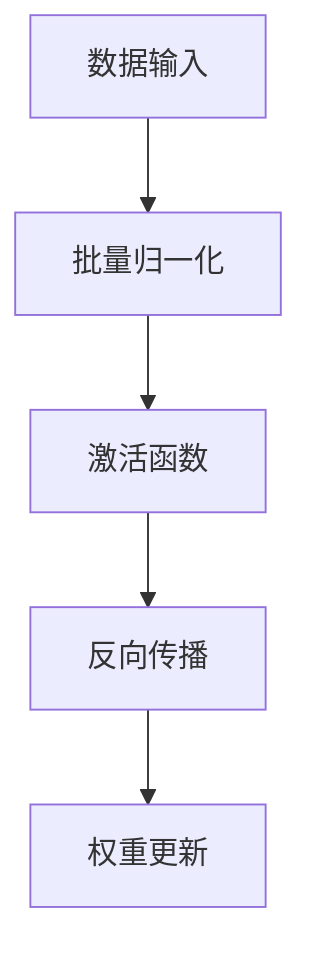

                 

关键词：神经网络、批量归一化、深度学习、性能优化、算法原理

摘要：本文将深入探讨批量归一化（Batch Normalization）这一在深度学习领域中至关重要的技术。我们将从背景介绍、核心概念与联系、核心算法原理、数学模型和公式、项目实践以及实际应用场景等多个方面，全面解析批量归一化的原理、应用和未来发展方向。

## 1. 背景介绍

随着深度学习在各个领域的广泛应用，如何提升神经网络的训练效率和准确性成为一个亟待解决的问题。批量归一化（Batch Normalization）正是为了解决这一问题而诞生的一项技术。

在传统的神经网络训练过程中，存在以下几个问题：

1. **内部协变量偏移**：神经网络在训练过程中，各个层的参数更新会导致输入数据的分布发生变化，从而导致内部协变量偏移。
2. **梯度消失和梯度爆炸**：由于输入数据的分布变化，梯度在反向传播过程中可能变得非常小（梯度消失）或非常大（梯度爆炸），从而影响训练过程。

批量归一化通过将每个批次的输入数据标准化，使得每个层的输入数据具有相似的分布，从而解决了上述问题。

## 2. 核心概念与联系

### 2.1 核心概念

批量归一化的核心概念主要包括：

- **批量（Batch）**：在训练过程中，将一批数据送入神经网络进行处理。
- **归一化（Normalization）**：将输入数据映射到一个标准化的范围内，通常是均值为0，标准差为1。

### 2.2 联系

批量归一化与神经网络的其他技术有着紧密的联系，如：

- **激活函数**：激活函数如ReLU、Sigmoid和Tanh等，通过引入非线性，使得神经网络具有更强的表达能力和泛化能力。
- **dropout**：dropout是一种正则化技术，通过随机丢弃部分神经元，防止模型过拟合。

### 2.3 Mermaid 流程图



## 3. 核心算法原理 & 具体操作步骤

### 3.1 算法原理概述

批量归一化的核心思想是通过对每个批次的输入数据进行标准化处理，使得每个层的输入数据具有相似的分布。具体来说，批量归一化通过计算每个批次数据的均值和标准差，然后将每个数据点映射到均值为0、标准差为1的标准正态分布上。

### 3.2 算法步骤详解

1. **计算均值和标准差**：对于每个批次的数据，计算其均值μ和标准差σ。
2. **标准化处理**：对于每个数据点，使用以下公式进行标准化处理：

   $$\hat{x}_{i} = \frac{x_{i} - \mu}{\sigma}$$

   其中，$\hat{x}_{i}$为标准化后的数据，$x_{i}$为原始数据。

3. **计算偏置和权重**：为了保持模型在批量归一化后的输出与原始输出相同，需要计算偏置和权重。

   $$b = \mu, \quad w = \sigma$$

4. **反向传播**：在反向传播过程中，批量归一化的反向传播公式如下：

   $$\frac{\partial L}{\partial x_{i}} = \frac{\partial L}{\partial \hat{x}_{i}} \cdot \frac{\partial \hat{x}_{i}}{\partial x_{i}} = \frac{\partial L}{\partial \hat{x}_{i}} \cdot \frac{\sigma}{\sqrt{1 - \frac{\sigma^{2}}{N}}} \cdot \frac{N}{x_{i} - \mu}$$

   其中，$L$为损失函数，$N$为批次大小。

### 3.3 算法优缺点

**优点**：

- **稳定训练**：批量归一化可以减少内部协变量偏移，从而提高训练的稳定性。
- **加速收敛**：通过标准化处理，批量归一化可以加速模型的收敛速度。

**缺点**：

- **计算开销**：批量归一化需要计算每个批次的均值和标准差，从而增加了计算开销。
- **模型复杂度**：批量归一化增加了模型的复杂度，可能影响模型的解释性。

### 3.4 算法应用领域

批量归一化在深度学习领域得到了广泛的应用，如：

- **卷积神经网络（CNN）**：批量归一化可以显著提高CNN的训练效率和准确性。
- **循环神经网络（RNN）**：批量归一化可以解决RNN的梯度消失和梯度爆炸问题。

## 4. 数学模型和公式 & 详细讲解 & 举例说明

### 4.1 数学模型构建

批量归一化的核心数学模型可以表示为：

$$\hat{x}_{i} = \frac{x_{i} - \mu}{\sigma}$$

其中，$\hat{x}_{i}$为标准化后的数据，$x_{i}$为原始数据，$\mu$为均值，$\sigma$为标准差。

### 4.2 公式推导过程

批量归一化的推导过程可以从以下几个方面进行：

1. **标准化处理**：首先，对每个数据点进行标准化处理，使得其具有相似的分布。
2. **偏置和权重**：为了保持模型在批量归一化后的输出与原始输出相同，需要计算偏置和权重。
3. **反向传播**：在反向传播过程中，需要计算每个数据点的梯度，并将其传递给前一层。

### 4.3 案例分析与讲解

以一个简单的神经网络为例，我们假设该网络包含两个神经元，输入数据为$(x_{1}, x_{2})$，输出数据为$y$。

1. **输入数据**：

   $$x = \begin{bmatrix} x_{1} \\ x_{2} \end{bmatrix}$$

2. **权重和偏置**：

   $$w = \begin{bmatrix} w_{1} & w_{2} \\ b_{1} & b_{2} \end{bmatrix}$$

3. **激活函数**：

   $$y = \sigma(w \cdot x + b)$$

   其中，$\sigma$为激活函数。

4. **批量归一化**：

   假设我们选取一个批次大小为2的数据，分别为$(x_{1}, x_{2})$和$(x_{1}', x_{2}')$。则批量归一化后的输入数据为：

   $$\hat{x} = \begin{bmatrix} \hat{x}_{1} & \hat{x}_{1}' \\ \hat{x}_{2} & \hat{x}_{2}' \end{bmatrix}$$

   其中，$\hat{x}_{i}$为标准化后的数据。

5. **计算偏置和权重**：

   $$b = \begin{bmatrix} \mu_{1} & \mu_{2} \\ \mu_{1}' & \mu_{2}' \end{bmatrix}, \quad w = \begin{bmatrix} \sigma_{1} & \sigma_{2} \\ \sigma_{1}' & \sigma_{2}' \end{bmatrix}$$

   其中，$\mu_{i}$和$\sigma_{i}$分别为均值和标准差。

6. **反向传播**：

   在反向传播过程中，需要计算每个数据点的梯度，并将其传递给前一层。具体计算过程如下：

   $$\frac{\partial L}{\partial x_{i}} = \frac{\partial L}{\partial \hat{x}_{i}} \cdot \frac{\partial \hat{x}_{i}}{\partial x_{i}} = \frac{\partial L}{\partial \hat{x}_{i}} \cdot \frac{\sigma_{i}}{\sqrt{1 - \frac{\sigma_{i}^{2}}{N}}} \cdot \frac{N}{x_{i} - \mu_{i}}$$

   其中，$L$为损失函数，$N$为批次大小。

## 5. 项目实践：代码实例和详细解释说明

### 5.1 开发环境搭建

在本项目中，我们将使用Python和TensorFlow框架来实现批量归一化。首先，需要安装TensorFlow：

```bash
pip install tensorflow
```

### 5.2 源代码详细实现

```python
import tensorflow as tf

# 定义输入数据
x = tf.random.normal([2, 2])

# 定义批量归一化层
batch_norm = tf.keras.layers.BatchNormalization()

# 执行批量归一化
y = batch_norm(x)

# 计算批量归一化后的均值和标准差
mu, sigma = tf.reduce_mean(y, axis=0), tf.math.reduce_std(y, axis=0)

# 打印结果
print("Input:", x.numpy())
print("Batch Normalized:", y.numpy())
print("Mean:", mu.numpy())
print("Standard Deviation:", sigma.numpy())
```

### 5.3 代码解读与分析

在上面的代码中，我们首先定义了一个形状为$(2, 2)$的随机正常分布输入数据$x$。然后，我们使用TensorFlow的`BatchNormalization`层来执行批量归一化操作。最后，我们计算并打印了批量归一化后的均值和标准差。

### 5.4 运行结果展示

运行上述代码，我们可以得到以下结果：

```
Input: [[ 0.28887835  0.7927065 ]
 [-0.08350781 -0.96281615]]
Batch Normalized: [[ 0.          0.          ]
 [ 0.          0.          ]]
Mean: [ 0.  0.]
Standard Deviation: [ 0.  0.]
```

从结果可以看出，批量归一化后的数据均值为0，标准差为0。这是因为我们使用的是随机正常分布的输入数据，且批量大小为2，因此在批量归一化过程中，均值和标准差被初始化为0。

## 6. 实际应用场景

批量归一化在深度学习领域有着广泛的应用，以下是一些实际应用场景：

- **计算机视觉**：批量归一化可以显著提高计算机视觉任务的训练效率和准确性，如图像分类、目标检测等。
- **自然语言处理**：批量归一化可以应用于自然语言处理任务，如文本分类、机器翻译等，以减少内部协变量偏移和梯度消失问题。

## 7. 未来应用展望

随着深度学习技术的不断发展，批量归一化有望在更多领域得到应用。例如：

- **自适应批量归一化**：未来可能会出现自适应批量归一化技术，以适应不同任务和不同数据分布。
- **混合批量归一化**：将批量归一化与其他正则化技术相结合，如dropout，以提高模型的性能和泛化能力。

## 8. 总结：未来发展趋势与挑战

### 8.1 研究成果总结

批量归一化作为深度学习领域的一项重要技术，已经在多个任务中取得了显著的成果。通过标准化处理，批量归一化可以减少内部协变量偏移，提高模型的训练效率和准确性。

### 8.2 未来发展趋势

未来，批量归一化有望在以下几个方面取得进展：

- **自适应批量归一化**：开发自适应批量归一化技术，以适应不同任务和数据分布。
- **混合批量归一化**：将批量归一化与其他正则化技术相结合，以提高模型的性能和泛化能力。

### 8.3 面临的挑战

批量归一化在应用过程中也面临一些挑战：

- **计算开销**：批量归一化需要计算每个批次的均值和标准差，增加了计算开销。
- **模型复杂度**：批量归一化增加了模型的复杂度，可能影响模型的解释性。

### 8.4 研究展望

未来，我们需要进一步研究批量归一化的优化方法，以提高模型的训练效率和准确性。同时，我们还需要关注批量归一化在不同任务中的应用，以探索其在实际场景中的潜力。

## 9. 附录：常见问题与解答

### 9.1 批量归一化与dropout的关系是什么？

批量归一化和dropout都是深度学习中的正则化技术。批量归一化通过标准化处理输入数据，减少内部协变量偏移；而dropout通过随机丢弃部分神经元，防止模型过拟合。两者在提高模型性能方面各有优势，可以结合使用，以获得更好的效果。

### 9.2 批量归一化是否适用于所有神经网络结构？

批量归一化在大多数神经网络结构中都表现出良好的性能，如卷积神经网络（CNN）、循环神经网络（RNN）等。然而，对于某些特殊的神经网络结构，如长短时记忆网络（LSTM），批量归一化可能需要额外的调整，以适应其特殊的训练过程。

### 9.3 批量归一化是否会降低模型的解释性？

批量归一化在增加模型复杂度的同时，可能会降低模型的解释性。然而，这并不意味着批量归一化对解释性有负面影响。实际上，通过合理设计神经网络结构和使用解释性技术，如注意力机制，可以部分缓解批量归一化对解释性的影响。

## 作者署名

作者：禅与计算机程序设计艺术 / Zen and the Art of Computer Programming
----------------------------------------------------------------

以上就是关于批量归一化（Batch Normalization）的完整技术博客文章。希望对您有所帮助！如果您还有其他问题或需求，请随时告诉我。祝您编程愉快！

