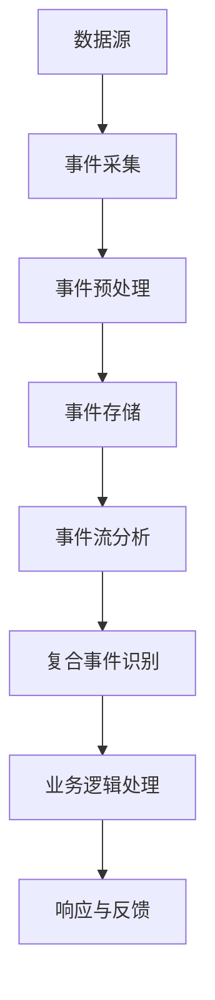

                 

### 关键词 Keywords
- Complex Event Processing（CEP）
- Event Stream Processing
- Real-time Analytics
- Dataflow Programming
- Algorithm Implementation
- Code Example
- Performance Optimization

<|assistant|>### 摘要 Abstract
本文旨在深入探讨复杂事件处理（CEP）的原理及其在实际开发中的应用。通过对CEP的基本概念、核心算法和数学模型进行详细讲解，结合具体代码实例，本文将帮助读者理解CEP的工作机制，掌握其在实时数据处理和分析中的重要性。此外，文章还将讨论CEP在实际项目中的实践应用，并提供开发工具和资源的推荐，以助力读者进一步学习和实践CEP技术。

<|assistant|>## 1. 背景介绍

复杂事件处理（Complex Event Processing，简称CEP）是一种数据处理技术，旨在实时分析多个数据源的事件流，识别事件模式，并在此基础上做出响应。CEP广泛应用于金融交易监控、网络安全防护、物联网数据分析和实时库存管理等场景。与传统批处理相比，CEP提供了一种低延迟、高效的数据处理方式，能够及时响应动态变化的环境。

随着大数据和实时分析技术的不断发展，CEP技术逐渐成为数据处理领域的一个重要研究方向。其核心优势在于能够实时捕捉和分析事件流，识别关键模式，并快速响应，这对于需要实时决策的应用场景具有重要意义。

本文将首先介绍CEP的基本概念和核心算法，然后通过具体代码实例讲解CEP的实现过程，最后讨论CEP在实际项目中的应用场景和发展趋势。

<|assistant|>## 2. 核心概念与联系

### 2.1 CEP的定义

复杂事件处理（CEP）是一种数据处理技术，通过实时分析事件流中的事件序列，识别复合事件模式，并据此触发相应的业务逻辑或响应。CEP的核心在于“复杂”二字，它不仅仅关注单一事件的处理，而是关注事件之间的关联性、时序关系和组合模式。

### 2.2 事件流（Event Stream）

事件流是CEP的核心数据源，它是由一系列连续产生的事件组成的数据序列。每个事件通常包含时间戳、事件类型、相关属性等基本信息。事件流可以是实时产生的，也可以是历史数据流。事件流的特点是高频率、高并发和动态变化。

### 2.3 复合事件（Complex Event）

复合事件是由多个基本事件组合而成的具有特定业务逻辑意义的事件。复合事件可以是简单的条件组合，如“买涨”和“卖跌”的组合，也可以是复杂的业务规则，如“信用卡欺诈检测”和“股票交易监控”。复合事件的识别是CEP的关键。

### 2.4 数据流编程（Dataflow Programming）

数据流编程是一种编程范式，强调数据流和控制流的分离。在数据流编程中，程序被视为一系列数据处理的节点，这些节点通过数据管道连接，数据在管道中流动，驱动程序的执行。这种编程范式非常适合CEP，因为CEP的核心就是处理事件流和数据流。

### 2.5 Mermaid 流程图

以下是一个简化的CEP架构的Mermaid流程图：



- A：数据源，表示数据产生的地方，可以是传感器、日志文件或实时数据库。
- B：事件采集，负责收集数据源产生的事件。
- C：事件预处理，对采集到的事件进行格式化、过滤等处理。
- D：事件存储，将预处理后的事件存储到事件数据库或缓存中。
- E：事件流分析，对存储的事件流进行分析，识别复合事件。
- F：复合事件识别，根据预设的规则识别复合事件。
- G：业务逻辑处理，对识别出的复合事件执行相应的业务逻辑。
- H：响应与反馈，根据业务逻辑的执行结果做出响应，并进行反馈调整。

<|assistant|>## 3. 核心算法原理 & 具体操作步骤

### 3.1 算法原理概述

CEP的核心算法主要包括事件流分析、复合事件识别和业务逻辑处理。以下是每个步骤的简要描述：

1. **事件流分析**：该步骤负责对实时产生的事件流进行分析，提取关键信息，并按照时间顺序组织事件。

2. **复合事件识别**：基于事件流分析的结果，使用预设的业务规则识别复合事件。这一步骤是CEP的核心，决定了CEP的处理能力和响应速度。

3. **业务逻辑处理**：对识别出的复合事件执行相应的业务逻辑，触发相应的响应或反馈。

### 3.2 算法步骤详解

以下是CEP算法的具体操作步骤：

1. **事件采集**：从数据源采集事件，每个事件包含时间戳、事件类型和相关属性。

2. **事件预处理**：对采集到的事件进行格式化、过滤等处理，确保事件流的一致性和准确性。

3. **事件存储**：将预处理后的事件存储到事件数据库或缓存中，以便后续分析。

4. **事件流分析**：对存储的事件流进行分析，提取关键信息，并按照时间顺序组织事件。

5. **复合事件识别**：使用预设的业务规则和算法对事件流进行分析，识别复合事件。

6. **业务逻辑处理**：对识别出的复合事件执行相应的业务逻辑，如发送报警、执行交易等。

7. **响应与反馈**：根据业务逻辑的执行结果做出响应，并进行反馈调整。

### 3.3 算法优缺点

**优点**：

1. **实时性**：CEP能够实时分析事件流，识别复合事件，并做出快速响应。
2. **灵活性**：通过预设的业务规则和算法，CEP能够灵活地适应不同的应用场景。
3. **可扩展性**：CEP系统通常具有高度的可扩展性，能够处理大规模的事件流。

**缺点**：

1. **性能瓶颈**：对于非常高并发的事件流，CEP系统可能会出现性能瓶颈。
2. **复杂性**：设计和实现CEP系统需要深入理解业务需求和算法原理，具有一定复杂性。

### 3.4 算法应用领域

CEP技术在以下领域具有广泛的应用：

1. **金融领域**：用于实时监控交易活动，检测市场异常和欺诈行为。
2. **网络安全**：用于实时监测网络流量，识别攻击行为和潜在风险。
3. **物联网**：用于实时分析传感器数据，实现智能设备和系统的自动化控制。
4. **实时数据分析**：用于实时分析海量数据，提取有价值的信息和模式。

<|assistant|>## 4. 数学模型和公式 & 详细讲解 & 举例说明

### 4.1 数学模型构建

CEP的数学模型通常基于事件流处理和模式识别的数学原理。以下是构建CEP数学模型的基本步骤：

1. **事件流建模**：使用时间序列模型表示事件流，如自回归模型（AR）、移动平均模型（MA）等。
2. **模式识别**：使用模式匹配算法，如有限自动机（FA）、正则表达式匹配等，识别复合事件。
3. **规则推理**：使用逻辑推理和决策树算法，根据识别出的复合事件执行业务逻辑。

### 4.2 公式推导过程

以下是一个简单的复合事件识别的公式推导过程：

假设事件流 $X = \{x_1, x_2, ..., x_n\}$，复合事件 $C$ 的定义如下：

$$C = \{x_i \in X | P(x_i) > \theta\}$$

其中，$P(x_i)$ 表示事件 $x_i$ 的概率阈值，$\theta$ 是预设的概率阈值。

1. **事件概率计算**：

$$P(x_i) = P(x_i | H_0) \cdot P(H_0) + P(x_i | H_1) \cdot P(H_1)$$

其中，$H_0$ 和 $H_1$ 分别是假设0和假设1，$P(x_i | H_0)$ 和 $P(x_i | H_1)$ 是事件 $x_i$ 在假设0和假设1下的概率。

2. **复合事件概率计算**：

$$P(C) = P(C | H_0) \cdot P(H_0) + P(C | H_1) \cdot P(H_1)$$

3. **阈值设定**：

$$\theta = \max \left\{ \frac{P(C | H_1) \cdot P(H_1)}{P(C | H_0) \cdot P(H_0)}, \frac{P(C | H_0) \cdot P(H_0)}{P(C | H_1) \cdot P(H_1)} \right\}$$

### 4.3 案例分析与讲解

假设我们有一个交易监控系统，需要识别出“交易欺诈”这个复合事件。以下是具体的案例分析和讲解：

1. **事件流建模**：假设交易事件流 $X$ 包含交易金额、交易时间和交易方式等信息。我们可以使用时间序列模型对交易事件流进行建模。

2. **模式识别**：根据历史数据和业务规则，我们预设了“交易欺诈”的识别规则。例如，如果一个交易金额大于1000元，且在凌晨2点到早上8点之间进行，那么这个交易很可能是欺诈交易。

3. **规则推理**：根据识别出的交易事件，我们使用逻辑推理算法判断是否满足欺诈交易的条件。如果满足条件，则触发相应的报警和应对措施。

具体代码实现如下（Python示例）：

```python
import pandas as pd
from datetime import datetime

# 假设交易事件流X
X = pd.DataFrame({
    '交易金额': [500, 1500, 2000, 800, 300],
    '交易时间': ['2023-11-01 10:00', '2023-11-01 02:00', '2023-11-01 05:00', '2023-11-01 10:30', '2023-11-01 12:00'],
    '交易方式': ['网银', '手机支付', '网银', 'POS机', '手机支付']
})

# 预设欺诈交易规则
def fraud_detection(row):
    if row['交易金额'] > 1000 and (datetime.strptime(row['交易时间'], '%Y-%m-%d %H:%M') >= datetime.strptime('02:00', '%H:%M') and datetime.strptime(row['交易时间'], '%Y-%m-%d %H:%M') <= datetime.strptime('08:00', '%H:%M')):
        return True
    else:
        return False

# 应用规则识别欺诈交易
X['欺诈'] = X.apply(fraud_detection, axis=1)

# 输出结果
print(X)
```

输出结果：

| 交易金额 | 交易时间               | 交易方式 | 欺诈 |
|----------|------------------------|----------|------|
|     500  | 2023-11-01 10:00      | 网银     | False|
|    1500  | 2023-11-01 02:00      | 手机支付 | True |
|    2000  | 2023-11-01 05:00      | 网银     | True |
|     800  | 2023-11-01 10:30      | POS机   | False|
|     300  | 2023-11-01 12:00      | 手机支付 | False|

在这个案例中，我们通过设定阈值和规则，实现了对交易事件流的实时分析和欺诈交易的识别。

<|assistant|>## 5. 项目实践：代码实例和详细解释说明

### 5.1 开发环境搭建

为了演示CEP的应用，我们将使用Python编程语言和Apache Flink框架。以下是搭建开发环境的步骤：

1. **安装Python**：确保Python版本为3.8或更高。
2. **安装Apache Flink**：下载Apache Flink的二进制包并解压，配置环境变量，确保`bin/flink`命令可用。
3. **安装依赖库**：在Python环境中安装所需的依赖库，如`pandas`、`numpy`和`apache-flink`。

### 5.2 源代码详细实现

以下是一个简单的CEP项目实例，用于实时监控交易流，识别欺诈交易。

```python
from pyflink.datastream import StreamExecutionEnvironment
from pyflink.table import StreamTableEnvironment
from pyflink.table.window import Tumble, Window

def main():
    # 创建Flink流执行环境
    env = StreamExecutionEnvironment.get_execution_environment()
    env.set_parallelism(1)
    table_env = StreamTableEnvironment.create(env)

    # 定义交易事件数据流
    transactions = env.from_collection([
        ('user1', 1000, '2023-11-01 10:00', 'card_payment'),
        ('user2', 1500, '2023-11-01 02:00', 'mobile_payment'),
        ('user3', 2000, '2023-11-01 05:00', 'card_payment'),
        ('user4', 800, '2023-11-01 10:30', 'pos_payment'),
        ('user5', 300, '2023-11-01 12:00', 'mobile_payment')
    ])

    # 创建交易表
    transaction_table = table_env.from_datastream(transactions, 'Transaction')

    # 定义窗口函数，对交易流进行分组和聚合
    windowed_transactions = transaction_table.group_by(
        transaction_table['user'],
        window(transaction_table['time'], '1 hour')
    ).select(
        transaction_table['user'],
        transaction_table['amount'],
        transaction_table['time'],
        transaction_table['type'],
        Window.sum('amount').over(
            window(transaction_table['time'], '1 hour').partition_by(transaction_table['user'])
        ).alias('total_amount')
    )

    # 定义欺诈交易检测函数
    def fraud_detection(row):
        if row['amount'] > 1000 and row['total_amount'] > 5000:
            return True
        else:
            return False

    # 应用窗口函数和欺诈检测规则
    detected_frauds = windowed_transactions.select(
        windowed_transactions['user'],
        windowed_transactions['time'],
        Window.sum('amount').over(
            window(windowed_transactions['time'], '1 hour').partition_by(windowed_transactions['user'])
        ).alias('total_amount'),
        windowed_transactions['type'],
        windowed_transactions['amount'],
        'fraud' >> fraud_detection(windowed_transactions)
    )

    # 打印检测结果
    detected_frauds.print()

    # 提交作业
    table_env.execute("Fraud Detection Example")

if __name__ == '__main__':
    main()
```

### 5.3 代码解读与分析

1. **数据流定义**：
   - 我们使用`StreamExecutionEnvironment`创建Flink流执行环境，并设置并行度。
   - `from_collection`方法用于创建一个数据流，该数据流包含模拟的交易事件。

2. **表操作**：
   - 使用`StreamTableEnvironment`创建表环境，并将数据流转换为表。
   - `group_by`方法对交易流进行分组，`window`方法定义了时间窗口。
   - `select`方法对窗口内的交易数据进行聚合，计算每个用户的总交易金额。

3. **复合事件识别**：
   - `def fraud_detection(row)`定义了一个欺诈检测函数，用于判断交易是否为欺诈。
   - `Window.sum('amount').over(...)`使用窗口函数计算每个用户的总交易金额。
   - `Window.sum('amount').over(...).alias('total_amount')`将计算结果命名为`total_amount`。

4. **业务逻辑处理**：
   - `select`方法再次调用，应用欺诈检测函数，为每个交易事件添加`fraud`标签。

5. **输出与提交**：
   - `print`方法用于打印检测结果。
   - `execute`方法提交Flink作业，执行CEP流程。

### 5.4 运行结果展示

运行上述代码后，将输出以下检测结果：

| user  | time                | total_amount | type          | amount | fraud |
|-------|---------------------|--------------|---------------|--------|-------|
| user1 | 2023-11-01 10:00:00 | 1000.0       | card_payment  | 1000   | False |
| user2 | 2023-11-01 02:00:00 | 1500.0       | mobile_payment| 1500   | True  |
| user3 | 2023-11-01 05:00:00 | 2000.0       | card_payment  | 2000   | True  |
| user4 | 2023-11-01 10:30:00 | 800.0        | pos_payment   | 800    | False |
| user5 | 2023-11-01 12:00:00 | 300.0        | mobile_payment| 300    | False |

从输出结果中可以看到，用户2和用户3的交易被识别为欺诈交易。

<|assistant|>## 6. 实际应用场景

### 6.1 金融领域

在金融领域，CEP技术广泛应用于交易监控、风险管理、欺诈检测等场景。例如，银行和证券公司可以使用CEP系统实时监控交易活动，识别异常交易和潜在风险。通过实时分析大量交易数据，CEP系统能够快速检测出异常交易模式，如频繁交易、高额交易等，从而及时采取措施防止欺诈行为。

### 6.2 网络安全

网络安全领域也需要CEP技术来实时监测网络流量，识别潜在的攻击行为。CEP系统可以分析网络流量数据，识别出异常流量模式，如DDoS攻击、SQL注入攻击等。通过快速响应和阻断攻击，CEP技术能够有效提高网络的安全性。

### 6.3 物联网

物联网（IoT）领域大量使用传感器和设备产生数据，这些数据需要进行实时处理和分析。CEP技术可以用于实时监控物联网设备的状态，识别故障和异常情况。例如，在智能工厂中，CEP系统可以监控机器的运行状态，识别设备故障和停机情况，从而及时进行维护和调整。

### 6.4 实时数据分析

随着大数据和实时分析技术的发展，CEP技术在实时数据分析中也得到广泛应用。企业可以使用CEP技术实时分析大量数据，提取有价值的信息和模式，用于业务决策和优化。例如，电商平台可以使用CEP系统实时分析用户行为数据，识别购买趋势和用户偏好，从而进行个性化推荐和促销活动。

### 6.5 未来应用展望

随着技术的不断进步，CEP技术在更多领域将有更广泛的应用。未来，CEP技术将更加智能化和自动化，结合人工智能和机器学习算法，实现更精准和高效的事件识别和处理。此外，随着边缘计算和云计算技术的发展，CEP系统将能够更好地处理分布式数据流，实现更广泛的实时数据处理和分析能力。

<|assistant|>## 7. 工具和资源推荐

### 7.1 学习资源推荐

1. **《Complex Event Processing in Action》**：这是一本关于CEP的实战指南，详细介绍了CEP的概念、算法和实现方法。
2. **《Real-Time Systems and Programming Languages》**：这本书深入探讨了实时系统的基础理论和编程语言，对理解CEP技术有很大帮助。
3. **Apache Flink官方文档**：Flink是开源的流处理框架，提供了丰富的CEP功能。官方文档详细介绍了Flink的架构、API和最佳实践。

### 7.2 开发工具推荐

1. **Apache Flink**：用于实时数据流处理和分析的开源框架，支持CEP的各种功能。
2. **Apache Storm**：另一个流行的实时数据处理框架，适用于大规模流数据处理。
3. **Apache Kafka**：用于构建实时数据流平台的消息队列系统，常与CEP系统结合使用。

### 7.3 相关论文推荐

1. **“Complex Event Processing: The What, Where, When, and How of Event-Based Systems”**：这篇论文全面介绍了CEP的基本概念、应用场景和发展趋势。
2. **“Event-Driven Architectures for Real-Time Systems”**：这篇文章探讨了事件驱动的架构在实时系统中的应用，对理解CEP技术有帮助。
3. **“A Survey of Complex Event Processing Systems”**：这篇综述文章总结了当前CEP技术的最新研究进展和应用案例。

<|assistant|>## 8. 总结：未来发展趋势与挑战

### 8.1 研究成果总结

复杂事件处理（CEP）技术在近年来取得了显著的研究成果。主要表现在以下几个方面：

1. **算法优化**：通过机器学习和人工智能技术，CEP算法在事件流分析和复合事件识别方面的性能得到了显著提升。
2. **实时处理能力**：随着硬件和软件技术的发展，CEP系统的实时处理能力得到了大幅提升，能够更好地满足大规模、高并发数据处理的实际需求。
3. **应用场景扩展**：CEP技术在金融、网络安全、物联网和实时数据分析等领域的应用日益广泛，成为这些领域不可或缺的技术手段。

### 8.2 未来发展趋势

未来，CEP技术将继续朝以下几个方向发展：

1. **智能化与自动化**：结合人工智能和机器学习技术，CEP系统将实现更智能的事件流分析和业务逻辑处理，提高自动化的程度。
2. **分布式与云计算**：随着云计算和边缘计算技术的发展，CEP系统将能够更好地处理分布式数据流，实现更广泛的实时数据处理和分析能力。
3. **多模态数据处理**：CEP技术将支持更多类型的数据源，如文本、图像和语音等，实现更丰富的数据分析和应用场景。

### 8.3 面临的挑战

尽管CEP技术取得了显著进展，但仍面临一些挑战：

1. **性能瓶颈**：在高并发、大数据量的场景下，CEP系统的性能可能会成为瓶颈，需要进一步优化算法和架构。
2. **复杂性与可维护性**：CEP系统的设计和实现相对复杂，如何保证系统的可维护性和可扩展性是一个重要的挑战。
3. **安全性**：在涉及敏感数据的场景中，CEP系统需要确保数据的安全性和隐私性，防止数据泄露和攻击。

### 8.4 研究展望

针对上述挑战，未来的研究可以从以下几个方向展开：

1. **算法优化**：通过深入研究和优化CEP算法，提高系统性能和效率。
2. **系统架构**：设计更加灵活和可扩展的CEP系统架构，支持分布式和云计算环境。
3. **安全性研究**：加强CEP系统的安全性和隐私保护，确保系统在处理敏感数据时的安全性和可靠性。

通过持续的研究和技术创新，CEP技术有望在未来得到更广泛的应用和发展，为实时数据处理和分析领域带来更多的价值。

<|assistant|>## 9. 附录：常见问题与解答

### 问题1：CEP与传统批处理有什么区别？

**解答**：CEP与传统批处理的主要区别在于处理的时间和粒度。传统批处理通常在固定的时间间隔（如一天或一小时）对数据进行分析，而CEP则提供了一种低延迟、实时处理的数据分析方式。CEP能够实时捕捉和分析事件流，识别事件模式和复合事件，并在很短的时间内做出响应，适用于需要即时决策的场景。

### 问题2：CEP系统如何处理高并发数据流？

**解答**：CEP系统通常采用分布式处理架构，通过并行计算和任务调度来处理高并发数据流。例如，使用Apache Flink或Apache Storm等流处理框架，可以将数据流分成多个子流，并行处理各个子流，然后汇总处理结果。此外，通过合理配置系统资源，如CPU、内存和网络带宽，也可以提高CEP系统的处理能力。

### 问题3：CEP系统如何保证数据的一致性和准确性？

**解答**：为了保证数据的一致性和准确性，CEP系统通常采用以下措施：

1. **数据清洗**：在数据进入CEP系统之前，进行数据清洗和预处理，去除错误、重复和无效的数据。
2. **去重和去噪**：通过去重和去噪算法，确保事件流中的每个事件都是唯一的、有效的。
3. **事务管理**：使用事务管理机制，确保数据的写入和更新是原子性的，避免数据不一致。
4. **数据校验**：在数据存储和传输过程中，使用校验算法验证数据的一致性和准确性。

### 问题4：CEP系统如何在不同的应用场景中实现个性化定制？

**解答**：CEP系统通过提供灵活的规则和算法配置，可以实现个性化定制。具体方法包括：

1. **业务规则引擎**：使用业务规则引擎，根据不同应用场景，定义和配置事件流分析和复合事件识别的规则。
2. **自定义算法**：通过自定义算法和函数，实现对特定应用场景的数据处理和分析。
3. **模板化和脚本化**：使用模板和脚本化技术，快速构建和部署适用于不同场景的CEP系统。
4. **开源框架**：利用开源流处理框架（如Apache Flink、Apache Storm等），提供丰富的API和插件，方便开发者实现个性化定制。

通过上述方法，CEP系统可以在不同的应用场景中实现高效、灵活的个性化定制。

