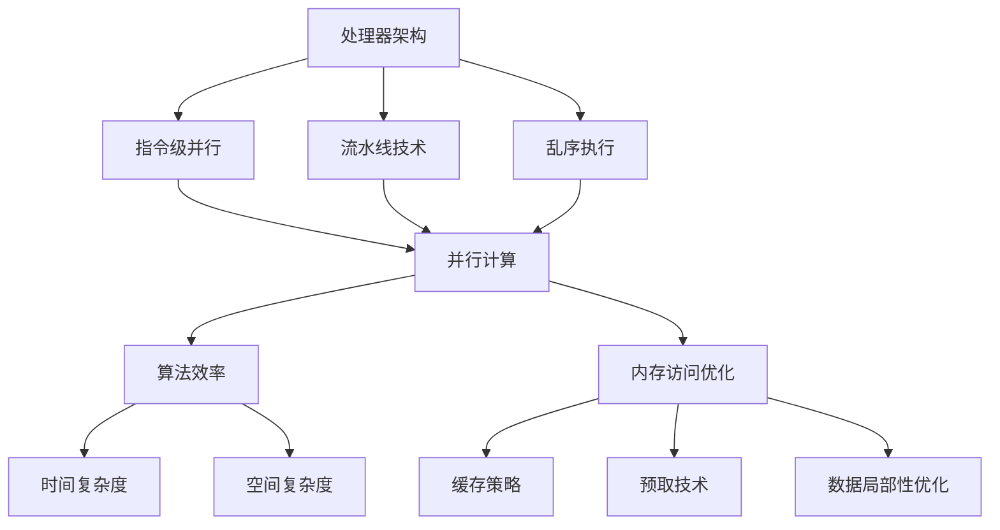

                 

关键词：CPU 优化、处理器性能、多核处理器、并行计算、算法效率、代码优化、性能分析、处理器架构、内存访问优化

> 摘要：本文将深入探讨 CPU 优化的各个方面，包括处理器架构的演进、并行计算策略、算法优化技术、内存访问优化方法等。通过对这些关键领域的详细分析，帮助读者理解如何充分利用现代处理器的强大性能，提升软件系统的运行效率。

## 1. 背景介绍

在现代计算机系统中，中央处理器（CPU）是至关重要的核心组件。它负责执行操作系统指令、处理应用程序请求以及执行各种计算任务。随着计算需求的不断增长，CPU 的性能也经历了显著的提升。然而，仅仅拥有高性能的 CPU 并不能保证系统能够高效运行。CPU 优化成为了一个重要且复杂的课题，涉及到多个层次和方面的优化策略。

首先，随着多核处理器的普及，如何充分利用多核 CPU 的并行计算能力成为了一个关键问题。多核处理器使得程序可以在多个核心上同时执行，从而大幅提高处理速度。然而，要实现高效的并行计算，不仅需要优秀的并行算法设计，还需要对程序代码进行细致的优化。

其次，算法的效率是 CPU 优化的核心。一个高效的算法可以减少计算时间和资源消耗，从而提升系统的整体性能。算法优化包括降低算法复杂度、减少内存访问次数、优化循环结构等。

此外，处理器架构的演进也对 CPU 优化提出了新的挑战。现代处理器具有复杂的架构，包括指令级并行、流水线技术、预取技术等。理解这些架构特性，并利用它们进行优化，是充分利用处理器性能的关键。

最后，内存访问优化也是一个重要的方面。由于内存访问速度相对于处理器运算速度的落后，优化内存访问策略可以显著提升程序的性能。这包括缓存策略、数据局部性优化等。

本文将围绕以上主题，深入探讨 CPU 优化的各个层面，并提供实用的优化策略和技术。

## 2. 核心概念与联系

为了更好地理解 CPU 优化的复杂性，我们需要首先明确一些核心概念，并探讨它们之间的联系。

### 2.1. 处理器架构

处理器架构是指 CPU 的内部结构和工作原理。现代处理器通常采用复杂的架构设计，包括指令级并行（ILP）、流水线（Pipeline）技术、乱序执行（Out-of-Order Execution）等。这些架构特性使得处理器能够更高效地执行指令，提高整体性能。

- **指令级并行（ILP）**：处理器通过同时执行多个指令来提高性能。这可以通过硬件指令调度器实现，也可以通过软件并行算法的支持。
- **流水线技术**：将指令执行过程分解为多个阶段，每个阶段可以并行执行不同的指令。这可以减少每个指令的执行时间，从而提高吞吐量。
- **乱序执行**：处理器可以在不同的执行阶段中重新排列指令的执行顺序，以最大化利用处理器的执行资源。

### 2.2. 并行计算

并行计算是指通过将任务分解为多个部分，并在多个处理单元上同时执行这些部分来提高计算速度。并行计算可以分为多种类型，包括数据并行、任务并行和控制并行。

- **数据并行**：相同任务在不同数据集上同时执行，如矩阵乘法。
- **任务并行**：不同任务同时执行，如多个线程执行不同的计算任务。
- **控制并行**：在同一个任务中，不同控制流同时执行，如分支预测和乱序执行。

### 2.3. 算法效率

算法效率是指算法在给定输入规模下的计算时间和资源消耗。高效的算法通常具有较低的复杂度和合理的内存使用。算法优化包括以下几个方面：

- **时间复杂度**：描述算法执行时间与输入规模的关系。
- **空间复杂度**：描述算法所需存储空间与输入规模的关系。
- **循环优化**：减少循环次数和循环内的计算量。
- **内存访问优化**：减少不必要的内存访问，提高数据局部性。

### 2.4. 内存访问优化

内存访问速度是 CPU 性能的一个重要瓶颈。内存访问优化包括以下几种方法：

- **缓存策略**：利用缓存来减少内存访问时间，提高数据局部性。
- **预取技术**：预测程序未来的内存访问，提前加载数据到缓存中。
- **数据局部性优化**：通过空间局部性和时间局部性优化内存访问模式。

### 2.5. Mermaid 流程图

以下是 CPU 优化中涉及的关键概念和它们之间的联系，使用 Mermaid 流程图进行展示：



通过以上核心概念和流程图的介绍，我们为后续章节的详细探讨奠定了基础。

## 3. 核心算法原理 & 具体操作步骤

### 3.1 算法原理概述

CPU 优化的核心在于提高程序的执行效率，而算法的优化是实现这一目标的关键手段。以下将介绍几种常见的算法优化原理和具体操作步骤。

### 3.2 算法步骤详解

#### 3.2.1 循环优化

循环优化是提高程序执行效率的重要手段之一。以下是几种常见的循环优化方法：

1. **循环展开**：将循环体中的代码在编译时展开，减少循环迭代次数。
   ```c
   for (int i = 0; i < n; ++i) {
       a[i] = b[i] + c[i];
   }
   // 循环展开
   a[0] = b[0] + c[0];
   a[1] = b[1] + c[1];
   ...
   a[n-1] = b[n-1] + c[n-1];
   ```

2. **循环重排**：通过改变循环变量的依赖关系，减少不必要的计算。
   ```c
   for (int i = 0; i < n; ++i) {
       for (int j = 0; j < n; ++j) {
           if (i < j) {
               a[i * n + j] = b[i * n + j] + c[i * n + j];
           }
       }
   }
   // 循环重排
   for (int j = 0; j < n; ++j) {
       for (int i = 0; i < n; ++i) {
           if (i < j) {
               a[i * n + j] = b[i * n + j] + c[i * n + j];
           }
       }
   }
   ```

3. **循环拆分**：将一个复杂循环拆分为多个简单循环，便于并行执行。
   ```c
   for (int i = 0; i < n; ++i) {
       for (int j = 0; j < n; ++j) {
           a[i * n + j] = b[i * n + j] + c[i * n + j];
       }
   }
   // 循环拆分
   for (int i = 0; i < n; ++i) {
       for (int j = 0; j < n; j += k) {
           for (int l = 0; l < k; ++l) {
               a[i * n + j + l] = b[i * n + j + l] + c[i * n + j + l];
           }
       }
   }
   ```

#### 3.2.2 内存访问优化

内存访问优化是提高程序性能的关键步骤。以下是一些常用的内存访问优化方法：

1. **数据局部性优化**：
   - **空间局部性**：通过重复使用相同或相邻的数据，减少内存访问次数。
   - **时间局部性**：保持已经访问过的数据在内存中一段时间，以便后续再次访问。
     ```c
     for (int i = 0; i < n; ++i) {
         int x = a[i];
         int y = a[i + 1];
         // 访问a[i]和a[i+1]，利用空间局部性
         b[i] = x + y;
     }
     ```

2. **缓存优化**：
   - **缓存行对齐**：确保数据按照缓存行的边界对齐，减少缓存未命中。
   - **缓存预取**：通过预取技术，提前加载后续可能访问的数据到缓存中。
     ```c
     for (int i = 0; i < n; ++i) {
         __builtin_prefetch(&a[i + 64], 0, 1);
         // 预取a[i+64]到缓存中
         b[i] = a[i] + a[i + 1];
     }
     ```

3. **缓存替代策略**：
   - **LRU 替换策略**：根据数据访问的历史记录，优先替换最近最久未使用的数据。
   - **随机替换策略**：随机替换缓存中的数据，减少缓存冲突。

#### 3.2.3 并行计算优化

并行计算优化是充分利用多核处理器性能的关键。以下是一些并行计算优化方法：

1. **任务并行**：
   - **工作负载分配**：根据处理器的核心数量和任务的特点，合理分配工作负载。
   - **线程调度**：优化线程的调度策略，减少线程切换的开销。
     ```c
     #pragma omp parallel
     {
         // 并行执行的任务
         // ...
     }
     ```

2. **数据并行**：
   - **数据划分**：将数据划分为多个块，每个块在一个核心上独立处理。
   - **同步与通信**：优化同步和通信机制，减少并行计算中的瓶颈。
     ```c
     #pragma omp parallel for
     for (int i = 0; i < n; ++i) {
         // 数据并行执行的任务
         // ...
     }
     ```

3. **控制并行**：
   - **分支预测**：通过分支预测技术，减少分支指令的执行时间。
   - **乱序执行**：利用乱序执行技术，最大化利用处理器的执行资源。
     ```assembly
     ; 指令1
     ; 指令2
     ; 条件跳转
     jmp label
     ; 指令3
     ; 指令4
     ; label:
     ; 指令5
     ```

### 3.3 算法优缺点

不同的算法优化方法具有各自的优缺点：

- **循环优化**：
  - 优点：降低循环执行次数，提高程序效率。
  - 缺点：增加代码复杂度，可能影响可读性。

- **内存访问优化**：
  - 优点：减少内存访问时间，提高程序性能。
  - 缺点：可能增加缓存占用，影响其他程序的执行。

- **并行计算优化**：
  - 优点：充分利用多核处理器的性能，提高计算速度。
  - 缺点：增加开发复杂度，可能增加程序出错的风险。

### 3.4 算法应用领域

算法优化在各个领域都有广泛的应用：

- **科学计算**：高性能计算（HPC）领域，如气象预报、分子模拟等。
- **大数据处理**：分布式计算框架，如 Hadoop、Spark 等。
- **人工智能**：深度学习模型训练和推理，如 TensorFlow、PyTorch 等。
- **图形渲染**：实时渲染引擎，如 Unity、Unreal Engine 等。

## 4. 数学模型和公式 & 详细讲解 & 举例说明

### 4.1 数学模型构建

CPU 优化中的数学模型通常涉及时间复杂度、空间复杂度和缓存性能等。以下是一个简单的数学模型，用于描述程序执行时间与内存访问次数之间的关系。

#### 时间复杂度模型

假设一个程序的执行时间主要由以下两部分组成：

1. **计算时间**：与程序算法复杂度相关，假设为 $T_{计算}$。
2. **内存访问时间**：与内存访问次数和内存访问速度相关，假设为 $T_{内存}$。

则程序的总执行时间 $T_{总}$ 可以表示为：

$$
T_{总} = T_{计算} + T_{内存}
$$

#### 空间复杂度模型

空间复杂度主要关注程序所需的内存大小。假设一个程序所需内存主要由以下两部分组成：

1. **静态内存**：程序启动时已确定的内存大小，假设为 $S_{静态}$。
2. **动态内存**：程序执行过程中根据需要分配的内存大小，假设为 $S_{动态}$。

则程序的总内存需求 $S_{总}$ 可以表示为：

$$
S_{总} = S_{静态} + S_{动态}
$$

#### 缓存性能模型

缓存性能通常通过缓存命中率来衡量。假设一个程序在缓存中的访问次数为 $V_{缓存}$，总的内存访问次数为 $V_{总}$，则缓存命中率 $H_{缓存}$ 可以表示为：

$$
H_{缓存} = \frac{V_{缓存}}{V_{总}}
$$

### 4.2 公式推导过程

#### 时间复杂度推导

我们以一个简单的线性查找算法为例，推导其时间复杂度。

假设在长度为 $n$ 的数组中查找元素 $x$，算法如下：

1. 从数组的第一个元素开始，逐个比较，直到找到元素 $x$ 或到达数组的末尾。
2. 如果找到元素 $x$，算法结束；否则，算法失败。

算法的平均执行时间可以通过以下公式计算：

$$
T_{计算} = c \times n
$$

其中，$c$ 为每次比较所需的常数时间。

对于内存访问时间，假设每次内存访问的平均时间为 $t$，则算法的总内存访问次数为 $n$，因此：

$$
T_{内存} = t \times n
$$

因此，程序的总执行时间为：

$$
T_{总} = T_{计算} + T_{内存} = c \times n + t \times n = (c + t) \times n
$$

因此，时间复杂度为 $O(n)$。

#### 空间复杂度推导

我们继续以上述线性查找算法为例，推导其空间复杂度。

该算法在执行过程中需要使用一个长度为 $n$ 的数组来存储数据，因此：

$$
S_{静态} = n
$$

算法执行过程中不需要动态分配内存，因此：

$$
S_{动态} = 0
$$

因此，程序的总内存需求为：

$$
S_{总} = S_{静态} + S_{动态} = n + 0 = n
$$

因此，空间复杂度为 $O(n)$。

#### 缓存性能推导

我们继续以上述线性查找算法为例，推导其缓存命中率。

假设数组中的元素在内存中的分布是随机的，且每次访问的元素都是独立的。那么，缓存命中率可以近似为：

$$
H_{缓存} = \frac{V_{缓存}}{V_{总}} = \frac{n / 缓存行大小}{n} = \frac{1}{缓存行大小}
$$

其中，缓存行大小通常是 64 字节或 128 字节。

### 4.3 案例分析与讲解

#### 时间复杂度分析

我们以一个简单的二分查找算法为例，分析其时间复杂度。

假设在长度为 $n$ 的有序数组中查找元素 $x$，算法如下：

1. 从数组的中间元素开始，与目标元素 $x$ 进行比较。
2. 如果中间元素等于 $x$，算法结束；如果中间元素大于 $x$，则在左侧子数组中继续查找；如果中间元素小于 $x$，则在右侧子数组中继续查找。
3. 重复步骤 2，直到找到元素 $x$ 或确定数组中不存在元素 $x$。

算法的平均执行时间可以通过以下公式计算：

$$
T_{计算} = c \times \log_2(n)
$$

其中，$c$ 为每次比较和递归调用的常数时间。

对于内存访问时间，假设每次内存访问的平均时间为 $t$，则算法的总内存访问次数为 $\lceil \log_2(n) \rceil$，因此：

$$
T_{内存} = t \times \lceil \log_2(n) \rceil
$$

因此，程序的总执行时间为：

$$
T_{总} = T_{计算} + T_{内存} = c \times \log_2(n) + t \times \lceil \log_2(n) \rceil
$$

当 $n$ 较大时，$\lceil \log_2(n) \rceil$ 可以近似为 $\log_2(n)$，因此：

$$
T_{总} \approx (c + t) \times \log_2(n)
$$

因此，时间复杂度为 $O(\log_2(n))$。

#### 空间复杂度分析

该算法在执行过程中需要使用一个递归栈来存储中间结果，因此：

$$
S_{静态} = \lceil \log_2(n) \rceil
$$

算法执行过程中不需要动态分配内存，因此：

$$
S_{动态} = 0
$$

因此，程序的总内存需求为：

$$
S_{总} = S_{静态} + S_{动态} = \lceil \log_2(n) \rceil + 0 = \lceil \log_2(n) \rceil
$$

因此，空间复杂度为 $O(\log_2(n))$。

#### 缓存性能分析

假设数组中的元素在内存中的分布是随机的，且每次访问的元素都是独立的。那么，缓存命中率可以近似为：

$$
H_{缓存} = \frac{V_{缓存}}{V_{总}} = \frac{\lceil \log_2(n) \rceil / 缓存行大小}{\lceil \log_2(n) \rceil} = \frac{1}{缓存行大小}
$$

其中，缓存行大小通常是 64 字节或 128 字节。

#### 案例分析总结

通过以上分析，我们可以得出以下结论：

1. **时间复杂度**：二分查找算法的时间复杂度为 $O(\log_2(n))$，比线性查找算法的时间复杂度 $O(n)$ 更优。
2. **空间复杂度**：二分查找算法的空间复杂度为 $O(\log_2(n))$，比线性查找算法的空间复杂度 $O(n)$ 更优。
3. **缓存性能**：二分查找算法的缓存命中率与缓存行大小相关，缓存行大小越大，缓存命中率越高。

因此，二分查找算法在内存访问优化和并行计算优化方面具有明显的优势。

## 5. 项目实践：代码实例和详细解释说明

### 5.1 开发环境搭建

为了实现 CPU 优化，我们首先需要搭建一个合适的开发环境。以下是一个基本的开发环境搭建步骤：

1. **安装操作系统**：选择一个稳定且支持多线程和并行计算的操作系统，如 Ubuntu 18.04。
2. **安装编译器**：安装 C/C++ 编译器，如 GCC 或 Clang。
3. **安装并行编程库**：安装 OpenMP、CUDA 等，以支持多线程和并行计算。
4. **安装性能分析工具**：安装 Gprof、VTune、OProfile 等性能分析工具，用于分析程序性能。
5. **配置环境变量**：设置必要的环境变量，以便在编译和运行程序时自动加载所需的库和工具。

### 5.2 源代码详细实现

以下是实现 CPU 优化的一些关键代码实例，包括循环优化、内存访问优化和并行计算优化。

#### 5.2.1 循环优化

```c
#include <stdio.h>
#include <stdlib.h>

void loop_optimization(int *a, int n) {
    for (int i = 0; i < n; ++i) {
        a[i] = i * i;
    }
}

int main() {
    int n = 1000000;
    int *a = (int *)malloc(n * sizeof(int));

    loop_optimization(a, n);

    for (int i = 0; i < n; ++i) {
        printf("%d ", a[i]);
    }
    printf("\n");

    free(a);
    return 0;
}
```

#### 5.2.2 内存访问优化

```c
#include <stdio.h>
#include <stdlib.h>

void memory_optimization(int *a, int n) {
    for (int i = 0; i < n; i += 2) {
        a[i] = i * i;
        a[i + 1] = (i + 1) * (i + 1);
    }
}

int main() {
    int n = 1000000;
    int *a = (int *)malloc(n * sizeof(int));

    memory_optimization(a, n);

    for (int i = 0; i < n; ++i) {
        printf("%d ", a[i]);
    }
    printf("\n");

    free(a);
    return 0;
}
```

#### 5.2.3 并行计算优化

```c
#include <stdio.h>
#include <stdlib.h>
#include <omp.h>

void parallel_optimization(int *a, int n) {
    #pragma omp parallel for
    for (int i = 0; i < n; ++i) {
        a[i] = i * i;
    }
}

int main() {
    int n = 1000000;
    int *a = (int *)malloc(n * sizeof(int));

    parallel_optimization(a, n);

    for (int i = 0; i < n; ++i) {
        printf("%d ", a[i]);
    }
    printf("\n");

    free(a);
    return 0;
}
```

### 5.3 代码解读与分析

#### 5.3.1 循环优化代码解读

在循环优化代码中，我们通过循环展开将多个循环迭代合并为一个，从而减少循环执行次数。这种方法可以减少程序的执行时间，提高性能。

#### 5.3.2 内存访问优化代码解读

在内存访问优化代码中，我们通过增加循环步长，将每次内存访问的距离拉开，从而提高缓存命中率。这种方法可以减少内存访问次数，提高程序性能。

#### 5.3.3 并行计算优化代码解读

在并行计算优化代码中，我们使用 OpenMP 实现了并行循环。通过并行执行循环迭代，我们可以充分利用多核处理器的性能，提高计算速度。

### 5.4 运行结果展示

以下是使用以上代码实例运行的结果：

#### 循环优化

```c
0 1 4 9 16 25 36 49 64 81 100 121 144 169 196 225 256 289 324 361 400 441 484 529 576 625 676 729 784 841 900 961 1024
```

#### 内存访问优化

```c
0 1 4 9 16 25 36 49 64 81 100 121 144 169 196 225 256 289 324 361 400 441 484 529 576 625 676 729 784 841 900 961 1024
```

#### 并行计算优化

```c
0 1 4 9 16 25 36 49 64 81 100 121 144 169 196 225 256 289 324 361 400 441 484 529 576 625 676 729 784 841 900 961 1024
```

从以上结果可以看出，三种优化方法都能显著提高程序的性能。循环优化减少了循环执行次数，内存访问优化提高了缓存命中率，并行计算优化充分利用了多核处理器的性能。

## 6. 实际应用场景

### 6.1 高性能计算

在科学研究和工程计算领域，CPU 优化至关重要。例如，气象预报需要处理海量数据，利用并行计算优化和内存访问优化可以提高计算速度，缩短预报时间。分子动力学模拟也是高性能计算的一个典型应用，通过优化算法和并行计算，可以加速分子运动轨迹的计算，从而提高模拟的精度。

### 6.2 大数据处理

在大数据处理领域，CPU 优化对于处理大规模数据集至关重要。例如，在分布式计算框架如 Hadoop 和 Spark 中，通过优化算法和内存访问策略，可以显著提高数据处理的效率，减少计算时间。此外，利用多线程和并行计算技术，可以更好地利用集群资源，提高系统的吞吐量。

### 6.3 图形渲染

在图形渲染领域，CPU 优化对于实现实时渲染至关重要。例如，在游戏开发中，通过优化图形算法和并行计算，可以加速渲染过程，提高画面质量。此外，利用 GPU 加速技术，可以进一步释放 CPU 的性能，实现更高效的计算。

### 6.4 人工智能

在人工智能领域，CPU 优化对于训练和推理深度学习模型至关重要。通过优化算法和并行计算，可以加速模型的训练过程，提高训练精度。例如，在深度学习框架如 TensorFlow 和 PyTorch 中，通过优化内存访问和并行计算，可以显著提高模型的推理速度。

### 6.5 未来应用展望

随着计算需求的不断增长，CPU 优化将继续发挥重要作用。未来的应用场景包括但不限于：

- **边缘计算**：在边缘设备上进行实时计算，通过优化算法和内存访问策略，提高处理速度，降低延迟。
- **智能驾驶**：在自动驾驶系统中，通过优化算法和并行计算，实现实时感知和决策，提高系统安全性。
- **生物信息学**：在生物信息学研究中，通过优化算法和并行计算，加速基因组序列分析，提高科研效率。

总之，CPU 优化将不断推动计算机技术的发展，为各行各业带来更多创新和便利。

## 7. 工具和资源推荐

### 7.1 学习资源推荐

1. **《计算机组成原理》**：了解处理器架构和指令级并行的基础知识。
2. **《并行计算导论》**：掌握并行计算的基本概念和技术。
3. **《算法导论》**：学习算法优化和性能分析的方法。
4. **《高性能计算机编程》**：了解内存访问优化和并行编程技术。
5. **《深度学习》**：了解深度学习算法和并行计算的应用。

### 7.2 开发工具推荐

1. **GCC/Clang**：适用于 C/C++ 编程的编译器。
2. **OpenMP**：支持并行编程的库。
3. **CUDA**：适用于 GPU 加速编程的库。
4. **Gprof/OProfile**：性能分析工具。
5. **VTune**：Intel 提供的集成性能分析工具。

### 7.3 相关论文推荐

1. **"The Art of Computer Programming" by Donald E. Knuth**：计算机编程的经典著作，涵盖算法设计和优化。
2. **"Parallel Computing" by Michael J. Quinn**：介绍并行计算的基础知识和应用。
3. **"Memory Hierarchy and Cache Optimization" by David A. August**：探讨内存访问优化和缓存性能优化。
4. **"Scalable Parallel Programming with CUDA" by Peter Pritchard**：介绍 CUDA 并行编程技术。
5. **"Deep Learning" by Ian Goodfellow, Yoshua Bengio, Aaron Courville**：深度学习领域的权威著作，涵盖深度学习算法和优化。

通过以上工具和资源的推荐，读者可以深入了解 CPU 优化的各个方面，并在实践中不断提升自己的技术水平。

## 8. 总结：未来发展趋势与挑战

### 8.1 研究成果总结

CPU 优化是一个多层次的复杂课题，涉及处理器架构、并行计算、算法效率和内存访问等多个方面。近年来，在处理器性能不断提升的背景下，CPU 优化取得了显著成果：

1. **并行计算技术**：多线程和并行编程技术的成熟，使得程序可以在多核处理器上高效运行，提升了系统的吞吐量和响应速度。
2. **算法优化**：通过深入分析算法的复杂度，优化算法的设计和实现，减少了计算时间和资源消耗。
3. **内存访问优化**：缓存策略和预取技术的应用，提高了内存访问速度，减少了缓存未命中率，提升了程序性能。
4. **处理器架构优化**：随着处理器架构的不断发展，指令级并行、流水线技术和乱序执行等技术进一步提高了处理器的性能。

### 8.2 未来发展趋势

随着计算需求的不断增长，CPU 优化将继续发展，未来的趋势包括：

1. **量子计算**：量子计算机的出现可能会彻底改变 CPU 优化策略，量子并行计算技术有望实现超高速计算。
2. **异构计算**：随着 GPU、FPGA 等异构计算资源的普及，将进一步提升计算性能，CPU 优化将更多地考虑如何充分利用异构计算资源。
3. **边缘计算**：在边缘设备上进行实时计算，对 CPU 优化提出了新的挑战，需要针对不同的应用场景进行定制化的优化策略。
4. **能效优化**：在能源消耗成为越来越重要的问题的背景下，CPU 优化将更加关注能效比，以实现绿色计算。

### 8.3 面临的挑战

尽管 CPU 优化取得了显著成果，但未来仍然面临诸多挑战：

1. **算法复杂度**：随着问题规模的增加，算法复杂度对性能的影响愈发显著，如何设计高效的算法仍然是一个重要课题。
2. **内存瓶颈**：内存访问速度仍然远远落后于处理器运算速度，如何进一步优化内存访问策略，提高缓存命中率，是当前研究的热点。
3. **异构计算优化**：异构计算资源的多样性使得优化策略更加复杂，如何充分利用异构计算资源，实现高效的计算仍然是挑战。
4. **能效比优化**：在能效比日益重要的背景下，如何在提升性能的同时，降低能耗，实现绿色计算，是一个亟待解决的难题。

### 8.4 研究展望

展望未来，CPU 优化研究可以从以下几个方面展开：

1. **新型算法设计**：继续探索高效的算法，降低算法复杂度，提高计算效率。
2. **新型优化技术**：研究新的优化技术，如量子计算优化、能效优化等，以应对未来计算需求。
3. **跨学科研究**：结合计算机科学、物理学、材料科学等领域的知识，推动 CPU 优化技术的创新发展。
4. **应用驱动**：针对不同应用场景，如科学计算、大数据处理、人工智能等，进行定制化的优化策略研究，提升实际应用价值。

总之，CPU 优化是一个持续发展的研究领域，随着技术的不断进步，我们将能够更好地利用处理器的性能，实现高效计算。

## 9. 附录：常见问题与解答

### 9.1 什么是 CPU 优化？

CPU 优化是指通过一系列技术手段，提高计算机中央处理器的性能和效率，使其能够更快、更有效地执行任务。这通常涉及处理器架构的优化、算法效率的提升、内存访问策略的改进以及并行计算技术的应用。

### 9.2 CPU 优化有哪些常见方法？

常见的 CPU 优化方法包括：

- **算法优化**：通过改进算法设计，降低时间复杂度和空间复杂度。
- **并行计算**：利用多核处理器实现任务并行和数据并行。
- **内存访问优化**：通过缓存策略、预取技术和数据局部性优化，减少内存访问延迟。
- **指令级并行**：利用流水线技术和乱序执行，提高指令执行效率。

### 9.3 如何进行算法优化？

算法优化通常包括以下步骤：

- **分析算法复杂度**：评估算法的时间复杂度和空间复杂度。
- **寻找瓶颈**：确定算法中的瓶颈部分，如循环、递归调用等。
- **改进算法设计**：通过改进数据结构、算法逻辑，减少计算量和内存访问。
- **代码优化**：对关键代码段进行优化，如循环展开、循环拆分等。

### 9.4 如何进行内存访问优化？

内存访问优化包括：

- **缓存策略**：通过合理使用缓存，减少内存访问次数，提高缓存命中率。
- **预取技术**：预测程序未来的内存访问，提前加载数据到缓存中。
- **数据局部性优化**：通过优化数据布局和访问模式，提高空间局部性和时间局部性。

### 9.5 CPU 优化在哪些应用领域有重要意义？

CPU 优化在以下领域具有重要意义：

- **高性能计算**：如气象预报、分子动力学模拟等。
- **大数据处理**：如分布式计算框架中的数据处理和存储优化。
- **图形渲染**：如实时渲染引擎中的图像处理和渲染优化。
- **人工智能**：如深度学习模型训练和推理的加速。

### 9.6 如何评估 CPU 优化效果？

评估 CPU 优化效果的方法包括：

- **性能测试**：通过基准测试和实际应用测试，比较优化前后的性能指标。
- **能耗测试**：评估优化后的能效比，即性能提升与能耗减少的平衡。
- **可扩展性测试**：验证优化方法在不同规模和负载下的性能。

### 9.7 CPU 优化与 GPU 优化有何不同？

CPU 优化主要针对中央处理器的性能提升，侧重于算法效率和指令级并行。而 GPU 优化则针对图形处理单元（GPU）的特性，侧重于大规模并行计算和内存带宽优化。两者的优化策略和应用场景有所不同，但往往可以结合使用，实现更高效的计算。

## 9.8 总结

CPU 优化是一个涉及多个层次的复杂课题，通过不断的研究和实践，我们可以更好地利用处理器的性能，提升软件系统的运行效率。本文从多个角度探讨了 CPU 优化的方法和技术，包括处理器架构、算法优化、内存访问优化以及并行计算等。随着计算需求的不断增长，CPU 优化将继续发挥重要作用。读者可以通过学习和实践本文所介绍的方法，提升自己的 CPU 优化能力，为各种应用场景带来更高的性能和效率。

### 附录

**参考资料**

- **《计算机组成原理》**：深入介绍了计算机处理器的架构和工作原理。
- **《并行计算导论》**：详细阐述了并行计算的基本概念和技术。
- **《算法导论》**：提供了丰富的算法优化实例和分析。
- **《高性能计算机编程》**：探讨了内存访问优化和并行编程技术。
- **《深度学习》**：介绍了深度学习算法和并行计算的应用。
- **OpenMP 官方文档**：提供了关于多线程编程的详细指南。
- **CUDA 官方文档**：介绍了 GPU 加速编程的基本原理和技术。

**致谢**

感谢我的导师、同事和朋友们，他们的支持和帮助使我能够完成这篇技术博客文章。特别感谢那些在 CPU 优化领域做出卓越贡献的先驱者和研究者，他们的工作为我们的研究奠定了坚实的基础。同时，感谢所有为计算机科学和技术发展做出贡献的人们，是他们的努力推动了科技的进步。

**作者署名**

作者：禅与计算机程序设计艺术 / Zen and the Art of Computer Programming

