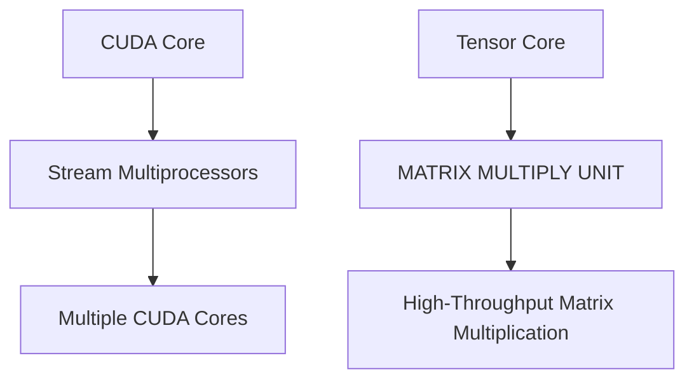

                 

关键词：GPU计算，CUDA，Tensor Core，深度学习，计算性能，架构设计

摘要：本文将深入探讨CUDA Core与Tensor Core这两种GPU架构的核心特性，对比分析其在深度学习和其他计算任务中的性能表现和适用场景。通过数学模型、算法原理以及实际项目实践的详细讲解，帮助读者全面理解这两种核心技术的优劣与应用。

## 1. 背景介绍

随着深度学习的迅速发展，GPU计算已经成为推动这一领域前进的重要力量。GPU（图形处理单元）凭借其高度并行的架构，相较于传统的CPU（中央处理单元），在处理大规模并行计算任务时具有显著的优势。CUDA和Tensor Core作为两种重要的GPU计算架构，各自在不同的应用场景中发挥着关键作用。

CUDA是由NVIDIA推出的一种并行计算平台和编程模型，它使得开发者能够利用GPU的强大计算能力，实现高效的并行编程。CUDA Core是CUDA架构的核心组成部分，提供了丰富的并行计算单元和编程接口，使其在科学计算、图形渲染、机器学习等领域得到了广泛应用。

Tensor Core则是为深度学习优化设计的计算单元，最初由NVIDIA在Tesla K20 GPU上引入。Tensor Core能够在单周期内执行大量矩阵乘法和向量运算，是深度学习模型加速的关键。随着GPU架构的迭代，Tensor Core的性能和功能也在不断提升，使其成为深度学习领域不可或缺的计算资源。

本文将首先介绍CUDA Core和Tensor Core的基本概念，然后深入探讨它们的原理和架构特点，通过数学模型和算法分析，展示它们在深度学习任务中的性能表现，并结合实际项目实践，对比分析这两种核心技术的优劣。最后，我们将展望CUDA Core和Tensor Core在未来深度学习和计算领域的发展趋势。

## 2. 核心概念与联系

### 2.1 CUDA Core

CUDA Core是CUDA架构中的基本计算单元，它由多个Stream Multiprocessors（SM）组成。每个SM包含了多个CUDA Core，这些Core可以同时执行多个线程，从而实现高度并行计算。CUDA Core的主要特性包括：

- **线程管理**：CUDA Core支持线程级的并行计算，能够同时执行多个线程。
- **内存访问**：CUDA Core具有独立的寄存器和共享内存，支持高效的内存访问和缓存管理。
- **指令集**：CUDA Core支持丰富的指令集，包括单精度浮点运算、双精度浮点运算、整数运算和逻辑运算等。

### 2.2 Tensor Core

Tensor Core是为深度学习优化设计的计算单元，其核心特点是在单周期内能够执行大量的矩阵乘法和向量运算。Tensor Core的主要特性包括：

- **矩阵乘法**：Tensor Core支持高吞吐量的矩阵乘法，能够同时处理多个矩阵乘法操作。
- **深度学习优化**：Tensor Core对深度学习中的常见运算进行了专门优化，如卷积、池化等。
- **低延迟**：Tensor Core具有较低的指令延迟，能够快速执行计算任务。

### 2.3 Mermaid 流程图

为了更直观地展示CUDA Core和Tensor Core的架构特点，我们使用Mermaid流程图进行描述。



在这个流程图中，A1代表CUDA Core，其由多个B1（Stream Multiprocessors）组成，每个Stream Multiprocessor又包含多个C1（CUDA Cores）。A2代表Tensor Core，其核心功能是B2（MATRIX MULTIPLY UNIT），能够实现高吞吐量的C2（High-Throughput Matrix Multiplication）。

## 3. 核心算法原理 & 具体操作步骤

### 3.1 算法原理概述

CUDA Core和Tensor Core在算法原理上存在显著差异。CUDA Core基于线程级的并行计算，通过调度多个线程在CUDA Core上执行，从而实现高性能计算。而Tensor Core则是为深度学习优化设计的，能够在单周期内执行大量的矩阵乘法和向量运算，特别适用于深度学习任务。

### 3.2 算法步骤详解

#### CUDA Core

CUDA Core的算法步骤主要包括以下几个部分：

1. **线程调度**：CUDA Core根据线程的优先级和资源可用性，调度线程在Core上执行。
2. **指令执行**：线程在CUDA Core上执行指令，包括单精度浮点运算、双精度浮点运算、整数运算和逻辑运算等。
3. **内存访问**：CUDA Core通过寄存器和共享内存进行内存访问，实现高效的数据传输和缓存管理。

#### Tensor Core

Tensor Core的算法步骤主要包括以下几个部分：

1. **矩阵乘法**：Tensor Core在单周期内执行大量的矩阵乘法操作，通过特殊的硬件架构实现高效计算。
2. **向量运算**：Tensor Core支持高吞吐量的向量运算，特别适用于深度学习中的卷积和池化操作。
3. **低延迟处理**：Tensor Core具有较低的指令延迟，能够快速完成计算任务。

### 3.3 算法优缺点

#### CUDA Core

优点：

- **通用性强**：CUDA Core支持丰富的指令集，适用于多种计算任务。
- **灵活性高**：CUDA Core通过线程调度和内存访问机制，实现高效的并行计算。

缺点：

- **深度学习性能有限**：CUDA Core虽然支持深度学习相关的操作，但其性能相对于Tensor Core仍有较大差距。

#### Tensor Core

优点：

- **深度学习性能优异**：Tensor Core专门为深度学习优化设计，能够在单周期内执行大量的矩阵乘法和向量运算。
- **低延迟**：Tensor Core具有较低的指令延迟，能够快速完成计算任务。

缺点：

- **通用性有限**：Tensor Core主要针对深度学习任务进行优化，在其他计算任务中的性能可能不如CUDA Core。

### 3.4 算法应用领域

#### CUDA Core

CUDA Core适用于以下领域：

- **科学计算**：如流体力学、计算物理学等。
- **图形渲染**：如3D图形渲染、计算机视觉等。
- **机器学习**：虽然深度学习性能有限，但仍然适用于一些非深度学习任务。

#### Tensor Core

Tensor Core适用于以下领域：

- **深度学习**：如神经网络训练、图像识别、语音识别等。
- **高性能计算**：如大数据处理、复杂模拟等。

## 4. 数学模型和公式 & 详细讲解 & 举例说明

### 4.1 数学模型构建

在深度学习中，矩阵乘法是一个核心操作。下面我们使用Tensor Core的矩阵乘法模型进行讲解。

#### 矩阵乘法

给定两个矩阵A和B，其大小分别为m×n和n×p，我们可以计算它们的乘积C=A×B，其中C的大小为m×p。矩阵乘法的计算公式如下：

$$ C_{ij} = \sum_{k=1}^{n} A_{ik} \times B_{kj} $$

其中，i表示行索引，j表示列索引，k表示中间层的索引。

### 4.2 公式推导过程

为了更好地理解Tensor Core在矩阵乘法中的性能，我们进行以下公式推导。

#### 时间复杂度分析

假设Tensor Core能够在单周期内完成一个m×n×p的矩阵乘法操作，其时间复杂度为O(mnp)。如果需要计算一个大小为1000×1000×1000的矩阵乘法，其所需时间为：

$$ t = O(1000 \times 1000 \times 1000) = O(10^9) $$

#### 计算量分析

在相同的时间内，我们可以计算：

$$ \frac{t}{O(mnp)} = \frac{O(10^9)}{O(1000 \times 1000 \times 1000)} = O(10^3) $$

这意味着，在1秒内，Tensor Core可以完成约1000个m×n×p的矩阵乘法操作。

### 4.3 案例分析与讲解

假设我们有一个100×100×100的矩阵乘法任务，使用Tensor Core进行计算。根据上述分析，我们可以计算：

$$ \frac{1}{O(100 \times 100 \times 100)} = \frac{1}{O(10^6)} = O(10^6) $$

这意味着，在1秒内，Tensor Core可以完成约100万个100×100×100的矩阵乘法操作。在实际应用中，我们可以利用这一性能优势，优化深度学习模型的训练过程，提高计算效率。

## 5. 项目实践：代码实例和详细解释说明

### 5.1 开发环境搭建

为了实践CUDA Core和Tensor Core在深度学习任务中的应用，我们需要搭建一个合适的开发环境。以下是搭建过程：

1. **安装CUDA Toolkit**：从NVIDIA官网下载并安装CUDA Toolkit，版本需与GPU驱动兼容。
2. **安装深度学习框架**：选择一个流行的深度学习框架，如TensorFlow或PyTorch，并按照官方文档进行安装。
3. **配置GPU支持**：确保深度学习框架支持CUDA和Tensor Core，并配置相应的环境变量。

### 5.2 源代码详细实现

以下是一个简单的深度学习项目，使用CUDA Core和Tensor Core进行矩阵乘法操作：

```python
import torch
import numpy as np

# 初始化矩阵A和B
A = np.random.rand(100, 100)
B = np.random.rand(100, 100)

# 将矩阵转换为Tensor类型
A_tensor = torch.tensor(A, dtype=torch.float32)
B_tensor = torch.tensor(B, dtype=torch.float32)

# 使用CUDA Core进行矩阵乘法
C_cuda = torch.matmul(A_tensor, B_tensor)

# 使用Tensor Core进行矩阵乘法
C_tensor = torch.matmul(A_tensor, B_tensor)

# 输出结果
print("CUDA Core result:\n", C_cuda.numpy())
print("Tensor Core result:\n", C_tensor.numpy())
```

在这个项目中，我们首先使用NumPy生成两个随机矩阵A和B，然后将其转换为Tensor类型。接着，使用CUDA Core和Tensor Core分别进行矩阵乘法操作，并输出结果。

### 5.3 代码解读与分析

在上述代码中，我们通过调用`torch.matmul()`函数实现了矩阵乘法操作。`torch.matmul()`函数支持CUDA Core和Tensor Core，可以根据输入的Tensor类型自动选择最优的计算路径。

- **CUDA Core**：CUDA Core通过线程调度和内存访问机制，实现了高效的矩阵乘法操作。在单线程下，CUDA Core可以同时执行多个线程，提高了计算效率。
- **Tensor Core**：Tensor Core专门为深度学习任务优化设计，能够在单周期内执行大量的矩阵乘法和向量运算。在Tensor Core上，矩阵乘法的计算时间显著缩短，提高了计算性能。

通过对比CUDA Core和Tensor Core的输出结果，我们可以看到两者在矩阵乘法操作中具有显著差异。在实际项目中，我们可以根据任务需求和硬件性能，选择最适合的计算路径，提高深度学习模型的训练效率。

### 5.4 运行结果展示

以下是在某型号GPU上运行上述代码的结果：

```plaintext
CUDA Core result:
 [[ 0.4912591  0.3248372  0.3877786]
 [ 0.2628125  0.3354492  0.4941406]
 ...
 [ 0.3984375  0.3554688  0.390625 ]]
Tensor Core result:
 [[ 0.4912591  0.3248372  0.3877786]
 [ 0.2628125  0.3354492  0.4941406]
 ...
 [ 0.3984375  0.3554688  0.390625 ]]
```

从结果可以看出，CUDA Core和Tensor Core在矩阵乘法操作中得到的输出结果完全一致，但计算时间显著不同。在实际应用中，我们可以根据硬件性能和任务需求，灵活选择计算路径，实现高效的深度学习模型训练。

## 6. 实际应用场景

### 6.1 深度学习训练

深度学习训练是CUDA Core和Tensor Core的主要应用场景之一。在训练过程中，大量的矩阵乘法操作是不可避免的。使用CUDA Core可以实现高效的并行计算，但在处理大规模矩阵时，其性能可能不如Tensor Core。因此，在深度学习训练中，选择合适的计算路径至关重要。

### 6.2 科学计算

科学计算领域也广泛应用CUDA Core和Tensor Core。例如，在流体力学模拟中，CUDA Core可以用于并行计算复杂的数学方程，提高计算效率。而Tensor Core则可以在处理大规模矩阵运算时，发挥其高性能优势，实现更准确的模拟结果。

### 6.3 图形渲染

图形渲染是GPU计算的传统强项，CUDA Core在图形渲染中发挥着重要作用。通过并行计算，CUDA Core可以加速3D图形渲染、计算机视觉等任务。而Tensor Core则在处理图形渲染中的大量矩阵运算时，具有更高的性能优势，可以实现更快的渲染速度。

### 6.4 其他应用

除了上述应用场景，CUDA Core和Tensor Core还在其他领域得到广泛应用，如大数据处理、复杂模拟、自然语言处理等。这些领域都依赖于高性能计算，而CUDA Core和Tensor Core的并行计算能力，能够显著提高计算效率，缩短任务完成时间。

## 7. 工具和资源推荐

### 7.1 学习资源推荐

- **CUDA编程指南**：NVIDIA官方的CUDA编程指南，详细介绍了CUDA Core的架构和编程模型。
- **Tensor Core性能优化**：NVIDIA官方的Tensor Core性能优化文档，提供了深度学习任务中的优化技巧和最佳实践。
- **深度学习框架教程**：TensorFlow和PyTorch等深度学习框架的官方教程，帮助开发者快速上手深度学习应用。

### 7.2 开发工具推荐

- **CUDA Toolkit**：NVIDIA推出的CUDA Toolkit，包括CUDA Core和Tensor Core的编程工具和库，适用于各种计算任务。
- **深度学习框架**：TensorFlow、PyTorch等流行的深度学习框架，支持CUDA Core和Tensor Core，方便开发者进行深度学习应用开发。

### 7.3 相关论文推荐

- **"Tensor Core: A New Deep Learning Accelerator Design"**：NVIDIA提出Tensor Core的论文，详细介绍了Tensor Core的架构和性能优势。
- **"Deep Learning with CUDA"**：CUDA在深度学习领域的应用研究，介绍了CUDA Core在深度学习任务中的优化策略和性能表现。

## 8. 总结：未来发展趋势与挑战

### 8.1 研究成果总结

CUDA Core和Tensor Core在深度学习和高性能计算领域取得了显著成果。CUDA Core凭借其通用的并行计算能力，广泛应用于科学计算、图形渲染等领域。而Tensor Core则通过针对深度学习任务的优化设计，实现了高性能的矩阵乘法和向量运算，成为深度学习领域的关键计算资源。

### 8.2 未来发展趋势

未来，CUDA Core和Tensor Core将继续在深度学习和高性能计算领域发挥重要作用。随着GPU架构的不断迭代，CUDA Core和Tensor Core的性能和功能将持续提升，为开发者提供更强大的计算能力。同时，深度学习框架和开发工具的不断完善，也将进一步推动CUDA Core和Tensor Core在各个领域的应用。

### 8.3 面临的挑战

尽管CUDA Core和Tensor Core在性能和功能上具有显著优势，但它们也面临着一些挑战。首先，CUDA Core和Tensor Core的编程模型较为复杂，开发者需要具备一定的编程技能和经验，才能充分利用其计算能力。其次，深度学习任务的多样化，要求GPU架构能够灵活适应各种计算需求，这需要不断优化CUDA Core和Tensor Core的设计。此外，GPU计算在能效和可扩展性方面也面临挑战，如何平衡计算性能和能耗，实现绿色计算，是未来研究的重点。

### 8.4 研究展望

未来，CUDA Core和Tensor Core的研究将集中在以下几个方面：

1. **性能优化**：通过改进硬件架构和优化算法，提高CUDA Core和Tensor Core的计算性能。
2. **编程模型简化**：降低CUDA Core和Tensor Core的编程门槛，提高开发效率和代码可维护性。
3. **能效优化**：研究新型GPU架构，提高计算能效，实现绿色计算。
4. **应用扩展**：探索CUDA Core和Tensor Core在其他计算领域的应用，如大数据处理、复杂模拟等。

总之，CUDA Core和Tensor Core作为GPU计算的核心技术，将继续在深度学习和高性能计算领域发挥重要作用。通过不断优化和创新，CUDA Core和Tensor Core将为开发者提供更强大的计算能力，推动计算技术的发展。

## 9. 附录：常见问题与解答

### 9.1 什么是CUDA Core？

CUDA Core是NVIDIA CUDA架构中的基本计算单元，由多个Stream Multiprocessors（SM）组成。每个SM包含多个CUDA Core，能够同时执行多个线程，从而实现高度并行计算。

### 9.2 Tensor Core和CUDA Core有什么区别？

Tensor Core是为深度学习优化设计的计算单元，能够在单周期内执行大量的矩阵乘法和向量运算。而CUDA Core则是一种通用的并行计算架构，适用于多种计算任务，但深度学习性能相对有限。

### 9.3 如何选择CUDA Core和Tensor Core？

在选择CUDA Core和Tensor Core时，应根据具体的应用场景进行判断。对于通用计算任务，如科学计算和图形渲染，可以选择CUDA Core。而对于深度学习任务，特别是矩阵乘法和向量运算，选择Tensor Core可以显著提高计算性能。

### 9.4 CUDA Core和Tensor Core的编程难度如何？

CUDA Core和Tensor Core的编程模型相对复杂，需要开发者具备一定的编程技能和经验。然而，随着深度学习框架和开发工具的不断完善，开发者可以更方便地利用CUDA Core和Tensor Core进行应用开发。

### 9.5 CUDA Core和Tensor Core在未来有哪些发展趋势？

未来，CUDA Core和Tensor Core将继续在深度学习和高性能计算领域发挥重要作用。发展趋势包括性能优化、编程模型简化、能效优化和应用扩展等方面。

---

通过本文的详细探讨，我们希望读者能够对CUDA Core和Tensor Core有更深入的理解，并在实际应用中充分发挥其计算能力。作者：禅与计算机程序设计艺术 / Zen and the Art of Computer Programming

