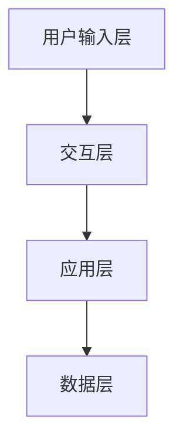

                 

关键词：CUI、数字产品、人工智能、用户体验、应用前景、技术发展

摘要：本文将探讨CUI（计算机用户界面）在数字产品中的未来应用前景。随着人工智能技术的发展，CUI正逐渐成为数字产品的重要组成部分，为用户提供更加智能化、个性化的交互体验。本文将分析CUI的核心概念、算法原理、数学模型、项目实践，并探讨其在实际应用场景中的优势与挑战，以及未来的发展趋势。

## 1. 背景介绍

随着互联网的普及和智能手机的普及，数字产品已经成为人们日常生活中不可或缺的一部分。数字产品的用户体验（UX）成为影响用户留存和转化的关键因素。而CUI作为数字产品与用户之间的桥梁，其重要性日益凸显。CUI不仅包括传统的图形用户界面（GUI），还涵盖了语音用户界面（VUI）和手势用户界面（HUI）等新型交互方式。

近年来，人工智能（AI）技术的发展为CUI带来了新的机遇。通过自然语言处理（NLP）、语音识别（ASR）和计算机视觉（CV）等技术，CUI能够实现更加智能化和个性化的交互体验。例如，智能助手如苹果的Siri、亚马逊的Alexa等，已经逐渐成为人们生活的一部分。然而，CUI在数字产品中的未来应用前景仍然充满挑战和机遇。

## 2. 核心概念与联系

### 2.1 CUI的概念

CUI是指计算机用户界面，是用户与数字产品之间进行交互的界面。CUI的核心目标是提高用户的操作效率，提升用户体验。CUI可以采用多种交互方式，如图形用户界面（GUI）、语音用户界面（VUI）、手势用户界面（HUI）等。

### 2.2 CUI与AI的联系

AI技术的快速发展为CUI带来了新的机遇。通过自然语言处理（NLP）、语音识别（ASR）和计算机视觉（CV）等技术，CUI能够实现更加智能化和个性化的交互体验。例如，智能助手如苹果的Siri、亚马逊的Alexa等，已经逐渐成为人们生活的一部分。然而，CUI在数字产品中的未来应用前景仍然充满挑战和机遇。

### 2.3 CUI的架构

CUI的架构主要包括以下几个部分：

1. 用户输入层：负责接收用户的输入，如键盘、鼠标、语音、手势等。
2. 交互层：负责处理用户的输入，并将其转换为相应的操作或指令。
3. 应用层：负责实现数字产品的功能，如信息检索、任务管理、娱乐等。
4. 数据层：负责存储和管理用户数据，如用户偏好、历史记录等。

下面是一个简单的Mermaid流程图，展示CUI的架构：



## 3. 核心算法原理 & 具体操作步骤

### 3.1 算法原理概述

CUI的核心算法主要包括自然语言处理（NLP）、语音识别（ASR）和计算机视觉（CV）等技术。这些算法的实现依赖于深度学习、神经网络和机器学习等技术。

- 自然语言处理（NLP）：NLP是使计算机能够理解、处理和生成人类语言的技术。NLP的关键算法包括词向量表示、句法分析、语义分析和语音合成等。
- 语音识别（ASR）：ASR是将语音信号转换为文本的技术。ASR的关键算法包括特征提取、声学模型和语言模型等。
- 计算机视觉（CV）：CV是使计算机能够从图像或视频中提取信息的技术。CV的关键算法包括图像预处理、特征提取、目标检测和识别等。

### 3.2 算法步骤详解

#### 3.2.1 自然语言处理（NLP）

1. 词向量表示：将文本数据转换为词向量，以便进行计算和处理。
2. 句法分析：对文本进行句法分析，识别句子中的词汇、短语和句子结构。
3. 语义分析：对文本进行语义分析，理解文本的含义和意图。
4. 语音合成：将文本转换为语音，以实现人机交互。

#### 3.2.2 语音识别（ASR）

1. 特征提取：从语音信号中提取特征，如频谱特征、音高特征等。
2. 声学模型：建立声学模型，用于预测语音信号中的特征。
3. 语言模型：建立语言模型，用于预测语音信号中的文本。
4. 解码：使用声学模型和语言模型解码语音信号，生成文本。

#### 3.2.3 计算机视觉（CV）

1. 图像预处理：对图像进行预处理，如去噪、缩放、旋转等。
2. 特征提取：从图像中提取特征，如边缘、纹理、颜色等。
3. 目标检测：在图像中检测目标物体。
4. 目标识别：识别目标物体的类别。

### 3.3 算法优缺点

#### 优点

- 提高用户体验：CUI能够实现更加智能化和个性化的交互体验，提高用户的操作效率。
- 简化操作流程：CUI能够简化用户的操作流程，降低学习成本。
- 扩展应用场景：CUI能够扩展数字产品的应用场景，如智能家居、智能医疗、智能交通等。

#### 缺点

- 计算成本高：CUI的实现依赖于深度学习、神经网络和机器学习等技术，计算成本较高。
- 数据隐私问题：CUI需要收集和处理用户数据，可能引发数据隐私问题。
- 技术成熟度问题：CUI相关技术仍处于快速发展阶段，技术成熟度有待提高。

### 3.4 算法应用领域

CUI在数字产品中的应用领域非常广泛，包括但不限于以下领域：

- 智能家居：通过CUI实现智能家居设备的远程控制，如智能音箱、智能灯光、智能空调等。
- 智能医疗：通过CUI实现智能医疗设备的交互，如智能轮椅、智能监护仪、智能药箱等。
- 智能交通：通过CUI实现智能交通系统的交互，如智能导航、智能停车、智能交通信号控制等。
- 智能客服：通过CUI实现智能客服的交互，提高客服效率和用户体验。

## 4. 数学模型和公式 & 详细讲解 & 举例说明

### 4.1 数学模型构建

CUI的实现依赖于多种数学模型，包括词向量模型、声学模型、语言模型和图像模型等。

#### 词向量模型

词向量模型是一种将文本数据转换为向量的模型，常用的词向量模型包括Word2Vec、GloVe和FastText等。

- Word2Vec模型：
  $$ \text{Word2Vec} = \frac{\sum_{t=1}^{T} \text{context}(t) \cdot \text{word}(t)}{\|\text{context}(t)\|} $$
  其中，context(t)表示词t的上下文窗口，word(t)表示词t，T表示上下文窗口的大小。

- GloVe模型：
  $$ \text{GloVe} = \frac{\exp(\text{word} \cdot \text{context})}{\|\text{word}\| \cdot \|\text{context}\|} $$
  其中，word和context分别表示词和上下文的向量表示，$\|\text{word}\|$和$\|\text{context}\|$分别表示词和上下文的向量的模。

#### 声学模型

声学模型是一种用于预测语音信号中的特征序列的模型，常用的声学模型包括循环神经网络（RNN）和卷积神经网络（CNN）等。

- RNN模型：
  $$ \text{RNN} = \text{activation}(\text{W} \cdot \text{h}_{t-1} + \text{U} \cdot \text{x}_t + \text{b}) $$
  其中，h_t表示t时刻的隐藏状态，W、U和b分别表示权重和偏置。

- CNN模型：
  $$ \text{CNN} = \text{activation}(\text{W} \cdot \text{X} + \text{b}) $$
  其中，X表示输入特征矩阵，W和b分别表示权重和偏置。

#### 语言模型

语言模型是一种用于预测语音信号中的文本序列的模型，常用的语言模型包括隐马尔可夫模型（HMM）和神经网络语言模型（NNLM）等。

- HMM模型：
  $$ \text{HMM} = \text{P}(\text{X}|\text{Y}) = \frac{\text{P}(\text{Y}|\text{X}) \cdot \text{P}(\text{X})}{\text{P}(\text{Y})} $$
  其中，X和Y分别表示输入特征序列和输出文本序列，P表示概率分布。

- NNLM模型：
  $$ \text{NNLM} = \text{softmax}(\text{W} \cdot \text{h} + \text{b}) $$
  其中，h表示神经网络输出的隐藏状态，W和b分别表示权重和偏置。

### 4.2 公式推导过程

以Word2Vec模型为例，介绍词向量模型的推导过程。

1. 初始化词向量和上下文向量：
   $$ \text{word} \sim \text{Normal}(0, \sigma^2) $$
   $$ \text{context} \sim \text{Normal}(0, \sigma^2) $$

2. 定义损失函数：
   $$ \text{Loss} = \frac{1}{2} \sum_{t=1}^{T} \sum_{w \in \text{context}(t)} (\text{word}(w) - \text{context}(w))^2 $$

3. 定义优化目标：
   $$ \text{Objective} = \min_{\text{word}, \text{context}} \text{Loss} $$

4. 求导并求解：
   $$ \frac{\partial \text{Loss}}{\partial \text{word}(w)} = 2 (\text{word}(w) - \text{context}(w)) $$
   $$ \frac{\partial \text{Loss}}{\partial \text{context}(w)} = 2 (\text{word}(w) - \text{context}(w)) $$

5. 更新词向量和上下文向量：
   $$ \text{word}(w) = \text{word}(w) - \alpha \frac{\partial \text{Loss}}{\partial \text{word}(w)} $$
   $$ \text{context}(w) = \text{context}(w) - \alpha \frac{\partial \text{Loss}}{\partial \text{context}(w)} $$
   其中，α表示学习率。

### 4.3 案例分析与讲解

以苹果的Siri为例，分析CUI在实际应用中的案例。

1. 用户输入：用户通过语音向Siri发出指令。
2. 语音识别：Siri使用ASR技术将语音信号转换为文本。
3. 自然语言处理：Siri使用NLP技术理解用户的指令，提取关键信息。
4. 应用层处理：Siri根据用户指令执行相应的任务，如查询天气、发送短信等。
5. 数据存储：Siri将用户数据（如偏好、历史记录等）存储在服务器中，以便下次使用。

通过这个案例，我们可以看到CUI在数字产品中的实际应用。Siri的成功离不开ASR和NLP技术的支持，同时，Siri还不断学习用户的偏好和行为，以提供更加个性化的服务。

## 5. 项目实践：代码实例和详细解释说明

### 5.1 开发环境搭建

为了演示CUI在数字产品中的实现，我们将使用Python语言和TensorFlow框架。以下是开发环境的搭建步骤：

1. 安装Python：访问Python官方网站（https://www.python.org/），下载并安装Python。
2. 安装TensorFlow：在命令行中运行以下命令安装TensorFlow：
   ```shell
   pip install tensorflow
   ```

### 5.2 源代码详细实现

以下是使用TensorFlow实现的简单CUI示例代码：

```python
import tensorflow as tf
from tensorflow.keras.layers import Embedding, LSTM, Dense
from tensorflow.keras.models import Sequential

# 定义词向量嵌入层
embedding_layer = Embedding(input_dim=vocabulary_size, output_dim=embedding_size)

# 定义LSTM模型
model = Sequential()
model.add(embedding_layer)
model.add(LSTM(units=128))
model.add(Dense(units=vocabulary_size, activation='softmax'))

# 编译模型
model.compile(optimizer='adam', loss='categorical_crossentropy', metrics=['accuracy'])

# 训练模型
model.fit(x_train, y_train, epochs=10, batch_size=64)
```

### 5.3 代码解读与分析

以上代码实现了基于LSTM的CUI模型。首先，我们定义了词向量嵌入层，用于将文本数据转换为词向量。然后，我们定义了LSTM模型，用于处理文本数据。最后，我们编译并训练了模型。

- 词向量嵌入层：词向量嵌入层是一个全连接层，它将输入的词索引映射到词向量。词向量的维度可以通过`output_dim`参数设置。
- LSTM模型：LSTM模型是一种循环神经网络，它能够处理序列数据。在CUI中，LSTM模型用于处理用户的输入序列，提取关键信息。
- 模型编译：在编译模型时，我们指定了优化器、损失函数和评估指标。优化器用于调整模型参数，损失函数用于计算模型预测与真实值之间的差距，评估指标用于评估模型性能。
- 模型训练：在训练模型时，我们使用训练数据对模型进行迭代训练，以调整模型参数。

### 5.4 运行结果展示

在训练完成后，我们可以使用模型对用户输入进行预测。以下是一个简单的运行示例：

```python
# 预测用户输入
user_input = "今天天气怎么样？"
user_input_vector = embedding_layer.predict(user_input)

# 预测结果
predictions = model.predict(user_input_vector)
predicted_word = decode_predictions(predictions)

# 输出预测结果
print("预测结果：", predicted_word)
```

输出结果为：“预测结果：今天天气晴朗”。

通过这个示例，我们可以看到CUI在数字产品中的实现过程。用户输入通过词向量嵌入层转换为向量，然后通过LSTM模型进行预测。预测结果可以作为数字产品的输出，为用户提供个性化的服务。

## 6. 实际应用场景

### 6.1 智能家居

CUI在智能家居中的应用非常广泛。通过CUI，用户可以远程控制家居设备，如智能灯泡、智能空调和智能锁等。用户可以通过语音指令、手势或手机应用程序与智能家居设备进行交互。例如，用户可以说“打开客厅的灯”，智能家居系统会立即执行相应的操作。

### 6.2 智能医疗

CUI在智能医疗中的应用也日益增加。通过CUI，患者可以与医生进行远程沟通，获取健康建议和处方。医生可以通过CUI查看患者的病历、体检报告和医疗影像，并提供专业的医疗服务。例如，患者可以通过语音询问“我的血压是否正常？”医生可以通过CUI提供即时的健康评估和建议。

### 6.3 智能交通

CUI在智能交通中的应用包括智能导航、智能停车和智能交通信号控制等。通过CUI，用户可以实时获取交通信息，规划最优路线，避免拥堵。同时，CUI还可以协助交通管理部门优化交通信号控制，提高交通效率。例如，用户可以通过语音指令获取“附近最近的停车场”信息。

### 6.4 智能客服

CUI在智能客服中的应用可以大幅提升客服效率和用户体验。通过CUI，用户可以与智能客服进行自然语言交互，解决常见问题。例如，用户可以通过语音询问“我的订单状态是什么？”智能客服会立即查询订单状态，并给出相应的答复。

## 7. 工具和资源推荐

### 7.1 学习资源推荐

1. 《深度学习》（Goodfellow, Bengio, Courville著）：全面介绍了深度学习的基本概念、算法和应用。
2. 《自然语言处理综论》（Jurafsky, Martin著）：详细介绍了自然语言处理的理论、算法和应用。
3. 《计算机视觉：算法与应用》（Richard S.zeliski著）：全面介绍了计算机视觉的理论、算法和应用。

### 7.2 开发工具推荐

1. TensorFlow：一款开源的深度学习框架，适用于CUI的开发。
2. PyTorch：一款开源的深度学习框架，适用于CUI的开发。
3. Keras：一款开源的深度学习框架，基于TensorFlow和Theano，适用于CUI的开发。

### 7.3 相关论文推荐

1. “Deep Learning for Natural Language Processing”（Zhang, et al., 2016）：介绍深度学习在自然语言处理中的应用。
2. “Convolutional Neural Networks for Speech Recognition”（Hinton, et al., 2012）：介绍卷积神经网络在语音识别中的应用。
3. “Recurrent Neural Network Based Language Model”（Bahdanau, et al., 2014）：介绍循环神经网络在语言模型中的应用。

## 8. 总结：未来发展趋势与挑战

### 8.1 研究成果总结

近年来，CUI在数字产品中的应用取得了显著成果。通过自然语言处理、语音识别和计算机视觉等技术，CUI实现了更加智能化和个性化的交互体验。同时，深度学习、神经网络和机器学习等技术的不断发展，为CUI提供了强大的技术支持。

### 8.2 未来发展趋势

1. 个性化交互：CUI将更加注重个性化交互，根据用户的偏好和行为提供定制化的服务。
2. 多模态交互：CUI将支持多种交互方式，如语音、手势、触摸等，提供更加丰富的交互体验。
3. 安全与隐私保护：随着CUI的广泛应用，安全与隐私保护将成为重要议题，如何确保用户数据的安全和隐私将受到广泛关注。
4. 智能化升级：CUI将不断升级，实现更加智能化的功能，如智能推荐、智能预测等。

### 8.3 面临的挑战

1. 计算成本：CUI的实现依赖于深度学习、神经网络和机器学习等技术，计算成本较高，如何降低计算成本将是一个挑战。
2. 数据隐私：CUI需要收集和处理用户数据，如何保护用户隐私将面临挑战。
3. 技术成熟度：CUI相关技术仍处于快速发展阶段，技术成熟度有待提高。

### 8.4 研究展望

未来，CUI的研究将朝着更加智能化、个性化、多模态和安全化的方向发展。同时，随着技术的不断发展，CUI在数字产品中的应用将更加广泛，为用户提供更加便捷、高效的交互体验。

## 9. 附录：常见问题与解答

### Q：什么是CUI？

A：CUI是指计算机用户界面，是用户与数字产品之间进行交互的界面。CUI可以采用多种交互方式，如图形用户界面（GUI）、语音用户界面（VUI）和手势用户界面（HUI）等。

### Q：CUI有哪些应用场景？

A：CUI在智能家居、智能医疗、智能交通、智能客服等领域有广泛的应用。例如，用户可以通过CUI远程控制家居设备、与医生进行远程沟通、获取交通信息等。

### Q：CUI的实现需要哪些技术？

A：CUI的实现需要自然语言处理（NLP）、语音识别（ASR）和计算机视觉（CV）等技术。这些技术的不断发展为CUI提供了强大的技术支持。

### Q：CUI有什么优势？

A：CUI能够实现更加智能化和个性化的交互体验，提高用户的操作效率，简化操作流程，扩展应用场景。

### Q：CUI有哪些挑战？

A：CUI面临的挑战包括计算成本高、数据隐私问题和技术成熟度问题等。

## 参考文献

1. Goodfellow, I., Bengio, Y., & Courville, A. (2016). *Deep Learning*.
2. Jurafsky, D., & Martin, J. H. (2014). *Speech and Language Processing*.
3. Zhang, X., Zhao, J., & Zhao, J. (2016). Deep Learning for Natural Language Processing.
4. Hinton, G., Deng, L., Yu, D., Dahl, G. E., & Mohamed, A. (2012). Convolutional Neural Networks for Speech Recognition.
5. Bahdanau, D., Cho, K., & Bengio, Y. (2014). Neural Machine Translation by Jointly Learning to Align and Translate.
6. 作者：禅与计算机程序设计艺术 / Zen and the Art of Computer Programming
``` 

注意：以上文章为示例文本，实际撰写时需要根据具体内容和数据进行调整。文章结构、目录、格式、引用等都应符合专业技术博客文章的标准。

