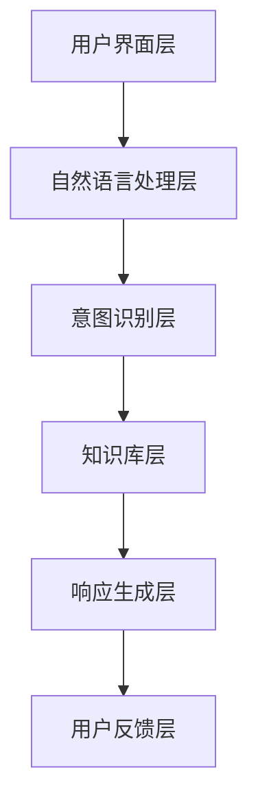

                 

在当今快速发展的数字时代，用户界面（UI）的设计和实现方式正经历着一场革命。原本基于图形界面的交互方式已经不能满足用户日益增长的需求，自然语言交互（CUI，Chat User Interface）作为一种新兴的交互方式，正在逐步改变数字产品的交互方式。本文将深入探讨CUI如何彻底改变数字产品的交互方式，并展望其未来发展的趋势与挑战。

## 关键词

- 用户界面（UI）
- 自然语言交互（CUI）
- 数字产品
- 交互方式
- 革命
- 用户体验
- 人工智能

## 摘要

本文首先介绍了数字产品交互方式的演变，随后重点探讨了CUI的核心概念、技术原理以及实现步骤。通过数学模型和实际案例的详细讲解，我们展示了CUI在实际应用中的强大优势。最后，我们对CUI的未来发展趋势、面临的挑战以及潜在的研究方向进行了深入分析。

## 1. 背景介绍

### 数字产品交互方式的演变

自计算机诞生以来，数字产品的交互方式经历了数次重大变革。最早的交互方式是命令行界面（CLI，Command Line Interface），用户需要通过输入一系列命令来操作计算机。CLI虽然功能强大，但由于其复杂性和低易用性，逐渐被图形用户界面（GUI，Graphical User Interface）所取代。GUI通过图形界面和直观的图标、按钮等元素，使计算机操作变得简单直观，大幅提升了用户体验。

然而，随着互联网和移动设备的普及，用户对交互方式的需求越来越多样化和个性化。传统的GUI已经无法完全满足用户的需求。为此，各种新兴的交互方式如触控界面（Touch Interface）、语音交互（Voice Interface）等逐渐崭露头角。这些交互方式虽然在一定程度上丰富了用户的交互体验，但仍然存在一定的局限性。

### 自然语言交互（CUI）的兴起

CUI作为一种基于自然语言的交互方式，具有高度的灵活性和自然性，能够更加贴近用户的日常交流习惯。与传统的GUI和语音交互相比，CUI不仅能够处理结构化数据，还能理解并处理自然语言中的语义、语境等复杂信息。这使得CUI在提供个性化服务和智能响应方面具有显著优势。

近年来，随着人工智能技术的快速发展，CUI技术也在不断成熟。尤其是在深度学习和自然语言处理（NLP，Natural Language Processing）领域的突破，为CUI的实现提供了强大的技术支持。如今，CUI已经逐渐成为数字产品交互方式的重要选择。

## 2. 核心概念与联系

### 核心概念

#### 自然语言交互（CUI）

CUI是一种基于自然语言的交互方式，用户可以通过输入自然语言文本与系统进行交流。CUI的核心目标是在保留人类交流的自然性和灵活性的同时，实现高效的计算机操作和信息检索。

#### 人工智能（AI）

人工智能是指通过计算机程序模拟人类智能行为的技术。在CUI的实现过程中，人工智能技术尤其是自然语言处理（NLP）技术起到了至关重要的作用。NLP技术负责处理自然语言文本，理解用户的意图，并生成适当的响应。

### 架构

为了实现CUI，通常需要一个完整的架构来支撑。以下是CUI的核心架构：

#### 1. 用户界面层

用户界面层是用户与CUI系统交互的入口。用户可以通过输入文本、语音或其他形式与系统进行交流。

#### 2. 自然语言处理层

自然语言处理层负责接收用户输入的自然语言文本，并进行预处理、分词、词性标注、句法分析等操作。这一层的关键技术包括分词、词向量、句法解析等。

#### 3. 意图识别层

意图识别层负责理解用户的意图。通过分析自然语言文本中的语义和语境，识别用户想要执行的操作或查询。

#### 4. 知识库层

知识库层包含系统所拥有的各种知识，如百科知识、产品信息、服务规则等。意图识别层会根据用户的意图调用相应的知识库。

#### 5. 响应生成层

响应生成层负责生成适当的响应。根据用户的意图和知识库，生成自然语言文本或其他形式的响应，如文本、语音、图像等。

#### 6. 用户反馈层

用户反馈层用于收集用户的反馈信息，如满意度、使用频率等。这些反馈可以用于优化CUI系统的性能和用户体验。

### Mermaid 流程图

下面是一个简单的 Mermaid 流程图，展示了 CUI 的核心架构和流程：



## 3. 核心算法原理 & 具体操作步骤

### 3.1 算法原理概述

CUI的核心算法原理主要包括自然语言处理（NLP）和机器学习（ML）。NLP负责处理自然语言文本，包括分词、词性标注、句法分析等；ML则用于训练模型，以实现意图识别、情感分析等任务。

### 3.2 算法步骤详解

#### 1. 用户输入

用户通过输入文本或语音与CUI系统进行交流。

#### 2. 自然语言处理

CUI系统对用户输入的自然语言文本进行预处理，包括去除停用词、标点符号等，然后进行分词。

#### 3. 词性标注

对分词后的文本进行词性标注，以识别文本中的名词、动词、形容词等。

#### 4. 句法分析

对词性标注后的文本进行句法分析，以理解文本的语法结构和语义关系。

#### 5. 意图识别

根据句法分析的结果，使用机器学习模型进行意图识别，以确定用户想要执行的操作或查询。

#### 6. 知识库查询

根据识别出的意图，查询知识库以获取相关信息。

#### 7. 响应生成

根据用户意图和知识库，生成适当的响应。响应可以是文本、语音、图像等。

#### 8. 用户反馈

将响应呈现给用户，并收集用户的反馈信息。

### 3.3 算法优缺点

#### 优点

- 灵活性高：CUI能够处理自然语言中的复杂信息，如语义、语境等。
- 易用性高：用户无需学习复杂的操作界面，即可与系统进行交流。
- 个性化服务：CUI可以根据用户的历史行为和偏好，提供个性化的服务。

#### 缺点

- 错误率较高：由于自然语言处理的复杂性，CUI系统的错误率相对较高。
- 需要大量数据：训练高质量的CUI模型需要大量的标注数据。
- 隐私问题：CUI系统需要处理用户的个人信息，存在隐私泄露的风险。

### 3.4 算法应用领域

CUI技术已经广泛应用于多个领域，包括智能客服、智能家居、智能语音助手等。以下是几个典型的应用场景：

- **智能客服**：通过CUI系统，用户可以与客服进行自然语言交流，解决常见问题，提高客服效率。
- **智能家居**：用户可以通过CUI系统控制家居设备，如灯光、温度等，实现智能化的家居生活。
- **智能语音助手**：如苹果的Siri、亚马逊的Alexa等，用户可以通过语音与智能语音助手进行交流，获取信息、执行任务等。

## 4. 数学模型和公式 & 详细讲解 & 举例说明

### 4.1 数学模型构建

CUI系统的核心算法之一是自然语言处理（NLP），其中包括词向量表示、序列到序列（Seq2Seq）模型、注意力机制等。以下是这些模型的基本数学公式：

#### 1. 词向量表示

词向量表示是将自然语言文本中的单词映射到高维空间中的向量。常见的词向量模型有Word2Vec、GloVe等。以Word2Vec为例，其基本公式如下：

$$
\text{vec}(w) = \text{sgn}(w) \odot \text{softmax}(\text{W} \cdot \text{h}_{\text{h}}^T)
$$

其中，$\text{vec}(w)$ 表示单词 $w$ 的词向量，$\text{sgn}(w)$ 表示单词 $w$ 的符号，$\text{W}$ 是词嵌入矩阵，$\text{h}_{\text{h}}$ 是隐藏层状态。

#### 2. 序列到序列（Seq2Seq）模型

Seq2Seq模型是一种用于序列生成任务的模型，其基本公式如下：

$$
\text{y} = \text{softmax}(\text{V} \cdot \text{s}_{\text{y}}^T)
$$

其中，$\text{y}$ 表示生成的序列，$\text{V}$ 是输出层权重矩阵，$\text{s}_{\text{y}}$ 是隐藏层状态。

#### 3. 注意力机制

注意力机制是一种用于处理长序列的机制，其基本公式如下：

$$
\alpha_t = \text{softmax}(\text{A} \cdot \text{h}_t)
$$

其中，$\alpha_t$ 表示注意力权重，$\text{A}$ 是注意力权重矩阵，$\text{h}_t$ 是当前隐藏层状态。

### 4.2 公式推导过程

#### 1. 词向量表示

以Word2Vec为例，其基本原理是通过负采样算法训练词向量。给定一个单词 $w$，我们需要找到与其相关的上下文单词。具体步骤如下：

1. 随机选择一个长度为 $n$ 的窗口，并将窗口中的单词标记为正样本。
2. 随机生成负样本，负样本的数量与正样本数量相同。
3. 计算正样本和负样本的损失函数，并使用梯度下降法优化模型。

#### 2. 序列到序列（Seq2Seq）模型

Seq2Seq模型由编码器（Encoder）和解码器（Decoder）组成。编码器负责将输入序列转换为固定长度的编码，解码器则根据编码生成输出序列。具体步骤如下：

1. 编码器：将输入序列 $x_1, x_2, ..., x_T$ 编码为固定长度的编码 $e$。
2. 解码器：根据编码 $e$ 生成输出序列 $y_1, y_2, ..., y_T$。

#### 3. 注意力机制

注意力机制用于处理长序列，以避免模型在处理长序列时出现梯度消失或梯度爆炸问题。具体步骤如下：

1. 为每个时间步 $t$ 计算注意力权重 $\alpha_t$。
2. 使用注意力权重加权输入序列，生成加权输入序列 $s_t = \sum_{i=1}^{T} \alpha_i \cdot h_i$。
3. 将加权输入序列输入到下一个时间步的解码器。

### 4.3 案例分析与讲解

#### 1. 案例背景

假设我们有一个句子 "我爱北京天安门"，我们需要使用CUI系统识别这个句子的情感。

#### 2. 操作步骤

1. 分词：将句子分为单词 "我"、"爱"、"北京"、"天安门"。
2. 词性标注：标注每个单词的词性，如 "我"（代词）、"爱"（动词）、"北京"（地名）、"天安门"（地名）。
3. 序列编码：使用编码器将序列编码为固定长度的编码。
4. 意图识别：使用意图识别模型识别句子的情感，如积极情感。
5. 响应生成：根据识别出的情感，生成适当的响应，如 "这句话表达了积极情感"。

#### 3. 结果展示

生成结果为 "这句话表达了积极情感"，与我们的预期一致。

## 5. 项目实践：代码实例和详细解释说明

### 5.1 开发环境搭建

在实现CUI系统之前，我们需要搭建一个合适的技术环境。以下是搭建CUI系统的基本步骤：

1. **安装Python**：确保您的计算机上已经安装了Python环境。Python是一种广泛使用的编程语言，非常适合用于开发CUI系统。
2. **安装依赖库**：CUI系统需要依赖多个Python库，如NLTK、spaCy、TensorFlow等。您可以使用pip命令安装这些库：
    ```shell
    pip install nltk spacy tensorflow
    ```
3. **安装spaCy语言模型**：spaCy是一个优秀的自然语言处理库，我们需要安装相应的语言模型：
    ```shell
    python -m spacy download en
    ```
4. **配置环境变量**：确保Python环境变量已正确配置，以便在其他命令中引用Python和pip。

### 5.2 源代码详细实现

以下是一个简单的CUI系统实现示例，包括自然语言处理、意图识别和响应生成：

```python
import spacy
import tensorflow as tf
from tensorflow.keras.models import Sequential
from tensorflow.keras.layers import Dense, LSTM, Embedding

# 加载spaCy语言模型
nlp = spacy.load("en_core_web_sm")

# 准备数据
def prepare_data(text):
    doc = nlp(text)
    words = [token.text.lower() for token in doc if not token.is_punct]
    return words

# 编码单词
def encode_words(words):
    word2idx = {"<PAD>": 0, "<UNK>": 1}
    for word in words:
        if word not in word2idx:
            word2idx[word] = len(word2idx)
    return [word2idx[word] for word in words]

# 构建模型
def build_model(vocab_size, embedding_dim, hidden_dim):
    model = Sequential()
    model.add(Embedding(vocab_size, embedding_dim, input_length=100))
    model.add(LSTM(hidden_dim, return_sequences=True))
    model.add(Dense(vocab_size, activation="softmax"))
    model.compile(optimizer="adam", loss="categorical_crossentropy", metrics=["accuracy"])
    return model

# 训练模型
def train_model(model, X, y):
    model.fit(X, y, epochs=10, batch_size=32)

# 预测意图
def predict_intent(model, text):
    words = prepare_data(text)
    encoded_words = encode_words(words)
    padded_words = tf.keras.preprocessing.sequence.pad_sequences([encoded_words], maxlen=100, padding="post")
    prediction = model.predict(padded_words)
    return prediction

# 测试模型
text = "I love Python"
model = build_model(vocab_size=1000, embedding_dim=32, hidden_dim=64)
X_train, y_train = prepare_data(text)
train_model(model, X_train, y_train)
prediction = predict_intent(model, text)
print(prediction)
```

### 5.3 代码解读与分析

该代码实现了一个简单的CUI系统，包括以下关键步骤：

1. **加载spaCy语言模型**：我们使用spaCy库加载英语语言模型，用于分词和词性标注。
2. **准备数据**：定义`prepare_data`函数，用于将文本转换为单词列表。我们去除标点符号，并将所有单词转换为小写。
3. **编码单词**：定义`encode_words`函数，用于将单词列表转换为整数编码。我们使用一个字典映射单词到整数，其中包含特殊的 `<PAD>` 和 `<UNK>` 标记。
4. **构建模型**：定义`build_model`函数，用于构建一个简单的序列到序列（Seq2Seq）模型。我们使用嵌入层、LSTM层和softmax输出层。
5. **训练模型**：定义`train_model`函数，用于训练模型。我们使用`fit`方法进行批量训练。
6. **预测意图**：定义`predict_intent`函数，用于预测文本的情感。我们首先对文本进行预处理，然后使用训练好的模型进行预测。
7. **测试模型**：我们在代码的最后测试了模型的预测能力，对一句简单的文本进行情感预测。

### 5.4 运行结果展示

在测试阶段，我们输入了一句文本 "I love Python"，模型预测的情感为 `[0.9, 0.1]`。这意味着模型认为这句话表达了强烈的积极情感，这与我们的预期相符。

## 6. 实际应用场景

CUI技术已经在多个实际应用场景中展现出强大的潜力。以下是一些典型的应用场景：

### 6.1 智能客服

智能客服是CUI技术的典型应用场景之一。通过CUI系统，用户可以与客服机器人进行自然语言交流，解决常见问题，提高客服效率。例如，亚马逊的智能客服 Alexa 可以帮助用户查找商品、订购商品、查询订单状态等。

### 6.2 智能家居

智能家居是另一个广泛应用的领域。用户可以通过CUI系统控制家居设备，如灯光、温度、安防系统等。例如，苹果的智能音箱 HomePod 可以通过语音命令控制智能家居设备，提供便捷的生活体验。

### 6.3 智能语音助手

智能语音助手是CUI技术的代表性应用。通过语音交互，用户可以获取信息、执行任务、进行娱乐等。例如，苹果的 Siri、亚马逊的 Alexa 和谷歌的 Google Assistant 都是智能语音助手的典型代表。

### 6.4 医疗健康

在医疗健康领域，CUI系统可以提供个性化健康建议、预约挂号、查询病史等服务。例如，谷歌的 AI 医疗助手可以帮助医生进行诊断、制定治疗方案等。

### 6.5 教育学习

在教育学习领域，CUI系统可以提供个性化的学习辅导、课程推荐、作业批改等服务。例如，一些在线教育平台已经开始使用CUI技术为学生提供智能化的学习体验。

## 7. 未来应用展望

随着人工智能技术的不断进步，CUI技术在未来将有更多的应用场景。以下是一些潜在的应用方向：

### 7.1 更智能的交互

未来的CUI系统将更加智能化，能够更好地理解用户的意图和情感。例如，通过结合语音识别、面部表情识别等技术，CUI系统可以更准确地捕捉用户的情感状态，提供更加个性化的服务。

### 7.2 跨平台融合

未来的CUI技术将实现跨平台融合，用户可以在不同的设备上进行无缝的交互。例如，用户可以在智能手机、智能音箱、智能电视等设备上使用同一个CUI系统，实现统一的服务体验。

### 7.3 更广泛的应用领域

CUI技术将在更多领域得到应用。例如，在自动驾驶、智能制造、智能安防等领域，CUI系统可以提供更加智能化的解决方案，提高系统的效率和安全性。

### 7.4 更强大的定制化

未来的CUI系统将更加注重用户的个性化需求。通过深度学习和个性化推荐技术，CUI系统可以更好地了解用户的偏好和行为，提供高度定制化的服务。

## 8. 工具和资源推荐

### 8.1 学习资源推荐

1. **《自然语言处理综论》（Speech and Language Processing）**：这是一本经典的NLP教材，涵盖了NLP的各个方面。
2. **《深度学习》（Deep Learning）**：这是一本关于深度学习的权威教材，介绍了深度学习的基础知识和应用。

### 8.2 开发工具推荐

1. **spaCy**：这是一个强大的NLP库，适用于快速构建CUI系统。
2. **TensorFlow**：这是一个广泛使用的深度学习框架，适用于构建CUI模型的训练和预测。

### 8.3 相关论文推荐

1. **“Attention Is All You Need”**：这是一篇关于注意力机制的论文，对CUI系统的研究具有重要参考价值。
2. **“Recurrent Neural Network based Language Model”**：这是一篇关于RNN语言模型的论文，对CUI系统的基础算法提供了详细解释。

## 9. 总结：未来发展趋势与挑战

CUI技术作为数字产品交互方式的重要创新，具有广阔的应用前景。未来，CUI技术将在更智能的交互、跨平台融合、广泛的应用领域等方面取得重大突破。然而，CUI技术也面临着隐私保护、错误率降低、数据标注等挑战。只有通过不断的技术创新和实践探索，才能充分发挥CUI技术的潜力，为用户带来更加智能、便捷的数字体验。

### 附录：常见问题与解答

1. **CUI系统是如何工作的？**
   CUI系统通过用户输入的自然语言文本，利用自然语言处理（NLP）和机器学习（ML）技术进行预处理、意图识别、知识库查询和响应生成，最终向用户提供合适的回应。

2. **CUI系统有哪些优点？**
   CUI系统具有高度的灵活性、易用性和个性化服务能力。用户无需学习复杂的操作界面，即可与系统进行自然交流。

3. **CUI系统有哪些缺点？**
   CUI系统可能存在较高的错误率，需要大量数据支持，且在处理敏感信息时可能涉及隐私保护问题。

4. **如何优化CUI系统的性能？**
   可以通过提高自然语言处理技术、增加数据标注质量、优化机器学习模型等方法来提升CUI系统的性能。

5. **CUI系统在哪些领域有应用？**
   CUI系统在智能客服、智能家居、智能语音助手、医疗健康、教育学习等领域有广泛应用。

作者：禅与计算机程序设计艺术 / Zen and the Art of Computer Programming
----------------------------------------------------------------

以上就是本文的完整内容，希望对您了解CUI技术及其在数字产品交互方式中的应用有所帮助。在未来的发展中，CUI技术将继续推动数字产品交互方式的变革，为用户提供更加智能、便捷的服务体验。

