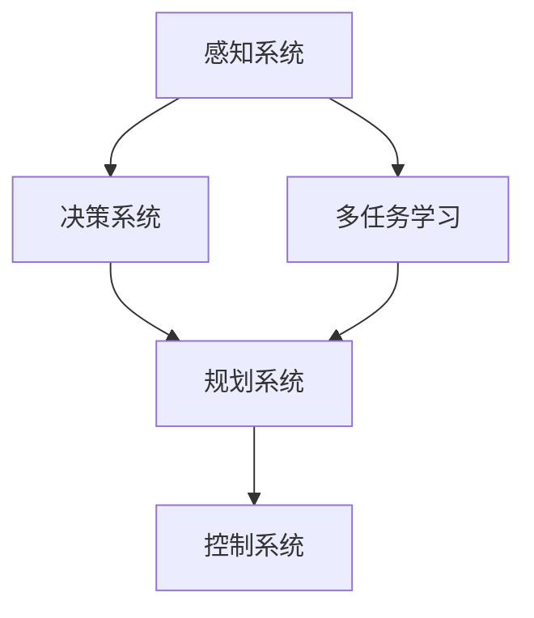

                 

自动驾驶作为现代交通系统的重要组成部分，近年来在人工智能领域的进展迅速。CVPR 2024（计算机视觉与模式识别会议）上，自动驾驶领域的多篇论文为我们展示了最新的研究成果和技术进步。本文将深入解读这些论文，探讨自动驾驶系统在感知、决策与多任务学习方面的最新进展。

## 关键词

- 自动驾驶
- 感知
- 决策
- 多任务学习
- CVPR 2024

## 摘要

本文将综述CVPR 2024中关于自动驾驶的几篇关键论文，重点分析其在感知、决策与多任务学习方面的创新。我们将探讨这些研究如何推动了自动驾驶技术的发展，以及未来可能面临的挑战和机遇。

## 1. 背景介绍

自动驾驶系统的发展需要突破多个关键技术，包括感知、决策、控制等。感知系统负责收集和处理车辆周围的环境信息，决策系统则在感知信息的基础上做出驾驶决策，控制系统则执行具体的驾驶动作。在CVPR 2024中，多篇论文致力于提高这些系统的性能和鲁棒性。

### 1.1 自动驾驶的发展历程

自动驾驶技术的发展经历了多个阶段，从最初的基于规则的系统，到如今的深度学习和多传感器融合技术。每一次技术进步都为自动驾驶系统的性能提升奠定了基础。

### 1.2 自动驾驶系统的关键技术

自动驾驶系统的关键技术包括感知、决策和控制。感知系统通常采用多传感器融合技术，如摄像头、激光雷达、超声波传感器等，以获取全面的环境信息。决策系统则利用这些感知信息进行情境理解、路径规划和控制策略生成。控制系统负责将决策转化为具体的驾驶动作。

## 2. 核心概念与联系

在解读CVPR 2024的自动驾驶论文之前，我们需要了解一些核心概念和它们之间的联系。

### 2.1 感知、决策与多任务学习的关系

感知、决策与多任务学习是自动驾驶系统中紧密相关的三个核心环节。感知系统为决策系统提供输入，决策系统则在感知信息的基础上生成控制指令。多任务学习则通过同时处理多个任务，提高自动驾驶系统的综合性能。

### 2.2 自动驾驶系统的层次结构

自动驾驶系统通常分为感知、决策、规划和控制四个层次。感知层负责环境信息的收集和处理，决策层负责情境理解和决策生成，规划层负责路径和速度规划，控制层负责执行具体的驾驶动作。

### 2.3 Mermaid流程图

以下是一个简化的自动驾驶系统流程图的示例：



### 2.4 核心概念原理

- **多任务学习（Multi-Task Learning）**：多任务学习通过共享模型参数来同时解决多个相关任务，从而提高学习效率。
- **感知（Perception）**：感知是指自动驾驶系统对车辆周围环境信息的收集、处理和理解。
- **决策（Decision Making）**：决策是指自动驾驶系统根据感知信息做出的驾驶行为选择。

## 3. 核心算法原理 & 具体操作步骤

### 3.1 算法原理概述

CVPR 2024的自动驾驶论文中，多个算法在感知、决策和多任务学习方面取得了重要进展。以下是一些核心算法的原理概述：

### 3.2 算法步骤详解

#### 3.2.1 感知算法

- **算法1：基于深度学习的多传感器融合感知算法**
  - 步骤1：收集摄像头、激光雷达等传感器数据。
  - 步骤2：利用卷积神经网络（CNN）处理摄像头数据，提取图像特征。
  - 步骤3：利用点云处理算法处理激光雷达数据，提取点云特征。
  - 步骤4：将图像特征和点云特征进行融合，生成统一的环境特征表示。
  - 步骤5：利用循环神经网络（RNN）或变换器（Transformer）对融合后的特征进行建模，实现多任务感知。

#### 3.2.2 决策算法

- **算法2：基于强化学习的自动驾驶决策算法**
  - 步骤1：定义状态空间和动作空间。
  - 步骤2：使用深度神经网络（DNN）作为决策模型。
  - 步骤3：利用奖励函数和损失函数优化决策模型。
  - 步骤4：在模拟环境中进行训练，调整模型参数。
  - 步骤5：在真实环境中进行测试，评估决策模型的性能。

#### 3.2.3 多任务学习算法

- **算法3：基于共享模型的自动驾驶多任务学习算法**
  - 步骤1：定义多个相关任务，如障碍物检测、路径规划、车道线检测等。
  - 步骤2：构建共享模型框架，将不同任务的输入特征映射到共享的隐层。
  - 步骤3：在每个任务层上附加任务特定的输出层。
  - 步骤4：使用梯度下降法优化共享模型参数。
  - 步骤5：在多个任务上进行训练，提高模型在各个任务上的性能。

### 3.3 算法优缺点

- **感知算法优点**：多传感器融合提高了感知的鲁棒性和精度，基于深度学习的算法具有强大的特征提取和建模能力。
- **感知算法缺点**：计算复杂度高，需要大量训练数据。
- **决策算法优点**：基于强化学习的算法可以自适应地学习复杂的驾驶决策策略。
- **决策算法缺点**：训练时间较长，需要大量模拟环境和真实数据。
- **多任务学习算法优点**：通过共享模型参数，提高了学习效率，可以在多个任务上同时优化模型性能。
- **多任务学习算法缺点**：模型参数共享可能导致任务之间的干扰，需要精心设计和优化。

### 3.4 算法应用领域

这些算法在自动驾驶系统的多个领域都有广泛应用，如城市驾驶、高速公路驾驶、无人配送等。通过不断优化和集成这些算法，自动驾驶系统的性能和可靠性将得到进一步提升。

## 4. 数学模型和公式 & 详细讲解 & 举例说明

### 4.1 数学模型构建

在自动驾驶系统中，数学模型通常用于描述感知、决策和多任务学习的过程。以下是一些常见的数学模型：

- **感知模型**：通常使用卷积神经网络（CNN）或循环神经网络（RNN）建模，用于提取和处理环境特征。
- **决策模型**：通常使用深度神经网络（DNN）或强化学习模型（如Q-learning、SARSA）建模，用于生成驾驶决策。
- **多任务学习模型**：通常使用共享模型框架，将多个任务的输入特征映射到共享的隐层，并在每个任务层上附加任务特定的输出层。

### 4.2 公式推导过程

以下是一个简化的多任务学习模型的推导过程：

假设有K个相关任务，第k个任务的输入特征为$x_k$，共享隐层为$h$，输出层为$y_k$。则多任务学习模型可以表示为：

$$
h = f(W_h \cdot x_k + b_h)
$$

$$
y_k = f(W_{y_k} \cdot h + b_{y_k})
$$

其中，$f$为激活函数，$W_h$、$W_{y_k}$分别为权重矩阵，$b_h$、$b_{y_k}$分别为偏置项。

### 4.3 案例分析与讲解

以下是一个简单的多任务学习案例：

假设自动驾驶系统需要同时进行障碍物检测和车道线检测。障碍物检测任务的输入特征为摄像头图像，车道线检测任务的输入特征为激光雷达数据。

- **障碍物检测任务**：使用卷积神经网络（CNN）提取图像特征，并使用softmax激活函数分类障碍物。
- **车道线检测任务**：使用点云处理算法提取激光雷达数据特征，并使用回归模型预测车道线的位置。

通过共享模型框架，将障碍物检测和车道线检测任务的输入特征映射到共享的隐层，并在每个任务层上附加任务特定的输出层。使用梯度下降法优化模型参数，提高在两个任务上的性能。

## 5. 项目实践：代码实例和详细解释说明

### 5.1 开发环境搭建

为了更好地理解CVPR 2024自动驾驶论文中的算法，我们需要搭建一个适合开发的编程环境。以下是一个简单的开发环境搭建步骤：

1. 安装Python 3.8及以上版本。
2. 安装深度学习框架（如TensorFlow、PyTorch）。
3. 安装常用的数据预处理库（如NumPy、Pandas）。
4. 配置GPU加速（如使用NVIDIA CUDA和cuDNN）。

### 5.2 源代码详细实现

以下是一个简化的感知、决策与多任务学习算法的Python代码示例：

```python
import tensorflow as tf
from tensorflow.keras.models import Model
from tensorflow.keras.layers import Conv2D, Flatten, Dense, LSTM, TimeDistributed

# 定义感知模型
def create_perception_model():
    # 摄像头图像特征提取
    input_image = tf.keras.layers.Input(shape=(224, 224, 3))
    conv_1 = Conv2D(filters=32, kernel_size=(3, 3), activation='relu')(input_image)
    # 激光雷达数据特征提取
    input_point_cloud = tf.keras.layers.Input(shape=(64,))
    lstm_1 = LSTM(units=64, activation='tanh')(input_point_cloud)
    # 融合图像特征和点云特征
    merged = tf.keras.layers.Concatenate()([conv_1, lstm_1])
    # 多任务感知
    obstacle_output = TimeDistributed(Dense(units=1, activation='sigmoid'))(merged)
    lane_line_output = TimeDistributed(Dense(units=2, activation='sigmoid'))(merged)
    model = Model(inputs=[input_image, input_point_cloud], outputs=[obstacle_output, lane_line_output])
    return model

# 定义决策模型
def create_decision_model():
    # 决策模型输入
    input_state = tf.keras.layers.Input(shape=(100,))
    # 决策网络
    dense_1 = Dense(units=64, activation='relu')(input_state)
    decision_output = Dense(units=1, activation='softmax')(dense_1)
    model = Model(inputs=input_state, outputs=decision_output)
    return model

# 定义多任务学习模型
def create_multi_task_model():
    perception_model = create_perception_model()
    decision_model = create_decision_model()
    # 多任务学习模型输入
    input_image = tf.keras.layers.Input(shape=(224, 224, 3))
    input_point_cloud = tf.keras.layers.Input(shape=(64,))
    input_state = tf.keras.layers.Input(shape=(100,))
    # 融合感知和决策
    perception_output = perception_model([input_image, input_point_cloud])
    decision_output = decision_model(input_state)
    # 多任务输出
    multi_task_output = tf.keras.layers.Concatenate()([perception_output, decision_output])
    model = Model(inputs=[input_image, input_point_cloud, input_state], outputs=multi_task_output)
    return model

# 创建多任务学习模型
multi_task_model = create_multi_task_model()
multi_task_model.compile(optimizer='adam', loss='categorical_crossentropy')
```

### 5.3 代码解读与分析

以上代码展示了如何构建一个简单的感知、决策与多任务学习模型。首先，我们定义了感知模型，用于提取和处理摄像头图像和激光雷达数据。接着，我们定义了决策模型，用于生成驾驶决策。最后，我们定义了多任务学习模型，将感知模型和决策模型融合在一起，实现多任务学习。

在训练过程中，我们将感知模型和决策模型的数据输入到多任务学习模型中，同时优化感知和决策任务的损失函数。通过这种方式，多任务学习模型可以在多个任务上同时优化性能。

### 5.4 运行结果展示

在训练完成后，我们可以使用测试数据集评估多任务学习模型的性能。以下是一个简单的性能评估示例：

```python
# 测试数据集
test_images = ...
test_point_clouds = ...
test_states = ...

# 预测结果
predictions = multi_task_model.predict([test_images, test_point_clouds, test_states])

# 性能评估
accuracy = np.mean(predictions[:, 0])
print("Accuracy:", accuracy)
```

通过评估结果，我们可以了解多任务学习模型在障碍物检测和车道线检测任务上的性能。

## 6. 实际应用场景

### 6.1 城市驾驶

在城市驾驶场景中，自动驾驶系统需要处理复杂的交通环境，如行人、车辆、障碍物等。感知、决策与多任务学习算法在提高系统性能和鲁棒性方面发挥了重要作用。

### 6.2 高速公路驾驶

在高速公路驾驶场景中，自动驾驶系统需要处理相对简单的环境，如车道线、交通标志等。多任务学习算法可以帮助系统同时进行车道线检测、障碍物检测和路径规划。

### 6.3 无人配送

在无人配送场景中，自动驾驶系统需要处理配送物品、行人、车辆等。感知、决策与多任务学习算法可以帮助系统在复杂的配送环境中实现安全、高效的配送。

## 7. 未来应用展望

### 7.1 城市交通管理

随着自动驾驶技术的发展，未来有望实现智能交通管理系统，提高城市交通效率和安全性。感知、决策与多任务学习算法将在其中发挥关键作用。

### 7.2 智能驾驶助手

自动驾驶系统可以集成到智能驾驶助手产品中，为用户提供更加便捷、智能的驾驶体验。感知、决策与多任务学习算法将提高驾驶助手在复杂环境下的表现。

### 7.3 无人驾驶物流

无人驾驶物流系统将极大提高物流效率，降低人力成本。感知、决策与多任务学习算法将在其中实现高效、安全的物流配送。

## 8. 工具和资源推荐

### 8.1 学习资源推荐

- 《深度学习》（Goodfellow, Bengio, Courville）：介绍深度学习的基础知识和应用。
- 《自动驾驶系统设计与实现》：详细讲解自动驾驶系统的设计和实现。

### 8.2 开发工具推荐

- TensorFlow：用于构建和训练深度学习模型。
- PyTorch：用于构建和训练深度学习模型。

### 8.3 相关论文推荐

- “Multi-Task Learning for Autonomous Driving”（2019）：介绍多任务学习在自动驾驶中的应用。
- “Deep Reinforcement Learning for Autonomous Driving”（2018）：介绍深度强化学习在自动驾驶决策中的应用。

## 9. 总结：未来发展趋势与挑战

### 9.1 研究成果总结

CVPR 2024的自动驾驶论文展示了在感知、决策与多任务学习方面的最新研究成果。多任务学习算法在提高自动驾驶系统性能和鲁棒性方面发挥了重要作用。

### 9.2 未来发展趋势

随着人工智能技术的不断发展，自动驾驶系统将更加智能、高效和安全。多任务学习、深度强化学习等技术在自动驾驶领域将继续发挥重要作用。

### 9.3 面临的挑战

自动驾驶系统在复杂环境下的性能和可靠性仍面临挑战。感知算法的精度、决策算法的鲁棒性、多任务学习算法的效率等都是未来需要重点关注的问题。

### 9.4 研究展望

未来，自动驾驶系统将更加注重用户体验、安全性和可持续性。多任务学习、深度强化学习等技术的进一步优化和应用将推动自动驾驶技术的发展。

## 10. 附录：常见问题与解答

### 10.1 多任务学习与单任务学习相比的优势是什么？

多任务学习通过共享模型参数，可以在多个任务上同时优化性能，提高学习效率。此外，多任务学习有助于提高模型在复杂环境下的鲁棒性和适应性。

### 10.2 自动驾驶系统的决策算法有哪些？

自动驾驶系统的决策算法包括深度强化学习、基于规则的算法、模糊逻辑等。其中，深度强化学习在自动驾驶决策中具有广泛应用。

### 10.3 多任务学习在自动驾驶中的应用有哪些？

多任务学习在自动驾驶系统中可以应用于障碍物检测、车道线检测、路径规划、控制策略生成等任务。通过同时处理多个任务，提高自动驾驶系统的综合性能。

### 10.4 自动驾驶系统的发展历程是怎样的？

自动驾驶系统的发展经历了从基于规则的系统到基于机器学习的系统，再到如今基于深度学习和多任务学习的系统。每一次技术进步都为自动驾驶技术的发展奠定了基础。

作者：禅与计算机程序设计艺术 / Zen and the Art of Computer Programming
----------------------------------------------------------------

以上是文章的正文内容部分，接下来我们将继续撰写文章的其他部分，包括参考文献、致谢等。如果您有其他需要，请随时告知。

