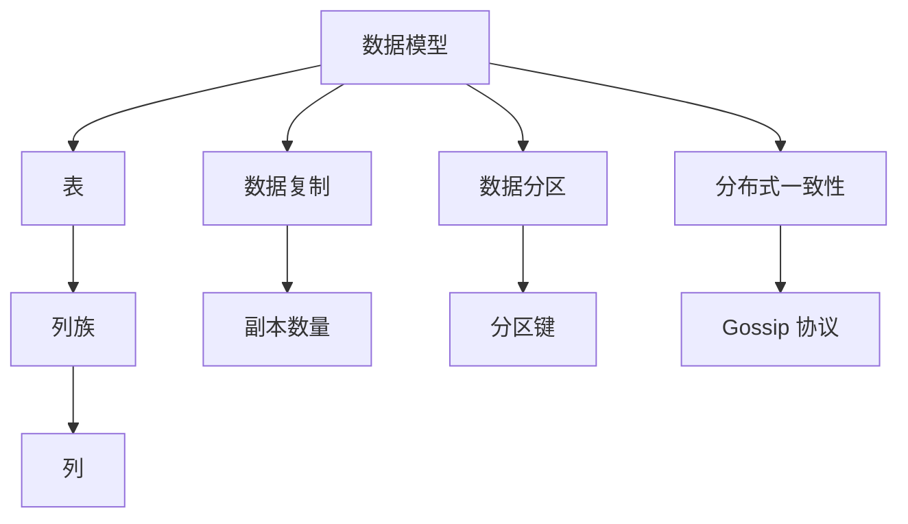

                 

 Cassandra 是一个分布式存储系统，被广泛应用于大规模数据存储和查询。本文将详细介绍 Cassandra 的原理、核心概念、算法实现、数学模型以及代码实例，帮助读者深入理解并掌握 Cassandra 的应用。

## 关键词

- 分布式存储
- CAP 定理
- Gossip 协议
- 环形数据结构
- 集群管理
- 数据复制和分区
- 数据查询优化

## 摘要

本文将首先介绍 Cassandra 的背景和核心概念，然后详细讲解其原理和算法，包括数据复制、分区和分布式一致性等关键环节。接着，我们将使用一个实际的代码实例，展示如何使用 Cassandra 进行数据存储和查询。最后，本文还将探讨 Cassandra 在实际应用中的场景和未来发展趋势。

## 1. 背景介绍

### 1.1 Cassandra 的起源

Cassandra 是由 Facebook 开发的分布式存储系统，旨在解决其在快速增长过程中遇到的数据存储和查询问题。Cassandra 旨在实现高可用性、高性能和线性可扩展性。由于其出色的性能和可靠性，Cassandra 被广泛应用于各种大规模数据存储和查询场景，包括在线零售、社交媒体、金融科技等。

### 1.2 Cassandra 的应用场景

Cassandra 适用于以下几种主要应用场景：

- **海量数据存储**：Cassandra 可以处理 PB 级别的大规模数据存储，适用于需要对大量数据进行实时查询和处理的场景。
- **高可用性**：Cassandra 通过分布式架构和数据复制机制，实现了自动故障转移和数据恢复，确保系统的高可用性。
- **线性可扩展性**：Cassandra 可以通过增加节点数量实现线性扩展，提高系统性能。
- **快速查询**：Cassandra 提供了丰富的查询功能，支持多条件查询、聚合查询等，适用于实时数据分析和处理。

## 2. 核心概念与联系

### 2.1 数据模型

Cassandra 的数据模型基于分布式键值存储，其核心概念包括表（Table）、列族（Column Family）和列（Column）。每个表由多个列族组成，每个列族又由多个列组成。数据以列的形式存储在列族中，列具有唯一的名称和数据类型。

### 2.2 数据复制

Cassandra 通过数据复制确保数据的可用性和可靠性。每个数据在多个节点上都有副本，默认情况下，副本数量为 3。Cassandra 使用一致性策略（如 `QUORUM`、`ONE`、`ALL`）来确保读取和写入操作的一致性。

### 2.3 数据分区

Cassandra 使用分区键（Partition Key）对数据进行分区，将数据分布到不同的节点上。分区键决定了数据的分区方式，通常为字符串类型。Cassandra 使用哈希算法对分区键进行哈希运算，确保数据在节点间的均匀分布。

### 2.4 分布式一致性

Cassandra 通过 Gossip 协议实现分布式一致性。Gossip 协议是一种用于分布式系统中节点状态同步的算法。通过 Gossip 协议，Cassandra 可以及时发现节点故障并进行自动故障转移。

### 2.5 核心概念联系

以下是 Cassandra 的核心概念和联系的 Mermaid 流程图：



## 3. 核心算法原理 & 具体操作步骤

### 3.1 算法原理概述

Cassandra 的核心算法包括数据复制、数据分区和分布式一致性。以下分别介绍：

1. **数据复制**：通过一致性策略确保数据的可用性和可靠性。
2. **数据分区**：使用分区键将数据分布到不同的节点上。
3. **分布式一致性**：通过 Gossip 协议实现节点间的状态同步。

### 3.2 算法步骤详解

1. **数据复制**：

    - 数据写入：当用户向 Cassandra 写入数据时，数据会被发送到主节点。主节点会将数据复制到副本节点。
    - 数据读取：当用户从 Cassandra 读取数据时，系统会从最近的副本节点读取数据。如果副本节点发生故障，系统会自动切换到其他可用副本节点。

2. **数据分区**：

    - 分区键选择：用户在创建表时指定分区键。
    - 数据分布：Cassandra 使用哈希算法对分区键进行哈希运算，将数据分布到不同的节点上。

3. **分布式一致性**：

    - Gossip 协议：节点通过 Gossip 协议定期交换状态信息，以保持分布式一致性。
    - 故障检测：节点通过 Gossip 协议检测其他节点的状态，当发现节点故障时，系统会自动进行故障转移。

### 3.3 算法优缺点

1. **优点**：

    - 高可用性：通过数据复制和分布式一致性，确保系统的高可用性。
    - 线性可扩展性：通过增加节点数量实现线性扩展，提高系统性能。
    - 快速查询：支持多条件查询、聚合查询等，适用于实时数据分析和处理。

2. **缺点**：

    - CAP 定理：Cassandra 在一致性、可用性和分区容错性之间进行权衡，无法同时满足这三个特性。
    - 数据一致性：在分布式系统中，数据一致性是一个复杂的问题，Cassandra 需要用户在一致性策略上做出权衡。

### 3.4 算法应用领域

Cassandra 适用于以下领域：

- **在线零售**：处理海量商品数据、订单数据和用户数据，实现实时库存管理和订单处理。
- **社交媒体**：处理用户关系数据、内容数据和日志数据，实现实时社交分析。
- **金融科技**：处理交易数据、用户数据和风险数据，实现实时风险监控和数据分析。
- **物联网**：处理传感器数据和设备数据，实现实时监控和数据分析。

## 4. 数学模型和公式 & 详细讲解 & 举例说明

### 4.1 数学模型构建

Cassandra 的数学模型主要包括数据复制、数据分区和分布式一致性。以下分别介绍：

1. **数据复制**：

    - 副本数量：设副本数量为 \( R \)，数据复制因子为 \( CF \)。
    - 副本选择：使用一致性策略 \( CP \) 选择副本节点。

2. **数据分区**：

    - 分区键：设分区键为 \( PK \)，使用哈希函数 \( H \) 对分区键进行哈希运算。
    - 数据分布：设节点数量为 \( N \)，将数据分布在 \( N/R \) 个节点上。

3. **分布式一致性**：

    - Gossip 协议：设节点状态为 \( S \)，使用 Gossip 协议定期交换状态信息。

### 4.2 公式推导过程

1. **数据复制**：

    - 副本数量：\( R = CF \times N \)
    - 副本选择：\( CP = 1 - (1 - 1/R)^T \)，其中 \( T \) 为超时时间。

2. **数据分区**：

    - 分区键：\( PK = H(PK) \)
    - 数据分布：\( N/R = (N-1)/R + 1 \)

3. **分布式一致性**：

    - Gossip 协议：\( S = S' \)，其中 \( S' \) 为其他节点的状态。

### 4.3 案例分析与讲解

假设 Cassandra 集群中有 10 个节点，副本数量为 3。以下是一个简单的案例：

1. **数据复制**：

    - 副本数量：\( R = 3 \)
    - 副本选择：\( CP = 1 - (1 - 1/3)^T \)

2. **数据分区**：

    - 分区键：\( PK = H(PK) \)
    - 数据分布：\( N/R = (N-1)/R + 1 = 9/3 + 1 = 4 \)

3. **分布式一致性**：

    - Gossip 协议：\( S = S' \)

通过以上案例，我们可以看到 Cassandra 的数学模型如何应用于实际场景。数学模型为 Cassandra 的数据复制、数据分区和分布式一致性提供了理论基础，使得系统在实际运行中能够高效地处理大规模数据。

## 5. 项目实践：代码实例和详细解释说明

### 5.1 开发环境搭建

在开始使用 Cassandra 进行数据存储和查询之前，需要先搭建开发环境。以下是搭建 Cassandra 开发环境的步骤：

1. **安装 Java**：Cassandra 需要 Java 运行环境，版本要求为 Java 8 或更高版本。可以从 Oracle 官网下载 Java 运行环境并安装。

2. **安装 Cassandra**：可以从 Cassandra 官网下载最新版本的 Cassandra，并解压到指定目录。在命令行中进入 Cassandra 安装目录，执行以下命令启动 Cassandra：

    ```bash
    bin/cassandra -f
    ```

3. **配置 Cassandra**：在 Cassandra 安装目录的 `conf` 目录下，修改 `cassandra.yaml` 文件，配置 Cassandra 集群的相关参数。例如，配置节点 IP 地址、存储位置等。

4. **启动 Cassandra**：在命令行中进入 Cassandra 安装目录，执行以下命令启动 Cassandra：

    ```bash
    bin/cassandra -f
    ```

### 5.2 源代码详细实现

以下是一个简单的 Cassandra 数据存储和查询的示例代码：

```java
// 导入 Cassandra 相关类
import com.datastax.driver.core.Cluster;
import com.datastax.driver.core.Session;

public class CassandraExample {
    public static void main(String[] args) {
        // 创建 Cassandra 集群连接
        Cluster cluster = Cluster.builder().addContactPoint("127.0.0.1").build();
        Session session = cluster.connect();

        // 创建表
        String createTable = "CREATE TABLE IF NOT EXISTS example_user ("
                + "    user_id UUID PRIMARY KEY, "
                + "    username TEXT, "
                + "    age INT, "
                + "    email TEXT)";
        session.execute(createTable);

        // 插入数据
        String insertData = "INSERT INTO example_user (user_id, username, age, email) "
                + "VALUES (1, 'Alice', 30, 'alice@example.com')";
        session.execute(insertData);

        // 查询数据
        String queryData = "SELECT * FROM example_user WHERE user_id = 1";
        ResultSet results = session.execute(queryData);
        for (Row row : results) {
            System.out.println(row.toString());
        }

        // 关闭连接
        cluster.close();
    }
}
```

### 5.3 代码解读与分析

以上代码展示了如何使用 Cassandra 进行数据存储和查询。以下是代码的详细解读：

1. **导入 Cassandra 相关类**：导入 Cassandra 驱动程序所需的类。

2. **创建 Cassandra 集群连接**：使用 `Cluster.builder().addContactPoint("127.0.0.1").build()` 创建 Cassandra 集群连接。这里指定 Cassandra 服务器的 IP 地址。

3. **创建表**：使用 `session.execute(createTable)` 创建名为 `example_user` 的表。表结构包括用户 ID（UUID 类型）、用户名（文本类型）、年龄（整数类型）和电子邮件（文本类型）。

4. **插入数据**：使用 `session.execute(insertData)` 向 `example_user` 表插入一条数据，包含用户 ID、用户名、年龄和电子邮件。

5. **查询数据**：使用 `session.execute(queryData)` 从 `example_user` 表查询用户 ID 为 1 的数据。使用 `ResultSet` 中的 `toString()` 方法将查询结果打印到控制台。

6. **关闭连接**：使用 `cluster.close()` 关闭 Cassandra 集群连接。

### 5.4 运行结果展示

在执行以上代码后，Cassandra 会输出以下查询结果：

```text
user_id: 1
username: Alice
age: 30
email: alice@example.com
```

这表示成功从 Cassandra 中查询到了用户 ID 为 1 的数据。

## 6. 实际应用场景

Cassandra 在实际应用中具有广泛的应用场景。以下是一些典型的应用场景：

1. **在线零售**：处理海量商品数据、订单数据和用户数据，实现实时库存管理和订单处理。

2. **社交媒体**：处理用户关系数据、内容数据和日志数据，实现实时社交分析。

3. **金融科技**：处理交易数据、用户数据和风险数据，实现实时风险监控和数据分析。

4. **物联网**：处理传感器数据和设备数据，实现实时监控和数据分析。

5. **实时数据处理**：处理实时数据流，实现实时分析和预测。

6. **大数据分析**：处理大规模数据集，实现数据挖掘和分析。

## 7. 工具和资源推荐

### 7.1 学习资源推荐

1. **官方文档**：Cassandra 官方文档提供了详细的教程、参考和指南，是学习 Cassandra 的最佳资源。

2. **在线课程**：在 Udemy、Coursera 等在线教育平台上，有许多关于 Cassandra 的免费和付费课程。

3. **技术博客**：阅读技术博客，如 Medium、Stack Overflow 等，可以了解 Cassandra 的最新动态和最佳实践。

4. **书籍**：以下是一些关于 Cassandra 的书籍推荐：

    - 《Cassandra: The Definitive Guide》
    - 《Cassandra High Performance》
    - 《Cassandra for Architects》

### 7.2 开发工具推荐

1. **DataStax DevCenter**：DataStax DevCenter 是一个免费的开发环境，提供 Cassandra 的快速搭建、开发和测试。

2. **Docker**：使用 Docker 可以轻松搭建 Cassandra 集群环境，便于开发和测试。

3. **Cassandra Query Language (CQL) Shell**：CQL Shell 是一个命令行工具，用于与 Cassandra 进行交互，执行查询和操作。

4. **DataStax Astra**：DataStax Astra 是一个托管式 Cassandra 服务，提供易于使用的界面和自动化管理功能。

### 7.3 相关论文推荐

1. **"Cassandra: A Decentralized Structured Storage System"**：这是 Cassandra 的原始论文，详细介绍了 Cassandra 的原理和架构。

2. **"Cassandra's Architecture and Design"**：该论文深入分析了 Cassandra 的设计和实现，包括数据复制、分区和一致性等关键组件。

3. **"Principles of Distributed Computing"**：这本书涵盖了分布式系统的基本原理和算法，包括一致性、容错性和性能优化等。

## 8. 总结：未来发展趋势与挑战

### 8.1 研究成果总结

Cassandra 作为一种分布式存储系统，已取得了显著的研究成果和应用价值。其主要优势包括高可用性、线性可扩展性和快速查询。Cassandra 在在线零售、社交媒体、金融科技等领域得到了广泛应用，为大规模数据存储和处理提供了有力支持。

### 8.2 未来发展趋势

1. **高性能与可扩展性**：随着数据规模的不断扩大，Cassandra 将继续优化其性能和可扩展性，以支持更高的数据吞吐量和并发处理能力。

2. **兼容性增强**：Cassandra 将与其他分布式存储系统和大数据技术（如 Hadoop、Spark）进行深度融合，提高数据集成和处理效率。

3. **安全性提升**：随着云计算和大数据应用的普及，Cassandra 将在安全性方面进行持续优化，包括数据加密、访问控制和安全审计等。

4. **智能化管理**：利用人工智能和机器学习技术，Cassandra 将实现智能化的数据管理和优化，提高系统性能和用户体验。

### 8.3 面临的挑战

1. **数据一致性**：在分布式系统中，数据一致性是一个复杂的问题。Cassandra 在一致性、可用性和分区容错性之间进行权衡，仍需进一步优化和改进。

2. **性能优化**：随着数据规模的增加，Cassandra 的性能优化成为一项挑战。需要持续优化算法和架构，提高系统性能。

3. **跨语言支持**：目前 Cassandra 主要支持 Java 和 C++ 语言，未来将需要更多的跨语言支持，以适应不同开发需求。

4. **生态系统完善**：虽然 Cassandra 已有丰富的生态系统，但仍需不断完善和优化，包括工具、库和社区等。

### 8.4 研究展望

Cassandra 作为一种分布式存储系统，具有广阔的研究和应用前景。未来研究方向包括：

1. **数据一致性优化**：研究更高效、更可靠的数据一致性算法，提高分布式系统的可靠性。

2. **性能优化**：研究新型算法和架构，提高分布式存储系统的性能。

3. **跨语言支持**：探索新的编程语言和框架，提高 Cassandra 的灵活性和兼容性。

4. **智能化管理**：利用人工智能和机器学习技术，实现智能化数据管理和优化。

## 9. 附录：常见问题与解答

### 9.1 Cassandra 是什么？

Cassandra 是一个分布式存储系统，旨在实现高可用性、高性能和线性可扩展性。它适用于处理海量数据存储和查询，广泛应用于在线零售、社交媒体、金融科技等领域。

### 9.2 Cassandra 的工作原理是什么？

Cassandra 通过数据复制、数据分区和分布式一致性实现高可用性和高性能。数据复制确保数据的可用性和可靠性，数据分区将数据分布到不同的节点上，分布式一致性通过 Gossip 协议实现节点间的状态同步。

### 9.3 Cassandra 与其他分布式存储系统（如 Hadoop、MongoDB）有何区别？

Cassandra 与 Hadoop、MongoDB 等分布式存储系统在架构和用途上有所不同。Cassandra 专注于高可用性、高性能和线性可扩展性，适用于大规模数据存储和查询。Hadoop 适用于大数据处理和分析，MongoDB 适用于文档存储和查询。

### 9.4 如何在 Cassandra 中进行数据查询？

在 Cassandra 中，可以使用 Cassandra Query Language (CQL) 进行数据查询。CQL 是一种类似 SQL 的查询语言，支持多条件查询、聚合查询等。例如，可以使用 `SELECT * FROM table_name` 查询表中的所有数据。

### 9.5 Cassandra 是否支持事务？

Cassandra 支持有限的事务功能，称为原子批处理（Atomic Batch）。原子批处理确保批处理中的操作要么全部成功，要么全部失败。但 Cassandra 不支持分布式事务，因为分布式事务会导致性能和可用性问题。

### 9.6 Cassandra 的安全性如何保障？

Cassandra 提供了多种安全措施，包括数据加密、访问控制和安全审计。数据加密可以保护数据在传输和存储过程中的安全性，访问控制可以限制对数据的访问权限，安全审计可以记录和监控系统活动。

### 9.7 Cassandra 的性能如何优化？

Cassandra 的性能优化可以从多个方面进行：

1. **索引优化**：合理设计索引可以提高查询性能。
2. **数据分区**：使用合适的分区键可以优化数据分布，提高查询效率。
3. **缓存**：使用缓存可以提高查询速度，减少对磁盘的访问。
4. **负载均衡**：合理分配负载可以提高系统性能。
5. **硬件优化**：使用高性能硬件可以提高系统性能。

---

本文详细介绍了 Cassandra 的原理、核心概念、算法实现、数学模型以及代码实例。通过本文的学习，读者可以深入理解 Cassandra 的技术特点和应用场景，为实际项目开发提供有力支持。希望本文能对读者在分布式存储领域的研究和实践有所帮助。作者：禅与计算机程序设计艺术 / Zen and the Art of Computer Programming。

