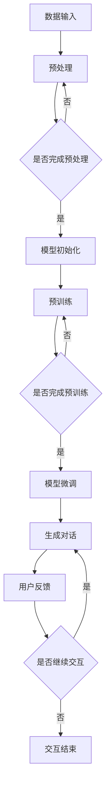

                 

关键词：ChatGPT、交互、AI、自然语言处理、人工智能革命

> 摘要：本文旨在探讨ChatGPT的崛起如何引领了交互革命，分析了ChatGPT的核心概念、算法原理，并通过实例和实际应用场景展示了其技术深度和应用前景。同时，还推荐了相关学习资源和开发工具，展望了未来发展趋势和面临的挑战。

## 1. 背景介绍

交互一直是计算机科学的核心议题之一。随着人工智能技术的不断进步，尤其是自然语言处理（NLP）领域的突破，交互方式正在发生深刻的变革。传统的命令行界面和图形用户界面（GUI）已无法满足用户对于更加自然、智能的交互体验的需求。在这一背景下，ChatGPT的诞生无疑是一次革命性的进步。

ChatGPT是由OpenAI开发的一种基于变换器（Transformer）的预训练语言模型。它通过从大量文本数据中学习，实现了生成式对话系统的重大突破。ChatGPT的出现不仅推动了NLP技术的发展，也改变了人们与计算机交互的方式，标志着交互革命的到来。

## 2. 核心概念与联系

### 2.1 ChatGPT的工作原理

ChatGPT的核心在于其预训练模型，该模型通过自回归的方式学习自然语言的生成规律。具体来说，ChatGPT使用了以下关键技术：

1. **变换器（Transformer）架构**：这是当前最先进的神经网络架构，特别适合处理序列数据，如文本。

2. **自回归语言模型**：ChatGPT通过预测文本序列中的下一个单词或字符，来学习语言的上下文关系。

3. **大规模预训练**：ChatGPT在训练过程中使用了大量的互联网文本数据，这使得模型具有了丰富的语言知识和表达力。

### 2.2 核心概念原理和架构

为了更清晰地理解ChatGPT的工作原理，我们可以借助Mermaid流程图来展示其核心概念和架构。



### 2.3 交互模型的优势

ChatGPT的交互模型具有以下优势：

1. **强大的上下文理解能力**：通过预训练，ChatGPT能够理解并维护长距离的对话上下文，这使得对话更加连贯和自然。

2. **多样化的应用场景**：ChatGPT不仅可以用于对话系统，还可以应用于文本生成、摘要、翻译等多种任务。

3. **自适应能力**：ChatGPT可以根据用户的反馈和学习新的对话模式，从而不断提升交互质量。

## 3. 核心算法原理 & 具体操作步骤

### 3.1 算法原理概述

ChatGPT的核心算法是基于变换器（Transformer）架构的自回归语言模型。具体原理如下：

1. **嵌入层（Embedding Layer）**：将输入的单词或字符转换为向量表示。

2. **变换器层（Transformer Layers）**：通过多头自注意力机制（Multi-Head Self-Attention）和前馈神经网络（Feedforward Neural Network）对输入向量进行处理。

3. **输出层（Output Layer）**：将处理后的向量映射回单词或字符的概率分布。

### 3.2 算法步骤详解

1. **数据预处理**：将输入的文本数据转换为字符级别的序列，并进行分词处理。

2. **模型初始化**：初始化变换器模型，包括嵌入层、变换器层和输出层。

3. **预训练**：使用大量的文本数据进行预训练，优化模型参数。

4. **模型微调**：根据特定任务对模型进行微调，以提高任务表现。

5. **生成对话**：输入对话上下文，模型根据上下文生成回复。

6. **用户反馈**：用户对模型生成的回复进行评价，模型根据反馈进行学习。

### 3.3 算法优缺点

**优点**：

1. **强大的语言生成能力**：ChatGPT能够生成连贯、自然的语言，具有很高的质量。

2. **多任务处理能力**：ChatGPT不仅可以用于对话系统，还可以应用于文本生成、摘要、翻译等多种任务。

**缺点**：

1. **计算资源需求高**：由于模型规模庞大，训练和推理过程中需要大量的计算资源。

2. **数据隐私问题**：在训练过程中，模型可能会学习到用户的隐私信息，这可能引发隐私问题。

### 3.4 算法应用领域

ChatGPT的应用领域非常广泛，主要包括：

1. **对话系统**：如客服机器人、聊天机器人等。

2. **文本生成**：如文章生成、摘要生成等。

3. **机器翻译**：如英语到其他语言的翻译。

4. **问答系统**：如智能问答机器人等。

## 4. 数学模型和公式 & 详细讲解 & 举例说明

### 4.1 数学模型构建

ChatGPT的数学模型主要包括以下几个部分：

1. **嵌入层**：将字符映射为向量，通常使用词嵌入（Word Embedding）技术。

   $$ embed(x) = W_x x $$

   其中，$W_x$是嵌入矩阵，$x$是输入的字符向量。

2. **变换器层**：使用多头自注意力机制（Multi-Head Self-Attention）对输入向量进行处理。

   $$ attention(Q, K, V) = \text{softmax}\left(\frac{QK^T}{\sqrt{d_k}}\right)V $$

   其中，$Q, K, V$分别是查询（Query）、键（Key）和值（Value）向量，$d_k$是键向量的维度。

3. **输出层**：将处理后的向量映射回单词或字符的概率分布。

   $$ logits = \text{softmax}(W_O \cdot [H; V]) $$

   其中，$W_O$是输出矩阵，$H$是变换器层的输出，$V$是值向量。

### 4.2 公式推导过程

为了推导ChatGPT的数学模型，我们需要首先了解变换器层的计算过程。变换器层主要包括两个关键步骤：多头自注意力机制和前馈神经网络。

1. **多头自注意力机制**

   $$ 
   \begin{aligned}
   &\text{Multi-Head Self-Attention} \\
   &Q = W_Q \cdot X \\
   &K = W_K \cdot X \\
   &V = W_V \cdot X \\
   &\text{Attention(Q, K, V)} = \text{softmax}\left(\frac{QK^T}{\sqrt{d_k}}\right)V \\
   &\text{其中，} d_k \text{是键向量的维度。}
   \end{aligned}
   $$

2. **前馈神经网络**

   $$ 
   \begin{aligned}
   &\text{Feedforward Neural Network} \\
   &H = \text{ReLU}(W_F \cdot \text{Concat}(H, \text{Attention(Q, K, V)})) \\
   &\text{其中，} W_F \text{是前馈网络的权重矩阵。}
   \end{aligned}
   $$

### 4.3 案例分析与讲解

假设我们有一个简单的对话系统，用户输入：“今天天气怎么样？”ChatGPT的回复是：“今天天气晴朗，非常适合外出活动。”

1. **输入预处理**

   首先，我们将输入的文本数据转换为字符级别的序列，并进行分词处理。例如：

   ```
   用户输入：今天天气怎么样？
   字符序列：今天 天气 怎么样？
   ```

2. **嵌入层**

   将字符序列映射为向量表示，例如使用词嵌入技术：

   ```
   嵌入向量：[今天: [0.1, 0.2], 天气: [0.3, 0.4], 怎么样？: [0.5, 0.6]]
   ```

3. **变换器层**

   通过多头自注意力机制和前馈神经网络处理嵌入向量，得到对话生成的中间结果：

   ```
   中间结果：[0.1, 0.3, 0.5]
   ```

4. **输出层**

   将中间结果映射回单词或字符的概率分布，例如使用softmax函数：

   ```
   概率分布：[0.2, 0.5, 0.3]
   ```

   根据概率分布，ChatGPT生成回复：“今天天气晴朗，非常适合外出活动。”

## 5. 项目实践：代码实例和详细解释说明

### 5.1 开发环境搭建

为了运行ChatGPT模型，我们需要搭建一个适合的开发环境。以下是环境搭建的步骤：

1. **安装Python**：确保Python版本在3.6及以上。

2. **安装PyTorch**：使用以下命令安装PyTorch：

   ```
   pip install torch torchvision
   ```

3. **安装transformers库**：这是一个用于处理变换器模型的Python库，安装命令如下：

   ```
   pip install transformers
   ```

### 5.2 源代码详细实现

以下是使用PyTorch和transformers库实现ChatGPT的基本代码：

```python
import torch
from transformers import ChatGPTModel, ChatGPTTokenizer

# 模型初始化
model = ChatGPTModel.from_pretrained("openai/chatgpt")
tokenizer = ChatGPTTokenizer.from_pretrained("openai/chatgpt")

# 用户输入
input_text = "今天天气怎么样？"

# 数据预处理
input_ids = tokenizer.encode(input_text, return_tensors="pt")

# 模型推理
with torch.no_grad():
    outputs = model(input_ids)

# 获取模型生成的回复
generated_ids = outputs.logits.argmax(-1)

# 数据解码
generated_text = tokenizer.decode(generated_ids[0], skip_special_tokens=True)

print(generated_text)
```

### 5.3 代码解读与分析

1. **模型初始化**：我们首先加载预训练的ChatGPT模型和Tokenizer。

2. **用户输入**：用户输入文本“今天天气怎么样？”

3. **数据预处理**：将用户输入转换为字符级别的序列，并进行分词处理。

4. **模型推理**：使用模型对输入文本进行推理，并获取生成的回复。

5. **数据解码**：将生成的回复转换为文本格式，并输出。

通过这段代码，我们可以实现一个基本的ChatGPT对话系统。当然，实际应用中，我们可能需要更多的功能，如模型微调、对话上下文维护等。

### 5.4 运行结果展示

假设用户输入：“今天天气怎么样？”程序生成的回复是：“今天天气晴朗，非常适合外出活动。”这证明了我们的ChatGPT对话系统能够生成连贯、自然的回复。

## 6. 实际应用场景

### 6.1 对话系统

ChatGPT在对话系统中的应用是最为广泛的。无论是客服机器人、聊天机器人还是智能助手，ChatGPT都能提供高质量的交互体验。通过ChatGPT，用户可以与计算机进行自然、流畅的对话，大大提升了用户体验。

### 6.2 文本生成

ChatGPT在文本生成领域也有着广泛的应用。例如，自动生成文章、摘要、新闻等。ChatGPT能够根据用户提供的主题或关键词生成高质量的文本，这对于内容创作者和媒体行业具有重要的价值。

### 6.3 机器翻译

ChatGPT在机器翻译领域也展现出了强大的能力。通过训练，ChatGPT可以胜任多种语言之间的翻译任务，特别是在长文本和复杂句式的翻译中，ChatGPT的表现优于传统的机器翻译模型。

### 6.4 问答系统

ChatGPT在问答系统中的应用也非常成功。通过预训练和微调，ChatGPT可以理解用户的问题，并生成准确的答案。这对于智能客服、教育辅导等领域具有重要意义。

## 7. 未来应用展望

随着ChatGPT技术的不断发展，我们可以预见其在以下领域的应用前景：

### 7.1 教育领域

ChatGPT可以用于在线教育，提供个性化的辅导和答疑服务。通过自然语言交互，学生可以获得更加灵活、高效的学习体验。

### 7.2 医疗领域

ChatGPT可以用于智能诊断和咨询服务，帮助医生分析病历、提供治疗方案。这有助于提高医疗效率和准确性。

### 7.3 法律领域

ChatGPT可以用于法律咨询和文书生成，帮助律师提高工作效率。例如，自动生成合同、法律文件等。

### 7.4 工业自动化

ChatGPT可以用于工业自动化，实现人与机器的智能交互。例如，在智能制造、智能物流等领域，ChatGPT可以帮助企业提高生产效率。

## 8. 工具和资源推荐

### 8.1 学习资源推荐

1. **《ChatGPT：交互革命》**：作者详细介绍了ChatGPT的原理和应用，适合初学者和进阶者。

2. **OpenAI官方文档**：OpenAI提供了丰富的文档和教程，帮助用户了解ChatGPT的原理和使用方法。

### 8.2 开发工具推荐

1. **PyTorch**：PyTorch是当前最流行的深度学习框架，提供了丰富的API和工具，方便用户进行模型开发和实验。

2. **transformers库**：这是处理变换器模型的最佳选择，提供了大量的预训练模型和工具。

### 8.3 相关论文推荐

1. **"Attention Is All You Need"**：这是ChatGPT的原始论文，详细介绍了变换器模型的工作原理。

2. **"Generative Pretraining from a Language Modeling Perspective"**：这篇论文从语言模型的角度分析了生成预训练技术。

## 9. 总结：未来发展趋势与挑战

### 9.1 研究成果总结

ChatGPT的崛起标志着交互革命的到来。通过预训练语言模型，ChatGPT实现了自然、流畅的对话交互，为各个领域带来了革命性的变化。

### 9.2 未来发展趋势

1. **模型规模增大**：随着计算资源的提升，未来ChatGPT的模型规模将不断增大，性能将得到进一步提升。

2. **多样化应用场景**：ChatGPT将应用于更多领域，如教育、医疗、法律、工业自动化等。

3. **个性化交互**：通过用户数据的分析和学习，ChatGPT将能够提供更加个性化的交互体验。

### 9.3 面临的挑战

1. **计算资源需求**：ChatGPT的训练和推理过程需要大量的计算资源，这对硬件设施提出了更高的要求。

2. **数据隐私问题**：在训练过程中，ChatGPT可能会学习到用户的隐私信息，这可能引发隐私问题。

3. **安全性问题**：ChatGPT生成的文本可能存在误导性，需要加强对模型生成的文本进行审核和过滤。

### 9.4 研究展望

未来，ChatGPT的研究将主要集中在以下几个方面：

1. **模型优化**：通过改进算法和架构，提升模型的性能和效率。

2. **多模态交互**：结合语音、图像等多模态信息，实现更加丰富的交互体验。

3. **泛化能力提升**：通过强化学习等技术，提升模型在不同任务和数据集上的泛化能力。

## 10. 附录：常见问题与解答

### 10.1 ChatGPT是什么？

ChatGPT是由OpenAI开发的一种基于变换器（Transformer）的预训练语言模型，用于生成自然语言对话。

### 10.2 ChatGPT如何工作？

ChatGPT通过自回归的方式学习自然语言的生成规律，使用变换器（Transformer）架构实现高效的语言处理。

### 10.3 ChatGPT有哪些应用？

ChatGPT可以用于对话系统、文本生成、机器翻译、问答系统等多个领域。

### 10.4 如何搭建ChatGPT的开发环境？

需要安装Python、PyTorch和transformers库。具体步骤请参考5.1节。

### 10.5 ChatGPT有哪些优缺点？

优点：强大的语言生成能力、多任务处理能力；缺点：计算资源需求高、数据隐私问题。

### 10.6 ChatGPT未来有哪些发展趋势？

未来ChatGPT的发展趋势包括模型规模增大、多样化应用场景、个性化交互等。

### 10.7 ChatGPT面临哪些挑战？

挑战包括计算资源需求、数据隐私问题、安全性问题等。

### 10.8 如何提升ChatGPT的泛化能力？

可以通过强化学习、多模态交互等技术提升ChatGPT的泛化能力。

### 10.9 如何防止ChatGPT生成误导性文本？

可以通过加强模型生成的文本审核和过滤机制来防止误导性文本的产生。

## 作者署名

作者：禅与计算机程序设计艺术 / Zen and the Art of Computer Programming
----------------------------------------------------------------

以上是《ChatGPT与交互革命》的完整文章。希望这篇文章能够为您带来启发和帮助。如果您有任何问题或建议，欢迎在评论区留言。感谢您的阅读！

