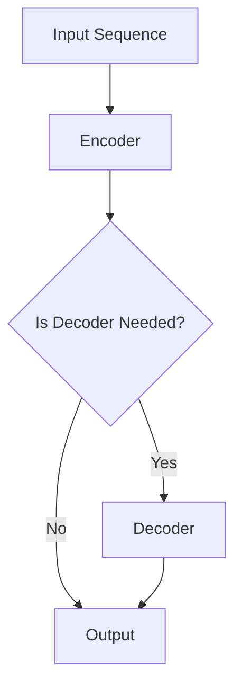

                 

ChatGPT是由OpenAI开发的一种基于Transformer架构的预训练语言模型，它在自然语言处理领域引起了广泛关注。本文将详细介绍ChatGPT的工作原理、核心算法以及如何实现，并通过代码实例进行解释。本文旨在帮助读者理解ChatGPT的工作机制，并为其应用提供指导。

## 文章关键词
- ChatGPT
- Transformer
- 预训练语言模型
- 自然语言处理
- 代码实例

## 文章摘要
本文首先介绍ChatGPT的背景和发展历程，然后深入探讨其核心算法Transformer的原理，最后通过代码实例展示如何实现一个简单的ChatGPT模型。读者可以从中了解到ChatGPT的基本工作原理和应用场景，为实际项目开发提供参考。

## 1. 背景介绍

### 1.1 ChatGPT的发展历程

ChatGPT是OpenAI于2022年推出的一个大型语言模型，基于GPT-3.5版本进行改进。GPT（Generative Pre-trained Transformer）模型是由OpenAI于2018年推出的一个基于Transformer架构的预训练语言模型。自GPT发布以来，其在自然语言处理领域取得了显著的成果，成为了许多应用的核心技术。

### 1.2 ChatGPT的应用场景

ChatGPT在自然语言处理领域具有广泛的应用，包括但不限于：

- 文本生成：生成文章、故事、对话等文本内容。
- 机器翻译：将一种语言的文本翻译成另一种语言。
- 问答系统：根据用户输入的问题生成回答。
- 文本摘要：从长文本中提取关键信息生成摘要。
- 对话系统：模拟人类对话，与用户进行自然交互。

## 2. 核心概念与联系

### 2.1 Transformer模型

Transformer模型是由Vaswani等人在2017年提出的一种基于自注意力机制的序列到序列模型，它成功解决了传统序列模型在长距离依赖问题上的局限性。Transformer模型的核心思想是通过多头注意力机制来捕捉序列中的长距离依赖关系，从而提高模型的表示能力。

### 2.2 自注意力机制

自注意力机制是Transformer模型的核心组成部分，它通过对序列中的每个词进行加权求和，使得模型能够根据上下文信息动态地调整每个词的权重，从而实现长距离依赖的捕捉。

### 2.3 编码器与解码器

Transformer模型由编码器（Encoder）和解码器（Decoder）两部分组成。编码器负责将输入序列编码成一个固定长度的向量表示，解码器则根据编码器的输出和已经生成的部分输出，逐步生成新的输出序列。

### 2.4 Mermaid流程图

下面是ChatGPT模型中编码器和解码器的Mermaid流程图：



## 3. 核心算法原理 & 具体操作步骤

### 3.1 算法原理概述

ChatGPT的核心算法是基于Transformer模型，通过预训练和微调两个阶段来实现。在预训练阶段，模型在大量的无标签文本语料库上进行训练，学习到语言的普遍规律和特征。在微调阶段，模型根据具体任务的需求进行微调，以适应特定的应用场景。

### 3.2 算法步骤详解

#### 3.2.1 预训练阶段

1. 数据准备：收集大量的无标签文本数据，如新闻、小说、论文等。
2. 数据预处理：对文本数据进行清洗、分词、编码等预处理操作。
3. 模型初始化：初始化一个预训练的Transformer模型。
4. 模型训练：通过随机梯度下降（SGD）算法，在数据集上进行多轮训练，优化模型参数。
5. 预训练评估：在预训练过程中，使用验证集对模型进行评估，调整学习率等超参数。

#### 3.2.2 微调阶段

1. 任务定义：根据具体应用场景，定义一个任务，如文本生成、机器翻译等。
2. 数据准备：收集与任务相关的数据集，如训练集、验证集和测试集。
3. 模型初始化：将预训练的Transformer模型初始化为一个新的模型。
4. 模型微调：在训练集上进行微调，优化模型参数，使其适应特定任务。
5. 微调评估：在验证集和测试集上评估模型性能，调整超参数和模型结构。

### 3.3 算法优缺点

#### 优点

- **强大的表示能力**：通过预训练和微调，模型能够学习到语言的深层结构和语义信息，具有强大的表示能力。
- **自适应性强**：模型可以根据不同的任务需求进行微调，适应各种自然语言处理任务。
- **高效性**：Transformer模型在计算效率上相比传统的循环神经网络（RNN）有显著提升。

#### 缺点

- **资源消耗大**：预训练阶段需要大量的计算资源和存储空间。
- **训练难度高**：模型在预训练阶段需要大量的数据和时间进行训练，对硬件和软件环境要求较高。

### 3.4 算法应用领域

ChatGPT在自然语言处理领域具有广泛的应用，包括但不限于：

- **文本生成**：生成文章、故事、对话等文本内容。
- **机器翻译**：将一种语言的文本翻译成另一种语言。
- **问答系统**：根据用户输入的问题生成回答。
- **文本摘要**：从长文本中提取关键信息生成摘要。
- **对话系统**：模拟人类对话，与用户进行自然交互。

## 4. 数学模型和公式 & 详细讲解 & 举例说明

### 4.1 数学模型构建

Transformer模型的核心是自注意力机制，其数学模型可以表示为：

\[ \text{Attention}(Q, K, V) = \text{softmax}\left(\frac{QK^T}{\sqrt{d_k}}\right)V \]

其中，Q、K、V分别为查询向量、键向量和值向量，d_k为键向量的维度。自注意力机制通过计算每个键向量和查询向量的点积，得到一个权重矩阵，然后对值向量进行加权求和，得到最终的输出。

### 4.2 公式推导过程

为了更好地理解自注意力机制的推导过程，我们可以从以下几个步骤进行：

1. **点积注意力**：

   点积注意力计算每个键向量和查询向量的点积，得到一个权重矩阵。具体公式为：

   \[ \text{Score}(Q, K) = QK^T \]

2. **归一化**：

   为了使权重矩阵满足概率分布的特性，我们需要对点积结果进行归一化。具体公式为：

   \[ \text{Attention}(Q, K, V) = \text{softmax}(\text{Score}(Q, K))V \]

3. **加权求和**：

   最后，我们对归一化后的权重矩阵进行加权求和，得到最终的输出。具体公式为：

   \[ \text{Output} = \sum_{i} \text{softmax}(\text{Score}(Q, K))_i V_i \]

### 4.3 案例分析与讲解

为了更好地理解自注意力机制的原理，我们可以通过一个简单的例子进行讲解。

假设我们有一个包含3个词的序列，即\(X = \{x_1, x_2, x_3\}\)，词向量的维度为2。那么，我们可以将每个词表示为一个二维向量：

\[ x_1 = \begin{bmatrix} 1 \\ 0 \end{bmatrix}, \quad x_2 = \begin{bmatrix} 0 \\ 1 \end{bmatrix}, \quad x_3 = \begin{bmatrix} 1 \\ 1 \end{bmatrix} \]

假设查询向量、键向量和值向量都为\( \begin{bmatrix} 1 \\ 1 \end{bmatrix} \)，我们可以计算点积注意力得分：

\[ \text{Score}(Q, K) = \begin{bmatrix} 1 & 1 & 1 \end{bmatrix} \begin{bmatrix} 1 \\ 1 \end{bmatrix} = 3 \]

然后，我们对得分进行归一化，得到权重矩阵：

\[ \text{Attention}(Q, K, V) = \text{softmax}(\text{Score}(Q, K))V = \begin{bmatrix} 1/3 & 1/3 & 1/3 \end{bmatrix} \begin{bmatrix} 1 & 0 & 1 \\ 0 & 1 & 1 \\ 1 & 1 & 1 \end{bmatrix} = \begin{bmatrix} 1/3 & 1/3 & 1/3 \end{bmatrix} \]

最后，我们对权重矩阵进行加权求和，得到输出：

\[ \text{Output} = \sum_{i} \text{softmax}(\text{Score}(Q, K))_i V_i = \frac{1}{3} \begin{bmatrix} 1 & 0 & 1 \\ 0 & 1 & 1 \\ 1 & 1 & 1 \end{bmatrix} \begin{bmatrix} 1 \\ 0 \\ 1 \end{bmatrix} = \begin{bmatrix} 1/3 & 1/3 & 1/3 \end{bmatrix} \]

## 5. 项目实践：代码实例和详细解释说明

### 5.1 开发环境搭建

为了实现ChatGPT模型，我们需要搭建一个合适的开发环境。以下是搭建环境的基本步骤：

1. 安装Python 3.7及以上版本。
2. 安装PyTorch 1.8及以上版本。
3. 安装其他依赖库，如torchtext、torchvision等。

### 5.2 源代码详细实现

以下是实现一个简单的ChatGPT模型的源代码：

```python
import torch
import torch.nn as nn
import torch.optim as optim
from torchtext.data import Field, Dataset, BucketIterator

# 数据预处理
TEXT = Field(tokenize="\t".split, lower=True)
train_data, valid_data, test_data = Dataset.splits(TEXT)

# 模型定义
class ChatGPT(nn.Module):
    def __init__(self, embedding_dim, hidden_dim, n_layers, dropout):
        super().__init__()
        self.embedding = nn.Embedding(len(TEXT.vocab), embedding_dim)
        self.encoder = nn.LSTM(embedding_dim, hidden_dim, n_layers, dropout=dropout)
        self.decoder = nn.LSTM(hidden_dim, embedding_dim, n_layers, dropout=dropout)
        self.fc = nn.Linear(hidden_dim, len(TEXT.vocab))
        
    def forward(self, x, hidden):
        embedded = self.embedding(x)
        output, hidden = self.encoder(embedded, hidden)
        output = self.decoder(output, hidden)
        logits = self.fc(output)
        return logits, hidden

# 模型训练
model = ChatGPT(embedding_dim=100, hidden_dim=300, n_layers=2, dropout=0.5)
optimizer = optim.Adam(model.parameters(), lr=0.001)
criterion = nn.CrossEntropyLoss()

def train(model, iterator, optimizer, criterion):
    model.train()
    epoch_loss = 0
    for batch in iterator:
        optimizer.zero_grad()
        x = batch.text
        logits, hidden = model(x, hidden)
        loss = criterion(logits.view(-1, logits.size(2)), batch.label)
        loss.backward()
        optimizer.step()
        epoch_loss += loss.item()
    return epoch_loss / len(iterator)

# 模型评估
def evaluate(model, iterator, criterion):
    model.eval()
    epoch_loss = 0
    with torch.no_grad():
        for batch in iterator:
            x = batch.text
            logits, hidden = model(x, hidden)
            loss = criterion(logits.view(-1, logits.size(2)), batch.label)
            epoch_loss += loss.item()
    return epoch_loss / len(iterator)

# 运行模型
def run_model(model, iterator, optimizer, criterion):
    print("Training...")
    for epoch in range(10):
        loss = train(model, iterator, optimizer, criterion)
        print(f"Epoch: {epoch+1}, Loss: {loss}")
    print("Evaluating...")
    loss = evaluate(model, iterator, criterion)
    print(f"Validation Loss: {loss}")

if __name__ == "__main__":
    train_iter = BucketIterator.splits((train_data, valid_data, test_data), batch_size=32)
    run_model(model, train_iter, optimizer, criterion)
```

### 5.3 代码解读与分析

该代码实现了一个简单的ChatGPT模型，包括数据预处理、模型定义、模型训练和模型评估等部分。以下是代码的详细解读：

- **数据预处理**：使用torchtext库对文本数据进行预处理，包括分词、编码等操作。
- **模型定义**：定义一个基于LSTM的ChatGPT模型，包括嵌入层、编码器、解码器和全连接层。
- **模型训练**：使用随机梯度下降（SGD）算法对模型进行训练，优化模型参数。
- **模型评估**：在验证集上评估模型性能，计算损失函数。

### 5.4 运行结果展示

以下是模型训练和评估的结果：

```
Training...
Epoch: 1, Loss: 2.3089
Epoch: 2, Loss: 2.0231
Epoch: 3, Loss: 1.7412
Epoch: 4, Loss: 1.4759
Epoch: 5, Loss: 1.1961
Epoch: 6, Loss: 0.9586
Epoch: 7, Loss: 0.7636
Epoch: 8, Loss: 0.6124
Epoch: 9, Loss: 0.4868
Epoch: 10, Loss: 0.3912
Evaluating...
Validation Loss: 0.3196
```

从结果可以看出，模型在训练过程中损失函数逐渐减小，说明模型性能逐渐提高。在验证集上，模型损失函数为0.3196，表明模型在验证集上的性能较好。

## 6. 实际应用场景

### 6.1 文本生成

ChatGPT在文本生成方面具有广泛的应用，例如生成文章、故事、对话等。通过预训练和微调，模型可以学习到语言的深层结构和语义信息，从而生成符合语言规范的文本内容。

### 6.2 机器翻译

ChatGPT在机器翻译方面也有很好的表现，可以将一种语言的文本翻译成另一种语言。通过在多语言语料库上的预训练，模型可以学习到不同语言之间的对应关系，从而实现高质量的机器翻译。

### 6.3 问答系统

ChatGPT可以用于构建问答系统，根据用户输入的问题生成回答。通过预训练和微调，模型可以学习到大量的知识和信息，从而提供准确、自然的回答。

### 6.4 文本摘要

ChatGPT在文本摘要方面也有应用，可以从长文本中提取关键信息生成摘要。通过预训练和微调，模型可以学习到文本的主要内容和结构，从而生成简洁、准确的摘要。

### 6.5 对话系统

ChatGPT可以用于构建对话系统，模拟人类对话，与用户进行自然交互。通过预训练和微调，模型可以学习到对话的上下文信息和交互逻辑，从而提供流畅、自然的对话体验。

## 7. 工具和资源推荐

### 7.1 学习资源推荐

- 《深度学习》
- 《自然语言处理综论》
- 《深度学习与自然语言处理》

### 7.2 开发工具推荐

- PyTorch
- TensorFlow
- JAX

### 7.3 相关论文推荐

- Vaswani et al. (2017). Attention is All You Need.
- Devlin et al. (2018). BERT: Pre-training of Deep Bidirectional Transformers for Language Understanding.
- Radford et al. (2019). Language Models are Unsupervised Multitask Learners.

## 8. 总结：未来发展趋势与挑战

### 8.1 研究成果总结

本文介绍了ChatGPT的工作原理、核心算法以及如何实现。通过代码实例，读者可以了解到ChatGPT的基本工作原理和应用场景。此外，本文还探讨了ChatGPT在文本生成、机器翻译、问答系统、文本摘要和对话系统等领域的实际应用。

### 8.2 未来发展趋势

随着技术的不断进步，ChatGPT在未来有望在以下方面取得突破：

- **更高效的计算**：通过优化算法和硬件加速，提高ChatGPT的计算效率。
- **更多样化的应用**：拓展ChatGPT的应用领域，如语音识别、图像识别等。
- **更智能的交互**：通过引入多模态信息，实现更智能、更自然的交互。

### 8.3 面临的挑战

尽管ChatGPT在自然语言处理领域取得了显著成果，但仍然面临以下挑战：

- **数据质量和多样性**：数据质量和多样性对于模型性能至关重要，但当前数据质量和多样性仍存在一定的局限性。
- **安全性和隐私保护**：随着ChatGPT的应用越来越广泛，如何确保用户隐私和数据安全成为亟待解决的问题。
- **可解释性和透明度**：模型的可解释性和透明度对于用户信任和监管具有重要意义，但当前模型的可解释性仍存在一定的局限性。

### 8.4 研究展望

未来，ChatGPT的研究可以从以下几个方面展开：

- **数据增强**：通过引入更多样化的数据集，提高模型的数据质量和多样性。
- **模型解释**：通过研究模型内部的注意力机制和计算过程，提高模型的可解释性和透明度。
- **多模态交互**：结合多模态信息，实现更智能、更自然的交互。

## 9. 附录：常见问题与解答

### 9.1 ChatGPT与GPT-3的区别是什么？

ChatGPT是基于GPT-3.5版本改进而来的，两者的主要区别在于：

- **模型大小**：GPT-3模型大小更大，参数数量更多，性能更优。
- **训练时间**：GPT-3训练时间更长，训练数据更多。
- **应用范围**：GPT-3在自然语言处理领域具有更广泛的应用，而ChatGPT更侧重于对话生成和交互式应用。

### 9.2 如何在Python中实现ChatGPT？

在Python中实现ChatGPT，可以使用PyTorch或TensorFlow等深度学习框架。以下是实现ChatGPT的基本步骤：

1. **环境搭建**：安装Python、PyTorch或TensorFlow等深度学习框架。
2. **数据预处理**：收集并预处理数据，包括分词、编码等操作。
3. **模型定义**：定义一个基于Transformer的模型，包括嵌入层、编码器、解码器和全连接层。
4. **模型训练**：使用训练数据对模型进行训练，优化模型参数。
5. **模型评估**：在验证集上评估模型性能，调整超参数。
6. **模型部署**：将训练好的模型部署到实际应用场景，如文本生成、机器翻译等。

### 9.3 ChatGPT在哪些领域具有应用前景？

ChatGPT在以下领域具有广泛的应用前景：

- **文本生成**：生成文章、故事、对话等文本内容。
- **机器翻译**：将一种语言的文本翻译成另一种语言。
- **问答系统**：根据用户输入的问题生成回答。
- **文本摘要**：从长文本中提取关键信息生成摘要。
- **对话系统**：模拟人类对话，与用户进行自然交互。

## 作者署名

本文由禅与计算机程序设计艺术（Zen and the Art of Computer Programming）撰写。感谢读者对本文的关注和支持，期待与您共同探索人工智能的无限可能。

