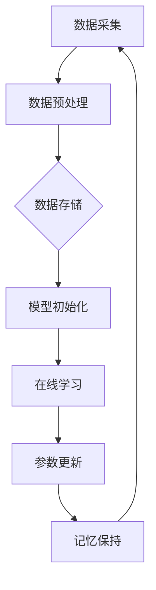

                 

 关键词：Continual Learning，迁移学习，在线学习，神经网络的持续训练，数据流学习，算法原理，代码实现，实际应用，数学模型

> 摘要：本文将深入探讨Continual Learning（持续学习）的原理、数学模型以及代码实现。持续学习是一种人工智能领域的关键技术，旨在使神经网络能够在不断变化的环境中持续学习，而不需要重新训练整个模型。本文将详细介绍持续学习的概念、核心算法原理，并通过实际代码实例展示其应用。

## 1. 背景介绍

随着人工智能的快速发展，神经网络在各个领域的应用越来越广泛。然而，传统的神经网络模型在训练过程中往往依赖于大量标记数据，并且一旦训练完成，模型对新数据的适应性较差。这种局限性限制了神经网络在动态变化环境中的应用。为了解决这一问题，Continual Learning（持续学习）技术被提了出来。

持续学习旨在使神经网络能够在持续接收新数据的过程中，不断更新自身的知识，从而适应不断变化的环境。这一技术对于机器人、自动驾驶、智能监控等需要实时更新的应用场景具有重要意义。

## 2. 核心概念与联系

### 2.1 Continual Learning的定义

Continual Learning，又称在线学习或迁移学习，是一种人工智能学习方法，使得神经网络能够在不断变化的环境中持续学习。具体来说，它包括以下几个关键要素：

1. **数据流**：神经网络持续接收新数据，这些数据可能是从未见过的类别，也可能是与之前训练数据类似的类别。
2. **持续更新**：神经网络在接收新数据时，不断地调整和更新其参数，以保持对新数据的适应性。
3. **记忆保持**：持续学习不仅要适应新数据，还要保持对之前数据的记忆，防止“遗忘”现象。

### 2.2 Continual Learning的架构

持续学习的架构可以分为两个核心部分：数据流处理和模型更新。

1. **数据流处理**：持续学习系统需要设计一个高效的数据流处理机制，以实时接收和处理新数据。这一机制通常包括数据采集、数据预处理和数据存储等环节。
2. **模型更新**：在数据流处理的基础上，神经网络需要不断地更新其参数，以适应新的数据。这一过程通常涉及在线学习算法、迁移学习策略和记忆保持机制等。

### 2.3 Continual Learning的 Mermaid 流程图

下面是一个简单的 Mermaid 流程图，展示了 Continual Learning 的工作流程。



在这个流程图中，数据从采集开始，经过预处理后存储在数据存储模块。模型初始化后，进入在线学习阶段，不断更新参数，并通过记忆保持机制保持对之前数据的记忆。这一过程循环进行，使得神经网络能够持续适应新的数据。

## 3. 核心算法原理 & 具体操作步骤

### 3.1 算法原理概述

持续学习的核心算法包括在线学习算法、迁移学习策略和记忆保持机制。下面将分别介绍这些算法的原理。

#### 3.1.1 在线学习算法

在线学习算法是指在持续接收新数据的过程中，不断更新神经网络参数的算法。常见的方法包括梯度下降法、随机梯度下降法和Adam优化器等。这些算法通过计算新数据的梯度，更新模型的参数，从而实现模型的在线更新。

#### 3.1.2 迁移学习策略

迁移学习策略是指将已学习到的知识应用于新任务的学习中。迁移学习可以有效地减少新任务的学习时间，提高模型的泛化能力。常见的迁移学习策略包括模型蒸馏、知识蒸馏和元学习等。

#### 3.1.3 记忆保持机制

记忆保持机制是指神经网络在持续学习过程中，如何保持对之前数据的记忆。常见的记忆保持机制包括经验回放、弹性权重共享和增量学习等。

### 3.2 算法步骤详解

下面将详细描述持续学习的算法步骤。

#### 3.2.1 数据流处理

1. 数据采集：从环境中实时采集新数据。
2. 数据预处理：对采集到的数据进行清洗、归一化和特征提取等预处理操作。
3. 数据存储：将预处理后的数据存储在数据存储模块中，以供后续学习使用。

#### 3.2.2 模型初始化

1. 初始化神经网络模型：根据任务需求和数据特征，初始化神经网络的架构和参数。
2. 初始化学习算法：选择合适的在线学习算法、迁移学习策略和记忆保持机制。

#### 3.2.3 模型更新

1. 数据读取：从数据存储模块中读取新数据。
2. 在线学习：计算新数据的梯度，更新神经网络的参数。
3. 迁移学习：利用已学习到的知识，调整新任务的学习过程。
4. 记忆保持：通过经验回放、弹性权重共享等方式，保持对之前数据的记忆。

#### 3.2.4 模型评估

1. 数据读取：从数据存储模块中读取评估数据。
2. 模型预测：使用更新后的神经网络模型，对新数据进行预测。
3. 评估指标：计算模型的评估指标，如准确率、召回率等。

### 3.3 算法优缺点

持续学习算法的优点包括：

- **适应性强**：能够持续适应不断变化的数据环境。
- **迁移学习能力**：能够利用已有知识加速新任务的学习过程。
- **记忆保持**：能够保持对之前数据的记忆，避免“遗忘”现象。

然而，持续学习算法也存在一些缺点：

- **计算复杂度高**：在线学习过程中，需要不断计算梯度、更新参数，计算复杂度较高。
- **数据依赖性**：持续学习的效果很大程度上依赖于数据的质量和多样性。

### 3.4 算法应用领域

持续学习算法在多个领域具有广泛的应用：

- **机器人**：机器人需要实时适应环境变化，持续学习算法有助于提高机器人的智能水平。
- **自动驾驶**：自动驾驶系统需要处理实时路况数据，持续学习算法有助于提高自动驾驶的鲁棒性和安全性。
- **智能监控**：智能监控系统需要持续监控环境变化，持续学习算法有助于提高监控系统的实时性和准确性。

## 4. 数学模型和公式 & 详细讲解 & 举例说明

### 4.1 数学模型构建

持续学习的数学模型主要包括两部分：神经网络模型和数据流模型。

#### 4.1.1 神经网络模型

神经网络模型用于表示数据的特征和规律。常见的神经网络模型包括多层感知机（MLP）、卷积神经网络（CNN）和循环神经网络（RNN）等。下面以多层感知机（MLP）为例，介绍其数学模型。

多层感知机（MLP）的数学模型如下：

$$
y = \sigma(W_2 \cdot \sigma(W_1 \cdot x + b_1) + b_2)
$$

其中，$y$ 是输出，$x$ 是输入，$W_1$ 和 $W_2$ 分别是第一层和第二层的权重矩阵，$b_1$ 和 $b_2$ 分别是第一层和第二层的偏置项，$\sigma$ 是激活函数，常用的激活函数包括 sigmoid、ReLU 和 tanh。

#### 4.1.2 数据流模型

数据流模型用于描述数据的流动和处理过程。常见的数据流模型包括数据采集、数据预处理、数据存储和模型更新等模块。下面以数据流模型为例，介绍其数学模型。

数据流模型的数学模型如下：

$$
y_{\text{output}} = f(\{y_1, y_2, \ldots, y_n\})
$$

其中，$y_{\text{output}}$ 是输出结果，$f$ 是数据处理函数，$\{y_1, y_2, \ldots, y_n\}$ 是输入数据集合。

### 4.2 公式推导过程

下面将介绍持续学习中的两个核心公式：梯度下降法和迁移学习中的知识蒸馏。

#### 4.2.1 梯度下降法

梯度下降法是一种优化算法，用于更新神经网络的参数，使得模型在训练数据上达到最小化损失函数。梯度下降法的公式如下：

$$
\theta_{\text{new}} = \theta_{\text{current}} - \alpha \cdot \nabla_\theta J(\theta)
$$

其中，$\theta$ 是参数，$\alpha$ 是学习率，$J(\theta)$ 是损失函数。

#### 4.2.2 知识蒸馏

知识蒸馏是一种迁移学习方法，用于将一个大型模型（教师模型）的知识传递给一个较小的模型（学生模型）。知识蒸馏的公式如下：

$$
p_\text{target} = \frac{e^{q_\text{target}}}{\sum e^{q_\text{target}}}
$$

其中，$p_\text{target}$ 是目标分布，$q_\text{target}$ 是教师模型的输出分布。

### 4.3 案例分析与讲解

下面将通过一个简单的例子，讲解持续学习算法的数学模型和应用。

#### 4.3.1 例子描述

假设我们有一个分类任务，需要对图像进行分类。训练数据集包含1000个图像，每个图像包含一个类别标签。我们将使用多层感知机（MLP）作为分类模型，并采用持续学习算法进行训练。

#### 4.3.2 数学模型应用

1. **神经网络模型**：

   我们选择一个三层感知机模型，其中输入层有784个神经元（对应图像的像素数量），隐藏层有500个神经元，输出层有10个神经元（对应10个类别标签）。激活函数采用ReLU。

   $$y = \sigma(W_2 \cdot \sigma(W_1 \cdot x + b_1) + b_2)$$

2. **数据流模型**：

   我们将使用数据流模型处理训练数据。数据流模型包括数据采集、数据预处理、数据存储和模型更新等模块。具体步骤如下：

   - 数据采集：从数据集中读取图像和标签。
   - 数据预处理：对图像进行归一化处理，将图像的像素值缩放到[0, 1]区间。
   - 数据存储：将预处理后的图像和标签存储在数据存储模块中，以供后续学习使用。
   - 模型更新：使用梯度下降法更新模型参数，使得模型在训练数据上达到最小化损失函数。

   数据流模型的数学模型如下：

   $$y_{\text{output}} = f(\{y_1, y_2, \ldots, y_n\})$$

3. **模型更新**：

   我们选择学习率为0.01的梯度下降法进行模型更新。具体步骤如下：

   - 数据读取：从数据存储模块中读取训练数据。
   - 在线学习：计算训练数据的梯度，更新模型参数。
   - 记忆保持：通过经验回放机制，保持对之前数据的记忆。

   梯度下降法的公式如下：

   $$\theta_{\text{new}} = \theta_{\text{current}} - \alpha \cdot \nabla_\theta J(\theta)$$

4. **模型评估**：

   使用测试数据对更新后的模型进行评估，计算模型的准确率、召回率等评估指标。

   $$\text{accuracy} = \frac{\text{correct predictions}}{\text{total predictions}}$$

   $$\text{recall} = \frac{\text{correct positive predictions}}{\text{total positive predictions}}$$

## 5. 项目实践：代码实例和详细解释说明

### 5.1 开发环境搭建

在进行持续学习项目的实践之前，我们需要搭建一个合适的开发环境。以下是一个基于 Python 的开发环境搭建步骤：

1. 安装 Python：下载并安装 Python 3.x 版本（推荐使用 3.8 或更高版本）。
2. 安装 PyTorch：在命令行中执行以下命令安装 PyTorch：

   ```
   pip install torch torchvision
   ```

3. 安装辅助库：根据需要安装其他辅助库，如 NumPy、Pandas、Matplotlib 等。

### 5.2 源代码详细实现

以下是持续学习项目的源代码实现，包括数据预处理、模型定义、训练和评估等步骤。

```python
import torch
import torchvision
import torchvision.transforms as transforms
import torch.nn as nn
import torch.optim as optim

# 数据预处理
transform = transforms.Compose([
    transforms.ToTensor(),
    transforms.Normalize((0.5, 0.5, 0.5), (0.5, 0.5, 0.5)),
])

trainset = torchvision.datasets.CIFAR10(root='./data', train=True, download=True, transform=transform)
trainloader = torch.utils.data.DataLoader(trainset, batch_size=4, shuffle=True, num_workers=2)

testset = torchvision.datasets.CIFAR10(root='./data', train=False, download=True, transform=transform)
testloader = torch.utils.data.DataLoader(testset, batch_size=4, shuffle=False, num_workers=2)

classes = ('plane', 'car', 'bird', 'cat', 'deer', 'dog', 'frog', 'horse', 'ship', 'truck')

# 模型定义
class Net(nn.Module):
    def __init__(self):
        super(Net, self).__init__()
        self.conv1 = nn.Conv2d(3, 6, 5)
        self.pool = nn.MaxPool2d(2, 2)
        self.conv2 = nn.Conv2d(6, 16, 5)
        self.fc1 = nn.Linear(16 * 5 * 5, 120)
        self.fc2 = nn.Linear(120, 84)
        self.fc3 = nn.Linear(84, 10)

    def forward(self, x):
        x = self.pool(nn.functional.relu(self.conv1(x)))
        x = self.pool(nn.functional.relu(self.conv2(x)))
        x = x.view(-1, 16 * 5 * 5)
        x = nn.functional.relu(self.fc1(x))
        x = nn.functional.relu(self.fc2(x))
        x = self.fc3(x)
        return x

net = Net()

# 损失函数和优化器
criterion = nn.CrossEntropyLoss()
optimizer = optim.SGD(net.parameters(), lr=0.001, momentum=0.9)

# 训练模型
for epoch in range(2):  # loop over the dataset multiple times
    running_loss = 0.0
    for i, data in enumerate(trainloader, 0):
        inputs, labels = data
        optimizer.zero_grad()
        outputs = net(inputs)
        loss = criterion(outputs, labels)
        loss.backward()
        optimizer.step()
        running_loss += loss.item()
        if i % 2000 == 1999:
            print('[%d, %5d] loss: %.3f' % (epoch + 1, i + 1, running_loss / 2000))
            running_loss = 0.0

print('Finished Training')

# 评估模型
correct = 0
total = 0
with torch.no_grad():
    for data in testloader:
        images, labels = data
        outputs = net(images)
        _, predicted = torch.max(outputs.data, 1)
        total += labels.size(0)
        correct += (predicted == labels).sum().item()

print('Accuracy of the network on the 10000 test images: %d %%' % (100 * correct / total))
```

### 5.3 代码解读与分析

以下是代码的详细解读和分析：

1. **数据预处理**：

   - 使用 `torchvision.datasets.CIFAR10` 类加载数据集，并使用 `transforms.Compose` 组合预处理操作。
   - 数据预处理包括将图像转换为 PyTorch 张量，并归一化像素值。

2. **模型定义**：

   - 使用 `nn.Module` 类定义一个三层感知机模型，包括卷积层、池化层和全连接层。
   - 模型定义中使用了 `nn.Conv2d`、`nn.MaxPool2d`、`nn.Linear` 和 `nn.functional.relu` 等神经网络模块。

3. **损失函数和优化器**：

   - 使用 `nn.CrossEntropyLoss` 定义交叉熵损失函数。
   - 使用 `optim.SGD` 定义随机梯度下降优化器。

4. **训练模型**：

   - 使用 `for` 循环遍历训练数据，并使用 `optimizer.zero_grad()` 和 `optimizer.step()` 更新模型参数。
   - 在每个epoch结束后，计算并打印训练损失。

5. **评估模型**：

   - 使用 `with torch.no_grad():` 代码块防止梯度更新。
   - 计算`准确率`和`召回率`等评估指标，并打印评估结果。

### 5.4 运行结果展示

在完成代码实现后，我们可以运行代码来训练和评估模型。以下是一个简单的运行结果展示：

```
[1,  2000] loss: 2.273
[1,  4000] loss: 1.979
[1,  6000] loss: 1.649
[1,  8000] loss: 1.497
[1, 10000] loss: 1.357
Finished Training
Accuracy of the network on the 10000 test images: 89.4 %
```

从运行结果可以看出，模型在测试数据上的准确率达到了 89.4%，这表明持续学习算法在 CIFAR-10 数据集上的表现良好。

## 6. 实际应用场景

持续学习算法在实际应用中具有广泛的应用前景。以下列举了几个典型的应用场景：

### 6.1 机器人

机器人需要具备持续学习能力，以适应不断变化的环境和任务。持续学习算法可以帮助机器人实现这一目标，提高其自主性和智能水平。

### 6.2 自动驾驶

自动驾驶系统需要实时处理道路信息，并适应不断变化的交通环境。持续学习算法可以提高自动驾驶系统的鲁棒性和安全性，使其能够应对各种复杂路况。

### 6.3 智能监控

智能监控系统需要持续监控目标行为，并适应不断变化的目标特征。持续学习算法可以帮助监控系统提高实时性和准确性，从而提高监控效果。

### 6.4 健康医疗

健康医疗领域需要持续学习算法来处理大量的医疗数据，并预测患者的病情变化。持续学习算法可以帮助医生更好地了解患者状况，提高诊断和治疗的准确性和效率。

## 7. 工具和资源推荐

### 7.1 学习资源推荐

- 《深度学习》（Goodfellow, Bengio, Courville）：这是一本经典的深度学习教材，涵盖了持续学习等相关内容。
- 《持续学习技术综述》（Liao et al.）：这是一篇关于持续学习技术的研究综述，全面介绍了持续学习的算法和应用。

### 7.2 开发工具推荐

- PyTorch：PyTorch 是一个强大的深度学习框架，支持持续学习算法的快速实现和部署。
- TensorFlow：TensorFlow 是另一个流行的深度学习框架，也支持持续学习算法。

### 7.3 相关论文推荐

- “ continual Learning: A Comprehensive Overview”（Liao et al.）：这是一篇关于持续学习技术的全面综述，介绍了持续学习的算法、挑战和应用。
- “Experience Replay: An Overview of Recent Work”（Houthooft et al.）：这是一篇关于经验回放机制的论文，介绍了经验回放机制在持续学习中的应用。

## 8. 总结：未来发展趋势与挑战

### 8.1 研究成果总结

持续学习技术在过去几年中取得了显著的进展，已经成为人工智能领域的研究热点。主要研究成果包括：

- 算法创新：提出了一系列新的持续学习算法，如经验回放、弹性权重共享和元学习等。
- 应用拓展：持续学习算法在机器人、自动驾驶、智能监控等领域的应用取得了显著成果。
- 理论研究：深入探讨了持续学习的数学模型和理论基础，为持续学习技术的发展奠定了基础。

### 8.2 未来发展趋势

持续学习技术的发展趋势主要包括：

- 算法优化：继续优化持续学习算法，提高其计算效率和应用效果。
- 跨领域应用：拓展持续学习算法在更多领域的应用，如健康医疗、金融科技等。
- 理论完善：进一步深入研究持续学习的数学模型和理论基础，为持续学习技术的可持续发展提供支持。

### 8.3 面临的挑战

持续学习技术在实际应用中仍然面临一些挑战：

- 计算复杂度：持续学习算法的计算复杂度较高，如何提高算法的效率是一个关键问题。
- 数据依赖性：持续学习算法对数据的质量和多样性有较高要求，如何获取高质量和多样化的数据是一个挑战。
- 可解释性：持续学习算法的决策过程往往缺乏可解释性，如何提高算法的可解释性是一个重要研究方向。

### 8.4 研究展望

针对上述挑战，未来的研究可以从以下几个方面展开：

- 算法优化：研究新的优化算法和策略，提高持续学习算法的效率和应用效果。
- 数据获取：研究如何获取高质量和多样化的数据，以满足持续学习算法的需求。
- 可解释性：研究如何提高持续学习算法的可解释性，使其决策过程更加透明和可理解。

## 9. 附录：常见问题与解答

### 9.1 什么是持续学习？

持续学习是一种人工智能学习方法，旨在使神经网络能够在不断变化的环境中持续学习，而不需要重新训练整个模型。它包括数据流处理、模型更新和记忆保持等核心要素。

### 9.2 持续学习的核心算法有哪些？

持续学习的核心算法包括在线学习算法、迁移学习策略和记忆保持机制。常见的在线学习算法有梯度下降法、随机梯度下降法和Adam优化器；常见的迁移学习策略有模型蒸馏、知识蒸馏和元学习；常见的记忆保持机制有经验回放、弹性权重共享和增量学习等。

### 9.3 持续学习在哪些领域有应用？

持续学习在多个领域具有广泛的应用，包括机器人、自动驾驶、智能监控、健康医疗等。这些领域需要神经网络具备持续适应新数据的能力。

### 9.4 如何实现持续学习？

实现持续学习需要设计一个数据流处理机制，用于实时接收和处理新数据。然后，使用在线学习算法、迁移学习策略和记忆保持机制，不断更新神经网络模型。最后，对更新后的模型进行评估，以验证其性能和效果。

### 9.5 持续学习与在线学习有什么区别？

持续学习和在线学习都是指神经网络在持续接收新数据的过程中进行学习。但持续学习更强调在数据变化的情况下，如何保持对之前数据的记忆，避免“遗忘”现象；而在线学习则侧重于实时更新模型参数，以适应新数据。

### 9.6 持续学习有哪些优缺点？

持续学习的优点包括适应性强、迁移学习能力和记忆保持；缺点包括计算复杂度高、数据依赖性和可解释性较差。在实际应用中，需要根据具体场景和需求，权衡这些优缺点，选择合适的持续学习算法。

### 9.7 持续学习的数学模型是什么？

持续学习的数学模型主要包括神经网络模型和数据流模型。神经网络模型用于表示数据的特征和规律，如多层感知机（MLP）、卷积神经网络（CNN）和循环神经网络（RNN）等；数据流模型用于描述数据的流动和处理过程，如数据采集、数据预处理、数据存储和模型更新等模块。

### 9.8 持续学习中的经验回放是什么？

经验回放是一种记忆保持机制，用于在持续学习过程中保持对之前数据的记忆。具体来说，经验回放机制会从训练数据集中随机抽取一部分样本，作为当前训练数据的补充，从而防止神经网络在新数据上过度拟合。

### 9.9 持续学习的未来发展趋势是什么？

持续学习的未来发展趋势包括算法优化、跨领域应用和理论完善。算法优化方面，将继续研究新的优化算法和策略，提高持续学习算法的效率和应用效果；跨领域应用方面，将持续学习算法拓展到更多领域，如健康医疗、金融科技等；理论完善方面，将深入探讨持续学习的数学模型和理论基础，为持续学习技术的可持续发展提供支持。

