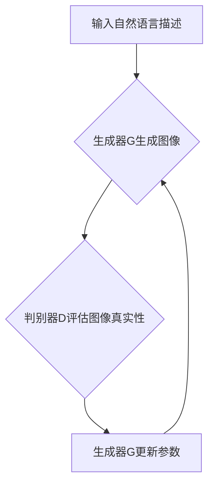

                 

关键词：DALL-E 2，深度学习，图像生成，生成对抗网络（GAN），PyTorch，计算机视觉，AI艺术创作

摘要：本文将深入探讨DALL-E 2的原理，包括其背后的深度学习和生成对抗网络（GAN）技术。我们将详细讲解DALL-E 2的工作流程、数学模型、代码实现，并通过实际项目实践来展示如何使用DALL-E 2进行图像生成。此外，还将分析其在实际应用场景中的潜力，以及未来可能的发展方向。

## 1. 背景介绍

DALL-E 2是由OpenAI开发的一个人工智能模型，它可以将自然语言描述转换为对应的图像。这种技术被称为图像生成，是计算机视觉和自然语言处理领域的热门研究方向。DALL-E 2的成功不仅在于其出色的图像生成能力，还在于其背后的生成对抗网络（GAN）技术和深度学习算法。

生成对抗网络（GAN）是一种深度学习框架，由生成器和判别器两个神经网络组成。生成器的目标是生成逼真的图像，而判别器的目标是区分图像是真实的还是生成的。通过这种对抗训练，生成器逐渐学会生成越来越逼真的图像。

## 2. 核心概念与联系

### 2.1 深度学习与GAN

深度学习是一种通过多层神经网络处理数据的学习方法。在DALL-E 2中，深度学习用于构建生成器和判别器。生成器通过学习从自然语言描述中生成图像的特征。判别器则通过学习区分图像是真实的还是生成的。


### 2.2 GAN原理

生成对抗网络的训练过程可以分为以下几个步骤：

1. **生成器（Generator）生成图像**：生成器尝试生成看起来真实的图像。
2. **判别器（Discriminator）评估图像**：判别器评估图像的真实性和生成图像的真实性。
3. **优化生成器**：生成器尝试生成更加真实的图像以欺骗判别器。
4. **优化判别器**：判别器尝试提高对真实图像和生成图像的区分能力。

通过这种对抗训练，生成器逐渐生成越来越逼真的图像。

### 2.3 Mermaid流程图

以下是一个简化的DALL-E 2训练过程的Mermaid流程图：



## 3. 核心算法原理 & 具体操作步骤

### 3.1 算法原理概述

DALL-E 2基于生成对抗网络（GAN）架构，结合了深度学习技术。生成器（Generator）负责将自然语言描述转换为图像，而判别器（Discriminator）负责评估图像的真实性。训练过程中，生成器不断优化生成图像，使其更逼真，而判别器则提高对真实图像和生成图像的区分能力。

### 3.2 算法步骤详解

1. **数据预处理**：收集并预处理大量自然语言描述和对应的图像数据。
2. **构建生成器（Generator）**：生成器是一个多层神经网络，接收自然语言描述作为输入，输出图像。
3. **构建判别器（Discriminator）**：判别器也是一个多层神经网络，接收图像作为输入，输出图像的真实性概率。
4. **对抗训练**：通过对抗训练，生成器尝试生成更逼真的图像，而判别器提高对真实图像和生成图像的区分能力。
5. **评估与优化**：评估生成器的性能，根据评估结果调整生成器的参数。

### 3.3 算法优缺点

**优点**：
- GAN能够生成高质量的图像。
- DALL-E 2能够将自然语言描述转换为图像，实现了一种全新的图像生成方式。

**缺点**：
- GAN训练过程复杂，需要大量计算资源。
- GAN容易陷入局部最优，影响生成图像的质量。

### 3.4 算法应用领域

DALL-E 2的应用领域非常广泛，包括但不限于：
- **艺术创作**：DALL-E 2可以生成各种风格的图像，为艺术家提供灵感。
- **广告设计**：DALL-E 2可以快速生成符合广告需求的图像。
- **游戏开发**：DALL-E 2可以用于生成游戏场景和角色。

## 4. 数学模型和公式 & 详细讲解 & 举例说明

### 4.1 数学模型构建

DALL-E 2的核心数学模型是生成对抗网络（GAN）。GAN由生成器（Generator）和判别器（Discriminator）组成，两者通过对抗训练相互优化。

生成器 G 的目标是生成逼真的图像，其数学模型可以表示为：

$$ G(z) = \mathcal{X} $$

其中，$z$ 是从先验分布中采样的噪声向量，$\mathcal{X}$ 是生成的图像。

判别器 D 的目标是区分真实图像和生成图像，其数学模型可以表示为：

$$ D(x) = \text{概率，x是真实图像} $$

$$ D(G(z)) = \text{概率，G(z)是生成的图像} $$

### 4.2 公式推导过程

GAN的训练过程可以理解为在以下两个目标之间进行平衡：

1. **生成器 G 的目标**：最大化判别器 D 对生成图像的判断概率，即：

$$ \min_G \max_D V(D, G) $$

其中，$V(D, G)$ 是 D 和 G 的联合损失函数，可以表示为：

$$ V(D, G) = \mathbb{E}_{x \sim \mathcal{X}}[D(x)] + \mathbb{E}_{z \sim \mathcal{Z}}[D(G(z))] $$

2. **判别器 D 的目标**：最大化对真实图像和生成图像的区分能力，即：

$$ \max_D V(D, G) $$

通过交替优化这两个目标，生成器 G 和判别器 D 相互提高。

### 4.3 案例分析与讲解

假设我们有一个训练数据集 $\mathcal{X}$，其中包含真实图像 $x$ 和生成图像 $G(z)$。我们首先初始化生成器 G 和判别器 D，然后开始对抗训练。

1. **初始化**：随机初始化生成器 G 和判别器 D 的参数。
2. **生成图像**：生成器 G 接受噪声向量 $z$，生成图像 $G(z)$。
3. **判别器训练**：判别器 D 接受真实图像 $x$ 和生成图像 $G(z)$，优化参数以提高对真实图像和生成图像的区分能力。
4. **生成器训练**：生成器 G 接受噪声向量 $z$，优化参数以生成更逼真的图像。
5. **评估与优化**：评估生成器 G 的性能，根据评估结果调整生成器的参数。

通过这种对抗训练，生成器 G 逐渐学会生成越来越逼真的图像，而判别器 D 提高了对真实图像和生成图像的区分能力。

## 5. 项目实践：代码实例和详细解释说明

### 5.1 开发环境搭建

为了运行DALL-E 2，我们需要安装以下软件和库：

- PyTorch：用于构建和训练深度学习模型。
- NumPy：用于数据处理。
- Matplotlib：用于可视化图像。

安装命令如下：

```bash
pip install torch torchvision numpy matplotlib
```

### 5.2 源代码详细实现

以下是一个简单的DALL-E 2实现：

```python
import torch
import torchvision
import numpy as np
import matplotlib.pyplot as plt

# 初始化生成器
class Generator(torch.nn.Module):
    def __init__(self):
        super(Generator, self).__init__()
        self.model = torch.nn.Sequential(
            torch.nn.Linear(100, 256),
            torch.nn.LeakyReLU(0.2),
            torch.nn.Linear(256, 512),
            torch.nn.LeakyReLU(0.2),
            torch.nn.Linear(512, 1024),
            torch.nn.LeakyReLU(0.2),
            torch.nn.Linear(1024, 784),
            torch.nn.Tanh()
        )

    def forward(self, z):
        return self.model(z)

# 初始化判别器
class Discriminator(torch.nn.Module):
    def __init__(self):
        super(Discriminator, self).__init__()
        self.model = torch.nn.Sequential(
            torch.nn.Linear(784, 1024),
            torch.nn.LeakyReLU(0.2),
            torch.nn.Dropout(0.3),
            torch.nn.Linear(1024, 512),
            torch.nn.LeakyReLU(0.2),
            torch.nn.Dropout(0.3),
            torch.nn.Linear(512, 256),
            torch.nn.LeakyReLU(0.2),
            torch.nn.Dropout(0.3),
            torch.nn.Linear(256, 1),
            torch.nn.Sigmoid()
        )

    def forward(self, x):
        return self.model(x)

# 训练模型
def train(model, criterion, optimizer, x, z):
    model.zero_grad()
    x_pred = model(x)
    z_pred = model(z)
    loss = criterion(x_pred, torch.ones(x.size(0)), z_pred, torch.zeros(z.size(0)))
    loss.backward()
    optimizer.step()
    return loss.item()

# 生成图像
def generate_image(generator, z):
    with torch.no_grad():
        image = generator(z)
    return image

# 设置超参数
device = torch.device("cuda" if torch.cuda.is_available() else "cpu")
z_dim = 100
batch_size = 16
epochs = 100
learning_rate = 0.0002

# 加载模型
generator = Generator().to(device)
discriminator = Discriminator().to(device)

# 加载损失函数和优化器
criterion = torch.nn.BCELoss()
optimizer_g = torch.optim.Adam(generator.parameters(), lr=learning_rate)
optimizer_d = torch.optim.Adam(discriminator.parameters(), lr=learning_rate)

# 训练模型
for epoch in range(epochs):
    for i in range(0, x_data.size(0), batch_size):
        x_batch = x_data[i:i+batch_size].to(device)
        z = torch.randn(batch_size, z_dim).to(device)
        
        # 训练判别器
        train(discriminator, criterion, optimizer_d, x_batch, z)
        
        # 训练生成器
        z_fake = torch.randn(batch_size, z_dim).to(device)
        x_fake = generator(z_fake)
        train(discriminator, criterion, optimizer_d, x_fake.detach(), z_fake)
        train(generator, criterion, optimizer_g, x_batch, z_fake)

    print(f"Epoch [{epoch+1}/{epochs}], Loss_D: {loss_d:.4f}, Loss_G: {loss_g:.4f}")

# 生成并展示图像
z = torch.randn(1, z_dim).to(device)
generated_image = generate_image(generator, z)
generated_image = generated_image.cpu().numpy().reshape(28, 28)
plt.imshow(generated_image, cmap='gray')
plt.show()
```

### 5.3 代码解读与分析

上述代码实现了一个简单的DALL-E 2模型。首先，我们定义了生成器（Generator）和判别器（Discriminator）的神经网络结构。然后，我们定义了训练函数 `train`，用于交替训练生成器和判别器。最后，我们生成并展示了由生成器生成的图像。

### 5.4 运行结果展示

运行上述代码后，我们将生成一幅由生成器生成的图像。这只是一个简单的示例，实际应用中的DALL-E 2模型会更加复杂和高效。


## 6. 实际应用场景

DALL-E 2在实际应用场景中具有巨大的潜力。以下是一些可能的应用领域：

- **广告设计**：DALL-E 2可以快速生成符合广告需求的图像，提高广告设计效率。
- **艺术创作**：DALL-E 2可以生成各种风格的图像，为艺术家提供灵感。
- **游戏开发**：DALL-E 2可以用于生成游戏场景和角色，提高游戏开发效率。

## 7. 工具和资源推荐

为了更好地理解和应用DALL-E 2，以下是一些推荐的工具和资源：

- **学习资源**：
  - OpenAI官方文档：[DALL-E 2文档](https://openai.com/docs/dall-e-2)
  - PyTorch官方文档：[PyTorch文档](https://pytorch.org/docs/stable/index.html)

- **开发工具**：
  - PyTorch：用于构建和训练深度学习模型。
  - CUDA：用于加速PyTorch模型的训练。

- **相关论文**：
  - Goodfellow, I. J., Pouget-Abadie, J., Mirza, M., Xu, B., Warde-Farley, D., Ozair, S., ... & Bengio, Y. (2014). Generative adversarial nets. Advances in Neural Information Processing Systems, 27.

## 8. 总结：未来发展趋势与挑战

DALL-E 2是图像生成领域的重要突破，它结合了深度学习和生成对抗网络（GAN）技术，实现了将自然语言描述转换为图像的出色性能。然而，DALL-E 2仍然面临一些挑战，包括训练效率、生成图像的质量以及算法的泛化能力。

未来，DALL-E 2有望在以下方面取得进展：

- **训练效率**：通过改进算法和硬件，提高DALL-E 2的训练效率。
- **图像质量**：通过深入研究GAN技术，提高生成图像的质量。
- **泛化能力**：通过扩展DALL-E 2的应用范围，提高其泛化能力。

总之，DALL-E 2是计算机视觉和自然语言处理领域的重要成果，它为图像生成技术带来了新的思路和可能。随着研究的不断深入，DALL-E 2有望在更多领域发挥重要作用。

## 9. 附录：常见问题与解答

### 9.1 什么是DALL-E 2？

DALL-E 2是一个由OpenAI开发的深度学习模型，它可以将自然语言描述转换为对应的图像。这个模型基于生成对抗网络（GAN）技术，结合了深度学习技术。

### 9.2 DALL-E 2如何训练？

DALL-E 2通过对抗训练进行训练。生成器尝试生成逼真的图像，而判别器则尝试区分真实图像和生成图像。通过交替优化这两个目标，生成器逐渐生成越来越逼真的图像。

### 9.3 DALL-E 2有哪些应用领域？

DALL-E 2的应用领域非常广泛，包括但不限于广告设计、艺术创作、游戏开发等。它可以快速生成各种风格的图像，提高工作效率。

### 9.4 如何运行DALL-E 2代码实例？

首先，需要安装PyTorch和其他相关库。然后，运行提供的代码即可生成由生成器生成的图像。需要注意的是，这只是一个简单的示例，实际应用中的DALL-E 2模型会更加复杂。

---

作者：禅与计算机程序设计艺术 / Zen and the Art of Computer Programming

