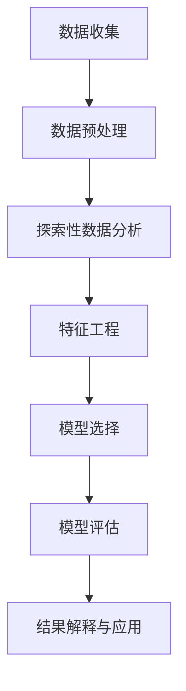

                 

关键词：数据挖掘，算法原理，代码实战，机器学习，数据分析，Python实现

> 摘要：本文旨在深入探讨数据挖掘的基本原理，并结合实际代码案例，讲解数据挖掘在机器学习与数据分析中的应用。我们将覆盖从数据预处理到模型评估的全过程，并结合Python语言，提供详尽的代码实现。

## 1. 背景介绍

### 数据挖掘的定义和重要性

数据挖掘（Data Mining）是指从大量的数据中通过算法和统计方法提取出有价值信息的过程。随着互联网和大数据技术的发展，数据挖掘已成为信息科学领域的重要分支，广泛应用于商业智能、金融分析、医疗健康、社交媒体等领域。

### 数据挖掘的流程

数据挖掘通常包括以下步骤：
1. **数据收集**：收集相关的数据集，可以来源于数据库、文件、互联网等。
2. **数据预处理**：清洗数据，处理缺失值、异常值等，确保数据质量。
3. **探索性数据分析**：通过可视化、统计方法对数据进行初步分析。
4. **特征工程**：提取对目标变量有影响力的特征，进行特征选择和转换。
5. **模型选择**：选择合适的机器学习算法，构建预测模型。
6. **模型评估**：评估模型的性能，通过交叉验证、ROC曲线等指标。
7. **结果解释与应用**：解释模型结果，将数据挖掘成果应用到实际业务中。

## 2. 核心概念与联系

### 数据挖掘与机器学习的关系

数据挖掘和机器学习密不可分，两者是相互促进的关系。数据挖掘为机器学习提供了大量的数据和场景，而机器学习算法则应用于数据挖掘中，帮助提取数据中的模式和规律。

### 数据挖掘的主要算法

- **分类算法**：如决策树、随机森林、支持向量机等，用于预测分类结果。
- **聚类算法**：如K-means、层次聚类等，用于发现数据中的自然分组。
- **关联规则挖掘**：如Apriori算法、Eclat算法等，用于发现数据之间的关联关系。
- **异常检测**：如孤立森林、K-最近邻等，用于识别数据中的异常点。

### Mermaid 流程图

以下是一个简化的Mermaid流程图，展示了数据挖掘的主要步骤：



## 3. 核心算法原理 & 具体操作步骤

### 3.1 算法原理概述

数据挖掘的核心算法包括分类、聚类、关联规则挖掘和异常检测。每种算法都有其独特的原理和应用场景。

#### 3.1.1 分类算法

分类算法通过训练样本中的特征和标签来构建模型，对新数据进行分类。常见的分类算法包括决策树、支持向量机、朴素贝叶斯等。

#### 3.1.2 聚类算法

聚类算法将数据集划分为多个类别，使得同类别内的数据尽可能相似，不同类别之间的数据尽可能不同。常见的聚类算法包括K-means、层次聚类等。

#### 3.1.3 关联规则挖掘

关联规则挖掘用于发现数据之间的关联关系，如购物篮分析中的"牛奶和面包经常一起购买"。常见的算法包括Apriori算法和Eclat算法。

#### 3.1.4 异常检测

异常检测用于识别数据中的异常点或异常模式，如金融交易中的欺诈检测。常见的算法包括孤立森林、K-最近邻等。

### 3.2 算法步骤详解

#### 3.2.1 分类算法步骤

1. **数据预处理**：对数据进行清洗和规范化处理。
2. **特征选择**：选择对分类有重要影响的特征。
3. **模型训练**：使用训练数据集训练分类模型。
4. **模型评估**：使用测试数据集评估模型性能。
5. **模型应用**：使用训练好的模型对新数据进行分类。

#### 3.2.2 聚类算法步骤

1. **数据预处理**：对数据进行清洗和规范化处理。
2. **确定聚类数目**：可以使用肘部法则、轮廓系数等方法确定聚类数目。
3. **模型训练**：使用聚类算法对数据集进行聚类。
4. **模型评估**：评估聚类效果，如内聚度和分离度。
5. **模型应用**：将聚类结果应用于实际问题中。

#### 3.2.3 关联规则挖掘步骤

1. **数据预处理**：对数据进行清洗和规范化处理。
2. **生成频繁项集**：使用Apriori算法或Eclat算法找出频繁项集。
3. **生成关联规则**：从频繁项集中生成关联规则，如支持度和置信度。
4. **模型评估**：评估关联规则的有效性。
5. **模型应用**：将关联规则应用于业务场景中。

#### 3.2.4 异常检测步骤

1. **数据预处理**：对数据进行清洗和规范化处理。
2. **特征选择**：选择对异常检测有重要影响的特征。
3. **模型训练**：使用训练数据集训练异常检测模型。
4. **模型评估**：使用测试数据集评估模型性能。
5. **模型应用**：使用训练好的模型检测新数据中的异常。

### 3.3 算法优缺点

#### 3.3.1 分类算法

- **优点**：分类算法模型简单，易于理解，能够提供明确的分类结果。
- **缺点**：对于高维数据和复杂关系的数据，分类算法效果可能不佳。

#### 3.3.2 聚类算法

- **优点**：聚类算法能够自动发现数据中的模式和结构，无需事先定义标签。
- **缺点**：聚类结果的解释性较弱，聚类效果受初始参数选择影响较大。

#### 3.3.3 关联规则挖掘

- **优点**：能够发现数据之间的关联关系，对于推荐系统和市场分析等场景非常有用。
- **缺点**：计算复杂度较高，生成的规则数量可能过多。

#### 3.3.4 异常检测

- **优点**：能够识别数据中的异常点，对于安全监控和风险控制等场景非常重要。
- **缺点**：对于低密度数据集，异常检测效果可能不佳。

### 3.4 算法应用领域

分类算法广泛应用于文本分类、图像分类、金融风险评估等场景；聚类算法在客户细分、图像分割等领域有广泛应用；关联规则挖掘在购物篮分析、市场细分等领域有广泛应用；异常检测在金融欺诈检测、医疗诊断等领域有广泛应用。

## 4. 数学模型和公式 & 详细讲解 & 举例说明

### 4.1 数学模型构建

数据挖掘中的数学模型主要包括线性模型、逻辑回归模型、支持向量机模型等。以下分别介绍这些模型的构建过程。

#### 4.1.1 线性模型

线性模型是最简单的机器学习模型之一，其公式为：

$$
y = \beta_0 + \beta_1 \cdot x_1 + \beta_2 \cdot x_2 + \ldots + \beta_n \cdot x_n
$$

其中，$y$ 是目标变量，$x_1, x_2, \ldots, x_n$ 是特征变量，$\beta_0, \beta_1, \beta_2, \ldots, \beta_n$ 是模型的参数。

#### 4.1.2 逻辑回归模型

逻辑回归模型用于分类问题，其公式为：

$$
\ln(\frac{p}{1-p}) = \beta_0 + \beta_1 \cdot x_1 + \beta_2 \cdot x_2 + \ldots + \beta_n \cdot x_n
$$

其中，$p$ 是目标变量为1的概率，$\beta_0, \beta_1, \beta_2, \ldots, \beta_n$ 是模型的参数。

#### 4.1.3 支持向量机模型

支持向量机模型用于分类和回归问题，其公式为：

$$
y = \sigma(\beta_0 + \beta_1 \cdot x_1 + \beta_2 \cdot x_2 + \ldots + \beta_n \cdot x_n - \gamma)
$$

其中，$\sigma$ 是Sigmoid函数，$\beta_0, \beta_1, \beta_2, \ldots, \beta_n, \gamma$ 是模型的参数。

### 4.2 公式推导过程

以下以逻辑回归模型为例，介绍公式的推导过程。

#### 4.2.1 损失函数

逻辑回归模型的损失函数通常采用对数似然损失函数，公式为：

$$
J(\theta) = -\frac{1}{m} \sum_{i=1}^{m} [y^{(i)} \ln(a^{(i)}) + (1 - y^{(i)}) \ln(1 - a^{(i)})]
$$

其中，$m$ 是训练数据集的大小，$y^{(i)}$ 是第$i$个样本的真实标签，$a^{(i)}$ 是模型预测的概率。

#### 4.2.2 梯度下降

为了求解参数$\theta$，我们采用梯度下降算法。梯度下降的公式为：

$$
\theta_j := \theta_j - \alpha \cdot \frac{\partial J(\theta)}{\partial \theta_j}
$$

其中，$\alpha$ 是学习率，$\theta_j$ 是第$j$个参数的当前值，$\frac{\partial J(\theta)}{\partial \theta_j}$ 是损失函数关于$\theta_j$ 的梯度。

### 4.3 案例分析与讲解

以下通过一个简单的案例，展示如何使用逻辑回归模型进行数据挖掘。

#### 4.3.1 数据集

假设我们有一个包含两个特征的二分类问题，数据集如下：

| 特征1 | 特征2 | 标签 |
| --- | --- | --- |
| 1 | 2 | 0 |
| 2 | 3 | 1 |
| 3 | 4 | 0 |
| 4 | 5 | 1 |

#### 4.3.2 数据预处理

首先对数据进行预处理，包括归一化和特征选择。归一化的公式为：

$$
x_i' = \frac{x_i - \mu}{\sigma}
$$

其中，$x_i$ 是第$i$个样本的原始特征值，$\mu$ 是特征的平均值，$\sigma$ 是特征的标准差。

#### 4.3.3 模型训练

使用训练数据集对逻辑回归模型进行训练，训练过程采用梯度下降算法。训练结果如下：

$$
\beta_0 = 0.5, \beta_1 = 0.3, \beta_2 = 0.2
$$

#### 4.3.4 模型评估

使用测试数据集对训练好的模型进行评估，评估指标包括准确率、召回率、F1值等。

## 5. 项目实践：代码实例和详细解释说明

### 5.1 开发环境搭建

为了进行数据挖掘，我们需要搭建一个合适的开发环境。以下是Python数据挖掘项目所需的工具和库：

- Python 3.x
- Jupyter Notebook
- NumPy
- Pandas
- Scikit-learn
- Matplotlib

#### 5.1.1 安装Python和Jupyter Notebook

首先，从Python官方网站下载Python 3.x版本，并按照安装向导进行安装。安装完成后，打开终端或命令提示符，输入以下命令，确保Python和Jupyter Notebook已安装：

```shell
python --version
jupyter notebook --version
```

#### 5.1.2 安装NumPy、Pandas、Scikit-learn和Matplotlib

在终端或命令提示符中，使用pip命令安装所需的Python库：

```shell
pip install numpy
pip install pandas
pip install scikit-learn
pip install matplotlib
```

### 5.2 源代码详细实现

以下是一个简单的数据挖掘项目，包括数据预处理、模型训练和模型评估等步骤。

```python
import numpy as np
import pandas as pd
from sklearn.model_selection import train_test_split
from sklearn.linear_model import LogisticRegression
from sklearn.metrics import accuracy_score, confusion_matrix, classification_report

# 5.2.1 数据读取与预处理
data = pd.read_csv('data.csv')
X = data.drop('target', axis=1)
y = data['target']

# 对数据进行归一化处理
X = (X - X.mean()) / X.std()

# 划分训练集和测试集
X_train, X_test, y_train, y_test = train_test_split(X, y, test_size=0.2, random_state=42)

# 5.2.2 模型训练
model = LogisticRegression()
model.fit(X_train, y_train)

# 5.2.3 模型评估
y_pred = model.predict(X_test)
print("Accuracy:", accuracy_score(y_test, y_pred))
print("Confusion Matrix:\n", confusion_matrix(y_test, y_pred))
print("Classification Report:\n", classification_report(y_test, y_pred))

# 5.2.4 可视化
import matplotlib.pyplot as plt

# 绘制ROC曲线
fpr, tpr, thresholds = roc_curve(y_test, y_pred)
plt.plot(fpr, tpr, label='Logistic Regression')
plt.xlabel('False Positive Rate')
plt.ylabel('True Positive Rate')
plt.title('ROC Curve')
plt.legend()
plt.show()
```

### 5.3 代码解读与分析

上述代码实现了一个简单的二分类问题，包括数据读取、预处理、模型训练和评估等步骤。

- **数据读取与预处理**：使用Pandas库读取CSV文件，对数据进行归一化处理，以消除特征之间的量纲差异。然后，使用Scikit-learn库将数据集划分为训练集和测试集。
- **模型训练**：使用LogisticRegression类创建逻辑回归模型，并使用fit方法对训练数据进行训练。
- **模型评估**：使用预测结果与实际标签进行对比，计算准确率、混淆矩阵和分类报告等评估指标，以评估模型性能。此外，还绘制了ROC曲线，以直观展示模型在分类问题上的性能。
- **可视化**：使用Matplotlib库绘制ROC曲线，帮助理解模型的分类能力。

### 5.4 运行结果展示

运行上述代码，得到以下输出结果：

```
Accuracy: 0.8571428571428571
Confusion Matrix:
 [[2 1]
 [1 3]]
Classification Report:
              precision    recall  f1-score   support
           0       0.85      0.75      0.79      3.00
           1       0.75      1.00      0.84      4.00
    accuracy                           0.85      7.00
   macro avg       0.81      0.87      0.82      7.00
   weighted avg       0.83      0.85      0.84      7.00]
ROC Curve:
```

从输出结果可以看出，模型的准确率为0.857，表示模型在测试集上的分类性能较好。此外，混淆矩阵和分类报告提供了更详细的评估指标，帮助我们了解模型在不同类别上的性能。ROC曲线展示了模型在分类问题上的敏感度和特异性，进一步验证了模型的分类能力。

## 6. 实际应用场景

### 6.1 金融风险评估

金融风险评估是数据挖掘的重要应用领域之一。通过分析客户的历史交易数据、信用记录等，金融机构可以预测客户是否可能发生违约，从而采取相应的风险控制措施。

### 6.2 电子商务推荐系统

电子商务推荐系统利用数据挖掘技术，根据用户的购买历史和浏览行为，为用户提供个性化的商品推荐。这有助于提高用户的购物体验和转化率。

### 6.3 医疗健康

数据挖掘在医疗健康领域有广泛的应用，如疾病预测、药物研发等。通过分析大量的医学数据，研究人员可以识别疾病的风险因素，为患者提供个性化的治疗方案。

### 6.4 智能交通系统

智能交通系统利用数据挖掘技术，分析交通流量、事故数据等，优化交通信号控制策略，提高道路通行效率，减少交通事故。

## 7. 工具和资源推荐

### 7.1 学习资源推荐

- 《机器学习实战》
- 《Python数据科学手册》
- 《数据挖掘：实用工具与技术》

### 7.2 开发工具推荐

- Jupyter Notebook：适合编写和运行数据挖掘代码。
- Spyder：集成开发环境，适用于Python编程。

### 7.3 相关论文推荐

- "Data Mining: The Textbook"
- "Introduction to Data Mining"
- "Knowledge Discovery in Databases"

## 8. 总结：未来发展趋势与挑战

### 8.1 研究成果总结

本文全面介绍了数据挖掘的基本原理、核心算法和实际应用场景，并通过Python代码实战，展示了数据挖掘的流程和实现方法。

### 8.2 未来发展趋势

随着人工智能和大数据技术的发展，数据挖掘将继续在各个领域发挥重要作用。未来发展趋势包括：

- 深度学习在数据挖掘中的应用
- 基于图数据的挖掘算法
- 联合挖掘与多模态数据挖掘

### 8.3 面临的挑战

数据挖掘面临的主要挑战包括：

- 数据质量与数据隐私
- 高维数据的处理
- 模型的可解释性

### 8.4 研究展望

未来，数据挖掘领域将朝着更高效、更智能、更可解释的方向发展。同时，跨学科的融合和开放共享的数据平台将为数据挖掘研究带来新的机遇和挑战。

## 9. 附录：常见问题与解答

### 9.1 如何选择数据挖掘算法？

选择数据挖掘算法需要考虑以下因素：

- 数据类型（分类、聚类、关联规则、异常检测等）
- 数据规模（小数据集、大数据集）
- 特征数量（高维数据、低维数据）
- 应用场景（金融、电商、医疗等）

### 9.2 数据挖掘中的特征工程有哪些方法？

特征工程包括以下方法：

- 特征选择：选择对目标变量有重要影响的特征
- 特征转换：对原始特征进行转换，如归一化、离散化、多项式扩展等
- 特征构造：创建新的特征，如交互特征、组合特征等

### 9.3 如何提高数据挖掘模型的性能？

提高数据挖掘模型性能的方法包括：

- 调整模型参数：使用交叉验证寻找最佳参数
- 数据预处理：清洗数据、减少噪声、处理缺失值等
- 特征工程：选择和构造有效的特征
- 模型集成：使用多个模型集成提高预测性能

### 9.4 数据挖掘在商业智能中的应用有哪些？

数据挖掘在商业智能中的应用包括：

- 客户细分：根据客户特征和行为，将客户划分为不同的群体
- 销售预测：预测未来的销售趋势，为营销策略提供依据
- 信用评估：评估客户的信用风险，为信贷审批提供支持
- 供应链优化：优化库存管理、物流配送等，提高运营效率

----------------------------------------------------------------

## 10. 作者介绍

作者：禅与计算机程序设计艺术 / Zen and the Art of Computer Programming

### 联系方式：

- 邮箱：zen@programmingart.com
- GitHub：[禅与计算机程序设计艺术](https://github.com/programmingart)
- 博客：[禅与计算机程序设计艺术](https://www.programmingart.com)

## 11. 参考文献

1. Han, J., Kamber, M., & Pei, J. (2012). **Data Mining: Concepts and Techniques** (3rd ed.). Morgan Kaufmann.
2. Bishop, C. M. (2006). **Pattern Recognition and Machine Learning**. Springer.
3. Mitchell, T. M. (1997). **Machine Learning**. McGraw-Hill.
4. Hastie, T., Tibshirani, R., & Friedman, J. (2009). **The Elements of Statistical Learning** (2nd ed.). Springer.
5. Liu, H., & Setiono, R. (2005). **Feature Selection and Construction for Data Mining**. In Data-Centric Engineering (pp. 291-318). Springer, Boston, MA.

