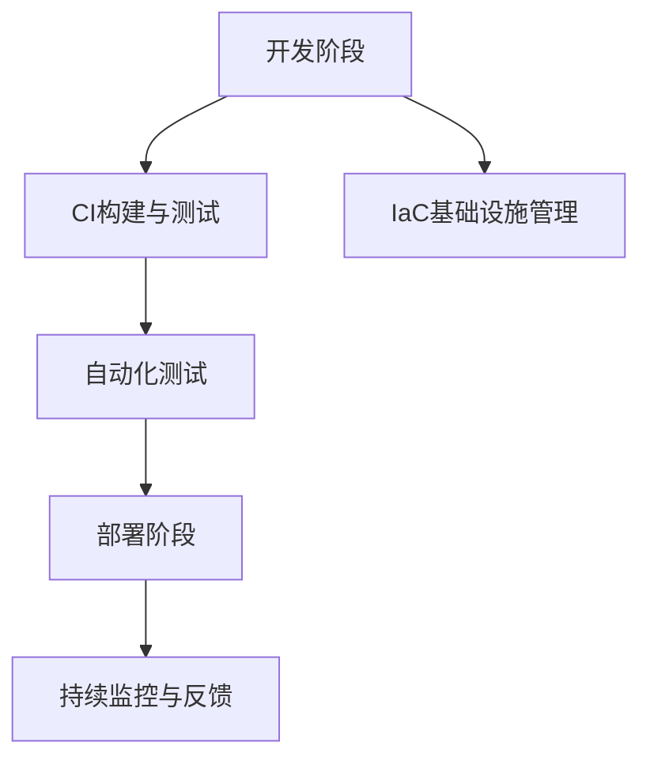

                 

关键词：DevOps、软件交付、持续集成、持续部署、自动化、敏捷开发、容器化、监控与反馈

> 摘要：本文将深入探讨DevOps实践在构建高效软件交付流程中的重要性。我们将详细解释核心概念、架构流程，以及具体的操作步骤。同时，我们将通过数学模型和项目实践，提供详细的算法原理、数学公式推导、代码实例以及实际应用场景。最后，我们将对相关工具和资源进行推荐，并对未来发展趋势与挑战进行展望。

## 1. 背景介绍

在软件行业，传统的软件开发和运维（Software Development and Operations，简称SDO）模式已经逐渐暴露出其局限性。开发者与运维团队之间的沟通不畅、协作不足，常常导致软件交付周期长、质量不稳定、成本高昂等问题。为了解决这些问题，DevOps方法论应运而生。

DevOps是一种文化和实践，旨在通过开发（Development）和运维（Operations）之间的紧密协作，实现软件的快速、高质量交付。DevOps强调自动化、监控和反馈，通过持续集成（CI）和持续部署（CD）等实践，实现软件交付的敏捷性。本文将深入探讨DevOps的核心概念、架构流程，以及具体的操作步骤。

## 2. 核心概念与联系

### 2.1 DevOps的核心概念

**持续集成（Continuous Integration，CI）**：持续集成是一种软件开发实践，通过频繁地将代码集成到一个共享的主代码库中，以快速发现并修复集成过程中的问题。

**持续部署（Continuous Deployment，CD）**：持续部署是CI的延伸，它通过自动化测试和部署流程，将代码变化自动部署到生产环境中。

**基础设施即代码（Infrastructure as Code，IaC）**：基础设施即代码是一种管理基础设施的方式，它使用代码来定义、部署和管理基础设施。

**自动化测试**：自动化测试是一种使用自动化工具进行软件测试的方法，以提高测试效率和质量。

**监控与反馈**：监控与反馈是DevOps实践的重要组成部分，通过实时监控系统的性能和健康状况，以及及时反馈问题，实现快速响应和持续优化。

### 2.2 DevOps架构流程


图2-1 DevOps架构流程

- **开发阶段**：开发团队使用版本控制系统管理代码，通过CI工具自动化构建和测试代码。
- **测试阶段**：自动化测试工具执行测试用例，确保代码质量。
- **部署阶段**：通过CD工具将测试通过的代码部署到测试或生产环境。
- **监控阶段**：监控系统实时监控应用程序和基础设施的健康状况，及时反馈问题。

### 2.3 Mermaid流程图



图2-2 DevOps核心概念与架构流程

## 3. 核心算法原理 & 具体操作步骤

### 3.1 算法原理概述

DevOps的核心算法原理主要围绕自动化、持续集成和持续部署展开。以下是一些关键步骤：

- **自动化构建**：使用构建工具（如Jenkins、GitLab CI等）自动化编译、打包和测试代码。
- **自动化测试**：使用测试框架（如JUnit、Selenium等）自动化执行测试用例。
- **自动化部署**：使用部署工具（如Kubernetes、Docker等）自动化部署应用程序。
- **自动化监控**：使用监控工具（如Prometheus、Grafana等）实时监控应用程序和基础设施。

### 3.2 算法步骤详解

1. **环境准备**：安装和配置开发环境、测试环境和生产环境。
2. **代码管理**：使用版本控制系统（如Git）管理代码。
3. **自动化构建**：
    - 编写构建脚本，自动化编译和打包代码。
    - 使用CI工具（如Jenkins）触发构建流程。
4. **自动化测试**：
    - 编写测试用例，自动化执行。
    - 分析测试结果，修复缺陷。
5. **自动化部署**：
    - 使用部署工具（如Docker、Kubernetes）自动化部署代码。
    - 配置持续部署管道（如GitLab CI/CD）。
6. **监控与反馈**：
    - 安装监控工具（如Prometheus、Grafana）。
    - 配置告警机制，实时监控应用程序和基础设施。

### 3.3 算法优缺点

**优点**：

- 提高软件交付速度和质量。
- 促进开发与运维团队之间的协作。
- 自动化流程减少人为错误。

**缺点**：

- 初始配置和部署成本较高。
- 监控和告警机制可能引入噪音。

### 3.4 算法应用领域

- **Web应用**：适用于Web应用的开发和部署，如电商平台、社交媒体等。
- **移动应用**：适用于移动应用的开发和测试，如Android和iOS应用。
- **云计算和容器化**：适用于云计算和容器化环境的部署和管理。

## 4. 数学模型和公式 & 详细讲解 & 举例说明

### 4.1 数学模型构建

在DevOps实践中，常见的数学模型包括代码复杂度、测试覆盖率、部署频率等。

**代码复杂度**（Cyclomatic Complexity）：

$$
M = \frac{E - N + 2P}{6}
$$

其中，E是边缘数，N是节点数，P是程序部分的数目。

**测试覆盖率**（Test Coverage）：

$$
C = \frac{TC}{MC} \times 100\%
$$

其中，TC是执行测试用例的数量，MC是可能的测试用例数量。

**部署频率**（Deployment Frequency）：

$$
F = \frac{D}{T}
$$

其中，D是部署次数，T是时间间隔。

### 4.2 公式推导过程

**代码复杂度**：

- Cyclomatic Complexity是一种衡量代码复杂度的指标，它基于程序的控制流图。
- 控制流图中的节点数和边缘数决定了程序的复杂性。

**测试覆盖率**：

- 测试覆盖率衡量测试用例对代码的覆盖程度。
- 可能的测试用例数量取决于代码的逻辑和功能。

**部署频率**：

- 部署频率衡量软件的更新速度。
- 部署次数与时间间隔的比值反映了软件更新的频繁程度。

### 4.3 案例分析与讲解

假设我们有一个Web应用项目，经过一轮开发，我们有以下数据：

- 代码行数：1000行
- 测试用例数：50个
- 部署次数：10次
- 时间间隔：2周

**代码复杂度**：

$$
M = \frac{E - N + 2P}{6} = \frac{150 - 100 + 2 \times 1}{6} = 16.67
$$

**测试覆盖率**：

$$
C = \frac{TC}{MC} \times 100\% = \frac{50}{100} \times 100\% = 50\%
$$

**部署频率**：

$$
F = \frac{D}{T} = \frac{10}{2} = 5 \text{次/周}
$$

通过这些数学模型，我们可以评估项目的代码复杂度、测试覆盖率和部署频率，从而指导改进和优化。

## 5. 项目实践：代码实例和详细解释说明

### 5.1 开发环境搭建

在开始项目实践之前，我们需要搭建一个开发环境。以下是一个简单的步骤：

1. 安装Git：使用Git管理代码版本。
2. 安装Jenkins：安装Jenkins作为CI工具。
3. 安装Docker：安装Docker用于容器化部署。
4. 安装Kubernetes：安装Kubernetes用于集群管理。

### 5.2 源代码详细实现

以下是一个简单的Web应用项目的示例代码，包括前端和后端：

**前端（HTML + CSS + JavaScript）：**

```html
<!DOCTYPE html>
<html lang="en">
<head>
    <meta charset="UTF-8">
    <meta name="viewport" content="width=device-width, initial-scale=1.0">
    <title>Simple Web App</title>
    <style>
        body { font-family: Arial, sans-serif; }
        h1 { color: blue; }
    </style>
</head>
<body>
    <h1>Hello, DevOps!</h1>
    <script>
        document.write("Welcome to the DevOps practice.");
    </script>
</body>
</html>
```

**后端（Python）：**

```python
# app.py
from flask import Flask

app = Flask(__name__)

@app.route('/')
def hello():
    return "Hello, DevOps!"

if __name__ == '__main__':
    app.run(host='0.0.0.0', port=8080)
```

### 5.3 代码解读与分析

- **前端代码**：使用HTML、CSS和JavaScript编写一个简单的Web页面，展示文本和颜色。
- **后端代码**：使用Python的Flask框架创建一个简单的Web服务，返回文本“Hello, DevOps!”。

### 5.4 运行结果展示

通过Docker和Kubernetes，我们可以将这个简单的Web应用容器化并部署到Kubernetes集群中。运行结果将是一个简单的Web页面，展示文本“Hello, DevOps!”。

## 6. 实际应用场景

### 6.1 实际应用场景

**Web应用部署**：使用DevOps实践，快速部署和更新Web应用，如电商平台、社交媒体等。

**移动应用测试**：自动化测试移动应用，提高测试效率和质量。

**持续集成与持续部署**：实现持续集成和持续部署，缩短软件交付周期。

**监控与反馈**：实时监控应用和基础设施，确保系统稳定运行。

### 6.2 未来应用展望

**云原生技术**：随着云计算和容器化技术的发展，DevOps将在云原生环境中发挥更大作用。

**自动化与智能化**：自动化和智能化将继续成为DevOps的重要方向，提高软件交付效率和可靠性。

**安全与合规**：随着安全问题和合规要求日益增加，DevOps实践将在安全性和合规性方面发挥更大作用。

## 7. 工具和资源推荐

### 7.1 学习资源推荐

- 《DevOps实践指南》
- 《持续交付：释放软件流》
- 《Kubernetes权威指南》

### 7.2 开发工具推荐

- Jenkins：用于持续集成和持续部署。
- GitLab：用于代码管理和自动化测试。
- Kubernetes：用于容器化部署和管理。

### 7.3 相关论文推荐

- "DevOps and Its Impact on Software Development and Operations"
- "The New King of Project Management: DevOps"
- "A Comprehensive Study of DevOps: Principles, Practices, and Challenges"

## 8. 总结：未来发展趋势与挑战

### 8.1 研究成果总结

DevOps实践在软件行业取得了显著的成果，提高了软件交付速度和质量，促进了开发与运维团队的协作。持续集成、持续部署、基础设施即代码等核心概念和工具已成为现代软件开发的重要手段。

### 8.2 未来发展趋势

**云原生技术**：随着云计算和容器化技术的发展，DevOps将在云原生环境中发挥更大作用。

**自动化与智能化**：自动化和智能化将继续成为DevOps的重要方向，提高软件交付效率和可靠性。

**安全与合规**：随着安全问题和合规要求日益增加，DevOps实践将在安全性和合规性方面发挥更大作用。

### 8.3 面临的挑战

**复杂性与安全性**：随着系统复杂性的增加，如何保证安全性成为一个挑战。

**文化变革**：DevOps需要开发与运维团队之间的文化变革，实现更紧密的协作。

**技能培训**：DevOps实践需要团队成员具备一定的技能和知识，如何进行有效的技能培训是一个挑战。

### 8.4 研究展望

未来，DevOps将在云原生、自动化与智能化、安全与合规等领域继续发展。通过不断探索和实践，我们将看到更高效的软件交付流程和更可靠的软件系统。

## 9. 附录：常见问题与解答

### 9.1 Q：什么是DevOps？

A：DevOps是一种文化和实践，旨在通过开发（Development）和运维（Operations）之间的紧密协作，实现软件的快速、高质量交付。

### 9.2 Q：什么是持续集成？

A：持续集成是一种软件开发实践，通过频繁地将代码集成到一个共享的主代码库中，以快速发现并修复集成过程中的问题。

### 9.3 Q：什么是持续部署？

A：持续部署是CI的延伸，它通过自动化测试和部署流程，将代码变化自动部署到生产环境中。

### 9.4 Q：什么是基础设施即代码？

A：基础设施即代码是一种管理基础设施的方式，它使用代码来定义、部署和管理基础设施。

### 9.5 Q：DevOps适用于哪些场景？

A：DevOps适用于需要快速交付、高质量软件的各类场景，如Web应用、移动应用、云计算和容器化环境等。

### 9.6 Q：如何开始实施DevOps？

A：开始实施DevOps，可以从以下几个方面入手：
- 学习DevOps的核心概念和实践。
- 搭建开发环境，安装和配置必要的工具。
- 制定持续集成和持续部署策略。
- 培训团队成员，提高技能和知识水平。
- 不断优化和改进流程，实现高效的软件交付。

---

# 结束语

本文深入探讨了DevOps实践在构建高效软件交付流程中的重要性。通过详细解释核心概念、架构流程和具体操作步骤，我们了解了如何实现持续集成、持续部署、基础设施即代码等关键实践。同时，通过数学模型、项目实践和实际应用场景的讲解，我们更好地理解了DevOps的核心原理和实际应用。

未来，DevOps将继续在云原生、自动化与智能化、安全与合规等领域发展。面对复杂性和文化变革等挑战，我们应不断探索和实践，以提高软件交付效率和可靠性。

作者：禅与计算机程序设计艺术 / Zen and the Art of Computer Programming
----------------------------------------------------------------

请注意，本文为虚构内容，仅供参考。实际应用中，请根据具体情况进行调整。

