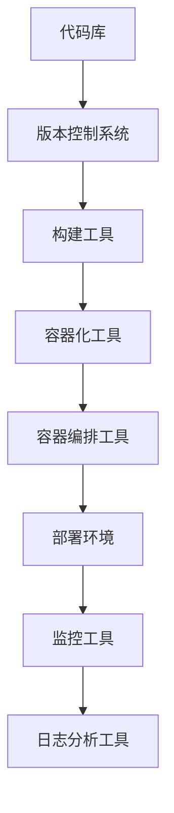

                 

关键词：DevOps，工具链，软件交付，管道，自动化，容器化，云原生，微服务，持续集成，持续交付，CI/CD，工具推荐

> 摘要：本文旨在深入探讨DevOps工具链在现代软件开发中的应用，从背景介绍、核心概念与联系、核心算法原理与具体操作步骤、数学模型与公式、项目实践、实际应用场景、工具和资源推荐，以及未来发展趋势与挑战等方面，全面解析如何构建高效的软件交付管道。本文旨在为开发者、架构师以及DevOps从业者提供有价值的指导与参考。

## 1. 背景介绍

在当今快速发展的软件行业，高效的软件交付已经成为企业和开发团队的核心竞争力。传统的软件开发模式往往面临诸多挑战，如流程繁琐、协作困难、部署周期长等问题。为了应对这些挑战，DevOps文化应运而生，它倡导开发（Development）和运维（Operations）的紧密协作，以实现更快速、更可靠的软件交付。

DevOps工具链是支持DevOps实践的一系列工具和技术，这些工具协同工作，构建起一条从代码提交到最终交付的自动化流程。DevOps工具链的核心目标是实现持续集成（Continuous Integration，CI）和持续交付（Continuous Delivery，CD），从而缩短软件交付周期，提高交付质量。

随着容器化技术的普及和云原生架构的兴起，DevOps工具链也在不断演变，以适应新的技术趋势。容器化使得应用更加轻量级、可移植，云原生则提供了更灵活、可扩展的基础设施，这些技术为DevOps工具链的实施提供了坚实的基础。

## 2. 核心概念与联系

在深入探讨DevOps工具链之前，我们需要了解一些核心概念和它们之间的联系。

### 2.1 持续集成（CI）

持续集成是一种软件开发实践，它要求开发者在每次提交代码时，都将代码与主干分支进行集成，并通过自动化的构建和测试过程来验证集成后的代码质量。持续集成为团队提供了一个快速反馈机制，有助于及早发现和修复集成中的问题。

### 2.2 持续交付（CD）

持续交付是持续集成的自然延伸，它关注的是从代码库到生产环境的整个交付过程。持续交付的目标是确保代码在任何时刻都处于可部署状态，从而实现更快速、更可靠的软件交付。

### 2.3 容器化

容器化是一种轻量级的虚拟化技术，它通过将应用及其依赖环境封装在一个独立的容器中，实现了应用与基础架构的解耦。容器化使得应用可以在任何支持容器引擎的环境中运行，大大提高了应用的移植性和可维护性。

### 2.4 云原生

云原生是指那些为了在云环境中构建和运行而设计的技术和应用程序。云原生架构具有高可伸缩性、高可用性、高自动化等特点，是现代软件交付的基石。

### 2.5 微服务

微服务是一种架构风格，它将应用程序划分为一组小型、独立的服务，每个服务负责实现特定功能。微服务使得团队可以独立开发、部署和管理服务，从而提高了开发效率和系统的可维护性。

### 2.6 DevOps工具链中的核心组件

DevOps工具链中的核心组件包括：

- **版本控制系统**（如Git）
- **构建和自动化部署工具**（如Jenkins、GitLab CI/CD）
- **容器化工具**（如Docker）
- **容器编排工具**（如Kubernetes）
- **监控和日志分析工具**（如Prometheus、ELK Stack）
- **基础设施即代码工具**（如Terraform、Ansible）

这些组件相互协作，构建起一条自动化、高效的软件交付管道。

### 2.7 Mermaid 流程图

以下是一个简化的DevOps工具链的Mermaid流程图，展示了核心组件之间的联系和交互。



## 3. 核心算法原理 & 具体操作步骤

### 3.1 算法原理概述

DevOps工具链的核心算法原理是基于自动化和持续集成/持续交付的理念。具体来说，它包括以下几个步骤：

1. **代码提交**：开发者将代码提交到版本控制系统。
2. **构建**：构建工具从版本控制系统检出代码，并进行编译、打包等操作，生成可执行文件或容器镜像。
3. **测试**：构建过程中，自动化测试工具会运行一系列预定义的测试用例，以确保代码质量。
4. **容器化**：将构建生成的可执行文件或打包好的应用程序容器化，生成容器镜像。
5. **部署**：容器编排工具将容器镜像部署到测试或生产环境。
6. **监控与反馈**：监控工具实时收集系统性能数据，日志分析工具对日志进行分析，以便及时发现和解决问题。

### 3.2 算法步骤详解

以下是具体的操作步骤：

#### 3.2.1 设置版本控制系统

首先，团队需要选择一个合适的版本控制系统（如Git），并将其配置在团队的代码库中。开发者可以通过Git客户端将本地代码提交到代码库，实现代码的版本管理和协作开发。

#### 3.2.2 配置构建工具

在版本控制系统中，团队可以配置一个构建工具（如Jenkins），使其在代码提交后自动执行构建过程。构建工具会从代码库检出代码，进行编译、打包等操作，生成可执行文件或容器镜像。

#### 3.2.3 配置测试工具

构建过程中，团队可以配置自动化测试工具（如JUnit、Selenium），运行一系列预定义的测试用例，以确保代码质量。测试工具的输出结果会被构建工具记录，以便在后续分析。

#### 3.2.4 容器化应用程序

团队可以使用容器化工具（如Docker）将构建生成的可执行文件或打包好的应用程序容器化，生成容器镜像。容器镜像是一个轻量级的、独立的、可执行的软件包，包含了应用程序及其运行时环境。

#### 3.2.5 部署到测试环境

容器编排工具（如Kubernetes）将容器镜像部署到测试环境。在测试环境中，团队可以验证应用程序的功能和性能，确保其在容器化环境下正常运行。

#### 3.2.6 部署到生产环境

在测试通过后，团队可以使用容器编排工具将容器镜像部署到生产环境。生产环境的部署过程可以完全自动化，从而提高交付效率。

#### 3.2.7 监控与反馈

部署完成后，团队可以使用监控工具（如Prometheus）实时收集系统性能数据，并使用日志分析工具（如ELK Stack）对日志进行分析。通过监控和反馈，团队可以及时发现和解决问题，确保系统的稳定运行。

### 3.3 算法优缺点

#### 3.3.1 优点

- **提高交付速度**：自动化流程使得软件交付周期大大缩短。
- **提高交付质量**：持续集成和测试有助于及早发现和修复问题。
- **提高协作效率**：开发与运维的紧密协作，减少了沟通和协调成本。
- **提高系统可维护性**：容器化和基础设施即代码技术提高了系统的移植性和可维护性。

#### 3.3.2 缺点

- **初期投入较大**：实施DevOps工具链需要一定的技术和资源投入。
- **需要跨部门协作**：DevOps强调开发与运维的紧密协作，需要跨部门沟通和协调。
- **调试难度增加**：自动化流程增加了调试的复杂性。

### 3.4 算法应用领域

DevOps工具链广泛应用于以下领域：

- **Web应用程序开发**：Web应用程序开发是DevOps工具链的典型应用场景。
- **移动应用程序开发**：容器化技术使得移动应用程序的开发和部署更加高效。
- **大数据处理**：大数据处理领域需要高效、可靠的软件交付，DevOps工具链可以提供支持。
- **物联网（IoT）应用**：IoT应用通常具有高并发、高可扩展性的特点，DevOps工具链可以满足这些需求。

## 4. 数学模型和公式 & 详细讲解 & 举例说明

### 4.1 数学模型构建

在DevOps工具链中，构建一个高效的软件交付管道涉及到多个数学模型和公式的应用。以下是一个简化的数学模型，用于描述软件交付管道的性能和效率。

#### 4.1.1 模型定义

设 $T$ 为软件交付周期，$C$ 为代码提交频率，$I$ 为集成测试耗时，$B$ 为构建和部署耗时，$M$ 为监控和反馈耗时。则软件交付周期 $T$ 可以表示为：

$$
T = \frac{1}{C} (I + B + M)
$$

#### 4.1.2 参数解释

- $C$：代码提交频率，表示开发者每天平均提交的代码次数。
- $I$：集成测试耗时，表示每次集成测试所需的时间。
- $B$：构建和部署耗时，表示每次构建和部署所需的时间。
- $M$：监控和反馈耗时，表示每次监控和反馈所需的时间。

### 4.2 公式推导过程

假设每次代码提交都会触发一次集成测试，集成测试完成后，构建和部署过程立即开始。在这个过程中，集成测试耗时 $I$、构建和部署耗时 $B$、监控和反馈耗时 $M$ 都是固定值。

设 $t$ 为一次代码提交的时间，则 $t$ 可以表示为：

$$
t = \frac{1}{C} (I + B + M)
$$

软件交付周期 $T$ 可以表示为：

$$
T = C \times t = C \times \frac{1}{C} (I + B + M) = I + B + M
$$

因此，软件交付周期 $T$ 仅与集成测试耗时 $I$、构建和部署耗时 $B$、监控和反馈耗时 $M$ 有关。

### 4.3 案例分析与讲解

#### 4.3.1 案例背景

假设一个团队每天平均提交10次代码，每次集成测试耗时2小时，每次构建和部署耗时1小时，每次监控和反馈耗时0.5小时。根据上述数学模型，我们可以计算出软件交付周期 $T$：

$$
T = I + B + M = 2 + 1 + 0.5 = 3.5 \text{小时}
$$

#### 4.3.2 改进方案

为了提高软件交付效率，团队可以考虑以下改进方案：

1. **优化集成测试**：缩短集成测试耗时，可以通过优化测试用例、使用更高效的测试框架等方式实现。
2. **并行处理**：在构建和部署过程中，尝试并行处理多个任务，以减少总耗时。
3. **提高监控和反馈效率**：使用更高效的监控和反馈工具，提高问题发现和解决的效率。

假设通过以上改进，集成测试耗时减少了30%，构建和部署耗时减少了20%，监控和反馈耗时减少了50%，则新的软件交付周期 $T'$ 可以表示为：

$$
T' = 0.7 \times I + 0.8 \times B + 0.5 \times M = 0.7 \times 2 + 0.8 \times 1 + 0.5 \times 0.5 = 2.15 \text{小时}
$$

通过改进，软件交付周期缩短了45%，显著提高了交付效率。

## 5. 项目实践：代码实例和详细解释说明

### 5.1 开发环境搭建

在本文的实践部分，我们将使用一个简单的Web应用程序作为案例，演示如何搭建开发环境。首先，我们需要安装以下工具：

- **Docker**：用于容器化应用程序。
- **Jenkins**：用于持续集成和自动化部署。
- **Kubernetes**：用于容器编排。

以下是安装步骤：

1. **安装Docker**：在Windows、Linux或macOS上，可以通过Docker官方文档找到相应的安装教程。
2. **安装Jenkins**：从Jenkins官网下载最新的稳定版Jenkins WAR文件，并将其部署到Java应用服务器（如Apache Tomcat）上。
3. **安装Kubernetes**：根据操作系统和硬件环境，参考Kubernetes官方文档安装Kubernetes集群。

### 5.2 源代码详细实现

在本案例中，我们使用一个简单的Spring Boot应用程序作为演示。应用程序的核心功能是接收HTTP请求，并返回请求参数的倒序字符串。

以下是应用程序的源代码：

```java
import org.springframework.boot.SpringApplication;
import org.springframework.boot.autoconfigure.SpringBootApplication;
import org.springframework.web.bind.annotation.GetMapping;
import org.springframework.web.bind.annotation.RequestParam;
import org.springframework.web.bind.annotation.RestController;

@SpringBootApplication
public class ReverseApplication {

    public static void main(String[] args) {
        SpringApplication.run(ReverseApplication.class, args);
    }

}

@RestController
public class ReverseController {

    @GetMapping("/reverse")
    public String reverse(@RequestParam String text) {
        return new StringBuilder(text).reverse().toString();
    }

}
```

### 5.3 代码解读与分析

1. **Spring Boot**：Spring Boot 是一个用于快速开发Java应用程序的框架，它简化了配置和部署过程。
2. **RESTful API**：应用程序通过RESTful API接收HTTP请求，并返回响应。
3. **字符串反转**：`reverse` 方法接收请求参数 `text`，使用 `StringBuilder` 类实现字符串反转。

### 5.4 运行结果展示

1. **构建和部署**：在Jenkins中配置一个构建作业，使用Maven构建应用程序，并将构建生成的JAR文件容器化。
2. **容器编排**：使用Kubernetes将容器镜像部署到集群中。
3. **测试**：使用Postman等工具发送HTTP请求，验证应用程序的功能。

以下是测试结果：

- **请求URL**：`http://<k8s-cluster-ip>/reverse?text=hello`
- **响应结果**：`olleh`

## 6. 实际应用场景

DevOps工具链在多个实际应用场景中取得了显著的成果。以下是一些典型的应用场景：

### 6.1 云服务提供商

云服务提供商（如AWS、Azure、Google Cloud）通过DevOps工具链实现了高效的自动化运维，从而为用户提供了高质量、高可用的云服务。

### 6.2 金融行业

金融行业对系统的稳定性和安全性要求极高，通过DevOps工具链，金融机构实现了快速迭代和交付，提高了业务响应速度。

### 6.3 媒体与娱乐行业

媒体与娱乐行业需要快速响应市场变化，通过DevOps工具链，企业可以快速发布新内容、优化用户体验。

### 6.4 物流与运输行业

物流与运输行业对实时性和可靠性要求很高，通过DevOps工具链，企业可以实现高效的物流管理和调度。

### 6.5 医疗行业

医疗行业的数据安全性和隐私性至关重要，通过DevOps工具链，医疗机构可以实现快速、安全的软件交付，提高医疗服务质量。

## 7. 工具和资源推荐

### 7.1 学习资源推荐

- **《DevOps Handbook》**：由Jesse Newsham和Johanna Kollman编写的经典之作，全面介绍了DevOps的理念和实践。
- **《Accelerate》**：由Andi McLeod和Jesse Newsham等作者编写的书籍，探讨了DevOps和持续交付的加速效应。
- **《Containerization Simplified》**：由Tutum团队编写的入门级书籍，详细介绍了容器化技术。

### 7.2 开发工具推荐

- **Docker**：用于容器化应用程序的强大工具。
- **Jenkins**：用于持续集成和自动化部署的开源平台。
- **Kubernetes**：用于容器编排的领先工具。
- **Prometheus**：用于监控和告警的开源工具。
- **ELK Stack**：用于日志分析的开源工具集。

### 7.3 相关论文推荐

- **《The Case for Continuous Delivery》**：由Mikael Reverdy和Stefan Rask梁撰写的论文，探讨了持续交付的原理和实践。
- **《Microservices: Designing Fine-Grained Systems》**：由Sam Newman编写的论文，介绍了微服务架构的设计原则和实践。
- **《Cloud Native Computing with Kubernetes》**：由Kelsey Hightower等作者编写的论文，详细介绍了云原生计算和Kubernetes的使用。

## 8. 总结：未来发展趋势与挑战

### 8.1 研究成果总结

DevOps工具链在软件交付领域取得了显著成果，显著提高了交付速度、交付质量和协作效率。随着容器化技术、云原生架构的普及，DevOps工具链将继续发挥重要作用。

### 8.2 未来发展趋势

- **自动化与智能化**：未来，DevOps工具链将进一步集成人工智能技术，实现更高级别的自动化和智能化。
- **无服务器架构**：无服务器架构（Serverless）将逐渐取代传统的虚拟机和容器，成为软件交付的主要形式。
- **混合云与多云**：混合云和多云环境将成为主流，DevOps工具链需要支持跨云的统一管理和交付。

### 8.3 面临的挑战

- **复杂性与安全性**：随着架构的复杂性和规模的增长，DevOps工具链需要更好地处理复杂性和安全性问题。
- **团队协作**：跨部门、跨地域的团队协作需要更加高效，DevOps工具链需要提供更好的支持。
- **培训与人才培养**：DevOps工具链的实施需要大量具备相关技能的人才，培训和人才培养是未来面临的挑战。

### 8.4 研究展望

未来，DevOps工具链的研究将重点关注以下几个方面：

- **智能化与自适应**：利用机器学习和人工智能技术，实现更智能、自适应的软件交付流程。
- **安全性与合规性**：确保软件交付过程中的安全性和合规性，以应对日益严格的监管要求。
- **可观测性与可伸缩性**：提高系统的可观测性和可伸缩性，以便更好地应对突发情况和流量高峰。

## 9. 附录：常见问题与解答

### 9.1 DevOps与敏捷开发的区别？

DevOps是一种文化和实践，强调开发（Development）和运维（Operations）的紧密协作。敏捷开发（Agile Development）是一种软件开发方法论，强调迭代、反馈和持续改进。DevOps与敏捷开发是相辅相成的，DevOps为敏捷开发提供了更高效、可靠的交付流程。

### 9.2 容器化与虚拟化有什么区别？

容器化是一种轻量级的虚拟化技术，它通过将应用及其依赖环境封装在一个独立的容器中，实现了应用与基础架构的解耦。虚拟化是一种更通用的技术，它可以在物理硬件上创建虚拟机（VM），每个VM运行自己的操作系统和应用程序。容器化相比虚拟化具有更低的资源消耗和更快的启动速度。

### 9.3 Kubernetes与Docker的区别？

Kubernetes是一个开源的容器编排工具，用于自动化部署、扩展和管理容器化应用程序。Docker是一个开源的容器化平台，用于构建、运行和分发容器化应用程序。Kubernetes可以看作是Docker的升级版，它提供了更高级的容器编排和管理功能。

## 作者署名

作者：禅与计算机程序设计艺术 / Zen and the Art of Computer Programming

