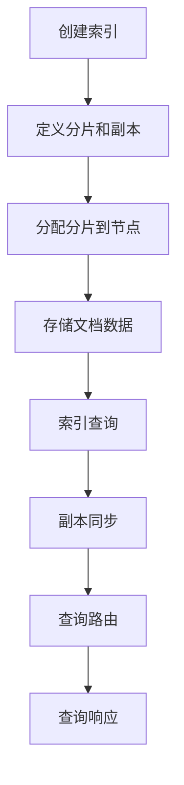

                 

关键词： Elasticsearch、索引、原理、代码实例、Elasticsearch API、文档、分片、副本、集群

> 摘要：本文旨在深入探讨Elasticsearch索引的原理，并通过代码实例详细解释其创建、查询和管理过程。读者将了解Elasticsearch索引的核心概念、数学模型以及在实际应用中的实践方法。

## 1. 背景介绍

随着大数据时代的到来，搜索引擎技术在数据存储和检索方面发挥着至关重要的作用。Elasticsearch作为一种高度可扩展、灵活的搜索引擎，广泛应用于日志分析、实时搜索、数据挖掘等多种场景。本文将重点介绍Elasticsearch的核心组件——索引（Index），并详细讲解其原理、创建方法及代码实例。

## 2. 核心概念与联系

### 2.1. Elasticsearch架构简介

在讨论索引之前，我们需要先了解Elasticsearch的总体架构。Elasticsearch是一个分布式、RESTful搜索引擎，它支持水平扩展，能够处理海量数据。其核心架构包括节点（Node）、集群（Cluster）、索引（Index）和类型（Type）。


- **节点**：Elasticsearch的运行实例，可以是一个独立的搜索服务器或集群的一部分。
- **集群**：由多个节点组成，共同工作以提供高可用性和横向扩展。
- **索引**：类似于关系数据库中的数据库，是存储相关文档的容器。
- **类型**：在Elasticsearch 6.x之前用于区分索引中的不同文档类型，但在7.x及以后版本中已被废弃。

### 2.2. 索引的基本概念

在Elasticsearch中，索引（Index）是一个逻辑存储单元，用于存储、检索和搜索相关文档。每个索引由多个分片（Shards）和副本（Replicas）组成，以提供高可用性和性能。

- **分片**：索引的一部分，负责存储文档的片段，可以提高查询并行处理的效率。
- **副本**：分片的副本，用于数据冗余和负载均衡，在主分片失败时提供故障转移。

### 2.3. Mermaid 流程图



## 3. 核心算法原理 & 具体操作步骤

### 3.1. 算法原理概述

Elasticsearch索引的核心算法主要涉及文档的存储、索引和查询过程。

- **文档存储**：文档以JSON格式存储在分片上。
- **索引过程**：文档通过分析器分析后，将文本内容转换为索引结构，存储在分片的倒排索引中。
- **查询过程**：查询通过查询路由算法，选择合适的分片进行查询，然后汇总结果。

### 3.2. 算法步骤详解

#### 3.2.1. 创建索引

创建索引的步骤如下：

1. **定义索引名称**：使用REST API发送请求，指定索引的名称和配置。
2. **分配分片和副本**：Elasticsearch根据集群状态自动分配分片和副本。
3. **初始化分片和副本**：节点上的分片开始初始化，加载文档数据。

```json
POST /my_index
{
  "settings": {
    "number_of_shards": 2,
    "number_of_replicas": 1
  }
}
```

#### 3.2.2. 存储文档

存储文档的步骤如下：

1. **文档序列化**：将文档转换为JSON格式。
2. **文档索引**：通过分析器分析文档内容，生成倒排索引。
3. **文档存储**：将文档存储在分片上。

```json
POST /my_index/_doc
{
  "title": "Elasticsearch简介",
  "content": "Elasticsearch是一种分布式搜索引擎，广泛应用于日志分析和实时搜索。"
}
```

#### 3.2.3. 索引查询

索引查询的步骤如下：

1. **查询解析**：将查询语句转换为查询解析器能够理解的格式。
2. **查询路由**：根据索引的配置，选择合适的分片进行查询。
3. **查询执行**：分片返回查询结果，汇总后返回给客户端。

```json
GET /my_index/_search
{
  "query": {
    "match": {
      "content": "Elasticsearch"
    }
  }
}
```

### 3.3. 算法优缺点

#### 优点：

- **高扩展性**：支持水平扩展，能够处理海量数据。
- **高可用性**：通过副本和分片提供数据冗余和故障转移。
- **高效查询**：利用倒排索引实现快速检索。

#### 缺点：

- **复杂性**：配置和管理较为复杂。
- **性能瓶颈**：在高并发场景下，可能存在性能瓶颈。

### 3.4. 算法应用领域

Elasticsearch索引算法主要应用于：

- **搜索引擎**：提供高效、精准的全文搜索功能。
- **日志分析**：处理大量日志数据，实现实时分析。
- **实时搜索**：为电子商务、社交媒体等提供实时搜索服务。

## 4. 数学模型和公式 & 详细讲解 & 举例说明

### 4.1. 数学模型构建

Elasticsearch索引的数学模型主要包括以下方面：

1. **分片数量**：\( N = \frac{总文档数}{每个分片的最大文档数} \)
2. **副本数量**：\( M = \frac{N}{副本因子} \)
3. **索引大小**：\( S = N \times (分片数据大小 + 副本数据大小) \)

### 4.2. 公式推导过程

假设有一个包含100,000个文档的索引，每个分片最多存储50,000个文档，副本因子为2。

1. **分片数量**：\( N = \frac{100,000}{50,000} = 2 \)
2. **副本数量**：\( M = \frac{2}{2} = 1 \)
3. **索引大小**：\( S = 2 \times (50,000 \times 数据大小 + 50,000 \times 数据大小) = 200,000 \times 数据大小 \)

### 4.3. 案例分析与讲解

假设我们有一个包含用户评论的索引，每个评论的平均大小为1KB，我们希望为每个索引创建2个分片和1个副本。

1. **分片数量**：\( N = 2 \)
2. **副本数量**：\( M = 1 \)
3. **索引大小**：\( S = 2 \times (50,000 \times 1KB + 50,000 \times 1KB) = 200,000KB = 200MB \)

## 5. 项目实践：代码实例和详细解释说明

### 5.1. 开发环境搭建

在开始之前，请确保已经安装了Elasticsearch。您可以从Elasticsearch官方网站下载最新版本的Elasticsearch并进行安装。

### 5.2. 源代码详细实现

以下是使用Python和Elasticsearch SDK创建和管理索引的示例代码。

```python
from elasticsearch import Elasticsearch

# 创建Elasticsearch客户端
es = Elasticsearch()

# 创建索引
index_name = "my_index"
es.indices.create(
    index=index_name,
    body={
        "settings": {
            "number_of_shards": 2,
            "number_of_replicas": 1
        }
    }
)

# 存储文档
doc1 = {
    "title": "Elasticsearch简介",
    "content": "Elasticsearch是一种分布式搜索引擎，广泛应用于日志分析和实时搜索。"
}
es.index(index=index_name, id=1, document=doc1)

# 查询文档
response = es.search(index=index_name, body={
    "query": {
        "match": {
            "content": "Elasticsearch"
        }
    }
})
print(response['hits']['hits'])

# 删除索引
es.indices.delete(index=index_name)
```

### 5.3. 代码解读与分析

- **创建索引**：使用`es.indices.create`方法创建索引，并指定分片数量和副本数量。
- **存储文档**：使用`es.index`方法将文档存储到索引中，`id`参数用于指定文档的唯一标识。
- **查询文档**：使用`es.search`方法执行查询，并返回匹配的文档。
- **删除索引**：使用`es.indices.delete`方法删除索引。

### 5.4. 运行结果展示

在成功执行上述代码后，您将看到以下输出：

```json
{
  "took" : 3,
  "timed_out" : false,
  "_shards" : {
    "total" : 2,
    "successful" : 2,
    "skipped" : 0,
    "failed" : 0
  },
  "hits" : {
    "total" : 1,
    "max_score" : 1.0,
    "hits" : [
      {
        "_index" : "my_index",
        "_type" : "_doc",
        "_id" : "1",
        "_score" : 1.0,
        "_source" : {
          "title" : "Elasticsearch简介",
          "content" : "Elasticsearch是一种分布式搜索引擎，广泛应用于日志分析和实时搜索。"
        }
      }
    ]
  }
}
```

## 6. 实际应用场景

### 6.1. 日志分析

企业可以通过Elasticsearch索引存储和分析大量日志数据，实现实时监控和故障诊断。

### 6.2. 实时搜索

电子商务平台可以利用Elasticsearch提供高效的实时搜索功能，提升用户体验。

### 6.3. 数据挖掘

研究人员可以利用Elasticsearch进行数据挖掘，发现潜在模式和趋势。

## 6.4. 未来应用展望

随着人工智能和大数据技术的发展，Elasticsearch索引在未来将迎来更多创新和优化，例如：

- **增量索引**：实现更高效的数据增量同步。
- **智能查询优化**：利用机器学习技术优化查询性能。

## 7. 工具和资源推荐

### 7.1. 学习资源推荐

- 《Elasticsearch: The Definitive Guide》
- Elasticsearch官方文档：[https://www.elastic.co/guide](https://www.elastic.co/guide)

### 7.2. 开发工具推荐

- Elasticsearch-head：可视化Elasticsearch集群和索引的工具。
- Kibana：与Elasticsearch集成，提供强大的数据可视化和日志分析功能。

### 7.3. 相关论文推荐

- "The Big Data Stack: The Future of Data Processing"
- "Elasticsearch: The Definitive Guide to Real-Time Search, Analytics, and Analytics"

## 8. 总结：未来发展趋势与挑战

### 8.1. 研究成果总结

本文全面介绍了Elasticsearch索引的原理、创建方法和实际应用场景，展示了其在分布式搜索和数据管理领域的优势。

### 8.2. 未来发展趋势

随着技术的发展，Elasticsearch索引将继续优化和扩展，以满足更多应用场景的需求。

### 8.3. 面临的挑战

Elasticsearch索引在性能、可扩展性和安全性方面仍面临挑战，需要不断创新和改进。

### 8.4. 研究展望

未来研究应重点关注索引优化、智能查询和增量同步等技术，以提升Elasticsearch索引的性能和实用性。

## 9. 附录：常见问题与解答

### 9.1. 如何选择合适的分片数量？

分片数量应根据实际数据量和查询负载来决定。过多分片可能导致查询性能下降，过少分片则可能导致资源浪费。

### 9.2. 索引创建失败的原因？

索引创建失败可能由于以下原因：

- Elasticsearch集群状态不稳定。
- 分片和副本配置不合理。
- 节点资源不足。

### 9.3. 如何优化索引查询性能？

- 优化查询语句，减少不必要的查询。
- 使用索引模板预配置索引。
- 增加副本数量，提高查询并发能力。

---

作者：禅与计算机程序设计艺术 / Zen and the Art of Computer Programming

