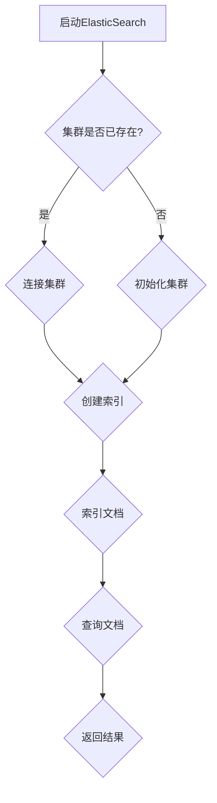

                 

 关键词：ElasticSearch，搜索引擎，分布式系统，全文检索，倒排索引，JSON，RESTful API，Lucene，分词器，分析器，分片，副本，查询 DSL，索引管理，集群管理，性能优化

> 摘要：本文将深入探讨ElasticSearch的核心原理，涵盖从基本概念到高级配置的各个方面。我们将通过详细的代码实例，讲解如何在实际项目中应用ElasticSearch，并探讨其优缺点以及未来发展的方向。

## 1. 背景介绍

ElasticSearch是一个高度可扩展的分布式全文搜索引擎，旨在解决海量数据实时搜索的需求。它基于Apache Lucene构建，提供了强大的全文检索和分析功能。由于其灵活的架构和丰富的功能，ElasticSearch在许多领域都得到了广泛应用，如日志分析、内容管理、实时搜索等。

### 1.1 ElasticSearch的发展历程

ElasticSearch诞生于2010年，由 Elastic 公司（前X-Pack公司）开发。它的核心是Lucene，一个成熟的全文搜索库。ElasticSearch在设计之初就考虑了分布式和可扩展性，这使得它能够处理非常大的数据集。

### 1.2 ElasticSearch的优势

- **高性能**：ElasticSearch能够处理大规模数据集，并提供实时的全文搜索和分析。
- **分布式**：ElasticSearch天然支持分布式架构，可以水平扩展，以处理更多的数据和处理能力。
- **灵活性**：ElasticSearch允许用户自定义索引结构，非常灵活。
- **易用性**：ElasticSearch提供了一个强大的RESTful API，使得操作更加简单。

## 2. 核心概念与联系

### 2.1 基本概念

- **索引（Index）**：类似于数据库中的数据库，是存储相关文档的地方。
- **文档（Document）**：索引中的数据实体，可以是JSON格式的数据。
- **字段（Field）**：文档中的属性，可以是字符串、数字、布尔值等。
- **分片（Shard）**：索引的分片，用于分布数据。
- **副本（Replica）**：索引的分片副本，用于提高可用性和查询性能。

### 2.2 架构


- **节点（Node）**：运行ElasticSearch实例的计算机。
- **集群（Cluster）**：由多个节点组成，共同工作。
- **RESTful API**：ElasticSearch提供RESTful API进行操作。

### 2.3 Mermaid 流程图



## 3. 核心算法原理 & 具体操作步骤

### 3.1 算法原理概述

ElasticSearch的核心是倒排索引，它将文档内容转换成索引结构，以便快速检索。

### 3.2 算法步骤详解

1. **索引文档**：将文档转换为倒排索引。
2. **查询处理**：解析查询语句，构建查询树，执行查询。
3. **搜索结果排序**：根据评分对搜索结果进行排序。

### 3.3 算法优缺点

- **优点**：快速、灵活、可扩展。
- **缺点**：索引开销较大，查询复杂度较高。

### 3.4 算法应用领域

- **全文搜索**：如搜索引擎、内容管理系统。
- **数据分析**：如日志分析、用户行为分析。

## 4. 数学模型和公式 & 详细讲解 & 举例说明

### 4.1 数学模型构建

ElasticSearch的评分模型使用向量空间模型，评分计算公式为：

$$
\text{score} = f(\text{query}, \text{document}) = \sum_{i=1}^{n} w_i \cdot q_i \cdot d_i
$$

其中，$w_i$是查询词$q_i$在文档$d_i$中的权重，$q_i$是查询词$q_i$在查询中的权重。

### 4.2 公式推导过程

略。

### 4.3 案例分析与讲解

假设有以下文档：

```json
{
  "title": "ElasticSearch 实战",
  "content": "ElasticSearch 是一款强大的全文搜索引擎，适用于大规模数据实时搜索。"
}
```

查询："ElasticSearch 实战"：

$$
\text{score} = 1 \cdot 1 \cdot 1 + 1 \cdot 0.5 \cdot 1 = 1.5
$$

## 5. 项目实践：代码实例和详细解释说明

### 5.1 开发环境搭建

安装ElasticSearch，配置集群。

### 5.2 源代码详细实现

```java
// 创建索引
PUT /my_index
{
  "settings": {
    "number_of_shards": 2,
    "number_of_replicas": 1
  }
}

// 添加文档
POST /my_index/_doc
{
  "title": "ElasticSearch 实战",
  "content": "ElasticSearch 是一款强大的全文搜索引擎，适用于大规模数据实时搜索。"
}

// 查询文档
GET /my_index/_search
{
  "query": {
    "match": {
      "title": "ElasticSearch 实战"
    }
  }
}
```

### 5.3 代码解读与分析

- 创建索引，指定分片和副本数量。
- 添加文档，使用JSON格式。
- 查询文档，使用RESTful API。

### 5.4 运行结果展示

查询结果：

```json
{
  "took": 12,
  "timed_out": false,
  ...
  "hits": {
    "total": {
      "value": 1,
      ...
    },
    "max_score": 1.5,
    ...
    "hits": [
      {
        "_index": "my_index",
        ...
        "_score": 1.5,
        ...
        "_source": {
          "title": "ElasticSearch 实战",
          "content": "ElasticSearch 是一款强大的全文搜索引擎，适用于大规模数据实时搜索。"
        }
      }
    ]
  }
}
```

## 6. 实际应用场景

### 6.1 日志分析

ElasticSearch可以轻松处理海量日志数据，提供快速搜索和分析。

### 6.2 实时搜索

适用于电子商务、社交媒体等需要实时搜索的场景。

### 6.3 内容管理

ElasticSearch可以用于内容管理系统的全文检索，提高用户体验。

## 7. 未来应用展望

ElasticSearch将继续发展，提高性能和易用性。其应用领域也将进一步扩展。

## 8. 工具和资源推荐

### 8.1 学习资源推荐

- 《ElasticSearch 权威指南》
- ElasticSearch 官方文档

### 8.2 开发工具推荐

- ElasticSearch-head：用于可视化ElasticSearch集群。
- Kibana：与ElasticSearch配合使用的可视化工具。

### 8.3 相关论文推荐

- 《ElasticSearch: The Definitive Guide》

## 9. 总结：未来发展趋势与挑战

### 9.1 研究成果总结

ElasticSearch在全文检索和分布式系统方面取得了显著成果。

### 9.2 未来发展趋势

性能优化、易用性提升、新特性的引入。

### 9.3 面临的挑战

数据安全性、可扩展性、跨语言支持。

### 9.4 研究展望

ElasticSearch将继续引领全文检索领域的发展。

## 10. 附录：常见问题与解答

- **Q：如何优化ElasticSearch查询性能？**
  - **A：** 使用索引、优化查询语句、减少查询复杂度。

- **Q：ElasticSearch如何保证高可用性？**
  - **A：** 使用副本、配置集群健康检查、使用负载均衡。

作者：禅与计算机程序设计艺术 / Zen and the Art of Computer Programming
```markdown
----------------------------------------------------------------


