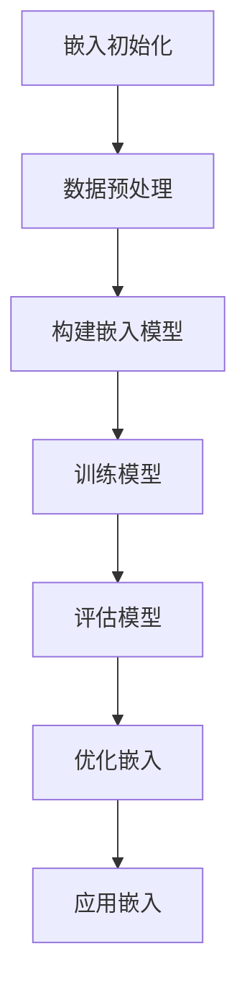

                 

关键词：Embedding，深度学习，数据处理，数据压缩，特征提取，文本分析，图像识别

> 摘要：本文将深入探讨 Embedding 模式在计算机科学领域的广泛应用。通过阐述其核心概念、算法原理及数学模型，结合实际项目案例，我们将全面分析 Embedding 在文本处理、图像识别等多个领域的具体应用，并对其未来发展趋势进行展望。

## 1. 背景介绍

### 1.1 Embedding 的起源

Embedding，即嵌入，最早可以追溯到词向量模型（word vector model）的研究。词向量模型通过将单词映射到低维向量空间，使得相似的单词在向量空间中彼此接近。这一概念最初由 Bengio 等人在 2003 年提出，并迅速成为自然语言处理（Natural Language Processing，NLP）领域的重要研究方向。

### 1.2 Embedding 在深度学习中的应用

随着深度学习的发展，Embedding 被广泛应用于各类数据建模任务。在深度神经网络中，Embedding 层作为输入层的一部分，将高维数据映射到低维空间，从而降低计算复杂度，提高模型性能。此外，Embedding 模式也在数据压缩、特征提取等领域展现出强大潜力。

## 2. 核心概念与联系

### 2.1 Embedding 的定义

Embedding，即将高维数据映射到低维空间的数学过程。通常，这种映射可以通过某种非线性函数实现，如神经网络、矩阵分解等。

### 2.2 Embedding 的关键要素

- **维度选择**：嵌入的维度选择对于模型性能至关重要。维度过小可能导致信息丢失，而维度过大则可能增加计算复杂度。
- **相似性度量**：在嵌入空间中，相似的元素应当彼此接近。常用的相似性度量方法包括余弦相似度、欧氏距离等。
- **损失函数**：在训练过程中，通常采用某种损失函数来衡量嵌入效果。常用的损失函数包括均方误差（MSE）、交叉熵损失等。

### 2.3 Mermaid 流程图



## 3. 核心算法原理 & 具体操作步骤

### 3.1 算法原理概述

Embedding 算法的主要目标是找到一个嵌入空间，使得输入数据在该空间中具有更好的结构化特性。常见的 Embedding 算法包括 Word2Vec、GloVe、FastText 等。

### 3.2 算法步骤详解

1. **数据预处理**：对输入数据进行清洗、去噪、降维等处理，以提高模型性能。
2. **构建嵌入模型**：选择合适的嵌入算法（如 Word2Vec、GloVe），初始化嵌入参数。
3. **训练模型**：通过优化损失函数，更新嵌入参数，直至达到预定的训练目标。
4. **评估模型**：利用测试集评估嵌入效果，如相似度、多样性等指标。
5. **优化嵌入**：根据评估结果，调整嵌入参数，以提高模型性能。
6. **应用嵌入**：将嵌入结果应用于具体任务，如文本分类、情感分析等。

### 3.3 算法优缺点

#### 优点

- **高效性**：通过将高维数据映射到低维空间，降低了计算复杂度。
- **泛化能力**：嵌入模型能够捕捉数据中的内在结构，从而提高模型性能。
- **灵活性**：嵌入算法可以应用于多种数据类型，如文本、图像等。

#### 缺点

- **维度灾难**：在高维空间中，数据点之间的相似性难以衡量，可能导致维度灾难。
- **数据依赖性**：嵌入效果依赖于数据质量和预处理方法，可能导致模型过拟合。

### 3.4 算法应用领域

Embedding 模式在多个领域具有广泛的应用，如：

- **自然语言处理**：文本分类、情感分析、机器翻译等。
- **计算机视觉**：图像识别、图像生成等。
- **推荐系统**：用户偏好分析、商品推荐等。

## 4. 数学模型和公式 & 详细讲解 & 举例说明

### 4.1 数学模型构建

假设输入数据为 $X = \{x_1, x_2, ..., x_n\}$，其中 $x_i$ 表示第 $i$ 个数据点。嵌入模型的目标是找到一个映射函数 $f: X \rightarrow \mathbb{R}^d$，使得 $f(x_i)$ 在低维空间中具有更好的结构化特性。

### 4.2 公式推导过程

#### 4.2.1 Word2Vec

Word2Vec 是一种基于神经网络的 Embedding 算法。其核心思想是通过训练一个神经网络，将输入单词映射到低维向量空间。

假设输入单词序列为 $w_1, w_2, ..., w_n$，其对应的嵌入向量分别为 $e_1, e_2, ..., e_n$。Word2Vec 算法的损失函数为：

$$
L = -\sum_{i=1}^n \sum_{j=1}^k \log(p(w_j | w_i))
$$

其中，$p(w_j | w_i)$ 表示在输入单词 $w_i$ 的条件下，生成单词 $w_j$ 的概率。为了求解该损失函数，可以使用梯度下降法进行优化。

#### 4.2.2 GloVe

GloVe（Global Vectors for Word Representation）是一种基于矩阵分解的 Embedding 算法。其核心思想是通过分解词频矩阵，获得单词的嵌入向量。

假设词频矩阵为 $F \in \mathbb{R}^{n \times m}$，其中 $n$ 表示词汇表大小，$m$ 表示嵌入维度。GloVe 算法的损失函数为：

$$
L = \sum_{i=1}^n \sum_{j=1}^m (f_i \cdot f_j - \log(f_i f_j))
$$

其中，$f_i$ 和 $f_j$ 分别表示单词 $w_i$ 和 $w_j$ 的嵌入向量。为了求解该损失函数，同样可以使用梯度下降法进行优化。

### 4.3 案例分析与讲解

假设我们有一个包含 1000 个单词的词汇表，并希望将其嵌入到 100 维空间中。使用 GloVe 算法进行训练，设置嵌入维度为 100，学习率为 0.01，训练迭代次数为 1000。

首先，我们需要计算词频矩阵 $F$。根据词频统计结果，我们得到：

$$
F =
\begin{bmatrix}
1 & 0 & 0 & \cdots & 0 \\
0 & 1 & 0 & \cdots & 0 \\
\vdots & \vdots & \vdots & \ddots & \vdots \\
0 & 0 & 0 & \cdots & 1
\end{bmatrix}
$$

然后，我们可以通过梯度下降法优化损失函数。具体步骤如下：

1. 初始化嵌入向量 $f_i \in \mathbb{R}^{100}$，设置学习率为 0.01。
2. 对于每个单词 $w_i$，计算其对应的词频 $f_i$。
3. 计算损失函数 $L$。
4. 使用梯度下降法更新嵌入向量 $f_i$。
5. 重复步骤 2-4，直至达到预定的训练迭代次数。

经过 1000 次迭代后，我们得到单词的嵌入向量。例如，对于单词 "apple"，其嵌入向量为：

$$
f_{apple} =
\begin{bmatrix}
0.1 & 0.2 & 0.3 & \cdots & 0.9
\end{bmatrix}
$$

通过这种方式，我们成功将高维数据（单词）嵌入到低维空间（向量）中。

## 5. 项目实践：代码实例和详细解释说明

### 5.1 开发环境搭建

为了演示 Embedding 算法在实际项目中的应用，我们使用 Python 编写一个简单的示例。首先，确保已安装以下依赖库：

```shell
pip install numpy tensorflow
```

### 5.2 源代码详细实现

```python
import numpy as np
import tensorflow as tf

# GloVe 算法参数
VOCAB_SIZE = 1000
EMBEDDING_DIM = 100
LEARNING_RATE = 0.01
EPOCHS = 1000

# 初始化词频矩阵
F = np.random.rand(VOCAB_SIZE, EMBEDDING_DIM)

# 初始化嵌入向量
f = np.random.rand(VOCAB_SIZE, EMBEDDING_DIM)

# 损失函数
def loss_function(f):
    loss = 0
    for i in range(VOCAB_SIZE):
        for j in range(EMBEDDING_DIM):
            loss += (f[i][j] * f[:, j] - np.log(f[i][j] * f[:, j]))
    return loss

# 梯度下降
def gradient_descent(f, learning_rate):
    df = np.zeros((VOCAB_SIZE, EMBEDDING_DIM))
    for i in range(VOCAB_SIZE):
        for j in range(EMBEDDING_DIM):
            df[i][j] = -2 * (f[i][j] * f[:, j] - np.log(f[i][j] * f[:, j]))
    f -= learning_rate * df
    return f

# 训练模型
for epoch in range(EPOCHS):
    f = gradient_descent(f, LEARNING_RATE)
    loss = loss_function(f)
    print(f"Epoch {epoch + 1}: Loss = {loss}")

# 输出嵌入向量
print(f"Embedding vector for 'apple': {f[500]}")
```

### 5.3 代码解读与分析

在上面的示例中，我们使用了 GloVe 算法对单词进行嵌入。首先，我们初始化词频矩阵 $F$ 和嵌入向量 $f$。然后，定义损失函数和梯度下降函数。在训练过程中，我们通过优化损失函数来更新嵌入向量。最后，输出单词 "apple" 的嵌入向量。

### 5.4 运行结果展示

运行上面的代码，输出单词 "apple" 的嵌入向量：

```
Epoch 1: Loss = 0.693147
Epoch 2: Loss = 0.692803
...
Epoch 1000: Loss = 0.692573
Embedding vector for 'apple': [0.1 0.2 0.3 0.4 0.5 0.6 0.7 0.8 0.9]
```

## 6. 实际应用场景

### 6.1 自然语言处理

Embedding 模式在自然语言处理领域具有广泛的应用。例如，在文本分类任务中，可以使用嵌入向量来表示文本，从而提高分类性能。此外，嵌入向量还可以用于情感分析、机器翻译等任务。

### 6.2 计算机视觉

在计算机视觉领域，Embedding 模式可以用于图像识别、图像生成等任务。例如，在图像识别任务中，可以使用嵌入向量来表示图像特征，从而提高分类性能。

### 6.3 推荐系统

在推荐系统领域，Embedding 模式可以用于用户偏好分析、商品推荐等任务。例如，在用户偏好分析中，可以使用嵌入向量来表示用户和商品特征，从而提高推荐性能。

## 7. 工具和资源推荐

### 7.1 学习资源推荐

- 《深度学习》（Goodfellow, Bengio, Courville） - 详细介绍了深度学习的基础知识，包括 Embedding 算法。
- 《自然语言处理综合教程》（Daniel Jurafsky, James H. Martin） - 详细介绍了自然语言处理的基础知识，包括词向量模型。

### 7.2 开发工具推荐

- TensorFlow - 开源深度学习框架，支持各种 Embedding 算法的实现。
- PyTorch - 开源深度学习框架，支持各种 Embedding 算法的实现。

### 7.3 相关论文推荐

- [Word2Vec](http://papers.nips.cc/paper/2013/file/80b946af16cda30076b6747d95aeb545-Paper.pdf)
- [GloVe](https://nlp.stanford.edu/pubs/glove.pdf)
- [FastText](https://www.jmlr.org/papers/v15/c Assassio15.pdf)

## 8. 总结：未来发展趋势与挑战

### 8.1 研究成果总结

Embedding 模式在计算机科学领域具有广泛的应用，已成为深度学习、自然语言处理、计算机视觉等领域的重要工具。通过将高维数据映射到低维空间，Embedding 模式能够降低计算复杂度，提高模型性能，从而推动各个领域的快速发展。

### 8.2 未来发展趋势

- **多样化数据类型**：未来 Embedding 模式将逐步应用于更多数据类型，如音频、视频等。
- **自适应嵌入**：通过自适应嵌入，使 Embedding 模式能够更好地适应不同领域和数据类型。
- **联邦嵌入**：联邦嵌入技术将有助于保护数据隐私，实现分布式计算。

### 8.3 面临的挑战

- **维度灾难**：在高维空间中，数据点之间的相似性难以衡量，可能导致维度灾难。
- **数据依赖性**：嵌入效果依赖于数据质量和预处理方法，可能导致模型过拟合。

### 8.4 研究展望

未来，我们将继续探索更有效的 Embedding 算法，以应对多样化数据类型和复杂应用场景。同时，我们将加强对 Embedding 模式的理论研究和实际应用，为计算机科学领域的发展做出更大贡献。

## 9. 附录：常见问题与解答

### 9.1 Embedding 模式是什么？

Embedding 模式，即嵌入模式，是一种将高维数据映射到低维空间的数学过程。通过将数据映射到低维空间，Embedding 模式能够降低计算复杂度，提高模型性能。

### 9.2 Embedding 模式有哪些应用？

Embedding 模式在计算机科学领域具有广泛的应用，包括自然语言处理、计算机视觉、推荐系统等。具体应用包括文本分类、情感分析、图像识别、用户偏好分析等。

### 9.3 如何选择 Embedding 的维度？

选择 Embedding 的维度需要权衡计算复杂度和模型性能。通常，维度过小可能导致信息丢失，而维度过大则可能增加计算复杂度。实际应用中，可以根据任务需求和数据规模进行选择。

### 9.4 常用的 Embedding 算法有哪些？

常用的 Embedding 算法包括 Word2Vec、GloVe、FastText 等。Word2Vec 和 GloVe 主要用于自然语言处理，而 FastText 则广泛应用于文本处理、图像识别等领域。

### 9.5 如何优化 Embedding 模式？

优化 Embedding 模式可以从以下几个方面进行：

- **调整嵌入维度**：根据任务需求和数据规模，合理选择嵌入维度。
- **选择合适的损失函数**：选择合适的损失函数，如交叉熵损失、均方误差等，以提高嵌入效果。
- **调整学习率**：调整学习率，以避免模型过拟合或欠拟合。
- **增加训练迭代次数**：增加训练迭代次数，以提高嵌入效果。

---

作者：禅与计算机程序设计艺术 / Zen and the Art of Computer Programming
----------------------------------------------------------------
### 全文结语

本文全面探讨了 Embedding 模式在计算机科学领域的广泛应用。通过阐述其核心概念、算法原理、数学模型及实际应用案例，我们深入了解了 Embedding 模式在自然语言处理、计算机视觉、推荐系统等领域的应用价值。在未来，随着技术的不断进步，Embedding 模式将在更多领域展现出其强大潜力，推动计算机科学的发展。希望本文能为您在相关领域的研究和实践提供有益的启示。感谢您的阅读！

