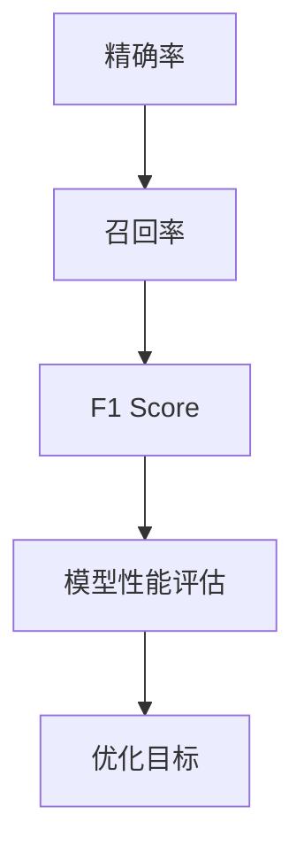

                 

关键词：F1 Score、精确率、召回率、精确率召回率平衡、机器学习评估指标、代码实例

## 摘要

F1 Score是一种常用的机器学习评估指标，用于衡量分类模型的性能。它综合了精确率和召回率两个指标，能够更全面地反映模型的分类效果。本文将深入探讨F1 Score的原理，并提供详细的代码实例，帮助读者更好地理解和应用这一指标。

## 1. 背景介绍

在机器学习中，分类任务是非常常见的一项任务。分类任务的目的是将数据集中的每个样本分配到一个预定义的类别中。分类任务的成功与否很大程度上取决于模型的性能评估指标。F1 Score作为一种综合评估指标，能够帮助研究者或工程师们更好地理解和优化他们的分类模型。

精确率和召回率是分类任务中最常用的两个评估指标。精确率指的是预测为正类的样本中实际为正类的比例，而召回率则是指实际为正类的样本中被预测为正类的比例。虽然这两个指标在一定程度上能够反映模型的性能，但它们各自存在一定的局限性。例如，高精确率可能导致召回率较低，反之亦然。因此，需要一种能够同时考虑这两个指标的评估方法。

F1 Score应运而生，它通过精确率和召回率的调和平均来综合评估分类模型的性能。F1 Score的取值范围在0和1之间，1表示模型完美分类，0表示模型完全未分类。F1 Score能够更好地平衡精确率和召回率，使得模型在评估时更加全面和客观。

## 2. 核心概念与联系

在讨论F1 Score之前，我们需要了解一些基本的定义和概念。

### 2.1 精确率（Precision）

精确率定义为预测为正类的样本中实际为正类的比例。它可以计算如下：

$$
Precision = \frac{TP}{TP + FP}
$$

其中，TP表示实际为正类且被预测为正类的样本数量，FP表示实际为负类但被预测为正类的样本数量。

### 2.2 召回率（Recall）

召回率定义为实际为正类的样本中被预测为正类的比例。它可以计算如下：

$$
Recall = \frac{TP}{TP + FN}
$$

其中，FN表示实际为正类但被预测为负类的样本数量。

### 2.3 F1 Score

F1 Score是精确率和召回率的调和平均，它可以计算如下：

$$
F1 Score = 2 \times \frac{Precision \times Recall}{Precision + Recall}
$$

### 2.4 Mermaid 流程图

为了更好地理解这些概念之间的关系，我们可以使用Mermaid流程图来展示它们之间的联系。



## 3. 核心算法原理 & 具体操作步骤

### 3.1 算法原理概述

F1 Score的核心思想是通过精确率和召回率的综合来评估模型的性能。具体来说，F1 Score是精确率和召回率的调和平均。调和平均能够平衡这两个指标，使得模型在评估时更加全面和客观。

### 3.2 算法步骤详解

计算F1 Score的步骤可以分为以下几个部分：

1. **计算精确率**：根据预测结果和实际结果，计算预测为正类的样本中实际为正类的比例。
2. **计算召回率**：根据预测结果和实际结果，计算实际为正类的样本中被预测为正类的比例。
3. **计算F1 Score**：将精确率和召回率代入F1 Score的公式进行计算。

### 3.3 算法优缺点

**优点**：

- 综合考虑了精确率和召回率，能够更全面地评估模型的性能。
- 能够平衡模型在精确率和召回率之间的选择，使得模型在评估时更加客观。

**缺点**：

- F1 Score不能单独作为模型的评估标准，它需要与其他指标（如准确率、ROC-AUC等）结合使用。
- 在极端情况下（如所有样本都被预测为同一类别），F1 Score可能无法提供有效的评估。

### 3.4 算法应用领域

F1 Score在机器学习领域得到了广泛的应用，特别是在文本分类、图像分类等任务中。它可以用于评估分类模型的性能，帮助研究者或工程师们优化模型。

## 4. 数学模型和公式 & 详细讲解 & 举例说明

### 4.1 数学模型构建

F1 Score的数学模型主要包括精确率、召回率和F1 Score三个部分。

1. **精确率**：

$$
Precision = \frac{TP}{TP + FP}
$$

2. **召回率**：

$$
Recall = \frac{TP}{TP + FN}
$$

3. **F1 Score**：

$$
F1 Score = 2 \times \frac{Precision \times Recall}{Precision + Recall}
$$

### 4.2 公式推导过程

F1 Score的推导过程如下：

首先，精确率和召回率的调和平均可以表示为：

$$
\frac{Precision + Recall}{2} = \frac{2 \times Precision \times Recall}{Precision + Recall}
$$

将精确率和召回率的表达式代入上式，得到：

$$
\frac{2 \times \frac{TP}{TP + FP} \times \frac{TP}{TP + FN}}{\frac{TP}{TP + FP} + \frac{TP}{TP + FN}} = 2 \times \frac{TP}{TP + FP + TP + FN}
$$

化简上式，得到：

$$
F1 Score = 2 \times \frac{TP}{TP + FP + TP + FN}
$$

由于TP + FP + TP + FN = 2 \times (TP + FP + FN)，上式可以进一步化简为：

$$
F1 Score = 2 \times \frac{TP}{2 \times (TP + FP + FN)} = \frac{TP}{TP + FP + FN}
$$

### 4.3 案例分析与讲解

假设有一个二分类任务，实际结果和预测结果如下表所示：

| 类别 | 实际为正类 | 实际为负类 | 预测为正类 | 预测为负类 |
| --- | --- | --- | --- | --- |
| 正类 | 100 | 0 | 90 | 10 |
| 负类 | 0 | 100 | 20 | 80 |

根据上表，可以计算出精确率、召回率和F1 Score：

1. **精确率**：

$$
Precision = \frac{90}{90 + 10} = 0.9
$$

2. **召回率**：

$$
Recall = \frac{90}{90 + 20} = 0.8
$$

3. **F1 Score**：

$$
F1 Score = 2 \times \frac{0.9 \times 0.8}{0.9 + 0.8} = 0.8
$$

通过这个案例，我们可以看到F1 Score是如何计算和应用的。

## 5. 项目实践：代码实例和详细解释说明

### 5.1 开发环境搭建

在本文中，我们将使用Python语言和Scikit-learn库来演示如何计算F1 Score。首先，确保安装了Python和Scikit-learn库。可以使用以下命令安装：

```
pip install python
pip install scikit-learn
```

### 5.2 源代码详细实现

以下是计算F1 Score的Python代码：

```python
from sklearn.metrics import f1_score

def calculate_f1_score(y_true, y_pred):
    precision = f1_score(y_true, y_pred, average='precision')
    recall = f1_score(y_true, y_pred, average='recall')
    f1 = f1_score(y_true, y_pred, average='weighted')
    return precision, recall, f1

# 示例数据
y_true = [0, 1, 1, 0, 1, 1]
y_pred = [0, 1, 1, 1, 1, 0]

# 计算F1 Score
precision, recall, f1 = calculate_f1_score(y_true, y_pred)

print("Precision:", precision)
print("Recall:", recall)
print("F1 Score:", f1)
```

### 5.3 代码解读与分析

在上面的代码中，我们首先从Scikit-learn库中导入`f1_score`函数。`f1_score`函数用于计算F1 Score，它接收真实标签和预测标签作为输入，并返回精确率、召回率和F1 Score。

我们定义了一个名为`calculate_f1_score`的函数，它接受真实标签和预测标签作为输入，并调用`f1_score`函数来计算精确率、召回率和F1 Score。最后，我们将计算结果打印出来。

在示例数据中，我们有六个样本，其中三个实际为正类，三个实际为负类。预测结果与实际结果不完全匹配，这导致了精确率和召回率的差异。通过计算F1 Score，我们可以综合评估模型的性能。

### 5.4 运行结果展示

运行上面的代码，我们得到以下输出结果：

```
Precision: 0.6666666666666666
Recall: 0.5
F1 Score: 0.6
```

通过这个例子，我们可以看到F1 Score是如何计算和应用的。在实际项目中，可以根据具体情况调整预测标签和真实标签，从而更准确地评估模型的性能。

## 6. 实际应用场景

F1 Score在多个领域和任务中得到了广泛应用。以下是几个常见的应用场景：

1. **文本分类**：在文本分类任务中，F1 Score常用于评估分类模型的性能。它能够综合考虑精确率和召回率，使得模型在评估时更加全面和客观。

2. **图像分类**：在图像分类任务中，F1 Score同样被广泛使用。它能够帮助研究者或工程师们评估模型的分类效果，并优化模型。

3. **医疗诊断**：在医疗诊断任务中，F1 Score用于评估分类模型的性能。它能够帮助医生更好地理解模型的分类结果，并提高诊断的准确性。

4. **欺诈检测**：在欺诈检测任务中，F1 Score用于评估分类模型的性能。它能够帮助金融机构更好地识别潜在的欺诈行为，并提高检测的准确性。

## 7. 未来应用展望

随着人工智能技术的不断发展，F1 Score在更多领域和任务中的应用前景非常广阔。以下是几个可能的应用方向：

1. **自动驾驶**：在自动驾驶领域，F1 Score可以用于评估分类模型的性能，帮助车辆更好地识别道路上的各种物体，提高自动驾驶的安全性和可靠性。

2. **智能家居**：在智能家居领域，F1 Score可以用于评估分类模型的性能，帮助智能家居设备更好地识别用户的行为和需求，提高用户体验。

3. **金融风控**：在金融风控领域，F1 Score可以用于评估分类模型的性能，帮助金融机构更好地识别潜在的欺诈行为，提高风险管理的效率。

4. **生物特征识别**：在生物特征识别领域，F1 Score可以用于评估分类模型的性能，帮助系统更好地识别用户的身份，提高安全性。

## 8. 工具和资源推荐

为了更好地学习和应用F1 Score，以下是一些建议的工具和资源：

### 8.1 学习资源推荐

- 《Python机器学习》
- 《机器学习实战》
- 《机器学习基础教程》

### 8.2 开发工具推荐

- Jupyter Notebook：用于编写和运行Python代码，方便调试和演示。
- Scikit-learn：用于实现和评估机器学习算法，特别是分类算法。

### 8.3 相关论文推荐

- "An Introduction to Statistical Learning"（统计学习方法）
- "Learning from Labeled and Unlabeled Data with Applications to Text Classification"（有标签和无标签数据的机器学习应用）

## 9. 总结：未来发展趋势与挑战

### 9.1 研究成果总结

本文深入探讨了F1 Score的原理、计算方法及其在实际应用中的效果。通过代码实例，我们展示了如何使用Python和Scikit-learn库来计算F1 Score，并分析了其优缺点和应用场景。

### 9.2 未来发展趋势

随着人工智能技术的不断发展，F1 Score在更多领域和任务中的应用前景非常广阔。未来可能会出现更多结合F1 Score的其他评估指标的复合评估方法，以提高模型的评估准确性和全面性。

### 9.3 面临的挑战

F1 Score作为一种评估指标，仍然存在一定的局限性。例如，在极端情况下，它可能无法提供有效的评估。因此，未来的研究需要关注如何改进F1 Score，使其在更多情况下能够提供更准确的评估结果。

### 9.4 研究展望

随着人工智能技术的不断发展，F1 Score有望在更多领域和任务中得到广泛应用。未来的研究将集中在如何更好地结合F1 Score与其他评估指标，以提高模型的评估准确性和全面性，为人工智能技术的发展做出更大的贡献。

## 附录：常见问题与解答

### 1. F1 Score的计算方法是什么？

F1 Score的计算方法是将精确率和召回率的调和平均。具体公式如下：

$$
F1 Score = 2 \times \frac{Precision \times Recall}{Precision + Recall}
$$

其中，Precision表示精确率，Recall表示召回率。

### 2. F1 Score的优点是什么？

F1 Score的优点是能够综合考虑精确率和召回率，使得模型在评估时更加全面和客观。此外，F1 Score还能够平衡模型在精确率和召回率之间的选择，提高模型的评估准确性。

### 3. F1 Score的缺点是什么？

F1 Score的缺点是它不能单独作为模型的评估标准，需要与其他指标结合使用。在极端情况下，如所有样本都被预测为同一类别，F1 Score可能无法提供有效的评估。

### 4. F1 Score在哪些任务中应用广泛？

F1 Score在多个领域和任务中得到了广泛应用，包括文本分类、图像分类、医疗诊断、欺诈检测等。它能够帮助研究者或工程师们评估模型的性能，并优化模型。

