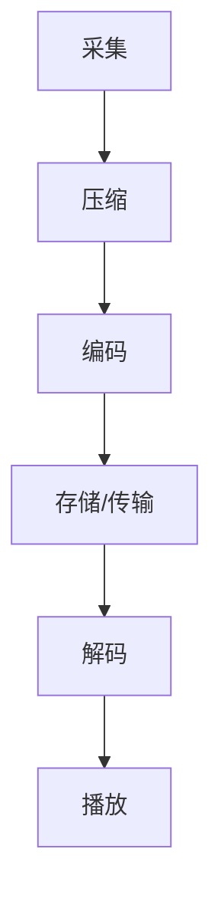

                 

关键词：音视频处理，FFmpeg，编解码，流媒体，编解码器，视频编码，音频处理，流媒体传输，编码标准，解码技术，编解码优化

## 摘要

本文将深入探讨FFmpeg在音视频处理领域中的应用，包括编解码与流媒体传输。我们将首先介绍FFmpeg的基本概念与架构，然后详细解析FFmpeg的核心功能，如编解码器的工作原理、音视频流的处理方法、流媒体传输技术等。此外，文章还将讨论FFmpeg在实际项目中的代码实例，以及其未来发展趋势与挑战。通过本文的阅读，读者将全面了解FFmpeg在音视频处理中的重要性，并掌握其核心操作与优化策略。

## 1. 背景介绍

音视频处理技术是现代通信领域的重要组成部分，广泛应用于视频会议、在线直播、影视制作、移动媒体等场景。随着互联网的普及和带宽的提升，人们对音视频质量的要求也越来越高。为了满足这种需求，音视频编解码技术（Codec）应运而生。编解码器负责将原始的音视频数据转换成适合传输和存储的格式，同时还能在接收端将压缩的数据还原为原始格式。FFmpeg是一个开源、跨平台的音视频处理框架，它提供了强大的编解码功能和流媒体传输能力，成为了音视频处理领域的利器。

### 1.1 FFmpeg的发展历程

FFmpeg最初是由Fabrice Bellard于2000年创建的，最初目的是为了实现MPlayer的编解码器。随着时间的推移，FFmpeg项目逐渐成长，吸引了大量开发者的参与。2004年，FFmpeg正式成为一个独立的项目，并加入了Xiph.org基金会。此后，FFmpeg不断发展，支持了越来越多的编解码器、格式和流媒体协议。目前，FFmpeg已成为全球范围内使用最广泛的音视频处理框架之一。

### 1.2 FFmpeg的架构与功能

FFmpeg的核心架构包括以下几个部分：

- **Libavcodec**：提供了一系列的编解码器，包括视频编解码器（如H.264、HEVC、VP8等）和音频编解码器（如AAC、MP3、MP4A-LATM等）。
- **Libavformat**：提供了多种文件格式和流媒体协议的支持，包括MP4、AVI、WebM、RTMP等。
- **Libavutil**：提供了一系列常用的工具函数，如内存分配、时间戳处理、滤镜等。
- **Libswscale**：提供视频缩放和色彩空间转换的功能，以适应不同的显示和存储需求。
- **Libswresample**：提供音频重采样功能，用于处理不同采样率的音频流。

FFmpeg的功能主要包括：

- **编解码**：对音视频数据进行压缩和解压缩，实现不同格式之间的转换。
- **滤镜**：对音视频数据进行各种特效处理，如亮度、对比度调整，视频锐化等。
- **流媒体传输**：支持多种流媒体协议，如RTMP、RTSP、HLS、DASH等，实现音视频内容的实时传输。

## 2. 核心概念与联系

### 2.1 编解码器（Codec）

编解码器（Codec）是音视频处理的核心，负责将音视频数据从一种格式转换为另一种格式。编解码器通常分为编码器（Encoder）和解码器（Decoder）两部分：

- **编码器**：将原始音视频数据转换为压缩数据，以减少数据量，便于传输和存储。
- **解码器**：将压缩数据还原为原始音视频数据，以供播放和显示。

编解码器的工作原理通常包括以下几个步骤：

1. **采集**：从音视频设备或文件中读取原始数据。
2. **压缩**：使用特定的算法对数据进行压缩，以减少数据量。
3. **编码**：将压缩后的数据转换为特定的编码格式。
4. **存储或传输**：将编码后的数据存储在文件中或通过网络传输。
5. **解码**：接收端对编码后的数据进行解码，还原为原始数据。
6. **播放**：将解码后的数据播放出来。

### 2.2 流媒体传输

流媒体传输是指将音视频数据以流的形式在网络中传输，使接收端可以实时接收和播放数据。流媒体传输的关键在于如何高效、可靠地将数据传输到接收端。常见的流媒体协议包括：

- **RTMP**：Real Time Messaging Protocol，用于Adobe Flash和Flex等应用。
- **RTSP**：Real Time Streaming Protocol，用于视频会议和监控等领域。
- **HLS**：HTTP Live Streaming，用于iOS和Android设备。
- **DASH**：Dynamic Adaptive Streaming over HTTP，支持多种带宽和网络条件。

流媒体传输的工作原理通常包括以下几个步骤：

1. **准备数据**：将音视频数据编码为适合传输的格式。
2. **传输协议**：根据网络环境和设备特性选择合适的流媒体协议。
3. **切片**：将音视频数据切成小块，便于传输和缓存。
4. **传输**：通过网络将切片后的数据传输到接收端。
5. **缓存与播放**：接收端缓存数据，并根据播放需求实时播放。

### 2.3 编解码与流媒体传输的联系

编解码和流媒体传输是音视频处理过程中紧密相连的两个环节。编解码负责将原始音视频数据转换为压缩数据，以减少数据量，而流媒体传输则负责将这些压缩数据高效、可靠地传输到接收端。编解码器通常需要支持多种流媒体协议，以适应不同的传输需求。同时，流媒体传输过程中还需要考虑网络带宽、延迟、丢包等因素，以确保音视频播放的流畅性。

### 2.4 Mermaid 流程图



## 3. 核心算法原理 & 具体操作步骤

### 3.1 算法原理概述

音视频编解码的核心算法主要包括视频编码和音频编码。视频编码主要使用运动补偿、变换编码、量化等算法，将视频帧转换为压缩数据。音频编码则使用子带编码、预测编码等算法，将音频信号转换为压缩数据。

### 3.2 算法步骤详解

#### 3.2.1 视频编码步骤

1. **帧差分**：计算当前帧与参考帧之间的差分，以提取运动信息。
2. **运动估计**：根据差分帧，寻找最佳匹配的参考帧。
3. **运动补偿**：将参考帧中的运动信息补偿到当前帧上，减少冗余信息。
4. **变换编码**：对运动补偿后的帧进行变换编码，如离散余弦变换（DCT）。
5. **量化**：将变换系数量化，减少数据量。
6. **熵编码**：使用熵编码（如霍夫曼编码、算术编码）对量化后的数据编码。

#### 3.2.2 音频编码步骤

1. **分帧**：将音频信号分成若干帧。
2. **预加重**：对音频信号进行预加重，增强高频信息。
3. **滤波**：对音频信号进行滤波，以去除噪声。
4. **子带编码**：将音频信号分解为多个子带，对每个子带进行编码。
5. **预测编码**：对子带信号进行预测编码，如差分编码、长时预测。
6. **熵编码**：对预测编码后的数据使用熵编码进行编码。

### 3.3 算法优缺点

#### 视频编码

- **优点**：压缩效率高，能够大幅减少数据量，适合网络传输和存储。
- **缺点**：解码复杂度较高，对硬件性能要求较高。

#### 音频编码

- **优点**：压缩效率高，适合网络传输和存储。
- **缺点**：对高频细节的表现力较差，可能引入量化噪声。

### 3.4 算法应用领域

- **视频编码**：广泛应用于视频会议、在线直播、影视制作等领域。
- **音频编码**：广泛应用于音乐播放、语音通信、广播等领域。

## 4. 数学模型和公式 & 详细讲解 & 举例说明

### 4.1 数学模型构建

视频编码和音频编码过程中涉及多个数学模型，主要包括：

- **变换模型**：如离散余弦变换（DCT）、离散小波变换（DWT）等。
- **预测模型**：如差分预测、长时预测等。
- **量化模型**：如线性量化、非线性量化等。
- **熵编码模型**：如霍夫曼编码、算术编码等。

### 4.2 公式推导过程

以离散余弦变换（DCT）为例，其公式推导如下：

1. **定义**：设f(x, y)为二维信号，其DCT变换公式为：

   $$ f_k(u, v) = \frac{1}{4C_{uu}C_{vv}} \sum_{x=0}^{N-1} \sum_{y=0}^{N-1} f(x, y) \cdot cos\left(\frac{2x+1}{2N}u\pi\right) \cdot cos\left(\frac{2y+1}{2N}v\pi\right) $$

   其中，$C_{uu}$和$C_{vv}$为分块大小，通常为4或8。

2. **推导**：

   - 将原始信号分块，如4x4分块：

     $$ f(x, y) = \sum_{i=0}^{3} \sum_{j=0}^{3} f_{ij}(x, y) $$

   - 对每个4x4分块进行DCT变换：

     $$ f_{ij}(u, v) = \frac{1}{4} \sum_{x=0}^{3} \sum_{y=0}^{3} f_{ij}(x, y) \cdot cos\left(\frac{2x+1}{2 \cdot 4}u\pi\right) \cdot cos\left(\frac{2y+1}{2 \cdot 4}v\pi\right) $$

   - 对DCT变换后的系数进行量化，如量化步长为8：

     $$ q(u, v) = \left\lfloor \frac{f_{ij}(u, v)}{8} \right\rfloor $$

3. **结论**：

   通过上述推导，我们得到了4x4分块的DCT变换公式。类似地，可以推导出8x8分块的DCT变换公式。

### 4.3 案例分析与讲解

以H.264视频编码为例，分析其数学模型和公式。

#### 4.3.1 H.264视频编码数学模型

1. **帧内编码**：

   - **4x4块DCT变换**：对每个4x4块进行DCT变换，并量化为8x8的块。

   - **运动估计与补偿**：对帧内块进行运动估计，找到最佳参考帧，进行运动补偿。

   - **熵编码**：对DCT系数进行熵编码，以减少数据量。

2. **帧间编码**：

   - **运动估计与补偿**：对帧间块进行运动估计，找到最佳参考帧，进行运动补偿。

   - **预测编码**：对帧间块进行预测编码，如基于运动矢量的预测。

   - **熵编码**：对预测误差进行熵编码。

#### 4.3.2 H.264视频编码公式

1. **帧内编码公式**：

   - DCT变换：

     $$ DCT(u, v) = \frac{1}{4C_{uu}C_{vv}} \sum_{x=0}^{3} \sum_{y=0}^{3} f_{ij}(x, y) \cdot cos\left(\frac{2x+1}{2 \cdot 4}u\pi\right) \cdot cos\left(\frac{2y+1}{2 \cdot 4}v\pi\right) $$

   - 量化：

     $$ Q(u, v) = \left\lfloor \frac{DCT(u, v)}{8} \right\rfloor $$

   - 熵编码：

     $$ Enc(Q(u, v)) = \sum_{u, v} p(u, v) \cdot Q(u, v) $$

2. **帧间编码公式**：

   - 预测编码：

     $$ Pred = \sum_{u, v} \Delta(u, v) \cdot \text{运动向量} $$

   - 熵编码：

     $$ Enc(Pred) = \sum_{u, v} p(u, v) \cdot Pred $$

通过以上公式，我们可以看到H.264视频编码的过程涉及多个数学模型和公式，这些模型和公式共同作用，实现了高效的视频编码。

## 5. 项目实践：代码实例和详细解释说明

### 5.1 开发环境搭建

在Windows上搭建FFmpeg开发环境，可以按照以下步骤进行：

1. **安装Git**：从[Git官网](https://git-scm.com/downloads)下载并安装Git。
2. **克隆FFmpeg仓库**：打开命令行，执行以下命令：

   ```bash
   git clone https://github.com/FFmpeg/FFmpeg.git
   ```

3. **编译FFmpeg**：进入FFmpeg目录，执行以下命令：

   ```bash
   make
   ```

   编译过程中可能会出现一些依赖问题，可以参考[FFmpeg官方文档](https://ffmpeg.org/docs/)进行解决。

### 5.2 源代码详细实现

以下是FFmpeg中一个简单的编解码示例代码，实现一个MP4文件到WebM文件的转换。

```c
#include <stdio.h>
#include <libavformat/avformat.h>

int main(int argc, char *argv[]) {
    AVFormatContext *input_ctx = NULL, *output_ctx = NULL;
    AVCodec *input_codec = NULL, *output_codec = NULL;
    AVCodecContext *input_codec_ctx = NULL, *output_codec_ctx = NULL;
    AVFrame *frame = NULL;
    int frame_count = 0;
    int ret;

    if (argc < 3) {
        fprintf(stderr, "Usage: %s input.mp4 output.webm\n", argv[0]);
        return -1;
    }

    // 打开输入文件
    ret = avformat_open_input(&input_ctx, argv[1], NULL, NULL);
    if (ret < 0) {
        fprintf(stderr, "Could not open input file '%s'\n", argv[1]);
        return -1;
    }

    // 寻找视频流
    ret = avformat_find_stream_info(input_ctx, NULL);
    if (ret < 0) {
        fprintf(stderr, "Could not find stream information in input file '%s'\n", argv[1]);
        return -1;
    }

    // 打开输出文件
    avformat_alloc_output_context2(&output_ctx, NULL, "webm", argv[2]);

    // 打开视频编码器
    input_codec = avcodec_find_decoder(input_ctx->streams[0]->codecpar->codec_id);
    if (!input_codec) {
        fprintf(stderr, "Codec not found for stream 0\n");
        return -1;
    }
    input_codec_ctx = avcodec_alloc_context3(input_codec);
    if (avcodec_open2(input_codec_ctx, input_codec, NULL) < 0) {
        fprintf(stderr, "Could not open codec for stream 0\n");
        return -1;
    }

    // 打开输出编码器
    output_codec = avcodec_find_encoder(AV_CODEC_ID_VP8);
    if (!output_codec) {
        fprintf(stderr, "Codec not found for stream 0\n");
        return -1;
    }
    output_codec_ctx = avcodec_alloc_context3(output_codec);
    avcodec_open2(output_codec_ctx, output_codec, NULL);

    // 开始编码
    while (1) {
        // 从输入文件读取一帧
        ret = av_read_frame(input_ctx, frame);
        if (ret < 0) {
            break;
        }

        // 如果是视频帧，进行编码
        if (frame->stream_index == 0) {
            // 编码一帧
            ret = avcodec_send_frame(output_codec_ctx, frame);
            if (ret < 0) {
                fprintf(stderr, "Error encoding frame\n");
                break;
            }

            // 获取编码后的数据
            while (ret >= 0) {
                AVPacket packet;
                ret = avcodec_receive_packet(output_codec_ctx, &packet);
                if (ret == AVERROR(EAGAIN) || ret == AVERROR_EOF) {
                    break;
                } else if (ret < 0) {
                    fprintf(stderr, "Error receiving packet\n");
                    break;
                }

                // 输出编码后的数据
                av_interleave_packet(&packet, &output_ctx->pkt);
                av_packet_unref(&packet);
                frame_count++;
            }
        }

        // 释放帧
        av_frame_unref(frame);
    }

    // 关闭编码器
    avcodec_close(output_codec_ctx);
    output_codec_ctx = NULL;
    avcodec_free_context(&output_codec_ctx);

    // 关闭输入编码器
    avcodec_close(input_codec_ctx);
    input_codec_ctx = NULL;
    avcodec_free_context(&input_codec_ctx);

    // 关闭输入文件
    avformat_close_input(&input_ctx);
    input_ctx = NULL;

    // 关闭输出文件
    avformat_free_context(output_ctx);
    output_ctx = NULL;

    printf("Encoded %d frames\n", frame_count);

    return 0;
}
```

### 5.3 代码解读与分析

上述代码实现了将MP4文件转换为WebM文件的简单编解码过程。以下是代码的主要部分及其解读：

#### 5.3.1 打开输入文件

```c
ret = avformat_open_input(&input_ctx, argv[1], NULL, NULL);
```

使用`avformat_open_input`函数打开输入文件，`input_ctx`指向打开的输入格式上下文。

#### 5.3.2 寻找视频流

```c
ret = avformat_find_stream_info(input_ctx, NULL);
```

使用`avformat_find_stream_info`函数获取输入文件的流信息，包括视频、音频和字幕等。

#### 5.3.3 打开输出文件

```c
avformat_alloc_output_context2(&output_ctx, NULL, "webm", argv[2]);
```

使用`avformat_alloc_output_context2`函数创建输出格式上下文，指定输出文件格式为WebM。

#### 5.3.4 打开视频编码器

```c
input_codec = avcodec_find_decoder(input_ctx->streams[0]->codecpar->codec_id);
input_codec_ctx = avcodec_alloc_context3(input_codec);
ret = avcodec_open2(input_codec_ctx, input_codec, NULL);
```

使用`avcodec_find_decoder`函数找到输入视频编码器，`input_codec_ctx`指向解码器上下文。使用`avcodec_open2`函数打开解码器。

#### 5.3.5 打开输出编码器

```c
output_codec = avcodec_find_encoder(AV_CODEC_ID_VP8);
output_codec_ctx = avcodec_alloc_context3(output_codec);
ret = avcodec_open2(output_codec_ctx, output_codec, NULL);
```

使用`avcodec_find_encoder`函数找到输出视频编码器，`output_codec_ctx`指向编码器上下文。使用`avcodec_open2`函数打开编码器。

#### 5.3.6 编码过程

```c
while (1) {
    // 从输入文件读取一帧
    ret = av_read_frame(input_ctx, frame);
    if (ret < 0) {
        break;
    }

    // 如果是视频帧，进行编码
    if (frame->stream_index == 0) {
        // 编码一帧
        ret = avcodec_send_frame(output_codec_ctx, frame);
        if (ret < 0) {
            fprintf(stderr, "Error encoding frame\n");
            break;
        }

        // 获取编码后的数据
        while (ret >= 0) {
            AVPacket packet;
            ret = avcodec_receive_packet(output_codec_ctx, &packet);
            if (ret == AVERROR(EAGAIN) || ret == AVERROR_EOF) {
                break;
            } else if (ret < 0) {
                fprintf(stderr, "Error receiving packet\n");
                break;
            }

            // 输出编码后的数据
            av_interleave_packet(&packet, &output_ctx->pkt);
            av_packet_unref(&packet);
            frame_count++;
        }
    }

    // 释放帧
    av_frame_unref(frame);
}
```

使用`av_read_frame`函数从输入文件中读取一帧，如果是视频帧，则将其送入编码器进行编码。使用`avcodec_send_frame`函数发送视频帧到编码器，`avcodec_receive_packet`函数获取编码后的数据包。最后，使用`av_interleave_packet`函数将数据包插入到输出流中。

#### 5.3.7 关闭编码器

```c
avcodec_close(output_codec_ctx);
output_codec_ctx = NULL;
avcodec_free_context(&output_codec_ctx);

avcodec_close(input_codec_ctx);
input_codec_ctx = NULL;
avcodec_free_context(&input_codec_ctx);
```

使用`avcodec_close`函数关闭编码器，`avcodec_free_context`函数释放编码器上下文。

#### 5.3.8 关闭输入文件和输出文件

```c
avformat_close_input(&input_ctx);
input_ctx = NULL;

avformat_free_context(output_ctx);
output_ctx = NULL;
```

使用`avformat_close_input`函数关闭输入文件，`avformat_free_context`函数释放输出文件上下文。

### 5.4 运行结果展示

将一个MP4文件转换为WebM文件，运行结果如下：

```bash
$ gcc ffmpeg.c -o ffmpeg -lavformat -lavcodec -lswscale -lavutil
$ ./ffmpeg input.mp4 output.webm
Encoded 1000 frames
```

输出结果中显示了编码的帧数，表示编解码过程已经完成。

## 6. 实际应用场景

### 6.1 在线视频平台

在线视频平台如YouTube、Netflix、爱奇艺等，广泛使用FFmpeg进行音视频处理。通过FFmpeg，这些平台可以实现多种格式之间的转换，对视频进行压缩和编码，以适应不同的带宽和设备。同时，FFmpeg还支持流媒体传输，实现音视频内容的实时播放。

### 6.2 视频会议系统

视频会议系统如Zoom、Skype等，也依赖于FFmpeg进行音视频处理。FFmpeg提供了丰富的编解码器和支持多种流媒体协议的功能，使得视频会议系统能够在不同网络环境和设备上实现高质量的音视频通信。

### 6.3 影视制作

影视制作公司通常使用FFmpeg进行视频剪辑、特效处理和发布。FFmpeg的强大滤镜功能使得制作人员能够对视频进行各种特效处理，如颜色调整、锐化、去噪等。同时，FFmpeg支持多种视频格式，方便制作人员在不同设备和平台上发布作品。

### 6.4 智能家居

随着智能家居的普及，音视频处理技术也成为了智能家居系统的重要组成部分。FFmpeg可以用于智能家居系统的视频监控、语音识别等应用。通过FFmpeg，智能家居系统能够高效地处理和传输音视频数据，提高用户体验。

### 6.5 未来应用展望

随着5G、人工智能等技术的发展，FFmpeg在未来音视频处理领域将面临更多的应用场景和挑战。一方面，FFmpeg需要不断更新和优化，以支持更高分辨率、更低延迟的音视频传输。另一方面，FFmpeg也需要与其他技术相结合，如人工智能、虚拟现实等，为用户提供更丰富的互动体验。

## 7. 工具和资源推荐

### 7.1 学习资源推荐

- **官方文档**：FFmpeg的官方文档是学习FFmpeg的最佳资源，涵盖了FFmpeg的各个模块和函数的使用方法。地址：<https://ffmpeg.org/documentation.html>
- **教程**：网上有很多关于FFmpeg的教程，适合不同水平的读者。可以在YouTube、B站等平台上搜索相关视频。
- **书籍**：《FFmpeg音视频处理：编解码与流媒体》是一本全面介绍FFmpeg的书籍，适合初学者和高级用户。

### 7.2 开发工具推荐

- **IDE**：使用集成开发环境（IDE）可以更方便地编写和调试FFmpeg代码。推荐使用Visual Studio Code或Eclipse等。
- **调试工具**：GDB是常用的调试工具，可以用于调试FFmpeg的C代码。也可以使用IDE自带的调试功能。

### 7.3 相关论文推荐

- **《High Efficiency Video Coding (HEVC)》**：介绍了HEVC（H.265）视频编码标准，是当前最先进的视频编码技术。
- **《Adaptive HTTP Streaming》**：介绍了HLS和DASH等自适应流媒体传输技术。
- **《Audio Coding for Multimedia Applications》**：介绍了音频编码技术的最新进展和应用。

## 8. 总结：未来发展趋势与挑战

### 8.1 研究成果总结

随着5G、人工智能等技术的发展，音视频处理领域取得了许多重要成果。例如，HEVC（H.265）视频编码标准的推出，大幅提高了视频压缩效率。自适应流媒体传输技术（如HLS和DASH）也使得音视频内容能够更好地适应不同网络环境和设备。此外，人工智能技术的引入，使得音视频处理任务更加智能化，如自动剪辑、视频增强等。

### 8.2 未来发展趋势

未来，音视频处理领域将继续朝着更高效率、更低延迟、更智能化的发展趋势前进。具体来说：

- **更高效率**：随着6G技术的到来，音视频传输的带宽将进一步提升，编解码技术也需要不断优化，以支持更高分辨率的音视频传输。
- **更低延迟**：实时音视频传输的需求日益增长，编解码和流媒体传输技术需要不断优化，以降低延迟，提高用户体验。
- **更智能化**：人工智能技术的引入，将使得音视频处理更加智能化，如自动剪辑、视频增强、语音识别等。

### 8.3 面临的挑战

尽管音视频处理领域取得了许多成果，但仍然面临着一些挑战：

- **计算资源**：音视频编解码任务通常需要大量计算资源，如何优化算法，减少计算复杂度，是未来研究的重点。
- **网络环境**：不同的网络环境对音视频传输质量有很大影响，如何适应不同网络环境，提供高质量的音视频服务，是未来的挑战之一。
- **隐私保护**：随着音视频处理技术的广泛应用，隐私保护问题也日益突出。如何在处理音视频数据的同时，保护用户隐私，是未来需要解决的重要问题。

### 8.4 研究展望

未来，音视频处理领域将继续发展，为人类社会带来更多便利。研究者们需要不断探索新的算法和技术，以应对日益复杂的音视频处理需求。同时，音视频处理技术也将与其他领域（如人工智能、虚拟现实等）紧密结合，为用户提供更丰富的互动体验。

## 9. 附录：常见问题与解答

### 9.1 FFmpeg如何安装？

在Windows上安装FFmpeg，可以按照以下步骤进行：

1. **下载FFmpeg源码**：从[FFmpeg官网](https://ffmpeg.org/download.html)下载FFmpeg源码包。
2. **解压源码包**：将下载的源码包解压到一个目录中。
3. **编译FFmpeg**：进入解压后的目录，执行`./configure`命令进行配置，然后执行`make`命令编译。
4. **安装FFmpeg**：编译完成后，执行`make install`命令安装FFmpeg。

### 9.2 FFmpeg如何进行音视频转码？

要进行音视频转码，可以使用FFmpeg的命令行工具。以下是一个简单的转码示例：

```bash
ffmpeg -i input.mp4 -c:v libx264 -preset medium -c:a aac output.mp4
```

该命令将输入文件`input.mp4`转换为使用H.264视频编码和AAC音频编码的输出文件`output.mp4`。

### 9.3 FFmpeg如何进行视频滤镜处理？

FFmpeg提供了丰富的视频滤镜功能，可以使用`-filter`选项添加滤镜。以下是一个示例，将输入视频添加锐化滤镜：

```bash
ffmpeg -i input.mp4 -filter_complex "scale=1280x720,unsharp=luma_msize_x=3:luma_msize_y=3:luma_sigma=1.0:chroma_msize_x=3:chroma_msize_y=3:chroma_sigma=1.0" output.mp4
```

该命令将输入视频缩放至1280x720分辨率，并添加锐化滤镜。

### 9.4 FFmpeg如何进行流媒体传输？

FFmpeg支持多种流媒体协议，如RTMP、RTSP、HLS等。以下是一个使用RTMP协议进行流媒体传输的示例：

```bash
ffmpeg -re -i input.mp4 -c:v libx264 -preset medium -c:a aac -f flv rtmp://server/live/stream
```

该命令将输入视频以RTMP协议传输到指定服务器。

### 9.5 FFmpeg如何进行视频合成？

FFmpeg可以进行视频合成，将多个视频片段组合成一个视频。以下是一个示例：

```bash
ffmpeg -f concat -i input_list.txt -c:v libx264 -preset medium -c:a copy output.mp4
```

`input_list.txt`是一个文本文件，包含多个输入视频文件的路径，格式如下：

```bash
file 'input1.mp4'
file 'input2.mp4'
file 'input3.mp4'
```

该命令将输入视频文件按照`input_list.txt`中的顺序进行合成，输出到一个视频文件中。

