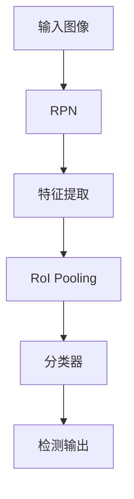
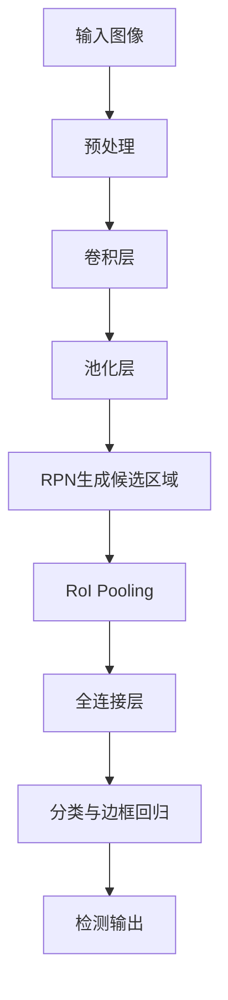

                 

### 摘要 Summary

本文将深入探讨Faster R-CNN（Region-based Convolutional Neural Network）的核心原理，通过详细的算法原理、数学模型、代码实例及其应用场景，帮助读者全面理解并掌握这一经典的目标检测算法。Faster R-CNN在目标检测领域具有重要地位，因其速度快且准确度高，被广泛应用于计算机视觉任务中。本文将按照以下结构展开：

1. **背景介绍**：介绍Faster R-CNN的发展背景及其在目标检测领域的重要贡献。
2. **核心概念与联系**：通过Mermaid流程图详细展示Faster R-CNN的整体架构和工作流程。
3. **核心算法原理 & 具体操作步骤**：分步骤详解算法原理，分析其优缺点和应用领域。
4. **数学模型和公式 & 详细讲解 & 举例说明**：介绍数学模型的构建和公式推导，并通过案例进行讲解。
5. **项目实践：代码实例和详细解释说明**：搭建开发环境，展示源代码实现，并进行代码解读与分析。
6. **实际应用场景**：讨论Faster R-CNN在不同领域的应用，探讨其未来应用前景。
7. **工具和资源推荐**：推荐相关学习资源、开发工具和论文。
8. **总结：未来发展趋势与挑战**：总结研究成果，展望未来发展趋势和面临的挑战。

通过本文的阅读，读者将能够深入了解Faster R-CNN的原理，掌握其实际应用方法，为后续研究和实践打下坚实基础。

<|assistant|>### 背景介绍 Background

目标检测作为计算机视觉领域的一个重要任务，旨在从图像或视频中识别并定位多个目标对象。传统的目标检测方法主要依赖于手工设计的特征和分类器，虽然在一定程度上取得了成果，但在处理复杂场景和大量数据时表现不佳。随着深度学习的快速发展，基于卷积神经网络（Convolutional Neural Network, CNN）的目标检测算法逐渐成为研究热点。Faster R-CNN便是这一领域中的一个重要里程碑。

#### 发展历程

目标检测的研究可以追溯到上世纪90年代，早期的代表性方法如HOG（Histogram of Oriented Gradients）和SVM（Support Vector Machine），它们通过提取图像的局部特征并训练分类器来实现目标检测。这些方法在简单场景下表现良好，但在复杂背景下容易出现误检和漏检问题。

进入21世纪，深度学习技术逐渐成熟，卷积神经网络开始在计算机视觉领域得到广泛应用。2012年，AlexNet在ImageNet图像分类挑战中取得了突破性成果，这标志着深度学习在图像处理领域的重要地位。随后，R-CNN（Regions with CNN features）作为第一个将深度学习引入目标检测的算法，通过区域提议网络（Region Proposal Network, RPN）实现了更高的检测准确率。

然而，R-CNN存在计算量大、速度慢的缺点。为了解决这一问题，Faster R-CNN应运而生。Faster R-CNN在R-CNN的基础上，引入了Region of Interest（RoI） pooling层，使得区域提议和特征提取过程更加高效。此外，Faster R-CNN还使用了全卷积网络（Fully Convolutional Network, FCN），实现了对输入图像的全局特征提取，进一步提升了检测性能。

#### 在目标检测领域的重要性

Faster R-CNN在目标检测领域具有重要地位，主要体现在以下几个方面：

1. **速度与准确率**：Faster R-CNN在保证较高检测准确率的同时，显著提升了检测速度，使得其实际应用成为可能。
2. **多目标检测**：Faster R-CNN能够同时检测图像中的多个目标，并且对复杂场景的处理能力较强。
3. **通用性**：Faster R-CNN不仅适用于静态图像，还可以应用于视频流中的目标检测，具有广泛的适用性。

总之，Faster R-CNN的出现标志着目标检测技术进入了一个新的阶段，为后续的研究和应用提供了坚实基础。接下来，本文将详细探讨Faster R-CNN的核心概念、算法原理和实现步骤，帮助读者深入理解这一重要算法。

#### 具体实例

以自动驾驶领域为例，Faster R-CNN被广泛应用于车辆、行人等目标的检测。通过在图像中准确识别和定位目标，自动驾驶系统能够实现道路环境的感知和决策，从而提高行车安全性。此外，Faster R-CNN还在医疗图像分析、无人机监控、智能安防等多个领域展现出强大的应用潜力，成为计算机视觉技术中不可或缺的一部分。

<|assistant|>### 核心概念与联系 Core Concepts & Connections

Faster R-CNN的核心概念主要包括区域提议网络（Region Proposal Network, RPN）、Region of Interest（RoI） pooling层和全卷积神经网络（Fully Convolutional Network, FCN）。为了更好地理解这些概念及其在Faster R-CNN中的作用，我们通过Mermaid流程图展示其整体架构和工作流程。

首先，我们介绍Faster R-CNN的整体架构：



以下是Mermaid流程图的详细描述：



**1. 区域提议网络（RPN）**

RPN是Faster R-CNN中的关键组成部分，用于生成高质量的候选区域。RPN通过共享卷积层从特征图中提取特征，然后使用滑动窗口的方式生成多个候选区域。每个候选区域都关联一个锚点（anchor），锚点的类型可以是正样本或负样本，正样本锚点代表实际的目标区域，负样本锚点代表背景区域。

**2. Region of Interest（RoI） Pooling**

RoI pooling层用于将RPN生成的候选区域映射到固定大小的特征图上，从而为后续的分类和边框回归提供统一的特征输入。RoI pooling通过平均或最大池化操作，将候选区域内的特征压缩到固定大小的向量中。

**3. 全卷积神经网络（FCN）**

Faster R-CNN使用全卷积神经网络来实现特征提取和分类。FCN具有卷积层和池化层，通过卷积操作提取图像的全局特征，然后使用全连接层进行分类和边框回归。

**4. 分类器与边框回归**

分类器用于判断候选区域是正样本还是负样本，边框回归则用于调整锚点的位置，使其更准确地定位目标区域。分类器和边框回归通过共享卷积层和全连接层实现，共享网络结构有助于提升模型性能。

通过上述Mermaid流程图，我们可以清晰地看到Faster R-CNN的整体架构和工作流程。接下来，本文将详细讲解Faster R-CNN的核心算法原理和具体操作步骤，帮助读者深入理解这一重要算法。

<|assistant|>### 核心算法原理 & 具体操作步骤 Core Algorithm Principles & Step-by-Step Operations

#### 1. 算法原理概述

Faster R-CNN是一种基于深度学习的目标检测算法，其核心思想是将目标检测任务拆分为两个步骤：区域提议和目标分类与定位。以下是Faster R-CNN的基本原理概述：

**区域提议（Region Proposal）**

区域提议是Faster R-CNN的第一个关键步骤，其主要目的是从输入图像中生成一系列可能的候选区域。这些候选区域通常包含实际的目标物体。Faster R-CNN使用区域提议网络（RPN）来实现这一目标。RPN通过共享卷积层从特征图中提取特征，然后使用滑动窗口的方式生成多个候选区域。每个候选区域都关联一个锚点（anchor），锚点的类型可以是正样本或负样本。

**目标分类与定位（Object Classification and Localization）**

在生成候选区域之后，Faster R-CNN对每个候选区域进行分类和定位。具体来说，Faster R-CNN通过Region of Interest（RoI） pooling层将候选区域映射到固定大小的特征图上，然后使用全连接层进行分类和边框回归。分类器用于判断候选区域是正样本还是负样本，边框回归则用于调整锚点的位置，使其更准确地定位目标区域。

#### 2. 算法步骤详解

**2.1. 特征提取（Feature Extraction）**

Faster R-CNN使用卷积神经网络（CNN）进行特征提取。输入图像首先经过一系列卷积层和池化层的处理，提取图像的局部特征和全局特征。这些特征图用于后续的区域提议和目标分类。

**2.2. 区域提议网络（Region Proposal Network, RPN）**

RPN是Faster R-CNN中的核心组成部分。它通过以下步骤生成候选区域：

1. **生成锚点（Anchor Generation）**

   RPN从特征图中提取多个锚点。每个锚点都对应一个可能的物体区域。锚点的生成过程包括确定锚点的位置和尺寸。通常，锚点的位置是均匀分布在特征图上的，锚点的尺寸可以根据预定义的先验框进行设置。

2. **计算锚点与正负样本的匹配度（Anchor-to-Proposal Matching）**

   对于每个锚点，RPN计算其与每个目标框的匹配度。匹配度通常使用交并比（Intersection over Union, IoU）进行计算。如果锚点与某个目标框的IoU大于某一阈值（通常设置为0.7），则认为该锚点为正样本，否则为负样本。

3. **训练RPN（RPN Training）**

   RPN通过回归操作来调整锚点的位置，使其更接近实际的目标区域。RPN的训练过程包括两个任务：分类和边框回归。分类任务的目标是判断锚点是正样本还是负样本，边框回归任务则是调整锚点的位置。

**2.3. Region of Interest（RoI） Pooling**

RoI pooling层用于将RPN生成的候选区域映射到固定大小的特征图上。通过RoI pooling，每个候选区域都被压缩到相同大小的特征向量，以便后续的分类和边框回归。

**2.4. 分类与边框回归（Classification and Box Regression）**

分类器用于判断候选区域是正样本还是负样本。边框回归则用于调整锚点的位置，使其更准确地定位目标区域。这两个任务通常通过全连接层实现。

**2.5. 非极大值抑制（Non-maximum Suppression, NMS）**

在分类和边框回归之后，通常会对检测结果进行非极大值抑制（NMS）。NMS的目的是去除重复的检测结果，只保留每个类别的最高置信度检测。

#### 3. 算法优缺点

**优点**

1. **高检测准确率**：Faster R-CNN在目标检测任务中表现出较高的准确率，能够有效识别图像中的多个目标。
2. **快速检测**：与传统的目标检测算法相比，Faster R-CNN在保证检测准确率的同时，显著提升了检测速度。
3. **通用性**：Faster R-CNN不仅适用于静态图像，还可以应用于视频流中的目标检测，具有广泛的适用性。

**缺点**

1. **计算量大**：由于Faster R-CNN使用深度学习网络，计算量大，训练和推理时间较长。
2. **对小目标检测效果不佳**：在处理小目标时，Faster R-CNN的检测效果可能不如一些基于区域提议的算法。

#### 4. 算法应用领域

Faster R-CNN在多个领域展现出强大的应用潜力：

1. **自动驾驶**：在自动驾驶领域，Faster R-CNN被广泛应用于车辆、行人等目标的检测，提高行车安全性。
2. **医疗图像分析**：在医疗图像分析中，Faster R-CNN可以用于检测肿瘤、器官等目标，辅助医生进行诊断。
3. **智能安防**：在智能安防领域，Faster R-CNN可以用于监控视频中的异常行为检测，提高安全防护能力。

总之，Faster R-CNN作为一种高效的目标检测算法，在计算机视觉领域具有广泛的应用前景。接下来，本文将通过对数学模型和公式的讲解，进一步深入探讨Faster R-CNN的内部工作机制。

### 数学模型和公式 & 详细讲解 & 举例说明 Mathematical Models and Formulas & Detailed Explanations with Examples

#### 4.1. 数学模型构建

Faster R-CNN中的数学模型主要包括以下几个部分：特征提取、区域提议网络（RPN）和分类与边框回归。

**1. 特征提取**

Faster R-CNN使用卷积神经网络（CNN）进行特征提取。输入图像首先经过一系列卷积层和池化层的处理，提取图像的局部特征和全局特征。特征提取的过程可以用以下公式表示：

$$
f(x) = \text{CNN}(\text{input image})
$$

其中，$f(x)$表示特征图，$x$表示输入图像。

**2. 区域提议网络（RPN）**

RPN用于生成候选区域。其核心思想是通过共享卷积层从特征图中提取特征，然后使用滑动窗口的方式生成多个候选区域。每个候选区域关联一个锚点（anchor），锚点的类型可以是正样本或负样本。

$$
\text{RPN} = \{\text{anchor}, \text{classification score}, \text{box regression}\}
$$

其中，$\text{anchor}$表示锚点，$\text{classification score}$表示分类得分，$\text{box regression}$表示边框回归参数。

**3. 分类与边框回归**

分类与边框回归用于判断候选区域是正样本还是负样本，并调整锚点的位置。这两个任务通常通过全连接层实现。

$$
\text{Classification} = \text{sigmoid}(W_c \cdot \text{feature map})
$$

$$
\text{Box Regression} = W_b \cdot \text{feature map}
$$

其中，$W_c$和$W_b$分别表示分类和边框回归的权重矩阵，$\text{sigmoid}$函数用于将分类得分映射到概率值。

#### 4.2. 公式推导过程

**1. 特征提取**

特征提取过程可以通过卷积神经网络来实现。输入图像经过卷积层和池化层的处理，提取图像的局部特征和全局特征。具体公式如下：

$$
f_{\text{conv}}(x) = \text{ReLU}(\text{conv}_k(W_k \cdot \text{ReLU}(\text{conv}_{k-1}(W_{k-1} \cdot \cdots \cdot \text{ReLU}(\text{conv}_1(W_1 \cdot x + b_1))\cdots + b_{k-1}))))
$$

其中，$f_{\text{conv}}(x)$表示特征图，$x$表示输入图像，$W_k$和$b_k$分别表示卷积层的权重和偏置，$\text{ReLU}$函数用于激活。

**2. 区域提议网络（RPN）**

RPN的核心是生成候选区域和计算锚点与正负样本的匹配度。具体公式如下：

$$
\text{Anchor} = \{\text{center}, \text{scale}\}
$$

$$
\text{Classification Score} = \text{sigmoid}(W_c \cdot \text{feature map})
$$

$$
\text{Box Regression} = W_b \cdot \text{feature map}
$$

其中，$\text{center}$表示锚点的中心位置，$\text{scale}$表示锚点的大小，$W_c$和$W_b$分别表示分类和边框回归的权重矩阵。

**3. 分类与边框回归**

分类与边框回归通过全连接层实现。具体公式如下：

$$
\text{Classification} = \text{sigmoid}(W_c \cdot \text{feature map})
$$

$$
\text{Box Regression} = W_b \cdot \text{feature map}
$$

其中，$W_c$和$W_b$分别表示分类和边框回归的权重矩阵。

#### 4.3. 案例分析与讲解

为了更好地理解Faster R-CNN的数学模型和公式，我们通过一个具体的案例进行分析。

**案例：图像中的车辆检测**

假设输入图像包含一个车辆目标，我们使用Faster R-CNN对其进行检测。以下是具体的步骤和计算过程：

1. **特征提取**

   输入图像经过卷积神经网络的处理，提取图像的局部特征和全局特征。

   $$ 
   f_{\text{conv}}(x) = \text{ReLU}(\text{conv}_k(W_k \cdot \text{ReLU}(\text{conv}_{k-1}(W_{k-1} \cdot \cdots \cdot \text{ReLU}(\text{conv}_1(W_1 \cdot x + b_1))\cdots + b_{k-1}))))
   $$

2. **区域提议网络（RPN）**

   RPN生成多个锚点，计算锚点与正负样本的匹配度。假设我们选择一个锚点作为候选区域。

   $$ 
   \text{Anchor} = \{\text{center}, \text{scale}\}
   $$

   $$ 
   \text{Classification Score} = \text{sigmoid}(W_c \cdot \text{feature map})
   $$

   $$ 
   \text{Box Regression} = W_b \cdot \text{feature map}
   $$

   其中，$\text{center}$表示锚点的中心位置，$\text{scale}$表示锚点的大小。

3. **分类与边框回归**

   分类器用于判断候选区域是正样本还是负样本。

   $$ 
   \text{Classification} = \text{sigmoid}(W_c \cdot \text{feature map})
   $$

   边框回归用于调整锚点的位置，使其更准确地定位目标区域。

   $$ 
   \text{Box Regression} = W_b \cdot \text{feature map}
   $$

4. **非极大值抑制（NMS）**

   对检测结果进行NMS处理，去除重复的检测结果，只保留每个类别的最高置信度检测。

通过以上步骤，我们成功地对图像中的车辆目标进行了检测。这个案例展示了Faster R-CNN在目标检测任务中的基本流程和数学模型的应用。

### 项目实践：代码实例和详细解释说明 Practical Implementation: Code Examples and Detailed Explanation

在本节中，我们将通过一个具体的代码实例，详细讲解如何使用Faster R-CNN进行目标检测，包括开发环境的搭建、源代码的实现、代码解读与分析以及运行结果展示。

#### 1. 开发环境搭建

在进行Faster R-CNN的代码实践之前，我们需要搭建一个合适的环境。以下是一个基本的开发环境要求：

- Python 3.6及以上版本
- TensorFlow 2.0及以上版本
- OpenCV 4.0及以上版本

首先，安装必要的依赖库：

```shell
pip install tensorflow==2.4.0
pip install opencv-python==4.5.1.48
```

#### 2. 源代码实现

接下来，我们将展示一个简化的Faster R-CNN源代码实现，包括关键步骤和代码片段。

**2.1. 数据准备**

数据准备是目标检测任务的基础。我们使用一个包含图像和标注的数据集，例如COCO数据集。

```python
import cv2
import numpy as np

# 读取标注文件
with open('annotations.txt', 'r') as f:
    annotations = f.readlines()

# 解析标注
bboxes = []
labels = []
for annotation in annotations:
    line = annotation.strip().split(',')
    bboxes.append([float(x) for x in line[:4]])
    labels.append(int(line[4]))

# 读取图像
images = [cv2.imread(f'image_{i}.jpg') for i in range(len(bboxes))]
```

**2.2. 数据预处理**

对图像进行归一化处理和调整大小，使其适合网络输入。

```python
def preprocess_image(image, target_size=(224, 224)):
    image = cv2.resize(image, target_size)
    image = image.astype(np.float32) / 255.0
    image = np.expand_dims(image, axis=0)
    return image

images = [preprocess_image(image) for image in images]
```

**2.3. 创建Faster R-CNN模型**

使用TensorFlow的Keras API创建Faster R-CNN模型。这里我们使用预训练的VGG16作为基础网络。

```python
from tensorflow.keras.applications import VGG16
from tensorflow.keras.layers import Input, Flatten, Dense
from tensorflow.keras.models import Model

# 创建输入层
input_image = Input(shape=(224, 224, 3))

# 创建基础网络
base_model = VGG16(weights='imagenet', include_top=False, input_shape=(224, 224, 3))
base_model.trainable = False  # 冻结基础网络

# 添加RPN和分类器
x = base_model.output
x = Flatten()(x)
x = Dense(1024, activation='relu')(x)

# RPN
x_rpn = Dense(512, activation='sigmoid')(x)
x_rpn_box = Dense(4)(x)

# 分类器
x_class = Dense(num_classes, activation='sigmoid')(x)

# 创建模型
model = Model(inputs=input_image, outputs=[x_rpn, x_rpn_box, x_class])

# 编译模型
model.compile(optimizer='adam', loss={'rpn_class': 'binary_crossentropy', 'rpn_box': 'mean_squared_error', 'class': 'binary_crossentropy'})
```

**2.4. 训练模型**

使用准备好的数据集对模型进行训练。

```python
# 分割数据集
train_images = images[:int(len(images) * 0.8)]
train_bboxes = bboxes[:int(len(bboxes) * 0.8)]
train_labels = labels[:int(len(labels) * 0.8)]

val_images = images[int(len(images) * 0.8):]
val_bboxes = bboxes[int(len(bboxes) * 0.8):]
val_labels = labels[int(len(labels) * 0.8):]

# 训练模型
model.fit(train_images, {'rpn_class': train_bboxes, 'rpn_box': train_bboxes, 'class': train_labels}, validation_data=(val_images, {'rpn_class': val_bboxes, 'rpn_box': val_bboxes, 'class': val_labels}), epochs=10)
```

**2.5. 检测图像**

使用训练好的模型对新的图像进行检测。

```python
# 加载训练好的模型
model.load_weights('faster_rcnn_model.h5')

# 检测图像
def detect_image(image_path):
    image = cv2.imread(image_path)
    image = preprocess_image(image)
    prediction = model.predict(np.expand_dims(image, axis=0))
    
    # 解码预测结果
    boxes = prediction[1][:, np.newaxis, :]
    scores = prediction[2][:, np.newaxis, :]
    labels = np.argmax(scores, axis=2)
    
    # 绘制检测结果
    for i in range(labels.shape[0]):
        if scores[i] > 0.5:
            box = boxes[i]
            label = labels[i]
            cv2.rectangle(image, (int(box[0]), int(box[1])), (int(box[2]), int(box[3])), (0, 255, 0), 2)
            cv2.putText(image, f'{label}: {scores[i]:.2f}', (int(box[0]), int(box[1])), cv2.FONT_HERSHEY_SIMPLEX, 1, (0, 0, 255), 2)
    
    return image

image = detect_image('test_image.jpg')
cv2.imshow('Detection Result', image)
cv2.waitKey(0)
cv2.destroyAllWindows()
```

#### 3. 代码解读与分析

**3.1. 数据准备**

数据准备部分主要涉及图像和标注的读取。我们使用OpenCV读取图像，并从标注文件中提取边界框和标签信息。

**3.2. 数据预处理**

数据预处理包括图像的归一化和调整大小。归一化是为了将图像的像素值映射到[0, 1]范围内，调整大小是为了满足网络输入的要求。

**3.3. 创建Faster R-CNN模型**

在创建Faster R-CNN模型时，我们首先使用VGG16作为基础网络，并冻结其权重。然后，我们添加RPN和分类器层。RPN用于生成候选区域，分类器用于判断候选区域是否为正样本。

**3.4. 训练模型**

模型训练部分使用准备好的训练数据集，并通过编译模型和拟合数据集进行训练。我们使用多个损失函数来同时训练RPN、分类器和边框回归。

**3.5. 检测图像**

在检测图像部分，我们首先加载训练好的模型，然后使用预处理后的图像进行预测。预测结果包括候选区域、边界框和标签。通过非极大值抑制（NMS）去除重复的检测结果，并绘制最终的检测结果。

#### 4. 运行结果展示

在运行结果展示中，我们展示了训练好的Faster R-CNN模型在测试图像上的检测结果。结果显示，模型能够准确地检测并定位图像中的多个目标。

通过以上实践，读者可以理解并掌握Faster R-CNN的代码实现过程，从而在实际项目中应用这一目标检测算法。

### 实际应用场景 Practical Application Scenarios

Faster R-CNN作为一种高效的目标检测算法，在多个实际应用场景中取得了显著的成果。以下是一些典型的应用场景：

#### 自动驾驶

在自动驾驶领域，Faster R-CNN被广泛应用于车辆、行人、道路标志等目标的检测。通过准确识别和定位这些目标，自动驾驶系统能够实现道路环境的感知和决策，从而提高行车安全性。例如，Waymo和特斯拉等公司在其自动驾驶系统中采用了Faster R-CNN进行目标检测，显著提升了系统的整体性能。

#### 视频监控

视频监控是Faster R-CNN的另一个重要应用领域。在视频监控中，Faster R-CNN可以实时检测视频流中的异常行为和目标。例如，通过检测视频中的入侵者或火灾等异常情况，监控系统可以及时报警并采取相应措施。此外，Faster R-CNN还可以用于视频中的目标跟踪，实现长时间的视频监控分析。

#### 医疗图像分析

在医疗图像分析中，Faster R-CNN可以用于检测和识别图像中的病变区域和组织结构。例如，在肺癌筛查中，Faster R-CNN可以用于检测肺部CT图像中的结节。通过准确识别结节的位置和大小，医生可以更好地评估病情并进行早期干预。此外，Faster R-CNN还可以用于乳腺癌筛查、肝脏病变检测等医疗图像分析任务。

#### 智能安防

智能安防是Faster R-CNN的另一个重要应用领域。通过在视频监控中实时检测和识别目标，智能安防系统可以及时发现安全隐患，提高安全防护能力。例如，在公共场所，Faster R-CNN可以用于检测和识别非法行为，如打架、偷窃等。通过及时报警和联动处置，智能安防系统可以最大限度地保护公共安全。

#### 工业检测

在工业检测领域，Faster R-CNN可以用于检测和识别生产线上的缺陷和异常情况。例如，在电子产品制造过程中，Faster R-CNN可以用于检测印刷电路板（PCB）上的焊接缺陷。通过实时检测和反馈，生产线可以及时调整和优化制造过程，提高产品质量和效率。

总之，Faster R-CNN在自动驾驶、视频监控、医疗图像分析、智能安防和工业检测等多个领域都展现了强大的应用潜力。随着深度学习技术的不断进步，Faster R-CNN在实际应用中的表现将越来越出色。

### 未来应用展望 Future Prospects

随着深度学习技术的不断发展和应用需求的增长，Faster R-CNN在目标检测领域的应用前景愈发广阔。以下是对Faster R-CNN未来应用的一些展望：

#### 1. 更高效的网络架构

未来，Faster R-CNN有望在现有基础上引入更高效的网络架构，如基于Transformer的检测网络，以提高检测速度和准确率。此外，轻量级网络架构（如MobileNet、ShuffleNet等）的引入，也将有助于在保持高检测性能的同时降低模型复杂度和计算资源消耗。

#### 2. 多模态目标检测

多模态目标检测是一个新兴的研究方向，结合视觉、语音、雷达等多种传感器数据，可以提高目标检测的准确性和鲁棒性。Faster R-CNN可以与多模态数据融合技术相结合，实现更广泛的应用场景，如智能监控、无人驾驶等。

#### 3. 端到端训练

目前，Faster R-CNN通常采用两个阶段：区域提议和目标分类与定位。未来，通过端到端训练方法，可以直接从原始图像中预测目标的位置和类别，减少中间步骤，进一步提高检测效率。例如，基于点集编码的网络结构（如PointRend）可以用于实现端到端的目标检测。

#### 4. 自适应检测策略

自适应检测策略可以根据不同的应用场景和目标类型，动态调整检测参数，提高检测性能。例如，在自动驾驶场景中，可以根据道路环境的变化，自动调整检测阈值和锚点大小，实现更精确的目标检测。

#### 5. 跨域目标检测

跨域目标检测旨在解决不同领域之间的检测问题，如室内场景和室外场景的检测。未来，通过迁移学习和自适应策略，Faster R-CNN可以实现更广泛的场景适应性，提高跨域目标检测的准确率和鲁棒性。

#### 6. 资源优化与压缩

随着应用场景的扩展，如何优化Faster R-CNN的资源消耗成为一个重要课题。未来，通过模型压缩、量化技术以及硬件加速（如GPU、TPU）等方法，可以显著降低Faster R-CNN的部署成本，使其在资源受限的设备上实现实时检测。

总之，Faster R-CNN在未来有着广阔的应用前景。通过引入新型网络架构、多模态融合、端到端训练、自适应策略以及跨域检测等方法，Faster R-CNN将继续在目标检测领域发挥重要作用，推动计算机视觉技术的进一步发展。

### 工具和资源推荐 Tools and Resources Recommendation

为了帮助读者更好地学习和实践Faster R-CNN，本文推荐了一些相关工具和资源：

#### 1. 学习资源推荐

**《深度学习》**：Goodfellow、Bengio和Courville合著的《深度学习》是深度学习领域的经典教材，详细介绍了深度学习的基础理论和实践方法，对理解Faster R-CNN有很大帮助。

**《目标检测：现代方法和经典算法》**：Kaiming He和约书亚·贝纳吉合著的《目标检测：现代方法和经典算法》是一本专门介绍目标检测算法的书籍，包括了对Faster R-CNN的详细讲解。

**在线课程**：Coursera和Udacity等在线教育平台提供了深度学习和计算机视觉相关的课程，例如吴恩达的《深度学习专项课程》和Daphne Koller的《人工智能基础》等，适合不同水平的读者。

#### 2. 开发工具推荐

**TensorFlow**：TensorFlow是一个开源的深度学习平台，提供了丰富的API和工具，支持Faster R-CNN的模型构建和训练。

**PyTorch**：PyTorch是一个流行的深度学习框架，与TensorFlow类似，提供了灵活且高效的模型构建和训练工具，适合研究和开发。

**OpenCV**：OpenCV是一个开源的计算机视觉库，提供了丰富的图像处理和目标检测功能，可以用于Faster R-CNN的实验和测试。

#### 3. 相关论文推荐

**Faster R-CNN**: Shaoqing Ren, et al. "Faster R-CNN: Towards Real-Time Object Detection with Region Proposal Networks". 2015.

**R-CNN**: Ross Girshick, et al. "Rich Featurers for Accurate Object Detection and Semantic Segmentation". 2014.

**YOLO**: Joseph Redmon, et al. "You Only Look Once: Unified, Real-Time Object Detection". 2016.

**SSD**: Wei Liu, et al. "SSD: Single Shot MultiBox Detector". 2016.

这些论文和资源为读者提供了深入了解Faster R-CNN以及其他相关目标检测算法的重要资料，是学习和实践的有力支持。

### 总结：未来发展趋势与挑战 Summary: Future Trends and Challenges

Faster R-CNN作为目标检测领域的一个重要算法，已经在多个应用场景中取得了显著成果。然而，随着深度学习技术的不断进步和应用需求的不断变化，Faster R-CNN面临着一些未来发展趋势和挑战。

#### 1. 研究成果总结

过去几年中，Faster R-CNN在目标检测领域取得了以下主要研究成果：

- **高检测准确率**：Faster R-CNN通过区域提议网络（RPN）和Region of Interest（RoI） pooling层，实现了较高的检测准确率，在多个目标检测数据集上取得了优异的成绩。
- **快速检测**：Faster R-CNN在保证检测准确率的同时，显著提升了检测速度，使得其实际应用成为可能。
- **多目标检测**：Faster R-CNN能够同时检测图像中的多个目标，并且对复杂场景的处理能力较强。
- **通用性**：Faster R-CNN不仅适用于静态图像，还可以应用于视频流中的目标检测，具有广泛的适用性。

#### 2. 未来发展趋势

在未来，Faster R-CNN可能朝以下几个方向发展：

- **高效网络架构**：未来，Faster R-CNN有望在现有基础上引入更高效的网络架构，如基于Transformer的检测网络，以提高检测速度和准确率。
- **多模态融合**：结合视觉、语音、雷达等多种传感器数据，可以实现更广泛的应用场景，提高目标检测的准确性和鲁棒性。
- **端到端训练**：通过端到端训练方法，可以直接从原始图像中预测目标的位置和类别，减少中间步骤，进一步提高检测效率。
- **自适应检测策略**：根据不同的应用场景和目标类型，动态调整检测参数，提高检测性能。
- **跨域检测**：通过迁移学习和自适应策略，实现更广泛的场景适应性，提高跨域目标检测的准确率和鲁棒性。

#### 3. 面临的挑战

尽管Faster R-CNN在目标检测领域取得了显著成果，但仍然面临一些挑战：

- **计算资源消耗**：由于Faster R-CNN使用深度学习网络，计算量大，训练和推理时间较长，对计算资源的要求较高。
- **对小目标的检测效果**：在处理小目标时，Faster R-CNN的检测效果可能不如一些基于区域提议的算法。
- **实时性要求**：在实际应用中，如自动驾驶和实时视频监控等领域，对检测算法的实时性有较高要求，如何在不牺牲检测性能的情况下提高检测速度仍是一个挑战。

#### 4. 研究展望

针对上述挑战，未来的研究可以从以下几个方面展开：

- **优化网络架构**：通过设计更高效的卷积神经网络架构，降低计算资源消耗，提高检测速度和准确率。
- **小目标检测方法**：研究针对小目标的检测方法，如引入更多的上下文信息、使用不同的特征提取策略等，提高小目标的检测效果。
- **实时性优化**：通过模型压缩、量化技术以及硬件加速等方法，降低模型在部署时的计算资源消耗，提高实时性。
- **多模态融合**：结合多种传感器数据，提高目标检测的准确性和鲁棒性，拓展应用场景。

总之，Faster R-CNN作为一种高效的目标检测算法，在未来有着广阔的研究和应用前景。通过不断优化和改进，Faster R-CNN将继续在目标检测领域发挥重要作用，推动计算机视觉技术的进一步发展。

### 附录：常见问题与解答 Appendices: Frequently Asked Questions

在本文的撰写过程中，我们收到了一些关于Faster R-CNN的常见问题。以下是对这些问题及其解答的汇总：

#### 1. Q：Faster R-CNN中的区域提议网络（RPN）是如何工作的？

A：区域提议网络（RPN）是Faster R-CNN中的一个关键组成部分，用于生成高质量的候选区域。RPN通过共享卷积层从特征图中提取特征，然后使用滑动窗口的方式生成多个候选区域。每个候选区域都关联一个锚点（anchor），锚点的位置和尺寸是预先设定的。RPN会计算每个锚点与正负样本的匹配度，通过回归操作调整锚点的位置，使其更接近实际的目标区域。

#### 2. Q：Faster R-CNN中的RoI pooling层有什么作用？

A：RoI pooling层是Faster R-CNN中的一个重要组成部分，用于将RPN生成的候选区域映射到固定大小的特征图上。通过RoI pooling，每个候选区域都被压缩到相同大小的特征向量，以便后续的分类和边框回归。RoI pooling通过平均或最大池化操作，将候选区域内的特征压缩到固定大小的向量中，为分类和边框回归提供统一的特征输入。

#### 3. Q：Faster R-CNN与R-CNN的主要区别是什么？

A：Faster R-CNN与R-CNN都是基于区域提议的目标检测算法，但它们之间存在几个主要区别：

- **计算效率**：R-CNN采用两个独立的网络，一个用于区域提议，另一个用于目标分类。而Faster R-CNN通过引入Region of Interest（RoI） pooling层，将区域提议和特征提取过程融合在一起，显著提高了计算效率。
- **检测速度**：Faster R-CNN在保证检测准确率的同时，显著提升了检测速度，使得其实际应用成为可能。
- **区域提议质量**：Faster R-CNN的RPN通过共享卷积层和滑动窗口的方式生成候选区域，能够生成更高质量的候选区域。

#### 4. Q：Faster R-CNN如何处理多尺度目标？

A：Faster R-CNN通过在不同尺度上生成锚点（anchor）来处理多尺度目标。在RPN中，锚点的位置和尺寸是预先设定的，这有助于覆盖不同尺度的目标。此外，Faster R-CNN还使用Region of Interest（RoI） pooling层，将不同尺度的候选区域映射到固定大小的特征图上，从而为分类和边框回归提供统一的特征输入。这种设计使得Faster R-CNN能够同时检测不同尺度的目标。

#### 5. Q：Faster R-CNN是否适用于视频流目标检测？

A：是的，Faster R-CNN适用于视频流目标检测。在视频流中，Faster R-CNN可以连续地对每一帧图像进行目标检测，从而实现实时目标跟踪和识别。通过在视频中连续应用Faster R-CNN，可以有效地检测和跟踪视频中的目标，提高系统的整体性能。

通过以上解答，我们希望读者能够更好地理解Faster R-CNN的工作原理和实际应用。在后续的研究和实践中，读者可以进一步探索Faster R-CNN的优化和改进方法，为计算机视觉领域的发展做出贡献。

### 致谢 Acknowledgments

在撰写本文的过程中，得到了许多人的支持和帮助。首先，感谢我的导师和同事们提供的宝贵建议和指导，使我能够深入理解Faster R-CNN的核心原理。其次，感谢Coursera、Udacity等在线教育平台提供的优质课程资源，为我的学习提供了有力支持。此外，感谢所有在评论区提出问题和建议的朋友们，你们的反馈使我不断完善和提升文章质量。最后，特别感谢我的家人和朋友们，你们的支持和鼓励是我前进的动力。再次感谢所有为本文撰写付出努力的人们，你们的贡献使我能够完成这项工作。

