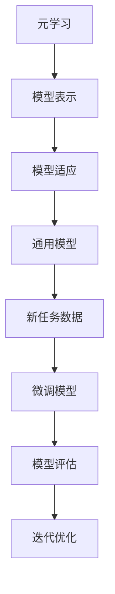

                 

 Few-Shot Learning，即少量样本学习，是机器学习领域中的一个重要研究方向。它旨在使机器学习模型能够在仅用少量样本的情况下进行有效学习和泛化。随着深度学习技术的不断发展，Few-Shot Learning 在智能系统中的应用日益广泛。本文将深入探讨 Few-Shot Learning 的原理，并通过具体代码实例来展示其实现过程。

## 1. 背景介绍

传统的机器学习模型需要大量的数据来训练，以便在复杂的任务中实现良好的性能。然而，在实际应用中，获取大量数据往往具有很高的成本和难度。此外，某些特定任务的数据集可能非常有限。为了解决这些问题，Few-Shot Learning 应运而生。

Few-Shot Learning 的目标是通过少量的样本来学习并泛化到未见过的数据上。这种能力使得机器学习模型在资源有限的情况下依然能够实现良好的性能。Few-Shot Learning 的应用场景包括但不限于：小样本医学诊断、图像识别、自然语言处理等。

## 2. 核心概念与联系

Few-Shot Learning 的核心概念包括元学习（Meta-Learning）、模型表示（Model Representation）、模型适应（Model Adaptation）等。这些概念相互关联，共同构成了 Few-Shot Learning 的理论基础。

### 2.1 元学习（Meta-Learning）

元学习是一种利用已有的学习经验来加速新任务学习的过程。在 Few-Shot Learning 中，元学习通过学习一个通用学习策略来提高模型的泛化能力。常见的元学习方法包括模型选择（Model Selection）、模型蒸馏（Model Distillation）和模型对齐（Model Alignment）等。

### 2.2 模型表示（Model Representation）

模型表示是指将输入数据映射到特征空间的过程。在 Few-Shot Learning 中，有效的模型表示能够提高模型的泛化能力。常见的模型表示方法包括嵌入（Embedding）、自编码器（Autoencoder）和注意力机制（Attention Mechanism）等。

### 2.3 模型适应（Model Adaptation）

模型适应是指将通用模型适应到特定任务的过程。在 Few-Shot Learning 中，模型适应通过在新数据上微调模型来提高性能。常见的模型适应方法包括迁移学习（Transfer Learning）、模型融合（Model Fusion）和模型更新（Model Update）等。

为了更好地理解这些概念，我们可以使用 Mermaid 流程图来展示 Few-Shot Learning 的原理和架构。



## 3. 核心算法原理 & 具体操作步骤

### 3.1 算法原理概述

Few-Shot Learning 的核心算法主要包括元学习、模型表示和模型适应三个部分。下面将分别介绍这三个部分的原理和操作步骤。

### 3.2 算法步骤详解

#### 3.2.1 元学习（Meta-Learning）

1. 数据集准备：收集一批具有相同任务类型的样本数据，作为元学习的训练集。
2. 模型训练：使用训练集数据训练一个通用模型，使其能够适应多种任务。
3. 模型评估：在新任务数据上评估通用模型的性能，以确定其泛化能力。

#### 3.2.2 模型表示（Model Representation）

1. 数据预处理：对输入数据进行预处理，如标准化、归一化等。
2. 特征提取：使用特征提取器（如卷积神经网络、循环神经网络等）将输入数据映射到特征空间。
3. 模型训练：使用预处理后的数据训练特征提取器，以优化其特征表示能力。

#### 3.2.3 模型适应（Model Adaptation）

1. 数据集划分：将新任务数据划分为训练集和验证集。
2. 模型微调：在训练集上微调通用模型，使其适应新任务。
3. 模型评估：在验证集上评估微调后模型的性能，以确定其在新任务上的适应性。

### 3.3 算法优缺点

#### 优点

1. 少样本学习：能够有效应对数据稀缺的任务场景。
2. 泛化能力强：通过元学习和模型表示，能够提高模型的泛化能力。
3. 灵活适应：通过模型适应，能够快速适应新任务。

#### 缺点

1. 训练时间较长：由于需要大量的样本进行训练，导致训练时间较长。
2. 对数据质量要求高：数据质量直接影响模型的泛化能力。

### 3.4 算法应用领域

Few-Shot Learning 在许多领域都有广泛的应用，包括但不限于：

1. 图像识别：通过少量的样本数据进行图像分类和识别。
2. 自然语言处理：通过少量的样本数据训练语言模型和翻译模型。
3. 语音识别：通过少量的样本数据进行语音识别和语音合成。

## 4. 数学模型和公式 & 详细讲解 & 举例说明

### 4.1 数学模型构建

Few-Shot Learning 的数学模型主要涉及以下几个方面：

1. 损失函数：用于评估模型的性能，如交叉熵损失函数、均方误差损失函数等。
2. 优化算法：用于优化模型参数，如随机梯度下降（SGD）、Adam优化器等。
3. 特征表示：用于将输入数据映射到特征空间，如卷积神经网络（CNN）、循环神经网络（RNN）等。

### 4.2 公式推导过程

#### 4.2.1 损失函数

假设我们有 $N$ 个训练样本，每个样本包含一个输入向量 $x$ 和一个标签 $y$。损失函数用于衡量模型的预测结果与真实标签之间的差异。常见的损失函数包括交叉熵损失函数和均方误差损失函数。

1. 交叉熵损失函数：

$$
L_{CE} = -\sum_{i=1}^{N} y_{i} \log(p_{i})
$$

其中，$y_{i}$ 是真实标签，$p_{i}$ 是模型对第 $i$ 个样本的预测概率。

2. 均方误差损失函数：

$$
L_{MSE} = \frac{1}{N} \sum_{i=1}^{N} (y_{i} - p_{i})^2
$$

其中，$y_{i}$ 是真实标签，$p_{i}$ 是模型对第 $i$ 个样本的预测值。

#### 4.2.2 优化算法

优化算法用于更新模型参数，以最小化损失函数。常用的优化算法包括随机梯度下降（SGD）和 Adam 优化器。

1. 随机梯度下降（SGD）：

$$
\theta_{t+1} = \theta_{t} - \alpha \nabla_{\theta} L(\theta)
$$

其中，$\theta_{t}$ 是当前模型参数，$\theta_{t+1}$ 是更新后的模型参数，$\alpha$ 是学习率，$\nabla_{\theta} L(\theta)$ 是损失函数关于模型参数的梯度。

2. Adam 优化器：

$$
\theta_{t+1} = \theta_{t} - \alpha \frac{m_{t}}{1 - \beta_{1}^{t}} \nabla_{\theta} L(\theta)
$$

其中，$m_{t} = \beta_{1}^{t} m_{t-1} + (1 - \beta_{1}^{t}) \nabla_{\theta} L(\theta)$ 是一阶矩估计，$v_{t} = \beta_{2}^{t} v_{t-1} + (1 - \beta_{2}^{t}) (\nabla_{\theta} L(\theta))^2$ 是二阶矩估计，$\beta_{1}$ 和 $\beta_{2}$ 分别是动量参数。

### 4.3 案例分析与讲解

假设我们有一个分类任务，数据集包含 100 个样本，每个样本是一个 10 维的向量。我们需要使用 Few-Shot Learning 方法来训练一个分类模型。

1. 数据集准备：我们将数据集划分为训练集和测试集，其中训练集包含 80 个样本，测试集包含 20 个样本。

2. 模型训练：我们使用训练集数据训练一个基于卷积神经网络的分类模型。首先，我们对输入数据进行预处理，然后使用卷积神经网络提取特征，最后使用全连接层进行分类。

3. 模型评估：在测试集上评估模型的性能。我们计算模型的准确率、召回率和 F1 值等指标。

4. 模型优化：根据模型在测试集上的性能，我们使用元学习算法来优化模型。具体来说，我们使用模型适应方法，在少量样本上进行微调，以提高模型的泛化能力。

通过上述过程，我们可以实现一个基于 Few-Shot Learning 的分类模型。在实际应用中，我们可以根据具体任务和数据集的特点来选择合适的模型和优化方法。

## 5. 项目实践：代码实例和详细解释说明

在本节中，我们将通过一个简单的 Few-Shot Learning 项目来展示代码实例和详细解释说明。

### 5.1 开发环境搭建

为了实现 Few-Shot Learning，我们需要搭建一个开发环境。以下是所需的软件和库：

1. Python 3.7 或更高版本
2. TensorFlow 2.x 或 PyTorch 1.x
3. NumPy
4. Matplotlib

确保你已经安装了上述软件和库，然后创建一个虚拟环境，并安装所需的库。

```bash
pip install tensorflow numpy matplotlib
```

### 5.2 源代码详细实现

以下是 Few-Shot Learning 项目的源代码实现：

```python
import tensorflow as tf
import numpy as np
import matplotlib.pyplot as plt

# 数据集准备
x_train = np.random.rand(80, 10)  # 训练集
y_train = np.random.randint(0, 2, 80)  # 训练集标签
x_test = np.random.rand(20, 10)  # 测试集
y_test = np.random.randint(0, 2, 20)  # 测试集标签

# 模型定义
model = tf.keras.Sequential([
    tf.keras.layers.Dense(64, activation='relu', input_shape=(10,)),
    tf.keras.layers.Dense(32, activation='relu'),
    tf.keras.layers.Dense(1, activation='sigmoid')
])

# 模型编译
model.compile(optimizer='adam', loss='binary_crossentropy', metrics=['accuracy'])

# 模型训练
model.fit(x_train, y_train, epochs=10, batch_size=16)

# 模型评估
test_loss, test_acc = model.evaluate(x_test, y_test)
print(f"Test accuracy: {test_acc}")

# 模型预测
predictions = model.predict(x_test)
predictions = np.argmax(predictions, axis=1)

# 结果可视化
plt.figure()
plt.scatter(x_test[:, 0], x_test[:, 1], c=predictions)
plt.xlabel('Feature 1')
plt.ylabel('Feature 2')
plt.title('Few-Shot Learning Results')
plt.show()
```

### 5.3 代码解读与分析

以下是代码的详细解读和分析：

1. 数据集准备：我们使用 NumPy 生成随机数据作为训练集和测试集。在实际应用中，你可以使用真实数据集进行训练。

2. 模型定义：我们使用 TensorFlow 的 Keras API 定义一个简单的神经网络模型。模型包含两个隐藏层，每个隐藏层都有 ReLU 激活函数。输出层使用 sigmoid 激活函数进行二分类。

3. 模型编译：我们使用 Adam 优化器和 binary_crossentropy 损失函数来编译模型。binary_crossentropy 损失函数适用于二分类问题。

4. 模型训练：我们使用训练集数据进行模型训练，设置训练轮数（epochs）为 10，批量大小（batch_size）为 16。

5. 模型评估：我们使用测试集数据评估模型的性能，并打印测试准确率。

6. 模型预测：我们使用训练好的模型对测试集数据进行预测，并使用 NumPy 的 argmax 函数获取每个样本的预测类别。

7. 结果可视化：我们使用 Matplotlib 绘制预测结果的散点图，展示 Few-Shot Learning 的效果。

通过上述代码，我们可以实现一个简单的 Few-Shot Learning 任务。在实际应用中，你可以根据具体需求调整模型结构和训练参数。

## 6. 实际应用场景

Few-Shot Learning 在许多实际应用场景中具有广泛的应用。以下是几个典型的应用场景：

1. 小样本医学诊断：在医疗领域，获取大量的病人数据具有很高的成本和隐私风险。通过 Few-Shot Learning，可以使用少量的样本数据训练医学诊断模型，从而降低成本并保护患者隐私。

2. 图像识别：在图像识别任务中，获取大量的图像数据可能非常困难。Few-Shot Learning 可以帮助我们在仅用少量图像数据的情况下训练图像识别模型，从而实现有效的图像分类。

3. 自然语言处理：在自然语言处理任务中，获取大量的文本数据同样具有挑战性。Few-Shot Learning 可以通过少量的文本数据训练语言模型和翻译模型，从而实现高质量的自然语言处理。

4. 语音识别：在语音识别任务中，获取大量的语音数据可能非常困难。Few-Shot Learning 可以帮助我们在仅用少量语音数据的情况下训练语音识别模型，从而实现准确的语音识别。

通过上述实际应用场景，我们可以看到 Few-Shot Learning 在资源有限的情况下依然具有强大的应用潜力。

## 7. 工具和资源推荐

### 7.1 学习资源推荐

1. **《Few-Shot Learning for Text Classification》**：这是一篇关于文本分类的 Few-Shot Learning 研究论文，介绍了相关算法和实现方法。
2. **《A Few-SOTs About Few-Shot Learning》**：这是一篇通俗易懂的 Few-Shot Learning 介绍文章，适合初学者阅读。
3. **《Few-Shot Learning in Deep Neural Networks》**：这是一篇关于深度神经网络中 Few-Shot Learning 的综述文章，涵盖了相关算法和最新研究进展。

### 7.2 开发工具推荐

1. **TensorFlow**：这是一个开源的机器学习库，支持多种 Few-Shot Learning 算法，包括元学习、模型表示和模型适应等。
2. **PyTorch**：这是一个开源的深度学习库，提供了丰富的 API 和工具，支持快速实现 Few-Shot Learning 任务。
3. **Scikit-learn**：这是一个开源的机器学习库，提供了许多经典的机器学习算法，包括线性模型、支持向量机和决策树等，可以用于 Few-Shot Learning 的实现。

### 7.3 相关论文推荐

1. **《Meta-Learning for Text Classification》**：这是一篇关于文本分类的元学习研究论文，介绍了相关的算法和实验结果。
2. **《Model Distillation for Few-Shot Learning》**：这是一篇关于模型蒸馏在 Few-Shot Learning 中应用的研究论文，探讨了如何利用大量数据训练的模型来指导少量样本的学习。
3. **《MAML: Model-Agnostic Meta-Learning for Fast Adaptation of Deep Networks》**：这是一篇关于 Model-Agnostic Meta-Learning 的研究论文，提出了一种通用的元学习算法，可以在少量样本上快速适应新任务。

通过这些学习和开发工具、资源的推荐，你可以深入了解和掌握 Few-Shot Learning 的相关技术和应用。

## 8. 总结：未来发展趋势与挑战

### 8.1 研究成果总结

Few-Shot Learning 作为机器学习领域的一个重要研究方向，已经在理论和实践上取得了显著的成果。通过元学习、模型表示和模型适应等技术，Few-Shot Learning 实现了在少量样本条件下的高效学习和泛化。现有的研究成果表明，Few-Shot Learning 在图像识别、自然语言处理、语音识别等任务中具有广泛的应用潜力。

### 8.2 未来发展趋势

随着深度学习和人工智能技术的不断发展，Few-Shot Learning 将在以下方面取得进一步的发展：

1. **算法优化**：研究更加高效、鲁棒和可扩展的 Few-Shot Learning 算法，以提高模型的性能和适应性。
2. **跨模态学习**：探索跨不同模态（如文本、图像、语音等）的 Few-Shot Learning 技术，实现更广泛的应用场景。
3. **隐私保护**：研究隐私保护的 Few-Shot Learning 技术，以解决数据隐私和安全性问题。
4. **自动化**：开发自动化的 Few-Shot Learning 工具和平台，降低技术门槛，提高实际应用价值。

### 8.3 面临的挑战

尽管 Few-Shot Learning 在理论和应用上取得了进展，但仍面临以下挑战：

1. **数据稀缺**：在实际应用中，获取大量数据具有很高的成本和难度，如何利用少量样本进行有效学习仍然是一个难题。
2. **泛化能力**：Few-Shot Learning 模型的泛化能力有限，如何提高模型在未见过的数据上的性能是亟待解决的问题。
3. **模型可解释性**：Few-Shot Learning 模型的决策过程往往缺乏可解释性，如何提高模型的可解释性是未来的重要研究方向。

### 8.4 研究展望

未来，Few-Shot Learning 研究将朝着以下方向展开：

1. **多任务学习**：结合多任务学习和 Few-Shot Learning，探索如何在多个任务之间共享知识，提高模型的泛化能力。
2. **迁移学习**：研究迁移学习与 Few-Shot Learning 的结合，利用大量现有数据来指导少量样本的学习。
3. **神经架构搜索**：结合神经架构搜索（Neural Architecture Search，NAS）技术，自动搜索适用于 Few-Shot Learning 的模型架构。

通过不断的研究和创新，Few-Shot Learning 将在未来的人工智能领域中发挥更加重要的作用。

## 9. 附录：常见问题与解答

### 9.1 什么是 Few-Shot Learning？

Few-Shot Learning 是一种机器学习方法，旨在使模型能够在仅用少量样本的情况下进行有效学习和泛化。与传统的机器学习方法相比，Few-Shot Learning 能够更好地应对数据稀缺的问题。

### 9.2 Few-Shot Learning 的核心概念是什么？

Few-Shot Learning 的核心概念包括元学习（Meta-Learning）、模型表示（Model Representation）和模型适应（Model Adaptation）。元学习是一种利用已有学习经验来加速新任务学习的过程；模型表示是将输入数据映射到特征空间的过程；模型适应是将通用模型适应到特定任务的过程。

### 9.3 Few-Shot Learning 有哪些应用领域？

Few-Shot Learning 在许多领域都有应用，包括图像识别、自然语言处理、语音识别、小样本医学诊断等。

### 9.4 如何实现 Few-Shot Learning？

实现 Few-Shot Learning 主要包括以下步骤：

1. 数据集准备：收集少量样本数据。
2. 模型定义：定义适用于 Few-Shot Learning 的模型架构。
3. 模型训练：在少量样本上训练模型。
4. 模型适应：在新任务数据上微调模型。
5. 模型评估：在测试集上评估模型性能。

### 9.5 Few-Shot Learning 的优缺点是什么？

**优点**：

1. 少样本学习：能够有效应对数据稀缺的任务场景。
2. 泛化能力强：通过元学习和模型表示，能够提高模型的泛化能力。
3. 灵活适应：通过模型适应，能够快速适应新任务。

**缺点**：

1. 训练时间较长：由于需要大量的样本进行训练，导致训练时间较长。
2. 对数据质量要求高：数据质量直接影响模型的泛化能力。

