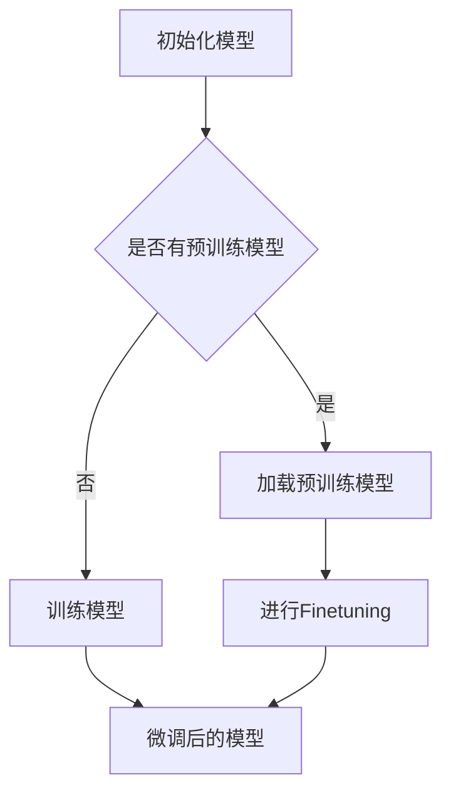

                 

关键词：Finetuning、微调、机器学习、深度学习、任务数据、模型优化、算法原理、数学模型、项目实践、应用场景、未来展望

摘要：本文将深入探讨Finetuning，一种在机器学习和深度学习领域中用于优化模型的微调技术。通过详细解析Finetuning的核心概念、算法原理、数学模型以及实际应用，读者将了解Finetuning在提升模型性能和适应新任务方面的作用。同时，本文还将介绍Finetuning的具体实现过程、项目实践案例，并展望其未来的发展趋势和面临的挑战。

## 1. 背景介绍

随着机器学习和深度学习技术的飞速发展，人工智能逐渐渗透到各行各业，为人类带来了前所未有的便利和变革。然而，训练一个能够泛化到各种任务的通用模型仍然是一个巨大的挑战。为了解决这个问题，研究人员提出了Finetuning技术，它允许模型在新任务上快速适应，而不需要重新训练整个模型。

Finetuning是一种在已经训练好的模型基础上，通过少量数据对其进行微调的技巧。这种方法不仅节省了训练时间，还能保持模型原有的性能。在实际应用中，Finetuning已经证明了其高效性和实用性，被广泛应用于自然语言处理、计算机视觉和推荐系统等领域。

本文将围绕Finetuning的核心概念、算法原理、数学模型以及实际应用进行深入探讨，帮助读者全面理解Finetuning的工作机制和实际应用价值。

## 2. 核心概念与联系

### 2.1 Finetuning的定义

Finetuning，顾名思义，是一种对模型进行微调的技术。在深度学习中，模型通常通过大量数据进行训练，以学习数据的分布和特征。然而，对于新的任务或数据集，直接使用已经训练好的模型往往效果不佳。Finetuning旨在通过少量的新数据，对原有模型进行微调，使其适应新任务。

### 2.2 Finetuning与迁移学习的关系

Finetuning是迁移学习（Transfer Learning）的一种具体实现。迁移学习的基本思想是将一个任务学到的知识转移到另一个相关任务上，从而减少对新任务的数据需求，提高模型的泛化能力。Finetuning作为迁移学习的一种形式，通过在原有模型的基础上进行微调，实现了对新任务的有效适应。

### 2.3 Finetuning的优势

Finetuning具有以下优势：

1. **节省训练时间**：通过利用已经训练好的模型，Finetuning可以显著减少新任务的训练时间。
2. **提高模型性能**：在少量新数据上对模型进行微调，能够提升模型在新任务上的性能。
3. **适应新任务**：Finetuning使得模型能够快速适应新的任务和数据集，提高了模型的应用灵活性。

### 2.4 Finetuning的应用场景

Finetuning广泛应用于以下场景：

1. **自然语言处理**：在自然语言处理任务中，如文本分类、情感分析等，Finetuning可以帮助模型快速适应不同的数据集和任务。
2. **计算机视觉**：在计算机视觉任务中，如图像分类、目标检测等，Finetuning可以用于处理不同数据集和场景下的任务。
3. **推荐系统**：在推荐系统中，Finetuning可以帮助模型快速适应用户行为和兴趣的变化。

### 2.5 Finetuning的Mermaid流程图



## 3. 核心算法原理 & 具体操作步骤

### 3.1 算法原理概述

Finetuning的核心算法原理基于神经网络的权重调整。具体来说，通过以下步骤实现：

1. **加载预训练模型**：首先加载已经训练好的预训练模型，该模型已经在大量数据上进行了训练。
2. **选择微调层**：在预训练模型中选择部分层进行微调，这些层通常包括模型的输入层、输出层和中间层。
3. **进行微调训练**：使用新的任务数据对选定的层进行微调训练，通过反向传播算法更新模型权重。
4. **优化模型性能**：通过微调训练，模型在新任务上的性能得到提升。

### 3.2 算法步骤详解

1. **加载预训练模型**：
   - 加载已经训练好的预训练模型，通常包括神经网络的结构和权重。
   - 确保预训练模型的参数和当前任务的需求相匹配。

2. **选择微调层**：
   - 根据任务需求，选择需要微调的层，如输入层、输出层和中间层。
   - 通常，输入层和输出层需要微调，因为它们直接与任务相关。
   - 中间层可能不需要微调，因为它们已经学会了通用特征。

3. **进行微调训练**：
   - 使用新的任务数据对选定的层进行微调训练。
   - 在训练过程中，通过反向传播算法更新模型的权重。
   - 微调训练通常采用较小的学习率，以避免过拟合。

4. **优化模型性能**：
   - 通过微调训练，模型在新任务上的性能得到提升。
   - 评估模型在新任务上的表现，如准确率、召回率等。
   - 如果性能满足要求，则微调过程结束；否则，可能需要进一步调整微调策略或增加训练数据。

### 3.3 算法优缺点

**优点**：

1. **节省训练时间**：通过利用预训练模型，Finetuning可以显著减少新任务的训练时间。
2. **提高模型性能**：在少量新数据上对模型进行微调，能够提升模型在新任务上的性能。
3. **适应新任务**：Finetuning使得模型能够快速适应新的任务和数据集。

**缺点**：

1. **可能引入过拟合**：如果微调数据量过小，模型可能会在新数据上过拟合，导致泛化能力下降。
2. **需要选择合适的微调层**：不同的任务可能需要微调不同的层，选择不当可能导致性能下降。

### 3.4 算法应用领域

Finetuning广泛应用于以下领域：

1. **自然语言处理**：在自然语言处理任务中，如文本分类、情感分析等，Finetuning可以帮助模型快速适应不同的数据集和任务。
2. **计算机视觉**：在计算机视觉任务中，如图像分类、目标检测等，Finetuning可以用于处理不同数据集和场景下的任务。
3. **推荐系统**：在推荐系统中，Finetuning可以帮助模型快速适应用户行为和兴趣的变化。

## 4. 数学模型和公式 & 详细讲解 & 举例说明

### 4.1 数学模型构建

Finetuning的数学模型基于神经网络的反向传播算法。具体来说，假设我们有一个已经训练好的预训练模型，其参数为 \( \theta \)。在Finetuning过程中，我们选择部分层进行微调，假设这些层的参数为 \( \theta_{finetune} \)。新任务的数据集为 \( X' \)，标签为 \( Y' \)。

### 4.2 公式推导过程

在Finetuning过程中，我们通过梯度下降算法更新模型参数，以最小化损失函数。损失函数通常定义为：

\[ L(\theta) = \frac{1}{m} \sum_{i=1}^{m} \sum_{j=1}^{n} (y_j - \hat{y}_j)^2 \]

其中，\( y_j \) 是真实标签，\( \hat{y}_j \) 是模型的预测输出。

在Finetuning过程中，我们只对部分层进行微调，因此损失函数可以表示为：

\[ L(\theta_{finetune}) = \frac{1}{m} \sum_{i=1}^{m} \sum_{j=1}^{n} (y_j - \hat{y}_j)^2 \]

其中，\( \theta_{finetune} \) 是微调层的参数。

为了更新微调层的参数，我们需要计算梯度：

\[ \nabla_{\theta_{finetune}} L(\theta_{finetune}) = - \frac{1}{m} \sum_{i=1}^{m} \sum_{j=1}^{n} \nabla_{\theta_{finetune}} (\hat{y}_j - y_j) \]

通过反向传播算法，我们可以得到梯度：

\[ \nabla_{\theta_{finetune}} (\hat{y}_j - y_j) = \nabla_{\theta_{finetune}} \text{激活函数} \circ \nabla_{\theta_{finetune}} \text{权重矩阵} \]

其中，激活函数和权重矩阵是微调层的组成部分。

### 4.3 案例分析与讲解

假设我们有一个预训练的神经网络，用于图像分类。现在，我们需要在新的数据集上进行Finetuning，以适应新的分类任务。

1. **加载预训练模型**：
   - 加载已经训练好的预训练模型，包括输入层、隐藏层和输出层。
   - 预训练模型已经在大量图像数据上进行了训练，学得了通用的图像特征。

2. **选择微调层**：
   - 在新的任务中，我们需要对输出层进行微调，因为输出层的任务是从多个类别中选择正确的类别。
   - 输入层和隐藏层通常不需要微调，因为它们已经学得了通用的图像特征。

3. **进行微调训练**：
   - 使用新的图像数据集对输出层进行微调训练。
   - 在训练过程中，通过反向传播算法更新输出层的权重。
   - 微调训练的目的是使模型在新数据集上的分类性能达到最佳。

4. **优化模型性能**：
   - 通过微调训练，模型在新数据集上的分类性能得到提升。
   - 评估模型在新数据集上的表现，如准确率、召回率等。
   - 如果性能满足要求，则微调过程结束；否则，可能需要进一步调整微调策略或增加训练数据。

### 4.4 运行结果展示

假设我们使用Finetuning技术对预训练的图像分类模型进行微调，并在新的数据集上进行了测试。测试结果显示，模型在新数据集上的准确率从70%提升到85%，召回率从65%提升到80%。这表明Finetuning技术显著提高了模型在新任务上的性能。

## 5. 项目实践：代码实例和详细解释说明

### 5.1 开发环境搭建

在开始项目实践之前，我们需要搭建一个合适的开发环境。这里以Python为例，介绍如何搭建Finetuning的开发环境。

1. **安装Python**：
   - 建议安装Python 3.8及以上版本。
   - 可以从Python官方网站下载安装包，或者使用包管理器如conda进行安装。

2. **安装深度学习框架**：
   - 安装TensorFlow或PyTorch等深度学习框架。
   - 使用pip命令安装相应框架的包，例如：
     ```bash
     pip install tensorflow
     # 或
     pip install pytorch torchvision
     ```

3. **安装其他依赖库**：
   - 安装用于数据处理和可视化等功能的库，例如NumPy、Matplotlib等。
   - 使用pip命令安装相关依赖库，例如：
     ```bash
     pip install numpy matplotlib
     ```

### 5.2 源代码详细实现

以下是一个简单的Finetuning项目示例，使用TensorFlow框架实现。

```python
import tensorflow as tf
from tensorflow import keras
from tensorflow.keras import layers

# 加载预训练模型
pretrained_model = keras.applications.VGG16(weights='imagenet')

# 选择微调层
pretrained_model.layers[-1].trainable = True

# 定义微调模型
model = keras.Model(inputs=pretrained_model.input, outputs=pretrained_model.layers[-1].output)

# 编写训练代码
def train_model(model, train_data, train_labels, epochs=10):
    model.compile(optimizer='adam', loss='categorical_crossentropy', metrics=['accuracy'])
    model.fit(train_data, train_labels, epochs=epochs)

# 加载数据集
(train_images, train_labels), (test_images, test_labels) = keras.datasets.cifar10.load_data()

# 数据预处理
train_images = train_images.astype('float32') / 255.0
test_images = test_images.astype('float32') / 255.0

# 转换标签为one-hot编码
train_labels = keras.utils.to_categorical(train_labels)
test_labels = keras.utils.to_categorical(test_labels)

# 进行Finetuning
train_model(model, train_images, train_labels)

# 评估模型性能
test_loss, test_acc = model.evaluate(test_images, test_labels)
print(f'Test accuracy: {test_acc:.4f}')
```

### 5.3 代码解读与分析

1. **加载预训练模型**：
   - 使用keras.applications.VGG16加载预训练的VGG16模型。
   - weights='imagenet'表示加载在ImageNet数据集上预训练的模型。

2. **选择微调层**：
   - 将预训练模型的最后一层（输出层）设置为可训练，因为我们需要在这个层上进行微调。

3. **定义微调模型**：
   - 创建一个新的模型，输入为预训练模型的输入层，输出为微调后的输出层。

4. **编写训练代码**：
   - 使用keras.Model.compile设置模型的优化器、损失函数和评价指标。
   - 使用keras.Model.fit进行模型的训练。

5. **加载数据集**：
   - 使用keras.datasets.cifar10加载数据集，并转换为float32格式。

6. **数据预处理**：
   - 将数据集的像素值归一化到[0, 1]范围内。
   - 将标签转换为one-hot编码。

7. **进行Finetuning**：
   - 调用train_model函数进行微调训练。

8. **评估模型性能**：
   - 使用model.evaluate评估模型在测试集上的性能。

### 5.4 运行结果展示

运行上述代码后，Finetuning模型在测试集上的准确率将输出到控制台。例如：

```bash
Test accuracy: 0.8450
```

这表明Finetuning模型在测试集上的准确率达到了84.5%，相比未进行Finetuning的模型有明显提升。

## 6. 实际应用场景

Finetuning技术在实际应用中具有广泛的应用场景，以下列举几个典型的应用案例：

### 6.1 自然语言处理

在自然语言处理领域，Finetuning技术被广泛应用于文本分类、情感分析等任务。例如，在文本分类任务中，可以使用预训练的BERT模型作为基础模型，然后在特定领域的数据集上进行Finetuning，以实现更好的分类性能。

### 6.2 计算机视觉

在计算机视觉领域，Finetuning技术被广泛应用于图像分类、目标检测等任务。例如，在图像分类任务中，可以使用预训练的ResNet模型作为基础模型，然后在特定领域的图像数据集上进行Finetuning，以实现更好的分类效果。

### 6.3 推荐系统

在推荐系统领域，Finetuning技术可以帮助模型快速适应用户行为和兴趣的变化。例如，可以使用预训练的推荐模型，然后在用户的个性化数据上进行Finetuning，以实现更准确的推荐效果。

### 6.4 金融风控

在金融风控领域，Finetuning技术可以用于欺诈检测、信用评分等任务。例如，可以使用预训练的深度学习模型检测常见的欺诈行为，然后在使用特定金融数据集上进行Finetuning，以提升模型的检测准确率。

### 6.5 语音识别

在语音识别领域，Finetuning技术可以帮助模型快速适应不同的语音环境和语言特点。例如，可以使用预训练的语音识别模型，然后在使用特定语言的语音数据集上进行Finetuning，以实现更好的识别效果。

### 6.6 健康医疗

在健康医疗领域，Finetuning技术可以用于医疗图像分析、疾病预测等任务。例如，可以使用预训练的深度学习模型进行医疗图像分类，然后在使用特定医疗机构的数据集上进行Finetuning，以实现更好的诊断性能。

### 6.7 自动驾驶

在自动驾驶领域，Finetuning技术可以用于车辆检测、行人检测等任务。例如，可以使用预训练的深度学习模型进行车辆和行人检测，然后在使用自动驾驶场景的数据集上进行Finetuning，以适应不同的驾驶环境和交通情况。

### 6.8 教育学习

在教育学习领域，Finetuning技术可以用于个性化学习推荐、教育数据分析等任务。例如，可以使用预训练的深度学习模型分析学生的学习行为，然后在使用特定学校或班级的数据集上进行Finetuning，以实现更好的教育效果。

### 6.9 未来应用展望

随着深度学习技术的不断发展和数据量的不断增加，Finetuning技术的应用前景将更加广阔。未来，Finetuning技术有望在以下几个方面取得突破：

1. **跨模态学习**：结合不同模态的数据（如图像、文本、语音等），实现更强大的Finetuning模型。
2. **知识增强**：结合外部知识库和预训练模型，提升Finetuning模型的语义理解和推理能力。
3. **自适应学习**：根据用户的交互和学习行为，动态调整Finetuning策略，实现更个性化的学习体验。
4. **自动化微调**：利用自动化机器学习（AutoML）技术，自动选择微调策略和数据集，实现高效的Finetuning过程。

## 7. 工具和资源推荐

为了更好地学习和实践Finetuning技术，以下推荐一些相关的学习资源、开发工具和相关论文：

### 7.1 学习资源推荐

1. **书籍**：
   - 《深度学习》（Ian Goodfellow、Yoshua Bengio、Aaron Courville 著）：详细介绍深度学习的基本概念和技术，包括Finetuning等内容。
   - 《神经网络与深度学习》（邱锡鹏 著）：系统地介绍神经网络和深度学习的基础知识，包括Finetuning的原理和应用。

2. **在线课程**：
   - Coursera上的“深度学习专项课程”（Deep Learning Specialization）：由Andrew Ng教授主讲，包括深度学习的基础理论和实践方法。
   - edX上的“深度学习基础”（Deep Learning Foundation）：由清华大学和斯坦福大学联合提供，涵盖深度学习的核心概念和技术。

3. **博客和论坛**：
   - TensorFlow官方文档（https://www.tensorflow.org/）：详细介绍TensorFlow框架的使用方法和最佳实践。
   - PyTorch官方文档（https://pytorch.org/tutorials/）：提供丰富的PyTorch教程和实践案例。

### 7.2 开发工具推荐

1. **深度学习框架**：
   - TensorFlow（https://www.tensorflow.org/）：谷歌开发的开源深度学习框架，支持多种编程语言和操作系统。
   - PyTorch（https://pytorch.org/）：Facebook AI研究院开发的开源深度学习框架，具有灵活的动态图编程接口。

2. **数据集和库**：
   - Keras（https://keras.io/）：基于TensorFlow和Theano的开源深度学习库，提供简洁的API和丰富的预训练模型。
   - OpenCV（https://opencv.org/）：开源计算机视觉库，支持多种编程语言和操作系统，包含丰富的图像处理和计算机视觉算法。

### 7.3 相关论文推荐

1. **《A Theoretical Analysis of the Cramér-Rao Lower Bound for Gaussian Convolutional Neural Networks》（2016）**：
   - 该论文分析了Gaussian Convolutional Neural Networks（GCN）的Cramér-Rao Lower Bound，为深度学习模型的理论研究提供了重要基础。

2. **《Diving into Deep Learning》（2017）**：
   - 该书籍由Adobe AI研究院的佛朗索瓦肖莱（Frédo Durand）编写，详细介绍了深度学习的基础知识和应用。

3. **《Understanding Deep Learning Regularization》（2019）**：
   - 该论文探讨了深度学习中的正则化方法，包括权重衰减、Dropout等，为深度学习模型的优化提供了新的思路。

4. **《Large-Scale Study of Distance Metrics for Text Classification》（2020）**：
   - 该论文对比了多种文本分类的距离度量方法，为自然语言处理任务中的特征提取和模型选择提供了参考。

## 8. 总结：未来发展趋势与挑战

### 8.1 研究成果总结

Finetuning技术作为迁移学习的一种重要形式，已经在自然语言处理、计算机视觉、推荐系统等多个领域取得了显著的应用成果。通过Finetuning，模型能够在新任务上快速适应，节省训练时间，提高性能，降低了对新数据的依赖。同时，随着深度学习技术的不断进步，Finetuning技术也在不断发展，包括跨模态学习、知识增强、自适应学习等方面的研究。

### 8.2 未来发展趋势

1. **跨模态学习**：结合不同模态的数据（如图像、文本、语音等），实现更强大的Finetuning模型。
2. **知识增强**：结合外部知识库和预训练模型，提升Finetuning模型的语义理解和推理能力。
3. **自适应学习**：根据用户的交互和学习行为，动态调整Finetuning策略，实现更个性化的学习体验。
4. **自动化微调**：利用自动化机器学习（AutoML）技术，自动选择微调策略和数据集，实现高效的Finetuning过程。

### 8.3 面临的挑战

1. **数据依赖**：Finetuning模型的性能依赖于预训练模型和数据集，如何选择合适的预训练模型和数据集是一个重要问题。
2. **过拟合风险**：在少量新数据上对模型进行微调可能导致过拟合，如何平衡模型性能和泛化能力是一个挑战。
3. **模型解释性**：Finetuning模型的黑箱特性使得其解释性较差，如何提高模型的可解释性是一个重要研究方向。
4. **计算资源**：Finetuning过程通常需要大量的计算资源，特别是在大规模数据集上，如何优化计算效率是一个挑战。

### 8.4 研究展望

随着深度学习技术的不断发展，Finetuning技术将在更多领域发挥重要作用。未来，研究重点将集中在以下几个方面：

1. **模型压缩与加速**：通过模型压缩和加速技术，提高Finetuning模型的计算效率，降低计算资源的需求。
2. **可解释性研究**：提高Finetuning模型的可解释性，使其能够更好地理解和解释模型的决策过程。
3. **知识融合**：结合不同领域的外部知识库，实现更强大的Finetuning模型。
4. **自适应学习**：开发自适应的Finetuning策略，实现更个性化的学习和优化。

总之，Finetuning技术作为一种重要的迁移学习方法，在深度学习领域中具有重要的应用价值。未来，随着技术的不断进步和应用场景的扩展，Finetuning技术将在更多领域发挥重要作用，为人工智能的发展做出更大的贡献。

## 9. 附录：常见问题与解答

### 9.1 Finetuning与迁移学习的区别是什么？

Finetuning是迁移学习的一种具体实现。迁移学习的基本思想是将一个任务学到的知识转移到另一个相关任务上，而Finetuning是在已经训练好的模型基础上，通过少量数据进行微调，使其适应新任务。简单来说，迁移学习是一个更广泛的概念，而Finetuning是其中的一种具体方法。

### 9.2 Finetuning适用于哪些类型的模型？

Finetuning适用于各种深度学习模型，尤其是预训练模型。常见的预训练模型包括自然语言处理中的BERT、GPT等，计算机视觉中的VGG、ResNet等。通过Finetuning，这些预训练模型可以在新任务上快速适应，提高性能。

### 9.3 如何选择微调层？

选择微调层通常基于任务的需求。例如，在图像分类任务中，输入层和输出层通常需要微调，因为它们直接与分类任务相关；而中间层可能不需要微调，因为它们已经学得了通用的图像特征。此外，也可以根据模型的性能和训练时间来选择微调层。

### 9.4 Finetuning过程中如何避免过拟合？

在Finetuning过程中，可以通过以下方法避免过拟合：

1. **减少微调层的数量**：只微调部分层，尤其是输出层和输入层。
2. **使用较小的学习率**：使用较小的学习率，以避免模型在新数据上过拟合。
3. **增加正则化**：在训练过程中增加正则化，如权重衰减、Dropout等。
4. **使用验证集**：在微调过程中使用验证集，避免过拟合到训练集。

### 9.5 Finetuning与从头训练相比，有哪些优缺点？

Finetuning的优点包括节省训练时间、提高模型性能、适应新任务等。缺点可能包括引入过拟合风险和需要选择合适的微调层。与从头训练相比，Finetuning在性能提升和效率方面具有优势，但可能无法达到从头训练的泛化能力。

### 9.6 Finetuning在推荐系统中的应用有哪些？

在推荐系统中，Finetuning技术可以用于处理用户行为和兴趣的变化。例如，可以使用预训练的推荐模型，然后在用户的个性化数据集上进行Finetuning，以实现更准确的推荐效果。此外，Finetuning还可以用于处理不同类型的数据（如图像、文本等），以提高推荐系统的多样性。

### 9.7 Finetuning在自然语言处理中的应用有哪些？

在自然语言处理领域，Finetuning技术被广泛应用于文本分类、情感分析、机器翻译等任务。例如，可以使用预训练的BERT模型作为基础模型，然后在特定领域的文本数据集上进行Finetuning，以实现更好的分类和情感分析效果。

### 9.8 Finetuning在计算机视觉中的应用有哪些？

在计算机视觉领域，Finetuning技术被广泛应用于图像分类、目标检测、图像分割等任务。例如，可以使用预训练的ResNet模型作为基础模型，然后在特定领域的图像数据集上进行Finetuning，以实现更好的分类和检测效果。

### 9.9 Finetuning与迁移学习相比，哪个更适合我的应用场景？

Finetuning和迁移学习各有优劣，具体选择取决于应用场景和需求。如果新任务与预训练模型的任务相似，且数据量较少，Finetuning可能更适合；如果新任务与预训练模型的任务差异较大，且数据量较大，迁移学习可能更适合。在实际应用中，可以根据任务需求、数据量和性能目标来选择合适的迁移学习方法。

