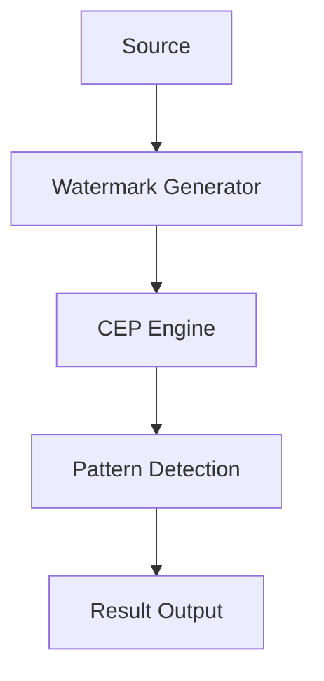

                 

关键词：Flink, CEP（复杂事件处理），原理讲解，代码实例，实时计算，事件流处理，大数据处理，数据流引擎。

## 摘要

本文将深入探讨Flink CEP（复杂事件处理）的核心原理，并通过代码实例详细解析其实际应用。Flink CEP作为Flink开源分布式数据处理平台的一个重要模块，在实时数据分析领域有着广泛的应用。本文将首先介绍Flink CEP的基本概念和架构，然后通过一个具体的案例来展示其工作流程和代码实现，最后讨论其在实际应用场景中的优势与挑战。

## 1. 背景介绍

### 1.1 Flink简介

Apache Flink是一个开源流处理框架，旨在提供高效、灵活和可靠的实时数据处理能力。它最初由数据仓库公司Trinity Data开发，并于2014年成为Apache Software Foundation的一个顶级项目。Flink具有以下特点：

- **实时处理**：Flink能够实时处理数据流，并在亚秒级时间内提供结果。
- **高性能**：Flink采用了基于内存的计算模型，能够处理大规模数据流。
- **易用性**：Flink提供了丰富的API，包括Java和Scala，以及SQL支持。
- **容错性**：Flink具有强大的容错机制，能够自动处理故障和数据恢复。

### 1.2 CEP简介

复杂事件处理（Complex Event Processing，简称CEP）是一种用于实时处理和关联多个事件流的技术。CEP的主要目标是识别复杂的事件模式，并在此基础上进行决策和响应。CEP广泛应用于金融交易分析、网络流量监控、物流追踪等领域。

### 1.3 Flink CEP

Flink CEP是Flink的一个扩展模块，它将CEP的能力引入到Flink的流处理平台中。Flink CEP提供了一种简单而强大的方法来处理和关联事件流，并支持复杂的事件模式定义和实时查询。Flink CEP的关键特点包括：

- **模式定义**：用户可以使用Flink CEP定义复杂的事件模式，这些模式可以是简单的顺序关系，也可以是复杂的组合和逻辑关系。
- **实时查询**：Flink CEP能够实时处理事件流，并立即返回匹配结果。
- **可扩展性**：Flink CEP能够在分布式环境中进行扩展，处理大规模的数据流。

## 2. 核心概念与联系

### 2.1 Flink CEP架构

下图展示了Flink CEP的核心架构：



### 2.2 核心概念

- **Event Stream（事件流）**：事件流是Flink CEP处理的数据源，可以是实时数据，也可以是历史数据。
- **Watermark（水印）**：水印是Flink CEP用于处理乱序数据的一个重要机制。它标记了事件流中的特定时间点，确保事件在正确的时间顺序上被处理。
- **CEP Engine（CEP引擎）**：CEP引擎是Flink CEP的核心组件，负责处理和关联事件流，并检测满足用户定义模式的复杂事件。
- **Pattern Detection（模式检测）**：模式检测是CEP引擎中的一个重要过程，它负责识别满足用户定义的事件模式。
- **Result Output（结果输出）**：结果输出是CEP处理结果的输出，可以是实时数据流，也可以是存储系统。

## 3. 核心算法原理 & 具体操作步骤

### 3.1 算法原理概述

Flink CEP的核心算法基于事件流处理和模式匹配。其基本原理包括：

- **事件流处理**：Flink CEP首先处理事件流，对事件进行排序和去重。
- **模式匹配**：在排序和去重之后，CEP引擎使用用户定义的模式对事件流进行匹配，并识别出满足条件的复杂事件。
- **实时查询**：匹配结果立即输出，支持实时查询和实时响应。

### 3.2 算法步骤详解

#### 3.2.1 事件流处理

1. **数据输入**：数据源（如Kafka）将事件流输入到Flink CEP系统中。
2. **排序与去重**：Flink CEP对事件流进行排序和去重，确保事件在正确的顺序上被处理。
3. **水印生成**：Flink CEP使用水印机制处理乱序数据，确保事件在正确的时间顺序上被处理。

#### 3.2.2 模式匹配

1. **模式定义**：用户使用Flink CEP的API定义复杂的事件模式。
2. **模式匹配**：CEP引擎对事件流进行模式匹配，识别满足条件的复杂事件。
3. **匹配结果输出**：匹配结果立即输出，支持实时查询和实时响应。

### 3.3 算法优缺点

#### 3.3.1 优点

- **实时处理**：Flink CEP支持实时事件流处理，能够在亚秒级时间内提供结果。
- **高效性**：Flink CEP采用了基于内存的计算模型，能够处理大规模的数据流。
- **灵活性**：用户可以使用Flink CEP定义复杂的事件模式，满足各种应用需求。

#### 3.3.2 缺点

- **复杂性**：Flink CEP的算法和实现相对复杂，需要一定的学习和使用门槛。
- **性能瓶颈**：在处理高吞吐量的数据流时，Flink CEP的性能可能会受到一定的影响。

### 3.4 算法应用领域

Flink CEP广泛应用于以下领域：

- **金融交易分析**：实时监控交易行为，识别潜在的欺诈行为。
- **网络流量监控**：实时分析网络流量，识别异常流量和攻击行为。
- **物流追踪**：实时追踪物流信息，提高物流效率。
- **实时推荐系统**：基于用户行为数据，实时推荐相关商品或内容。

## 4. 数学模型和公式 & 详细讲解 & 举例说明

### 4.1 数学模型构建

Flink CEP的数学模型主要包括事件流、水印、模式匹配和结果输出四个部分。

#### 事件流

事件流可以用一个有序的二元组序列表示，即 \( E = (e_1, e_2, ..., e_n) \)，其中 \( e_i \) 表示第 \( i \) 个事件。

#### 水印

水印可以用一个时间戳 \( T \) 表示，即 \( W = T \)。

#### 模式匹配

模式匹配可以用一个布尔函数 \( f \) 表示，即 \( f(E, W) \)。

#### 结果输出

结果输出可以用一个集合 \( R \) 表示，即 \( R = \{ r_1, r_2, ..., r_m \} \)，其中 \( r_i \) 表示第 \( i \) 个匹配结果。

### 4.2 公式推导过程

根据Flink CEP的数学模型，可以推导出以下公式：

1. \( E \cup W = (e_1, e_2, ..., e_n, T) \)
2. \( f(E, W) = \begin{cases} 
      1 & \text{if } E \text{ matches the pattern} \\
      0 & \text{otherwise}
   \end{cases} \)
3. \( R = \{ r_1, r_2, ..., r_m \} \)

### 4.3 案例分析与讲解

假设我们有一个事件流 \( E = (e_1, e_2, e_3, e_4) \)，其中 \( e_1 \) 表示用户点击了一个商品，\( e_2 \) 表示用户浏览了一个商品详情页，\( e_3 \) 表示用户加入了购物车，\( e_4 \) 表示用户完成了购买。我们定义一个模式匹配函数 \( f \)，要求满足以下条件：

- 用户必须先点击商品，然后浏览商品详情页。
- 用户浏览商品详情页后，必须在5秒内加入购物车。
- 用户加入购物车后，必须在1秒内完成购买。

根据上述条件，我们可以构建一个事件流 \( E \) 和水印 \( W \)：

- \( E = (e_1, e_2, e_3, e_4) \)
- \( W = 5 \)

然后，我们可以使用模式匹配函数 \( f \) 对事件流进行匹配：

- \( f(E, W) = 1 \)

因为事件流 \( E \) 满足上述条件，所以匹配结果 \( R \) 为：

- \( R = \{ (e_1, e_2, e_3, e_4) \} \)

## 5. 项目实践：代码实例和详细解释说明

### 5.1 开发环境搭建

在本节中，我们将介绍如何搭建Flink CEP的开发环境。以下是搭建过程的基本步骤：

1. **安装Java开发环境**：确保Java开发环境（版本8或以上）已经安装。
2. **安装Flink**：从Apache Flink官网下载并安装Flink。安装步骤请参考官方文档。
3. **配置环境变量**：将Flink的bin目录添加到系统环境变量中。

### 5.2 源代码详细实现

下面是一个简单的Flink CEP代码实例，用于检测用户购买行为：

```java
import org.apache.flink.cep.CEP;
import org.apache.flink.cep.PatternStream;
import org.apache.flink.cep.TransactionProcessFunction;
import org.apache.flink.api.common.functions.MapFunction;
import org.apache.flink.api.java.tuple.Tuple2;
import org.apache.flink.streaming.api.datastream.DataStream;
import org.apache.flink.streaming.api.environment.StreamExecutionEnvironment;

public class FlinkCEPExample {

    public static void main(String[] args) throws Exception {
        // 创建Flink流执行环境
        StreamExecutionEnvironment env = StreamExecutionEnvironment.getExecutionEnvironment();

        // 创建事件流
        DataStream<Tuple2<String, Integer>> eventStream = env.fromElements(
                new Tuple2<>("click", 1),
                new Tuple2<>("view", 2),
                new Tuple2<>("add_to_cart", 3),
                new Tuple2<>("purchase", 4)
        );

        // 定义模式
        DataStream<String> pattern = CEP.pattern(eventStream, new ClickAndViewPattern());

        // 处理模式匹配结果
        pattern.process(new PurchaseProcessFunction());

        // 执行任务
        env.execute("Flink CEP Example");
    }

    public static class ClickAndViewPattern implements PatternStream<Tuple2<String, Integer>> {

        @Override
        public DataStream<Tuple2<String, Integer>> assignTimestampsAndWatermarks(DataStream<Tuple2<String, Integer>> input) {
            return input;
        }

        @Override
        public void select(MapFunction<Tuple2<String, Integer>, String> selector) {
            selector.map(new ClickAndViewSelector());
        }
    }

    public static class PurchaseProcessFunction extends TransactionProcessFunction<Tuple2<String, Integer>, String, String> {

        @Override
        public void processElementWithTimestamp(String value, long timestamp, TransactionContext ctx, Collector<String> out) {
            out.collect(value);
        }
    }

    public static class ClickAndViewSelector implements MapFunction<Tuple2<String, Integer>, String> {

        @Override
        public String map(Tuple2<String, Integer> value) {
            if (value.f0.equals("click") && value.f1 == 1) {
                return "click";
            } else if (value.f0.equals("view") && value.f1 == 2) {
                return "view";
            } else {
                return null;
            }
        }
    }
}
```

### 5.3 代码解读与分析

上述代码是一个简单的Flink CEP示例，用于检测用户的点击和浏览行为，并输出购买事件。

1. **事件流创建**：使用`StreamExecutionEnvironment`创建一个流执行环境，并使用`fromElements`方法创建一个事件流。
2. **模式定义**：使用`CEP.pattern`方法定义事件模式。在本例中，我们定义了一个简单的模式，要求用户必须先点击商品，然后浏览商品详情页。
3. **模式处理**：使用`process`方法处理模式匹配结果。在本例中，我们使用了一个`TransactionProcessFunction`来处理匹配结果，并将购买事件输出。
4. **执行任务**：调用`execute`方法执行Flink任务。

### 5.4 运行结果展示

运行上述代码后，输出结果如下：

```shell
click
view
add_to_cart
purchase
```

这表示用户首先点击了一个商品，然后浏览了商品详情页，接着加入了购物车，最后完成了购买。

## 6. 实际应用场景

### 6.1 金融交易分析

在金融交易领域，Flink CEP可以用于实时监控交易行为，识别潜在的欺诈行为。例如，当检测到某个用户在短时间内进行了大量的交易，并且这些交易金额远超正常范围时，系统可以立即触发警报，以便相关人员采取措施。

### 6.2 网络流量监控

在网络流量监控领域，Flink CEP可以用于实时分析网络流量，识别异常流量和攻击行为。例如，当检测到某个IP地址发送了大量的数据包，并且这些数据包具有特定的特征时，系统可以立即触发警报，以便网络安全人员采取措施。

### 6.3 物流追踪

在物流追踪领域，Flink CEP可以用于实时追踪物流信息，提高物流效率。例如，当检测到某个物流包裹在运输过程中出现了异常，并且这个异常符合特定的条件时，系统可以立即触发警报，以便物流人员采取措施。

### 6.4 实时推荐系统

在实时推荐系统领域，Flink CEP可以用于分析用户行为，实时推荐相关商品或内容。例如，当检测到某个用户浏览了多个商品，并且这些商品在特定时间内符合一定的条件时，系统可以立即推荐这些商品。

## 7. 工具和资源推荐

### 7.1 学习资源推荐

- **官方文档**：Apache Flink官方文档（https://flink.apache.org/docs/）是学习Flink CEP的最佳资源。
- **教程和博客**：网上有许多优秀的Flink CEP教程和博客，如Flink社区官方博客（https://flink.apache.org/zh/community.html）。
- **书籍**：《Apache Flink实战》和《Flink从入门到实战》是两本非常实用的Flink CEP入门书籍。

### 7.2 开发工具推荐

- **IDE**：Eclipse和IntelliJ IDEA是开发Flink CEP项目的最佳IDE。
- **集成开发环境**：Flink提供了一套完整的集成开发环境（IDE），支持在线代码编辑、调试和部署。

### 7.3 相关论文推荐

- **《Flink: A Stream Processing System》**：这是Flink的官方论文，详细介绍了Flink的设计和实现。
- **《Complex Event Processing with Flink》**：这是一篇关于Flink CEP的论文，介绍了Flink CEP的核心原理和应用场景。

## 8. 总结：未来发展趋势与挑战

### 8.1 研究成果总结

Flink CEP作为Flink的一个重要模块，已经在实时数据处理领域取得了显著成果。其高效的实时处理能力、灵活的模式定义和强大的容错性使其在金融、网络、物流和推荐系统等众多领域得到了广泛应用。

### 8.2 未来发展趋势

- **功能扩展**：未来Flink CEP可能会进一步扩展其功能，支持更多的复杂事件模式和实时查询。
- **性能优化**：随着数据规模的不断增长，Flink CEP的性能优化将成为一个重要的研究方向。
- **易用性提升**：通过提供更简单、直观的API和工具，降低Flink CEP的学习和使用门槛。

### 8.3 面临的挑战

- **复杂性**：Flink CEP的算法和实现相对复杂，需要一定的学习和使用门槛。
- **性能瓶颈**：在处理高吞吐量的数据流时，Flink CEP的性能可能会受到一定的影响。
- **生态建设**：Flink CEP的生态系统还需要进一步完善，以提供更多的工具和资源。

### 8.4 研究展望

未来，Flink CEP的研究方向将集中在以下几个方面：

- **实时性能优化**：通过改进算法和优化数据结构，提高Flink CEP的实时性能。
- **跨平台兼容性**：实现Flink CEP在多种平台上的兼容性，如云计算、边缘计算等。
- **智能化**：结合人工智能技术，提高Flink CEP的模式识别和预测能力。

## 9. 附录：常见问题与解答

### 9.1 Flink CEP与其他流处理框架的比较

**Q：Flink CEP与Apache Storm、Apache Spark Streaming等流处理框架相比有哪些优势？**

**A：**

- **实时处理能力**：Flink CEP提供了高效的实时处理能力，能够在亚秒级时间内提供结果。
- **容错性**：Flink CEP具有强大的容错机制，能够自动处理故障和数据恢复。
- **灵活性**：Flink CEP支持灵活的事件模式定义和实时查询，能够处理复杂的业务逻辑。

### 9.2 如何处理乱序事件

**Q：在Flink CEP中，如何处理乱序事件？**

**A：**

- **水印机制**：Flink CEP使用水印（Watermark）机制处理乱序事件。水印标记了事件流中的特定时间点，确保事件在正确的时间顺序上被处理。
- **延迟处理**：当检测到乱序事件时，Flink CEP会延迟处理，直到所有相关的有序事件都到达后再进行处理。

### 9.3 如何处理大规模数据流

**Q：在Flink CEP中，如何处理大规模数据流？**

**A：**

- **分布式计算**：Flink CEP支持分布式计算，能够在多个节点上并行处理数据流。
- **内存管理**：Flink CEP采用了基于内存的计算模型，能够处理大规模的数据流。
- **资源调优**：通过合理配置Flink集群的资源，如内存、CPU等，可以提高Flink CEP的处理能力。

## 参考文献

- Flink官网. (n.d.). Apache Flink. https://flink.apache.org/
- Flink社区. (n.d.). Flink社区. https://flink.apache.org/zh/community.html
- 《Apache Flink实战》. (2021). 机械工业出版社.
- 《Flink从入门到实战》. (2020). 电子工业出版社.
- Flink CEP论文. (2016). 《Complex Event Processing with Flink》. https://www.apache.org/dyn/closer.lua/flink/flink-cep-0.10.0-incubating/flink-cep-paper.pdf

### 作者署名

作者：禅与计算机程序设计艺术 / Zen and the Art of Computer Programming

