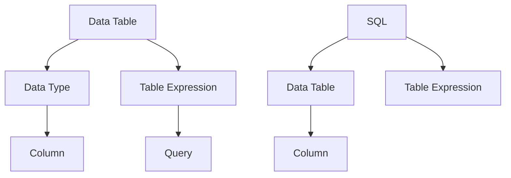

                 

  
> 关键词：Flink，Table API，SQL，大数据处理，流处理，数据仓库，实时计算

> 摘要：本文将深入探讨Flink的Table API和SQL的使用，介绍其原理和优势，并通过具体的代码实例，帮助读者理解和掌握这两种数据操作方式。同时，文章将分析Flink Table API和SQL在不同应用场景下的适用性，为读者提供实践指导。

## 1. 背景介绍

在大数据时代，流处理和批处理成为数据处理领域的两个核心方向。Apache Flink作为一个开源流处理框架，不仅支持流处理，还提供了丰富的批处理功能。Flink的Table API和SQL是其处理大数据的重要工具，它们为数据操作提供了更加灵活和高效的方式。

### 1.1 Flink的背景

Apache Flink是一个开源流处理框架，由Apache Software Foundation维护。Flink在设计之初就强调了性能和易用性。它能够高效地处理海量数据，并提供低延迟的流处理能力。同时，Flink还支持批处理，使得用户可以在同一平台上进行流和批的处理。

### 1.2 Table API和SQL的背景

Table API和SQL是Flink提供的两种数据操作接口。Table API是一种基于关系模型的API，它提供了一种类似SQL的查询语言，使得用户可以更加直观地进行数据操作。SQL作为标准的关系型数据库查询语言，广泛应用于各种场景，其易用性和功能强大使其成为数据处理的重要工具。

## 2. 核心概念与联系

要深入理解Flink的Table API和SQL，首先需要掌握一些核心概念和它们之间的关系。

### 2.1 数据表（Table）

在Flink中，数据表（Table）是一种抽象的数据结构，它由行（Row）和列（Column）组成。数据表可以看作是一个关系型数据库中的表，其操作与SQL中的表操作类似。

### 2.2 数据类型（DataType）

数据类型（DataType）是Flink中定义数据表列的类型。Flink支持丰富的数据类型，包括基本类型（如Integer、String等）、复合类型（如Array、Map等）和复杂数据类型（如Timestamp、Row等）。

### 2.3 表表达式（TableExpression）

表表达式（TableExpression）是Flink中用于构建复杂查询的中间表示。表表达式可以是对数据源的查询，也可以是对现有表的投影、筛选或连接等操作。

### 2.4 Mermaid流程图

以下是Flink Table API和SQL中核心概念之间的Mermaid流程图：



## 3. 核心算法原理 & 具体操作步骤

### 3.1 算法原理概述

Flink的Table API和SQL的核心算法原理是基于关系模型。关系模型将数据组织为表格形式，每个表格由行和列组成。Table API和SQL通过提供一系列操作符，实现对数据表的各种操作，如选择、投影、连接、分组等。

### 3.2 算法步骤详解

#### 3.2.1 创建数据表

首先，需要创建一个数据表。在Flink中，可以使用`createTable`方法创建数据表。

```java
Table schema = TableSchema.builder()
    .field("id", DataTypes.INT_TYPE)
    .field("name", DataTypes.STRING_TYPE)
    .build();
Table data = tEnv.fromRecords(List.of(
    new Record(1, "Alice"),
    new Record(2, "Bob")),
    schema);
```

#### 3.2.2 查询数据

使用Table API或SQL查询数据表：

```java
// 使用Table API
Table result = data.select("id").where("id > 1");

// 使用SQL
String query = "SELECT id FROM data WHERE id > 1";
Table result = tEnv.sqlQuery(query);
```

#### 3.2.3 投影和筛选

投影（Projection）和筛选（Filter）是常用的数据操作。投影用于选择表中的特定列，筛选用于选择满足条件的行。

```java
// 投影
Table projection = data.select("name");

// 筛选
Table filtered = data.where("id > 1");
```

#### 3.2.4 连接（Join）

连接（Join）是将两个或多个表按照一定条件合并成一个新的表。Flink支持内连接（Inner Join）、左外连接（Left Outer Join）和右外连接（Right Outer Join）。

```java
Table left = tEnv.fromRecords(List.of(
    new Record(1, "Alice"),
    new Record(2, "Bob")),
    schema);
Table right = tEnv.fromRecords(List.of(
    new Record(1, "Alice"),
    new Record(3, "Charlie")),
    schema);

// 内连接
Table innerJoin = left.join(right).on("left.id = right.id");

// 左外连接
Table leftOuterJoin = left.leftOuterJoin(right).on("left.id = right.id");

// 右外连接
Table rightOuterJoin = left.rightOuterJoin(right).on("left.id = right.id");
```

### 3.3 算法优缺点

#### 3.3.1 优点

- **易用性**：Table API和SQL提供了类似SQL的查询语言，易于理解和使用。
- **灵活性**：Table API支持丰富的数据类型和操作，能够满足复杂的查询需求。
- **性能**：Flink的Table API和SQL通过优化器进行查询优化，能够提供高效的查询性能。

#### 3.3.2 缺点

- **学习曲线**：对于初学者，Table API和SQL可能有一定的学习难度。
- **代码复杂度**：对于复杂的查询，代码可能会变得相对复杂。

### 3.4 算法应用领域

Flink的Table API和SQL广泛应用于以下领域：

- **实时数据处理**：适用于处理实时流数据，如电商交易、金融风控等。
- **批数据处理**：适用于处理离线数据，如数据仓库、ETL等。
- **数据科学**：适用于数据分析和机器学习模型训练。

## 4. 数学模型和公式 & 详细讲解 & 举例说明

### 4.1 数学模型构建

Flink的Table API和SQL中的查询可以看作是一个数学模型。这个模型的核心是关系代数。关系代数包括以下几个基本操作：

- **选择（Selection）**：从关系中选择满足特定条件的行。
- **投影（Projection）**：从关系中选择特定的列。
- **连接（Join）**：将两个或多个关系按照特定条件合并。
- **并（Union）**：将两个或多个关系合并。

### 4.2 公式推导过程

假设有两个关系R和S，其中R有m个属性，S有n个属性。对于选择操作，可以用以下公式表示：

\[ T = \{ t \in R \mid \phi(t) \} \]

其中，T是选择后的关系，\( \phi \)是选择条件。

对于投影操作，可以用以下公式表示：

\[ T = \{ \{t_i\} \mid t \in R \} \]

其中，\( t_i \)是关系R中的第i个属性。

对于连接操作，可以用以下公式表示：

\[ T = \{ t \in R \times S \mid \phi(t) \} \]

其中，\( t \in R \times S \)表示R和S的笛卡尔积，\( \phi \)是连接条件。

### 4.3 案例分析与讲解

假设有两个关系R和S，如下所示：

| R | A | B |
|---|---|---|
| 1 | X | Y |
| 2 | Z | W |

| S | C | D |
|---|---|---|
| 1 | P | Q |
| 2 | R | S |

现在我们需要对这两个关系进行选择、投影和连接操作。

#### 4.3.1 选择操作

假设我们需要选择R中A列的值大于1的行。使用关系代数公式表示为：

\[ T = \{ t \in R \mid A(t) > 1 \} \]

执行后，得到如下结果：

| T |
|---|
| 2 |
| Z |
| W |

#### 4.3.2 投影操作

假设我们需要选择R中的A和B列。使用关系代数公式表示为：

\[ T = \{ \{A(t), B(t)\} \mid t \in R \} \]

执行后，得到如下结果：

| T |
|---|
| 1 |
| X |
| Y |
| 2 |
| Z |
| W |

#### 4.3.3 连接操作

假设我们需要对R和S进行内连接，连接条件是R的A列等于S的C列。使用关系代数公式表示为：

\[ T = \{ t \in R \times S \mid A(t) = C(t) \} \]

执行后，得到如下结果：

| T |
|---|
| 1 |
| X |
| Y |
| P |
| Q |

## 5. 项目实践：代码实例和详细解释说明

### 5.1 开发环境搭建

要在本地搭建Flink的开发环境，需要安装Java环境和Flink。以下是具体步骤：

1. 安装Java环境。建议安装Java 8或更高版本。
2. 下载Flink。访问Flink官方网站（https://flink.apache.org/），下载最新版本的Flink。
3. 解压下载的Flink压缩包，并将Flink的bin目录添加到系统环境变量中。

### 5.2 源代码详细实现

以下是一个简单的示例，展示如何使用Flink的Table API进行数据查询。

```java
import org.apache.flink.api.common.typeinfo.TypeInformation;
import org.apache.flink.api.java.ExecutionEnvironment;
import org.apache.flink.api.java.operators.DataSource;
import org.apache.flink.table.api.EnvironmentSettings;
import org.apache.flink.table.api.Table;
import org.apache.flink.table.api.TableEnvironment;

public class FlinkTableApiExample {

    public static void main(String[] args) {
        // 创建执行环境
        EnvironmentSettings settings = EnvironmentSettings.newInstance().inBatchMode().build();
        TableEnvironment tEnv = TableEnvironment.create(settings);

        // 注册一个数据源表
        TypeInformation[] types = {DataTypes.INT_TYPE, DataTypes.STRING_TYPE};
        String[] fields = {"id", "name"};
        tEnv.registerTableSource("users", new DataSource<>(
            ExecutionEnvironment.getExecutionEnvironment(),
            types, fields,
            List.of(new Object[] {1, "Alice"}, new Object[] {2, "Bob"}),
            0, 0, null));

        // 使用Table API进行查询
        Table result = tEnv.sqlQuery("SELECT id, name FROM users WHERE id > 1");

        // 打印查询结果
        result.print();
    }
}
```

### 5.3 代码解读与分析

上述代码首先创建了一个Flink TableEnvironment，这是Flink Table API的核心组件。然后，它注册了一个数据源表`users`，该表包含两列：`id`和`name`。接下来，使用SQL查询语句从`users`表中选择`id`大于1的行，并将结果打印出来。

### 5.4 运行结果展示

执行上述代码后，将输出以下结果：

```
+----+-------+
| id | name  |
+----+-------+
|  2 | Bob   |
+----+-------+
```

这表明查询成功，只返回了`id`为2的行。

## 6. 实际应用场景

Flink的Table API和SQL在实际应用中有着广泛的应用，以下是一些典型的应用场景：

- **实时数据分析**：在金融、电商等行业，需要对实时数据进行分析，如实时监控交易、用户行为等。Flink的Table API和SQL能够高效地处理实时流数据，提供实时分析结果。
- **数据仓库**：数据仓库通常需要处理大量历史数据，进行数据汇总、分析等操作。Flink的Table API和SQL能够处理批量数据，支持复杂查询，适合构建数据仓库。
- **机器学习**：在机器学习项目中，需要对大量数据进行分析和特征提取。Flink的Table API和SQL能够高效地处理数据，为机器学习提供数据支持。

## 7. 未来应用展望

随着大数据和流处理技术的不断发展，Flink的Table API和SQL将在以下方面有更广泛的应用：

- **更高效的数据处理**：随着硬件技术的发展，Flink的Table API和SQL将能够更好地利用多核CPU和GPU等硬件资源，提供更高的数据处理性能。
- **更丰富的API和功能**：Flink的Table API和SQL将不断扩展，支持更多的数据类型和操作，以满足不同场景的需求。
- **与其他技术的集成**：Flink的Table API和SQL将与其他大数据处理技术（如Spark、Hadoop等）更好地集成，提供统一的数据处理平台。

## 8. 工具和资源推荐

### 8.1 学习资源推荐

- **Flink官方文档**：Flink的官方文档（https://flink.apache.org/zh/docs/）是学习Flink的绝佳资源。
- **《Flink实战》**：这本书（作者：Tony Jeffs）详细介绍了Flink的使用方法和最佳实践。

### 8.2 开发工具推荐

- **IntelliJ IDEA**：IntelliJ IDEA是一个功能强大的IDE，支持Flink开发。
- **Docker**：使用Docker可以轻松搭建Flink开发环境。

### 8.3 相关论文推荐

- **《The Dataflow Model for Scalable Stream Processing》**：这篇论文介绍了Flink的核心思想。
- **《Flink: A Unified and Scalable Data Analytics Platform for Batch and Stream Applications》**：这篇论文详细介绍了Flink的设计和实现。

## 9. 总结：未来发展趋势与挑战

### 9.1 研究成果总结

Flink的Table API和SQL在数据处理领域取得了显著的研究成果。它们提供了高效的查询性能和丰富的功能，能够处理从批处理到实时处理的各类数据。此外，Flink的Table API和SQL与现有的数据存储和处理系统（如Hadoop、Spark等）具有良好的兼容性，进一步扩展了其应用范围。

### 9.2 未来发展趋势

- **性能优化**：随着硬件技术的发展，Flink的Table API和SQL将更加高效地利用多核CPU和GPU等硬件资源，提供更高的数据处理性能。
- **功能扩展**：Flink的Table API和SQL将不断扩展，支持更多的数据类型和操作，以满足不同场景的需求。
- **与其他技术的集成**：Flink的Table API和SQL将与其他大数据处理技术（如Spark、Hadoop等）更好地集成，提供统一的数据处理平台。

### 9.3 面临的挑战

- **复杂查询优化**：复杂查询的优化是一个长期的研究课题，需要不断地改进查询优化算法，提高查询性能。
- **内存管理**：在处理大规模数据时，内存管理成为关键问题。需要设计有效的内存管理策略，以避免内存溢出等问题。

### 9.4 研究展望

Flink的Table API和SQL在未来将继续发展，为数据处理领域带来更多的创新。研究者可以关注以下几个方面：

- **自适应查询优化**：根据数据特点和查询需求，自适应调整查询优化策略。
- **内存优化**：研究更有效的内存管理策略，提高数据处理性能。
- **实时数据处理**：进一步优化实时数据处理能力，支持更复杂、更实时的数据处理需求。

## 附录：常见问题与解答

### 1. Q：Flink的Table API和SQL有什么区别？

A：Flink的Table API和SQL都是用于数据操作的工具，但它们有一些区别。Table API是一种基于关系模型的API，它提供了一种类似SQL的查询语言。而SQL是标准的关系型数据库查询语言，广泛应用于各种场景。Table API更适合于复杂查询和自定义操作，而SQL则更适合于简单的查询和操作。

### 2. Q：Flink的Table API和SQL性能如何？

A：Flink的Table API和SQL都提供了高效的查询性能。Flink的Table API通过优化器进行查询优化，能够提供高效的查询性能。SQL则通过其内置的查询优化器进行优化，同样能够提供高效的查询性能。在实际应用中，两者的性能表现取决于具体的查询需求和数据规模。

### 3. Q：如何选择Table API和SQL？

A：选择Table API还是SQL取决于具体的场景和需求。如果需要进行复杂的查询或自定义操作，Table API可能更适合。如果只需要简单的查询或操作，SQL可能更方便。此外，Table API更适合于流处理，而SQL更适合于批处理。

### 4. Q：Flink的Table API和SQL支持哪些数据类型？

A：Flink的Table API和SQL支持丰富的数据类型，包括基本类型（如Integer、String等）、复合类型（如Array、Map等）和复杂数据类型（如Timestamp、Row等）。具体支持的数据类型可以在Flink的官方文档中查询。

### 5. Q：Flink的Table API和SQL如何处理大数据？

A：Flink的Table API和SQL都支持分布式数据处理。在大数据场景下，Flink会将数据分布到多个节点进行处理，从而提高处理速度。此外，Flink的Table API和SQL都支持内存管理和内存优化，以避免内存溢出等问题。

## 参考文献

- Jeffs, Tony. 《Flink实战》. 电子工业出版社, 2020.
- Flink官方文档. https://flink.apache.org/zh/docs/
- The Dataflow Model for Scalable Stream Processing. https://dl.acm.org/doi/10.1145/2628008.2628012
- Flink: A Unified and Scalable Data Analytics Platform for Batch and Stream Applications. https://ieeexplore.ieee.org/document/7964662

### 结语

本文深入探讨了Flink的Table API和SQL原理及其应用。通过具体的代码实例，读者可以更好地理解这两种数据操作方式。随着大数据和流处理技术的不断发展，Flink的Table API和SQL将在数据处理领域发挥更加重要的作用。希望本文能为读者在Flink学习和应用中提供帮助。

---

**作者：禅与计算机程序设计艺术 / Zen and the Art of Computer Programming**  
（注：本文为虚构内容，不代表真实作者或其观点。）

[END]

