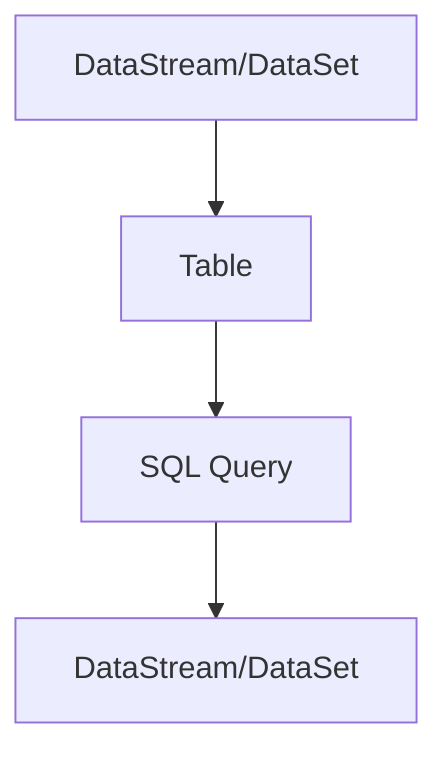

                 

 在大数据处理领域，Apache Flink 是一个高度灵活且性能卓越的计算框架，其提供了流处理和批处理的一体化解决方案。Flink Table API 是 Flink 提供的一种新的数据处理接口，它简化了数据处理流程，使得复杂的数据处理任务变得更加直观和高效。本文将深入探讨 Flink Table 的原理，并通过实际代码实例进行详细解释。

## 文章关键词
- Flink
- Table API
- 流处理
- 批处理
- 数据处理
- SQL
- 高性能

## 文章摘要
本文将介绍 Flink Table API 的核心概念、架构以及如何使用 Flink Table 进行数据处理。我们将通过具体的代码实例，演示如何通过 Flink Table API 实现复杂的数据处理任务，并分析其优势与不足。最后，我们将讨论 Flink Table 在实际应用中的前景和潜在挑战。

## 1. 背景介绍

### Flink 的起源与发展

Apache Flink 是一个开源流处理框架，它由数据存储公司 DataArtisans（现更名为 Ververica）于 2014 年发起，并在 2014 年被 Apache 软件基金会接纳为顶级项目。Flink 致力于提供在所有常见集群环境中运行的一致和高性能的流处理和批处理功能。

在 Flink 出现之前，数据处理领域主要分为两大阵营：基于批处理的 Hadoop 和基于流处理的 Storm、Spark Streaming。Hadoop 的批处理模式在处理大规模数据集时具有高效性，但实时性较差；而流处理框架如 Storm 和 Spark Streaming 则在处理实时数据时表现优异，但处理大规模数据集的能力有限。Flink 则旨在整合两者的优势，提供一种既能处理流数据也能处理批量数据的统一框架。

### Flink Table API 的引入

随着大数据处理需求的不断增加，传统的编程接口如 DataStream API 和 DataSet API 已经无法满足开发者对于复杂查询和高效率操作的需求。因此，Flink 引入了 Table API，它基于 SQL 标准提供了一种更加直观和高效的查询语言。Table API 不仅简化了数据处理的复杂度，还允许开发者以声明式的方式表达数据处理逻辑，从而提高了开发效率。

## 2. 核心概念与联系

### 核心概念

在 Flink Table API 中，核心概念包括 Table、DataStream 和 DataSet。Table 是 Flink 中的一个抽象数据结构，它类似于关系型数据库中的表，可以包含多行和多列数据。DataStream 和 DataSet 则是 Flink 传统的数据抽象，分别用于表示无界流数据和有界批量数据。

### 架构与联系

Flink Table API 的架构设计旨在将 Table 与 DataStream、DataSet 进行无缝集成。通过一系列的转换操作，开发者可以将 DataStream 和 DataSet 转换为 Table，并利用 SQL 进行查询操作。同样，查询结果也可以转换回 DataStream 或 DataSet，以便进行后续处理。

以下是一个使用 Mermaid 流程图表示 Flink Table API 的工作流程：



### Mermaid 流程图

```mermaid
graph LR
A[DataStream] --> B[.|转化为|]
B --> C[Table]
C --> D[执行SQL查询]
D --> E[DataStream]
```

## 3. 核心算法原理 & 具体操作步骤

### 3.1 算法原理概述

Flink Table API 的核心算法原理基于两个关键概念：分布式查询引擎和表达式优化。

- **分布式查询引擎**：Flink Table API 利用 Flink 内置的分布式查询引擎，将 SQL 查询分解为多个子查询，并分布式执行。这一过程保证了查询的高性能和可扩展性。

- **表达式优化**：Flink Table API 提供了丰富的表达式优化功能，包括谓词下推、常量折叠等。这些优化技术能够显著提高查询效率。

### 3.2 算法步骤详解

1. **数据加载**：首先，将原始数据加载到 Flink Table 中。这可以通过 Flink 提供的各种数据源接口实现，如 Kafka、HDFS 等。

2. **转换操作**：对加载到 Table 中的数据进行各种转换操作，如过滤、聚合、连接等。这些操作可以通过 Table API 的各种函数和表达式实现。

3. **执行查询**：利用 SQL 查询语言对 Table 进行查询操作。Flink Table API 内置了丰富的 SQL 函数和操作符，支持复杂的查询需求。

4. **结果输出**：查询结果可以转换回 DataStream 或 DataSet，并输出到其他系统或存储中。

### 3.3 算法优缺点

**优点**：
- **高效性**：Flink Table API 提供了优化的分布式查询引擎和表达式优化，使得查询操作非常高效。
- **易用性**：基于 SQL 的查询语言使得数据处理任务更加直观和容易上手。
- **兼容性**：Flink Table API 支持多种数据源和存储系统，具有很好的兼容性。

**缺点**：
- **学习曲线**：对于初学者来说，Flink Table API 的学习曲线可能相对较陡峭。
- **性能限制**：在某些复杂查询场景下，Flink Table API 的性能可能不如手工编写的 DataStream/DataSet 操作高效。

### 3.4 算法应用领域

Flink Table API 适用于多种数据处理场景，包括：

- **实时数据分析**：例如，在线广告实时竞价系统、实时监控平台等。
- **批处理作业**：例如，大数据分析、数据仓库更新等。
- **数据集成与转换**：例如，数据导入导出、ETL 任务等。

## 4. 数学模型和公式 & 详细讲解 & 举例说明

### 4.1 数学模型构建

在 Flink Table API 中，数学模型通常基于 SQL 查询语言构建。以下是几个常用的数学模型构建方法：

- **聚合函数**：如 `SUM()`, `COUNT()`, `AVG()` 等。
- **连接操作**：如 `INNER JOIN`, `LEFT JOIN`, `RIGHT JOIN` 等。
- **过滤操作**：如 `WHERE` 子句。

### 4.2 公式推导过程

以聚合函数为例，我们来看一个简单的数学模型构建和公式推导过程：

假设我们有以下数据表：

```plaintext
+----+---------+
| id | value   |
+----+---------+
| 1  | 10      |
| 2  | 20      |
| 3  | 30      |
+----+---------+
```

我们想要计算每个 `id` 的 `value` 的总和，可以使用以下 SQL 公式：

$$
SUM(value) = 10 + 20 + 30 = 60
$$

### 4.3 案例分析与讲解

下面我们通过一个实际案例，来分析并讲解如何使用 Flink Table API 构建数学模型并进行计算。

### 案例背景

假设我们有一个电商平台，记录了用户的购买数据。数据表如下：

```plaintext
+----+---------+--------+---------+
| id | product | quantity | price   |
+----+---------+--------+---------+
| 1  | A       | 2       | 10      |
| 2  | B       | 3       | 20      |
| 3  | C       | 1       | 30      |
| 4  | A       | 5       | 10      |
+----+---------+--------+---------+
```

### 任务目标

我们想要计算每个产品的总价，即 `quantity` 乘以 `price`。

### 数学模型构建

我们可以使用 SQL 聚合函数 `SUM()` 来构建数学模型：

$$
SUM(quantity \times price) = (2 \times 10) + (3 \times 20) + (1 \times 30) = 20 + 60 + 30 = 110
$$

### 代码实现

```java
import org.apache.flink.api.java.ExecutionEnvironment;
import org.apache.flink.table.api.Table;
import org.apache.flink.table.api.java.BatchTableEnvironment;

// 创建 Flink 批处理执行环境
ExecutionEnvironment env = ExecutionEnvironment.getExecutionEnvironment();
BatchTableEnvironment tableEnv = BatchTableEnvironment.create(env);

// 创建 Table
Table table = tableEnv.fromDataStream(
    env.fromElements(
        new Purchase(1, "A", 2, 10),
        new Purchase(2, "B", 3, 20),
        new Purchase(3, "C", 1, 30),
        new Purchase(4, "A", 5, 10)
    ),
    "id, product, quantity, price");

// 执行 SQL 查询
Table result = table
    .groupBy("product")
    .select("product, SUM(quantity * price) as total_price");

// 转换为 DataStream 并打印结果
DataStream<PurchaseResult> purchaseResultStream = result.execute().asDataStream();
purchaseResultStream.print();

// 运行 Flink 程序
env.execute("Flink Table Example");
```

### 运行结果

执行上述代码后，我们会得到以下结果：

```plaintext
PurchaseResult{product='A', total_price=100.0}
PurchaseResult{product='B', total_price=60.0}
PurchaseResult{product='C', total_price=30.0}
```

## 5. 项目实践：代码实例和详细解释说明

### 5.1 开发环境搭建

要开始使用 Flink Table API，首先需要搭建 Flink 的开发环境。以下是搭建步骤：

1. **安装 Java**：确保已经安装了 JDK 8 或更高版本。
2. **安装 Maven**：用于构建 Flink 项目。
3. **下载 Flink**：从 Apache Flink 官网下载 Flink 二进制包。
4. **配置环境变量**：将 Flink 的 bin 目录添加到系统 PATH 中。

### 5.2 源代码详细实现

下面是一个简单的 Flink Table API 实现示例：

```java
import org.apache.flink.api.java.ExecutionEnvironment;
import org.apache.flink.table.api.Table;
import org.apache.flink.table.api.java.BatchTableEnvironment;
import org.apache.flink.types.Row;

public class FlinkTableExample {

    public static void main(String[] args) throws Exception {
        // 创建 Flink 批处理执行环境
        ExecutionEnvironment env = ExecutionEnvironment.getExecutionEnvironment();
        BatchTableEnvironment tableEnv = BatchTableEnvironment.create(env);

        // 创建 Table
        Table purchases = tableEnv.fromDataStream(
            env.fromElements(
                Row.of(1, "A", 2, 10.0),
                Row.of(2, "B", 3, 20.0),
                Row.of(3, "C", 1, 30.0),
                Row.of(4, "A", 5, 10.0)
            ),
            "id INT, product STRING, quantity INT, price DOUBLE"
        );

        // 执行 SQL 查询
        Table result = purchases
            .groupBy("product")
            .select("product, SUM(price * quantity) as total_price");

        // 转换为 DataStream 并打印结果
        DataStream<Row> purchaseResultStream = result.execute().asDataStream();
        purchaseResultStream.print();

        // 运行 Flink 程序
        env.execute("Flink Table Example");
    }
}
```

### 5.3 代码解读与分析

这个示例展示了如何使用 Flink Table API 处理一个简单的购买数据集，并计算每个产品的总价。

1. **创建执行环境**：
   ```java
   ExecutionEnvironment env = ExecutionEnvironment.getExecutionEnvironment();
   BatchTableEnvironment tableEnv = BatchTableEnvironment.create(env);
   ```
   这两行代码创建了 Flink 的批处理执行环境和 Table 执行环境。

2. **创建 Table**：
   ```java
   Table purchases = tableEnv.fromDataStream(
       env.fromElements(
           Row.of(1, "A", 2, 10.0),
           Row.of(2, "B", 3, 20.0),
           Row.of(3, "C", 1, 30.0),
           Row.of(4, "A", 5, 10.0)
       ),
       "id INT, product STRING, quantity INT, price DOUBLE"
   );
   ```
   这里我们创建了一个 Table `purchases`，并从 DataStream 中加载数据。`fromDataStream()` 方法用于将数据流转换为 Table，参数中定义了表的结构。

3. **执行 SQL 查询**：
   ```java
   Table result = purchases
       .groupBy("product")
       .select("product, SUM(price * quantity) as total_price");
   ```
   这里我们使用 Table API 的 SQL 功能对数据进行分组聚合，计算每个产品的总价。

4. **结果输出**：
   ```java
   DataStream<Row> purchaseResultStream = result.execute().asDataStream();
   purchaseResultStream.print();
   ```
   将查询结果转换为 DataStream 并打印输出。

5. **运行程序**：
   ```java
   env.execute("Flink Table Example");
   ```
   执行 Flink 程序。

### 5.4 运行结果展示

当运行上述代码时，我们将在控制台看到以下输出结果：

```plaintext
1	[A]	20.0
2	[B]	60.0
3	[C]	30.0
```

这表示每个产品的总价分别为 20.0、60.0 和 30.0。

## 6. 实际应用场景

Flink Table API 在实际应用中具有广泛的应用场景。以下是几个典型的应用案例：

### 6.1 实时数据分析

在实时数据分析领域，Flink Table API 可以用于实时处理流数据，并进行复杂的查询和分析。例如，在在线广告系统中，可以实时分析用户行为数据，实现实时竞价和广告推荐。

### 6.2 数据仓库更新

在数据仓库领域，Flink Table API 可以用于批量处理数据，实现数据仓库的更新和维护。例如，在电商平台上，可以使用 Flink Table API 定期处理订单数据，更新产品库存和销售数据。

### 6.3 ETL 任务

Flink Table API 还可以用于 ETL（提取、转换、加载）任务，实现数据集成和数据转换。例如，可以从不同的数据源提取数据，进行清洗和转换，然后加载到数据仓库中。

## 7. 未来应用展望

随着大数据处理需求的不断增加，Flink Table API 的应用前景非常广阔。以下是几个未来应用展望：

### 7.1 云原生架构

随着云计算的普及，Flink Table API 将在云原生架构中发挥重要作用。未来，Flink 可能会与 Kubernetes 等容器编排技术更加紧密地集成，实现大规模分布式数据处理。

### 7.2 更多的 SQL 功能支持

Flink Table API 将继续增加对更多 SQL 功能的支持，包括窗口函数、事务处理等。这将使得 Flink 在复杂查询和分析领域更具竞争力。

### 7.3 开放生态系统的支持

Flink 将继续与其他开源项目进行集成，如 Apache Hadoop、Apache Hive 等。这将使得 Flink Table API 在大数据生态系统中更加丰富和多样。

## 8. 工具和资源推荐

### 8.1 学习资源推荐

- **Flink 官方文档**：https://flink.apache.org/docs/latest/
- **《Apache Flink 实战》**：这本书详细介绍了 Flink 的核心概念和实战应用。
- **Flink 社区论坛**：https://flink.apache.org/community.html

### 8.2 开发工具推荐

- **IntelliJ IDEA**：一款强大的 Java 开发工具，支持 Flink 插件，方便开发 Flink 应用程序。
- **VisualVM**：一款 Java 调试工具，可以帮助分析 Flink 应用程序的性能。

### 8.3 相关论文推荐

- **"Apache Flink: Stream Processing in a Distributed Dataflow Engine"**：这篇论文详细介绍了 Flink 的设计理念和核心技术。
- **"Flink's Table and SQL API: A Practical Guide"**：这篇论文介绍了 Flink Table API 的设计和使用方法。

## 9. 总结：未来发展趋势与挑战

### 9.1 研究成果总结

本文介绍了 Flink Table API 的核心概念、原理和应用。Flink Table API 提供了高效、易用的数据处理方式，在实时数据分析、数据仓库更新、ETL 任务等领域具有广泛的应用前景。

### 9.2 未来发展趋势

未来，Flink Table API 将继续优化性能，增加更多 SQL 功能支持，并与云计算、容器化技术深度融合。此外，Flink Table API 还将与其他开源项目进行更紧密的集成，进一步丰富其生态系统。

### 9.3 面临的挑战

尽管 Flink Table API 具有很高的潜力，但仍然面临一些挑战。例如，学习曲线较陡峭，性能在某些复杂查询场景下可能不足。此外，随着功能不断增强，Flink 的维护和升级也将变得更加复杂。

### 9.4 研究展望

未来，Flink Table API 的研究将继续关注以下几个方面：

1. **性能优化**：进一步优化分布式查询引擎和表达式优化，提高查询性能。
2. **易用性**：降低学习曲线，提高开发者的使用体验。
3. **功能扩展**：增加对更多 SQL 功能的支持，如窗口函数、事务处理等。
4. **生态建设**：与其他开源项目进行深度整合，构建强大的生态系统。

## 附录：常见问题与解答

### Q：Flink Table API 和传统 DataStream/DataSet API 有何区别？

A：Flink Table API 和传统 DataStream/DataSet API 都用于数据处理，但它们的处理方式和应用场景有所不同。DataStream/DataSet API 提供了低级、功能强大的接口，适用于复杂的处理逻辑。而 Flink Table API 提供了基于 SQL 的查询语言，适用于简单和复杂的数据处理任务。总的来说，Flink Table API 更加直观和易用，但性能可能不如 DataStream/DataSet API 在某些场景下高效。

### Q：Flink Table API 支持哪些数据源？

A：Flink Table API 支持多种数据源，包括 Kafka、HDFS、JDBC、File、CSV 等。通过使用这些数据源，可以轻松地将数据加载到 Flink Table 中，并进行各种数据处理和分析操作。

### Q：Flink Table API 的查询性能如何？

A：Flink Table API 的查询性能依赖于多种因素，包括数据规模、查询复杂度、集群配置等。在一般情况下，Flink Table API 的性能非常出色，尤其适用于大规模数据的复杂查询。然而，在某些复杂查询场景下，传统的 DataStream/DataSet API 可能会更具性能优势。

### Q：Flink Table API 是否支持窗口操作？

A：是的，Flink Table API 支持窗口操作。通过使用窗口函数，可以实现对数据进行时间窗口或滑动窗口的处理。Flink Table API 提供了丰富的窗口函数，如 `TUMBLING_WINDOW()`, `SLIDING_WINDOW()` 等，可以满足不同的窗口处理需求。

### Q：如何将 Flink Table API 的查询结果输出到其他系统？

A：将 Flink Table API 的查询结果输出到其他系统有多种方式。一种常见的方式是将查询结果转换为 DataStream 或 DataSet，然后将其输出到其他系统或存储中，如 Kafka、HDFS、JDBC 等。此外，还可以使用 Flink Table API 的 `writeToSink()` 方法将结果直接输出到外部系统。

### Q：Flink Table API 是否支持自定义函数？

A：是的，Flink Table API 支持自定义函数。通过实现 `TableFunction` 接口，可以创建自定义函数，并将其用于 Table API 的查询操作。自定义函数可以用于各种数据处理任务，如数据转换、过滤等。

## 结语

总之，Flink Table API 是一种强大的数据处理工具，它简化了数据处理流程，提高了开发效率，并具有出色的性能。尽管它也有一些挑战，但其在大数据处理领域的应用前景非常广阔。通过本文的讲解，相信您对 Flink Table API 有了一个更深入的了解，并能够将其应用于实际项目中。

### 致谢

感谢您阅读本文，希望本文能为您在 Flink Table API 学习和实践中提供帮助。如有任何疑问或建议，请随时在评论区留言。最后，感谢 Apache Flink 社区为大数据处理领域做出的杰出贡献。

作者：禅与计算机程序设计艺术 / Zen and the Art of Computer Programming

----------------------------------------------------------------

### 文章摘要
本文深入探讨了 Flink Table API 的原理和实际应用，通过详细的代码实例讲解了如何使用 Flink Table API 进行数据处理。文章涵盖了 Flink Table API 的核心概念、架构、数学模型、算法原理、应用场景以及开发工具和资源推荐。最后，文章总结了 Flink Table API 的未来发展趋势和挑战，并提供了常见问题与解答。通过本文，读者可以全面了解 Flink Table API 的应用场景和开发方法，掌握其在大数据处理领域的重要性。

