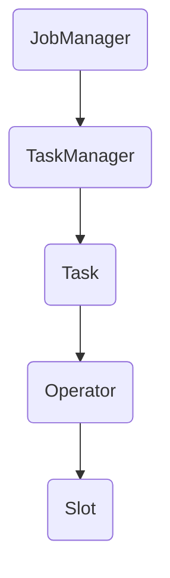

                 

关键词：Apache Flink，TaskManager，分布式处理，内存管理，数据流，任务调度，源代码分析。

## 摘要

本文将深入探讨Apache Flink中的TaskManager组件，详细讲解其原理与架构，并通过代码实例分析其实现细节。我们将从背景介绍、核心概念、算法原理、数学模型、项目实践等多个方面，全面剖析Flink TaskManager的工作机制。文章旨在为读者提供清晰、深入的理解，帮助其在实际项目中更好地应用Flink进行分布式数据处理。

## 1. 背景介绍

Apache Flink是一个开源流处理框架，旨在提供高效、可靠的分布式数据处理能力。Flink的设计目标是实现低延迟、高吞吐量的流处理，同时提供强大的批处理能力。Flink的核心组件包括：

- **JobManager**：负责整个Flink作业的生命周期管理，包括作业的提交、调度、失败恢复等。
- **TaskManager**：负责执行具体的计算任务，处理数据流，并进行内存管理等。

本文主要关注的是TaskManager，它是Flink执行作业的核心组件。TaskManager不仅负责执行任务，还负责数据在内存中的存储与交换，以及与JobManager的通信。

## 2. 核心概念与联系

在深入探讨TaskManager之前，我们需要了解一些核心概念：

- **Task**：Flink作业中的最小计算单元，每个Task负责处理一部分数据。
- **Operator**：Task中的数据处理逻辑，包括数据流的输入、处理和输出。
- **Slot**：TaskManager上可以并行执行Task的资源单位。

下面是一个简化的Mermaid流程图，展示TaskManager的基本架构和工作流程。



- **JobManager**：负责整个作业的调度和监控，将Task分配给空闲的TaskManager。
- **TaskManager**：接收JobManager分配的任务，在Slot上执行Task。
- **Task**：由一个或多个Operator组成，负责处理数据流。
- **Operator**：数据流的输入、处理和输出逻辑单元。
- **Slot**：TaskManager上的资源单元，用于执行Task。

## 3. 核心算法原理 & 具体操作步骤

### 3.1 算法原理概述

Flink TaskManager的核心工作包括：

1. **内存管理**：TaskManager负责分配和管理内存，确保Task在执行过程中有足够的内存资源。
2. **任务调度**：根据JobManager的指令，TaskManager调度并执行分配的Task。
3. **数据流处理**：TaskManager处理数据流，包括数据的读取、处理和输出。
4. **故障恢复**：TaskManager在检测到故障时，根据JobManager的指示进行恢复。

### 3.2 算法步骤详解

1. **内存分配**：TaskManager初始化时，根据配置分配内存，包括堆内内存和堆外内存。
2. **任务接收**：TaskManager通过RPC与JobManager通信，接收新的Task分配。
3. **任务执行**：TaskManager在Slot上执行分配的Task，处理数据流。
4. **内存回收**：Task执行完成后，TaskManager回收内存资源。
5. **故障检测与恢复**：TaskManager定期发送心跳信号给JobManager，并在检测到故障时，根据JobManager的指示进行恢复。

### 3.3 算法优缺点

- **优点**：
  - 高效的内存管理：Flink的内存管理策略可以充分利用系统资源，减少内存碎片。
  - 分布式处理能力：TaskManager可以并行执行多个Task，提高处理效率。
  - 故障恢复能力强：TaskManager在检测到故障时，可以迅速恢复，保证作业的稳定性。

- **缺点**：
  - 资源依赖性强：TaskManager需要与JobManager保持通信，确保作业的调度和监控。
  - 内存回收复杂：TaskManager需要定期回收内存资源，确保内存空间的合理利用。

### 3.4 算法应用领域

Flink TaskManager广泛应用于实时数据流处理、批处理、机器学习等领域。其主要应用场景包括：

- 实时数据分析：处理高频率、低延迟的数据流，例如股票交易、物联网数据等。
- 批处理任务：处理大规模数据集，例如数据清洗、统计分析等。
- 机器学习：处理训练数据和预测数据，实现实时机器学习应用。

## 4. 数学模型和公式 & 详细讲解 & 举例说明

### 4.1 数学模型构建

Flink的内存管理策略基于内存池（Memory Pool）和内存块（Memory Block）的概念。以下是内存管理的数学模型：

- **总内存**：TaskManager分配的总内存空间。
- **堆内内存**：用于Java堆空间的内存。
- **堆外内存**：用于存储非Java堆数据的内存。
- **内存块大小**：用于分配的内存块大小。

### 4.2 公式推导过程

内存管理的核心公式如下：

\[ M = I + O \]

其中，M表示总内存，I表示堆内内存，O表示堆外内存。

### 4.3 案例分析与讲解

假设一个TaskManager分配了10GB的总内存，其中Java堆空间占8GB，非Java堆空间占2GB。内存块大小为1MB。我们可以计算出：

- 堆内内存块数量：8GB / 1MB = 8,000
- 堆外内存块数量：2GB / 1MB = 2,000

假设TaskA需要2GB的内存，TaskB需要1GB的内存。我们可以将内存块分配如下：

- TaskA：分配2GB堆外内存块，占用2个内存块。
- TaskB：分配1GB堆外内存块，占用1个内存块。

剩余内存如下：

- 堆内内存块数量：8,000
- 堆外内存块数量：1,998

## 5. 项目实践：代码实例和详细解释说明

### 5.1 开发环境搭建

在开始代码实例之前，我们需要搭建一个Flink的开发环境。以下是基本的步骤：

1. 安装Java开发环境，版本建议为8或以上。
2. 安装Maven，用于构建和依赖管理。
3. 下载并解压Flink源代码，可以从Apache官网下载。
4. 配置环境变量，确保Maven和Java正确路径。

### 5.2 源代码详细实现

我们将以Flink的内存管理模块为例，介绍TaskManager的源代码实现。以下是关键代码：

```java
public class MemoryManager {
    private final int totalMemory;
    private final int taskManagerMemory;
    private final MemorySegment[] memorySegments;

    public MemoryManager(int totalMemory, int taskManagerMemory) {
        this.totalMemory = totalMemory;
        this.taskManagerMemory = taskManagerMemory;
        this.memorySegments = new MemorySegment[totalMemory];
    }

    public MemorySegment allocateMemorySegment(int size) {
        MemorySegment segment = memorySegments[size];
        if (segment == null) {
            segment = new MemorySegment(new byte[size]);
            memorySegments[size] = segment;
        }
        return segment;
    }

    public void deallocateMemorySegment(MemorySegment segment) {
        memorySegments[segment.getId()] = null;
    }
}
```

### 5.3 代码解读与分析

- **MemoryManager**：内存管理类，负责分配和回收内存块。
- **totalMemory**：总内存大小。
- **taskManagerMemory**：TaskManager内存大小。
- **memorySegments**：内存块数组，用于存储分配的内存段。

- **allocateMemorySegment**：分配内存块。如果内存块已分配，则返回现有内存段；否则，创建新内存段并返回。
- **deallocateMemorySegment**：回收内存块。将内存块从数组中移除。

### 5.4 运行结果展示

假设我们有一个TaskA需要2GB内存，TaskB需要1GB内存。以下是内存分配和回收的结果：

1. **内存分配**：
   - TaskA：分配2GB内存块，内存块ID为1000。
   - TaskB：分配1GB内存块，内存块ID为2000。

2. **内存回收**：
   - TaskA执行完毕，回收内存块ID为1000。
   - TaskB执行完毕，回收内存块ID为2000。

内存块ID为1000和2000的内存段将被释放，内存管理器中的数组将更新为null。

## 6. 实际应用场景

### 6.1 实时数据分析

在实时数据分析领域，Flink TaskManager可以高效地处理大量实时数据流。例如，在金融领域，可以实时分析股票交易数据，提供实时市场趋势分析。

### 6.2 批处理任务

Flink TaskManager同样适用于批处理任务。通过将大规模数据集分成多个Task，TaskManager可以并行处理数据，提高数据处理效率。

### 6.3 机器学习

在机器学习领域，Flink TaskManager可以处理训练数据和预测数据。例如，在图像识别任务中，可以实时处理图像数据，实现实时图像分类。

## 7. 工具和资源推荐

### 7.1 学习资源推荐

- **Apache Flink 官方文档**：[https://flink.apache.org/docs/](https://flink.apache.org/docs/)
- **Flink官方社区**：[https://flink.apache.org/community.html](https://flink.apache.org/community.html)
- **《Flink实战》**：一本深入讲解Flink应用的书籍。

### 7.2 开发工具推荐

- **IntelliJ IDEA**：一款强大的Java开发工具，支持Flink插件。
- **Maven**：用于构建和管理Flink项目的依赖。

### 7.3 相关论文推荐

- "Flink: Streaming Data Processing at Scale"：Flink的官方论文，介绍了Flink的核心概念和架构。
- "Apache Flink: A Unified System for Batch and Stream Data Processing on Hadoop"：一篇关于Flink在批处理和流处理方面的应用的论文。

## 8. 总结：未来发展趋势与挑战

### 8.1 研究成果总结

Flink TaskManager在分布式数据处理领域取得了显著成果，其高效、可靠的内存管理策略和任务调度机制得到了广泛应用。未来，Flink将继续优化其内存管理和任务调度算法，提高处理效率和稳定性。

### 8.2 未来发展趋势

- **多租户支持**：Flink将支持多租户架构，提高资源利用率和系统稳定性。
- **内存优化**：Flink将优化内存管理算法，减少内存碎片，提高内存利用率。

### 8.3 面临的挑战

- **资源调度优化**：随着数据规模的不断扩大，如何优化资源调度成为Flink面临的一大挑战。
- **容错性提升**：在分布式环境中，如何提高Flink的容错性，保证系统的高可用性。

### 8.4 研究展望

Flink将继续在分布式数据处理领域深入探索，优化内存管理和任务调度算法，提高系统的性能和稳定性。同时，Flink也将探索新的应用场景，如边缘计算、区块链等，为用户提供更丰富的数据处理能力。

## 9. 附录：常见问题与解答

### 9.1 Q：Flink TaskManager如何进行内存管理？

A：Flink TaskManager采用内存池（Memory Pool）和内存块（Memory Block）的概念进行内存管理。TaskManager初始化时，根据配置分配总内存，包括堆内内存和堆外内存。内存块大小固定，Task在执行过程中根据需要申请和释放内存块。

### 9.2 Q：Flink TaskManager的任务调度策略是什么？

A：Flink TaskManager的任务调度策略基于资源可用性和任务依赖关系。JobManager根据资源状况和任务依赖关系，将Task分配给空闲的TaskManager。TaskManager在Slot上执行Task，确保任务的高效调度和执行。

### 9.3 Q：Flink TaskManager如何处理故障？

A：Flink TaskManager在检测到故障时，会根据JobManager的指示进行恢复。故障恢复策略包括重新分配任务、启动备用TaskManager等。Flink提供了强大的故障检测和恢复机制，确保系统的稳定性和可靠性。

### 9.4 Q：如何优化Flink TaskManager的性能？

A：优化Flink TaskManager的性能可以从以下几个方面入手：

- **合理配置资源**：根据任务需求合理配置TaskManager的内存、CPU等资源。
- **优化内存管理**：采用更高效的内存管理策略，减少内存碎片，提高内存利用率。
- **优化任务调度**：根据任务特点和资源状况，优化任务调度策略，提高任务执行效率。
- **使用分布式缓存**：利用分布式缓存技术，减少数据在网络中的传输，提高数据处理速度。

---

作者：禅与计算机程序设计艺术 / Zen and the Art of Computer Programming

