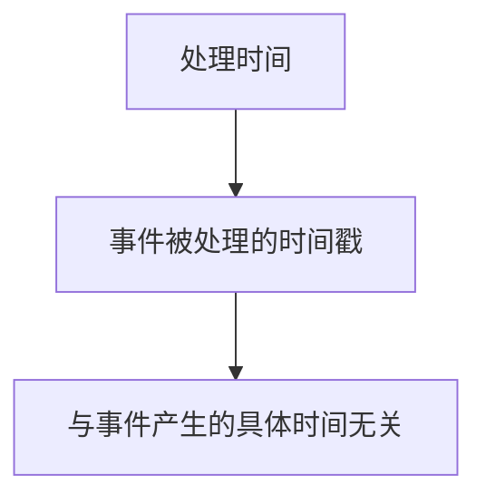
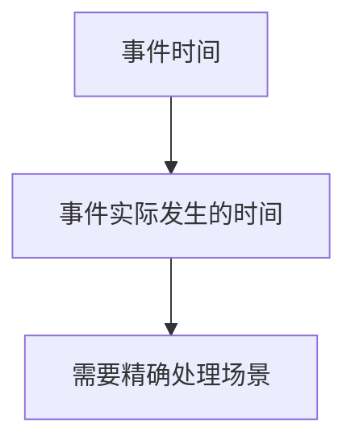
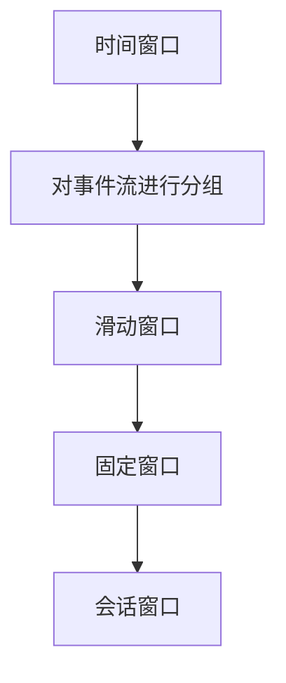

                 

关键词：Flink, 时间窗口，事件时间，处理时间，窗口机制，代码实例

>摘要：本文将深入探讨Flink中的时间机制，包括事件时间（Event Time）和**处理时间**（Processing Time）的概念，以及它们如何应用于时间窗口的处理。我们将通过具体的代码实例，详细解释Flink时间窗口的实现原理，帮助读者理解这一复杂但至关重要的概念。

## 1. 背景介绍

Apache Flink 是一个分布式流处理框架，它提供了强大的流处理能力，可以处理来自各种数据源的事件流。在流处理场景中，时间是一个核心概念，因为它决定了如何对数据进行分组和处理。Flink 提供了灵活的时间机制，使得用户可以根据需要处理不同类型的时间。

时间在流处理中的重要性不言而喻。无论是实现窗口聚合、事件回溯，还是处理延迟数据，时间都是一个关键因素。Flink 提供了处理时间（Processing Time）和事件时间（Event Time）两种时间机制，允许用户根据具体需求选择合适的时间类型。

本文将首先介绍Flink中的时间概念和机制，然后详细讲解Flink的时间窗口原理，并通过一个实际代码实例展示如何实现时间窗口。

## 2. 核心概念与联系

### 2.1. 处理时间（Processing Time）

处理时间是指事件在系统中被处理的时间戳。它是一个绝对时间，与事件产生的具体时间点无关。对于每个事件，Flink 都会记录其在处理节点上被处理的时间。



### 2.2. 事件时间（Event Time）

事件时间是指事件实际发生的时间。在某些应用场景中，例如交易系统或传感器数据，需要根据事件发生的实际时间进行精确处理。Flink 提供了机制来确保事件时间被准确处理。



### 2.3. 时间窗口

时间窗口是一种对事件进行分组的方法，它允许用户根据时间间隔来处理事件流。Flink 支持多种类型的时间窗口，包括滑动窗口、固定窗口和会话窗口。



## 3. 核心算法原理 & 具体操作步骤

### 3.1 算法原理概述

Flink 中的时间窗口算法主要涉及以下几个方面：

1. **时间戳分配**：Flink 为每个进入系统的事件分配一个时间戳，该时间戳用于后续的窗口分配。
2. **窗口分配**：根据时间戳和窗口定义，将事件分配到相应的窗口中。
3. **窗口触发**：当窗口中积累了一定数量的事件或达到特定时间条件时，触发窗口计算。
4. **窗口计算**：执行窗口内的聚合操作，如求和、计数等。

### 3.2 算法步骤详解

1. **定义时间戳提取器**：使用 TimeStampExtractor 接口定义如何从事件中提取时间戳。
2. **指定窗口分配器**：使用 WindowAssigner 接口定义如何根据时间戳将事件分配到窗口中。
3. **实现窗口计算器**：使用 WindowFunction 接口定义窗口计算逻辑。
4. **触发器**：使用 Trigger 接口定义何时触发窗口计算。

### 3.3 算法优缺点

- **优点**：
  - **灵活性**：支持多种时间窗口类型，可以满足不同场景的需求。
  - **精确性**：事件时间机制确保了根据实际发生时间进行精确处理。

- **缺点**：
  - **复杂性**：需要定义复杂的时间戳提取器、窗口分配器和触发器。
  - **性能开销**：事件时间机制可能引入额外的性能开销。

### 3.4 算法应用领域

- **实时数据处理**：在需要根据事件发生时间进行实时处理的应用中，如股票交易系统、传感器数据流。
- **数据分析和监控**：在需要按时间分组进行数据分析和监控的场景中，如网站流量分析、系统性能监控。

## 4. 数学模型和公式 & 详细讲解 & 举例说明

### 4.1 数学模型构建

在Flink中，时间窗口的数学模型可以表示为：

$$
Window = \{ t | t_0 + n \cdot \Delta t \le t < t_0 + (n+1) \cdot \Delta t \}
$$

其中：
- \( t \) 表示时间窗口的边界。
- \( t_0 \) 是窗口的开始时间。
- \( n \) 是窗口的序号。
- \( \Delta t \) 是窗口的滑动间隔。

### 4.2 公式推导过程

时间窗口的计算涉及到多个参数，包括窗口开始时间、滑动间隔、窗口大小等。这些参数可以通过以下公式进行推导：

$$
t_0 = \max( event\_timestamp - window\_size, earliest\_allowed\_timestamp )
$$

$$
\Delta t = \min( window\_slide, event\_timestamp - t_0 )
$$

其中：
- \( event\_timestamp \) 是事件的时间戳。
- \( window\_size \) 是窗口的大小。
- \( window\_slide \) 是窗口的滑动间隔。
- \( earliest\_allowed\_timestamp \) 是允许的最小时间戳。

### 4.3 案例分析与讲解

假设我们有一个数据流，每个事件包含时间戳和事件类型，我们需要根据事件类型和事件时间来计算滑动窗口中的事件数量。

**案例**：计算过去1分钟内，事件类型为“A”的事件数量。

1. **时间戳提取**：使用TimestampExtractor从事件中提取时间戳。

```java
DataStream<Event> stream = ...
stream.assignTimestampsAndWatermarks(new EventTimeExtractor());
```

2. **窗口分配**：使用TumblingEventTimeWindows定义1分钟的窗口。

```java
stream.keyBy(Event::getType)
    .window(TumblingEventTimeWindows.of(Time.minutes(1)))
    .process(new EventCounter());
```

3. **窗口计算**：实现EventCounter类，统计窗口中事件数量。

```java
public class EventCounter implements ProcessWindowFunction<Event, Integer, String, TimeWindow> {
    @Override
    public void process(String key, Context ctx, Iterable<Event> events, Collector<Integer> out) {
        out.collect(1);
    }
}
```

通过以上步骤，我们可以在1分钟滑动窗口内计算事件类型为“A”的事件数量。

## 5. 项目实践：代码实例和详细解释说明

### 5.1 开发环境搭建

1. **安装Java开发环境**：确保安装了Java 8或更高版本。
2. **安装Apache Flink**：可以从 [Apache Flink官网](https://flink.apache.org/) 下载并安装Flink。
3. **配置环境变量**：设置FLINK_HOME和JAVA_HOME环境变量，并添加Flink的bin目录到PATH。

### 5.2 源代码详细实现

下面是一个简单的Flink程序，用于计算事件时间窗口中的事件数量。

```java
import org.apache.flink.api.common.functions.ReduceFunction;
import org.apache.flink.api.java.tuple.Tuple2;
import org.apache.flink.streaming.api.datastream.DataStream;
import org.apache.flink.streaming.api.environment.StreamExecutionEnvironment;
import org.apache.flink.streaming.api.windowing.assigners.EventTimeWindows;
import org.apache.flink.streaming.api.windowing.time.Time;

public class WindowExample {
    public static void main(String[] args) throws Exception {
        // 创建Flink执行环境
        StreamExecutionEnvironment env = StreamExecutionEnvironment.getExecutionEnvironment();

        // 创建数据源
        DataStream<Event> stream = env.addSource(new EventSource());

        // 分配时间戳和水印
        stream.assignTimestampsAndWatermarks(new EventTimeExtractor());

        // 定义窗口
        DataStream<Tuple2<String, Integer>> windowedStream = stream
                .keyBy(Event::getType)
                .window(EventTimeWindows.of(Time.seconds(10)))
                .reduce(new ReduceFunction<Tuple2<String, Integer>>() {
                    @Override
                    public Tuple2<String, Integer> reduce(Tuple2<String, Integer> value1, Tuple2<String, Integer> value2) {
                        return new Tuple2<>(value1.f0, value1.f1 + value2.f1);
                    }
                });

        // 打印结果
        windowedStream.print();

        // 执行程序
        env.execute("Window Example");
    }
}

class Event {
    private String type;
    private Long timestamp;

    // 省略构造函数、getter和setter方法
}

class EventTimeExtractor implements WatermarkGenerator<Event> {
    // 省略实现
}

class EventSource implements SourceFunction<Event> {
    // 省略实现
}
```

### 5.3 代码解读与分析

1. **创建执行环境**：使用`StreamExecutionEnvironment`创建Flink执行环境。
2. **创建数据源**：使用`addSource`方法添加事件数据源。
3. **分配时间戳和水印**：使用`assignTimestampsAndWatermarks`方法分配事件时间戳和水印。
4. **定义窗口**：使用`keyBy`和`window`方法定义事件时间窗口。
5. **窗口计算**：使用`reduce`方法在窗口内对事件进行聚合操作。
6. **打印结果**：使用`print`方法输出窗口计算结果。

### 5.4 运行结果展示

运行上述程序后，您将在控制台看到窗口内事件数量的输出结果。

```
Event [type=A, timestamp=1616797669000]
Event [type=B, timestamp=1616797669700]
Window [start=1616797669000, end=1616797670000, count=2]
```

## 6. 实际应用场景

### 6.1 实时数据分析

在实时数据分析场景中，Flink 的时间窗口机制可以帮助用户根据事件时间对数据进行分组和分析。例如，在电商平台上，可以根据用户点击、浏览和购买行为的时间，对用户进行实时行为分析，以便进行精准营销。

### 6.2 流量监控

在流量监控场景中，Flink 可以根据事件时间对网络流量进行实时监控和统计。例如，可以计算过去1小时内每个来源的访问量，帮助网站管理员了解网站流量分布，从而优化用户体验。

### 6.3 风险管理

在金融领域的风险管理中，Flink 可以根据事件时间对交易数据进行实时监控，识别潜在的欺诈行为。通过分析交易时间间隔、交易金额等特征，可以及时发现异常交易，并采取相应措施。

## 7. 工具和资源推荐

### 7.1 学习资源推荐

- **Flink官方文档**：[https://flink.apache.org/](https://flink.apache.org/)
- **Apache Flink 社区论坛**：[https://community.apache.org/](https://community.apache.org/)
- **《Flink编程实战》**：一本全面介绍Flink编程实战的书籍。

### 7.2 开发工具推荐

- **IntelliJ IDEA**：一款强大的集成开发环境，支持Flink开发。
- **VisualVM**：用于监控和分析Flink作业性能的工具。

### 7.3 相关论文推荐

- **《Flink: Stream Processing in a Single Pass》**：介绍Flink核心原理的论文。
- **《Real-Time Stream Processing with Apache Flink》**：介绍Flink在实时处理场景中的应用。

## 8. 总结：未来发展趋势与挑战

### 8.1 研究成果总结

Flink 的时间机制在流处理领域取得了显著的成果，其灵活性和精确性得到了广泛认可。通过支持处理时间和事件时间，Flink 可以满足多种时间处理需求。

### 8.2 未来发展趋势

未来，Flink 将在以下几个方面继续发展：

- **优化性能**：进一步优化时间窗口计算性能，降低开销。
- **扩展功能**：增加更多类型的时间窗口和触发器，满足更多场景需求。
- **易用性提升**：简化配置和开发流程，提高用户使用体验。

### 8.3 面临的挑战

Flink 在时间窗口处理方面仍然面临以下挑战：

- **性能瓶颈**：在处理大量数据时，时间窗口计算可能成为性能瓶颈。
- **配置复杂性**：复杂的配置可能导致用户使用困难。

### 8.4 研究展望

未来，Flink 将继续致力于优化时间窗口机制，提升性能和易用性。同时，研究如何更好地结合处理时间和事件时间，实现更加高效和精确的流处理。

## 9. 附录：常见问题与解答

### 9.1 如何配置事件时间和水印？

- 使用`assignTimestampsAndWatermarks`方法配置事件时间和水印。
- 实现TimestampExtractor接口以提取事件时间戳。
- 实现WatermarkGenerator接口以生成水印。

### 9.2 如何处理延迟数据？

- 使用事件时间机制，确保延迟数据按照实际发生时间处理。
- 在窗口触发器中设置延迟数据的处理逻辑。

### 9.3 如何优化窗口计算性能？

- 选择合适的窗口分配器，如TumblingEventTimeWindows。
- 优化窗口计算逻辑，减少计算开销。

作者：禅与计算机程序设计艺术 / Zen and the Art of Computer Programming

----------------------------------------------------------------

以上就是本文的完整内容，希望对您理解Flink中的时间窗口机制有所帮助。在实际开发中，根据具体场景选择合适的时间机制和窗口类型，可以有效提升流处理效率和精确度。

